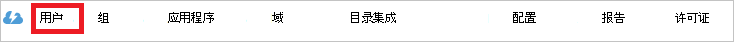

<properties
    pageTitle="教程︰ Azure Active Directory 集成与 SAP 业务 ByDesign |Microsoft Azure"
    description="了解如何配置单一登录 Azure Active Directory 和 SAP 业务 ByDesign 之间。"
    services="active-directory"
    documentationCenter=""
    authors="jeevansd"
    manager="femila"
    editor=""/>

<tags
    ms.service="active-directory"
    ms.workload="identity"
    ms.tgt_pltfrm="na"
    ms.devlang="na"
    ms.topic="article"
    ms.date="09/09/2016"
    ms.author="jeedes"/>

# 教程︰ Azure Active Directory 集成与 SAP 业务 ByDesign

在本教程中，您将学习如何使用 Azure 活动目录 (AD Azure) 集成 SAP 业务 ByDesign。

与 Azure AD 集成 SAP 业务 ByDesign 提供了以下好处︰

- 您可以控制有权访问 SAP 业务 ByDesign Azure AD 中
- 您可以其 Azure 的广告帐户使用户可以自动获取签名上到 SAP 业务 ByDesign （单一登录）
- 您可以管理您的帐户在一个中心位置的 Azure 的传统门户网站

如果您想要了解有关使用 Azure AD 的 SaaS 应用程序集成的更多详细信息，请参阅[什么是应用程序访问和使用 Azure Active Directory 的单一登录](active-directory-appssoaccess-whatis.md)。

## 系统必备组件

要配置 SAP 业务 ByDesign Azure 广告集成，您需要以下各项︰

- Azure 广告订阅
- 在已启用的订阅了 SAP 业务 ByDesign 单点登录

> [AZURE.NOTE] 若要测试步骤在本教程中，我们不建议使用生产环境中。

若要测试步骤在本教程中，您应按照这些建议︰

- 您不应使用生产环境中，除非这是必要的。
- 如果没有 Azure AD 试用环境，您可以获得一个月试用版在[这里](https://azure.microsoft.com/pricing/free-trial/)。

## 方案说明
在本教程中，您将测试 Azure AD 单一登录在测试环境中。

在本教程中介绍的方案由两个主要的构造块组成︰

1. 从库中添加 SAP 业务 ByDesign
2. 配置和测试 Azure AD 单一登录

## 从库中添加 SAP 业务 ByDesign
若要配置与的集成 SAP 业务 ByDesign Azure 广告，您需要将 SAP 业务 ByDesign 从库添加到托管的 SaaS 应用程序的列表。

**要从库添加 SAP 业务 ByDesign，请执行以下步骤︰**

1. 在**Azure 的传统门户网站**，在左侧的导航窗格中，单击**活动目录**。

    ![活动目录][1]

2. 从**目录**列表中，选择要为其启用目录集成的目录。

3. 若要打开应用程序视图中，目录视图中，单击顶部的菜单中的**应用程序**。

    ![应用程序][2]

4. 单击页面底部的**添加**。

    ![应用程序][3]

5. 在**您想要执行**对话框中，单击**添加应用程序从库**。

    ![应用程序][4]

6. 在搜索框中，键入**SAP 业务 ByDesign**。

    

7. 在结果窗格中，选择**SAP 业务 ByDesign**，，然后单击**完成**添加应用程序。

    

##  配置和测试 Azure AD 单一登录
在本部分中，配置和测试 Azure AD 单一登录 SAP 业务 ByDesign 基于一个名为"Britta Simon"的测试用户。

对于单一登录工作，Azure 广告需要知道对应的用户在 SAP 业务 ByDesign 给用户在 Azure 的广告。 换句话说，Azure AD 用户和相关的用户在 SAP 业务 ByDesign 之间的链接关系需要建立。

此链接关系的建立在 Azure 广告作为 SAP 业务 ByDesign 中的**用户名**的值指定的**用户名**的值。

要配置和 Azure AD 单一登录与 SAP 业务 ByDesign 测试，您需要完成以下构造块︰

1. **[Azure AD 配置单一登录](#configuring-azure-ad-single-sign-on)**-若要使用户可以使用此功能。
2. **[创建 Azure 广告测试用户](#creating-an-azure-ad-test-user)**的 Azure AD 单一登录 Britta Simon 与测试。
3. **[创建 SAP 业务 ByDesign 测试用户](#creating-an-sap-business-bydesign-test-user)**-在 SAP 业务 ByDesign 链接到她的 Azure 广告表示具有 Britta Simon 的副本。
4. **[分配的 Azure 广告测试用户](#assigning-the-azure-ad-test-user)**-启用 Britta Simon Azure AD 单一登录使用。
5. **[测试单一登录](#testing-single-sign-on)**的验证配置是否有效。

### Azure AD 单一登录配置

在本节中，您 Azure AD single sign-on 等传统门户中启用并配置单一登录 SAP 业务 ByDesign 应用程序中。

SAP 业务 ByDesign 应用程序需要以特定格式的 SAML 断言。 请配置该应用程序的以下声明。 您可以从应用程序的**"Atrribute"**选项卡上管理这些属性的值。 下面的屏幕快照显示此示例。 

**要配置 Azure AD 单一登录 SAP 业务 ByDesign，请执行以下步骤︰**

1. 在 Azure 经典门户中， **SAP 业务 ByDesign**应用程序集成在页上，在菜单上，单击**属性**。

     

2. 在属性 SAML 令牌的属性列表中，选择 nameidentifier 属性，然后单击**编辑**。

     

3. 在编辑用户属性对话框中，请执行以下步骤︰

     

    一。 从属性值列表中，选择**ExtractMailPrefix()**功能

    b。 从邮件列表中，选择想要使用针对您的实施用户属性。 
    例如，如果您想要用作唯一用户标识符雇员 id 属性值存储在 ExtensionAttribute2 中，然后选择**user.extensionattribute2**。 

    c。 单击**完成**。 
    

4. 在经典的门户，在**SAP 业务 ByDesign**应用程序集成页上，单击**配置单一登录****配置单一登录**对话框打开。
     
    ![配置单一登录][6] 

5. 在**您想怎样来登录到 SAP 业务 ByDesign 的用户**页上，选择**Azure AD Single Sign-on**，，然后单击**下一步**。

     

6. 在**配置应用程序设置**对话框页面上，请执行以下步骤︰

     

    一。 在**符号上 URL**文本框中，键入您登录到 SAP 业务 ByDesign 应用程序使用以下模式用户使用的 URL:`https://<servername>.sapbydesign.com`
    
    b。 单击**下一步**
 
7. 在**配置单一登录 SAP 业务 ByDesign 在**页上，请执行以下步骤︰

    

    一。 单击**下载元数据**，然后保存该文件在您的计算机上。

    b。 单击**下一步**。

8. 若要获得 SSO 配置您的应用程序，请执行以下步骤︰

    一。 登录到您具有管理员权限的 SAP 业务 ByDesign 门户。

    b。 导航到**应用程序和用户管理常见任务**，然后单击**标识提供程序**选项卡。

    c。 单击**新身份标识提供程序**，然后选择从 Azure 的传统门户网站下载元数据 XML 文件。 通过导入元数据，系统自动上载所需的签名证书和加密证书。

    

    d。 要到 SAML 请求包括**断言使用者服务 URL** ，请选择**包含断言使用者的服务 URL**。

    电子。 单击**激活单一登录**。

    f。 保存您的更改。

    g。 单击**我的系统**选项卡。

    

    h。 复制的**SSO URL**并将其粘贴到**Azure 广告登录 URL**文本框。

    

    我。 指定是否可以手动将员工选择之间选择**手动标识提供程序选择**登录使用的用户 ID 和密码或 SSO。

    j。 在**SSO URL**部分中，指定应通过登录到系统的员工使用的 URL。 
    在 URL 发送到员工下拉列表，可以选择以下两个选项︰
    
    **非 SSO URL**
 
    系统将只能正常系统 URL 发送给员工。 员工不能登录使用 SSO，并且必须使用密码或证书而是。

    **SSO 的 URL** 

    系统将仅 SSO URL 发送给员工。 员工可以登录使用 SSO。 通过 IdP，身份验证请求被重定向。

    **自动选择**
 
    如果 SSO 未处于活动状态，系统将发送给员工的正常系统 URL。 如果 SSO 处于活动状态时，系统将检查员工是否有密码。 如果可用的密码，SSO URL 和非 SSO URL 发给员工。 但是，如果员工没有密码，只能 SSO URL 发送给员工。

    k。 保存您的更改。

9. 在经典的门户中，选择一个登录配置进行确认，，然后单击**下一步**。
    
    ![Azure 的广告单登录][10]

10. 在**单一登录确认**页上，单击**完成**。  
 
    ![Azure 的广告单登录][11]

### Azure 广告测试用户
在本节中，您可以创建称为 Britta Simon 传统门户的测试用户。

![创建 Azure AD 用户][20]

**在 Azure AD 中创建一个测试用户，请执行以下步骤︰**

1. 在**Azure 的传统门户网站**，在左侧的导航窗格中，单击**活动目录**。

     

2. 从**目录**列表中，选择要为其启用目录集成的目录。

3. 若要显示列表的用户，在顶部菜单中，单击**用户**。

     

4. 若要打开**添加用户**对话框中，在底部工具栏中，单击**添加用户**。

     

5. 在**告诉我们有关此用户**对话框页面上，请执行以下步骤︰
    
     

    一。 作为用户类型，选择您的组织中的新用户。

    b。 在用户名**文本框**中，键入**BrittaSimon**。

    c。 单击**下一步**。

6.  在**用户配置文件**对话框页面上，请执行以下步骤︰
    
     

    一。 在**名字**文本框中，键入**Britta**。  

    b。 在**姓氏**文本框，类型， **Simon**。

    c。 在**显示名称**文本框中，键入**Britta Simon**。

    d。 在**角色**列表中，选择**用户**。

    电子。 单击**下一步**。

7. 在**获得临时密码**对话框页面上，单击**创建**。

     

8. 在**获得临时密码**对话框页面上，请执行以下步骤︰

     

    一。 记下**新密码**的值。

    b。 单击**完成**。   

### 创建一个 SAP 业务 ByDesign 的测试用户

在本节中，您将创建用户在 SAP 业务 ByDesign 称为 Britta Simon。 请使用 SAP 业务 ByDesign 的支持团队，SAP 业务 ByDesign 平台中添加用户。 

> [AZURE.NOTE] 请确保 NameID 值应该与 SAP 业务 ByDesign 平台中的用户名字段。

### 将 Azure 广告测试用户分配

在此部分中，您可以启用 Britta Simon 通过授予她访问 SAP 业务 ByDesign 使用 Azure 单一登录。

![分配用户][200] 

**要为 SAP 业务 ByDesign Britta Simon，请执行以下步骤︰**

1. 在传统的门户网站，若要打开应用程序视图中，目录视图中，单击**应用程序**顶部的菜单中。

    ![分配用户][201] 

2. 在应用程序列表中，选择**SAP 业务 ByDesign**。

     

3. 在菜单上，单击**用户**。

    ![分配用户][203]

4. 在用户列表中，选择**Britta Simon**。

5. 在底部工具栏中，单击**指派**。

    ![分配用户][205]

### 单一登录测试

在本节中，您将测试 Azure AD 单一登录配置使用访问权限面板。

当您单击访问权限面板中的 SAP 业务 ByDesign 拼贴时，您应该获取自动签名对 SAP 业务 ByDesign 应用程序。

## 其他资源

* [如何将与 Azure Active Directory 集成在 SaaS 应用程序的教程列表](active-directory-saas-tutorial-list.md)
* [应用程序访问权限和单一登录使用 Azure 活动目录是什么？](active-directory-appssoaccess-whatis.md)

<!--Image references-->

[1]: ./media/active-directory-saas-sapbusinessbydesign-tutorial/tutorial_general_01.png
[2]: ./media/active-directory-saas-sapbusinessbydesign-tutorial/tutorial_general_02.png
[3]: ./media/active-directory-saas-sapbusinessbydesign-tutorial/tutorial_general_03.png
[4]: ./media/active-directory-saas-sapbusinessbydesign-tutorial/tutorial_general_04.png

[6]: ./media/active-directory-saas-sapbusinessbydesign-tutorial/tutorial_general_05.png
[10]: ./media/active-directory-saas-sapbusinessbydesign-tutorial/tutorial_general_06.png
[11]: ./media/active-directory-saas-sapbusinessbydesign-tutorial/tutorial_general_07.png
[20]: ./media/active-directory-saas-sapbusinessbydesign-tutorial/tutorial_general_100.png

[200]: ./media/active-directory-saas-sapbusinessbydesign-tutorial/tutorial_general_200.png
[201]: ./media/active-directory-saas-sapbusinessbydesign-tutorial/tutorial_general_201.png
[203]: ./media/active-directory-saas-sapbusinessbydesign-tutorial/tutorial_general_203.png
[204]: ./media/active-directory-saas-sapbusinessbydesign-tutorial/tutorial_general_204.png
[205]: ./media/active-directory-saas-sapbusinessbydesign-tutorial/tutorial_general_205.png
