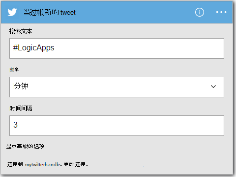
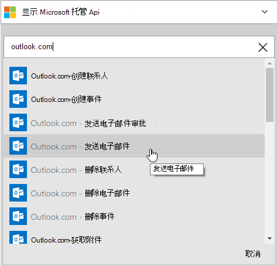
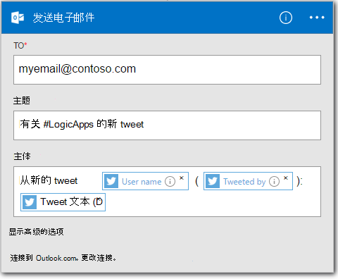

<properties
    pageTitle="创建一个逻辑应用程序 |Microsoft Azure"
    description="了解如何创建一个连接 SaaS 服务的逻辑应用程序"
    authors="jeffhollan"
    manager="dwrede"
    editor=""
    services="logic-apps"
    documentationCenter=""/>

<tags
    ms.service="logic-apps"
    ms.workload="na"
    ms.tgt_pltfrm="na"
    ms.devlang="na"
    ms.topic="get-started-article"
    ms.date="10/18/2016"
    ms.author="jehollan"/>

# 创建新的逻辑应用程序连接 SaaS 服务

本主题演示如何，只需几分钟时间，您可以开始使用[Azure 逻辑应用程序](app-service-logic-what-are-logic-apps.md)。 我们将逐步介绍简单的工作流，您可以将感兴趣的 tweets 发送给您的电子邮件。

若要使用此方案，您需要︰

- Azure 的订阅
- 一个 Twitter 帐户
- Outlook.com 或承载的 Office 365 邮箱

## 创建新的逻辑应用程序以电子邮件发送 tweets

1. 在[Azure 门户的仪表板](https://portal.azure.com)上，选择**新建**。 
2. 在搜索栏中，搜索逻辑应用程序，然后选择**逻辑应用程序**。 您还可以选择**新建** **Web + 移动**，并选择**逻辑的应用程序**。 
3. 为您的逻辑应用程序输入一个名称，选择位置、 资源组，然后选择**创建**。  如果您选择**固定到仪表板**的逻辑应用程序将自动打开一次部署。  
4. 第一次打开您的逻辑应用程序后您可以选择从模板开始。  现在请单击**空白的逻辑应用程序**从头构建这。 
1. 您需要创建的第一项是触发器。  这是将启动逻辑应用程序事件。  在触发器的搜索框中，**使用 twitter**搜索并选择它。
7. 现在您需要键入搜索词上触发。  **频率**和**时间间隔**将确定新的 tweets （并返回所有 tweets 期间的都时间跨度） 为您的逻辑应用程序检查的时间间隔。
    

5. 选择**新步骤**按钮，然后选择**添加操作**或**添加条件**
6. 选择**添加一个操作**时，您可以搜索从[可用的连接器](../connectors/apis-list.md)选择的操作。 例如，您可以选择**Outlook.com-发送电子邮件**来从 outlook.com 地址发送邮件︰  
    

7. 现在，您需要填写电子邮件所需的参数︰ 

8. 最后，您可以选择**保存**以使您的逻辑应用程序生存。

## 在创建后管理逻辑应用程序

现在，您的逻辑应用程序启动并运行。 它将定期检查 tweets 与输入搜索字词。 如果找到匹配的 tweet，它将向您发送一封电子邮件。 最后，将了解如何禁用该应用程序，或看到它如何做。

1. 转到[Azure 门户](https://portal.azure.com)

1. 单击屏幕左侧的**浏览**并选择**逻辑的应用程序**。

2. 单击您刚创建以当前状态和一般信息，请参阅新逻辑应用程序。

3. 若要编辑您新的逻辑应用程序，请单击**编辑**。

5. 若要关闭该应用程序，单击命令栏中的**禁用**。

1. 查看运行和触发器要监视您的逻辑应用程序运行时的历史记录。  您可以单击**刷新**以查看最新的数据。

在 5 分钟之内，您就能够设置在云环境中运行一个简单的逻辑应用程序。 若要了解有关使用逻辑应用程序功能的详细信息，请参阅[使用逻辑应用程序功能]。 要了解自身的逻辑应用程序定义，请参阅[创作逻辑应用程序定义](app-service-logic-author-definitions.md)。

<!-- Shared links -->
[Azure portal]: https://portal.azure.com
[使用逻辑应用程序功能]: app-service-logic-create-a-logic-app.md
