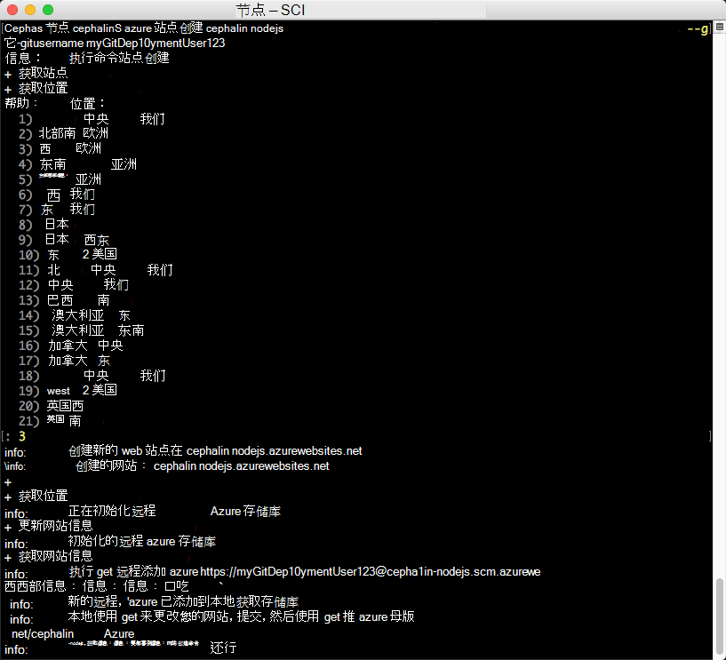
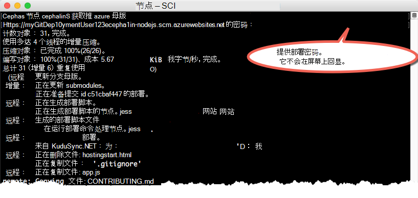

<properties 
    pageTitle="在五分钟后部署到 Azure 的 Node.js web 应用程序 |Microsoft Azure" 
    description="了解部署示例应用程序的应用程序服务中运行 web 应用程序是多么容易。 启动快速进行实际的开发，并立即查看结果。" 
    services="app-service\web"
    documentationCenter=""
    authors="cephalin"
    manager="wpickett"
    editor=""
/>

<tags
    ms.service="app-service-web"
    ms.workload="web"
    ms.tgt_pltfrm="na"
    ms.devlang="na"
    ms.topic="hero-article"
    ms.date="10/13/2016" 
    ms.author="cephalin"
/>
    
# 在五分钟后将第一的 Node.js web 应用程序部署到 Azure

本教程将帮助您将第一个 Node.js web 应用程序部署到[Azure 应用程序服务](../app-service/app-service-value-prop-what-is.md)。
您可以使用应用程序服务创建 web 应用程序、[移动应用程序的后端](/documentation/learning-paths/appservice-mobileapps/)，和[API 的应用程序](../app-service-api/app-service-api-apps-why-best-platform.md)。

您将能够︰ 

- 在 Azure 应用程序服务创建一个 web 应用程序。
- 部署示例 Node.js 代码。
- 请参阅您在生产环境中实时运行的代码。
- 更新您的 web 应用程序相同的方式[推 Git 提交](https://git-scm.com/docs/git-push)。

## 系统必备组件

- [Git](http://www.git-scm.com/downloads)。
- [Azure CLI](../xplat-cli-install.md)。
- 一种 Microsoft Azure 帐户。 如果您没有帐户，您可以[注册免费试用版](/pricing/free-trial/?WT.mc_id=A261C142F)或[激活您的 Visual Studio 的订阅者权益](/pricing/member-offers/msdn-benefits-details/?WT.mc_id=A261C142F)。

>[AZURE.NOTE] 没有 Azure 帐户，您可以[尝试应用程序服务](http://go.microsoft.com/fwlink/?LinkId=523751)。 创建初学者应用程序和长达一个小时，播放获得，不需要信用卡，没有承诺。

## Node.js web 应用程序部署

1. 打开新的 Windows 命令提示符，PowerShell 窗口、 Linux 外壳或 OS X 终端。 运行`git --version`和`azure --version`来验证您的计算机上安装 Git 和 Azure CLI。

    

    如果您还没有安装这些工具，请参见下载链接[系统必备](#Prerequisites)。

3. 登录到 Azure 如下所示︰

        azure login

    按照以继续登录过程的帮助消息。

    

4. 将 Azure CLI 更改到 ASM 模式，然后将部署用户设置为应用程序服务。 将部署以后使用凭据的代码。

        azure config mode asm
        azure site deployment user set --username <username> --pass <password>

1. 更改到工作目录 (`CD`) 和克隆示例应用程序如下︰

        git clone https://github.com/Azure-Samples/app-service-web-nodejs-get-started.git

2. 更改您的样本应用程序的管理存储库。

        cd app-service-web-nodejs-get-started

4. 唯一的应用程序名称和部署用户先前配置在 Azure 中创建应用程序服务的应用程序资源。 当出现提示时，指定的所需区域。

        azure site create <app_name> --git --gitusername <username>

    

    您的应用程序中创建的 Azure 现在。 此外，您的当前目录是远程 Git Git 初始化和连接到新的应用程序服务应用程序。
    您可以浏览到应用程序的 URL (http://&lt;情况 >。 azurewebsites.net) 要看到美丽的默认 HTML 页，但我们现在真正获取您的代码。

4. 部署示例代码于 Azure 应用程序，如将强制使用 Git 的任何代码。 出现提示时，请使用前面配置的密码。

        git push azure master

    

    `git push`将代码放在 Azure，不仅还会触发部署引擎中的部署任务。 
    如果您的项目 （存储库） 根中有 package.json，部署脚本将为您还原所需的程序包。 

祝贺您，您的应用程序部署到 Azure 应用程序服务。

## 实时运行您的应用程序，请参阅

若要查看您在 Azure 中实时运行的应用程序，请从存储库中的任何目录运行以下命令︰

    azure site browse

## 对您的应用程序进行更新

您现在可以使用 Git 将从您的项目 （存储库） 根随时推送到实时网站进行更新。 您请执行相同的方式部署代码第一次。 例如，每次想要本地推您已测试的新更改，只需运行下面的命令从您的项目 （存储库） 根︰

    git add .
    git commit -m "<your_message>"
    git push azure master

## 下一步行动

[创建、 配置和部署到 Azure Node.js 速成版 web 应用程序](app-service-web-nodejs-get-started.md)。 通过遵循本教程中，您将了解如在 Azure，运行任何 Node.js web 应用程序所需的基本技能︰

- 在创建和配置应用程序从 PowerShell/大扫除的 Azure。
- 设置 Node.js 版本。
- 使用起始文件不是应用程序的根目录中。
- 使用 NPM 自动执行。
- 获取错误和输出日志。

或者，用做更多您的第一个 web 应用程序。 例如︰

- 尝试[其他方法来部署您的代码到 Azure](../app-service-web/web-sites-deploy.md)。 例如，要将部署从 GitHub 资料库之一，只要选择而不是**本地 Git 存储库** **GitHub**中**部署选项**。
- 将 Azure 应用程序带到下一个级别。 对用户进行身份验证。 它基于请求的比例。 设置某些性能警报。 所有与单击几。 请参阅[与您的第一个 web 应用程序添加功能](app-service-web-get-started-2.md)。

