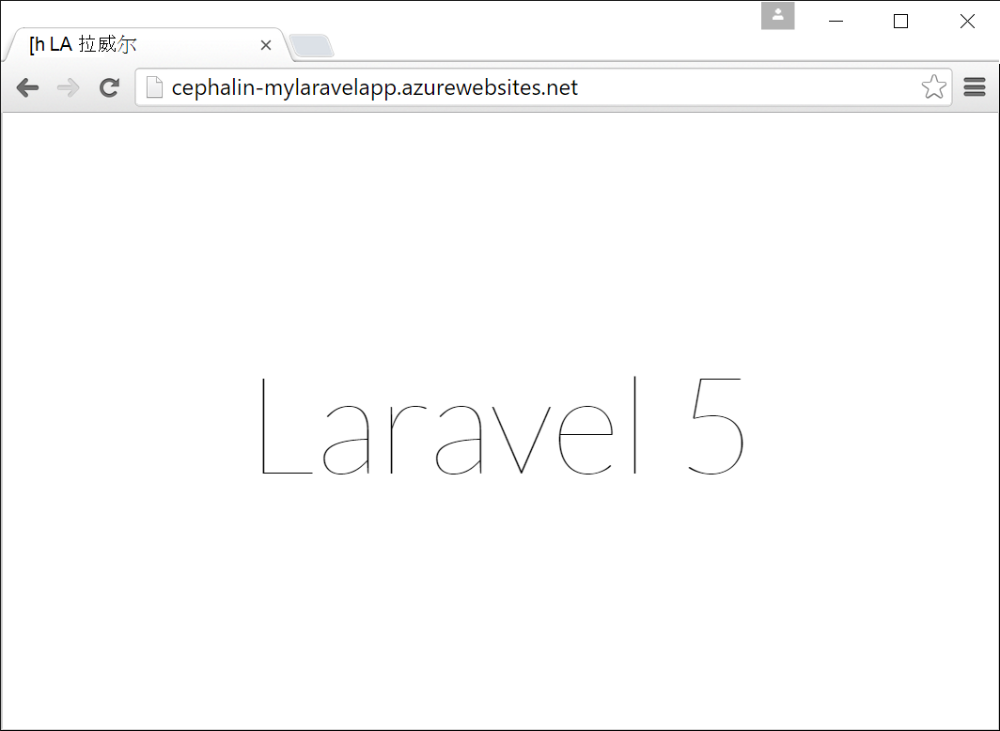

<properties
    pageTitle="创建、 配置和部署到 Azure 的 PHP web 应用程序"
    description="教程，说明如何使 PHP (Laravel) 的 web 应用程序运行在 Azure 应用程序服务。 了解如何配置 Azure 应用程序服务来满足您选择的 PHP 框架。"
    services="app-service\web"
    documentationCenter="php"
    authors="cephalin"
    manager="wpickett"
    editor=""
    tags="mysql"/>

<tags
    ms.service="app-service-web"
    ms.workload="web"
    ms.tgt_pltfrm="na"
    ms.devlang="PHP"
    ms.topic="article"
    ms.date="06/03/2016" 
    ms.author="cephalin"/>

# 创建、 配置和部署到 Azure 的 PHP web 应用程序

[AZURE.INCLUDE [tabs](../../includes/app-service-web-get-started-nav-tabs.md)]

本教程展示了如何创建、 配置和部署的 Azure，PHP web 应用程序以及如何配置 Azure 应用程序服务以满足您的 PHP web 应用程序的要求。 本教程结束时，您将具有[Laravel](https://www.laravel.com/) [Azure 应用程序服务](../app-service/app-service-value-prop-what-is.md)中实时运行的 web 应用程序的工作。

作为 PHP 开发人员，您可以使您最喜爱的 PHP 框架到 Azure。 本教程使用 Laravel 只是作为一个具体的应用程序的示例。 您将了解︰ 

- 使用 Git 部署
- 设置 PHP 版本
- 使用起始文件不是应用程序的根目录中
- 访问特定于环境的变量
- 更新您的应用程序在 Azure 中

您可以应用您在此处学习的到其他 PHP web 应用程序部署到 Azure。

>[AZURE.INCLUDE [app-service-linux](../../includes/app-service-linux.md)] 

## 系统必备组件

- 安装[PHP 5.6.x](http://php.net/downloads.php) （PHP 7 支持是测试版）
- 安装[书写器](https://getcomposer.org/download/)
- 安装[Azure CLI](../xplat-cli-install.md)
- 安装[Git](http://www.git-scm.com/downloads)
- 获取 Microsoft Azure 帐户。 如果您没有帐户，您可以[注册免费试用版](/pricing/free-trial/?WT.mc_id=A261C142F)或[激活您的 Visual Studio 的订阅者权益](/pricing/member-offers/msdn-benefits-details/?WT.mc_id=A261C142F)。

>[AZURE.NOTE] 请参阅 web 应用程序中操作。 立即[尝试应用程序服务](http://go.microsoft.com/fwlink/?LinkId=523751)并创建短期的初学者应用程序 — — 不需要信用卡，没有承诺。

## 在开发计算机上创建一个 PHP (Laravel) 应用程序

1. 打开新的 Windows 命令提示符，PowerShell 窗口、 Linux 外壳或 OS X 终端。 运行以下命令来验证您的计算机上正确安装所需的工具。 

        php --version
        composer --version
        azure --version
        git --version

    

    如果您还没有安装这些工具，请参见下载链接[系统必备](#Prerequisites)。
    
2. 安装 Laravel 如下所示︰

        composer global require "laravel/installer

3. `CD`到工作目录，然后创建一个新的 Laravel 应用程序如下所示︰

        cd <working_directory>
        laravel new <app_name>

4. `CD`到新创建的`<app_name>`目录并测试该应用程序如下所示︰

        cd <app_name>
        php artisan serve
        
    您应该能够立即导航到浏览器中的 http://localhost:8000 和 Laravel 的闪屏，请参阅。
    
    
    
因此到目前为止，只是常规的 Laravel 工作流，并且您将不补<a href="https://laravel.com/docs/5.2" rel="nofollow">了解 Laravel</a>。 因此，让我们继续。

## 创建一个 Azure 的 web 应用程序和设置 Git 部署

>[AZURE.NOTE] "等待 ！ 如果我要使用 FTP 部署吗？ 没有[FTP 教程](web-sites-php-mysql-deploy-use-ftp.md)为您的需要。 

使用 Azure CLI 时，可以在 Azure 应用程序服务中创建 web 应用程序并将其设置为单个命令行使用 Git 部署。 让我们来执行此操作。

1. 更改到 ASM 模式和登录到 Azure 中︰

        azure config mode asm
        azure login
    
    按照以继续登录过程的帮助消息。
    
    

4. 运行该命令以创建使用 Git 部署 Azure 的 web 应用程序。 出现提示时，指定的所需区域。

        azure site create --git <app_name>
    
    
    
    >[AZURE.NOTE] 如果您已经永远不会将部署凭据设置 Azure 订阅，将提示您创建它们。 这些凭据，不是 Azure 帐户凭据，应用程序服务仅用于 Git 部署和 FTP 登录。 
    
    此命令在当前目录上创建一个新的 Git 存储库 (与`git init`)，并将它连接到存储库中作为一个 Git 远程 Azure (与`git remote add`)。

<a name="configure"/>
## 配置 Azure 的 web 应用程序

对于您要在 Azure 中的 Laravel 应用程序，需要注意几件事。 为您所选择的 PHP 框架，您将执行本类似的练习。

- 配置 PHP 5.5.9 或更高。 [最新的 Laravel 5.2 服务器要求](https://laravel.com/docs/5.2#server-requirements)服务器要求的完整列表，请参见 列表的其余部分是 Azure 的 PHP 安装的已启用的扩展。 
- 您的应用程序设置的环境变量需要。 Laravel 使用`.env`文件很容易设置的环境变量。 但是，由于它不是提交到源代码 (请参阅[Laravel 环境配置](https://laravel.com/docs/5.2/configuration#environment-configuration)，您将设置 Azure 的 web 应用程序的应用程序设置，而不是。
- 请确保，Laravel 应用程序的入口点， `public/index.php`，第一次被加载。 请参阅[Laravel 生命周期概述](https://laravel.com/docs/5.2/lifecycle#lifecycle-overview)。 换句话说，您需要设置 web 应用程序的根 URL 指向`public`目录。
- 因为只有 composer.json，请启用在 Azure，作曲家扩展。 这种方式，可以让担心与部署时获取所需的程序包的作曲家`git push`。 它是为了方便起见。 如果您不启用编辑器自动化，只需删除`/vendor`从`.gitignore`文件以便在 Git 包含 ("联合国-忽略") 中的所有内容`vendor`目录在提交和部署代码时。

让我们按顺序配置这些任务。

4. 设置您的 Laravel 应用程序需要的 PHP 版本。

        azure site set --php-version 5.6

    在完成设置 PHP 版本 ！ 
    
4. 生成一个新`APP_KEY`为您 Azure 的 web 应用程序并将其设置为您的 Azure 的 web 应用程序的应用程序设置。

        php artisan key:generate --show
        azure site appsetting add APP_KEY="<output_of_php_artisan_key:generate_--show>"

4. 此外，打开 Laravel 调试为了抢占任何隐晦`Whoops, looks like something went wrong.`页。

        azure site appsetting add APP_DEBUG=true

    完成设置环境变量 ！
    
    >[AZURE.NOTE] 等待，让我们放慢一点，介绍 Laravel 的用途并 Azure 执行此处。 Laravel 使用`.env`提供环境变量和应用程序中，根目录中的文件，您将找到行`APP_DEBUG=true`(以及`APP_KEY=...`)。 访问该变量时在`config/app.php`的代码    `'debug' => env('APP_DEBUG', false),`。 [env()](https://laravel.com/docs/5.2/helpers#method-env)是 Laravel helper 方法，使用 PHP [getenv()](http://php.net/manual/en/function.getenv.php)在幕后。
    >
    >但是，`.env`将 Git 被忽略，因为它调用`.gitignore`文件的根目录中。 简单地说， `.env`  
在您本地 Git 存储库将不会推到 Azure 与文件的其余部分。 当然，只需删除该行从`.gitignore`，但我们已经确立了，不建议将该文件提交到源代码管理。 不过，您仍需要在 Azure 中指定这些环境变量的方法。 
    >
    >好消息是在 Azure 应用程序服务的应用程序设置，支持[getenv()](http://php.net/manual/en/function.getenv.php)  
在 PHP 中。 所以，尽管您可以使用 FTP 或其他方式手动上载`.env`文件到 Azure，您可以只指定所需的变量作为 Azure 应用程序设置，而无需`.env`Azure，只是一样的。 此外，如果变量是在`.env`文件并在 Azure 应用程序设置中，wins Azure 应用程序设置。     

4. （设置虚拟目录并使作曲家） 的最后两个任务需要[Azure 的门户](https://portal.azure.com)，因此登录到[门户](https://portal.azure.com)使用 Azure 帐户中。

4. 从左侧的菜单中，单击**服务应用程序** > **&lt;情况 >** > **工具**。

    
    
    >[AZURE.TIP] 如果您单击而不是**工具**的**设置**，您将能够访问**应用程序设置** 
刀片式服务器，可以在其中设置 PHP 版本，应用程序设置和刚做了像您这样的虚拟目录。 
    
4. 单击**扩展** > **添加**添加扩展名。

4. 选择**编辑器**中**选择扩展**[刀片](../azure-portal-overview.md)(*刀片式服务器*︰ 水平打开门户页)。

4. 在**接受法律条款**刀片式服务器，请单击**确定**。 

5. **添加扩展**刀片式服务器中，请单击**确定**。

    当完成 Azure 添加扩展名，您应该看到一个友好的弹出消息，在角，以及 **作曲家**刀片式服务器**扩展**中列出。

    

    在完成启用作曲者 ！
    
4. 在 web 应用程序的刀片式服务器，请单击**设置** > **应用程序设置**。

    

    在**应用程序设置**刀片式服务器，请注意您先前设置的 PHP 版本︰

    

    然后，添加应用程序设置︰
    
    

4. 滚动到底部的刀片式服务器，更改为指向**site\wwwroot\public**而不是**site\wwwroot**的根虚拟目录。

    

4. 单击**保存**顶部的刀片式服务器。

    在完成设置虚拟目录 ！ 

## 部署 web 应用程序使用 Git （和设置环境变量）

您就可以立即部署代码。 您将在命令提示符下或终端这回做。

4. 提交所有更改，并将代码部署到 Azure 的 web 应用程序，像任何 Git 存储库中︰

        git add .
        git commit -m "Hurray! My first commit for my Azure app!"
        git push azure master 

    当运行`git push`，将要求您提供您的 Git 部署密码。 如果系统要求您创建部署凭据`azure site create`前面，键入您所使用的密码。
    
5. 看一下它运行在浏览器中运行此命令︰

        azure site browse

    您的浏览器应显示 Laravel 初始屏幕。
    
    
    
    祝贺您，您现在在 Azure 运行 Laravel 的 web 应用程序。
             
## 解决常见的错误

以下是一些在遵循本教程时可能会遇到错误︰

- [Azure CLI 将显示"site 不是 azure 的命令"](#clierror)
- [Web 应用程序显示 HTTP 403 错误](#http403)
- [Web 应用程序显示"Whoops，似乎出现了错误。"](#whoops)
- [Web 应用程序显示"不支持加密器找到。"](#encryptor)

### Azure CLI 将显示"site 不是 azure 的命令"

当运行`azure site *`在命令行的终端，看到错误`error:   'site' is not an azure command. See 'azure help'.` 

这通常是在切换到"ARM"（Azure 资源经理） 模式的结果。 要解决此问题，切换回"ASM"（Azure 服务管理） 模式下运行`azure config mode asm`。

### Web 应用程序显示 HTTP 403 错误

您有您的 web 应用程序到 Azure 成功部署，但当您浏览到 Azure 的 web 应用程序，您将获得`HTTP 403`或`You do not have permission to view this directory or page.`

这是最有可能的因为 web 应用程序找不到 Laravel 的应用程序的入口点。 请确保您已更改根虚拟目录指向`site\wwwroot\public`，其中 Laravel 的`index.php`是 （请参阅[配置 Azure 的 web 应用程序](#configure)）。

### Web 应用程序显示"Whoops，似乎出现了错误。"

您有您的 web 应用程序到 Azure 成功部署，但当您浏览到 Azure 的 web 应用程序，您将获得难懂的消息`Whoops, looks like something went wrong.`

若要获得更具描述性错误，启用通过设置调试 Laravel`APP_DEBUG`环境变量`true`（请参阅[配置 Azure 的 web 应用程序](#configure)）。

### Web 应用程序显示"不支持加密器找到。"

您有您的 web 应用程序到 Azure 成功部署，但当您浏览到 Azure 的 web 应用程序，您收到下面的错误消息︰

    
这是一个严重的错误，但至少它不难懂因为开启 Laravel 调试。 在 Laravel 论坛上的错误字符串的粗略搜索将显示是由于没有设置 APP_KEY `.env`，或在您的情况下，不让`.env`在 Azure 根本。 可以通过添加设置来解决此`APP_KEY`为 Azure 应用程序设置 （请参阅[配置 Azure 的 web 应用程序](#configure)）。
    
## 下一步行动

了解如何将数据添加到您的应用程序中，通过[创建 Azure 中的 MySQL 数据库](../store-php-create-mysql-database.md)。 另外，请检查下面的 Azure 中的 php 出更有用的链接︰

- [PHP 开发人员中心](/develop/php/)。
- [从 Azure 市场创建一个 web 应用程序](app-service-web-create-web-app-from-marketplace.md)
- [在 Azure 应用程序服务 Web 应用程序中配置 PHP](web-sites-php-configure.md)
- [WordPress 转换在 Azure 应用程序服务的多站点](web-sites-php-convert-wordpress-multisite.md)
- [企业级的 WordPress 在 Azure 应用程序服务](web-sites-php-enterprise-wordpress.md)
