<properties 
    pageTitle="在 Azure 应用程序服务使用 Azure CDN" 
    description="用于从一个集成的 Azure CDN 终结点内容的教程，教您如何将 web 应用程序部署到 Azure 应用程序服务" 
    services="app-service\web,cdn" 
    documentationCenter=".net" 
    authors="cephalin" 
    manager="wpickett" 
    editor="jimbe"/>

<tags 
    ms.service="app-service" 
    ms.workload="tbd" 
    ms.tgt_pltfrm="na" 
    ms.devlang="dotnet" 
    ms.topic="article" 
    ms.date="07/01/2016" 
    ms.author="cephalin"/>


# <a name="use-azure-cdn-in-azure-app-service"></a>在 Azure 应用程序服务使用 Azure CDN

可以使用[Azure CDN](/services/cdn/)，将添加到全局[应用程序服务 Web 应用程序](http://go.microsoft.com/fwlink/?LinkId=529714)中固有的扩展能力，服务于您的 web 应用程序内容从靠近您的客户的服务器节点的全局集成[应用程序服务](http://go.microsoft.com/fwlink/?LinkId=529714)(找不到当前节点的所有位置的更新的列表[在此处](http://msdn.microsoft.com/library/azure/gg680302.aspx))。 如提供静态图像的情况下，这种集成可以极大地提高 Azure 应用程序服务 Web 应用程序的性能，显著提高了 web 应用程序的用户体验世界各地。 

与 Azure CDN 集成 Web 应用程序提供了下列优点︰

- 作为 web 应用程序的[连续部署](app-service-continuous-deployment.md)过程的一部分集成内容部署 （图像、 脚本和样式表）
- 方便地升级 web 应用程序在 Azure 应用程序服务，如 jQuery 或引导版本中的 NuGet 程序包 
- 从相同的 Visual Studio 的界面管理您的 Web 应用程序和您提供 CDN 服务的内容
- 将 ASP.NET 捆绑和缩小与 Azure CDN 相集成

[AZURE.INCLUDE [app-service-web-to-api-and-mobile](../../includes/app-service-web-to-api-and-mobile.md)] 

## <a name="what-you-will-build"></a>您将生成 ##

会将 web 应用程序部署到 Azure 应用程序服务在 Visual Studio 中使用的默认 ASP.NET MVC 模板、 添加代码，以提供从集成的 Azure CDN，如图像、 控制器操作结果，默认 JavaScript 和 CSS 文件的内容和编写代码来配置包提供的 CDN 处于脱机状态的备用机制。

## <a name="what-you-will-need"></a>您将需要 ##

本教程中必须满足以下先决条件︰

-   [Microsoft Azure 帐户](/account/)活动
-   Visual Studio [.net 的 Azure SDK](http://go.microsoft.com/fwlink/p/?linkid=323510&clcid=0x409)的 2015 年。 如果您使用 Visual Studio，则步骤可能会有所不同。

> [AZURE.NOTE] Azure 帐户来完成本教程，您需要︰
> + 您可以[免费开设 Azure 帐户](/pricing/free-trial/)-获取积分可用于试验 Azure 服务付费，和甚至用完后可以保留该帐户并使用自由 Azure 服务，例如 Web 应用程序。
> + 您可以[激活 Visual Studio 订户权益](/pricing/member-offers/msdn-benefits-details/)-您的 Visual Studio 预订为您提供了积分可用于付费的 Azure 服务每月。
>
> 如果您想要怎样的 Azure 帐户之前开始使用 Azure 应用程序服务，请转到[尝试应用程序服务](http://go.microsoft.com/fwlink/?LinkId=523751)，立即可以在此创建短期的初学者 web 应用程序在应用程序服务。 没有信用卡，所需;没有承诺。

## <a name="deploy-a-web-app-to-azure-with-an-integrated-cdn-endpoint"></a>将 web 应用程序部署到 Azure，与集成 CDN 终结点 ##

在本节中，将默认 Visual Studio 2015 ASP.NET MVC 应用程序模板部署到应用程序服务，并将集成新的 CDN 终结点使用。 请按照以下说明操作︰

1. 在 Visual Studio 2015，创建新的 ASP.NET web 应用程序中菜单栏转到**文件 > 新建 > 项目 > Web > ASP.NET Web 应用程序**。 为它指定一个名称，然后单击**确定**。

    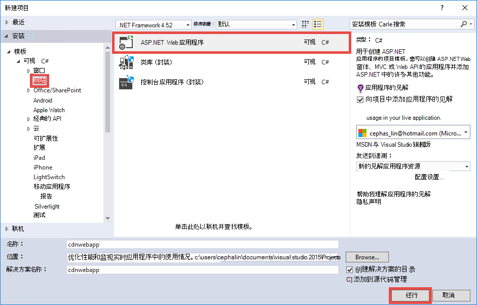

3. **MVC**中选择并单击**确定**。

    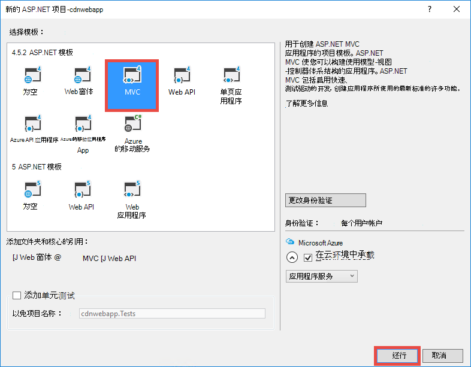

4. 如果没有尚未登录到 Azure 帐户，单击右上角中的帐户图标，然后按照到 Azure 帐户登录对话框。 一旦操作完成后，将您的应用程序的配置，如下所示，然后单击**新建**以创建新的应用程序服务计划为您的应用程序。  

    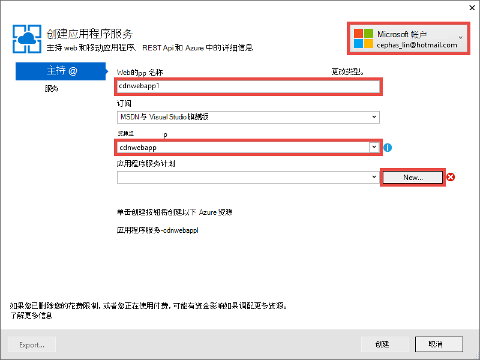

5. 在对话框中配置新的应用程序服务计划，如下所示，单击**确定**。 

    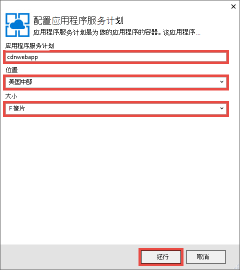

8. 单击**创建**来创建 web 应用程序。

    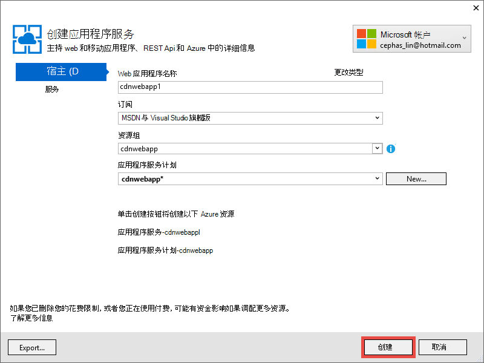

9. 创建 ASP.NET 应用程序后，将其发布到 Azure Azure 应用程序服务活动窗格中通过单击**发布`<app name>`到现在这个 Web 应用程序**。 单击**发布**以完成此过程。

    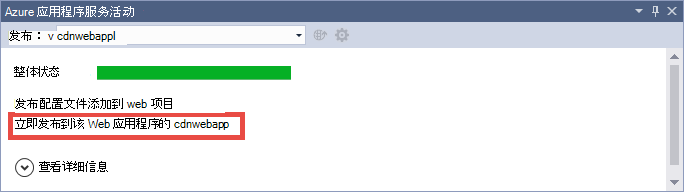

    当发布完成时，您将看到您在浏览器中的已发布的 web 应用程序。 

1. 若要创建一个 CDN 的终结点，请登录到[Azure 的门户](https://portal.azure.com)。 
2. 单击**+ 新** > **媒体 + CDN** > **CDN**。

    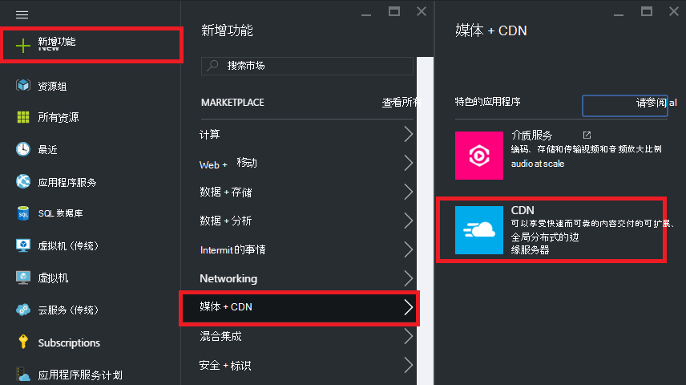

3. 指定**CDN**、**位置**、**资源组**、**定价层**，然后单击**创建**

    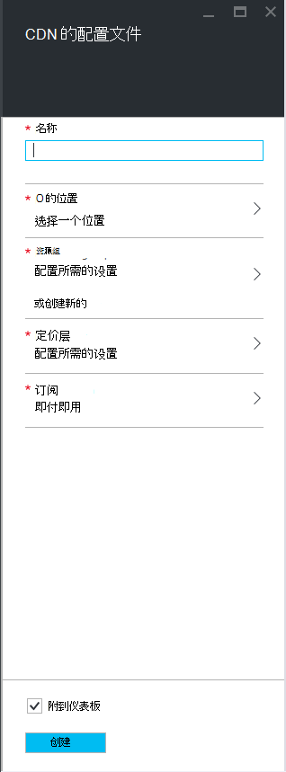   

4. **CDN 的配置文件**在刀片式服务器单击**+ 终结点**按钮。 为它指定一个名称，选择**源类型**下拉列表和**原始主机名称**下拉列表中，在 web 应用程序中的**Web 应用程序**，然后单击**添加**。  

    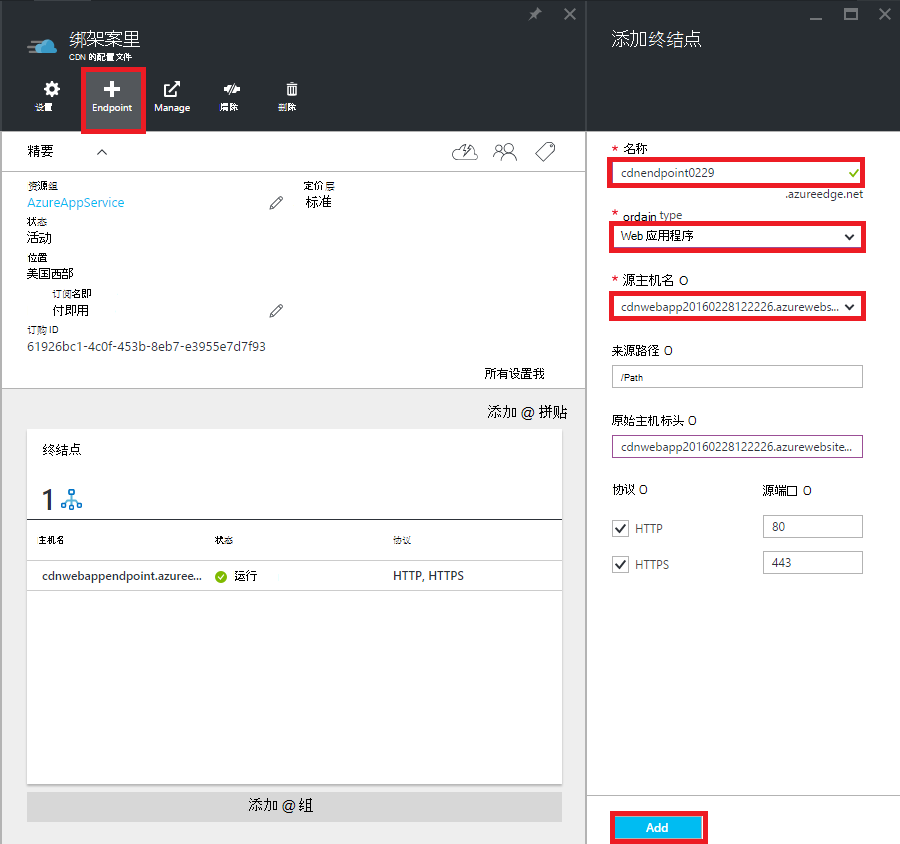


    > [AZURE.NOTE] CDN 端点创建后，**终结点**刀片式服务器将向您展示其 CDN URL 和与集成的源域。 但是，可能需要一段时间新 CDN 终结点的配置，以便完全传播到所有 CDN 节点位置。 

3. 回到中**端点**刀片式服务器，请单击您刚刚创建的 CDN 终结点的名称。

    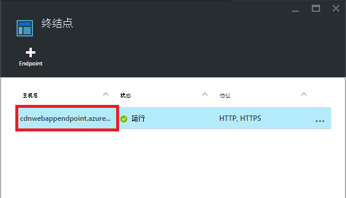

3. 单击**配置**按钮。 在**配置**刀片式服务器，**查询字符串缓存行为**的下拉列表中选择**缓存每个唯一的 URL** ，然后单击**保存**按钮。


    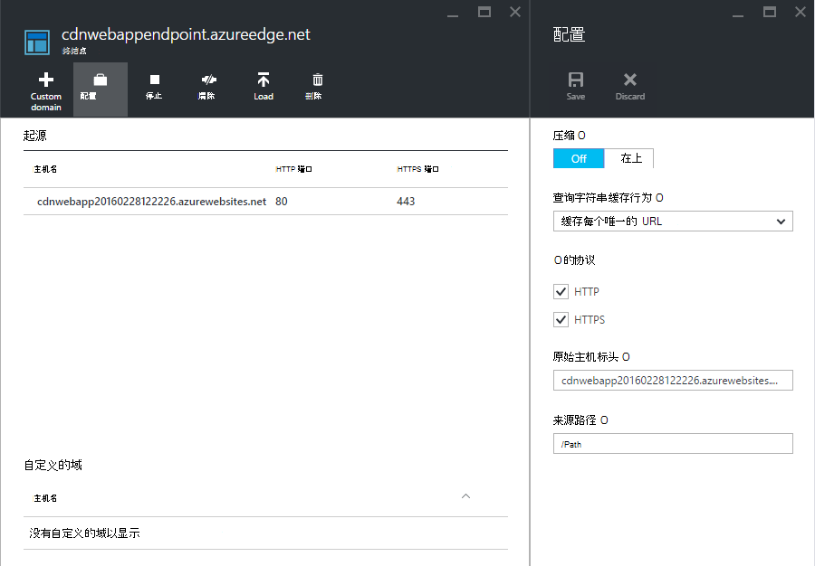

一旦您启用此功能，使用不同的查询字符串访问同一个链路将缓存作为单独的项。

>[AZURE.NOTE] 启用查询字符串不需要此教程部分，而要这样做，因为早期尽可能为方便起见，因为任何更改此处要从容地传播到所有的 CDN 节点，并且您不想要阻塞 （更新 CDN 内容将稍后讨论） 的 CDN 缓存任何未查询字符串-启用的内容。

2. 现在，导航到 CDN 的端点地址。 如果终结点准备就绪后，您会看到显示 web 应用程序。 如果收到一个**HTTP 404**错误，CDN 终结点未准备好。 您可能需要等待一小时要传播到所有边缘节点的 CDN 配置的时间。 

    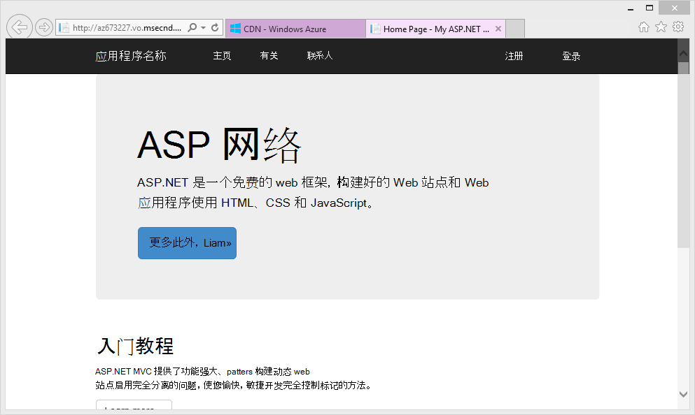

1. 接下来，尝试访问 ASP.NET 项目中的**~/Content/bootstrap.css**文件。 在浏览器窗口中，定位到**http://*&lt;cdnName >*.azureedge.net/Content/bootstrap.css**。 在我的安装程序，此 URL 为︰

        http://az673227.azureedge.net/Content/bootstrap.css

    该值对应于以下原始 URL CDN 终结点︰

        http://cdnwebapp.azurewebsites.net/Content/bootstrap.css

    当您导航到**http://*&lt;cdnName >*.azureedge.net/Content/bootstrap.css**，您将被提示要下载来自于您的 web 应用程序在 Azure 中的 bootstrap.css。 

    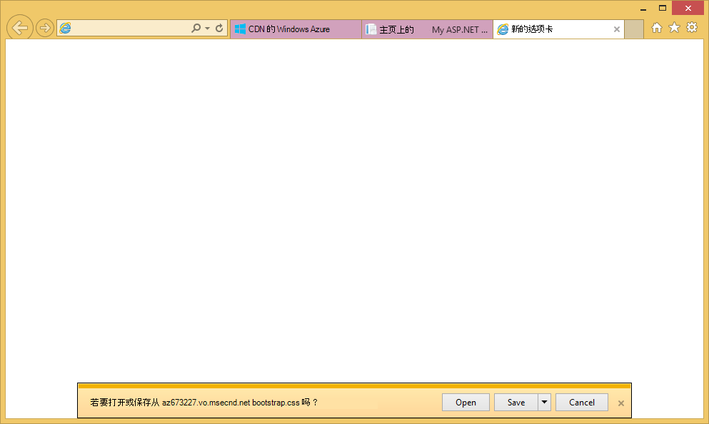

同样，您可以访问在任何公共可访问的 URL * *http://*&lt;站点 >*.cloudapp.net/**，直接从 CDN 端点。 例如︰

-   从 /Script 路径.js 文件
-   /Content 中的任何内容文件路径
-   任何控制器/操作 
-   如果您的 CDN 终结点，任何与查询字符串的 URL 上启用了查询字符串
-   整个 Azure 的 web 应用程序中，如果所有内容都是公共的

请注意，它不可能始终是个好主意 （或通常是个好主意） 提供通过 Azure CDN 的 Azure 的整个 web 应用程序。 下面是一些注意事项︰

-   此方法需要整个网站是公开的因为 Azure CDN 不能提供专用的任何内容。
-   如果由于某种原因，CDN 终结点离线，是否安排的维护时间或用户错误，您的整个 web 应用程序离线除非可以将客户重定向到原始 URL * *http://*&lt;网站名称 >*.azurewebsites.net/**。 
-   即使使用自定义缓存控制设置 （请参阅[配置缓存 Azure 的 web 应用程序中的静态文件的选项](#configure-caching-options-for-static-files-in-your-azure-web-app)），CDN 终结点无法提高性能的高动态内容。 如果您尝试作为显示上面，请注意，花费至少 5 秒钟，第一次，这是一个相当简单的页加载默认主页 CDN 端点从加载主页。 想象一下会发生什么情况的客户端体验到如果该页包含必须更新每分钟的动态内容。 提供动态内容从 CDN 终结点需要短缓存过期时间，这相当于 CDN 终结点上的频繁缓存未命中数。 这会影响您的 Azure 的 web 应用程序的性能，并违背了 CDN。

另一种是确定要在 Azure 的 web 应用程序中通过案例基础上从 Azure CDN 服务的内容。 为此，您已经看到如何从 CDN 终结点访问单独的内容文件。 我将介绍如何在[提供内容从控制器操作通过 Azure CDN](#serve-content-from-controller-actions-through-azure-cdn)提供 CDN 端点通过一个特定的控制器操作。

## <a name="configure-caching-options-for-static-files-in-your-azure-web-app"></a>在 Azure 的 web 应用程序配置为静态文件缓存选项 ##

Azure CDN 集成 Azure 的 web 应用程序中，可以指定要如何 CDN 终结点以缓存的静态内容。 若要做到这一点，从 ASP.NET 项目 (例如**cdnwebapp**) 中打开*Web.config*并添加`<staticContent>`元素为`<system.webServer>`。 下面的 XML 配置的缓存，在 3 天后过期。  

    <system.webServer>
      <staticContent>
        <clientCache cacheControlMode="UseMaxAge" cacheControlMaxAge="3.00:00:00"/>
      </staticContent>
      ...
    </system.webServer>

一旦执行此操作时，Azure 的 web 应用程序中的所有静态文件将遵循相同的规则在 CDN 缓存中。 缓存设置的更精确地控制，将*Web.config*文件添加到文件夹中并添加设置存在。 例如，将*Web.config*文件添加到*\Content*文件夹和内容替换为下面的 XML:

    <?xml version="1.0"?>
    <configuration>
      <system.webServer>
        <staticContent>
          <clientCache cacheControlMode="UseMaxAge" cacheControlMaxAge="15.00:00:00"/>
        </staticContent>
      </system.webServer>
    </configuration>

此设置会导致为缓存 15 天的*\Content*文件夹中的所有静态文件。

有关如何配置`<clientCache>`元素，请参阅[客户端缓存&lt;clientCache >](http://www.iis.net/configreference/system.webserver/staticcontent/clientcache)。

接下来，我还会显示您如何在 CDN 缓存配置控制器操作结果的缓存设置。

## <a name="serve-content-from-controller-actions-through-azure-cdn"></a>提供通过 Azure CDN 的控制器操作中的内容 ##

使用 Azure CDN 集成 Web 应用程序时，相对容易地提供从控制器操作通过 Azure CDN 的内容。 同样，如果您决定为整个 Azure 的 web 应用程序通过您的 CDN 服务，您不需要做这根本因为控制器的所有操作都都已通过 CDN 到达。 但原因我已指出在[部署与集成 CDN 终结点的 Azure 的 web 应用程序](#deploy-a-web-app-to-azure-with-an-integrated-cdn-endpoint)中，可能会对此决定，改为选择来选择您想要从 Azure CDN 服务的控制器操作。 [Maarten Balliauw](https://twitter.com/maartenballiauw)显示了如何用有趣的在[网上与 Azure CDN 减少延迟](http://channel9.msdn.com/events/TechDays/Techdays-2014-the-Netherlands/Reducing-latency-on-the-web-with-the-Windows-Azure-CDN)的 MemeGenerator 控制器。 这里将只需复制它。

假设您想要生成基于这样一个年轻 Chuck Norris 图像 （照片由[亚伦光](http://www.flickr.com/photos/alan-light/218493788/)） memes web 应用程序中︰


有一个简单的`Index`允许用户指定在图像中，superlatives 的动作然后生成 meme 一旦它们过帐到的操作。 由于 Chuck Norris，希望此页后，可以成为全球流行的大幅变化。 这是使用 Azure CDN 服务半动态内容的一个很好示例。 

请按照上述步骤以安装此控制器操作︰

1. 在*\Controllers*文件夹中，创建一个名为*MemeGeneratorController.cs*的新.cs 文件和内容替换为以下代码。 替换为您的文件路径`~/Content/chuck.bmp`和 CDN 名称为`yourCDNName`。


        using System;
        using System.Collections.Generic;
        using System.Diagnostics;
        using System.Drawing;
        using System.IO;
        using System.Net;
        using System.Web.Hosting;
        using System.Web.Mvc;
        using System.Web.UI;

        namespace cdnwebapp.Controllers
        {
          public class MemeGeneratorController : Controller
          {
            static readonly Dictionary<string, Tuple<string ,string>> Memes = new Dictionary<string, Tuple<string, string>>();

            public ActionResult Index()
            {
              return View();
            }

            [HttpPost, ActionName("Index")]
            public ActionResult Index_Post(string top, string bottom)
            {
              var identifier = Guid.NewGuid().ToString();
              if (!Memes.ContainsKey(identifier))
              {
                Memes.Add(identifier, new Tuple<string, string>(top, bottom));
              }

              return Content("<a href=\"" + Url.Action("Show", new {id = identifier}) + "\">here's your meme</a>");
            }

            [OutputCache(VaryByParam = "*", Duration = 1, Location = OutputCacheLocation.Downstream)]
            public ActionResult Show(string id)
            {
              Tuple<string, string> data = null;
              if (!Memes.TryGetValue(id, out data))
              {
                return new HttpStatusCodeResult(HttpStatusCode.NotFound);
              }

              if (Debugger.IsAttached) // Preserve the debug experience
              {
                return Redirect(string.Format("/MemeGenerator/Generate?top={0}&bottom={1}", data.Item1, data.Item2));
              }
              else // Get content from Azure CDN
              {
                return Redirect(string.Format("http://<yourCDNName>.azureedge.net/MemeGenerator/Generate?top={0}&bottom={1}", data.Item1, data.Item2));
              }
            }

            [OutputCache(VaryByParam = "*", Duration = 3600, Location = OutputCacheLocation.Downstream)]
            public ActionResult Generate(string top, string bottom)
            {
              string imageFilePath = HostingEnvironment.MapPath("~/Content/chuck.bmp");
              Bitmap bitmap = (Bitmap)Image.FromFile(imageFilePath);

              using (Graphics graphics = Graphics.FromImage(bitmap))
              {
                SizeF size = new SizeF();
                using (Font arialFont = FindBestFitFont(bitmap, graphics, top.ToUpperInvariant(), new Font("Arial Narrow", 100), out size))
                {
                    graphics.DrawString(top.ToUpperInvariant(), arialFont, Brushes.White, new PointF(((bitmap.Width - size.Width) / 2), 10f));
                }
                using (Font arialFont = FindBestFitFont(bitmap, graphics, bottom.ToUpperInvariant(), new Font("Arial Narrow", 100), out size))
                {
                    graphics.DrawString(bottom.ToUpperInvariant(), arialFont, Brushes.White, new PointF(((bitmap.Width - size.Width) / 2), bitmap.Height - 10f - arialFont.Height));
                }
              }
              MemoryStream ms = new MemoryStream();
              bitmap.Save(ms, System.Drawing.Imaging.ImageFormat.Png);
              return File(ms.ToArray(), "image/png");
            }

            private Font FindBestFitFont(Image i, Graphics g, String text, Font font, out SizeF size)
            {
              // Compute actual size, shrink if needed
              while (true)
              {
                size = g.MeasureString(text, font);

                // It fits, back out
                if (size.Height < i.Height &&
                     size.Width < i.Width) { return font; }

                // Try a smaller font (90% of old size)
                Font oldFont = font;
                font = new Font(font.Name, (float)(font.Size * .9), font.Style);
                oldFont.Dispose();
              }
            }
          }
        }

2. 在默认的右击`Index()`操作并选择**添加视图**。

    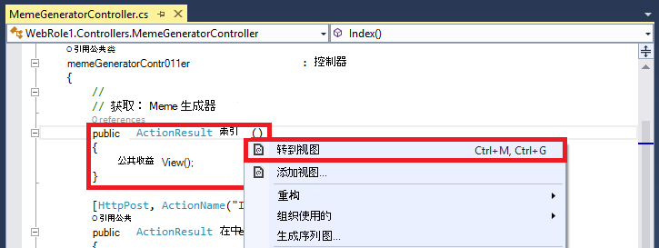

3.  接受以下设置，然后单击**添加**。

    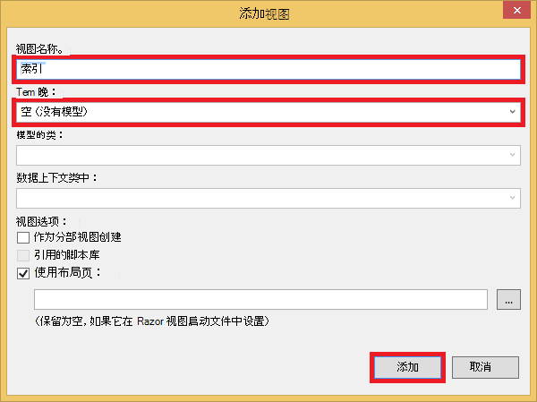

4. 打开新的*Views\MemeGenerator\Index.cshtml*和内容替换为以下简单的 HTML 提交 superlatives:

        <h2>Meme Generator</h2>
        
        <form action="" method="post">
            <input type="text" name="top" placeholder="Enter top text here" />
            <br />
            <input type="text" name="bottom" placeholder="Enter bottom text here" />
            <br />
            <input class="btn" type="submit" value="Generate meme" />
        </form>

5. 重新发布到 Azure 的 web 应用程序，然后定位到**http://*&lt;站点 >*.cloudapp.net/MemeGenerator/Index** 浏览器中的。 

当您提交表单值为`/MemeGenerator/Index`，`Index_Post`操作方法返回链接到`Show`与各自的输入标识符的操作方法。 当单击该链接时，您到达下面的代码所示︰  

    [OutputCache(VaryByParam = "*", Duration = 1, Location = OutputCacheLocation.Downstream)]
    public ActionResult Show(string id)
    {
      Tuple<string, string> data = null;
      if (!Memes.TryGetValue(id, out data))
      {
        return new HttpStatusCodeResult(HttpStatusCode.NotFound);
      }

      if (Debugger.IsAttached) // Preserve the debug experience
      {
        return Redirect(string.Format("/MemeGenerator/Generate?top={0}&bottom={1}", data.Item1, data.Item2));
      }
      else // Get content from Azure CDN
      {
        return Redirect(string.Format("http://<yourCDNName>.azureedge.net/MemeGenerator/Generate?top={0}&bottom={1}", data.Item1, data.Item2));
      }
    }

如果连接本地调试程序，您将得到与本地重定向的常规调试经验。 如果它正在运行 Azure 的 web 应用程序中，然后它将重定向到︰

    http://<yourCDNName>.azureedge.net/MemeGenerator/Generate?top=<formInput>&bottom=<formInput>

该值对应于以下原始 URL CDN 端点处︰

    http://<yourSiteName>.azurewebsites.net/cdn/MemeGenerator/Generate?top=<formInput>&bottom=<formInput>

URL 重写以前应用的规则后，获取缓存到 CDN 终结点的实际文件是︰

    http://<yourSiteName>.azurewebsites.net/MemeGenerator/Generate?top=<formInput>&bottom=<formInput>

然后，您可以使用`OutputCacheAttribute`特性`Generate`方法，以指定如何操作结果应缓存，这将允许在 Azure CDN。 下面的代码中指定 1 小时 （3600 秒） 的缓存过期。

    [OutputCache(VaryByParam = "*", Duration = 3600, Location = OutputCacheLocation.Downstream)]

同样，您可以提供任何的控制器操作中的内容 Azure 的 web 应用程序中通过您 Azure CDN，与所需的缓存选项。

接下来，我将介绍如何提供捆绑和缩减脚本和 CSS 通过 Azure CDN。 

## <a name="integrate-aspnet-bundling-and-minification-with-azure-cdn"></a>将 ASP.NET 捆绑和缩小与 Azure CDN 相集成 ##

脚本和 CSS 样式表不经常更改，而且 Azure CDN 缓存的最佳候选对象。 服务通过 Azure CDN 的整个 web 应用程序是最简单的办法将捆绑和缩小与 Azure CDN 相集成。 但是，随着[集成 Azure CDN 终结点使用 Azure web 应用程序和服务于静态内容从 Azure CDN Web 页中](#deploy-a-web-app-to-azure-with-an-integrated-cdn-endpoint)所述的原因，可能会选择采用这种方法，我将介绍了您如何同时保留 ASP.NET 捆绑和缩小，所需的 develper 经验，如︰

-   很好的调试模式的经验
-   简化的部署
-   立即更新客户端的脚本/CSS 版本升级
-   CDN 终结点失败时回退机制
-   最小化代码修改

在 ASP.NET 项目中[集成 Azure CDN 终结点使用 Azure web 应用程序和服务于静态内容从 Azure CDN Web 页中](#deploy-a-web-app-to-azure-with-an-integrated-cdn-endpoint)创建，打开*App_Start\BundleConfig.cs* ，看一看`bundles.Add()`方法调用。

    public static void RegisterBundles(BundleCollection bundles)
    {
        bundles.Add(new ScriptBundle("~/bundles/jquery").Include(
                    "~/Scripts/jquery-{version}.js"));
        ...
    }

第一个`bundles.Add()`语句在虚拟目录中添加脚本包`~/bundles/jquery`。 然后，打开*Views\Shared\_Layout.cshtml*查看脚本包标记呈现方式。 您应该能够找到 Razor 代码的以下行︰

    @Scripts.Render("~/bundles/jquery")

当此段 Razor 代码 Azure 的 web 应用程序中运行时，它会呈现`<script>`与以下内容类似的脚本包的标记︰ 

    <script src="/bundles/jquery?v=FVs3ACwOLIVInrAl5sdzR2jrCDmVOWFbZMY6g6Q0ulE1"></script>

但是，运行时在 Visual Studio 中通过键入`F5`，它会分别呈现每个包中的脚本文件 （在上面的例子中，只有一个脚本文件是软件包中）︰

    <script src="/Scripts/jquery-1.10.2.js"></script>

这使您能够调试您的开发环境中的 JavaScript 代码，同时减少并发客户端连接 （绑定） 和改进文件下载在生产环境中的性能 （缩小）。 它是一个重要的功能，以保留 Azure CDN 集成。 此外，由于呈现的包已包含自动生成的版本字符串，您想要复制该功能，以便每当 NuGet 通过 jQuery 版本更新时，它可以更新客户端尽快。

对集成 ASP.NET 捆绑和缩小使用 CDN 的终结点执行下列步骤。

1. 早在*App_Start\BundleConfig.cs*，修改`bundles.Add()`使用不同[包构造函数](http://msdn.microsoft.com/library/jj646464.aspx)，一个指定 CDN 地址的方法。 若要执行此操作，请替换`RegisterBundles`方法定义为以下代码︰  
    
        public static void RegisterBundles(BundleCollection bundles)
        {
          bundles.UseCdn = true;
          var version = System.Reflection.Assembly.GetAssembly(typeof(Controllers.HomeController))
            .GetName().Version.ToString();
          var cdnUrl = "http://<yourCDNName>.azureedge.net/{0}?" + version;

          bundles.Add(new ScriptBundle("~/bundles/jquery", string.Format(cdnUrl, "bundles/jquery")).Include(
                "~/Scripts/jquery-{version}.js"));

          bundles.Add(new ScriptBundle("~/bundles/jqueryval", string.Format(cdnUrl, "bundles/jqueryval")).Include(
                "~/Scripts/jquery.validate*"));

          // Use the development version of Modernizr to develop with and learn from. Then, when you're
          // ready for production, use the build tool at http://modernizr.com to pick only the tests you need.
          bundles.Add(new ScriptBundle("~/bundles/modernizr", string.Format(cdnUrl, "bundles/modernizr")).Include(
                "~/Scripts/modernizr-*"));

          bundles.Add(new ScriptBundle("~/bundles/bootstrap", string.Format(cdnUrl, "bundles/bootstrap")).Include(
                "~/Scripts/bootstrap.js",
                "~/Scripts/respond.js"));

          bundles.Add(new StyleBundle("~/Content/css", string.Format(cdnUrl, "Content/css")).Include(
                "~/Content/bootstrap.css",
                "~/Content/site.css"));
        }


    一定要替换`<yourCDNName>`Azure CDN 的名称。

    您正在设置中简要描述， `bundles.UseCdn = true` ，并添加到每个包的巧尽心思构建的 CDN URL。 例如，在代码中第一个构造函数︰

        new ScriptBundle("~/bundles/jquery", string.Format(cdnUrl, "bundles/jquery"))

    是相同的︰ 

        new ScriptBundle("~/bundles/jquery", string.Format(cdnUrl, "http://<yourCDNName>.azureedge.net/bundles/jquery?<W.X.Y.Z>"))

    此构造函数指示 ASP.NET 捆绑，并缩小呈现本地调试时的各个脚本文件，但使用指定的 CDN 地址访问问题脚本。 但是，请注意这个巧尽心思构建的 CDN url 的两个重要特征︰
    
    - 此 CDN URL 的原点是`http://<yourSiteName>.azurewebsites.net/bundles/jquery?<W.X.Y.Z>`，这是实际的 Web 应用程序中的脚本包的虚拟目录。
    - 由于您正在使用 CDN 构造函数，使用捆绑包的 CDN 脚本标记不再包含呈现 URL 中的自动生成的版本字符串。 每次修改脚本包时强制在 Azure CDN 缓存未命中，则必须手动生成一个唯一的版本的字符串。 在同一时间，这个唯一的版本字符串必须保持不变以最大化在 Azure CDN 缓存命中后部署包的部署生命周期中。

3. 查询字符串`<W.X.Y.Z>` *Properties\AssemblyInfo.cs*从拉 ASP.NET 项目中。 您可以包括每次您发布到 Azure 递增程序集版本的部署工作流。 或者，您只可以修改*Properties\AssemblyInfo.cs*项目每次生成时，使用通配符时自动递增的版本字符串中 ' *'。 例如，将`AssemblyVersion`如下所示︰
    
        [assembly: AssemblyVersion("1.0.0.*")]
    
    任何其他策略来优化生成部署的整个生命周期的唯一字符串将这里工作。

3. 重新发布该 ASP.NET 应用程序和访问主页。
 
4. 查看网页的 HTML 代码。 您应该能够看到 CDN URL 呈现，每次将更改重新发布到 Azure 的 web 应用程序的唯一版本字符串。 例如︰  
    
        ...
        <link href="http://az673227.azureedge.net/Content/css?1.0.0.25449" rel="stylesheet"/>
        <script src="http://az673227.azureedge.net/bundles/modernizer?1.0.0.25449"></script>
        ...
        <script src="http://az673227.azureedge.net/bundles/jquery?1.0.0.25449"></script>
        <script src="http://az673227.azureedge.net/bundles/bootstrap?1.0.0.25449"></script>
        ...

5. 在 Visual Studio 中，调试 ASP.NET 应用程序在 Visual Studio 中的通过键入`F5`。， 

6. 查看网页的 HTML 代码。 您仍可看到每个单独呈现，以便您可以具有一致出现在 Visual Studio 中调试的脚本文件。  
    
        ...
        <link href="/Content/bootstrap.css" rel="stylesheet"/>
        <link href="/Content/site.css" rel="stylesheet"/>
        <script src="/Scripts/modernizr-2.6.2.js"></script>
        ...
        <script src="/Scripts/jquery-1.10.2.js"></script>
        <script src="/Scripts/bootstrap.js"></script>
        <script src="/Scripts/respond.js"></script>
        ...    

## <a name="fallback-mechanism-for-cdn-urls"></a>CDN Url 的回退机制 ##

当 Azure CDN 端点由于某种原因失败时，您希望您 Web 页后，可以有足够的智能来访问原始 Web 服务器作为加载 JavaScript 或引导的备用选项。 很严重，会丢失您的 web 应用程序由于 CDN 不可用，但要失去您的脚本和样式表提供的关键页面功能严重得多的图像。

[包](http://msdn.microsoft.com/library/system.web.optimization.bundle.aspx)类包含一个名为[CdnFallbackExpression](http://msdn.microsoft.com/library/system.web.optimization.bundle.cdnfallbackexpression.aspx) ，您可以配置备用机制 CDN 失败的属性。 若要使用此属性，请按照以下步骤操作︰

1. 在 ASP.NET 项目中，打开*App_Start\BundleConfig.cs*，在每个[包的构造函数](http://msdn.microsoft.com/library/jj646464.aspx)中添加 CDN URL 位置，并添加`CdnFallbackExpression`在四个位置的代码如下所示将回退机制添加到缺省包。  
    
        public static void RegisterBundles(BundleCollection bundles)
        {
          var version = System.Reflection.Assembly.GetAssembly(typeof(BundleConfig))
            .GetName().Version.ToString();
          var cdnUrl = "http://cdnurl.azureedge.net/.../{0}?" + version;
          bundles.UseCdn = true;

          bundles.Add(new ScriptBundle("~/bundles/jquery", string.Format(cdnUrl, "bundles/jquery")) 
                { CdnFallbackExpression = "window.jquery" }
                .Include("~/Scripts/jquery-{version}.js"));

          bundles.Add(new ScriptBundle("~/bundles/jqueryval", string.Format(cdnUrl, "bundles/jqueryval")) 
                { CdnFallbackExpression = "$.validator" }
                .Include("~/Scripts/jquery.validate*"));

          // Use the development version of Modernizr to develop with and learn from. Then, when you're
          // ready for production, use the build tool at http://modernizr.com to pick only the tests you need.
          bundles.Add(new ScriptBundle("~/bundles/modernizr", string.Format(cdnUrl, "bundles/modernizer")) 
                { CdnFallbackExpression = "window.Modernizr" }
                .Include("~/Scripts/modernizr-*"));

          bundles.Add(new ScriptBundle("~/bundles/bootstrap", string.Format(cdnUrl, "bundles/bootstrap"))     
                { CdnFallbackExpression = "$.fn.modal" }
                .Include(
                        "~/Scripts/bootstrap.js",
                        "~/Scripts/respond.js"));

          bundles.Add(new StyleBundle("~/Content/css", string.Format(cdnUrl, "Content/css")).Include(
                "~/Content/bootstrap.css",
                "~/Content/site.css"));
        }

    当`CdnFallbackExpression`是不为 null，脚本将注入到 HTML 测试是否成功加载包时，如果不是，直接从原始 Web 服务器访问此捆绑包。 此属性必须设置为测试是否正确加载相应的 CDN 捆绑的 JavaScript 表达式。 根据内容不同需要测试每个绑定的表达式。 对于上述的默认包︰
    
    - `window.jquery`在 jquery 的 {版本}.js 中定义
    - `$.validator`在 jquery.validate.js 中定义
    - `window.Modernizr`在 modernizer-{版本}.js 中定义
    - `$.fn.modal`在 bootstrap.js 中定义
    
    您可能已经注意到我没有设置为 CdnFallbackExpression`~/Cointent/css`捆绑。 这是因为目前没有注入[System.Web.Optimization 中的错误](https://aspnetoptimization.codeplex.com/workitem/104)`<script>`而不是预期的备用 css 标记`<link>`标记。
    
    没有，但是，由[某成员咨询组](https://github.com/EmberConsultingGroup)提供了良好[样式包备用](https://github.com/EmberConsultingGroup/StyleBundleFallback)。 

2. 若要在 css 中使用的替代方法，称为*StyleBundleExtensions.cs*，ASP.NET 项目的*App_Start*文件夹中创建新的.cs 文件并[从 GitHub 代码](https://github.com/EmberConsultingGroup/StyleBundleFallback/blob/master/Website/App_Start/StyleBundleExtensions.cs)替换其内容。 

4. 在*App_Start\StyleFundleExtensions.cs*，重命名为 ASP.NET 应用程序的命名空间 (如**cdnwebapp**) 的命名空间。 

3. 回到`App_Start\BundleConfig.cs`和替换最后一个`bundles.Add`语句与下面的代码︰  

        bundles.Add(new StyleBundle("~/Content/css", string.Format(cdnUrl, "Content/css"))
          .IncludeFallback("~/Content/css", "sr-only", "width", "1px")
          .Include(
            "~/Content/bootstrap.css",
            "~/Content/site.css"));

    此新的扩展方法使用了相同的思想将在 HTML 中要检查的 DOM 脚本匹配的类名称、 规则名称和规则定义 CSS 捆绑和回退到原始 Web 服务器中，如果未能找到匹配的值。

4. 重新发布到 Azure 的 web 应用程序和访问主页。 
5. 查看网页的 HTML 代码。 您应该发现注入的脚本类似于以下︰    
    
    ```
    ...
    <link href="http://az673227.azureedge.net/Content/css?1.0.0.25474" rel="stylesheet"/>
<script>(function() {
                var loadFallback,
                    len = document.styleSheets.length;
                for (var i = 0; i < len; i++) {
                    var sheet = document.styleSheets[i];
                    if (sheet.href.indexOf('http://az673227.azureedge.net/Content/css?1.0.0.25474') !== -1) {
                        var meta = document.createElement('meta');
                        meta.className = 'sr-only';
                        document.head.appendChild(meta);
                        var value = window.getComputedStyle(meta).getPropertyValue('width');
                        document.head.removeChild(meta);
                        if (value !== '1px') {
                            document.write('<link href="/Content/css" rel="stylesheet" type="text/css" />');
                        }
                    }
                }
                return true;
            }())||document.write('<script src="/Content/css"><\/script>');</script>

    <script src="http://az673227.azureedge.net/bundles/modernizer?1.0.0.25474"></script>
    <script>(window.Modernizr)||document.write('<script src="/bundles/modernizr"><\/script>');</script>
    ... 
    <script src="http://az673227.azureedge.net/bundles/jquery?1.0.0.25474"></script>
    <script>(window.jquery)||document.write('<script src="/bundles/jquery"><\/script>');</script>

    <script src="http://az673227.azureedge.net/bundles/bootstrap?1.0.0.25474"></script>
    <script>($.fn.modal)||document.write('<script src="/bundles/bootstrap"><\/script>');</script>
    ...
    ```

    请注意，插入的脚本使用 CSS 捆绑包仍包含从四处游荡的残像`CdnFallbackExpression`属性行中︰

        }())||document.write('<script src="/Content/css"><\/script>');</script>

    但由于第一部分 | |表达式将始终返回 true （在正上方的行），document.write() 函数将永远不会运行。

6. 若要测试是否正常工作的备用脚本，回到 CDN 终结点的刀片式服务器并单击**停止**。

    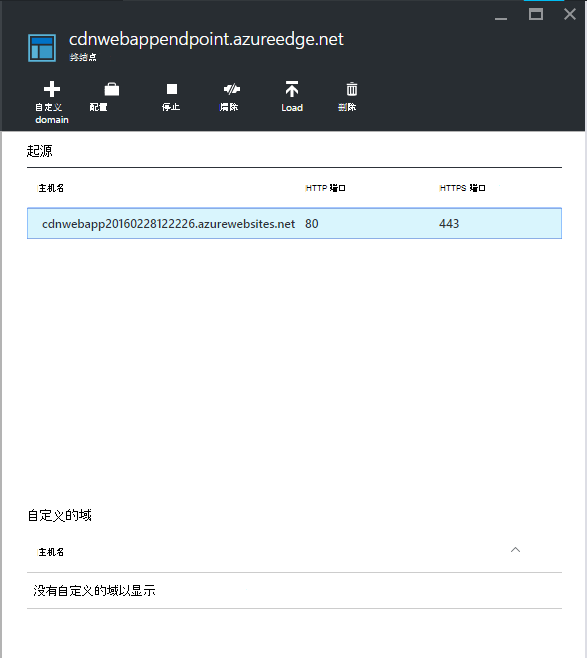

7. 刷新浏览器窗口 Azure 的 web 应用程序。 您现在应该看到正确加载了所有脚本和样式表。

## <a name="more-information"></a>详细信息 
- [Azure 内容传递网络 (CDN) 的概述](../cdn/cdn-overview.md)
- [使用 Azure CDN](../cdn/cdn-create-new-endpoint.md)
- [与 Azure CDN 集成云服务](../cdn/cdn-cloud-service-with-cdn.md)
- [ASP.NET 捆绑和缩小](http://www.asp.net/mvc/tutorials/mvc-4/bundling-and-minification)

