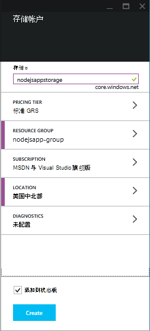
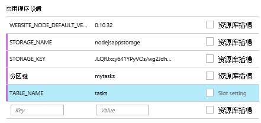

<properties
    pageTitle="Node.js web 应用程序使用 Azure 表服务"
    description="本教程将教您如何使用 Azure 表服务从 Node.js 应用程序托管的数据存储在 Azure 应用程序服务 Web 应用程序。"
    tags="azure-portal"
    services="app-service\web, storage"
    documentationCenter="nodejs"
    authors="rmcmurray"
    manager="wpickett"
    editor=""/>

<tags
    ms.service="storage"
    ms.workload="storage"
    ms.tgt_pltfrm="na"
    ms.devlang="nodejs"
    ms.topic="article"
    ms.date="08/11/2016"
    ms.author="robmcm"/>

# Node.js web 应用程序使用 Azure 表服务

## 概述

本教程展示如何使用表 Azure 数据管理所提供的服务来存储和从[节点]应用程序承载于[Azure 应用程序服务](http://go.microsoft.com/fwlink/?LinkId=529714)Web 应用程序中访问数据。 本教程假定您已经使用节点和[git 中获取]一些经验。

您将了解︰

* 如何使用 npm （节点软件包管理器） 来安装节点模块

* 如何使用 Azure 表服务

* 如何使用 Azure CLI 创建 web 应用程序。

通过遵循本教程中，您将生成一个简单的基于 web 的"待办事项列表"允许应用程序创建、 检索和完成任务。 表服务中存储的任务。

下面是完整的应用程序︰

![显示空的任务列表的 web 页][node-table-finished]

>[AZURE.NOTE] 如果您想要怎样的 Azure 帐户之前开始使用 Azure 应用程序服务，请转到[尝试应用程序服务](http://go.microsoft.com/fwlink/?LinkId=523751)，立即可以在此创建短期的初学者 web 应用程序在应用程序服务。 没有信用卡，所需;没有承诺。

## 系统必备组件

在这篇文章中的说明进行操作之前，确保您已经安装了以下产品︰

* [节点]版本 0.10.24 或更高版本

* [Git]

[AZURE.INCLUDE [create-account-and-websites-note](../../includes/create-account-and-websites-note.md)]

## 创建存储帐户。

创建一个 Azure 存储帐户。 该应用程序将使用此帐户来存储的待办事项项目。

1.  登录到[Azure 的门户](https://portal.azure.com/)。

2. 单击左下角的门户，在**新建**图标，然后单击**数据 + 存储** > **存储**。 提供一个唯一名称的存储帐户，并为其创建新的[资源组](../azure-resource-manager/resource-group-overview.md)。

    

    已创建存储帐户，**通知**按钮会闪烁绿色的**成功**和存储帐户的刀片式服务器已打开以显示它属于您创建新的资源组。

5. 单击**设置**中存储帐户的刀片 > **键**。 复制到剪贴板的主访问键。

    ![访问键][portal-storage-access-keys]

##安装模块和生成基架

本节将创建一个新的节点应用程序并使用 npm 添加模块软件包。 此应用程序中，您将使用[表达]和[Azure]模块。 速成版模块提供模型视图控制器框架节点，而 Azure 模块提供的表服务的连接。

### 安装速成版和生成基架

1. 从命令行，创建新目录命名**任务列表**并切换到该目录。  

2. 输入以下命令以安装速成版模块。

        npm install express-generator@4.2.0 -g

    取决于操作系统，您可能需要将 sudo 命令之前︰

        sudo npm install express-generator@4.2.0 -g

    将显示类似于下面的示例输出︰

        express-generator@4.2.0 /usr/local/lib/node_modules/express-generator
        ├── mkdirp@0.3.5
        └── commander@1.3.2 (keypress@0.1.0)

    > [AZURE.NOTE] -G 参数全局安装模块。 这样一来，我们可以使用**快速**生成 web 应用程序的基架，而无需键入附加路径信息。

4. 若要创建应用程序的基架，输入**明确**的命令︰

        express

    此命令的输出将显示类似于以下示例︰

           create : .
           create : ./package.json
           create : ./app.js
           create : ./public
           create : ./public/images
           create : ./routes
           create : ./routes/index.js
           create : ./routes/users.js
           create : ./public/stylesheets
           create : ./public/stylesheets/style.css
           create : ./views
           create : ./views/index.jade
           create : ./views/layout.jade
           create : ./views/error.jade
           create : ./public/javascripts
           create : ./bin
           create : ./bin/www

           install dependencies:
             $ cd . && npm install

           run the app:
             $ DEBUG=my-application ./bin/www

    现在，您有几个新的目录和**任务列表**目录中的文件。

### 安装附加模块

其中的某个文件，**明确**创建是**package.json**。 此文件包含模块依赖关系的列表。 以后，在部署应用程序到应用程序服务 Web 应用程序时，此文件将确定哪些模块需要在 Azure 上安装。

从命令行输入以下命令以安装模块**package.json**文件中所述。 您可能需要使用 sudo。

    npm install

此命令的输出将显示类似于以下示例︰

    debug@0.7.4 node_modules\debug

    cookie-parser@1.0.1 node_modules\cookie-parser
    ├── cookie-signature@1.0.3
    └── cookie@0.1.0

    [...]

接下来，输入以下命令以安装[azure]、[节点 uuid]、 [nconf]和[异步]模块︰

    npm install azure-storage node-uuid async nconf --save

**-保存**标志将这些模块的条目添加到**package.json**文件。

此命令的输出将显示类似于以下示例︰

    async@0.9.0 node_modules\async

    node-uuid@1.4.1 node_modules\node-uuid

    nconf@0.6.9 node_modules\nconf
    ├── ini@1.2.1
    ├── async@0.2.9
    └── optimist@0.6.0 (wordwrap@0.0.2, minimist@0.0.10)

    [...]

## 创建应用程序

现在，我们就可以生成该应用程序了。

### 创建模型

*模型*是一个对象，表示应用程序中的数据。 对于应用程序，只有模型是一个任务对象，它表示待办事项列表中的项。 任务将有以下字段︰

- PartitionKey
- RowKey
- 名称 （字符串）
- 类别 （字符串）
- 已完成 （布尔值）

**PartitionKey**和**RowKey**使用表服务作为表键。 有关详细信息，请参阅[了解表服务数据模型](https://msdn.microsoft.com/library/azure/dd179338.aspx)。

1. 在**任务列表**目录中，创建一个名为**模型**的新目录。

2. 在**模型**目录中，创建一个名为**task.js**的新文件。 此文件将包含您的应用程序创建的任务模型。

3. **Task.js**文件的开头添加以下代码，以引用所需的库︰

        var azure = require('azure-storage');
        var uuid = require('node-uuid');
        var entityGen = azure.TableUtilities.entityGenerator;

4. 添加以下代码以定义和导出任务对象。 此对象负责连接的表。

        module.exports = Task;

        function Task(storageClient, tableName, partitionKey) {
          this.storageClient = storageClient;
          this.tableName = tableName;
          this.partitionKey = partitionKey;
          this.storageClient.createTableIfNotExists(tableName, function tableCreated(error) {
            if(error) {
              throw error;
            }
          });
        };

5. 添加以下代码以定义其他方法对任务的对象允许在表中存储的数据的交互︰

        Task.prototype = {
          find: function(query, callback) {
            self = this;
            self.storageClient.queryEntities(this.tableName, query, null, function entitiesQueried(error, result) {
              if(error) {
                callback(error);
              } else {
                callback(null, result.entries);
              }
            });
          },

          addItem: function(item, callback) {
            self = this;
            // use entityGenerator to set types
            // NOTE: RowKey must be a string type, even though
            // it contains a GUID in this example.
            var itemDescriptor = {
              PartitionKey: entityGen.String(self.partitionKey),
              RowKey: entityGen.String(uuid()),
              name: entityGen.String(item.name),
              category: entityGen.String(item.category),
              completed: entityGen.Boolean(false)
            };
            self.storageClient.insertEntity(self.tableName, itemDescriptor, function entityInserted(error) {
              if(error){  
                callback(error);
              }
              callback(null);
            });
          },

          updateItem: function(rKey, callback) {
            self = this;
            self.storageClient.retrieveEntity(self.tableName, self.partitionKey, rKey, function entityQueried(error, entity) {
              if(error) {
                callback(error);
              }
              entity.completed._ = true;
              self.storageClient.updateEntity(self.tableName, entity, function entityUpdated(error) {
                if(error) {
                  callback(error);
                }
                callback(null);
              });
            });
          }
        }

6. 保存并关闭**task.js**文件。

### 创建控制器

*控制器*处理的 HTTP 请求并呈现 HTML 响应。

1. 在**任务列表中的路由**目录中，创建一个名为**tasklist.js**的新文件，在文本编辑器中打开它。

2. 将以下代码添加到**tasklist.js**中。 这样会加载 azure 和异步模块，由**tasklist.js**。 这还将定义**任务列表**功能，传递我们前面定义的**任务**对象的实例︰

        var azure = require('azure-storage');
        var async = require('async');

        module.exports = TaskList;

3. 定义**任务列表**对象。

        function TaskList(task) {
          this.task = task;
        }

4. 将下列方法添加到**任务列表**︰

        TaskList.prototype = {
          showTasks: function(req, res) {
            self = this;
            var query = new azure.TableQuery()
              .where('completed eq ?', false);
            self.task.find(query, function itemsFound(error, items) {
              res.render('index',{title: 'My ToDo List ', tasks: items});
            });
          },

          addTask: function(req,res) {
            var self = this;
            var item = req.body.item;
            self.task.addItem(item, function itemAdded(error) {
              if(error) {
                throw error;
              }
              res.redirect('/');
            });
          },

          completeTask: function(req,res) {
            var self = this;
            var completedTasks = Object.keys(req.body);
            async.forEach(completedTasks, function taskIterator(completedTask, callback) {
              self.task.updateItem(completedTask, function itemsUpdated(error) {
                if(error){
                  callback(error);
                } else {
                  callback(null);
                }
              });
            }, function goHome(error){
              if(error) {
                throw error;
              } else {
               res.redirect('/');
              }
            });
          }
        }

### 修改 app.js

1. 从**任务列表**的目录，打开**app.js**文件。 通过运行**快速**命令之前创建此文件。

2. 该文件的开头添加以下项加载 azure 模块，设置表名称、 分区键，并设置此示例使用存储凭据︰

        var azure = require('azure-storage');
        var nconf = require('nconf');
        nconf.env()
             .file({ file: 'config.json', search: true });
        var tableName = nconf.get("TABLE_NAME");
        var partitionKey = nconf.get("PARTITION_KEY");
        var accountName = nconf.get("STORAGE_NAME");
        var accountKey = nconf.get("STORAGE_KEY");

    > [AZURE.NOTE] nconf 将从环境变量或**config.json**文件中，我们将在以后创建加载的配置值。

3. 在 app.js 文件中，向下滚动位置看到以下行︰

        app.use('/', routes);
        app.use('/users', users);

    下面显示的代码替换上面的行。 这将初始化一个连接到您的存储帐户的<strong>任务</strong>实例。 这被传递到<strong>任务列表</strong>、 将使用它的通讯与表服务︰

        var TaskList = require('./routes/tasklist');
        var Task = require('./models/task');
        var task = new Task(azure.createTableService(accountName, accountKey), tableName, partitionKey);
        var taskList = new TaskList(task);

        app.get('/', taskList.showTasks.bind(taskList));
        app.post('/addtask', taskList.addTask.bind(taskList));
        app.post('/completetask', taskList.completeTask.bind(taskList));

4. 将**app.js**文件保存。

### 修改索引视图

1. 在文本编辑器中打开**tasklist/views/index.jade**文件。

2. 下面的代码替换该文件的全部内容。 此示例定义一个视图，显示现有的任务，还包含用于添加新任务，将现有的标记为已完成的表单。

        extends layout

        block content
          h1= title
          br

          form(action="/completetask", method="post")
            table.table.table-striped.table-bordered
              tr
                td Name
                td Category
                td Date
                td Complete
              if (typeof tasks === "undefined")
                tr
                  td
              else
                each task in tasks
                  tr
                    td #{task.name._}
                    td #{task.category._}
                    - var day   = task.Timestamp._.getDate();
                    - var month = task.Timestamp._.getMonth() + 1;
                    - var year  = task.Timestamp._.getFullYear();
                    td #{month + "/" + day + "/" + year}
                    td
                      input(type="checkbox", name="#{task.RowKey._}", value="#{!task.completed._}", checked=task.completed._)
            button.btn(type="submit") Update tasks
          hr
          form.well(action="/addtask", method="post")
            label Item Name:
            input(name="item[name]", type="textbox")
            label Item Category:
            input(name="item[category]", type="textbox")
            br
            button.btn(type="submit") Add item

3. 保存并关闭**index.jade**文件。

### 修改全局布局

**视图**目录中的**layout.jade**文件是其他**.jade**文件的全局模板。 在此步骤中，您将修改就可以使用[使用 Twitter 的引导](https://github.com/twbs/bootstrap)，这是一个可以轻松地设计好外观的 web 应用程序的工具包。

下载并解压缩这些文件[使用 Twitter，引导](http://getbootstrap.com/)的。 将**bootstrap.min.css**文件从引导**css**文件夹复制到您的应用程序的**公共/样式表**目录。

从 [**视图**] 文件夹，打开**layout.jade** ，用以下内容替换整个内容︰

    doctype html
    html
      head
        title= title
        link(rel='stylesheet', href='/stylesheets/bootstrap.min.css')
        link(rel='stylesheet', href='/stylesheets/style.css')
      body.app
        nav.navbar.navbar-default
          div.navbar-header
          a.navbar-brand(href='/') My Tasks
        block content

### 创建配置文件

若要运行该应用程序本地，我们将放在 Azure 存储凭据配置文件。 创建一个名为**config.json**与下面的 JSON 文件︰

    {
        "STORAGE_NAME": "<storage account name>",
        "STORAGE_KEY": "<storage access key>",
        "PARTITION_KEY": "mytasks",
        "TABLE_NAME": "tasks"
    }

**存储帐户名称**替换前面，创建存储帐户的名称和**存储访问键**替换为您的存储帐户的主访问键。 例如︰

    {
        "STORAGE_NAME": "nodejsappstorage",
        "STORAGE_KEY": "KG0oDd..."
        "PARTITION_KEY": "mytasks",
        "TABLE_NAME": "tasks"
    }

保存**任务列表**目录，这比该文件*目录更高一级*︰

    parent/
      |-- config.json
      |-- tasklist/

这样做的目的是避免签入源代码管理，配置文件它可能成为公用。 当我们到 Azure 部署应用程序时，我们将使用环境变量而不是配置文件。

## 本地运行应用程序

若要测试您的本地计算机上的应用程序，请执行以下步骤︰

1. 从命令行中，将目录更改到**任务列表**的目录。

2. 使用下面的命令启动本地应用程序︰

        npm start

3. 打开 web 浏览器，然后定位到 http://127.0.0.1:3000。

    出现类似于下面的示例的 web 页。

    ![网页显示空任务列表][node-table-finished]

4. 若要创建一个新的待办事项项目，输入名称和类别，然后单击**添加项**。 

6. 将任务标记为已完成，检查**完成**，然后单击**更新任务**。

    ![图像的新项在列表中的任务][node-table-list-items]

即使在本地运行应用程序，它 Azure 表服务中存储的数据。

## 部署到 Azure 应用程序

本节中的步骤使用 Azure 的命令行工具来创建新的 web 应用程序在应用程序服务，然后使用 Git 来部署您的应用程序。 若要执行这些步骤必须 Azure 的订阅。

> [AZURE.NOTE] 此外可以通过使用[Azure 门户](https://portal.azure.com/)中执行这些步骤。 请参阅[生成和部署 Node.js web 应用程序在 Azure 应用程序服务]。
>
> 如果您已经创建了第一个 web 应用程序，您必须使用 Azure 门户部署此应用程序。

若要开始，请从命令行输入以下命令以安装[Azure CLI] :

    npm install azure-cli -g

### 导入发布设置

在此步骤中，您将下载文件包含有关您的订购信息。

1. 输入以下命令︰

        azure account download

    此命令启动浏览器并导航到下载页。 如果出现提示，请登录与 Azure 订阅关联的帐户。

    <!-- ![The download page][download-publishing-settings] -->

    开始文件下载自动保存功能。如果不是的话，您可以单击链接页后，可以手动下载该文件的开头。 保存文件，请注意，文件路径。

2. 输入以下命令来导入设置︰

        azure account import <path-to-file>

    指定在上一步中下载的发布设置文件的路径和文件名称。

3. 导入设置后，请删除发布设置文件。 它不再需要并提供与 Azure 订阅相关的敏感信息。

### 创建应用程序服务 web 应用程序

1. 从命令行中，将目录更改到**任务列表**的目录。

2. 使用下面的命令来创建新的 web 应用程序。

        azure site create --git

    系统将提示您为 web 应用程序的名称和位置。 提供唯一的名称，并选择作为您的 Azure 存储帐户的同一地理位置。

    `--git`参数为此 web 应用程序中创建对 Azure 上 Git 存储库。 如果不存在，并且添加名为 azure，用来发布到 Azure 应用程序[远程 Git]还初始化 Git 存储库当前目录中。 最后，它将创建一个**web.config**文件，其中包含使用 Azure 主机节点应用程序设置。 如果省略`--git`参数，但该目录包含一个 Git 存储库中，该命令仍然会创建 azure 远程。

    完成此命令后，您将看到类似于下面的输出。 请注意，**网站在创建**开头的行包含 web 应用程序的 URL。

        info:   Executing command site create
        help:   Need a site name
        Name: TableTasklist
        info:   Using location southcentraluswebspace
        info:   Executing `git init`
        info:   Creating default .gitignore file
        info:   Creating a new web site
        info:   Created web site at  tabletasklist.azurewebsites.net
        info:   Initializing repository
        info:   Repository initialized
        info:   Executing `git remote add azure https://username@tabletasklist.azurewebsites.net/TableTasklist.git`
        info:   site create command OK

    > [AZURE.NOTE] 如果这是您的订购的第一个应用程序服务 web 应用程序，还会指导您使用 Azure 门户创建 web 应用程序。 有关详细信息，请参阅[生成和部署 Node.js web 应用程序在 Azure 应用程序服务]。

### 设置环境变量

在此步骤中，您将对 web 应用程序配置在 Azure 上添加环境变量。
从命令行中，输入以下命令︰

    azure site appsetting add
        STORAGE_NAME=<storage account name>;STORAGE_KEY=<storage access key>;PARTITION_KEY=mytasks;TABLE_NAME=tasks

更换**<storage account name>**您先前创建的存储名称帐户和替换**<storage access key>**与您的存储帐户的主访问键。 （与您在前面创建的 config.json 文件使用相同的值）。

或者，您可以在[Azure 门户](https://portal.azure.com/)设置环境变量︰

1.  单击**浏览**以打开 web 应用程序的刀片式服务器 > **Web 应用程序**> 您 web 应用程序的名称。

1.  在 web 应用程序的刀片式服务器，请单击**所有设置** > **应用程序设置**。

    <!--  -->

1.  向下滚动到**应用程序设置**部分，添加键/值对。

    

1. 单击**保存**。

### 发布应用程序

要发布的应用程序，向 Git 提交的代码文件，然后推到 azure/主服务器。

1. 设置部署凭据。

        azure site deployment user set <name> <password>

2. 添加并提交您的应用程序文件。

        git add .
        git commit -m "adding files"

3. 将提交推送到应用程序服务 web 应用程序︰

        git push azure master

    作为**主**目标分支。 在部署结束时，您会看到与以下示例类似的语句︰

        To https://username@tabletasklist.azurewebsites.net/TableTasklist.git
         * [new branch]      master -> master

4. 推送操作完成后，浏览到 web 应用程序 URL 返回以前的`azure create site`命令来查看您的应用程序。

## 下一步行动

尽管本文中的步骤介绍如何使用表服务来存储信息，还可以使用[MongoDB](https://mlab.com/azure/)。 

## 其他资源

[Azure CLI]

## 会发生什么变化
* 有关更改网站为应用程序服务的指南，请参阅︰ [Azure 应用程序服务，并对现有的 Azure 服务及其影响](http://go.microsoft.com/fwlink/?LinkId=529714)

<!-- URLs -->

[生成和部署 Node.js web 应用程序在 Azure 应用程序服务]: web-sites-nodejs-develop-deploy-mac.md
[Azure Developer Center]: /develop/nodejs/

[节点]: http://nodejs.org
[Git]: http://git-scm.com
[速成版]: http://expressjs.com
[for free]: http://windowsazure.com
[Git 远程]: http://git-scm.com/docs/git-remote

[Azure CLI]: ../xplat-cli-install.md

[azure]: https://github.com/Azure/azure-sdk-for-node
[节点 uuid]: https://www.npmjs.com/package/node-uuid
[nconf]: https://www.npmjs.com/package/nconf
[异步]: https://www.npmjs.com/package/async

[Azure Portal]: https://portal.azure.com

[Create and deploy a Node.js application to an Azure Web Site]: web-sites-nodejs-develop-deploy-mac.md
 
<!-- Image References -->

[node-table-finished]: ./media/storage-nodejs-use-table-storage-web-site/table_todo_empty.png
[node-table-list-items]: ./media/storage-nodejs-use-table-storage-web-site/table_todo_list.png
[download-publishing-settings]: ./media/storage-nodejs-use-table-storage-web-site/azure-account-download-cli.png
[portal-new]: ./media/storage-nodejs-use-table-storage-web-site/plus-new.png
[portal-storage-account]: ./media/storage-nodejs-use-table-storage-web-site/new-storage.png
[portal-quick-create-storage]: ./media/storage-nodejs-use-table-storage-web-site/quick-storage.png
[portal-storage-access-keys]: ./media/storage-nodejs-use-table-storage-web-site/manage-access-keys.png
[go-to-dashboard]: ./media/storage-nodejs-use-table-storage-web-site/go_to_dashboard.png
[web-configure]: ./media/storage-nodejs-use-table-storage-web-site/sql-task-configure.png
[app-settings-save]: ./media/storage-nodejs-use-table-storage-web-site/savebutton.png
[app-settings]: ./media/storage-nodejs-use-table-storage-web-site/storage-tasks-appsettings.png
