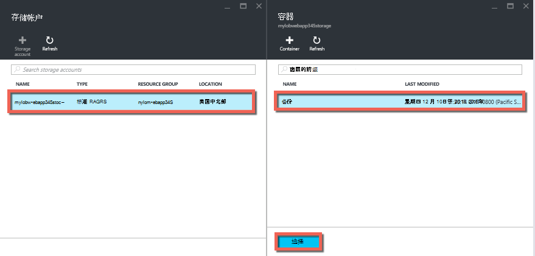
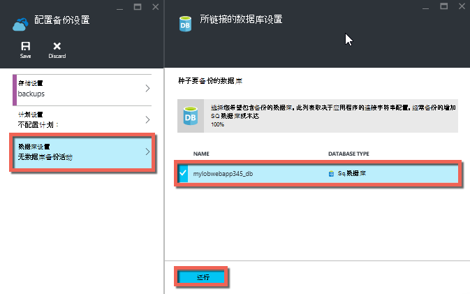
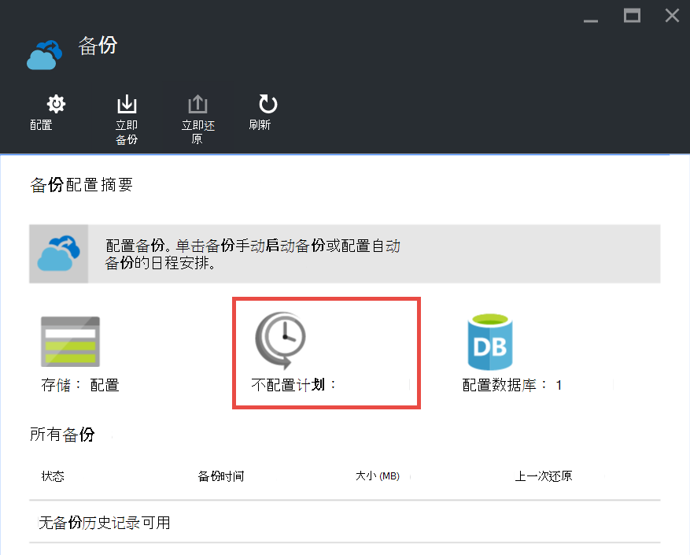

<properties 
    pageTitle="备份在 Azure 应用程序" 
    description="了解如何在 Azure 应用程序服务中创建您的应用程序的备份。" 
    services="app-service" 
    documentationCenter="" 
    authors="cephalin" 
    manager="wpickett" 
    editor="jimbe"/>

<tags 
    ms.service="app-service" 
    ms.workload="na" 
    ms.tgt_pltfrm="na" 
    ms.devlang="na" 
    ms.topic="article" 
    ms.date="07/06/2016" 
    ms.author="cephalin"/>

# 备份在 Azure 应用程序

[Azure 应用程序服务](../app-service/app-service-value-prop-what-is.md)中的备份和还原功能，可以轻松地手动或自动创建应用程序的备份。 您可以将您的应用程序还原到以前的状态，或创建新的应用程序基于一个原始应用程序的备份。 

有关从备份恢复应用程序的信息，请参阅[还原 Azure 中的应用程序](web-sites-restore.md)。

## 获取备份 
应用程序服务可以备份以下信息︰

* 应用程序配置
* 文件内容
* 任何 Azure SQL 数据库或连接到您的应用程序 （您可以选择要包括在备份中） 的 Azure MySQL (ClearDB) 数据库

此信息已备份到 Azure 存储帐户和您指定的容器。 

> [AZURE.NOTE] 每个备份是完成您的应用程序，不是增量更新的脱机副本。

## 要求和限制

* 备份和还原功能要求要在**标准**层或更高版本的应用程序服务计划。 有关扩展您的应用程序服务计划，以使用更高的层的详细信息，请参阅[在 Azure 应用程序扩展](web-sites-scale.md)。 请注意，**特优**层允许更多的每日备份比**标准**层。
* 您需要一个 Azure 存储帐户和为要备份的应用程序相同的订阅中的容器。 在 Azure 存储帐户的详细信息，请参阅本文结尾处的[链接](#moreaboutstorage)。
* 备份可以最多 10GB 的应用程序和数据库的内容。 如果备份的大小超出此限制，则会发生错误。 

## 创建手动备份

2. 在[Azure 门户网站](https://portal.azure.com)中，导航到您的应用程序的刀片式服务器，选择**设置**，然后**备份**。 将显示**备份**刀片式服务器。
    
    ![备份页][ChooseBackupsPage]

    >[AZURE.NOTE]如果看到下面的消息时，单击它以继续备份之前升级您的应用程序服务的计划。
有关更多信息，请参见[在 Azure 应用程序扩展](web-sites-scale.md)。  
    >

3. 在**备份**刀片式服务器，请单击**存储︰ 未配置**配置存储帐户。

    ![选择存储帐户][ChooseStorageAccount]
    
4. 通过选择**存储帐户**和**容器**中选择备份的目标位置。 存储帐户必须属于同一预订为您要备份的应用程序。 如果您愿意，您可以在各自刀片式服务器中创建新的存储帐户或一个新的容器。 当您完成时，单击**选择**。
    
    
    
5. 在**配置备份设置**刀片式服务器，仍处于打开状态，单击**数据库设置**，然后选择您想要在 （SQL 数据库或 MySQL），备份中包含的数据库，然后单击**确定**。  

    

    > [AZURE.NOTE]  显示在此列表中的数据库，**应用程序设置**刀片式服务器为您的应用程序的**连接字符串**中必须存在的连接字符串。

6. 在**配置备份设置**刀片式服务器，单击**保存**。  

7. 在**备份**刀片式服务器的命令栏中，单击**立即备份**。
    
    ![BackUpNow 按钮][BackUpNow]
    
    在备份过程中，您会看到进度消息。

配置帐户存储和备份的容器之后，您可以进行手动备份任何时候。  

## 配置自动的备份

1. 在**备份**刀片式服务器，请单击**计划︰ 未配置**。 

    
    
1. **备份日程安排设置**刀片式服务器，设置**备份安排**为**上**，然后根据需要配置备份时间表，单击**确定**。
    
    ![启用自动的备份][SetAutomatedBackupOn]
    
4. 在**配置备份设置**刀片式服务器，仍处于打开状态，单击**存储设置**，然后通过选择**存储帐户**和**容器**选择备份的目标位置。 存储帐户必须属于同一预订为您要备份的应用程序。 如果您愿意，您可以在各自刀片式服务器中创建新的存储帐户或一个新的容器。 当您完成时，单击**选择**。
    
    
    
5. 在**配置备份设置**刀片式服务器，单击**数据库设置**，然后选择您想要在 （SQL 数据库或 MySQL），备份中包含的数据库，然后单击**确定**。  

    

    > [AZURE.NOTE]  显示在此列表中的数据库，**应用程序设置**刀片式服务器为您的应用程序的**连接字符串**中必须存在的连接字符串。

6. 在**配置备份设置**刀片式服务器，单击**保存**。  

## 您的应用程序的备份只是一部分

有时您不想备份您的应用程序中的所有内容。 下面是一些示例︰

-   您[设置的每周备份](web-sites-backup.md#configure-automated-backups)应用程序包含静态内容，永远不会更改，例如，旧的博客张贴内容或图像。
-   您的应用程序超过 10 GB 的内容 （即您可以一次备份的最大金额）。
-   您不想备份的日志文件。

部分备份将使您可以选择完全备份所需的文件。

### 从备份中排除文件

若要从备份中排除文件和文件夹，创建`_backup.filter`文件在您的应用程序的 D:\home\site\wwwroot 文件夹中并指定要排除在文件和文件夹的列表。 可以轻松地访问此是通过[Kudu 控制台](https://github.com/projectkudu/kudu/wiki/Kudu-console)。 

假设您有一个应用程序，包含日志文件和从过去的年里，永远不会更改的静态图像。 已经有包括旧图像的应用程序的完整备份。 现在您想备份应用程序的每一天，但不想支付用于存储日志文件或永远不会更改的静态图像文件。

![日志文件夹][LogsFolder]
![图像文件夹][ImagesFolder]
    
以下步骤显示如何您将这些文件从备份中排除。

1. 转到`http://{yourapp}.scm.azurewebsites.net/DebugConsole`，并确定要从备份中排除的文件夹。 在此示例中，您将想要排除下列文件和文件夹显示在该用户界面中︰

        D:\home\site\wwwroot\Logs
        D:\home\LogFiles
        D:\home\site\wwwroot\Images\2013
        D:\home\site\wwwroot\Images\2014
        D:\home\site\wwwroot\Images\brand.png

    [AZURE.NOTE] 最后一行显示了您可以排除个人文件以及文件夹。

2. 创建名为的文件`_backup.filter`并将上面的列表放在文件中，但是删除`D:\home`。 列出一个目录或文件每行。 因此，文件的内容应为︰

    \site\wwwroot\Logs \LogFiles \site\wwwroot\Images\2013 \site\wwwroot\Images\2014 \site\wwwroot\Images\brand.png

3. 上载到此文件`D:\home\site\wwwroot\`目录的网站使用[ftp](web-sites-deploy.md#ftp)或任何其他方法。 如果您愿意，您可以创建文件直接在`http://{yourapp}.scm.azurewebsites.net/DebugConsole`和插入内容存在。

4. 一样平常它、[手动](#create-a-manual-backup)或[自动](#configure-automated-backups)运行备份。

现在，任何文件和文件夹中指定的`_backup.filter`将从备份中排除。 在此示例中，日志文件和 2013年和 2014年图像文件将不再会备份，以及 brand.png。

>[AZURE.NOTE] 还原您的网站的部分备份相同的方式[恢复常规备份](web-sites-restore.md)。 还原过程将做正确的事。
>
>还原完整备份后，使用备份中的任何内容替换站点上的所有内容。 如果文件位于网站上，但不是备份中它将被删除。 但部分备份还原时，任何内容都位于一个已列入黑名单的目录，或列入黑名单的任何文件，保留原样。

## 备份的存储方式

做您的应用程序的一个或多个备份后，备份将在您的存储帐户，以及您的应用程序**容器**刀片式服务器上可见。 在存储帐户，每个备份组成的.zip 文件中包含的备份数据和.xml 文件，包含.zip 文件内容的清单。 可以将解压缩并浏览这些文件，如果您想要访问您的备份而不实际执行了应用程序恢复。

.Zip 文件的根目录中存储应用程序的数据库备份。 对于 SQL 数据库，这是一个 BACPAC 文件 （无文件扩展名），并且可以导入。 若要创建新的 SQL 数据库，基于 BACPAC 导出，请参阅[导入 BACPAC 文件来创建新的用户数据库](http://technet.microsoft.com/library/hh710052.aspx)。

> [AZURE.WARNING] **Websitebackups**容器中的文件的任何更改可能会导致备份变得无效，因此非可恢复。

## 下一步行动
有关从备份中还原应用程序的信息，请参阅[还原 Azure 中的应用程序](web-sites-restore.md)。 您还可以备份和还原应用程序服务使用 REST API 的应用程序 （请参见[使用其他备份和还原应用程序服务的应用程序](websites-csm-backup.md)）。

>[AZURE.NOTE] 如果您想要怎样的 Azure 帐户之前开始使用 Azure 应用程序服务，请转到[尝试应用程序服务](http://go.microsoft.com/fwlink/?LinkId=523751)，立即可以在此创建短期的初学者 web 应用程序在应用程序服务。 没有信用卡，所需;没有承诺。

<!-- IMAGES -->
[ChooseBackupsPage]: ./media/web-sites-backup/01ChooseBackupsPage.png
[ChooseStorageAccount]: ./media/web-sites-backup/02ChooseStorageAccount.png
[IncludedDatabases]: ./media/web-sites-backup/03IncludedDatabases.png
[BackUpNow]: ./media/web-sites-backup/04BackUpNow.png
[BackupProgress]: ./media/web-sites-backup/05BackupProgress.png
[SetAutomatedBackupOn]: ./media/web-sites-backup/06SetAutomatedBackupOn.png
[Frequency]: ./media/web-sites-backup/07Frequency.png
[StartDate]: ./media/web-sites-backup/08StartDate.png
[StartTime]: ./media/web-sites-backup/09StartTime.png
[SaveIcon]: ./media/web-sites-backup/10SaveIcon.png
[ImagesFolder]: ./media/web-sites-backup/11Images.png
[LogsFolder]: ./media/web-sites-backup/12Logs.png
[GhostUpgradeWarning]: ./media/web-sites-backup/13GhostUpgradeWarning.png
 
