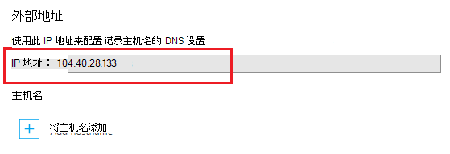

<properties
    pageTitle="安全应用程序的自定义的域使用 HTTPS |Microsoft Azure"
    description="了解如何安全的自定义域名 Azure 应用程序服务在您的应用程序通过配置 SSL 证书绑定。 您还将了解如何从多个工具获取 SSL 证书。"
    services="app-service"
    documentationCenter=".net"
    authors="cephalin"
    manager="wpickett"
    editor="jimbe"
    tags="top-support-issue"/>

<tags
    ms.service="app-service"
    ms.workload="na"
    ms.tgt_pltfrm="na"
    ms.devlang="na"
    ms.topic="article"
    ms.date="08/08/2016"
    ms.author="cephalin"/>

# 保护您的应用程序使用 HTTPS 的自定义域

> [AZURE.SELECTOR]
- [买 Azure 中的 SSL 证书](web-sites-purchase-ssl-web-site.md)
- [从其他地方使用 SSL 证书](web-sites-configure-ssl-certificate.md)

本文介绍了如何为 web 应用程序、 移动应用程序的后端或 API 应用程序中使用自定义域名的[Azure 应用程序服务](../app-service/app-service-value-prop-what-is.md)启用 HTTPS。 它涵盖为仅用于服务器身份验证。 如果您需要相互身份验证 （包括客户端身份验证），请参阅[如何向配置 TLS 相互身份验证为应用程序服务](app-service-web-configure-tls-mutual-auth.md)。

要通过 HTTPS 安全保障具有自定义域名的应用程序，您可以添加该域名的证书。 默认情况下，保护 Azure ** \*。 azurewebsites.net**一个 SSL 证书，以便您的客户端已经可以访问在您的应用程序使用的通配符域**https://*&lt;应用程序名 >*。 azurewebsites.net**。但如果您想要使用一个自定义的域，如**contoso.com**， **www.contoso.com**，和** \*。 contoso.com**，默认证书不能保护的。 此外，像所有[通配符证书](https://casecurity.org/2014/02/26/pros-and-cons-of-single-domain-multi-domain-and-wildcard-certificates/)，默认证书不是对该自定义域使用自定义的域和证书一样安全。   

>[AZURE.NOTE] 您可以从 Azure 随时在[Azure 论坛](https://azure.microsoft.com/support/forums/)上的专家获得帮助。 对于更加个性化的支持，转到[Azure 支持](https://azure.microsoft.com/support/options/)，然后单击**获取支持**。

## 您的需要
来保护自定义域名使用 HTTPS，您将自定义的 SSL 证书绑定到 Azure 中的自定义域。 绑定之前自定义证书，您需要执行下列操作︰

- **配置自定义的域**的应用程序服务只允许添加在您的应用程序已配置的域名的证书。 有关说明，请参阅[映射到 Azure 应用程序自定义域名](web-sites-custom-domain-name.md)。 
- **向上扩展到基本层或更高版本**应用程序服务计划，在较低的价格层次中不支持自定义的 SSL 证书。 有关说明，请参阅[扩大在 Azure 应用程序](web-sites-scale.md)。 
- 您需要获得一个从受信任[的证书颁发机构](http://en.wikipedia.org/wiki/Certificate_authority)(CA)**获取 SSL 证书**-如果您还没有，请。 证书必须满足以下所有要求︰

    - 它是由受信任的 CA （没有专用 CA 服务器） 签名的。
    - 它包含一个私有密钥。
    - 它是密钥交换，为创建和导出到。PFX 文件。
    - 它使用至少为 2048年位加密。
    - 其主题名不符合所需安全的自定义域。 若要保护一份证书具有多个域，您需要使用一个通配符名称 (例如**\*。 contoso.com**) 或指定 subjectAltName 值。
    - 它合并在一起使用您的 CA 的所有**[中间证书](http://en.wikipedia.org/wiki/Intermediate_certificate_authorities)**。 否则，可能在某些客户端遇到 irreproducible 的互操作性问题。

        >[AZURE.NOTE]         [在 Azure 的门户网站直接购买](web-sites-purchase-ssl-web-site.md)是最简单的方法来获取 SSL 证书，以满足所有的要求。 本文介绍如何手动进行，然后将它绑定到您的应用程序服务中的自定义域。
        >   
        > **椭圆曲线加密 (ECC) 证书**可以使用的应用程序服务，但这篇文章的范围之外。 处理您的 CA 上创建 ECC 证书的具体步骤。

## 第 1 步。 获取 SSL 证书

由于 CAs 提供不同的 SSL 证书类型，不同的价位，应首先决定要购买的 SSL 证书的类型。 若要保护一个域名 (**www.contoso.com**)，您只需要基本的证书。 若要安全的多个域名 (**contoso.com** *和* **www.contoso.com** 
*和* **mail.contoso.com**)，[通配符证书](http://en.wikipedia.org/wiki/Wildcard_certificate)或者带有[接受方备用名称](http://en.wikipedia.org/wiki/SubjectAltName)的证书，则需要 (`subjectAltName`)。

一旦您知道要购买的 SSL 证书，则提交证书签名请求 (CSR) 给 CA。 当您从 CA 重新获得请求的证书时，然后从证书生成一个.pfx 文件。 您可以执行下列步骤使用您选择的工具。 下面是常用的工具的说明︰

- [Certreq.exe 步骤](#bkmk_certreq)-Windows 实用程序用于创建证书请求。 Windows XP/Windows 服务器 2000年起了 Windows 的一部分。
- [IIS 管理器步骤](#bkmk_iismgr)-如果您已经熟悉它的好的工具。
- [OpenSSL 步骤](#bkmk_openssl)-一个[开源、 跨平台工具](https://www.openssl.org)。 使用它来帮助您从任何平台获取 SSL 证书。
- [使用 OpenSSL subjectAltName 步骤](#bkmk_subjectaltname)的步骤来获取`subjectAltName`证书。

如果您想要购买证书之前测试应用程序服务中的设置，您可以生成一个[自签名的证书](https://en.wikipedia.org/wiki/Self-signed_certificate)。 本教程将为您提供两种方法可以生成︰

- [自签名的证书，Certreq.exe 步骤](#bkmk_sscertreq)
- [自签名的证书，OpenSSL 步骤](#bkmk_ssopenssl)

### 获取证书使用 Certreq.exe

1. 创建一个文件 (例如**myrequest.txt**)，将以下文本复制到其中并将其保存在工作目录中。 更换`<your-domain>`与您的应用程序的自定义域名的占位符。

        [NewRequest]
        Subject = "CN=<your-domain>"  ; E.g. "CN=www.contoso.com", or "CN=*.contoso.com" for a wildcard certificate
        Exportable = TRUE
        KeyLength = 2048              ; Required minimum is 2048
        KeySpec = 1
        KeyUsage = 0xA0
        MachineKeySet = True
        ProviderName = "Microsoft RSA SChannel Cryptographic Provider"
        ProviderType = 12
        HashAlgorithm = SHA256

        [EnhancedKeyUsageExtension]
        OID=1.3.6.1.5.5.7.3.1         ; Server Authentication

    在 CSR，选项和其他可用选项的详细信息，请参阅[certreq 中的参考文档](https://technet.microsoft.com/library/dn296456.aspx)。

4. 在命令提示符下，`CD`为您的工作目录和运行下面的命令来创建 CSR:

        certreq -new myrequest.txt myrequest.csr

    **myrequest.csr**现在在当前工作目录中创建。

5. 提交到 CA，以获取 SSL 证书的**myrequest.csr** 。 上载文件，或将其内容复制到 web 窗体的文本编辑器时。

    Microsoft 的受信任的 Ca 的列表，请参阅[Microsoft 受信任的根证书程序︰ 参与者][cas]。

6. 一旦 CA 回复了您的证书 (。CER) 文件，保存在工作目录中。 然后，运行以下命令来完成挂起的 CSR。

        certreq -accept -user <certificate-name>.cer

    此命令将完成的证书存储在 Windows 证书存储区。

6. 如果您的 CA 使用中间证书，请在继续操作之前进行安装。 它们通常是作为单独的下载从您的 CA，并以几种不同的 web 服务器类型格式。 选择 Microsoft iis 的版本。

    一旦您下载证书，每个在 Windows 资源管理器中右击并选择 **安装证书**。 在**证书导入向导**中使用的默认值并继续选择**下一步**，直至完成导入。

7. 若要从证书存储中导出您的 SSL 证书，请按`Win` + `R` ，然后运行**certmgr.msc**启动证书管理器。 选择**个人** > **证书**。 在**颁发给**列中，您应该看到一个条目与您自定义的域的名称，用于在**颁发者**列中生成证书的 CA。

    ![插入图像的证书管理器][certmgr]

9. 用鼠标右键单击证书，然后选择**所有任务** > **导出**。 在**证书导出向导**中，单击**下一步**，然后选择**是，导出私钥**，然后再次单击**下一步**。

    ![导出私钥][certwiz1]

10. 选择**个人信息交换的 PKCS #12**，**包括如果可能的证书路径中所有证书**，请**导出所有扩展的属性**。 然后，单击**下一步**。

    ![包括所有证书和扩展的属性][certwiz2]

11. 选择**密码**，然后输入并确认密码。 单击**下一步**。

    ![指定的密码][certwiz3]

12. 提供带有扩展名为**.pfx**的导出证书的路径和文件名。 单击**下一步**完成。

    ![提供的文件路径][certwiz4]

现在您可以将导出的 PFX 文件上载到应用程序服务。 请参阅[第 2 步。上载并绑定的自定义的 SSL 证书](#bkmk_configuressl)。

### 获取使用 IIS 管理器的证书

1. 生成一个 CSR 使用 IIS 管理器将发送到 CA。 生成 CSR 的详细信息，请参阅[请求 Internet 服务器证书 (IIS 7)][iiscsr]。

3. 提交您的 CSR 向 CA 来获取 SSL 证书。 Microsoft 的受信任的 Ca 的列表，请参阅[Microsoft 受信任的根证书程序︰ 参与者][cas]。

3. 完成的 CSR 发送给您的 CA 的证书。 正在完成 CSR 的详细信息，请参阅[安装 Internet 服务器证书 (IIS 7)][installcertiis]。

4. 如果您的 CA 使用中间证书，请在继续操作之前进行安装。 它们通常是作为单独的下载从您的 CA，并以几种不同的 web 服务器类型格式。 选择 Microsoft iis 的版本。

    一旦您下载证书，每个在 Windows 资源管理器中右击并选择**安装证书**。 
    在**证书导入向导**中使用的默认值并继续选择**下一步**，直至完成导入。

4. 从 IIS 管理器中导出的 SSL 证书。 有关导出证书的详细信息，请参阅[导出服务器证书 (IIS 7)][exportcertiis]。 

    >[AZURE.IMPORTANT] 在**证书导出向导**，请确保您选择**是，导出私钥**  
    >
    >![导出私钥][certwiz1]  
    >
    > 并同时选择**个人信息交换的 PKCS #12**，**包括如果可能的证书路径中所有证书**，并    **导出所有扩展的属性**。
    >
    >![包括所有证书和扩展的属性][certwiz2]

现在您可以将导出的 PFX 文件上载到应用程序服务。 请参阅[第 2 步。上载并绑定的自定义的 SSL 证书](#bkmk_configuressl)。

### 获取使用 OpenSSL 证书

1. 在命令行的终端，`CD`在工作目录生成私钥和 CSR 通过运行以下命令︰

        openssl req -sha256 -new -nodes -keyout myserver.key -out server.csr -newkey rsa:2048

2. 出现提示时，输入相应的信息。 例如︰

        Country Name (2 letter code)
        State or Province Name (full name) []: Washington
        Locality Name (eg, city) []: Redmond
        Organization Name (eg, company) []: Microsoft
        Organizational Unit Name (eg, section) []: Azure
        Common Name (eg, YOUR name) []: www.microsoft.com
        Email Address []:

        Please enter the following 'extra' attributes to be sent with your certificate request

        A challenge password []:

    完成后，您应在工作目录中有两个文件︰ **myserver.key**和**server.csr**。 
    **Server.csr**包含 CSR，和以后需要**myserver.key** 。

3. 提交您的 CSR 向 CA 来获取 SSL 证书。 Microsoft 的受信任的 Ca 的列表，请参阅[Microsoft 受信任的根证书程序︰ 参与者][cas]。

4. 一旦 CA 发送请求的证书，请将其保存到名为**myserver.crt**工作目录中的文件。 如果您的 CA 提供的文本格式，只需将内容复制到文本编辑器中的**myserver.crt** ，并将其保存。 您的文件应如下所示︰

        -----BEGIN CERTIFICATE-----
        MIIDJDCCAgwCCQCpCY4o1LBQuzANBgkqhkiG9w0BAQUFADBUMQswCQYDVQQGEwJV
        UzELMAkGA1UECBMCV0ExEDAOBgNVBAcTB1JlZG1vbmQxEDAOBgNVBAsTB0NvbnRv
        c28xFDASBgNVBAMTC2NvbnRvc28uY29tMB4XDTE0MDExNjE1MzIyM1oXDTE1MDEx
        NjE1MzIyM1owVDELMAkGA1UEBhMCVVMxCzAJBgNVBAgTAldBMRAwDgYDVQQHEwdS
        ZWRtb25kMRAwDgYDVQQLEwdDb250b3NvMRQwEgYDVQQDEwtjb250b3NvLmNvbTCC
        ASIwDQYJKoZIhvcNAQEBBQADggEPADCCAQoCggEBAN96hBX5EDgULtWkCRK7DMM3
        enae1LT9fXqGlbA7ScFvFivGvOLEqEPD//eLGsf15OYHFOQHK1hwgyfXa9sEDPMT
        3AsF3iWyF7FiEoR/qV6LdKjeQicJ2cXjGwf3G5vPoIaYifI5r0lhgOUqBxzaBDZ4
        xMgCh2yv7NavI17BHlWyQo90gS2X5glYGRhzY/fGp10BeUEgIs3Se0kQfBQOFUYb
        ktA6802lod5K0OxlQy4Oc8kfxTDf8AF2SPQ6BL7xxWrNl/Q2DuEEemjuMnLNxmeA
        Ik2+6Z6+WdvJoRxqHhleoL8ftOpWR20ToiZXCPo+fcmLod4ejsG5qjBlztVY4qsC
        AwEAATANBgkqhkiG9w0BAQUFAAOCAQEAVcM9AeeNFv2li69qBZLGDuK0NDHD3zhK
        Y0nDkqucgjE2QKUuvVSPodz8qwHnKoPwnSrTn8CRjW1gFq5qWEO50dGWgyLR8Wy1
        F69DYsEzodG+shv/G+vHJZg9QzutsJTB/Q8OoUCSnQS1PSPZP7RbvDV9b7Gx+gtg
        7kQ55j3A5vOrpI8N9CwdPuimtu6X8Ylw9ejWZsnyy0FMeOPpK3WTkDMxwwGxkU3Y
        lCRTzkv6vnHrlYQxyBLOSafCB1RWinN/slcWSLHADB6R+HeMiVKkFpooT+ghtii1
        A9PdUQIhK9bdaFicXPBYZ6AgNVuGtfwyuS5V6ucm7RE6+qf+QjXNFg==
        -----END CERTIFICATE-----

5. 在命令行的终端中，运行下面的命令以导出从**myserver.key**和**myserver.crt** **myserver.pfx** :

        openssl pkcs12 -export -out myserver.pfx -inkey myserver.key -in myserver.crt

    出现提示时，定义一个密码来保护该.pfx 文件。

    > [AZURE.NOTE] 如果您的 CA 使用中间证书，您必须包括它们与`-certfile`参数。 它们通常是作为单独的下载从您的 CA，并以几种不同的 web 服务器类型格式。 选择的版本与`.pem`扩展名。
    >
    > 您`openssl -export`命令应类似于下面的示例创建一个.pfx 文件，包括中间证书从**中间 cets.pem**文件︰
    >  
    > `openssl pkcs12 -chain -export -out myserver.pfx -inkey myserver.key -in myserver.crt -certfile intermediate-cets.pem`

现在您可以将导出的 PFX 文件上载到应用程序服务。 请参阅[第 2 步。上载并绑定的自定义的 SSL 证书](#bkmk_configuressl)。

### 获取使用 OpenSSL SubjectAltName 证书

1. 创建名为**sancert.cnf**的文件，将以下文本复制到其中，并将其保存在工作目录中︰

        # -------------- BEGIN custom sancert.cnf -----
        HOME = .
        oid_section = new_oids
        [ new_oids ]
        [ req ]
        default_days = 730
        distinguished_name = req_distinguished_name
        encrypt_key = no
        string_mask = nombstr
        req_extensions = v3_req # Extensions to add to certificate request
        [ req_distinguished_name ]
        countryName = Country Name (2 letter code)
        countryName_default =
        stateOrProvinceName = State or Province Name (full name)
        stateOrProvinceName_default =
        localityName = Locality Name (eg, city)
        localityName_default =
        organizationalUnitName  = Organizational Unit Name (eg, section)
        organizationalUnitName_default  =
        commonName              = Your common name (eg, domain name)
        commonName_default      = www.mydomain.com
        commonName_max = 64
        [ v3_req ]
        subjectAltName=DNS:ftp.mydomain.com,DNS:blog.mydomain.com,DNS:*.mydomain.com
        # -------------- END custom sancert.cnf -----

    开头的行中`subjectAltName`的值替换为要保护的所有域名 (除了 `commonName`)。 例如︰

        subjectAltName=DNS:sales.contoso.com,DNS:support.contoso.com,DNS:fabrikam.com

    您不需要更改任何其他字段中，包括`commonName`。 系统将提示您指定它们在接下来的几个步骤。

1. 在命令行的终端，`CD`为您的工作目录和运行下面的命令︰

        openssl req -sha256 -new -nodes -keyout myserver.key -out server.csr -newkey rsa:2048 -config sancert.cnf

2. 出现提示时，输入相应的信息。 例如︰

        Country Name (2 letter code) []: US
        State or Province Name (full name) []: Washington
        Locality Name (eg, city) []: Redmond
        Organizational Unit Name (eg, section) []: Azure
        Your common name (eg, domain name) []: www.microsoft.com

    完成后，您应在工作目录中有两个文件︰ **myserver.key**和**server.csr**。 
    **Server.csr**包含 CSR，和以后需要**myserver.key** 。

3. 提交您的 CSR 向 CA 来获取 SSL 证书。 Microsoft 的受信任的 Ca 的列表，请参阅[Microsoft 受信任的根证书程序︰ 参与者][cas]。

4. 一旦 CA 发送请求的证书，请将其保存到名为**myserver.crt**的文件中。 如果您的 CA 提供的文本格式，只需将内容复制到文本编辑器中的**myserver.crt** ，并将其保存。 该文件应如下所示︰

        -----BEGIN CERTIFICATE-----
        MIIDJDCCAgwCCQCpCY4o1LBQuzANBgkqhkiG9w0BAQUFADBUMQswCQYDVQQGEwJV
        UzELMAkGA1UECBMCV0ExEDAOBgNVBAcTB1JlZG1vbmQxEDAOBgNVBAsTB0NvbnRv
        c28xFDASBgNVBAMTC2NvbnRvc28uY29tMB4XDTE0MDExNjE1MzIyM1oXDTE1MDEx
        NjE1MzIyM1owVDELMAkGA1UEBhMCVVMxCzAJBgNVBAgTAldBMRAwDgYDVQQHEwdS
        ZWRtb25kMRAwDgYDVQQLEwdDb250b3NvMRQwEgYDVQQDEwtjb250b3NvLmNvbTCC
        ASIwDQYJKoZIhvcNAQEBBQADggEPADCCAQoCggEBAN96hBX5EDgULtWkCRK7DMM3
        enae1LT9fXqGlbA7ScFvFivGvOLEqEPD//eLGsf15OYHFOQHK1hwgyfXa9sEDPMT
        3AsF3iWyF7FiEoR/qV6LdKjeQicJ2cXjGwf3G5vPoIaYifI5r0lhgOUqBxzaBDZ4
        xMgCh2yv7NavI17BHlWyQo90gS2X5glYGRhzY/fGp10BeUEgIs3Se0kQfBQOFUYb
        ktA6802lod5K0OxlQy4Oc8kfxTDf8AF2SPQ6BL7xxWrNl/Q2DuEEemjuMnLNxmeA
        Ik2+6Z6+WdvJoRxqHhleoL8ftOpWR20ToiZXCPo+fcmLod4ejsG5qjBlztVY4qsC
        AwEAATANBgkqhkiG9w0BAQUFAAOCAQEAVcM9AeeNFv2li69qBZLGDuK0NDHD3zhK
        Y0nDkqucgjE2QKUuvVSPodz8qwHnKoPwnSrTn8CRjW1gFq5qWEO50dGWgyLR8Wy1
        F69DYsEzodG+shv/G+vHJZg9QzutsJTB/Q8OoUCSnQS1PSPZP7RbvDV9b7Gx+gtg
        7kQ55j3A5vOrpI8N9CwdPuimtu6X8Ylw9ejWZsnyy0FMeOPpK3WTkDMxwwGxkU3Y
        lCRTzkv6vnHrlYQxyBLOSafCB1RWinN/slcWSLHADB6R+HeMiVKkFpooT+ghtii1
        A9PdUQIhK9bdaFicXPBYZ6AgNVuGtfwyuS5V6ucm7RE6+qf+QjXNFg==
        -----END CERTIFICATE-----

5. 在命令行的终端中，运行下面的命令以导出从**myserver.key**和**myserver.crt** **myserver.pfx** :

        openssl pkcs12 -export -out myserver.pfx -inkey myserver.key -in myserver.crt

    出现提示时，定义一个密码来保护该.pfx 文件。

    > [AZURE.NOTE] 如果您的 CA 使用中间证书，您必须包括它们与`-certfile`参数。 它们通常是作为单独的下载从您的 CA，并以几种不同的 web 服务器类型格式。 选择的版本与`.pem`扩展名)。
    >
    > 您`openssl -export`命令应类似于下面的示例创建一个.pfx 文件，包括中间证书从**中间 cets.pem**文件︰
    >  
    > `openssl pkcs12 -chain -export -out myserver.pfx -inkey myserver.key -in myserver.crt -certfile intermediate-cets.pem`

现在您可以将导出的 PFX 文件上载到应用程序服务。 请参阅[第 2 步。上载并绑定的自定义的 SSL 证书](#bkmk_configuressl)。

### 生成一个自签名的证书，使用 Certreq.exe ###

>[AZURE.IMPORTANT] 自签署的证书将仅用于测试目的。 访问的网站，受一个自签名证书时，大多数浏览器都将返回错误。 某些浏览器可能甚至拒绝以导航到该网站。 

1. 创建一个文本文件 (例如**mycert.txt**)，将下面的文本复制到其中并将文件保存在工作目录中。 更换`<your-domain>`与您的应用程序的自定义域名的占位符。

        [NewRequest]
        Subject = "CN=<your-domain>"  ; E.g. "CN=www.contoso.com", or "CN=*.contoso.com" for a wildcard certificate
        Exportable = TRUE
        KeyLength = 2048              ; KeyLength can be 2048, 4096, 8192, or 16384 (required minimum is 2048)
        KeySpec = 1
        KeyUsage = 0xA0
        MachineKeySet = True
        ProviderName = "Microsoft RSA SChannel Cryptographic Provider"
        ProviderType = 12
        HashAlgorithm = SHA256
        RequestType = Cert            ; Self-signed certificate
        ValidityPeriod = Years
        ValidityPeriodUnits = 1

        [EnhancedKeyUsageExtension]
        OID=1.3.6.1.5.5.7.3.1         ; Server Authentication

    重要的参数是`RequestType = Cert`，它指定自签名的证书。 
    在 CSR，选项和其他可用选项的详细信息，请参阅[certreq 中的参考文档](https://technet.microsoft.com/library/dn296456.aspx)。

4. 在命令提示符处，`CD`为您的工作目录和运行下面的命令︰

        certreq -new mycert.txt mycert.crt
    
    新的自签名的证书的证书存储中现在已安装。

7. 若要从证书存储中导出证书，请按`Win` + `R` ，然后运行**certmgr.msc**启动证书管理器。 选择**个人** > **证书**。 在**颁发给**列中，您应该看到一个条目与您自定义的域的名称，用于在**颁发者**列中生成证书的 CA。

    ![插入图像的证书管理器][certmgr]

9. 用鼠标右键单击证书，然后选择**所有任务** > **导出**。 在**证书导出向导**中，单击**下一步**，然后选择**是，导出私钥**，然后再次单击**下一步**。

    ![导出私钥][certwiz1]

10. 选择**个人信息交换的 PKCS #12**，**包括如果可能的证书路径中所有证书**，请**导出所有扩展的属性**。 然后，单击**下一步**。

    ![包括所有证书和扩展的属性][certwiz2]

11. 选择**密码**，然后输入并确认密码。 单击**下一步**。

    ![指定的密码][certwiz3]

12. 提供带有扩展名为**.pfx**的导出证书的路径和文件名。 单击**下一步**完成。

    ![提供的文件路径][certwiz4]

现在您可以将导出的 PFX 文件上载到应用程序服务。 请参阅[第 2 步。上载并绑定的自定义的 SSL 证书](#bkmk_configuressl)。

###生成一个自签名的证书使用 OpenSSL ###

>[AZURE.IMPORTANT] 自签署的证书将仅用于测试目的。 访问的网站，受一个自签名证书时，大多数浏览器都将返回错误。 某些浏览器可能甚至拒绝以导航到该网站。 

1. 创建一个文本文件，名为**serverauth.cnf**，然后将以下内容复制到其中，然后将其保存在工作目录中︰

        [ req ]
        default_bits           = 2048
        default_keyfile        = privkey.pem
        distinguished_name     = req_distinguished_name
        attributes             = req_attributes
        x509_extensions        = v3_ca

        [ req_distinguished_name ]
        countryName         = Country Name (2 letter code)
        countryName_min         = 2
        countryName_max         = 2
        stateOrProvinceName     = State or Province Name (full name)
        localityName            = Locality Name (eg, city)
        0.organizationName      = Organization Name (eg, company)
        organizationalUnitName      = Organizational Unit Name (eg, section)
        commonName          = Common Name (eg, your app's domain name)
        commonName_max          = 64
        emailAddress            = Email Address
        emailAddress_max        = 40

        [ req_attributes ]
        challengePassword       = A challenge password
        challengePassword_min       = 4
        challengePassword_max       = 20

        [ v3_ca ]
         subjectKeyIdentifier=hash
         authorityKeyIdentifier=keyid:always,issuer:always
         basicConstraints = CA:false
         keyUsage=nonRepudiation, digitalSignature, keyEncipherment
         extendedKeyUsage = serverAuth

2. 在命令行的终端，`CD`为您的工作目录和运行下面的命令︰

        openssl req -sha256 -x509 -nodes -days 365 -newkey rsa:2048 -keyout myserver.key -out myserver.crt -config serverauth.cnf

    此命令将创建两个文件︰ **myserver.crt** （自签名证书） 和**myserver.key** （私钥），根据**serverauth.cnf**中的设置。

3. 将证书导出到一个.pfx 文件，通过运行以下命令︰

        openssl pkcs12 -export -out myserver.pfx -inkey myserver.key -in myserver.crt

    出现提示时，定义一个密码来保护该.pfx 文件。

现在您可以将导出的 PFX 文件上载到应用程序服务。 请参阅[第 2 步。上载并绑定的自定义的 SSL 证书](#bkmk_configuressl)。

## 第 2 步。 上载并绑定的自定义的 SSL 证书

移动之前，查看[您所需要](#bkmk_domainname)的部分，并验证︰

- 有自定义的域映射到 Azure 应用程序，
- 在**基本**层或更高，运行您的应用程序和
- 可以自定义从 CA 域的 SSL 证书。

1. 在浏览器中，打开**[Azure 门户。](https://portal.azure.com/)**
2.  单击在左侧页面的**应用程序服务**选项。
3.  单击您要向其分配此证书的应用程序的名称。 
4.  在**设置**，单击**SSL 证书**
5.  单击**上载证书**
6.  选择在[步骤 1](#bkmk_getcert)中导出的.pfx 文件，并指定您以前创建的密码。 然后，单击**上载**上载证书。 您现在应该看到上载回中刀片式服务器**的 SSL 证书**的证书。
7. 在**ssl 绑定**部分单击**添加绑定**
8. 在**添加 SSL 绑定**刀片式服务器中使用下拉列表选择要使用 SSL，并使用证书保护的域名。 您还可以选择是否使用**[服务器名称指示 (SNI)](http://en.wikipedia.org/wiki/Server_Name_Indication)**或基于 IP 的 SSL。

    

       •    IP based SSL associates a certificate with a domain name by mapping the dedicated public IP address of the server to the domain name. This requires each domain name (contoso.com, fabricam.com, etc.) associated with your service to have a dedicated IP address. This is the traditional          method of associating SSL certificates with a web server.
       •    SNI based SSL is an extension to SSL and **[Transport Layer Security](http://en.wikipedia.org/wiki/Transport_Layer_Security)** (TLS) that allows multiple domains to share the same IP address, with separate security certificates for each domain. Most modern browsers (including Internet Explorer, Chrome, Firefox and Opera) support SNI, however older browsers may not support SNI. For more information on SNI, see the **[Server Name Indication](http://en.wikipedia.org/wiki/Server_Name_Indication)** article on Wikipedia.
     
9. 单击**添加绑定**以保存所做的更改并启用 SSL。

## 第 3 步。 更改您的域名称映射 （基于 IP 的 SSL 仅）

如果您使用**SNI SSL**绑定只，跳过此部分。 多个**SNI SSL**绑定可以对现有共享的 IP 地址分配给您的应用程序协同工作。 但是，如果您创建**基于 IP 的 SSL**绑定，应用程序服务创建一个专用的 IP 地址绑定因为一个**基于 IP 的 SSL**要求。 只有一个专用 IP 地址可以创建，因此可能会添加一个**基于 IP 的 SSL**绑定。

由于此专用 IP 地址，您需要配置您的应用程序更多，如果︰

- [使用 A 记录您自定义的域映射](web-sites-custom-domain-name.md#a)到 Azure 应用程序，并且您只需添加**基于 IP 的 SSL**绑定。 在这种情况下，您需要重新映射的现有记录到专用 IP 地址指向通过执行以下步骤︰

    1. 在配置之后基于 IP 的 SSL 绑定，一个专用的 IP 地址分配给您的应用程序。 在您的应用程序的**主机名**部分上方的设置下，**自定义的域**页面上可以找到此 IP 地址。 它将列为**外部 IP 地址**
    
        

    2. [重新映射自定义域名到此新的 IP 地址的 A 记录](web-sites-custom-domain-name.md#a)。

- 您的应用程序中已经有一个或多个**SNI SSL**绑定，您刚添加的**基于 IP 的 SSL**绑定。 一旦完成，该绑定您*&lt;应用程序名 >*。 azurewebsites.net 域名称指向新的 IP 地址。 因此，任何现有[自定义的域中的 CNAME 映射](web-sites-custom-domain-name.md#cname)到*&lt;应用程序名 >*。 azurewebsites.net，包括**SNI SSL**安全，还接收通信的新地址，创建为**基于 IP 的 SSL**只。 在这种情况下，您需要将**SNI SSL**通信，并发送回原始共享的 IP 地址，通过执行以下步骤︰

    1. 确定所有[的自定义的域的 CNAME 映射](web-sites-custom-domain-name.md#cname)到您具有**SNI SSL**绑定的应用程序。

    2. 重新映射到每个 CNAME 记录**sni。**&lt;应用程序名 >。 而不是 azurewebsites.net&lt;应用程序名 >。 azurewebsites.net。

## 第 4 步。 测试 HTTPS 为您自定义的域

现在剩下要做的就是确保 HTTPS 工作为您自定义的域。 在各种浏览器中，浏览到`https://<your.custom.domain>`来查看它服务于您的应用程序组成。

- 如果您的应用程序提供了证书验证错误，您可能正在使用自签名的证书。

- 如果不是这种情况，您可能会遗漏了中间证书导出.pfx 证书时。 返回到[所需内容](#bkmk_domainname)来验证您的 CSR 满足应用程序服务的所有要求。

## 在您的应用程序上强制 HTTPS

如果仍要允许您的应用程序的 HTTP 访问，请跳过此步骤。 应用程序服务进行*不*强制使用 HTTPS，以便访问者仍可以访问您的应用程序使用 HTTP。 如果您想要为您的应用程序强制使用 HTTPS，您可以定义中的重写规则`web.config`为您的应用程序的文件。 每个应用程序服务的应用程序有此文件，而不考虑您的应用程序的语言框架。

> [AZURE.NOTE] 没有特定语言的请求的重定向。 ASP.NET MVC 可以使用[RequireHttps](http://msdn.microsoft.com/library/system.web.mvc.requirehttpsattribute.aspx)筛选器而不是在重写规则`web.config`（请参见[部署到 web 应用程序安全 ASP.NET MVC 5 应用程序](web-sites-dotnet-deploy-aspnet-mvc-app-membership-oauth-sql-database.md)）。

请按照下列步骤操作︰

1. 导航到您应用程序 Kudu 调试控制台。 其地址为`https://<appname>.scm.azurewebsites.net/DebugConsole`。

2. 在调试控制台中，CD 与`D:\home\site\wwwroot`。

3. 打开`web.config`通过单击的笔按钮。

    

    如果您部署您的应用程序使用 Visual Studio 或 Git，应用程序服务会自动生成相应的`web.config`.NET、 PHP、 Node.js 或 Python 应用程序在应用程序根目录中的。 
    如果`web.config`并不存在，则运行`touch web.config`中的基于 web 的命令提示符下创建它。 或者，您可以在本地项目中创建并重新部署您的代码。

4. 如果您必须创建`web.config`，将以下代码复制到它并将其保存。 如果您打开现有 web.config 文件中，则只需复制整个`<rule>`标记到您`web.config`的`configuration/system.webServer/rewrite/rules`元素。

        <?xml version="1.0" encoding="UTF-8"?>
        <configuration>
          <system.webServer>
            <rewrite>
              <rules>
                <!-- BEGIN rule TAG FOR HTTPS REDIRECT -->
                <rule name="Force HTTPS" enabled="true">
                  <match url="(.*)" ignoreCase="false" />
                  <conditions>
                    <add input="{HTTPS}" pattern="off" />
                  </conditions>
                  <action type="Redirect" url="https://{HTTP_HOST}/{R:1}" appendQueryString="true" redirectType="Permanent" />
                </rule>
                <!-- END rule TAG FOR HTTPS REDIRECT -->
              </rules>
            </rewrite>
          </system.webServer>
        </configuration>

    每当用户请求页面时使用 HTTP，此规则到 HTTPS 协议返回 HTTP 301 （永久重定向）。 它将重定向从 http://contoso.com 到 https://contoso.com。

    >[AZURE.IMPORTANT] 如果有其他已`<rule>`中标记您`web.config`，然后将复制`<rule>`标记之前另`<rule>`标记。

4. 将文件保存在 Kudu 调试控制台。 它应生效立即将所有请求重都定向到 HTTPS。

有关 IIS URL 重写模块的详细信息，请参阅[URL 重写](http://www.iis.net/downloads/microsoft/url-rewrite)文档。

## 更多的资源 ##
- [微软 Azure 信任中心](/support/trust-center/security/)
- [解除锁定在 Azure 网站配置选项](/blog/2014/01/28/more-to-explore-configuration-options-unlocked-in-windows-azure-web-sites/)
- [启用诊断日志记录](web-sites-enable-diagnostic-log.md)
- [在 Azure 应用程序服务中配置 web 应用程序](web-sites-configure.md)
- [Azure 的管理门户](https://manage.windowsazure.com)

>[AZURE.NOTE] 如果您想要怎样的 Azure 帐户之前开始使用 Azure 应用程序服务，请转到[尝试应用程序服务](http://go.microsoft.com/fwlink/?LinkId=523751)，立即可以在此创建短期的起始应用程序的应用程序服务中。 没有信用卡，所需;没有承诺。

[customdomain]: web-sites-custom-domain-name.md
[iiscsr]: http://technet.microsoft.com/library/cc732906(WS.10).aspx
[cas]: http://social.technet.microsoft.com/wiki/contents/articles/31634.microsoft-trusted-root-certificate-program-participants-v-2016-april.aspx
[installcertiis]: http://technet.microsoft.com/library/cc771816(WS.10).aspx
[exportcertiis]: http://technet.microsoft.com/library/cc731386(WS.10).aspx
[openssl]: http://www.openssl.org/
[portal]: https://manage.windowsazure.com/
[tls]: http://en.wikipedia.org/wiki/Transport_Layer_Security
[staticip]: ./media/web-sites-configure-ssl-certificate/staticip.png
[website]: ./media/web-sites-configure-ssl-certificate/sslwebsite.png
[scale]: ./media/web-sites-configure-ssl-certificate/sslscale.png
[standard]: ./media/web-sites-configure-ssl-certificate/sslreserved.png
[pricing]: /pricing/details/
[configure]: ./media/web-sites-configure-ssl-certificate/sslconfig.png
[uploadcert]: ./media/web-sites-configure-ssl-certificate/ssluploadcert.png
[uploadcertdlg]: ./media/web-sites-configure-ssl-certificate/ssluploaddlg.png
[sslbindings]: ./media/web-sites-configure-ssl-certificate/sslbindings.png
[sni]: http://en.wikipedia.org/wiki/Server_Name_Indication
[certmgr]: ./media/web-sites-configure-ssl-certificate/waws-certmgr.png
[certwiz1]: ./media/web-sites-configure-ssl-certificate/waws-certwiz1.png
[certwiz2]: ./media/web-sites-configure-ssl-certificate/waws-certwiz2.png
[certwiz3]: ./media/web-sites-configure-ssl-certificate/waws-certwiz3.png
[certwiz4]: ./media/web-sites-configure-ssl-certificate/waws-certwiz4.png

