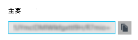

<properties
    pageTitle="到 Redis 缓存通过还协议连接在 Azure 应用程序服务 web 应用程序 |Microsoft Azure"
    description="将在 Azure 应用程序服务 web 应用程序连接到使用还协议 Redis 高速缓存"
    services="app-service\web"
    documentationCenter="php"
    authors="SyntaxC4"
    manager="wpickett"
    editor="riande"/>

<tags
    ms.service="app-service-web"
    ms.devlang="php"
    ms.topic="get-started-article"
    ms.tgt_pltfrm="windows"
    ms.workload="na"
    ms.date="02/29/2016"
    ms.author="cfowler"/>

# <a name="connect-a-web-app-in-azure-app-service-to-redis-cache-via-the-memcache-protocol"></a>到 Redis 缓存通过还协议连接在 Azure 应用程序服务 web 应用程序

在本文中，您将学习如何将[Azure 应用程序服务](http://go.microsoft.com/fwlink/?LinkId=529714)中的一个 WordPress web 应用程序连接到[Azure Redis 缓存][ 12] [还]使用[13]协议。 如果您有使用 Memcached 服务器的内存中缓存对现有 web 应用程序，可以将其迁移到 Azure 应用程序服务和第一方缓存解决方案中使用 Microsoft Azure 很少或没有更改到您应用程序的代码。 此外，您可以使用您现有的还专业知识来创建高度可伸缩、 分布式 Azure 应用程序服务使用 Azure Redis 高速缓存中的应用程序内存中缓存，同时使用.NET、 PHP、 Node.js，Java 和 Python 等受欢迎的应用程序框架。  

应用程序服务 Web 应用程序启用此 Web 应用程序还填补，即充当还代理缓存调用 Azure Redis 缓存本地 Memcached 服务器程序的应用程序方案。 这样，任何应用程序使用 Redis 缓存来缓存数据还协议进行通信。 因此可以使用的任何应用程序或应用程序框架，只要它使用还协议进行通信，此还填补工作协议级别。

[AZURE.INCLUDE [app-service-web-to-api-and-mobile](../../includes/app-service-web-to-api-and-mobile.md)] 

## <a name="prerequisites"></a>系统必备组件

可以与任何应用程序使用 Web 应用程序还填补，提供其使用的还协议进行通信。 对于此特定示例中，引用应用程序是可以从 Azure 市场配置的可伸缩的 WordPress 站点。

请按照以下文章中列出的步骤操作︰

* [设置 Azure Redis 缓存服务的实例][0]
* [部署在 Azure 的可伸缩的 WordPress 站点][1]

一旦有了可伸缩的 WordPress 站点部署和配置的 Redis 高速缓存实例将准备好继续进行使 Azure 应用程序服务 Web 应用程序中的还填补。

## <a name="enable-the-web-apps-memcache-shim"></a>启用 Web 应用程序还垫片

为了配置还填充程序，您必须创建三个应用程序设置。 这可以使用各种方法，包括[Azure 门户网站](http://go.microsoft.com/fwlink/?LinkId=529715)，[传统门户网站][3]， [Azure PowerShell Cmdlet] [ 5] [Azure 命令行界面]或[5]。 这篇文章的目的，我将使用[Azure 门户网站][4]设置应用程序设置。 下面的值可以从 Redis 缓存实例的**设置**刀片式服务器中检索。


### <a name="add-redishost-app-setting"></a>添加 REDIS_HOST 的应用程序设置

您需要创建的第一个应用程序设置是**REDIS\_主机**应用程序设置。 这个选项设置填充程序将缓存信息转发到目标。 可以从 Redis 缓存实例的**属性**刀片式服务器检索所需的 REDIS_HOST 应用程序设置的值。


设置对应用程序设置的键**REDIS\_主机**和 Redis 缓存实例的**主机名**为应用程序设置的值。


### <a name="add-rediskey-app-setting"></a>添加 REDIS_KEY 的应用程序设置

您需要创建的第二个应用程序设置是**REDIS\_键**应用程序设置。 该设置提供了 Redis 高速缓存实例安全地访问要求的身份验证令牌。 您可以检索所需的 Redis 高速缓存实例的**访问键**刀片式服务器的 REDIS_KEY 应用程序设置的值。



设置对应用程序设置的键**REDIS\_键**和 Redis 缓存实例的**主关键字**的应用程序设置的值。


### <a name="add-memcacheshimredisenable-app-setting"></a>添加 MEMCACHESHIM_REDIS_ENABLE 的应用程序设置

最后一个应用程序设置用于启用还启动程序使用 REDIS_HOST 和 REDIS_KEY 连接到 Azure Redis 缓存和转发缓存的 Web 应用程序中调用。 设置对应用程序设置的键**MEMCACHESHIM\_REDIS\_启用**的值为**true**。


一旦您完成添加三 （3） 的应用程序设置中，单击**保存**。

## <a name="enable-memcache-extension-for-php"></a>Php 中启用还扩展

使应用程序能够说话还协议，有必要安装 PHP — WordPress 站点的语言框架还扩展。

### <a name="download-the-phpmemcache-extension"></a>下载 php_memcache 扩展名

浏览到[PECL][6]。 在缓存类别中，单击[还][7]。 列下下载 DLL 链接。


下载非线程安全 (NTS) x86 版本的 PHP 在 Web 应用程序中启用链接。 （默认值为 PHP 5.4）


### <a name="enable-the-phpmemcache-extension"></a>启用 php_memcache 扩展

下载该文件后，将解压缩并将上载**php\_memcache.dll**到**d:\\家庭\\网站\\wwwroot\\bin\\分机\\**目录。 Php_memcache.dll 上载到 web 应用程序后，您需要启用对 PHP 运行时扩展。 要启用在 Azure 门户还扩展，打开 web 应用程序，**应用程序设置**刀片式服务器，然后使用的键将添加新的应用程序设置**PHP\_扩展**和**bin\\分机\\php_memcache.dll**。


> [AZURE.NOTE] 如果 web 应用程序需要加载多个 PHP 扩展，PHP_EXTENSIONS 的值应为逗号分隔列表的 DLL 文件的相对路径。


完成后，单击**保存**。

## <a name="install-memcache-wordpress-plugin"></a>安装还 WordPress 插件

> [AZURE.NOTE] 您还可以从 WordPress.org 下载[Memcached 对象缓存插件](https://wordpress.org/plugins/memcached/)。

在 WordPress 插件页面上，单击**添加**。


在搜索框中键入**memcached**并按**enter 键**。


在列表中，查找**Memcached 对象缓存**，然后单击**立即安装**。


### <a name="enable-the-memcache-wordpress-plugin"></a>启用还 WordPress 插件

>[AZURE.NOTE] 按照此博客如何[启用 Web 应用程序中的分机][8]安装 Visual Studio 团队服务。

在`wp-config.php`文件中添加下面的代码上面编辑备注文件的末尾停止。

```php
$memcached_servers = array(
    'default' => array('localhost:' . getenv("MEMCACHESHIM_PORT"))
);
```

一旦已粘贴此代码，摩纳哥将自动保存文档。

下一步是使对象缓存插件。 这是通过将拖放**对象 cache.php**从**wp-内容/插件/memcached**文件夹到**wp 内容**文件夹启用还对象缓存功能。


既然**对象 cache.php**文件是在**wp 内容**文件夹，Memcached 对象缓存已启用。


## <a name="verify-the-memcache-object-cache-plugin-is-functioning"></a>验证还对象缓存插件工作正常

现在，所有上述步骤启用 Web 应用程序还填补都完成了。 唯一的事情就左是验证数据填充 Redis 缓存实例。

### <a name="enable-the-non-ssl-port-support-in-azure-redis-cache"></a>启用非 SSL 端口支持 Azure Redis 缓存中

>[AZURE.NOTE] 在撰写本文时，Redis CLI 不支持 SSL 连接，因此，以下步骤是必需。

在 Azure 门户中，浏览到您为此 web 应用程序中创建的 Redis 高速缓存实例。 打开缓存的刀片式服务器后，请单击**设置**图标。


从列表中选择**的端口的访问**。


**只有通过 SSL 允许访问**，请单击**否**。


您会看到现在已设置非 SSL 端口。 单击**保存**。


### <a name="connect-to-azure-redis-cache-from-redis-cli"></a>从 redis cli 连接到 Azure Redis 高速缓存

>[AZURE.NOTE] 此步骤假定您的开发计算机上本地安装的 redis。 [安装使用这些说明本地 Redis][9]。

打开选择的命令行控制台，然后键入下面的命令︰

```shell
redis-cli –h <hostname-for-redis-cache> –a <primary-key-for-redis-cache> –p 6379
```

更换**&lt;主机名为 redis 缓存&gt;**与实际 xxxxx.redis.cache.windows.net 主机名和**&lt;主键为 redis 缓存&gt;**与缓存的访问键，然后按**enter 键**。 一旦 CLI 已连接到 Redis 缓存实例，发出 redis 的任何命令。 在下面的屏幕截图，我选择要列出的键。


列表项的调用应返回一个值。 如果不是这样，请尝试导航到 web 应用程序，然后重试。

## <a name="conclusion"></a>结论

祝贺您 ！ WordPress 的应用程序现在有集中的内存中缓存，以帮助提高吞吐量。 请记住，Web 应用程序还填充程序可以用任何还客户端无需考虑编程语言或应用程序框架。 若要提供反馈或提问有关 Web 应用程序还填充程序，发布到[MSDN 论坛][10]或[Stackoverflow][11]。

>[AZURE.NOTE] 如果您想要怎样的 Azure 帐户之前开始使用 Azure 应用程序服务，请转到[尝试应用程序服务](http://go.microsoft.com/fwlink/?LinkId=523751)，立即可以在此创建短期的初学者 web 应用程序在应用程序服务。 没有信用卡，所需;没有承诺。

## <a name="whats-changed"></a>会发生什么变化
* 有关更改网站为应用程序服务的指南，请参阅︰ [Azure 应用程序服务，并对现有的 Azure 服务的影响](http://go.microsoft.com/fwlink/?LinkId=529714)


[0]: ../redis-cache/cache-dotnet-how-to-use-azure-redis-cache.md#create-a-cache
[1]: http://bit.ly/1t0KxBQ
[2]: http://manage.windowsazure.com
[3]: http://portal.azure.com
[4]: ../powershell-install-configure.md
[5]: /downloads
[6]: http://pecl.php.net
[7]: http://pecl.php.net/package/memcache
[8]: http://blog.syntaxc4.net/post/2015/02/05/how-to-enable-a-site-extension-in-azure-websites.aspx
[9]: http://redis.io/download#installation
[10]: https://social.msdn.microsoft.com/Forums/home?forum=windowsazurewebsitespreview
[11]: http://stackoverflow.com/questions/tagged/azure-web-sites
[12]: /services/cache/
[13]: http://memcached.org
