<properties
   pageTitle="在 Visual Studio 代码中创建一个 ASP.NET 5 web 应用程序"
   description="本教程演示了如何创建使用 Visual Studio 代码 ASP.NET 5 web 应用程序。"
   services="app-service\web"
   documentationCenter=".net"
   authors="erikre"
   manager="wpickett"
   editor="jimbe"/>

<tags
    ms.service="app-service-web" 
    ms.workload="web" 
    ms.tgt_pltfrm="dotnet" 
    ms.devlang="na" 
    ms.topic="article" 
    ms.date="02/26/2016" 
    ms.author="cephalin"/>

# 在 Visual Studio 代码中创建一个 ASP.NET 5 web 应用程序

## 概述

本教程演示如何创建 ASP.NET 5 web 应用程序使用[Visual Studio 代码 （VS 代码）](http://code.visualstudio.com//Docs/whyvscode) ，并将其部署到[Azure 应用程序服务](../app-service/app-service-value-prop-what-is.md)。 

> [AZURE.NOTE] 尽管这篇文章引用 web 应用程序时，它也适用于 API 的应用程序和移动应用程序。 

ASP.NET 5 是 ASP.NET 重大重新设计。 ASP.NET 5 是新开源和跨平台的构建基于云的现代 web 应用程序使用.NET 框架。 有关详细信息，请参见[ASP.NET 5 介绍](http://docs.asp.net/en/latest/conceptual-overview/aspnet.html)。 关于 Azure 应用程序服务 web 应用程序的信息，请参阅[Web 应用程序概述](app-service-web-overview.md)。

[AZURE.INCLUDE [app-service-web-try-app-service.md](../../includes/app-service-web-try-app-service.md)]

## 系统必备组件  

* 安装[VS 代码](http://code.visualstudio.com/Docs/setup)。
* 安装[Node.js](http://nodejs.org) -Node.js 是构建使用 JavaScript 的快速且可缩放的服务器应用程序的平台。 节点 （节点），则运行库，并且[npm](http://www.npmjs.com/)的节点模块程序包管理器。 您将使用 npm scaffold 在本教程中 ASP.NET 5 web 应用程序。
* 安装 Git-您可以从下列位置之一安装︰ [Chocolatey](https://chocolatey.org/packages/git)或[git scm.com](http://git-scm.com/downloads)。 如果您不熟悉 Git， [git scm.com](http://git-scm.com/downloads)选择，选择**使用 Git 从 Windows 命令提示符**选项。 一旦安装 Git，您还需要设置 Git 用户名称和电子邮件 （如果从 VS 代码执行 commit） 需要在本教程后面部分。  

## 安装 ASP.NET 5 和 DNX
ASP.NET 5/DNX （.NET 执行环境） 是构建现代云以及在 OS X 和 Linux、 Windows 运行的 web 应用程序的精益.NET 堆栈。 建成从地面为应用程序部署到云，或者运行内部提供优化的开发框架。 它包含模块化组件与最小的开销，因此在构建解决方案时保持弹性。

本教程旨在帮助您开始使用新的开发版本的 ASP.NET 5 和 DNX 构建应用程序。 以下说明适用于 Windows。 OS X，Linux、 Windows 的详细安装说明，请参阅[安装 ASP.NET 5 和 DNX](https://code.visualstudio.com/Docs/ASPnet5#_installing-aspnet-5-and-dnx)。 

1. 若要在 Windows 中安装.NET 版本管理器 (DNVM)，打开命令提示符，然后运行以下命令。

        @powershell -NoProfile -ExecutionPolicy unrestricted -Command "&{$Branch='dev';iex ((new-object net.webclient).DownloadString('https://raw.githubusercontent.com/aspnet/Home/dev/dnvminstall.ps1'))}"

    这将下载的 DNVM 脚本并将其放在您的用户配置文件目录中。 

2. **重新启动 Windows**以完成 DNVM 安装。 

    必须重新启动 Windows 后，您可以打开命令提示符下输入以下验证 DNVM 的位置︰

        where dnvm

    命令提示符将显示类似于以下路径。

    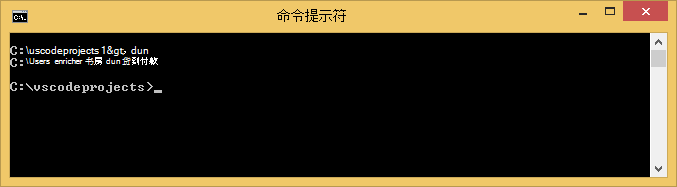

3. 现在，有了 DNVM，必须用于下载 DNX 运行您的应用程序。 在命令提示符下运行以下命令︰

        dnvm upgrade

    验证您的 DNVM，并查看活动运行时通过在命令提示符下输入︰

        dnvm list

    命令提示符将显示活动的运行库的详细信息。

    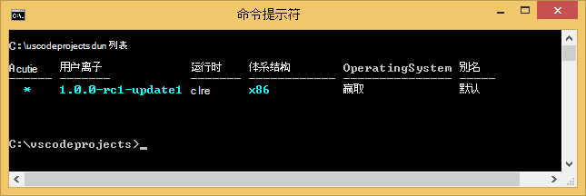

    如果列出了多个 DNX 运行时，您可以选择输入的命令提示符下，设置活动 DNX 运行时以下 （或较新的版本）。 将其设置为您以后在本教程中创建 web 应用程序时，ASP.NET 5 生成器使用的版本相同。 *您可能不需要更改活动的运行时，如果将其设置为提供的最新。*

        dnvm use 1.0.0-update1 –p

> [AZURE.NOTE] OS X，Linux、 Windows 的详细安装说明，请参阅[安装 ASP.NET 5 和 DNX](https://code.visualstudio.com/Docs/ASPnet5#_installing-aspnet-5-and-dnx)。 

## 创建 web 应用程序 

这一节演示如何 scaffold 新应用程序 ASP.NET web 应用程序。 您将使用节点的包管理器 (npm) 安装[Yeoman](http://yeoman.io/) (应用程序基架工具-Visual Studio VS 代码相当于**文件 > 新建项目**操作)， [Grunt](http://gruntjs.com/) （JavaScript 任务流道，） 和[Bower](http://bower.io/) （客户端程序包管理器）。 

1. 打开具有管理员权限的命令提示符下，导航到要在其中创建 ASP.NET 项目的位置。 例如，c︰ 根目录下创建*vscodeprojects*目录\.

2. 输入下面的命令提示符下安装 Yeoman 和支持工具。

        npm install -g yo grunt-cli generator-aspnet bower

    > [AZURE.NOTE] 您可能会收到警告，建议您 npm 版本已过期。 此警告不会影响本教程。

3. 输入下面的命令提示符下创建项目文件夹和 scaffold app。

        yo aspnet

4. 使用箭头键从 ASP.NET 5 生成器菜单，然后按选择的**Web 应用程序基本**类型**&lt;输入 >**。

    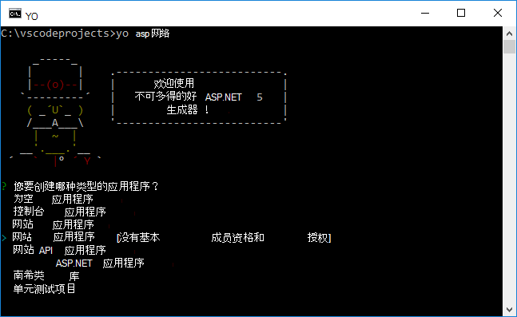

5. 将新的 ASP.NET web 应用程序的名称设置为**SampleWebApp**。 如果您选择一个不同的名称，将在整个教程中，使用此名称，因为您需要代替**SampleWebApp**的每个匹配项。 当您按下**&lt;输入 >**，Yeoman 将创建一个名为**SampleWebApp** ，并为您的新应用程序所需的文件的新文件夹。

6. 在命令提示符处，将目录更改到新项目文件夹︰

        cd SampleWebApp

7. 在命令提示符下，要安装必要的 NuGet 程序包，以运行该应用程序，输入以下命令︰

        dnu restore

8. 通过输入下面的命令提示符处打开 VS 代码︰

        code .

## 本地运行 web 应用程序

现在，您已经创建 web 应用程序并检索应用程序的所有 NuGet 程序包，您可以本地运行 web 应用程序。

1. 从**命令调色板**VS 代码中，输入下列表达式，显示可用运行的命令选项︰

        dnx: Run Command

    > [AZURE.NOTE] 如果当前未运行 Omnisharp 服务器，它将启动。 请重新输入上面的命令。

    接下来，选择下面的命令以运行您的 web 应用程序︰
        
        dnx web - (SampleWebApp)

    命令窗口中将显示该应用程序已启动。 如果命令窗口中不显示此消息，请检查低左 corning VS 代码的项目中的错误。
    
    > [AZURE.NOTE]**命令选项板**中发出命令要求**>**命令行的开始处的字符。 您可以查看与在*project.json*文件中的**web**命令的详细信息。   
    > 如果该命令不会显示或不可用，您可能需要安装 C# 扩展。 运行`>Extensions: Install Extension`， `ext install c#` ，安装 C# 扩展。

2. 打开浏览器并定位到下面的 URL。

    **http://localhost:5000**

    使 web 应用程序的默认页将显示如下。

    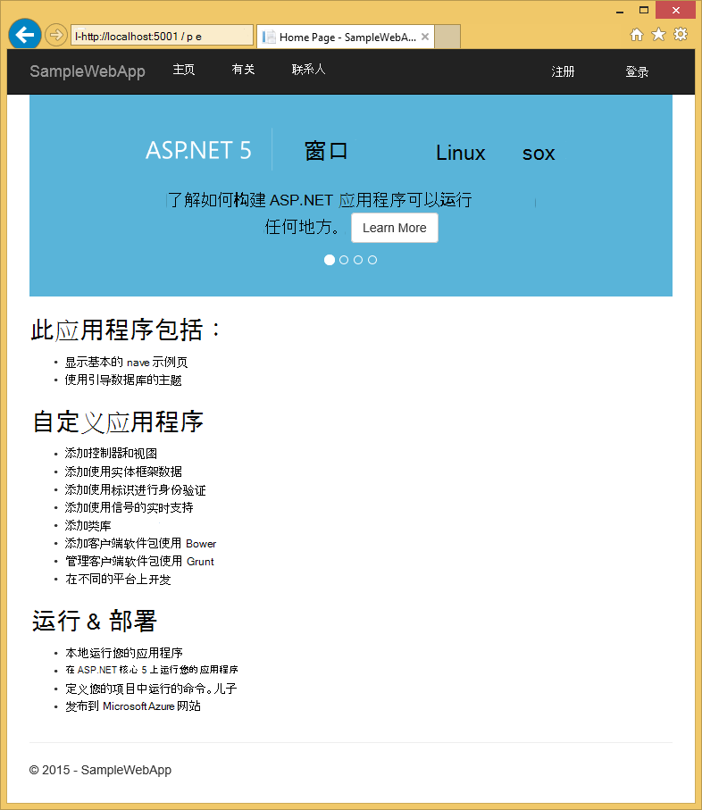

3. 关闭您的浏览器。 在**命令窗口**中，按**Ctrl + C**键关闭应用程序并关闭**命令窗口**。 

## 在 Azure 门户网站中创建 web 应用程序

以下步骤将指导您完成在 Azure 门户中创建 web 应用程序。

1. 登录到[Azure 的门户](https://portal.azure.com)。

2. 单击**新建**顶部左侧的门户。

3. 单击**Web 应用程序 > Web 应用程序**。

    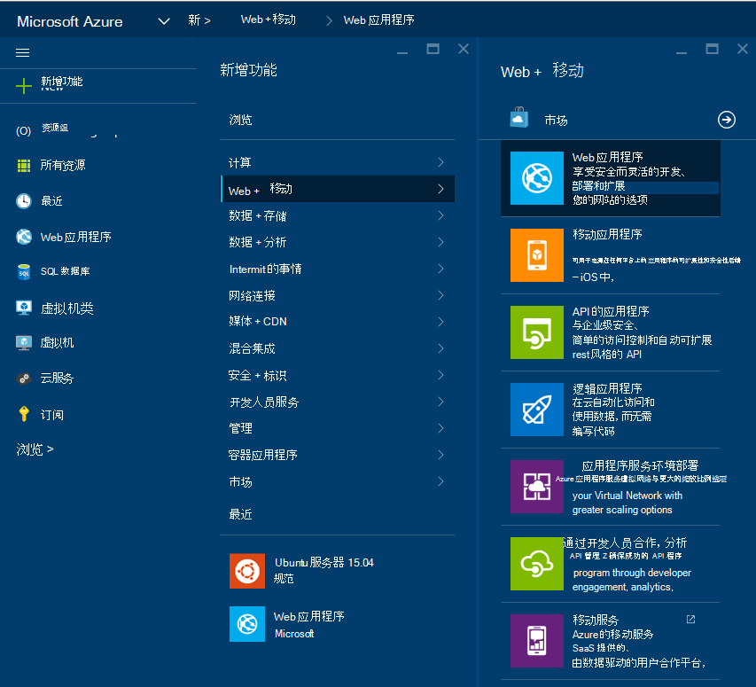

4. 输入的**名称**，如**SampleWebAppDemo**的值。 请注意，此名称必须是唯一的和门户网站将强制执行，当您尝试输入名称。 因此，如果您选择一个不同的值输入，您需要替换**SampleWebAppDemo**您在本教程中看到每个匹配项的值。 

5. 选择现有**的应用程序服务计划**，或新建一个。 如果您创建一个新的计划，选择定价层、 位置和其他选项。 应用程序服务计划的详细信息，请参阅文章， [Azure 应用程序服务计划深度探讨](../app-service/azure-web-sites-web-hosting-plans-in-depth-overview.md)。

    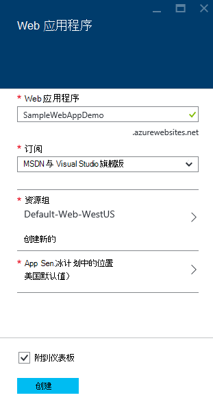

6. 单击**创建**。

    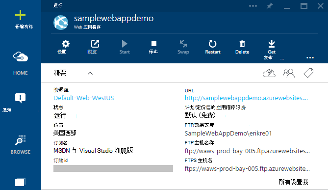

## 启用新的 web 应用程序的 Git 发布

Git 是可用来部署您的 Azure 应用程序服务 web 应用程序的分布式的版本控制系统。 将存储您的 web 应用程序在本地 Git 存储库，为您编写的代码，并将在通过推送到远程资源库中将代码部署到 Azure。   

1. 登录到[Azure 的门户](https://portal.azure.com)。

2. 单击**浏览**。

3. 请单击**Web 应用程序**以查看与 Azure 订阅相关的 web 应用程序的列表。

4. 选择您在本教程中创建的 web 应用程序。

5. 在 web 应用程序刀片式服务器，请单击**设置** > **连续部署**。 

    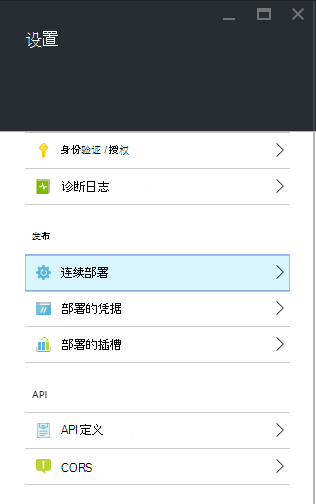

6. 单击**选择源 > 本地 Git 存储库**。

7. 单击**确定**。

    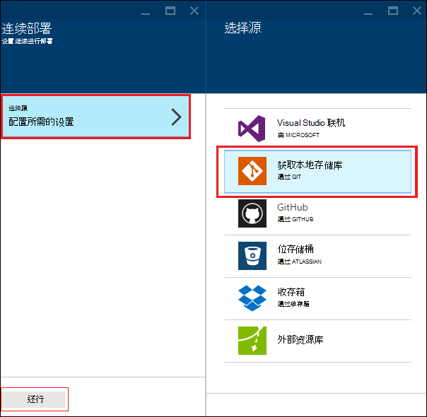

8. 如果以前设置了部署发布 web 应用程序或其他应用程序服务的应用程序的凭据，设置它们现在︰

    * 单击**设置** > **部署凭据**。 将显示**设置部署凭据**刀片式服务器。

    * 创建一个用户名和密码。  以后设置 Git 时，您将需要此密码。

    * 单击**保存**。

9. 在 web 应用程序的刀片式服务器，请单击**设置 > 属性**。 在**git 中获取 URL**下显示了远程 Git 存储库，您将部署到的 URL。

10. 在本教程中复制的**GIT URL**值以供将来使用。

    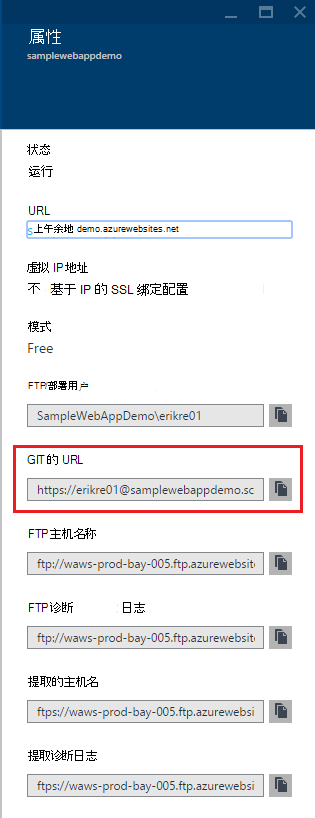

## 将您的 web 应用程序发布到 Azure 应用程序服务

在本节中，您将创建一个本地 Git 存储库和推从该存储库到 Azure 将您的 web 应用程序部署到 Azure。

1. 在 VS 代码选择**Git**在左侧的导航栏中。

    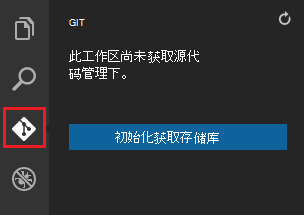

2. 选择**初始化 git 存储库**，以确保您的工作区是在 git 中获取源代码管理下。 

    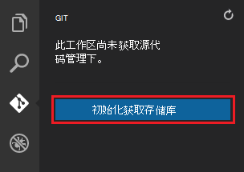

3. 打开命令窗口，并将目录更改到您的 web 应用程序的目录。 然后，输入以下命令︰

        git config core.autocrlf false

    此命令可防止有关文本 CRLF 尾 LF 尾所涉及的问题。

4. VS 代码中添加提交消息，然后单击**提交所有**检查图标。

    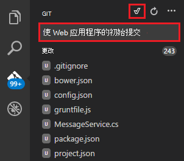

5. Git 完成处理之后，您将看到没有 Git 下**更改**窗口中列出的文件。 

    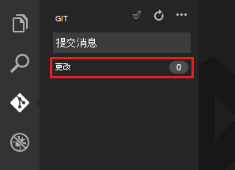

6. 更改回命令窗口命令提示符位置指向目录 web 应用程序所在的位置。

7. 创建一个将更新推送到您的 web 应用程序，使用先前复制的 Git URL （".git"结尾） 的远程引用。

        git remote add azure [URL for remote repository]

8. 配置本地保存您的凭据，以便它们会自动追加到推命令从 VS 代码生成的 Git。

        git config credential.helper store

9. 通过输入以下命令，将更改推送到 Azure。 在此初始推到 Azure 之后, 将能够从 VS 代码做所有的强制命令。 

        git push -u azure master

    系统提示您在 Azure 的前面部分中创建的密码。 **注意︰ 您的密码将不可见。**

    上面的命令的输出结束部署成功的消息。

        remote: Deployment successful.
        To https://user@testsite.scm.azurewebsites.net/testsite.git
        [new branch]      master -> master

> [AZURE.NOTE] 如果您对您的应用程序进行更改，您可以直接在 VS 代码中通过**推**选项后跟**全部提交**选项中选择使用内置的 Git 功能重新发布。 您会发现**所有提交**和**刷新**按钮旁边的下拉列表菜单中可用的**推**选项。

如果您需要在一个项目上进行协作，应考虑将推送到 GitHub 之间推送到 Azure。

## 在 Azure 中运行应用程序
现在，您已经部署 web 应用程序，让我们运行应用程序时在 Azure 中承载。 

可以通过两种方法执行此操作︰

* 打开浏览器并输入您的 web 应用程序的名称，如下所示。   

        http://SampleWebAppDemo.azurewebsites.net
 
* 在 Azure 门户中，找到 web 应用程序的 web 应用程序，刀片式服务器，并单击**浏览**以查看您的应用程序 
* 在默认浏览器。

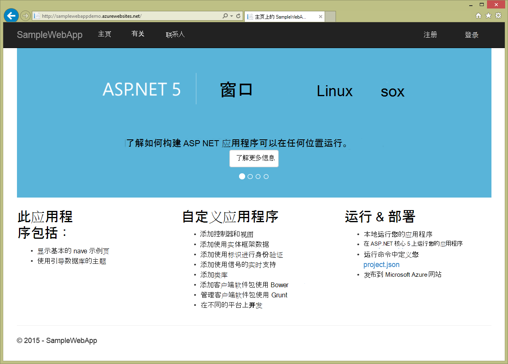

## 摘要
在本教程中，您学习了如何在和代码中创建 web 应用程序并将其部署到 Azure。 与代码有关的详细信息，请参阅文章[Visual Studio 代码为什么？](https://code.visualstudio.com/Docs/) 有关应用程序服务 web 应用程序的信息，请参阅[Web 应用程序概述](app-service-web-overview.md)。 
