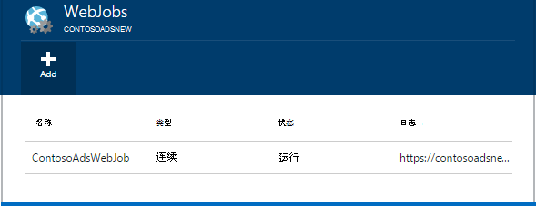
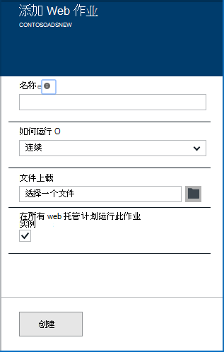
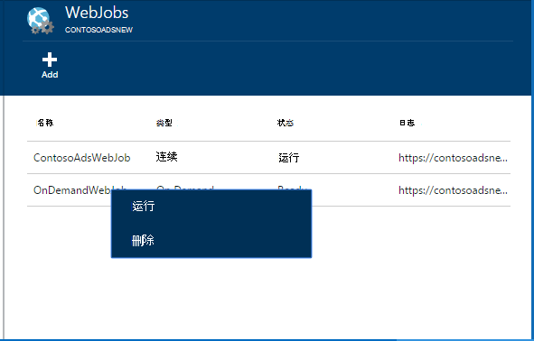
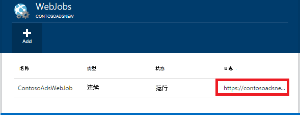

<properties 
    pageTitle="使用 WebJobs 运行后台任务" 
    description="了解如何在 Azure 的 web 应用程序中运行后台任务。" 
    services="app-service" 
    documentationCenter="" 
    authors="tdykstra" 
    manager="wpickett" 
    editor="jimbe"/>

<tags 
    ms.service="app-service" 
    ms.workload="na" 
    ms.tgt_pltfrm="na" 
    ms.devlang="na" 
    ms.topic="article" 
    ms.date="04/27/2016" 
    ms.author="tdykstra"/>

# <a name="run-background-tasks-with-webjobs"></a>使用 WebJobs 运行后台任务

## <a name="overview"></a>概述

您可以运行的程序或脚本在 WebJobs[应用程序服务](http://go.microsoft.com/fwlink/?LinkId=529714)web 应用程序以三种方式中︰ 根据需要，不断地，或按计划。 没有任何额外的成本，使用 WebJobs。

本文介绍如何通过使用[Azure 门户](https://portal.azure.com)部署 WebJobs。 有关如何部署使用 Visual Studio 或连续的传递过程的信息，请参阅[如何向 Web 应用程序部署 Azure WebJobs](websites-dotnet-deploy-webjobs.md)。

Azure WebJobs SDK 简化了许多编程任务的 WebJobs。 有关详细信息，请参阅[什么是 WebJobs SDK](websites-dotnet-webjobs-sdk.md)。

 （目前在预览） 的 azure 函数是 Azure 应用程序服务中运行程序和脚本的另一个方法。 有关详细信息，请参阅[Azure 功能概述](../azure-functions/functions-overview.md)。

[AZURE.INCLUDE [app-service-web-to-api-and-mobile](../../includes/app-service-web-to-api-and-mobile.md)] 

## <a name="acceptablefiles"></a>可接受的文件类型的脚本或程序

接受以下文件类型︰

* .cmd、.bat 或.exe （使用 windows cmd）
* .ps1 （使用 powershell）
* .sh （使用 bash）
* .php （使用 php）
* .py （使用 python）
* .js （使用节点）
* .jar （使用 java）

## <a name="CreateOnDemand"></a>在门户中创建根据需要 WebJob

1. 在[Azure 门户](https://portal.azure.com)的**Web 应用程序**刀片式服务器，请单击**所有设置 > WebJobs**显示**WebJobs**刀片式服务器。
    
    
    
5. 单击**添加**。 将显示对话框中**添加 WebJob** 。
    
    
    
2. 在**名称**提供了一个名为 WebJob。 名称必须以字母或数字开头，并且不能包含任何特殊字符以外的其他"-"和"_"。
    
4. 在**运行方式**框中，选择**按需运行**。
    
3. 在**上载文件**框中，单击文件夹图标并浏览到包含您的脚本的 zip 文件。 Zip 文件应包含所有要运行的程序或脚本所需的支持文件和可执行文件 (.exe.cmd.bat.sh.php.py.js)。
    
5. 请将该脚本上传到您的 web 应用程序的**创建**。 
    
    WebJob 为您指定的名称出现在**WebJobs**刀片式服务器列表中。
    
6. 若要运行 WebJob，用鼠标右键单击它的名称列表中，单击**运行**。
    
    
    
## <a name="CreateContinuous"></a>创建连续运行 WebJob

1. 若要创建连续执行 WebJob，请按照创建 WebJob，运行一次，但在**运行方式**框中，选择**连续**的相同步骤。

2. 要启动或停止连续 WebJob，WebJob 在列表中用鼠标右键单击，然后单击**启动**或**停止**。
    
> [AZURE.NOTE] 如果您的 web 应用程序运行在多个实例时，您的实例的所有连续运行 WebJob 都将运行。 单个实例选择的负载平衡通过 Microsoft Azure 上运行按需和计划 WebJobs。
    
> 连续可靠地和所有实例上运行的 WebJobs，使总在 * 使 web 应用程序; 否则为他们可以停止运行 SCM 宿主网站已空闲的时间太长时的配置设置。

## <a name="CreateScheduledCRON"></a>创建使用 CRON 表达式计划的 WebJob

该技术适用于 Web 应用程序运行在基本、 标准或高级模式，并要求**始终**设置在应用程序上启用。

若要将变成计划 WebJob 上需 WebJob，只包含`settings.job`WebJob zip 文件的根目录的文件。 此 JSON 文件应包括`schedule`使用[CRON 表达式](https://en.wikipedia.org/wiki/Cron)，每个下面示例中的属性。

CRON 表达式组成 6 个字段︰ `{second} {minute} {hour} {day} {month} {day of the week}`。

例如，若要每隔 15 分钟触发您 WebJob 您`settings.job`者必须︰

```json
{
    "schedule": "0 */15 * * * *"
}
``` 

其他 CRON 调度示例︰

- 每隔一小时 （即当数分钟为 0）︰`0 0 * * * *` 
- 从上午 9 点到下午 5 点每隔一小时︰`0 0 9-17 * * *` 
- 上午 9:30 每一天︰`0 30 9 * * *`
- 上午 9:30 每个工作日︰`0 30 9 * * 1-5`

**注意**︰ 在部署时从 Visual Studio WebJob，请确保标记您`settings.job`文件属性为如果较新则复制。


## <a name="CreateScheduled"></a>创建使用 Azure 计划安排的 WebJob

以下替代方法利用 Azure 计划程序。 在这种情况下，您的 WebJob 并没有任何直接知识的计划。 相反，Azure 计划程序获取配置触发您的 WebJob 计划。 

Azure 门户还没有能够创建计划的 WebJob，但之前，添加功能可以做到使用[经典的门户](http://manage.windowsazure.com)。

1. 在[经典的门户](http://manage.windowsazure.com)转到 WebJob 页面，单击**添加**。

1. 在**运行方式**框中，选择**按计划运行**。
    
    ![新计划的作业][NewScheduledJob]
    
2. 选择作业，**计划程序区域**，然后单击对话框的右下方，以进入下一个屏幕上的箭头。

3. 在**创建 Job**对话框中，选择**重复**所需的类型︰**一次性作业**或**定期作业**。
    
    ![安排定期计划][SchdRecurrence]
    
4. 选择**起始**时间︰**现在**或**在特定的时间**。
    
    ![计划开始时间][SchdStart]
    
5. 如果您想要在特定时间启动，选择在下，**开始在**起始时间值。
    
    ![在特定时间的计划开始][SchdStartOn]
    
6. 如果选择了重复执行的作业，则有**定期召开每个**选项，以指定的频率发生和**结束的**选项来指定结束时间。
    
    ![安排定期计划][SchdRecurEvery]
    
7. 如果选择**周**，您可以选中**在特定的计划**，并指定每周想要运行的作业天数。
    
    ![计划每周天数][SchdWeeksOnParticular]
    
8. 如果您选择**几个月**，并选中**在特定的计划**，您可以设置要在月份中特定编号**天**运行的作业。 
    
    ![计划在该月中的特定日期][SchdMonthsOnPartDays]
    
9. 如果选择**工作日**，则可以在您想要运行的作业的月份中选择哪一天或一周中的天。
    
    ![计划一个月内的特定工作日][SchdMonthsOnPartWeekDays]
    
10. 最后，您还可以使用**具体值**选项选择在一个月中的哪一周 (第一次，第二，第三等) 希望在您指定的一周每天上运行作业。
    
    ![安排在月份中特定星期的特定一周每天][SchdMonthsOnPartWeekDaysOccurences]
    
11. 您已经创建了一个或多个作业后，其名称将出现在其状态、 计划类型和其他信息的 WebJobs 选项卡上。 最后 30 WebJobs 的历史信息进行维护。
    
    ![作业列表][WebJobsListWithSeveralJobs]
    
### <a name="Scheduler"></a>计划的作业和 Azure 计划程序

计划的作业可以进一步配置[传统门户](http://manage.windowsazure.com)的 Azure 计划程序页中。

1.  在 WebJobs 页面上，单击该作业的**计划**链接导航到 Azure 计划程序门户页面。 
    
    ![链接到 Azure 计划程序][LinkToScheduler]
    
2. 在计划页上单击作业。
    
    ![在计划程序门户页面上的作业][SchedulerPortal]
    
3. 打开**作业操作**页面，在其中您可以进一步配置该作业。 
    
    ![作业操作 PageInScheduler][JobActionPageInScheduler]
    
## <a name="ViewJobHistory"></a>查看作业历史记录

1. 要查看执行作业，包括 WebJobs sdk，创建作业的历史记录时，可单击其相应链接 WebJobs 刀片式服务器的**日志**列下。 （您可以使用剪贴板图标日志文件页面的 URL 复制到剪贴板，如果您愿意的话。）
    
    
        
2. 单击该链接打开 WebJob 的详细信息页面。 此页显示命令运行时，最后一次运行，其成功或失败的名称。 **最近的作业运行**下一次，以查看更多详细信息。
    
    ![WebJobDetails][WebJobDetails]
    
3. **WebJob 运行详细信息**页面将出现。 单击**切换输出**以查看日志内容的文本。 输出日志是文本格式。 
    
    ![Web 作业运行的详细信息][WebJobRunDetails]
    
4. 若要查看在一个单独的浏览器窗口中的输出文本，请单击**下载**链接。 若要下载的文本本身，用鼠标右键单击该链接并使用您的浏览器选项来保存该文件的内容。
    
    ![下载日志输出][DownloadLogOutput]
    
5. 在页面的顶部的**WebJobs**链接提供了方便地进入历史记录面板上的 WebJobs 的列表。
    
    ![链接到 WebJobs 的列表][WebJobsLinkToDashboardList]
    
    ![历史记录面板中的 WebJobs 列表][WebJobsListInJobsDashboard]
    
    单击其中一个链接可将您带到您所选的作业的 WebJob 详细信息页面。


## <a name="WHPNotes"></a>备注
    
- 在免费模式下的 web 应用程序可能会超时后 20 分钟，如果有没有申请到 scm （部署） 网站和 web 应用程序的门户是无法在 Azure 中打开。 对实际站点的请求不会重置此。
- 连续作业的代码需要被编写为在死循环中运行。
- 仅当正在运行的 web 应用程序时，连续运行连续作业。
- 基本和总在标准模式下提供功能，当启用时，可防止 web 应用程序变得空闲。
- 您仅可以调试连续运行 WebJobs。 不支持调试计划或点播 WebJobs。

## <a name="NextSteps"></a>下一步行动
 
有关详细信息，请参阅[Azure WebJobs 建议资源][WebJobsRecommendedResources]。

[PSonWebJobs]:http://blogs.msdn.com/b/nicktrog/archive/2014/01/22/running-powershell-web-jobs-on-azure-websites.aspx
[WebJobsRecommendedResources]:http://go.microsoft.com/fwlink/?LinkId=390226

[OnDemandWebJob]: ./media/web-sites-create-web-jobs/01aOnDemandWebJob.png
[WebJobsList]: ./media/web-sites-create-web-jobs/02aWebJobsList.png
[NewContinuousJob]: ./media/web-sites-create-web-jobs/03aNewContinuousJob.png
[NewScheduledJob]: ./media/web-sites-create-web-jobs/04aNewScheduledJob.png
[SchdRecurrence]: ./media/web-sites-create-web-jobs/05SchdRecurrence.png
[SchdStart]: ./media/web-sites-create-web-jobs/06SchdStart.png
[SchdStartOn]: ./media/web-sites-create-web-jobs/07SchdStartOn.png
[SchdRecurEvery]: ./media/web-sites-create-web-jobs/08SchdRecurEvery.png
[SchdWeeksOnParticular]: ./media/web-sites-create-web-jobs/09SchdWeeksOnParticular.png
[SchdMonthsOnPartDays]: ./media/web-sites-create-web-jobs/10SchdMonthsOnPartDays.png
[SchdMonthsOnPartWeekDays]: ./media/web-sites-create-web-jobs/11SchdMonthsOnPartWeekDays.png
[SchdMonthsOnPartWeekDaysOccurences]: ./media/web-sites-create-web-jobs/12SchdMonthsOnPartWeekDaysOccurences.png
[RunOnce]: ./media/web-sites-create-web-jobs/13RunOnce.png
[WebJobsListWithSeveralJobs]: ./media/web-sites-create-web-jobs/13WebJobsListWithSeveralJobs.png
[WebJobLogs]: ./media/web-sites-create-web-jobs/14WebJobLogs.png
[WebJobDetails]: ./media/web-sites-create-web-jobs/15WebJobDetails.png
[WebJobRunDetails]: ./media/web-sites-create-web-jobs/16WebJobRunDetails.png
[DownloadLogOutput]: ./media/web-sites-create-web-jobs/17DownloadLogOutput.png
[WebJobsLinkToDashboardList]: ./media/web-sites-create-web-jobs/18WebJobsLinkToDashboardList.png
[WebJobsListInJobsDashboard]: ./media/web-sites-create-web-jobs/19WebJobsListInJobsDashboard.png
[LinkToScheduler]: ./media/web-sites-create-web-jobs/31LinkToScheduler.png
[SchedulerPortal]: ./media/web-sites-create-web-jobs/32SchedulerPortal.png
[JobActionPageInScheduler]: ./media/web-sites-create-web-jobs/33JobActionPageInScheduler.png
 
