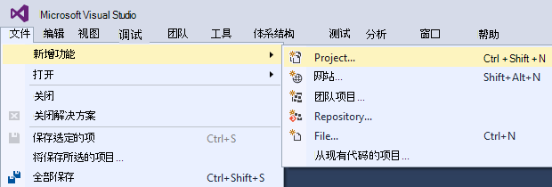

<properties 
    pageTitle="创建一个 ASP.NET MVC 应用程序使用身份验证和 SQL 数据库并将其部署到 Azure 应用程序服务" 
    description="了解如何开发 ASP.NET MVC 5 应用程序与 SQL 数据库后端，添加身份验证和授权，并将其部署到 Azure。" 
    services="app-service\web" 
    documentationCenter=".net" 
    authors="Rick-Anderson" 
    writer="Rick-Anderson" 
    manager="wpickett" 
    editor=""/>

<tags 
    ms.service="app-service-web" 
    ms.workload="web" 
    ms.tgt_pltfrm="na" 
    ms.devlang="dotnet" 
    ms.topic="article" 
    ms.date="03/21/2016" 
    ms.author="riande"/> 

# 创建一个 ASP.NET MVC 应用程序使用身份验证和 SQL 数据库并将其部署到 Azure 应用程序服务

本教程展示如何构建安全的 ASP.NET MVC 5 web 应用程序允许使用从 Facebook 或 Google 的凭据的用户登录。 该应用程序是一个简单的联系人列表 ADO.NET 实体框架用于数据库访问。 会将应用程序部署到[Azure 应用程序服务](http://go.microsoft.com/fwlink/?LinkId=529714)。 

完成本教程，您将有了一个安全数据驱动的 web 应用程序在云中运行和使用云数据库。 下图显示了完整的应用程序的登录页。

![登录页][rxb]

您将学习︰

* 如何在 Visual Studio 中创建一个安全的 ASP.NET MVC 5 web 项目。
* 如何验证和授权用户使用从 Google 或 Facebook 帐户 （使用[OAuth 2.0](http://oauth.net/2 "http://oauth.net/2")的社会提供身份验证） 的凭据登录。
* 如何进行身份验证和授权管理应用程序 （本地身份使用[ASP.NET 身份](http://asp.net/identity/)验证） 的数据库中注册的用户。
* 如何使用 ADO.NET 实体框架 6 代码优先进行读取和写入数据的 SQL 数据库中。
* 如何使用实体框架代码第一个迁移部署数据库。
* 如何通过使用 SQL Azure 数据库在云中存储关系数据。
* 如何部署在 Azure 应用程序服务使用[web 应用程序](http://go.microsoft.com/fwlink/?LinkId=529714)到数据库的 web 项目。

>[AZURE.NOTE] 这是一个长的教程。 如果要快速了解到 Azure 应用程序服务和 Visual Studio 的 web 项目，请参阅[创建在 Azure 应用程序服务的 ASP.NET web 应用程序](web-sites-dotnet-get-started.md)。 有关疑难解答信息，请参阅[疑难解答](#troubleshooting)部分。
>
>或者，如果您想要开始使用 Azure 应用程序服务在 Azure 帐户注册之前，转到[尝试应用程序服务](http://go.microsoft.com/fwlink/?LinkId=523751)，立即可以在此创建短期的初学者 web 应用程序的应用程序服务中。 没有信用卡，所需;没有承诺。

## 系统必备组件

若要完成本教程，您需要一个 Microsoft Azure 帐户。 如果您没有帐户，则可以[激活您的 Visual Studio 订户权益](/pricing/member-offers/msdn-benefits-details/?WT.mc_id=A261C142F)或[注册免费试用版](/pricing/free-trial/?WT.mc_id=A261C142F)。

若要设置您的开发环境，您必须安装[Visual Studio 2013年更新 5](http://go.microsoft.com/fwlink/?LinkId=390521)或更高版本，以及最新版本的[.NET 的 Azure SDK](http://go.microsoft.com/fwlink/?linkid=324322&clcid=0x409)。 本文针对 Visual Studio 更新 4 和 SDK 2.8.1 的编写。 相同的说明用于 Visual Studio 2015 安装，最新[.NET 的 Azure SDK](http://go.microsoft.com/fwlink/?linkid=518003&clcid=0x409) ，但某些屏幕的外观不同插图。

## 创建一个 ASP.NET MVC 5 应用程序

### 创建项目

1. 从**文件**菜单上，单击**新建项目**。

    

1. 在**新建项目**对话框中，展开**C#**和选择**已安装的模板**，下面的**Web** ，然后选择**ASP.NET Web 应用程序**。 命名为**ContactManager**，该应用程序，然后单击**确定**。

    
 
    **注意︰**请确保您输入"ContactManager"。 您将稍后复制的代码块承担的项目名称是 ContactManager。 

1. 在**新建 ASP.NET 项目**对话框中，选择**MVC**模板。 验证**身份验证**设置为**单独的用户帐户**、 检查**主机上的云**，和选定**的应用程序服务**。

    

1. 单击**确定**。

1. 此时将显示**配置 Microsoft Azure Web 应用程序设置**对话框。 您可能需要登录，如果您有不这样做，或如果您的登录已过期，重新输入您的凭据。

1. 可选-更改**Web 应用程序名称**的值框中 （参见下图所示）。

    Web 应用程序的 URL 将被 {name}.azurewebsites.net 中，这样的名称必须是唯一的 azurewebsites.net 域中。 配置向导会建议使用一个唯一的名称"ContactManager"的项目名称加上一个数字，本教程是很好。

5. 在**资源组**下拉列表选择现有的组或**创建新的资源组**（见下图）。 

    如果您愿意，您可以选择已有的资源组。 但是，如果您创建新的资源组，并仅用于本教程，它很容易就可以删除与它们完成后为教程创建的所有 Azure 资源。 有关资源组的信息，请参阅[Azure 资源管理器概述](../azure-resource-manager/resource-group-overview.md)。 

5. **应用程序服务计划**中下拉列表选择现有的计划，或者**创建新的应用程序服务计划**（请参见下图所示）。

    如果您愿意，您可以选择已有的应用程序服务计划。 有关应用程序服务计划的信息，请参阅[Azure 应用程序服务计划深度探讨](../app-service/azure-web-sites-web-hosting-plans-in-depth-overview.md)。 

1. 点击**浏览其他 Azure 服务**添加 SQL 数据库。

    

1. 请点击**+**图标以添加 SQL 数据库。

    

1. 在**配置 SQL 数据库**对话框中点击**新建**:

    

1. 输入的名称为管理员和一个强密码。

    

    服务器名称必须是唯一的。 它可以包含小写字母、 数字和连字符。 它不能包含连字符结尾。 用户名和密码是您正在创建的新服务器的新凭据。 

    如果您已经有了数据库服务器，您可以选择，而不是创建一个。 数据库服务器是一种宝贵资源，并且您通常希望在测试和开发，而不创建每个数据库数据库服务器的同一台服务器上创建多个数据库。 但是，对于本教程只需要服务器暂时，并且通过在 web 站点所在的资源组中创建服务器您方便地在您完成本教程时删除该资源组中删除两个 web 应用程序和数据库资源。 

    如果您选择现有的数据库服务器，请确保您的 web 应用程序和数据库位于同一个地区。

    

4. 点击**创建**。

    Visual Studio 将创建 ContactManager web 项目、 创建资源组和应用程序服务计划中指定的并具有您指定的名称在 Azure 应用程序服务创建一个 web 应用程序。

### 设置页眉和页脚

1. 在**解决方案资源管理器**中，打开*Views\Shared*文件夹中的*Layout.cshtml*文件。

    ![在解决方案资源管理器中的 _Layout.cshtml][newapp004]

1. 下面的代码替换 ActionLink *Layout.cshtml*文件中。

    @Html.ActionLink("CM演示"、"索引"、"联系人"，新 {区域 =""}、 新 { @class ="navbar 品牌"})
                   

    请确保更改"联系人"的第三个参数从"主页"。 上面的标记将联系人控制器的索引方法的每一页上创建一个"联系人"链接。 将应用程序的名称中的页眉和页脚从"我的 ASP.NET 应用程序"和"应用程序名称"更改为"联系人管理器"和"厘米演示"。 
 
### 本地运行应用程序

1. 按 CTRL + F5 以运行应用程序。

    在默认浏览器中将显示应用程序主页。

    

这是所有您需要做现在要创建的应用程序将部署到 Azure。 

## 部署到 Azure 应用程序

1. 在 Visual Studio 中，用鼠标右键单击**解决方案资源管理器**中的项目并从上下文菜单中选择**发布**。

    
    
    **Web 发布**向导将打开。

1. 在**发布网站**对话框中，单击**发布**。

    

    您创建的应用程序正在运行在云中。 部署应用程序时，在下一次将部署仅已更改 （或新的） 文件。

    

## 对项目启用 SSL ##

1. 在**解决方案资源管理器**中单击**ContactManager**项目，然后单击 f4 键以打开**属性**窗口。

3. 将**启用 SSL**更改为**True**。 

4. 复制的**SSL URL**。

    SSL URL 将被 https://localhost:44300 / 除非您以前创建 SSL web 应用程序。

    ![启用 SSL][rxSSL]
 
1. 在**解决方案资源管理器**中右击该**联系人管理器中**的项目，单击**属性**。

1. 单击**Web**选项卡。

1. 更改要使用的**SSL URL**并保存该页 (控制 S) 的**项目 Url** 。

    
 
1. 验证 Internet Explorer 启动 Visual Studio 时，浏览器，如图所示︰

    

    浏览器选择器允许您指定 Visual Studio 启动浏览器。 您可以选择多个浏览器，并有 Visual Studio 进行更改时，更新每个浏览器。 有关更多信息，请参见[使用 Visual Studio 2013年浏览器链接](http://www.asp.net/visual-studio/overview/2013/using-browser-link)。

    

1. 按 CTRL + F5 以运行应用程序。 单击**是**以启动 IIS Express 生成自签名的证书的信任的过程。

     

1. 阅读**安全警告**对话框，然后在您想要安装证书表示**本地主机**，单击**是**。

    

1. IE 显示*主页*并没有 SSL 警告。

     

     因为它接受该证书，并且显示了 HTTPS 内容不经警告使用 SSL 时，Internet Explorer 将是不错的选择。 Microsoft 的边缘和 Google Chrome 还接受该证书。 Firefox 使用它自己的证书存储，因此它将显示一条警告。

     

## 向应用程序中添加数据库

接下来，将更新该应用程序将显示和更新联系人并在数据库中存储的数据的能力。 该应用程序将使用实体框架 (EF) 来创建数据库，并以读取和更新数据。

### 添加为联系人数据模型类

首先，您在代码中创建简单的数据模型。

1. 在**解决方案资源管理器**中用鼠标右键单击模型文件夹，请单击**添加**，然后**类**。

    

2. 在**添加新项**对话框中，命名新的类文件*Contact.cs*，，然后单击**添加**。

    ![添加新项对话框][adddb002]

3. Contact.cs 文件的内容替换为以下代码。

        using System.ComponentModel.DataAnnotations;
        using System.Globalization;
        namespace ContactManager.Models
        {
            public class Contact
            {
                public int ContactId { get; set; }
                public string Name { get; set; }
                public string Address { get; set; }
                public string City { get; set; }
                public string State { get; set; }
                public string Zip { get; set; }
                [DataType(DataType.EmailAddress)]
                public string Email { get; set; }
            }
        }
**与**类定义将存储每个联系人，再加上一个主键， *ContactID*，所需的数据库的数据。

### 创建网页，使应用程序用户可以使用的联系人

ASP.NET MVC 基架功能可以自动生成代码来执行创建、 读取、 更新和删除 (CRUD) 操作。 

1. 生成项目**(Ctrl + Shift + B)**。 （您必须生成项目，然后再使用基架机制。）
 
1. 在**解决方案资源管理器**中用鼠标右键单击控制器文件夹，并单击**添加**，然后单击**控制器**。

    ![在控制器文件夹上下文菜单添加控制器][addcode001]

5. 在**添加构架**对话框中，选择**MVC 视图，使用 EF 5 控制器**，然后单击**添加**。
    
    

1. 在**模型类**下拉框中，选择**联系人 (ContactManager.Models)**。 （请参见下图所示）。

1. 在**数据上下文类**中，选择**ApplicationDbContext (ContactManager.Models)**。 **ApplicationDbContext**将用于成员资格数据库和我们联系的数据。

    

1. 单击**添加**。

   Visual Studio 创建方法和**联系人**对象的 CRUD 数据库操作的视图控制器。

## 启用迁移、 创建数据库、 添加示例数据和数据的初始值设定项 ##

下一步的任务是使[代码第一个迁移](http://msdn.microsoft.com/library/hh770484.aspx)功能才能创建基于您创建的数据模型的数据库表。

1. 在**工具**菜单中，选择**NuGet 程序包管理器**，然后**程序包管理器控制台**。

    

2. 在**程序包管理器控制台**窗口中，输入以下命令︰

        enable-migrations

    **启用迁移**命令创建一个*迁移*的文件夹，和它放入该文件夹中的*Configuration.cs*文件，您可以编辑植入数据库和配置迁移。 

2. 在**程序包管理器控制台**窗口中，输入以下命令︰

        add-migration Initial

    **添加迁移初始**命令生成一个文件，该文件命名为**&lt;date_stamp&gt;初始***迁移*文件夹中。 此文件中的代码创建的数据库表。 （**初始**） 的第一个参数用于创建文件的名称。 您可以看到新的类文件，在**解决方案资源管理器**中。

    在**最初**的类中，**向上**方法创建联系人表中，并 （使用时您要返回到以前的状态）**下**方法除去它。

3. 打开*Migrations\Configuration.cs*文件。 

4. 添加以下`using`语句。 

         using ContactManager.Models;

5. *种子*的方法替换为以下代码︰

        protected override void Seed(ContactManager.Models.ApplicationDbContext context)
        {
            context.Contacts.AddOrUpdate(p => p.Name,
               new Contact
               {
                   Name = "Debra Garcia",
                   Address = "1234 Main St",
                   City = "Redmond",
                   State = "WA",
                   Zip = "10999",
                   Email = "debra@example.com",
               },
                new Contact
                {
                    Name = "Thorsten Weinrich",
                    Address = "5678 1st Ave W",
                    City = "Redmond",
                    State = "WA",
                    Zip = "10999",
                    Email = "thorsten@example.com",
                },
                new Contact
                {
                    Name = "Yuhong Li",
                    Address = "9012 State st",
                    City = "Redmond",
                    State = "WA",
                    Zip = "10999",
                    Email = "yuhong@example.com",
                },
                new Contact
                {
                    Name = "Jon Orton",
                    Address = "3456 Maple St",
                    City = "Redmond",
                    State = "WA",
                    Zip = "10999",
                    Email = "jon@example.com",
                },
                new Contact
                {
                    Name = "Diliana Alexieva-Bosseva",
                    Address = "7890 2nd Ave E",
                    City = "Redmond",
                    State = "WA",
                    Zip = "10999",
                    Email = "diliana@example.com",
                }
                );
        }

    此代码初始化 （种子） 带有联系信息的数据库。 种子设定数据库的详细信息，请参阅[种子和调试实体框架 (EF) 数据库](http://blogs.msdn.com/b/rickandy/archive/2013/02/12/seeding-and-debugging-entity-framework-ef-dbs.aspx)。 生成项目以验证没有任何编译错误。

6. 在**程序包管理器控制台**中输入命令︰

        update-database

    ![程序包管理器控制台命令][addcode009]

    **更新数据库**运行创建数据库的第一次迁移。 默认情况下，SQL Server Express LocalDB 数据库创建数据库。 

7. 按 CTRL + F5 以运行该应用程序，然后单击**厘米演示**链接;或导航到 https://localhost:(port#)/厘米。 

    应用程序显示的种子数据，并提供编辑、 详细信息和删除链接。 您可以创建、 编辑、 删除和查看数据。

    ![MVC 视图的数据][rx2]

## 添加 OAuth2 提供程序

>[AZURE.NOTE] 有关如何使用 Google 和 Facebook 开发人员门户网站，教程到此教程链接有关 ASP.NET 网站的详细说明。 但是，Google 和 Facebook 更改其网站经常更新这些教程，而现在已过时。 如果您有问题的说明，请参见特色的 Disqus 评论在本教程中的已更改的内容列表的末尾 

[OAuth](http://oauth.net/ "http://oauth.net/")是一种开放协议允许简单而标准的方法，从 web、 移动和桌面应用程序中的安全授权。 ASP.NET MVC 互联网模板使用 OAuth 将 Facebook、 Twitter、 Google 和微软公开为身份验证提供程序。 虽然本教程使用仅 Google 为身份验证提供程序，可以轻松修改代码以使用任何这些提供程序。 其他提供程序实现的步骤是非常类似于您，请参阅本教程中的步骤。 若要使用 Facebook 作为身份验证提供程序，请参阅[MVC 5 与 Facebook、 Twitter、 LinkedIn 和 Google OAuth2 号上的应用程序](http://www.asp.net/mvc/tutorials/mvc-5/create-an-aspnet-mvc-5-app-with-facebook-and-google-oauth2-and-openid-sign-on)。

除了身份验证，本教程中使用角色来实现授权。 只有那些添加到*canEdit*角色的用户才能更改数据 （即，创建、 编辑或删除联系人）。

1. 按照**创建 OAuth 2 设置为 OAuth2 Google app 的 Google 应用程序**下的[MVC 5 与 Facebook、 Twitter、 LinkedIn 和 Google OAuth2 号上的应用程序](http://www.asp.net/mvc/tutorials/mvc-5/create-an-aspnet-mvc-5-app-with-facebook-and-google-oauth2-and-openid-sign-on#goog)中的说明进行操作。

3. 运行和测试应用程序以验证，您可以使用 Google 验证登录。

2. 如果您想要使用的特定于提供程序的图标创建社交登录按钮，请参见[ASP.NET MVC 5 相当社会登录按钮](http://www.jerriepelser.com/blog/pretty-social-login-buttons-for-asp-net-mvc-5)

## 使用 API 的成员资格

在这一节中您将本地用户以及*canEdit*的角色成员资格数据库。 只有在*canEdit*角色的用户将能够编辑数据。 最佳做法是通过可执行的操作的名称角色，因此*canEdit*孰优孰名*管理员*角色。 当您的应用程序的发展时，您可以添加新的角色，如*canDeleteMembers* ，而不是更少描述性*superAdmin*。

1. 打开*migrations\configuration.cs*文件，然后添加以下`using`语句︰

        using Microsoft.AspNet.Identity;
        using Microsoft.AspNet.Identity.EntityFramework;

1. 将下面的**AddUserAndRole**方法添加到类中︰

        bool AddUserAndRole(ContactManager.Models.ApplicationDbContext context)
        {
            IdentityResult ir;
            var rm = new RoleManager<IdentityRole>
                (new RoleStore<IdentityRole>(context));
            ir = rm.Create(new IdentityRole("canEdit"));
            var um = new UserManager<ApplicationUser>(
                new UserStore<ApplicationUser>(context));
            var user = new ApplicationUser()
            {
                UserName = "user1@contoso.com",
            };
            ir = um.Create(user, "P_assw0rd1");
            if (ir.Succeeded == false)
                return ir.Succeeded;
            ir = um.AddToRole(user.Id, "canEdit");
            return ir.Succeeded;
        }

1. 从**种子**方法调用新方法︰

        protected override void Seed(ContactManager.Models.ApplicationDbContext context)
        {
            AddUserAndRole(context);
            context.Contacts.AddOrUpdate(p => p.Name,
                // Code removed for brevity
        }

    下面的图像显示了对*种子*方法的更改︰

    

    此代码创建一个名为*canEdit*的新角色，创建新的本地用户*user1@contoso.com*，并添加*user1@contoso.com* *canEdit*角色。 有关详细信息，请参见[ASP.NET 身份教程](http://www.asp.net/identity/overview/features-api)在 ASP.NET 网站上

## 使用 canEdit 角色添加新社会登录用户的临时代码  ##

在本节中将暂时修改帐户控制器添加到*canEdit*角色 OAuth 的提供程序注册的新用户中的**ExternalLoginConfirmation**方法。 我们希望提供一个工具，类似于[WSAT](http://msdn.microsoft.com/library/ms228053.aspx)将来它将允许您创建和编辑用户帐户和角色。 在此之前，可以使用临时代码来完成相同的功能。

1. 打开**Controllers\AccountController.cs**文件，然后定位到**ExternalLoginConfirmation**方法。

1. 添加到**AddToRoleAsync**之前的**SignInAsync**调用下面的调用。

        await UserManager.AddToRoleAsync(user.Id, "canEdit");

   上面的代码为"canEdit"角色，从而使它们可以访问更改 （编辑） 数据的操作方法添加新注册的用户。 下面的代码段显示在上下文中的新代码行。

          // POST: /Account/ExternalLoginConfirmation
          [HttpPost]
          [AllowAnonymous]
          [ValidateAntiForgeryToken]
          public async Task ExternalLoginConfirmation(ExternalLoginConfirmationViewModel model, string returnUrl)
          {
             if (User.Identity.IsAuthenticated)
             {
                return RedirectToAction("Index", "Manage");
             }
             if (ModelState.IsValid)
             {
                // Get the information about the user from the external login provider
                var info = await AuthenticationManager.GetExternalLoginInfoAsync();
                if (info == null)
                {
                   return View("ExternalLoginFailure");
                }
                var user = new ApplicationUser { UserName = model.Email, Email = model.Email };
                var result = await UserManager.CreateAsync(user);
                if (result.Succeeded)
                {
                   result = await UserManager.AddLoginAsync(user.Id, info.Login);
                   if (result.Succeeded)
                   {
                      await UserManager.AddToRoleAsync(user.Id, "canEdit");
                      await SignInManager.SignInAsync(user, isPersistent: false, rememberBrowser: false);
                      return RedirectToLocal(returnUrl);
                   }
                }
                AddErrors(result);
             }
             ViewBag.ReturnUrl = returnUrl;
             return View(model);
          }

在本教程后面部分将部署到 Azure，在其中您将登录 Google 或其他第三方身份验证提供程序的应用程序。 这将为*canEdit*角色添加新注册的帐户。 人找到您的 web 应用程序的 URL，Google ID 可以注册并更新数据库。 若要防止其他人做的可以停止该站点。 您可以验证谁是通过检查数据库中的*canEdit*角色。

在**程序包管理器控制台**中命中向上的箭头键，以显示以下命令︰

        Update-Database

**更新数据库**命令运行的**种子**方法中，并运行您前面添加的**AddUserAndRole**方法。 **AddUserAndRole**方法创建用户*user1@contoso.com*，并将她添加到*canEdit*角色。

## 保护应用程序使用 SSL 和授权特性 ##

在这一节中您应用[授权](http://msdn.microsoft.com/library/system.web.mvc.authorizeattribute.aspx)属性来限制对操作方法的访问。 匿名用户将能够查看仅**Index**操作方法的主控制器。 注册的用户将能够查看联系人数据 （**索引**和**详细信息**页的 Cm 控制器）、 关于页面和联系人页。 只有*canEdit*角色中的用户可以更改数据的访问操作方法。

1. 打开*App_Start\FilterConfig.cs*文件和*RegisterGlobalFilters*方法替换以下 （这将增加两个筛选器）︰

        public static void RegisterGlobalFilters(GlobalFilterCollection filters)
        {
            filters.Add(new HandleErrorAttribute());
            filters.Add(new System.Web.Mvc.AuthorizeAttribute());
            filters.Add(new RequireHttpsAttribute());
        }
        
    此代码添加到应用程序的[授权](http://msdn.microsoft.com/library/system.web.mvc.authorizeattribute.aspx)筛选器和[RequireHttps](http://msdn.microsoft.com/library/system.web.mvc.requirehttpsattribute.aspx)筛选器。 [授权](http://msdn.microsoft.com/library/system.web.mvc.authorizeattribute.aspx)筛选器防止匿名用户访问应用程序中的任何方法。 您将使用[AllowAnonymous](http://blogs.msdn.com/b/rickandy/archive/2012/03/23/securing-your-asp-net-mvc-4-app-and-the-new-allowanonymous-attribute.aspx)属性取消授权要求在两个方法中，因此匿名用户可以登录，并可以查看主页。 [RequireHttps](http://msdn.microsoft.com/library/system.web.mvc.requirehttpsattribute.aspx)要求所有对 web 应用程序的访问是通过 HTTPS。

    另一种方法是将[授权](http://msdn.microsoft.com/library/system.web.mvc.authorizeattribute.aspx)属性和[RequireHttps](http://msdn.microsoft.com/library/system.web.mvc.requirehttpsattribute.aspx)属性添加到每个控制器，但它已被视为安全的最佳做法，以将其应用于整个应用程序。 通过全局添加，添加每个新的控制器和操作方法会自动保护--您无需记住应用它们。 有关更多信息，请参见[保护您的 ASP.NET MVC 应用程序和新的 AllowAnonymous 属性](http://blogs.msdn.com/b/rickandy/archive/2012/03/23/securing-your-asp-net-mvc-4-app-and-the-new-allowanonymous-attribute.aspx)。 

1. 将[AllowAnonymous](http://blogs.msdn.com/b/rickandy/archive/2012/03/23/securing-your-asp-net-mvc-4-app-and-the-new-allowanonymous-attribute.aspx)属性添加到主控制器的**索引**方法。 [AllowAnonymous](http://blogs.msdn.com/b/rickandy/archive/2012/03/23/securing-your-asp-net-mvc-4-app-and-the-new-allowanonymous-attribute.aspx)属性使您能够白名单要取消授权的方法。 

        public class HomeController : Controller
        {
          [AllowAnonymous]
          public ActionResult Index()
          {
             return View();
          }

    如果执行全局搜索*AllowAnonymous*，您将看到使用帐户控制器的登录和注册方法。

1. 在*CmController.cs*，添加`[Authorize(Roles = "canEdit")]`更改*厘米*控制器中的数据 （创建、 编辑、 删除） 每个操作方法除了索引和详细信息的公共方法。 部分已完成的代码如下所示︰ 

        // GET: Cm/Create
        [Authorize(Roles = "canEdit")]
        public ActionResult Create()
        {
           return View(new Contact { Address = "123 N 456 W",
            City="Great Falls", Email = "ab@cd.com", Name="Joe Smith", State="MT",
           Zip = "59405"});
        }
        // POST: Cm/Create
        // To protect from overposting attacks, please enable the specific properties you want to bind to, for 
        // more details see http://go.microsoft.com/fwlink/?LinkId=317598.
        [HttpPost]
        [ValidateAntiForgeryToken]
         [Authorize(Roles = "canEdit")]
        public ActionResult Create([Bind(Include = "ContactId,Name,Address,City,State,Zip,Email")] Contact contact)
        {
            if (ModelState.IsValid)
            {
                db.Contacts.Add(contact);
                db.SaveChanges();
                return RedirectToAction("Index");
            }
            return View(contact);
        }
        // GET: Cm/Edit/5
        [Authorize(Roles = "canEdit")]
        public ActionResult Edit(int? id)
        {
            if (id == null)
            {
                return new HttpStatusCodeResult(HttpStatusCode.BadRequest);
            }
            Contact contact = db.Contacts.Find(id);
            if (contact == null)
            {
                return HttpNotFound();
            }
            return View(contact);
        }
        
1. 按 CTRL + F5 以运行应用程序。

1. 如果您仍从以前的会话登录，命中**注销**链接。

1. 单击**关于**或**联系人**链接。 您将被重定向到登录页因为匿名用户无法查看这些网页。

1. 单击**注册为新用户**链接并添加本地用户使用电子邮件*joe@contoso.com*。 确认*李先生*可以查看家庭，大约和联系页面。 

    

1. 单击*厘米演示*链接并验证您看到的数据。

1. 单击页上的编辑链接，您将被重定向到登录页 （因为不会新的本地用户添加到*canEdit*角色）。

1. 作为登录*user1@contoso.com*与密码"P_assw0rd1"（"0"中"字"为零）。 您将被重定向到您以前选择了编辑页。 
2. 

    如果您无法登录该帐户和密码，请尝试将密码从源代码复制并粘贴它。 如果您仍无法登录，检查**用户名**栏的**AspNetUsers**表，以验证*user1@contoso.com*添加了。 

1. 请验证您可以进行数据更改。

## 将应用程序部署到 Azure

1. 在 Visual Studio 中，用鼠标右键单击**解决方案资源管理器**中的项目并从上下文菜单中选择**发布**。

    ![发布在项目上下文菜单][firsdeploy003]

    **Web 发布**向导将打开。

1. 单击**发布网站**对话框左侧的**设置**选项卡。 

2. 在**ApplicationDbContext**下，选择您在创建项目时创建的数据库。
   

1. 在**ContactManagerContext**中，选择**执行代码第一个迁移**。

    

1. 单击**发布**。

1. 作为登录*user1@contoso.com*（带有密码的"P_assw0rd1"），并验证您可以编辑数据。

1. 登出。

1. 请转到[Google 开发人员控制台](https://console.developers.google.com/)和**凭据**选项卡更新重定向 URI 和 JavaScript Orgins 使用 Azure 的 URL。

1. 使用 Google 或 Facebook 登录。 它将向**canEdit**角色添加 Google 或 Facebook 帐户。 如果您收到消息显示 HTTP 400 错误*请求中的重定向 URI: https://contactmanager {我 version}.azurewebsites.net/signin-google 不匹配的已注册的重定向 URI。*，您必须等待，直到所做的更改会传播。 如果多几分钟后收到此错误，请验证 Uri 是正确的。

### 停止要禁止他人注册 web 应用程序  

1. 在**服务器资源管理器**中定位到**Azure > 应用程序服务 > {资源组} > {您 web 应用程序}**。

4. 用鼠标右键单击 web 应用程序，然后选择**停止**。 

    或者，从[Azure 门户](https://portal.azure.com/)，可以转至 web 应用程序的刀片式服务器，然后单击顶部的刀片式服务器的**停止**图标。

    

### 删除 AddToRoleAsync，发布和测试

1. 注释掉或删除帐户控制器中的**ExternalLoginConfirmation**方法的以下代码︰

        await UserManager.AddToRoleAsync(user.Id, "canEdit");

1. 生成项目 （这将保存文件的更改，并验证您没有任何编译错误）。

5. 用鼠标右键单击**解决方案资源管理器**中的项目并选择**发布**。

       
    
4. 单击**开始预览**按钮。 只需要更新的文件进行部署。

5. 从 Visual Studio 或门户，请启动 web 应用程序。 **您不能发布，同时使 web 应用程序已停止**。

    

5. 请返回到 Visual Studio 并单击**发布**。

3. 在默认浏览器中打开 Azure 应用程序。 如果您已登录，登出，以便您可以查看为匿名用户的主页。  

4. 单击**关于**链接。 您将被重定向到登录页。

5. 单击登录页上的**注册**链接并创建本地帐户。 我们将使用此本地帐户来验证可以访问读只有页面但不能访问页面的更改数据 （受*canEdit*角色）。 稍后在本教程中将删除本地帐户访问权限。 

    

1. 请验证您可以导航到*关于*和*联系人*页。

    

1. 单击**厘米演示**链接以导航到**Cm**控制器。 或者，您可以向 URL 追加*厘米*。 

    
 
1. 单击编辑链接。 

    您将被重定向到登录页。 

2. 在**使用另一个服务以用户身份登录**，请单击 Google 或 Facebook 和日志使用以前注册的帐户。 （如果您正在快速并且会话 cookie 不超时，您可以自动登录到您以前使用过 Google 或 Facebook 帐户。）

2. 请验证您可以编辑数据，同时登录到该帐户。

    **注意︰**您不能注销 Google 从这些应用程序和日志到同一个浏览器具有不同的 google 帐户。 如果您正在使用一个浏览器，需要导航到 Google，然后注销。 您可以使用登录从相同的第三方身份验证 （例如 Google) 的另一个帐户使用不同的浏览器。

    如果未填写您的 Google 帐户信息的第一个和最后一个名称，则会发生 NullReferenceException。

## 检查 SQL Azure 数据库 ##

1. 在**服务器资源管理器**中定位到**Azure > SQL 数据库 > {数据库}**

2. 右击数据库，然后选择**在 SQL Server 对象资源管理器中打开**。
 
    
 
3. 如果没有以前连接到此数据库，可能提示您添加防火墙规则以允许访问您当前的 IP 地址。 IP 地址将预先填入。 只需单击**添加防火墙规则**以允许访问。

    

3. 登录到数据库的用户名和创建数据库服务器时指定的密码。 
 
1. 右键单击**AspNetUsers**表并选择**查看数据**。

    
 
1. 请注意从 Google 帐户注册的**canEdit**角色中的 Id，Id *user1@contoso.com*。 这些应该是**canEdit**角色中的唯一用户。 （您将验证它的下一步。）

    
 
2. 在**SQL Server 对象资源管理器**中右键单击**AspNetUserRoles** ，然后选择**查看数据**。

    
 
3. 验证**用户 Id**是从*user1@contoso.com*和注册您的 Google 帐户。 

## 故障排除

如果您遇到了问题，还有什么可以尝试的一些建议。

* 错误配置 SQL 数据库-请确保您有当前安装的 SDK。 2.8.1 之前版本中的有一个 bug，在某些情况下与尝试创建数据库服务器或数据库时导致错误。
* 错误消息"操作不支持订阅优惠类型"时创建 Azure 资源-同上。
* 错误-在部署时应考虑通过[基本的 ASP.NET 部署](web-sites-dotnet-get-started.md)文章。 部署方案是简单和有同样的问题，如果它可能有能更容易地隔离。 例如，在某些企业环境中企业防火墙可能会阻止 Web 部署到 Azure，它需要进行连接的类型。
* 不能连接字符串在向导中选择发布 Web 部署时-如果您使用另一种方法来创建您 Azure 的资源 （例如，要部署到 web 应用程序并在门户中创建 SQL 数据库），SQL 数据库不能与 web 应用程序相关联。 最简单的解决方案是创建一个新的 web 应用程序和数据库使用与本教程中所示。 您不必从头开始本教程--Web 发布向导中您可以选择创建新的 web 应用程序和获得相同的 Azure 资源创建对话框创建项目时所获得。
* Google 或 Facebook 开发人员门户的说明已过期-请特色的 Disqus 评论参见本教程末尾。

## 下一步行动

您已经创建的基本的 ASP.NET MVC web 应用程序对用户进行身份验证。 有关身份验证的常见任务，以及如何保护敏感数据的安全的详细信息，请参阅下面的教程。

- [创建安全的 ASP.NET MVC 5 web 应用程序日志中，电子邮件确认和密码重置](http://www.asp.net/mvc/overview/getting-started/create-an-aspnet-mvc-5-web-app-with-email-confirmation-and-password-reset)
- [与 SMS 电子邮件两因素身份验证的 ASP.NET MVC 5 应用程序](http://www.asp.net/mvc/overview/getting-started/aspnet-mvc-5-app-with-sms-and-email-two-factor-authentication)
- [部署 ASP.NET 和 Azure 的密码和其他敏感数据的最佳做法](http://www.asp.net/identity/overview/features-api/best-practices-for-deploying-passwords-and-other-sensitive-data-to-aspnet-and-azure) 
- [创建一个 ASP.NET MVC 5 应用程序与 Facebook 和 Google OAuth2](http://www.asp.net/mvc/tutorials/mvc-5/create-an-aspnet-mvc-5-app-with-facebook-and-google-oauth2-and-openid-sign-on )这包括说明如何将配置文件数据添加到数据库的用户注册和使用 Facebook 作为身份验证提供程序的详细说明。
- [ASP.NET MVC 5 入门](http://www.asp.net/mvc/tutorials/mvc-5/introduction/getting-started)

有关如何使用实体框架的更多高级教程，请参阅[开始使用 EF 和 MVC](http://www.asp.net/mvc/tutorials/getting-started-with-ef-using-mvc/creating-an-entity-framework-data-model-for-an-asp-net-mvc-application)。

本教程的编写的[Rick Anderson](http://blogs.msdn.com/b/rickandy/) (使用 Twitter， [@RickAndMSFT](https://twitter.com/RickAndMSFT)) 与 Tom Dykstra Barry Dorrans 的援助 (使用 Twitter， [@blowdart](https://twitter.com/blowdart))。 

在您喜欢的内容或者您想要查看的***请留下反馈***改进，不仅关于指南本身，还它演示的产品有关。 您的反馈将帮助我们优先改进。 此外可以请求并投票[显示我如何用](http://aspnet.uservoice.com/forums/228522-show-me-how-with-code)代码的新主题。

## 会发生什么变化

* 有关更改网站为应用程序服务的指南，请参阅︰ [Azure 应用程序服务，并对现有的 Azure 服务及其影响](http://go.microsoft.com/fwlink/?LinkId=529714)

<!-- bookmarks -->
[Add an OAuth Provider]: #addOauth
[Using the Membership API]:#mbrDB
[Create a Data Deployment Script]:#ppd
[Update the Membership Database]:#ppd2

[setupwindowsazureenv]: #bkmk_setupwindowsazure
[createapplication]: #bkmk_createmvc4app
[deployapp1]: #bkmk_deploytowindowsazure1
[deployapp11]: #bkmk_deploytowindowsazure11
[adddb]: #bkmk_addadatabase

<!-- images-->
[rx2]: ./media/web-sites-dotnet-deploy-aspnet-mvc-app-membership-oauth-sql-database/rx2.png

[rx5]: ./media/web-sites-dotnet-deploy-aspnet-mvc-app-membership-oauth-sql-database-vs2013/rx5.png
[rx6]: ./media/web-sites-dotnet-deploy-aspnet-mvc-app-membership-oauth-sql-database-vs2013/rx6.png
[rx7]: ./media/web-sites-dotnet-deploy-aspnet-mvc-app-membership-oauth-sql-database-vs2013/rx7.png
[rx8]: ./media/web-sites-dotnet-deploy-aspnet-mvc-app-membership-oauth-sql-database-vs2013/rx8.png
[rx9]: ./media/web-sites-dotnet-deploy-aspnet-mvc-app-membership-oauth-sql-database-vs2013/rx9.png

[rxb]: ./media/web-sites-dotnet-deploy-aspnet-mvc-app-membership-oauth-sql-database/rxb.png

[rxSSL]: ./media/web-sites-dotnet-deploy-aspnet-mvc-app-membership-oauth-sql-database/rxSSL.png

[rxNOT]: ./media/web-sites-dotnet-deploy-aspnet-mvc-app-membership-oauth-sql-database-vs2013/rxNOT.png
[rxNOT2]: ./media/web-sites-dotnet-deploy-aspnet-mvc-app-membership-oauth-sql-database-vs2013/rxNOT2.png

[rxNOT]: ./media/web-sites-dotnet-deploy-aspnet-mvc-app-membership-oauth-sql-database-vs2013/rxNOT.png
[rxNOT]: ./media/web-sites-dotnet-deploy-aspnet-mvc-app-membership-oauth-sql-database-vs2013/rxNOT.png
[rxNOT]: ./media/web-sites-dotnet-deploy-aspnet-mvc-app-membership-oauth-sql-database-vs2013/rxNOT.png
[rr1]: ./media/web-sites-dotnet-deploy-aspnet-mvc-app-membership-oauth-sql-database-vs2013/rr1.png

[rxPrevDB]: ./media/web-sites-dotnet-deploy-aspnet-mvc-app-membership-oauth-sql-database-vs2013/rxPrevDB.png

[rxWSnew]: ./media/web-sites-dotnet-deploy-aspnet-mvc-app-membership-oauth-sql-database-vs2013/rxWSnew2.png
[rxCreateWSwithDB]: ./media/web-sites-dotnet-deploy-aspnet-mvc-app-membership-oauth-sql-database-vs2013/rxCreateWSwithDB.png

[setup007]: ./media/web-sites-dotnet-deploy-aspnet-mvc-app-membership-oauth-sql-database-vs2013/dntutmobile-setup-azure-site-004.png

[newapp004]: ./media/web-sites-dotnet-deploy-aspnet-mvc-app-membership-oauth-sql-database/dntutmobile-createapp-004.png

[firsdeploy003]: ./media/web-sites-dotnet-deploy-aspnet-mvc-app-membership-oauth-sql-database/dntutmobile-deploy1-publish-001.png

[adddb002]: ./media/web-sites-dotnet-deploy-aspnet-mvc-app-membership-oauth-sql-database/dntutmobile-adddatabase-002.png
[addcode001]: ./media/web-sites-dotnet-deploy-aspnet-mvc-app-membership-oauth-sql-database/dntutmobile-controller-add-context-menu.png

[addcode008]: ./media/web-sites-dotnet-deploy-aspnet-mvc-app-membership-oauth-sql-database-vs2013/dntutmobile-migrations-package-manager-menu.png
[addcode009]: ./media/web-sites-dotnet-deploy-aspnet-mvc-app-membership-oauth-sql-database/dntutmobile-migrations-package-manager-console.png

[Important information about ASP.NET in Azure web apps]: #aspnetwindowsazureinfo
[Next steps]: #nextsteps

[ImportPublishSettings]: ./media/web-sites-dotnet-deploy-aspnet-mvc-app-membership-oauth-sql-database-vs2013/ImportPublishSettings.png
 
