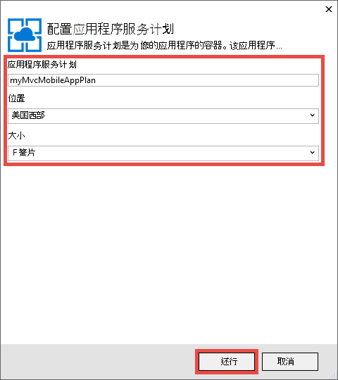
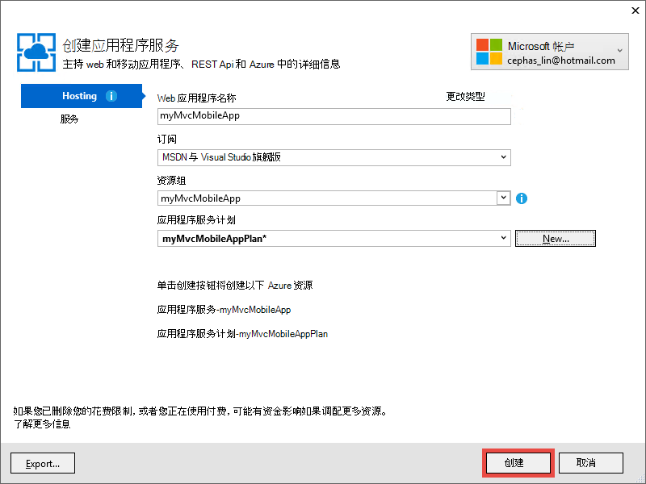

<properties 
    pageTitle="在 Azure 应用程序服务的 ASP.NET MVC 5 移动 web 应用程序部署" 
    description="教程，教您如何将 web 应用程序部署到 Azure 应用程序服务在 ASP.NET MVC 5 web 应用程序中使用移动功能。" 
    services="app-service" 
    documentationCenter=".net" 
    authors="cephalin" 
    manager="wpickett" 
    editor="jimbe"/>

<tags 
    ms.service="app-service" 
    ms.workload="na" 
    ms.tgt_pltfrm="na" 
    ms.devlang="dotnet" 
    ms.topic="article" 
    ms.date="01/12/2016" 
    ms.author="cephalin;riande"/>

# 在 Azure 应用程序服务的 ASP.NET MVC 5 移动 web 应用程序部署

本教程将教您如何构建是便携式的 ASP.NET MVC 5 web 应用程序并将其部署到 Azure 应用程序服务的基本知识。 对于本教程，您需要[Visual Studio 速成 2013 网站][Visual Studio Express 2013]或如果您已经拥有的 Visual Studio 专业版。 您可以使用[Visual Studio 2015年]但屏幕截图将不同并且必须使用 ASP.NET 4.x 模板。

[AZURE.INCLUDE [create-account-and-websites-note](../../includes/create-account-and-websites-note.md)]

## 您将构建

对于本教程，您将添加到[起始项目]中提供的简单会议列表应用程序移动功能[StarterProject]。 下面的屏幕快照显示 ASP.NET 会话中已完成的应用程序中，在 Internet Explorer 11 F12 开发工具中的浏览器模拟器中看到。

![][FixedSessionsByTag]

您可以使用 Internet Explorer 11 F12 开发人员工具， [Fiddler 工具][Fiddler]为了帮助调试应用程序。 

## 您将学习的技能

下面是您将学习︰

-   如何使用 Visual Studio 2013年发布 web 应用程序与 web 应用程序直接在 Azure 应用程序服务。
-   ASP.NET MVC 5 模板如何使用 CSS 引导框架来改善移动设备上的显示
-   如何创建针对特定的移动浏览器，如 iPhone 和 Android 的移动特定视图
-   如何创建响应的视图 （跨设备响应不同的浏览器的视图）

## 设置开发环境

设置开发环境由 Azure SDK 安装.NET 2.5.1 版或更高版本。 

1. 若要针对.NET 安装 Azure SDK，请单击下面的链接。 如果您没有尚未安装的 Visual Studio 2013年，该链接将安装它。 本教程要求 Visual Studio 2013年。 [对于 Visual Studio 2013 azure SDK][AzureSDKVs2013]
1. 在 Web 平台安装程序窗口中，单击**安装**并继续安装。

您还需要一个移动浏览器的仿真程序。 以下任何起作用︰

-   浏览器[Internet Explorer 11 F12 开发工具]中的仿真程序[EmulatorIE11]（用于所有移动浏览器的屏幕抓图）。 它具有 Windows Phone 8、 Windows Phone 7，和苹果 iPad 的用户代理字符串预设。
-   浏览器模拟器在[Google Chrome DevTools][EmulatorChrome]。 它包含大量的 Android 设备，以及苹果 iPhone、 苹果 iPad 和 Amazon 的 Kindle 火灾的预设。 它还会模拟触摸事件。
-   [Opera 移动仿真器][EmulatorOpera]

Visual Studio 项目 C\#源代码都可用来显示本主题︰

-   [起始项目下载][StarterProject]
-   [完成项目下载][CompletedProject]

##将起始项目部署到 Azure 的 web 应用程序

1.  会议列表应用程序[起始项目]下载[StarterProject]。

2.  在 Windows 资源管理器，右键单击下载的 ZIP 文件，然后选择*属性*。

3.  在**属性**对话框中，选择**取消阻止**按钮。 （解除封锁防止安全警告，当您尝试使用已经从网上下载一个*.zip*文件）。

4.  用鼠标右键单击该 ZIP 文件，然后选择**全部提取**将此文件解压缩。 

5.  在 Visual Studio，打开*C#\Mvc5Mobile.sln*文件。

6.  在解决方案资源管理器中右击项目并单击**发布**。

    ![][DeployClickPublish]

7.  在发布的站点，请单击**Microsoft Azure 应用程序服务**。

    ![][DeployClickWebSites]

8.  如果您还没有已经登录到 Azure，请单击**添加帐户**。

    ![][DeploySignIn]

9.  按照提示登录到您的 Azure 帐户。

11. 应用程序服务对话框现在应该显示您作为签名。 单击**新建**。

    ![][DeployNewWebsite]  

12. 在**Web 应用程序名称**字段中，指定一个唯一的应用程序名称前缀。 完全限定的 web 应用程序名称将是*&lt;前缀 >*。 azurewebsites.net。 此外，选择或指定**资源组**中的一个新的资源组名称。 然后，单击**新建**以创建新的应用程序服务计划。

    ![][DeploySiteSettings]

13. 配置新的应用程序服务计划，请单击**确定**。 

    

13. 在创建应用程序服务对话框中，单击**创建**。

     

13. Azure 资源创建后，对话框将充满新的应用程序的设置发布 Web。 单击**发布**。

    ![][DeployPublishSite]

    Visual Studio 完成发布到 Azure 的 web 应用程序的起始项目，一旦桌面浏览器将打开，显示实时 web 应用程序。

14. 启动移动浏览器仿真程序，复制会议应用程序的 URL (*<prefix>*。 azurewebsites.net) 到仿真程序，然后单击右上角的按钮并选择**按标签浏览**。 如果您正在使用 Internet Explorer 11 作为默认浏览器，只需键入`F12`，然后`Ctrl+8`，然后将浏览器配置文件更改为**Windows Phone**。 下图显示了在纵向模式下 （从选择**按标签浏览**） *AllTags*视图。

    ![][AllTags]

>[AZURE.TIP] 虽然可以调试 MVC 5 应用程序从 Visual Studio 内的，可以发布您的 web 应用程序到 Azure 再次以验证直接从移动浏览器或浏览器模拟器实时 web 应用程序。

显示器是在移动设备上非常可读的。 也已经可以看到一些引导 CSS 框架应用的视觉效果。
单击**ASP.NET**链接。

![][SessionsByTagASP.NET]

ASP.NET 标记视图是缩放适合屏幕，它会自动为您完成引导。 但是，您可以提高此视图以更好地适应移动浏览器。 例如，**日期**列是难以阅读。 在本教程后面部分，您将更改*AllTags*视图，使其移动友好。

##引导的 CSS 框架

新 MVC 5 中模板是引导的内置支持。 您已经看到如何立即提高您的应用程序中的不同视图。 例如，在顶部导航栏时，可自动折叠的浏览器宽度较小。 在桌面浏览器，请调整浏览器窗口的大小，请参阅导航栏更改其外观和感觉的方式。 这是快速响应 web 设计中内置的引导。

若要查看 Web 应用程序的外观没有引导的情况下，打开*App\_启动\\BundleConfig.cs*和注释掉的行包含*bootstrap.js*和*bootstrap.css*。 下面的代码演示的最后两个语句`RegisterBundles`方法更改之后︰

     bundles.Add(new ScriptBundle("~/bundles/bootstrap").Include(
              //"~/Scripts/bootstrap.js",
              "~/Scripts/respond.js"));

    bundles.Add(new StyleBundle("~/Content/css").Include(
              //"~/Content/bootstrap.css",
              "~/Content/site.css"));

按`Ctrl+F5`以运行该应用程序。

观察可折叠的导航栏是现在只是普通的无序列的表。 **按标签浏览**再次单击，然后单击**ASP.NET**。
在移动仿真器视图中，您可以看到它不再是缩放调整到屏幕上，并必须侧向滚动以查看表的右侧。

![][SessionsByTagASP.NETNoBootstrap]

撤消所做的更改并刷新移动浏览器以验证便携式显示已还原。

引导并不特定于 ASP.NET MVC 5，您可以利用这些功能中的任何 web 应用程序中。 但它现在内置于 ASP.NET MVC 5 项目模板，以便 5 MVC Web 应用程序可以充分利用默认引导。

有关引导的更多信息，请转到[引导][BootstrapSite]网站。

在下一节中，您将看到如何提供手机浏览器特定的视图。

##重写视图、 布局和局部视图

一般情况下，对于单个的移动浏览器，或任何特定的浏览器的移动浏览器，您可以覆盖任何视图 （包括布局和局部视图）。 提供特定于移动的视图，可以查看文件复制并添加*。移动*到的文件的名称。 例如，若要创建移动*索引*视图时，可以复制*视图\\主页\\Index.cshtml*到*视图\\主页\\Index.Mobile.cshtml*。

在本节中，您将创建一个移动特定的布局文件。

若要开始，请复制*视图\\共享\\\_Layout.cshtml*到*视图\\共享\\\_Layout.Mobile.cshtml*。 打开*\_Layout.Mobile.cshtml*和**MVC5**应用程序 （手机） **MVC5 应用程序**中更改的标题。

在每个`Html.ActionLink`调用导航栏，删除每个链接*ActionLink*在"浏览"。 下面的代码显示已完成`<ul class="nav navbar-nav">`移动布局文件的标记。

    <ul class="nav navbar-nav">
        <li>@Html.ActionLink("Home", "Index", "Home")</li>
        <li>@Html.ActionLink("Date", "AllDates", "Home")</li>
        <li>@Html.ActionLink("Speaker", "AllSpeakers", "Home")</li>
        <li>@Html.ActionLink("Tag", "AllTags", "Home")</li>
    </ul>

复制*视图\\主页\\AllTags.cshtml*文件为*视图\\主页\\AllTags.Mobile.cshtml*。 打开新文件和更改`<h2>`元素从"标记"为"标记 (M)":

    <h2>Tags (M)</h2>

浏览到标签页使用桌面浏览器和使用移动浏览器仿真程序。 移动浏览器仿真程序显示了两个所做的更改 (从标题*\_Layout.Mobile.cshtml*和*AllTags.Mobile.cshtml*从标题)。

![][AllTagsMobile_LayoutMobile]

与之相反的是，尚未更改桌面显示 (带有标题从*\_Layout.cshtml*和*AllTags.cshtml*)。

![][AllTagsMobile_LayoutMobileDesktop]

##创建特定于浏览器的视图

除了移动和桌面特定视图，您可以创建单个浏览器的视图。 例如，您可以创建专门为 iPhone 或 Android 的浏览器的视图。 在本节中，您将创建用于 iPhone 浏览器和 iPhone 版本的*AllTags*视图的布局。

打开*Global.asax*文件并将下面的代码添加到底部的`Application_Start`方法。

    DisplayModeProvider.Instance.Modes.Insert(0, new DefaultDisplayMode("iPhone")
    {
        ContextCondition = (context => context.GetOverriddenUserAgent().IndexOf
            ("iPhone", StringComparison.OrdinalIgnoreCase) >= 0)
    });

此代码将定义新的显示模式，以名为"iPhone"，要与每个传入请求相匹配。 如果传入的请求匹配定义 （即，如果用户代理包含字符串"iPhone"） 的条件，将查找 ASP.NET MVC 视图名称中包含"iPhone"后缀。

>[AZURE.NOTE] 在添加移动浏览器特定显示模式时，如 iPhone 和 Android，请务必将第一个参数设置为`0`（在列表的顶部插入） 以确保浏览器特定的模式，优先于移动模板 (*。Mobile.cshtml)。 如果移动模板是在列表的顶部，它将选择通过预期的显示模式 （在第一个匹配项 wins 和移动模板匹配所有移动浏览器）。 

在代码中，用鼠标右键单击`DefaultDisplayMode`，选择**解决**，然后再选择`using System.Web.WebPages;`。 这将引用添加到`System.Web.WebPages`命名空间中，它是在何处`DisplayModeProvider`和`DefaultDisplayMode`类型的定义。

![][ResolveDefaultDisplayMode]

或者，您可以只是手动添加以下行`using`文件部分。

    using System.Web.WebPages;

保存所做的更改。 复制*视图\\共享\\\_Layout.Mobile.cshtml*文件为*视图\\共享\\\_Layout.iPhone.cshtml*。 打开新文件，然后更改标题从`MVC5 Application (Mobile)`到`MVC5 Application (iPhone)`。

复制*视图\\主页\\AllTags.Mobile.cshtml*文件为*视图\\主页\\AllTags.iPhone.cshtml*。 在新文件中，更改`<h2>`"标记 (iPhone)"元素从"标记 (M)"。

运行该应用程序。 运行移动浏览器仿真程序，确保其用户代理设置为"iPhone"并浏览到*AllTags*视图。 如果使用 Internet Explorer 11 F12 开发人员工具中的仿真程序，配置仿真与以下︰

-   浏览器配置文件 = **Windows Phone**
-   用户代理字符串 =**自定义**
-   自定义字符串 =**苹果-iPhone5C1/1001.525**

下面的屏幕快照演示*AllTags*视图呈现在仿真程序中使用自定义用户代理字符串的 Internet Explorer 11 F12 开发工具 （这是 iPhone 5 C 用户代理字符串）。

![][AllTagsIPhone_LayoutIPhone]

在移动浏览器中，选择**扬声器**链接。 因为没有移动视图 (*AllSpeakers.Mobile.cshtml*)，使用移动布局视图呈现默认扬声器视图 (*AllSpeakers.cshtml*) (*\_Layout.Mobile.cshtml*)。 如下所示，在中定义的标题**MVC5 应用程序 （手机）** * \_Layout.Mobile.cshtml*。

![][AllSpeakers_LayoutMobile]

您可以通过设置全局禁用默认 （非手机） 视图中移动布局呈现从`RequireConsistentDisplayMode`到`true`在*视图\\\_ViewStart.cshtml*文件中的，如下︰

    @{
        Layout = "~/Views/Shared/_Layout.cshtml";
        DisplayModeProvider.Instance.RequireConsistentDisplayMode = true;
    }

当`RequireConsistentDisplayMode`设置为`true`，移动布局 (*\_Layout.Mobile.cshtml*) 仅用于移动视图 （即当查看文件的***ViewName**形式。Mobile.cshtml*)。 您可能想要设置`RequireConsistentDisplayMode`到`true`如果您移动布局不能很好地使用非移动视图。 下面的屏幕快照显示了*扬声器*页呈现效果时`RequireConsistentDisplayMode`设置为`true`（不在顶部导航栏中的字符串"（手机）"）。

![][AllSpeakers_LayoutMobileOverridden]

您可以通过设置禁用在特定视图中一致的显示模式`RequireConsistentDisplayMode`到`false`中查看文件。 在下面的标记*视图\\主页\\AllSpeakers.cshtml*文件中设置`RequireConsistentDisplayMode`到`false`:

    @model IEnumerable<string>

    @{
        ViewBag.Title = "All speakers";
        DisplayModeProvider.Instance.RequireConsistentDisplayMode = false;
    }

在本节中我们已经看到如何创建移动布局和视图，以及如何创建布局和视图为特定设备如 iPhone。
但是，引导 CSS 框架的主要优势是快速响应的布局，这意味着单个样式表可在桌面、 电话和 tablet 的浏览器来创建一致的外观和感觉。 在下一节中，您将看到如何利用引导创建移动友好的视图。

##提高扬声器列表

根据您刚才看到*扬声器*视图是可读的但比较小，难以在移动设备上点击链接。 在本节中，您将*AllSpeakers*视图移动友好，这显示大、 容易点击链接，并包含一个搜索框，以快速查找扬声器。

您可以使用引导[组链接的列表][]样式提高*扬声器*视图。 在*视图\\主页\\AllSpeakers.cshtml*，Razor 文件的内容替换为以下代码。

     @model IEnumerable<string>

    @{
        ViewBag.Title = "All Speakers";
    }

    <h2>Speakers</h2>

    

        @foreach (var speaker in Model)
        {
            @Html.ActionLink(speaker, "SessionsBySpeaker", new { speaker }, new { @class = "list-group-item" })
        }
    

`class="list-group"`特性`
`标记的应用的引导列表样式，以及`class="input-group-item"`特性所引导的列表项样式设置应用于每个链接。

刷新浏览器，移动。 更新的视图如下所示︰

![][AllSpeakersFixed]

引导数据库[链接的列表组][]样式使整个框的每个链接的可点击的这是更好的用户体验。 切换到桌面视图并观察一致的外观和感觉。

![][AllSpeakersFixedDesktop]

虽然移动浏览器已得到改进，很难定位扬声器的长列表。 引导并不提供搜索筛选器功能的-瓜，但您可以将其添加几行代码。 首先将到视图，添加一个搜索框，然后将与筛选器函数的 JavaScript 代码。 在*视图\\主页\\AllSpeakers.cshtml*，添加\<表单\>之后标记\<h2\>标记，如下所示︰

    @model IEnumerable<string>

    @{
        ViewBag.Title = "All Speakers";
    }

    <h2>Speakers</h2>

    <form class="input-group">
        
        <input type="text" class="form-control" placeholder="Search speaker">
    </form>
     
    

        @foreach (var speaker in Model)
        {
            @Html.ActionLink(speaker, 
                             "SessionsBySpeaker", 
                             new { speaker }, 
                             new { @class = "list-group-item" })
        }
    

请注意， `<form>` ，`<input>`标记这两个具有应用于它们的引导样式。 ``元素将引导[glyphicon][]添加到搜索框中。

在*脚本*文件夹中添加一个名为*filter.js*的 JavaScript 文件。 打开该文件并将下面的代码粘贴到其中︰

    $(function () {

        // reset the search form when the page loads
        $("form").each(function () {
            this.reset();
        });

        // wire up the events to the <input> element for search/filter
        $("input").bind("keyup change", function () {
            var searchtxt = this.value.toLowerCase();
            var items = $(".list-group-item");

            // show all speakers that begin with the typed text and hide others
            for (var i = 0; i < items.length; i++) {
                var val = items[i].text.toLowerCase();
                val = val.substring(0, searchtxt.length);
                if (val == searchtxt) {
                    $(items[i]).show();
                }
                else {
                    $(items[i]).hide();
                }
            }
        });
    });

您还需要在您注册的捆绑包中包括 filter.js。 打开*App\_启动\\BundleConfig.cs*和更改第一个包。 更改第一个`bundles.Add`语句 （对于**jquery**包中） 包括*脚本\\filter.js*，如下︰

     bundles.Add(new ScriptBundle("~/bundles/jquery").Include(
                "~/Scripts/jquery-{version}.js",
                "~/Scripts/filter.js"));

**Jquery**包已呈现由默认*\_布局*视图。 稍后，您可以利用相同的 JavaScript 代码，要到其他列表视图应用筛选器功能。

刷新浏览器，移动和转到*AllSpeakers*视图。 在搜索框中，键入"sc"。 现在应将扬声器列表筛选根据您的搜索字符串。

![][AllSpeakersFixedSearchBySC]

##提高标记列表

*扬声器*视图类似，*标记*视图中可读，但这些链接都是小而难在移动设备上点击。 在解决*扬声器*视图中，如果您使用前面介绍的代码更改，但具有以下相同的方式解决*标记*视图`Html.ActionLink`方法语法中的*视图\\主页\\AllTags.cshtml*:

    @Html.ActionLink(tag, 
                     "SessionsByTag", 
                     new { tag }, 
                     new { @class = "list-group-item" })

刷新的桌面浏览器将如下所示︰

![][AllTagsFixedDesktop]

然后刷新的移动浏览器将如下所示︰ 

![][AllTagsFixed]

>[AZURE.NOTE] 如果您注意到原始列表格式仍有在移动浏览器和想知道您很好的引导样式发生了什么变化，这是您的早期操作来创建移动特定视图的项目。 但是，既然您使用引导 CSS 框架创建响应式 web 设计，转头部并删除这些移动特定视图和移动特定的布局视图。 一旦您这样做了，刷新移动浏览器将显示引导的样式设置。

##提高日期列表

如果您使用前面介绍的代码更改改进了*扬声器*和*标记*视图类似，但具有以下，可以提高*日期*视图`Html.ActionLink`方法语法中的*视图\\主页\\AllDates.cshtml*:

    @Html.ActionLink(date.ToString("ddd, MMM dd, h:mm tt"), 
                     "SessionsByDate", 
                     new { date }, 
                     new { @class = "list-group-item" })

您将得到如下刷新移动浏览器视图︰

![][AllDatesFixed]

通过按日期组织的日期时间值，可以进一步提高*日期*视图。 这可以通过引导[面板][]的样式设置。 替换内容的*视图\\主页\\AllDates.cshtml*文件使用以下代码︰

    @model IEnumerable<DateTime>

    @{
        ViewBag.Title = "All Dates";
    }

    <h2>Dates</h2>

    @foreach (var dategroup in Model.GroupBy(x=>x.Date))
    {
        

            

                @dategroup.Key.ToString("ddd, MMM dd")
            

            

                @foreach (var date in dategroup)
                {
                    @Html.ActionLink(date.ToString("h:mm tt"), 
                                     "SessionsByDate", 
                                     new { date }, 
                                     new { @class = "list-group-item" })
                }
            

        

    }

此代码创建单独的`
`在列表中，每个不同日期的标记，并像以前一样各自的链接使用[链接的列表组][]。 这里是移动浏览器看起来像当这段代码运行时︰

![][AllDatesFixed2]

切换到桌面浏览器。 此外，请注意一致的外观。

![][AllDatesFixed2Desktop]

##提高 SessionsTable 视图

在本节中，您将*SessionsTable*视图移动更友好。 这种更改是更广泛以前的更改。

在移动浏览器，点击**标记**按钮，然后输入`asp`在搜索框中。

![][AllTagsFixedSearchByASP]

点击**ASP.NET**链接。

![][SessionsTableTagASP.NET]

如您所见，显示格式为当前设计为在桌面浏览器中查看的表。 但是，很得有点难以移动浏览器上阅读。 若要解决此问题，请打开*视图\\主页\\SessionsTable.cshtml* ，然后将该文件的内容替换为下面的代码︰

    @model IEnumerable<Mvc5Mobile.Models.Session>

    <h2>@ViewBag.Title</h2>

    

        

            @foreach (var session in Model)
            {
                

                    

                        @Html.ActionLink(session.Title, 
                                         "SessionByCode", 
                                         new { session.Code }, 
                                         new { @class="list-group-item active" })
                        

                            

                                @Html.Partial("_SpeakersLinks", session)
                            

                            

                                @session.DateText
                            

                            

                                @Html.Partial("_TagsLinks", session)
                            

                        

                    

                

            }
        

    

该代码做到三件事︰

-   使用引导[组自定义的链接的列表][]来设置格式的会话信息垂直，以便所有此类信息在移动浏览器 （使用如列表组项文本的类） 上可读
-   为布局，应用[网格系统][]，以便在桌面浏览器和垂直移动浏览器 （使用 col-md-4 类） 中的会话项横向流动
-   [快速响应实用程序][]用于隐藏会话标记 （使用-xs 隐藏类） 的移动浏览器中查看时，

您还可以点击标题链接转到相应的会话。 下面的图像反映的代码更改。

![][FixedSessionsByTag]

自动应用引导网格系统排列垂直在移动浏览器会话。 另外，请注意，标记将不会显示。 切换到桌面浏览器。

![][SessionsTableFixedTagASP.NETDesktop]

在桌面浏览器中，请注意现在显示了标记。 此外，还会显示您应用引导网格系统排列两个列中的会话项。 如果放大浏览器时，您将看到排列方式更改为三栏。

##提高 SessionByCode 视图

最后，您将修复*SessionByCode*视图，使其移动友好。

在移动浏览器，点击**标记**按钮，然后输入`asp`在搜索框中。

![][AllTagsFixedSearchByASP]

点击**ASP.NET**链接。 显示 ASP.NET 标记的会话。

![][FixedSessionsByTag]

选择**生成单页面应用程序使用 ASP.NET 和 AngularJS**的链接。

![][SessionByCode3-644]

默认桌面视图是好的但您可以通过使用某些引导 GUI 组件轻松地提高外观。

打开*视图\\主页\\SessionByCode.cshtml*和内容替换为以下标记︰

    @model Mvc5Mobile.Models.Session

    @{
        ViewBag.Title = "Session details";
    }
    <h3>@Model.Title (@Model.Code)</h3>
    

        <strong>@Model.DateText</strong> in <strong>@Model.Room</strong>
    

    

        

            Speakers
        

        @foreach (var speaker in Model.Speakers)
        {
            @Html.ActionLink(speaker, 
                             "SessionsBySpeaker", 
                             new { speaker }, 
                             new { @class="panel-body" })
        }
    

    
@Model.Abstract

    

        

            Tags
        

        @foreach (var tag in Model.Tags)
        {
            @Html.ActionLink(tag, 
                             "SessionsByTag", 
                             new { tag }, 
                             new { @class = "panel-body" })
        }
    

新的标记使用引导面板样式设计来提高移动视图。 

刷新浏览器，移动。 下图反映了您刚才的代码更改︰

![][SessionByCodeFixed3-644]

## 总结及检查

本教程向您展示了如何使用 ASP.NET MVC 5 开发移动 Web 应用程序。 其中包括︰

-   ASP.NET MVC 5 应用程序部署到 web 应用程序的应用程序服务
-   使用引导 MVC 5 应用程序中创建响应式 web 版式
-   全局和单个视图重写布局、 视图和分部视图
-   控件的布局和部分替代强制使用`RequireConsistentDisplayMode`属性
-   创建目标特定的浏览器，如 iPhone 浏览器的视图
-   将引导数据库样式设置在 Razor 代码中应用

## 请参见

-   [9 的快速响应 web 设计的基本原则](http://blog.froont.com/9-basic-principles-of-responsive-web-design/)
-   [引导][BootstrapSite]
-   [官方的引导日志][]
-   [从教程共和国 twitter 引导数据库教程][]
-   [引导的运动场][]
-   [W3C 建议移动 Web 应用程序的最佳做法][]
-   [针对媒体查询的 W3C 候选建议][]

## 会发生什么变化
* 有关更改网站为应用程序服务的指南，请参阅︰ [Azure 应用程序服务，并对现有的 Azure 服务及其影响](http://go.microsoft.com/fwlink/?LinkId=529714)

<!-- Internal Links -->
[Deploy the starter project to an Azure web app]: #bkmk_DeployStarterProject
[Bootstrap CSS Framework]: #bkmk_bootstrap
[Override the Views, Layouts, and Partial Views]: #bkmk_overrideviews
[Create Browser-Specific Views]:#bkmk_browserviews
[Improve the Speakers List]: #bkmk_Improvespeakerslist
[Improve the Tags List]: #bkmk_improvetags
[Improve the Dates List]: #bkmk_improvedates
[Improve the SessionsTable View]: #bkmk_improvesessionstable
[Improve the SessionByCode View]: #bkmk_improvesessionbycode

<!-- External Links -->
[Visual Studio Express 2013]: http://www.visualstudio.com/downloads/download-visual-studio-vs#d-express-web
[Visual Studio 2015 年]: https://www.visualstudio.com/downloads/download-visual-studio-vs
[AzureSDKVs2013]: http://go.microsoft.com/fwlink/p/?linkid=323510&clcid=0x409
[Fiddler]: http://www.fiddler2.com/fiddler2/
[EmulatorIE11]: http://msdn.microsoft.com/library/ie/dn255001.aspx
[EmulatorChrome]: https://developers.google.com/chrome-developer-tools/docs/mobile-emulation
[EmulatorOpera]: http://www.opera.com/developer/tools/mobile/
[StarterProject]: http://go.microsoft.com/fwlink/?LinkID=398780&clcid=0x409
[CompletedProject]: http://go.microsoft.com/fwlink/?LinkID=398781&clcid=0x409
[BootstrapSite]: http://getbootstrap.com/
[WebPIAzureSdk23NetVS13]: ./media/web-sites-dotnet-deploy-aspnet-mvc-mobile-app/WebPIAzureSdk23NetVS13.png
[链接的列表组]: http://getbootstrap.com/components/#list-group-linked
[glyphicon]: http://getbootstrap.com/components/#glyphicons
[面板]: http://getbootstrap.com/components/#panels
[自定义链接的列表组]: http://getbootstrap.com/components/#list-group-custom-content
[网格系统]: http://getbootstrap.com/css/#grid
[快速响应的实用程序]: http://getbootstrap.com/css/#responsive-utilities
[官方的引导日志]: http://blog.getbootstrap.com/
[从教程共和国 twitter 引导数据库教程]: http://www.tutorialrepublic.com/twitter-bootstrap-tutorial/
[引导的运动场]: http://www.bootply.com/
[W3C 建议移动 Web 应用程序的最佳做法]: http://www.w3.org/TR/mwabp/
[针对媒体查询的 W3C 候选建议]: http://www.w3.org/TR/css3-mediaqueries/

<!-- Images -->
[DeployClickPublish]: ./media/web-sites-dotnet-deploy-aspnet-mvc-mobile-app/deploy-to-azure-website-1.png
[DeployClickWebSites]: ./media/web-sites-dotnet-deploy-aspnet-mvc-mobile-app/deploy-to-azure-website-2.png
[DeploySignIn]: ./media/web-sites-dotnet-deploy-aspnet-mvc-mobile-app/deploy-to-azure-website-3.png
[DeployUsername]: ./media/web-sites-dotnet-deploy-aspnet-mvc-mobile-app/deploy-to-azure-website-4.png
[DeployPassword]: ./media/web-sites-dotnet-deploy-aspnet-mvc-mobile-app/deploy-to-azure-website-5.png
[DeployNewWebsite]: ./media/web-sites-dotnet-deploy-aspnet-mvc-mobile-app/deploy-to-azure-website-6.png
[DeploySiteSettings]: ./media/web-sites-dotnet-deploy-aspnet-mvc-mobile-app/deploy-to-azure-website-7.png
[DeployPublishSite]: ./media/web-sites-dotnet-deploy-aspnet-mvc-mobile-app/deploy-to-azure-website-8.png
[MobileHomePage]: ./media/web-sites-dotnet-deploy-aspnet-mvc-mobile-app/mobile-home-page.png
[FixedSessionsByTag]: ./media/web-sites-dotnet-deploy-aspnet-mvc-mobile-app/SessionsByTag-ASP.NET-Fixed.png
[AllTags]: ./media/web-sites-dotnet-deploy-aspnet-mvc-mobile-app/AllTags.png
[SessionsByTagASP.NET]: ./media/web-sites-dotnet-deploy-aspnet-mvc-mobile-app/SessionsByTag-ASP.NET.png
[SessionsByTagASP.NETNoBootstrap]: ./media/web-sites-dotnet-deploy-aspnet-mvc-mobile-app/SessionsByTag-ASP.NET-NoBootstrap.png
[AllTagsMobile_LayoutMobile]: ./media/web-sites-dotnet-deploy-aspnet-mvc-mobile-app/AllTagsMobile-_LayoutMobile.png
[AllTagsMobile_LayoutMobileDesktop]: ./media/web-sites-dotnet-deploy-aspnet-mvc-mobile-app/AllTagsMobile-_LayoutMobile-Desktop.png
[ResolveDefaultDisplayMode]: ./media/web-sites-dotnet-deploy-aspnet-mvc-mobile-app/Resolve-DefaultDisplayMode.png
[AllTagsIPhone_LayoutIPhone]: ./media/web-sites-dotnet-deploy-aspnet-mvc-mobile-app/AllTagsIPhone-_LayoutIPhone.png
[AllSpeakers_LayoutMobile]: ./media/web-sites-dotnet-deploy-aspnet-mvc-mobile-app/AllSpeakers-_LayoutMobile.png
[AllSpeakers_LayoutMobileOverridden]: ./media/web-sites-dotnet-deploy-aspnet-mvc-mobile-app/AllSpeakers-_LayoutMobile-Overridden.png
[AllSpeakersFixed]: ./media/web-sites-dotnet-deploy-aspnet-mvc-mobile-app/AllSpeakers-Fixed.png
[AllSpeakersFixedDesktop]: ./media/web-sites-dotnet-deploy-aspnet-mvc-mobile-app/AllSpeakers-Fixed-Desktop.png
[AllSpeakersFixedSearchBySC]: ./media/web-sites-dotnet-deploy-aspnet-mvc-mobile-app/AllSpeakers-Fixed-SearchBySC.png
[AllTagsFixedDesktop]: ./media/web-sites-dotnet-deploy-aspnet-mvc-mobile-app/AllTags-Fixed-Desktop.png 
[AllTagsFixed]: ./media/web-sites-dotnet-deploy-aspnet-mvc-mobile-app/AllTags-Fixed.png
[AllDatesFixed]: ./media/web-sites-dotnet-deploy-aspnet-mvc-mobile-app/AllDates-Fixed.png
[AllDatesFixed2]: ./media/web-sites-dotnet-deploy-aspnet-mvc-mobile-app/AllDates-Fixed2.png
[AllDatesFixed2Desktop]: ./media/web-sites-dotnet-deploy-aspnet-mvc-mobile-app/AllDates-Fixed2-Desktop.png
[AllTagsFixedSearchByASP]: ./media/web-sites-dotnet-deploy-aspnet-mvc-mobile-app/AllTags-Fixed-SearchByASP.png
[SessionsTableTagASP.NET]: ./media/web-sites-dotnet-deploy-aspnet-mvc-mobile-app/SessionsTable-Tag-ASP.NET.png
[SessionsTableFixedTagASP.NETDesktop]: ./media/web-sites-dotnet-deploy-aspnet-mvc-mobile-app/SessionsTable-Fixed-Tag-ASP.NET-Desktop.png
[SessionByCode3-644]: ./media/web-sites-dotnet-deploy-aspnet-mvc-mobile-app/SessionByCode-3-644.png
[SessionByCodeFixed3-644]: ./media/web-sites-dotnet-deploy-aspnet-mvc-mobile-app/SessionByCode-Fixed-3-644.png
 
