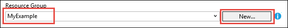

<properties
    pageTitle="部署到使用 Visual Studio 的 Azure 应用程序服务的 ASP.NET 应用程序 |Microsoft Azure"
    description="了解如何将 ASP.NET web 项目部署到新 web 应用程序中使用 Visual Studio 的 Azure 应用程序服务。"
    services="app-service\web"
    documentationCenter=".net"
    authors="tdykstra"
    manager="wpickett"
    editor=""/>

<tags
    ms.service="app-service-web"
    ms.workload="web"
    ms.tgt_pltfrm="na"
    ms.devlang="dotnet"
    ms.topic="get-started-article"
    ms.date="07/22/2016"
    ms.author="rachelap"/>

# 将 ASP.NET web 应用程序部署到使用 Visual Studio 的 Azure 应用程序服务

[AZURE.INCLUDE [tabs](../../includes/app-service-web-get-started-nav-tabs.md)]

## 概述

本教程展示如何使用 Visual Studio 2015年部署到[web 应用程序在 Azure 应用程序服务](app-service-web-overview.md)的 ASP.NET web 应用程序。

本教程假定您将 ASP.NET 开发人员有没有经历过使用 Azure。 当完成时，您必须设置一个简单的 web 应用程序并在云中运行。

您将学习︰

* 当您在 Visual Studio 中创建新的 web 项目时创建新的应用程序服务 web 应用程序的方式。
* 如何通过使用 Visual Studio 为应用程序服务 web 应用程序部署 web 项目。

关系图说明了您在本教程中所执行的操作。

在本教程结束时上如果东西不起作用，和[接下来的步骤](#next-steps)部分提供一些主题的链接，转到有关如何使用 Azure 应用程序服务的多个深度其他教程怎么办, 的想法提供了[疑难解答](#troubleshooting)一节。

因为这是一个快速入门教程，它演示如何部署 web 项目是一个简单，不能使用数据库，并不会执行身份验证或授权。 有关更高级的部署主题的链接，请参阅[如何部署 Azure 的 web 应用程序](web-sites-deploy.md)。

Apart from Azure SDK 安装.NET 所需的时间，本教程大约需要 10-15 分钟来完成。

## 系统必备组件

* 本教程假定您使用 ASP.NET MVC 和 Visual Studio 过。 如果需要介绍，请参见[ASP.NET MVC 5 入门知识](http://www.asp.net/mvc/overview/getting-started/introduction/getting-started)。

* 您需要一个 Azure 帐户。 您可以[打开一个免费的 Azure 帐户](/pricing/free-trial/?WT.mc_id=A261C142F)或[激活 Visual Studio 订阅者权益](/pricing/member-offers/msdn-benefits-details/?WT.mc_id=A261C142F)。 

    如果您想要开始使用 Azure 应用程序服务注册 Azure 帐户之前，请转到[尝试应用程序服务](http://go.microsoft.com/fwlink/?LinkId=523751)。 那里可以在应用程序服务中创建短期初学者应用程序 — 需要，没有信用卡，没有承诺。

## 设置开发环境

本教程面向[.NET 的 Azure SDK](../dotnet-sdk.md) 2.9 或更高版本的 Visual Studio 2015年。 

* [下载最新的 Visual Studio 2015 Azure SDK](http://go.microsoft.com/fwlink/?linkid=518003)。 如果尚不具备，SDK 安装 Visual Studio 2015年。

    >[AZURE.NOTE] 根据 SDK 依赖项的数量，您已经在您的计算机上，安装 SDK 可能需要很长时间，从几分钟到半小时或更长的时间。

如果 Visual Studio 2013年并愿意使用它，您可以[下载最新的 Visual Studio 2013 Azure SDK](http://go.microsoft.com/fwlink/?LinkID=324322)。 某些屏幕可能看起来与的图释不同。

## 配置新的 web 项目

下一步是在 Visual Studio 和 Azure 应用程序服务中的一个 web 应用程序中创建 web 项目。 在本教程的这一部分中，您将配置新的 web 项目。 

1. 打开 Visual Studio 2015年。

2. 单击**文件 > 新建 > 项目**。

3. 在**新建项目**对话框中，单击**C# > Web > ASP.NET Web 应用程序**。

3. 请确保选择**.NET Framework 4.5.2**作为目标的框架。

4.  [Azure 应用程序见解](../application-insights/app-insights-overview.md)监视 web 应用程序的可用性、 性能和使用情况。 默认为第一次创建 web 项目时安装 Visual Studio 后**向项目中添加应用程序见解**复选框处于选中状态。 如果处于选中状态，但您不想要尝试应用程序的见解，请清除复选框。

4. 命名为**MyExample**，该应用程序，然后单击**确定**。

    

5. 在**新建 ASP.NET 项目**对话框中，选择**MVC**模板，然后单击**更改身份验证**。

    对于本教程，您将部署 ASP.NET MVC web 项目。 如果您想要了解如何将 ASP.NET Web API 项目部署，看到[后续步骤](#next-steps)部分。 

    

6. 在**更改身份验证**对话框中，单击**无身份验证**，，然后单击**确定**。

    

    如果对于此快速入门教程来部署简单的应用程序不执行用户登录。

5. 在**新建 ASP.NET 项目**对话框中的**Microsoft Azure**部分中，确保选择了**在云中托管**和**应用程序服务**下拉列表中选择。

    

    这些设置指示 Visual Studio 创建 web 项目的 Azure 的 web 应用程序。

6. 单击**确定**

## 配置新的 web 应用程序的 Azure 资源

现在有关要创建的 Azure 资源告诉 Visual Studio。

5. 在**创建应用程序服务**对话框中，单击**添加帐户**，然后登录到 Azure 的 ID 及其使用管理 Azure 订阅的帐户密码。

    

    如果您已经注册更早版本在同一台计算机上，您可能看不到**添加帐户**按钮。 在这种情况下，您可以跳过此步骤，或您可能需要重新输入您的凭据。
 
3. 输入*azurewebsites.net*域中是唯一的**Web 应用程序名称**。 例如，您可以命名它 MyExample 带到最右边才能使其成为唯一的如 MyExample810 的数字。 如果为您创建默认站点名称，则它是唯一，则可以使用它。

    如果其他人已经使用您输入的名称，您会看到红色的感叹号，而不是一个绿色的复选标记的右侧，您必须输入一个不同的名称。

    您的应用程序的 URL 是此名称加上*。 azurewebsites.net*。 例如，如果名为`MyExample810`，URL 是`myexample810.azurewebsites.net`。

    此外可以使用 Azure 的 web 应用程序中使用自定义的域。 有关详细信息，请参阅[配置自定义域名在 Azure 应用程序服务](web-sites-custom-domain-name.md)。

6. 单击**资源组**框旁边的**新建**按钮，然后输入"MyExample"或其他名称，如果您喜欢。 

    

    资源组是 Azure 的资源，如 web 应用程序、 数据库和虚拟机的集合。 有关的教程，则通常最好创建新的资源组，因为这样将使它容易地在一个步骤中删除为教程创建任何 Azure 资源。 有关详细信息，请参阅[Azure 资源管理器概述](../azure-resource-manager/resource-group-overview.md)。

4. 单击**应用程序服务计划**下拉列表旁边的**新建**按钮。

    

    此时将显示**配置应用程序服务计划**对话框。

    

    在以下步骤中，您可以配置新的资源组的应用程序服务计划。 应用程序服务计划指定在运行 web 应用程序的计算资源。 例如，如果您选择的免费层，API 应用程序上运行共享虚拟机，而为某些支付层运行在专用的虚拟机上。 有关详细信息，请参阅[应用程序服务计划概述](../app-service/azure-web-sites-web-hosting-plans-in-depth-overview.md)。

5. 在**配置应用程序服务计划**对话框中，输入"MyExamplePlan"或其他名称，如果您喜欢。

5. 在**位置**下拉列表中选择与您最近的位置。

    此设置指定您的应用程序将运行在哪个 Azure 数据中心。 在本教程中，您可以选择任何地区，它不会带来明显差异。 但是，对于生产应用程序中，您希望服务器要尽可能接近到客户机正在访问它，尽量减少[延迟](http://www.bing.com/search?q=web%20latency%20introduction&qs=n&form=QBRE&pq=web%20latency%20introduction&sc=1-24&sp=-1&sk=&cvid=eefff99dfc864d25a75a83740f1e0090)。

5. 在**大小**下拉列表，单击**自由**。

    对于本教程，自由定价层将提供好足够的性能。

6. 在**配置应用程序服务计划**对话框中，单击**确定**。

7. 在**创建应用程序服务**对话框中，单击**创建**。

## Visual Studio 创建项目和 web 应用程序

短时间内，通常小于一分钟，Visual Studio 将创建网站项目和 web 应用程序。  

**解决方案资源管理器**窗口中显示新项目中的文件和文件夹。

**Azure 应用程序服务活动**窗口显示已创建的 web 应用程序。

**云资源管理器**窗口允许您查看和管理 Azure 的资源，包括您刚刚创建新 web 应用程序。

    
## 将 web 项目部署到 Azure 的 web 应用程序

在此部分中，为 web 应用程序部署 web 项目。

1. 在**解决方案资源管理器**中用鼠标右键单击该项目，然后选择**发布**。

    

    几秒钟后，会出现**Web 发布**向导。 向导将打开*发布配置文件*具有用于将 web 项目部署到新的 web 应用程序的设置。

    发布配置文件包括用户名称和密码以进行部署。  已为您生成这些凭据，您不必输入它们。 在隐藏用户特定文件中加密密码`Properties\PublishProfiles`文件夹。
 
8. **Web 发布**向导**连接**选项卡上，单击**下一步**。

    

    接下来是**设置**选项卡。 在这里您可以更改生成配置来部署[远程调试](../app-service-web/web-sites-dotnet-troubleshoot-visual-studio.md#remotedebug)的调试版本。 选项卡还提供了几个[文件发布选项](https://msdn.microsoft.com/library/dd465337.aspx#Anchor_2)。

10. 在**设置**选项卡上，单击**下一步**。

    

    接下来是**预览**选项卡。 这里您有机会向您了解什么文件从项目复制到 API 的应用程序。 如果为 API 应用程序已经部署到前面来部署项目，复制已更改的文件。 如果您想要查看列表的内容会被复制，您可以单击**开始预览**按钮。

11. 在**预览**选项卡上，单击**发布**。

    

    当您单击**发布**时，则 Visual Studio 开始到 Azure 服务器复制文件的过程。 这可能需要一分钟或两个。

    **输出**和**Azure 应用程序服务活动**窗口显示了何种部署操作，并报告成功完成部署。

    

    在成功部署之后，默认的浏览器会自动打开的已部署的 web 应用程序中，url 和您创建的应用程序正在运行在云中。 在浏览器地址栏中的 URL 显示 web 应用程序从 Internet。

    

    > [AZURE.TIP]您可以启用快速部署的**Web 一键式发布**工具栏。 单击**视图 > 工具栏**，然后选择**Web 一键式发布**。 可以使用工具栏上选择一个配置文件，单击按钮要发布，或单击一个按钮，用于打开**Web 发布**向导。
    > 

## 故障排除

如果在学习本教程中遇到问题，，请确保.NET 正在使用最新版本的 Azure SDK。 要做到这一点的最简单方法是[下载有关 Visual Studio 2015 Azure SDK](http://go.microsoft.com/fwlink/?linkid=518003)。 如果您有安装的当前版本时，Web 平台安装程序将告诉您，没有安装。

如果您在公司网络上，并试图通过防火墙部署到 Azure 应用程序服务，请确保端口 443 和 8172 可用于 Web 部署。 如果不能打开这些端口，请参阅下一个步骤下面的其他部署选项。

您运行在 Azure 应用程序服务的 ASP.NET web 应用程序后，您可能希望了解 Visual Studio 功能简化故障排除的详细信息。 有关日志记录的信息，远程调试，和的详细信息，请参阅[疑难解答 Azure 在 Visual Studio 中的 web 应用程序](web-sites-dotnet-troubleshoot-visual-studio.md)。

## 下一步行动

在本教程中，您已经看到如何创建简单的 web 应用程序并将其部署到 Azure 的 web 应用程序。 下面是一些相关的主题和学习更多有关 Azure 应用程序服务的资源︰

* 监视和管理在[Azure 门户](https://portal.azure.com/)web 应用程序。 

    有关详细信息，请参阅[Azure 门户的概述](/services/management-portal/)和[Azure 应用程序服务中的配置 web 应用程序](web-sites-configure.md)。

* 将现有 web 项目部署到新的 web 应用程序，使用 Visual Studio

    该项目在**解决方案资源管理器**中的用鼠标右键单击，然后单击**发布**。 选择作为发布目标， **Microsoft Azure 应用程序服务**，然后单击**新建**。 对话就在本教程中所看到的内容相同。

* 部署 web 项目从源代码管理

    从[源代码管理系统](http://www.asp.net/aspnet/overview/developing-apps-with-windows-azure/building-real-world-cloud-apps-with-windows-azure/source-control)中[自动执行部署](http://www.asp.net/aspnet/overview/developing-apps-with-windows-azure/building-real-world-cloud-apps-with-windows-azure/continuous-integration-and-continuous-delivery)的信息，请参阅[开始使用 Azure 应用程序服务中的 web 应用程序](app-service-web-get-started.md)以及[如何部署 Azure 的 web 应用程序](web-sites-deploy.md)。

* 部署到 API 的应用程序在 Azure 应用程序服务的 ASP.NET Web API

    您已经看到如何创建主要用于承载网站的 Azure 应用程序服务的实例。 应用程序服务还提供了用于承载 Web Api，如 CORS 支持功能和 API 客户端代码生成的元数据支持。 您可以在 web 应用程序中，使用 API 功能，但**API 的应用程序**如果要主要承载 API 的应用程序服务的实例中，将是更好的选择。 有关详细信息，请参阅[开始使用 API 的应用程序和在 Azure 应用程序服务的 ASP.NET](../app-service-api/app-service-api-dotnet-get-started.md)。 

* 添加自定义域名和 SSL

    有关如何使用 SSL 和您自己的域 (例如，而不是 contoso.azurewebsites.net www.contoso.com) 的信息，请参阅以下资源︰

    * [在 Azure 应用程序服务中配置自定义域名](web-sites-custom-domain-name.md)
    * [启用 HTTPS Azure 网站](web-sites-configure-ssl-certificate.md)

* 删除完成后与它们包含您的 web 应用程序和任何相关的 Azure 资源的资源组。

    有关如何使用 Azure 的门户网站中的资源组的信息，请参阅[部署资源与资源管理器模板和 Azure 的门户](../resource-group-template-deploy-portal.md)。   

*   创建在应用程序服务的 ASP.NET Web 应用程序的更多示例，请参见[创建并将其部署在 Azure 应用程序服务的 ASP.NET web 应用程序](https://github.com/Microsoft/HealthClinic.biz/wiki/Create-and-deploy-an-ASP.NET-web-app-in-Azure-App-Service)和[创建和部署移动应用程序在 Azure 应用程序服务](https://github.com/Microsoft/HealthClinic.biz/wiki/Create-and-deploy-a-mobile-app-in-Azure-App-Service)从[HealthClinic.biz](https://github.com/Microsoft/HealthClinic.biz) 2015 连接[演示](https://blogs.msdn.microsoft.com/visualstudio/2015/12/08/connectdemos-2015-healthclinic-biz/)。 从 HealthClinic.biz 演示多个快速入门，请参阅[Azure 开发人员工具快速入门](https://github.com/Microsoft/HealthClinic.biz/wiki/Azure-Developer-Tools-Quickstarts)。
