<properties 
    pageTitle="创建 AD FS 身份验证与业务线的 Azure 应用程序 |Microsoft Azure" 
    description="了解如何在 Azure 应用程序服务来验证与后端 STS 中创建的业务线应用程序。 本教程的目标是作为后端 STS AD FS。" 
    services="app-service\web" 
    documentationCenter=".net" 
    authors="cephalin" 
    manager="wpickett" 
    editor=""/>

<tags 
    ms.service="app-service-web" 
    ms.devlang="dotnet" 
    ms.topic="article" 
    ms.tgt_pltfrm="na" 
    ms.workload="web" 
    ms.date="08/31/2016" 
    ms.author="cephalin"/>

# 创建 AD FS 身份验证与业务线的 Azure 应用程序

本文演示如何创建在[Azure 应用程序服务](../app-service/app-service-value-prop-what-is.md)的 ASP.NET MVC 的业务线应用程序作为身份标识提供程序使用内部部署[Active Directory 联合身份验证服务](http://technet.microsoft.com/library/hh831502.aspx)。 您想要在 Azure 应用程序服务创建的业务线应用程序，但您的组织要求现场存储目录数据，可以处理这种情况。

>[AZURE.NOTE] Azure 应用程序服务的不同企业身份验证和授权选项的概述，请参阅[使用内部部署 Active Directory Azure 应用程序中进行身份验证](web-sites-authentication-authorization.md)。

## 您将生成 ##

将生成的基本 ASP.NET 应用程序在 Azure 应用程序服务 Web 应用程序中使用下列功能︰

- AD FS 对用户进行身份验证
- 使用`[Authorize]`以授权用户使用不同的操作
- 在 Visual Studio 中调试和发布到应用程序服务 Web 应用程序的静态配置 （配置一次，调试并随时发布）  

## 您的需要 ##

[AZURE.INCLUDE [free-trial-note](../../includes/free-trial-note.md)]

若要完成本教程，您需要︰

- 内部部署 AD FS 部署 (在本教程中使用的测试实验室的端到端演练，请参见[测试实验室︰ 与 AD FS （仅测试） 的 Azure VM 中的独立 STS](https://blogs.msdn.microsoft.com/cephalin/2014/12/21/test-lab-standalone-sts-with-ad-fs-in-azure-vm-for-test-only/))
- 能够创建信赖方信任在 AD FS 管理
- 4 或更高版本的 Visual Studio 2013年更新
- [Azure SDK 2.8.1](http://go.microsoft.com/fwlink/p/?linkid=323510&clcid=0x409)或更高版本

## 使用示例应用程序的业务模板 ##

本教程中的示例应用程序[WebApp-WSFederation-最低)](https://github.com/AzureADSamples/WebApp-WSFederation-DotNet)，Azure Active Directory 团队创建。 由于 AD FS 支持 WS 联合身份验证，您可以使用它作为模板来轻松地创建的业务线应用程序。 它具有以下功能︰

- 使用[WS 联合身份验证](http://msdn.microsoft.com/library/bb498017.aspx)进行身份验证的内部部署 AD FS 部署
- 登录和注销功能
- 使用[Microsoft.Owin](http://www.asp.net/aspnet/overview/owin-and-katana/an-overview-of-project-katana) （而非 Windows 标识基础），也就是未来的 ASP.NET 和设置用于身份验证和授权比 WIF 要简单得多

## 设置示例应用程序 ##

2.  克隆或下载到本地目录的[WebApp-WSFederation-最低](https://github.com/AzureADSamples/WebApp-WSFederation-DotNet)的示例解决方案。

    > [AZURE.NOTE] 在[README.md](https://github.com/AzureADSamples/WebApp-WSFederation-DotNet/blob/master/README.md)的说明进行操作演示了如何设置 Azure 活动目录的应用程序。 但在此教程中，使用 AD FS 设置它，因此改为按照此处的步骤。

3.  打开的解决方案，然后在**解决方案资源管理器**中打开 Controllers\AccountController.cs。

    您将看到该代码只是发出身份验证质询使用 WS 联合身份验证的用户进行身份验证。 在 App_Start\Startup.Auth.cs 中配置了所有的身份验证。

4.  打开 App_Start\Startup.Auth.cs。 在`ConfigureAuth`方法时，请注意行︰

        app.UseWsFederationAuthentication(
            new WsFederationAuthenticationOptions
            {
                Wtrealm = realm,
                MetadataAddress = metadata                                      
            });

    在 OWIN 环境下，此代码段实际上是的最低需要配置 WS 联合身份验证。 它是更方便、 更优雅比 WIF，Web.config xml 注入四处走动。 所需的唯一信息是依赖方的 (RP) 标识符和 AD FS 服务的元数据文件的 URL。 下面是一个示例︰

    -   RP 标识符︰`https://contoso.com/MyLOBApp`
    -   元数据地址︰`http://adfs.contoso.com/FederationMetadata/2007-06/FederationMetadata.xml`

5.  在 App_Start\Startup.Auth.cs，更改下面的静态字符串定义︰  
    <pre class="prettyprint">
    专用的静态字符串领域 = ConfigurationManager.AppSettings["ida:<mark>RPIdentifier</mark>"];<mark><del>专用静态字符串 aadInstance = ConfigurationManager.AppSettings["ida:AADInstance"];</del></mark>
    <mark><del>私有静态字符串租户 = ConfigurationManager.AppSettings["ida:Tenant"];</del></mark>
    <mark><del>私有静态字符串的元数据 = 字符串。格式 ("{0} / {1} /federationmetadata/2007-06/federationmetadata.xml"，aadInstance，租户);</del></mark>
    <mark>私有静态字符串的元数据 = 字符串。格式 ("https:// {0} /federationmetadata/2007-06/federationmetadata.xml"，ConfigurationManager.AppSettings["ida:ADFS"]);</mark>

    <mark><del>字符串机构 = String.Format (CultureInfo.InvariantCulture，有 aadInstance、 租户);。</del></mark>
    </pre>

6.  现在，Web.config 中进行相应的更改。 打开 Web.config 并修改下面的应用程序设置︰  
    <pre class="prettyprint">
    &lt;appSettings&gt;
    &lt;add key="webpages:Version" value="3.0.0.0" /&gt;
    &lt;add key="webpages:Enabled" value="false" /&gt;
    &lt;add key="ClientValidationEnabled" value="true" /&gt;
    &lt;add key="UnobtrusiveJavaScriptEnabled" value="true" /&gt;
      <mark><del>&lt;add key="ida:Wtrealm" value="[Enter the App ID URI of WebApp-WSFederation-DotNet https://contoso.onmicrosoft.com/WebApp-WSFederation-DotNet]" /&gt;</del></mark>
      <mark><del>&lt;add key="ida:AADInstance" value="https://login.windows.net" /&gt;</del></mark>
      <mark><del>&lt;add key="ida:Tenant" value="[Enter tenant name, e.g. contoso.onmicrosoft.com]" /&gt;</del></mark>
      <mark>&lt;add key="ida:RPIdentifier" value="[Enter the relying party identifier在 AD FS 中，例如 https://localhost:44320 配置 /]"/&gt;</mark>
      <mark>&lt;添加键 = 值"ida: ADFS"="[输入 AD FS 服务，如 adfs.contoso.com 的 FQDN]"/&gt; </mark>        

    &lt;/appSettings&gt;
    </pre>

    填充基于各自的环境的关键值。

7.  生成应用程序，以确保没有任何错误。

就是这样。 现在的示例应用程序就可以使用 AD FS。 您仍然需要配置 AD FS 中此应用程序稍后与 RP 信任。

## 部署到 Azure 应用程序服务 Web 应用程序的示例应用程序

在这里，您发布到 web 应用程序的应用程序的应用程序服务 Web 应用程序中同时保留调试环境。 请注意，您要发布的应用程序才可以使用 AD FS 中，RP 信任使身份验证仍不起作用尚。 但是，如果您做它，现在可以有可用于更高版本配置的 RP 信任的 web 应用程序 URL。

1. 右键单击项目，然后选择**发布**。

    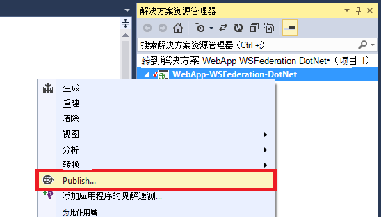

2. 选择**Microsoft Azure 应用程序服务**。
3. 如果您还没有登录到 Azure，单击**登录**并使用 Azure 订阅 Microsoft 帐户登录。
4. 登录之后，单击**新建**创建 web 应用程序。
5. 填写所有必填字段。 要连接到后端数据以后，因此，请不要创建此 web 应用程序的数据库。

    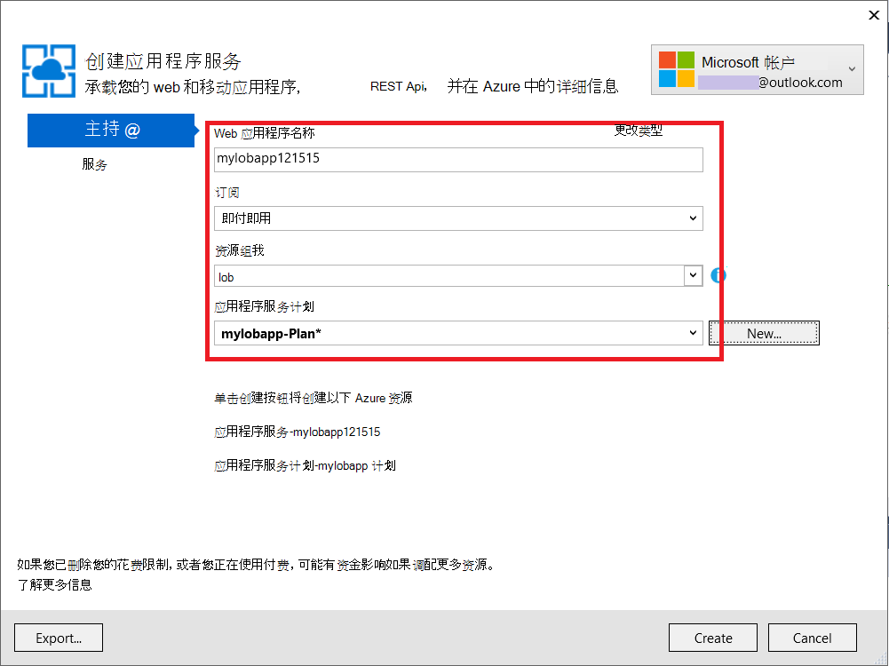

6. 单击**创建**。 创建 web 应用程序后，将打开发布站点对话框。
7. 在**目标 URL**，更改为**https**的**http** 。 将完整的 URL 复制到文本编辑器中以供将来使用。 然后，单击**发布**。

    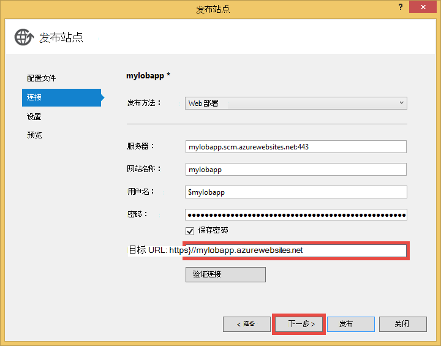

11. 在 Visual Studio，打开项目中的**Web.Release.config** 。 插入下面的 XML 到`<configuration>`标记，并使用发布 web 应用程序的 URL 替换项的值。  
    <pre class="prettyprint">
&lt;appSettings&gt;
   &lt;添加键 = 值"ida: RPIdentifier"="<mark>[如 https://mylobapp.azurewebsites.net/]</mark>"xdt:Transform ="SetAttributes"xdt:Locator="Match(key)"/&gt;
&lt;/appSettings&gt;</pre>

当您完成时，您有两个项目，在 Visual Studio 中，您调试环境和 Azure 中的已发布的 web 应用程序中配置的 RP 标识符。 将为每个 AD FS 中的两种环境设置 RP 信任。 在调试期间，使用 Web.config 中的应用程序设置使您使用 AD FS 的**调试**配置。 发布时 （默认情况下，**发布**配置发布），转换后的 Web.config 上载包含 Web.Release.config 中的应用程序设置更改。

如果您要附加到 Azure 中的已发布的 web 应用程序调试程序 （即必须上载的已发布的 web 应用程序中的代码的调试符号），您可以创建克隆的 Azure 调试，但使用自己自定义 Web.config 转换 (如 Web.AzureDebug.config)，使用从 Web.Release.config 的应用程序设置调试配置。 这使您可以跨不同的环境中维护一个静态配置。

## 配置信赖方信任 AD FS 管理 ##

现在，您需要配置在 AD FS 管理 RP 信任，然后才能使用示例应用程序和实际使用 AD FS 进行身份验证。 您将需要设置两个单独的 RP 信任、 调试环境和已发布的 web 应用程序。

> [AZURE.NOTE] 请确保您对您的环境的两个重复以下步骤。

4.  在 AD FS 服务器上，用具有管理权限的 AD FS 的凭据进行登录。
5.  打开 AD FS 管理。 用鼠标右键单击**AD FS\Trusted Relationships\Relying 方信任**并选择**添加信赖方信任**。

    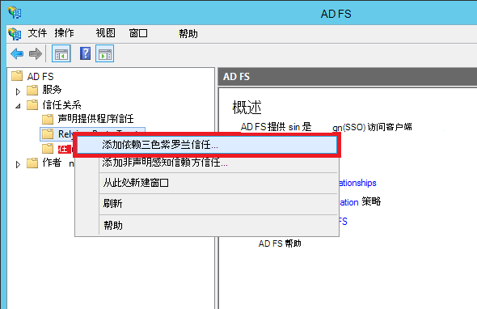

5.  在**选择数据源**页中，选择**手动输入数据依赖方有关**。 

    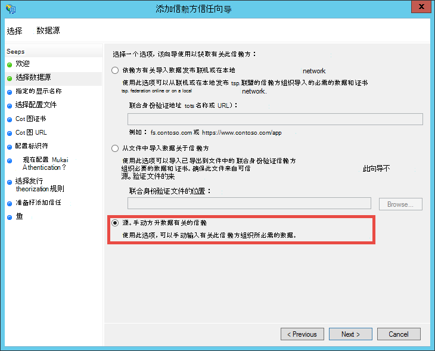

6.  在**指定显示名称**页上，键入显示名称应用程序并单击**下一步**。
7.  在**选择协议**页上，单击**下一步**。
8.  在**配置证书**页上，单击**下一步**。

    > [AZURE.NOTE] 您应使用 HTTPS 已，因为加密的标记是可选的。 如果您真的想要加密令牌从 AD FS 在此页上，您还必须在代码中添加令牌解密逻辑。 有关详细信息，请参阅[手动配置中间件 OWIN WS 联合身份验证并接受加密的令牌](http://chris.59north.com/post/2014/08/21/Manually-configuring-OWIN-WS-Federation-middleware-and-accepting-encrypted-tokens.aspx)。
  
5.  在移动到下一步之前，您将需要从 Visual Studio 项目一条信息。 在项目属性中，记下该应用程序的**SSL URL** 。 

    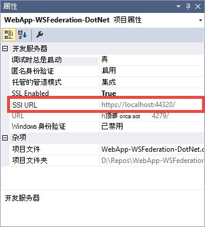

6.  在 AD FS 中的管理，**配置的 URL**页面**添加信赖方信任向导**中，选择**启用对 WS 联合身份验证被动协议的支持**和 SSL URL 中的您在上一步中记下的 Visual Studio 项目的类型。 然后，单击**下一步**。

    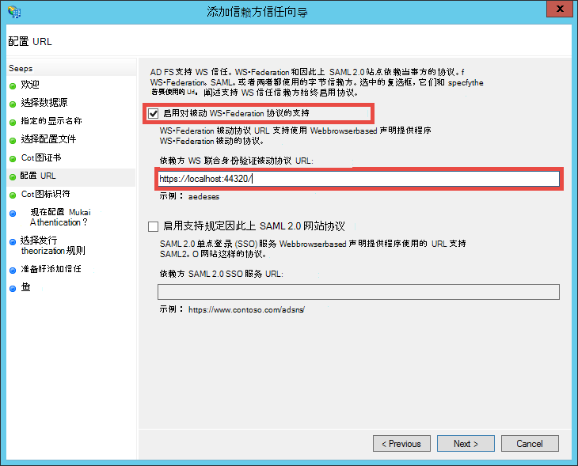

    > [AZURE.NOTE] URL 指定身份验证成功后发送客户端的位置。 对于调试环境中，它应为<code>https://localhost:&lt;port&gt;/</code>。 已发布的 web 应用程序，它应该是 web 应用程序 URL。

7.  在**配置标识符**页中，验证已列出了项目 SSL URL 并单击**下一步**。 单击**下一步**到了默认选择的向导的末尾。

    > [AZURE.NOTE] 在 Visual Studio 项目的 App_Start\Startup.Auth.cs，此标识符匹配的值<code>WsFederationAuthenticationOptions.Wtrealm</code>在联合身份验证过程。 默认情况下上, 一步中的应用程序的 URL 作为 RP 标识符。

8.  您现在已经完成在 AD FS 配置 RP 应用程序为您的项目。 接下来，您可以配置该应用程序发送应用程序所需的声明。 **编辑声明规则**对话框中，默认情况下为您打开向导的末尾以便您可以立即开始。 让我们至少配置 （使用括号中的架构） 的以下声明︰

    -   ASP.NET 用于 hydrate 的名称 (http://schemas.xmlsoap.org/ws/2005/05/identity/claims/name) 的`User.Identity.Name`。
    -   用户主要名称 (http://schemas.xmlsoap.org/ws/2005/05/identity/claims/upn)-用于唯一地标识了组织中的用户。
    -   组成员身份与角色 (http://schemas.microsoft.com/ws/2008/06/identity/claims/role)-可与`[Authorize(Roles="role1, role2,...")]`修饰授权控制器中的操作。 事实上，这种方法可能无法进行角色授权大多数性能。 如果 AD 用户属于数百个安全组，它们将成为数以百计的角色 SAML 令牌中的声明。 另一种方法是发送特定组中的单个角色声明有条件地根据用户的成员资格。 但是，我们将简单地为本教程。
    -   命名为 ID (http://schemas.xmlsoap.org/ws/2005/05/identity/claims/nameidentifier)-可用于防伪验证。 如何使其工作与防伪验证的详细信息，请参阅**添加行的业务功能**[创建行业务 Azure 应用程序使用 Azure Active Directory 验证](web-sites-dotnet-lob-application-azure-ad.md#bkmk_crud)明。

    > [AZURE.NOTE] 您需要为应用程序配置的索赔类型取决于应用程序的需要。 列表中支持的 Azure 活动目录应用程序 （即 RP 信任） 的索赔，例如，请参阅[支持令牌和声明类型](http://msdn.microsoft.com/library/azure/dn195587.aspx)。

8.  在编辑声明规则对话框中，单击**添加规则**。
9.  配置名称、 UPN 和角色声明如屏幕快照所示，单击**完成**。

    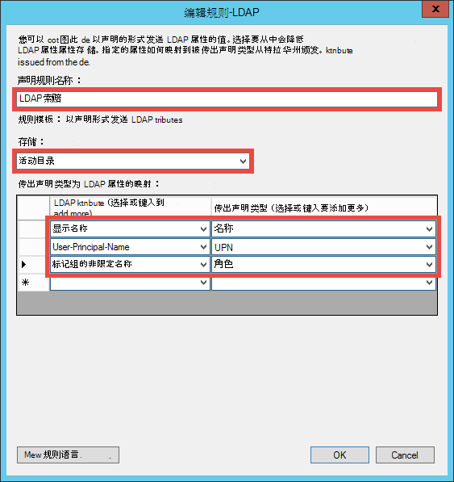

    接下来，创建瞬态名称标识声明使用[SAML 断言中的名称标识符](http://blogs.msdn.com/b/card/archive/2010/02/17/name-identifiers-in-saml-assertions.aspx)所示的步骤。

9.  再次单击**添加规则**。
10. 选择**发送索赔使用的自定义规则**，然后单击**下一步**。
11. 粘贴到**自定义规则**中的以下规则语言、 命名**每个会话标识符**的规则，然后单击**完成**。  
    <pre class="prettyprint">
    c1: [类型 = ="http://schemas.microsoft.com/ws/2008/06/identity/claims/windowsaccountname"] &amp; &amp; 
    c2: [类型 = ="http://schemas.microsoft.com/ws/2008/06/identity/claims/authenticationinstant"] = > 添加 (存储 ="_OpaqueIdStore"，类型 = ("<mark>http://contoso.com/internal/sessionid</mark>")、 查询 ="{0}; {1};{2};{3}。{4}"，参数 ="useEntropy"，参数 = c1。值、 参数 = c1。OriginalIssuer，参数 =""，参数 = c2。值）;
    </pre>

    此屏幕抓图应类似于您自定义的规则︰

    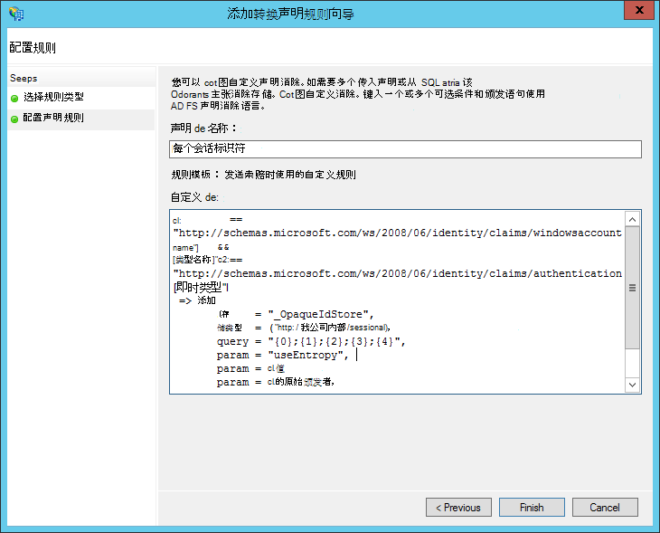

9.  再次单击**添加规则**。
10. 选择**转换传入声明**并单击**下一步**。
11. 配置规则 （使用您创建的自定义规则中声明类型） 的屏幕快照中所示，然后单击**完成**。

    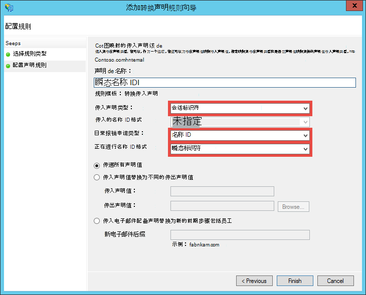

    对瞬态名称 ID 索赔执行的步骤的详细信息，请参阅[SAML 断言中的名称标识符](http://blogs.msdn.com/b/card/archive/2010/02/17/name-identifiers-in-saml-assertions.aspx)。

12. 在**编辑声明规则**对话框中单击**应用**。 它现在应类似下面的屏幕快照︰

    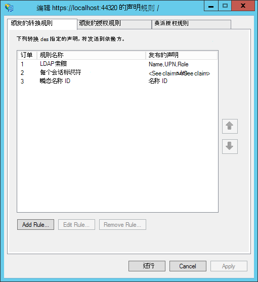

    > [AZURE.NOTE] 同样，请确保您对您的调试环境和已发布的 web 应用程序重复这些步骤。

## 测试您的应用程序联合身份验证

现在可以测试您的应用程序针对 AD FS 的身份验证逻辑。 在 AD FS 我实验室环境中，我有一个所属活动目录 (AD) 的测试组的测试用户。

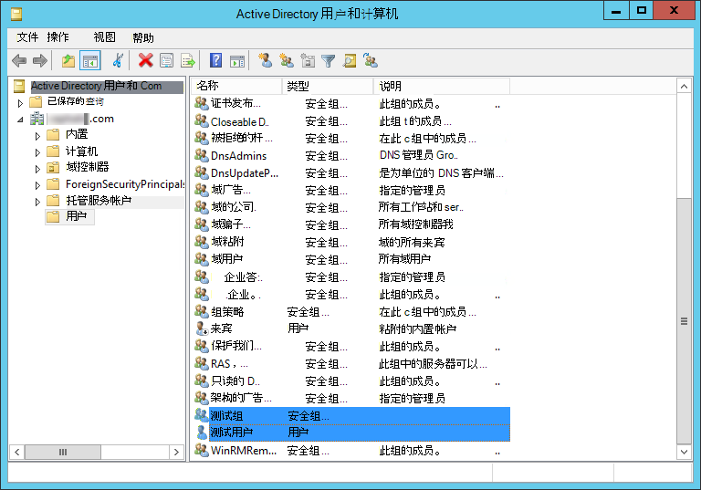

要在调试器中测试验证，所有您需要做现在是类型`F5`。 如果您想要测试已发布的 web 应用程序中的身份验证，浏览到的 URL。

在 web 应用程序加载后，单击**登录**。 现在应该有一个登录对话框或由 AD FS 中，具体取决于选择的 AD FS 的身份验证方法的登录页。 这是我所获得的 Internet Explorer 11 中。

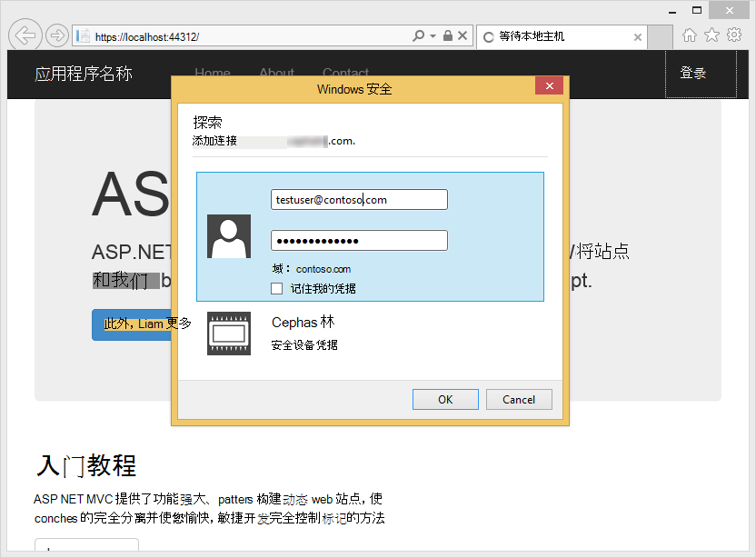

一旦使用 AD FS 部署的 AD 域中的用户登录时，您会立即看到再次与主页**Hello， <User Name>！** 角。 这是我所获得的信息。

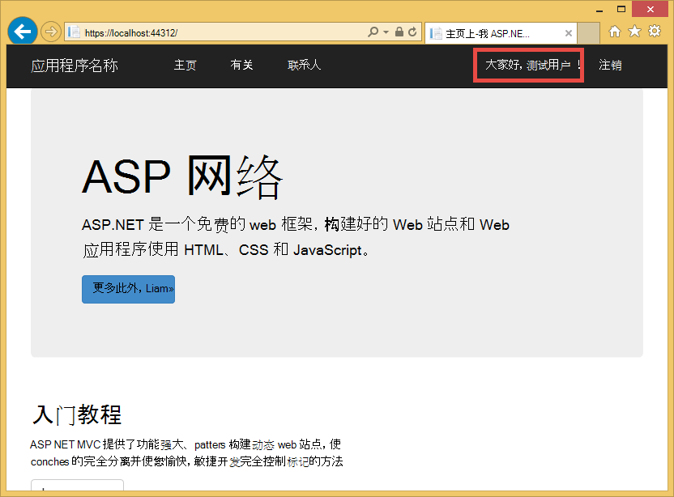

到目前为止，您已经成功在以下方面︰

- 您的应用程序已成功到达 AD FS 且 AD FS 数据库中找到了匹配的 RP 标识符
- AD FS 已成功验证 AD 用户和重定向回应用程序的主页
- 作为 AD FS 成功发送到您的应用程序名称声明 (http://schemas.xmlsoap.org/ws/2005/05/identity/claims/name) 由用户名称显示在角的事实。 

缺少名称声明时，您会看到**，Hello ！**。 如果您看一下 Views\Shared\_LoginPartial.cshtml，您将发现它使用`User.Identity.Name`来显示用户名。 如前所述，SAML 令牌中提供身份验证的用户的名称声明时，ASP.NET 将 hydrates 与此属性。 若要查看所有已发送的 AD FS 的声明，请在 Index 操作方法 Controllers\HomeController.cs，在放置一个断点。 对用户进行验证后，检查`System.Security.Claims.Current.Claims`集合。

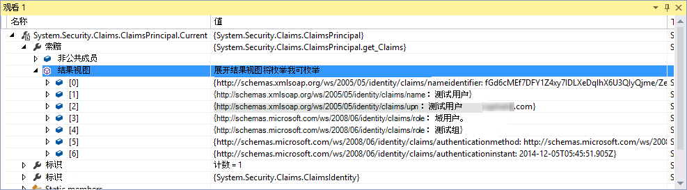 

## 授权用户使用特定的控制器或操作

由于您的 RP 信任配置中包含角色声明作为组成员身份，您现在可以使用它们直接在`[Authorize(Roles="...")]`控制器和操作的效果。 在创建读取更新删除 (CRUD) 模式与业务线应用程序，您可以授权特定的角色来访问每个操作。 现在，您将只是尝试在现有的家庭控制器上的此功能。

1. 打开 Controllers\HomeController.cs。
2. 修饰`About`和`Contact`操作方法类似于下面的代码使用安全组成员资格身份验证的用户拥有。  
    <pre class="prettyprint">
    <mark>[授权 (角色 ="测试组")]</mark>
    ActionResult About() 公共 {ViewBag.Message ="您应用程序描述页面。";

        return View();
    }

    <mark>[授权 (角色 ="域管理员")]</mark>
    ActionResult Contact() 公共 {ViewBag.Message ="您联系页面。";

        return View();
    }  </pre>

    因为我添加到**测试组**AD FS 实验室环境中**测试用户**，我将使用测试组来测试授权在`About`。 为`Contact`，需要测试**域管理员**、**测试用户**不属于负面案例。

3. 通过键入启动调试器`F5`并登录，然后单击**关于**。 您现在应该查看`~/About/Index`页成功，如果您已通过身份验证的用户被授权进行该操作。
4. 现在，单击**联系人**，这在我种情况下不应授权**测试用户**的操作。 但是，浏览器被重定向到 AD FS，最终显示此消息︰

    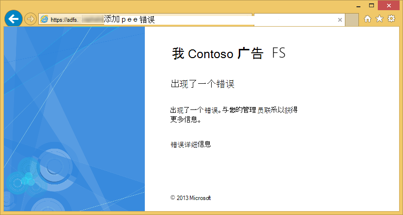

    如果研究 AD FS 服务器上的事件查看器中此错误时，您会看到此异常消息︰  
    <pre class="prettyprint">
   Microsoft.IdentityServer.Web.InvalidRequestException: MSIS7042:<mark>相同的客户端浏览器会话中的最后一次 '11' 秒进行 '6' 请求。</mark> 联系您的管理员联系获取详细信息。
   在 Microsoft.IdentityServer.Web.Protocols.PassiveProtocolHandler.UpdateLoopDetectionCookie （WrappedHttpListenerContext 上下文） 在 Microsoft.IdentityServer.Web.Protocols.WSFederation.WSFederationProtocolHandler.SendSignInResponse （WSFederationContext 上下文，MSISSignInResponse 响应） 在 Microsoft.IdentityServer.Web.PassiveProtocolListener.ProcessProtocolRequest （ProtocolContext protocolContext，PassiveProtocolHandler protocolHandler） 在 Microsoft.IdentityServer.Web.PassiveProtocolListener.OnGetContext （WrappedHttpListenerContext 上下文） </pre>

    导致此错误的原因是默认情况下，MVC 返回 401 未经授权时未被授权用户的角色。 这会触发重新进行身份验证请求的身份提供程序 (AD FS)。 由于用户已经过身份验证，AD FS 将返回到同一页，然后发出另一个 401，创建重定向循环。 您将重写 AuthorizeAttribute 的`HandleUnauthorizedRequest`方法具有简单的逻辑来显示内容而不是继续重定向循环的意义。

5. 名为 AuthorizeAttribute.cs，该项目中创建一个文件并将下面的代码粘贴到其中。

        using System;
        using System.Web.Mvc;
        using System.Web.Routing;
        
        namespace WebApp_WSFederation_DotNet
        {
            [AttributeUsage(AttributeTargets.Class | AttributeTargets.Method, Inherited = true, AllowMultiple = true)]
            public class AuthorizeAttribute : System.Web.Mvc.AuthorizeAttribute
            {
                protected override void HandleUnauthorizedRequest(AuthorizationContext filterContext)
                {
                    if (filterContext.HttpContext.Request.IsAuthenticated)
                    {
                        filterContext.Result = new System.Web.Mvc.HttpStatusCodeResult((int)System.Net.HttpStatusCode.Forbidden);
                    }
                    else
                    {
                        base.HandleUnauthorizedRequest(filterContext);
                    }
                }
            }
        }

    重写代码已经过身份验证，但未经授权的情况下发送 HTTP 403 （禁止） 而不是 HTTP 401 （未经授权）。

6. 使用调试器运行`F5`。 现在单击**联系人**显示 （尽管毫无吸引力） 更有意义的错误消息︰

    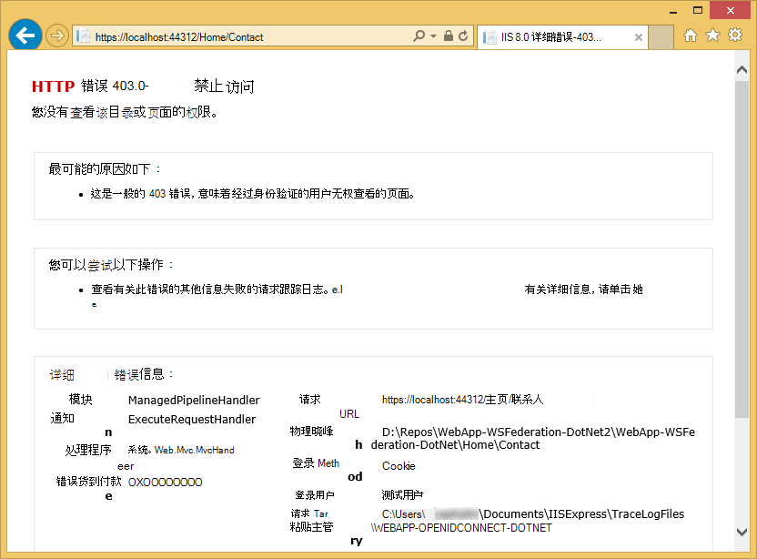

7. 发布到 Azure 应用程序服务 Web 应用程序的应用程序，然后测试实时应用程序的行为。

## 连接到本地数据

您想要实现的业务线应用程序而不是 Azure Active Directory 的 AD FS 的一个原因是与保持组织数据关闭后端法规遵从性问题。 这还可能意味着您在 Azure 中的 web 应用程序必须访问后端数据库，因为不允许您使用[SQL 数据库](/services/sql-database/)作为数据层 web 应用程序。

Azure 应用程序服务 Web 应用程序支持访问后端数据库有两种方法︰[混合连接](../biztalk-services/integration-hybrid-connection-overview.md)和[虚拟网络](web-sites-integrate-with-vnet.md)。 有关详细信息，请参阅[使用 VNET 集成和混合使用 Azure 应用程序服务 Web 应用程序的连接](https://azure.microsoft.com/blog/2014/10/30/using-vnet-or-hybrid-conn-with-websites/)。

## 其他资源

- [保护应用程序使用 SSL 和授权特性](web-sites-dotnet-deploy-aspnet-mvc-app-membership-oauth-sql-database.md#protect-the-application-with-ssl-and-the-authorize-attribute)
- [使用内部部署 Active Directory Azure 应用程序中进行身份验证](web-sites-authentication-authorization.md)
- [创建业务线的 Azure 应用程序采用 Azure Active Directory 验证](web-sites-dotnet-lob-application-azure-ad.md)
- [与在 Visual Studio 2013 ASP.NET 使用内部组织的身份验证选项 (ADF)](http://www.cloudidentity.com/blog/2014/02/12/use-the-on-premises-organizational-authentication-option-adfs-with-asp-net-in-visual-studio-2013/)
- [从 WIF 的 VS2013 Web 项目迁移到 Katana](http://www.cloudidentity.com/blog/2014/09/15/MIGRATE-A-VS2013-WEB-PROJECT-FROM-WIF-TO-KATANA/)
- [Active Directory 联合身份验证服务概述](http://technet.microsoft.com/library/hh831502.aspx)
- [WS 联合身份验证 1.1 规范](http://download.boulder.ibm.com/ibmdl/pub/software/dw/specs/ws-fed/WS-Federation-V1-1B.pdf?S_TACT=105AGX04&S_CMP=LP)

