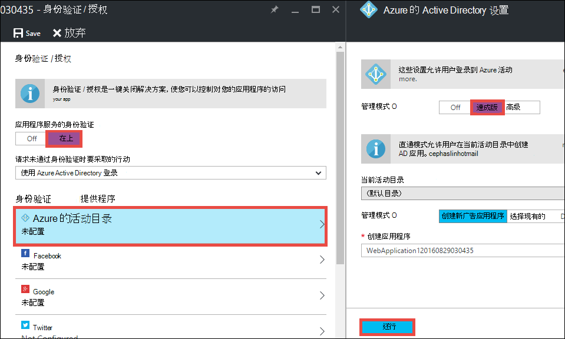
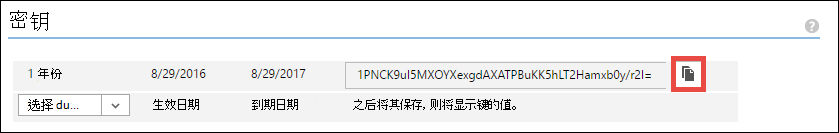

<properties 
    pageTitle="创建使用 Azure Active Directory 验证业务线的 Azure 应用程序 |Microsoft Azure" 
    description="了解如何在 Azure 应用程序服务来验证使用 Azure 活动目录中创建一个 ASP.NET MVC 的业务线应用程序" 
    services="app-service\web, active-directory" 
    documentationCenter=".net" 
    authors="cephalin" 
    manager="wpickett" 
    editor=""/>

<tags 
    ms.service="app-service-web" 
    ms.devlang="dotnet" 
    ms.topic="article" 
    ms.tgt_pltfrm="na" 
    ms.workload="web" 
    ms.date="09/01/2016" 
    ms.author="cephalin"/>

# 创建业务线的 Azure 应用程序采用 Azure Active Directory 验证 #

本文介绍如何创建在[Azure 应用程序服务 Web 应用程序](http://go.microsoft.com/fwlink/?LinkId=529714)中使用.NET 业务线应用程序[身份验证 / 授权](../app-service/app-service-authentication-overview.md)功能。 它还演示如何在应用程序中使用[Azure 活动目录图形 API](https://msdn.microsoft.com/Library/Azure/Ad/Graph/api/api-catalog)查询目录数据。

您使用 Azure Active Directory 租户可以只有 Azure 的目录。 或者，它可以[与您的内部部署 Active Directory 同步](../active-directory/active-directory-aadconnect.md)内部，也有远程的工作人员创建单一登录体验。 本文使用 Azure 帐户的默认目录。

## 您将生成 ##

您将生成应用程序服务 Web 应用程序中的简单业务线创建读取更新删除 (CRUD) 应用程序，跟踪的工作项具有以下功能︰

- 对 Azure Active Directory 中的用户进行身份验证
- 查询目录的用户和组使用[Azure 活动目录图形 API](http://msdn.microsoft.com/library/azure/hh974476.aspx)
- 使用*无身份验证*的 ASP.NET MVC 模板

如果您需要基于角色的访问控制 (RBAC) 在 Azure 中的业务线应用程序，请参阅[下一步](#next)。

## 您的需要 ##

[AZURE.INCLUDE [free-trial-note](../../includes/free-trial-note.md)]

若要完成本教程，您需要︰

- Azure Active Directory 租户使用不同的组中的用户
- 在 Azure Active Directory 租户上创建应用程序权限
- 4 或更高版本的 Visual Studio 2013年更新
- [Azure SDK 2.8.1 或更高版本](https://azure.microsoft.com/downloads/)

## 创建和部署到 Azure 的 web 应用程序 ##

1. 从 Visual Studio，单击**文件** > **New** > **项目**。

2. 选择**ASP.NET Web 应用程序**、 命名您的项目，并单击**确定**。

3. 选择**MVC**模板中，然后更改为**无身份验证**的身份验证。 确保选中了**在云环境中的主机**，单击**确定**。

    

4. 在**创建应用程序服务**对话框中，单击**添加帐户**（，然后在下拉列表中**添加一个帐户**） 登录到您的 Azure 帐户。

5. 一旦登录配置您的 web 应用程序。 通过单击相应的**新建**按钮创建资源组和新的应用程序服务计划。 单击**浏览其他 Azure 服务**以继续。

    

6. 在**服务**选项卡，单击**+**中添加 SQL 数据库用于您的应用程序。 

    

7. 在**配置 SQL 数据库**中，请单击**新建**以创建一个 SQL Server 实例。

8. 在**配置 SQL Server**配置您的 SQL Server 实例。 然后，单击**确定**、**确定**，并**创建**要甩掉 Azure 中的应用程序创建。

9. 在**Azure 应用程序服务活动**中，您可以查看应用程序创建过程完成时。 单击**发布&lt;*应用程序名*> 此 Web 应用程序现在**，请单击**发布 * *。 

    一旦完成 Visual Studio，它在浏览器中打开发布应用程序。 

    

## 配置身份验证和目录访问权限

1. 登录到[Azure 的门户](https://portal.azure.com)。

2. 从左侧的菜单中，单击**应用程序服务** > **&lt;*应用程序名*>** > **身份验证 / 授权 * *。

    

3. 通过**单击**打开 Azure Active Directory 身份验证 > **Azure Active Directory** > **表达** > **确定**。

    

4. 在命令栏中，单击**保存**。

    

    一旦身份验证设置已成功保存，请导航到您的应用程序在浏览器中再次。 您的默认设置来强制实施在整个应用程序的身份验证。 如果您没有已登录，系统会将您重定向到登录屏幕。 登录后，您将看到应用程序通过 HTTPS 安全。 接下来，您需要允许访问目录数据。 

5. 导航到[经典的门户](https://manage.windowsazure.com)。

6. 从左侧的菜单中，单击**活动目录** > **默认目录** > **应用程序** > **&lt;*应用程序名*> * *。

    

    这是 Azure Active Directory 应用程序为您创建的应用程序服务以启用授权 / 身份验证功能。

7. 单击**用户**和**组**，以确保目录中将某些用户和组。 如果不是，创建几个测试用户和组。

    

7. 单击**配置**来配置该应用程序。

8. 向下滚动到**密钥**部分中，通过选择一个持续时间添加一个项。 然后，单击**委派权限**，并选择**读取目录数据**。 单击**保存**。

    

8. 保存您的设置后, 向上滚动到**密钥**部分中，单击**复制**按钮以将客户端密钥复制。 

    

    >[AZURE.IMPORTANT] 如果现在离开此页面，将无法再访问此客户端注册表项。

9. 接下来，您需要配置您的 web 应用程序使用此密钥。 登录到使用 Azure 帐户[Azure 资源管理器](https://resources.azure.com)中。

10. 在页面的顶部，单击**读/写**在 Azure 资源管理器中进行更改。

    

11. 查找您在订阅的应用程序的身份验证设置 > * *&lt;*subscriptionname*>** > **resourceGroups** > **&lt;*resourcegroupname*>** > **提供商** > **Microsoft.Web** > **网站** > **&lt;*应用程序名*>** > **配置** > **authsettings * *。

12. 单击**编辑**。

    

13. 在编辑窗格中，设置`clientSecret`， `additionalLoginParams` ，如下所示的属性。

        ...
        "clientSecret": "<client key from the Azure Active Directory application>",
        ...
        "additionalLoginParams": ["response_type=code id_token", "resource=https://graph.windows.net"],
        ...

14. 在顶部以提交您的更改，请单击**放**。

    

14. 现在，以测试是否有授权令牌来访问 Azure 活动目录图形 API，只是定位到**https://&lt;*应用程序名*>.azurewebsites.net/.auth/me** 浏览器中的。 如果配置一切正常，您应该看到`access_token`在 JSON 响应中的属性。

    `~/.auth/me` URL 路径由应用程序服务的身份验证 / 授权向您提供所有的信息与您通过身份验证的会话。 有关详细信息，请参阅[身份验证和在 Azure 应用程序服务的授权](../app-service/app-service-authentication-overview.md)。

    >[AZURE.NOTE] `access_token`已过期期限。 但是，应用程序服务的身份验证 / 授权提供标记刷新功能进行`~/.auth/refresh`。 有关如何使用它的详细信息，请参阅    [应用服务令牌商店](https://cgillum.tech/2016/03/07/app-service-token-store/)。

接下来，您将执行一些有用的目录数据。

## 将业务线的功能添加到您的应用程序

现在，您将创建一个简单的 CRUD 工作项跟踪程序。  

5.  在 ~\Models 文件夹中，创建一个名为 WorkItem.cs 的类文件并替换`public class WorkItem {...}`用下面的代码︰

        using System.ComponentModel.DataAnnotations;

        public class WorkItem
        {
            [Key]
            public int ItemID { get; set; }
            public string AssignedToID { get; set; }
            public string AssignedToName { get; set; }
            public string Description { get; set; }
            public WorkItemStatus Status { get; set; }
        }

        public enum WorkItemStatus
        {
            Open,
            Investigating,
            Resolved,
            Closed
        }

7.  生成项目以在 Visual Studio 中进行新模型访问的基架逻辑。

8.  添加新的基架的项`WorkItemsController`到 ~\Controllers 文件夹 （**控制器**上单击鼠标右键，指向**添加**，并选择**新的基架的项**）。 

9.  选择**视图，使用实体框架与 MVC 5 控制器**并单击**添加**。

10. 选择模型，创建，然后单击**+**，然后**添加**要添加数据上下文，并单击**添加**。

    

14. 在 ~\Views\WorkItems\Create.cshtml （自动基架的项），发现`Html.BeginForm`帮助器方法，并进行以下突出显示的更改︰  
<pre class="prettyprint">
    @modelWebApplication1.Models.WorkItem

    @{ViewBag.Title =&quot;创建&quot;;}

    &lt;h2&gt;创建&lt;/h2&gt;

    @using(Html.BeginForm (<mark>&quot;创建&quot;，&quot;工作项目&quot;，FormMethod.Post，新 {id =&quot;主窗体&quot;}</mark>)){@Html.AntiForgeryToken()

        &lt;div class=&quot;form-horizontal&quot;&gt;
            &lt;h4&gt;WorkItem&lt;/h4&gt;
            &lt;hr /&gt;
            @Html.ValidationSummary(true, &quot;&quot;, new { @class = &quot;text-danger&quot; })
            &lt;div class=&quot;form-group&quot;&gt;
                @Html.LabelFor(model =&gt; model.AssignedToID, htmlAttributes: new { @class = &quot;control-label col-md-2&quot; })
                &lt;div class=&quot;col-md-10&quot;&gt;
                    @Html.EditorFor(model =&gt; model.AssignedToID, new { htmlAttributes = new { @class = &quot;form-control&quot;<mark>, @type = &quot;hidden&quot;</mark> } })
                    @Html.ValidationMessageFor(model =&gt; model.AssignedToID, &quot;&quot;, new { @class = &quot;text-danger&quot; })
                &lt;/div&gt;
            &lt;/div&gt;

            &lt;div class=&quot;form-group&quot;&gt;
                @Html.LabelFor(model =&gt; model.AssignedToName, htmlAttributes: new { @class = &quot;control-label col-md-2&quot; })
                &lt;div class=&quot;col-md-10&quot;&gt;
                    @Html.EditorFor(model =&gt; model.AssignedToName, new { htmlAttributes = new { @class = &quot;form-control&quot; } })
                    @Html.ValidationMessageFor(model =&gt; model.AssignedToName, &quot;&quot;, new { @class = &quot;text-danger&quot; })
                &lt;/div&gt;
            &lt;/div&gt;

            &lt;div class=&quot;form-group&quot;&gt;
                @Html.LabelFor(model =&gt; model.Description, htmlAttributes: new { @class = &quot;control-label col-md-2&quot; })
                &lt;div class=&quot;col-md-10&quot;&gt;
                    @Html.EditorFor(model =&gt; model.Description, new { htmlAttributes = new { @class = &quot;form-control&quot; } })
                    @Html.ValidationMessageFor(model =&gt; model.Description, &quot;&quot;, new { @class = &quot;text-danger&quot; })
                &lt;/div&gt;
            &lt;/div&gt;

            &lt;div class=&quot;form-group&quot;&gt;
                @Html.LabelFor(model =&gt; model.Status, htmlAttributes: new { @class = &quot;control-label col-md-2&quot; })
                &lt;div class=&quot;col-md-10&quot;&gt;
                    @Html.EnumDropDownListFor(model =&gt; model.Status, htmlAttributes: new { @class = &quot;form-control&quot; })
                    @Html.ValidationMessageFor(model =&gt; model.Status, &quot;&quot;, new { @class = &quot;text-danger&quot; })
                &lt;/div&gt;
            &lt;/div&gt;

            &lt;div class=&quot;form-group&quot;&gt;
                &lt;div class=&quot;col-md-offset-2 col-md-10&quot;&gt;
                    &lt;input type=&quot;submit&quot; value=&quot;Create&quot; class=&quot;btn btn-default&quot;<mark> id=&quot;submit-button&quot;</mark> /&gt;
                &lt;/div&gt;
            &lt;/div&gt;
        &lt;/div&gt;
    }

    &lt;div&gt;
    @Html.ActionLink(&quot;回列表&quot;，&quot;索引&quot;) &lt;/div    &gt;

    @section脚本 { @Scripts.Render( &quot;~/bundles/jqueryval&quot;)     <mark>&lt;脚本&gt;
     / / 个人/组选取器代码 var maxResultsPerPage = 14;        var 输入 = document.getElementById (&quot;AssignedToName&quot;);

            // Access token from request header, and tenantID from claims identity
            var token = &quot;@Request.Headers[&quot;X-MS-TOKEN-AAD-ACCESS-TOKEN&quot;]&quot;;
            var tenant =&quot;@(System.Security.Claims.ClaimsPrincipal.Current.Claims
                            .Where(c => c.Type == &quot;http://schemas.microsoft.com/identity/claims/tenantid&quot;)
                            .Select(c => c.Value).SingleOrDefault())&quot;;

            var picker = new AadPicker(maxResultsPerPage, input, token, tenant);

            // Submit the selected user/group to be asssigned.
            $(&quot;#submit-button&quot;).click({ picker: picker }, function () {
                if (!picker.Selected())
                    return;
                $(&quot;#main-form&quot;).get()[0].elements[&quot;AssignedToID&quot;].value = picker.Selected().objectId;
            });
        &lt;/script&gt;</mark>
    }
    </pre>
    
    请注意， `token` ，`tenant`所使用的`AadPicker`Azure 活动目录图形 API 调用的对象。 您将添加`AadPicker`以后。   
    
    >[AZURE.NOTE] 也很好，可以获得`token`和`tenant`从客户端与`~/.auth/me`，但这将是一个额外的服务器调用。 例如︰
    >  
    >     $.ajax({
    >         dataType: "json",
    >         url: "/.auth/me",
    >         success: function (data) {
    >             var token = data[0].access_token;
    >             var tenant = data[0].user_claims
    >                             .find(c => c.typ === 'http://schemas.microsoft.com/identity/claims/tenantid')
    >                             .val;
    >         }
    >     });
    
15. 进行相同的更改与 ~ \Views\WorkItems\Edit.cshtml。

15. `AadPicker`对象定义的脚本，您需要添加到项目中。 用鼠标右键单击 ~\Scripts 文件夹，指向**添加**，并单击**JavaScript 文件**。 类型`AadPickerLibrary`的文件名，然后单击**确定**。

16. 从[这里](https://raw.githubusercontent.com/cephalin/active-directory-dotnet-webapp-roleclaims/master/WebApp-RoleClaims-DotNet/Scripts/AadPickerLibrary.js)到复制内容 ~ \Scripts\AadPickerLibrary.js。

    在脚本中，`AadPicker`对象调用[Azure 活动目录图形 API](https://msdn.microsoft.com/Library/Azure/Ad/Graph/api/api-catalog)来搜索用户和组的匹配的输入。  

17. ~\Scripts\AadPickerLibrary.js 还使用[jQuery UI 记忆式键入功能构件](https://jqueryui.com/autocomplete/)。 因此，您需要向项目中添加 jQuery UI。 用鼠标右键单击您的项目中，然后单击**管理 NuGet 程序包**。

18. 在 NuGet 程序包管理器中，单击浏览，在搜索栏中，键入**jquery ui** ，单击**jQuery.UI.Combined**。

    

19. 在右窗格中，单击**安装**，然后单击**确定**以继续。

19. 打开 ~\App_Start\BundleConfig.cs，并进行以下突出显示的更改︰  
    <pre class="prettyprint">
    公共静态 void RegisterBundles(BundleCollection bundles) {捆绑包。添加 (新的 ScriptBundle (&quot;~/bundles/jquery&quot;)。包括 ( &quot;~/Scripts/jquery-{version}.js&quot;<mark>， &quot;~/Scripts/jquery-ui-{version}.js&quot;， &quot;~/Scripts/AadPickerLibrary.js&quot;</mark>));

        bundles.Add(new ScriptBundle(&quot;~/bundles/jqueryval&quot;).Include(
                    &quot;~/Scripts/jquery.validate*&quot;));

        // Use the development version of Modernizr to develop with and learn from. Then, when you&#39;re
        // ready for production, use the build tool at http://modernizr.com to pick only the tests you need.
        bundles.Add(new ScriptBundle(&quot;~/bundles/modernizr&quot;).Include(
                    &quot;~/Scripts/modernizr-*&quot;));

        bundles.Add(new ScriptBundle(&quot;~/bundles/bootstrap&quot;).Include(
                    &quot;~/Scripts/bootstrap.js&quot;,
                    &quot;~/Scripts/respond.js&quot;));

        bundles.Add(new StyleBundle(&quot;~/Content/css&quot;).Include(
                    &quot;~/Content/bootstrap.css&quot;,
                    &quot;~/Content/site.css&quot;<mark>,
                    &quot;~/Content/themes/base/jquery-ui.css&quot;</mark>));
    }
    </pre>

    有更多性能方法来管理您的应用程序中的 JavaScript 和 CSS 文件。 但是，为了简单起见做只打算搭载在每个视图中将加载包。

12. 最后，在 ~ \Global.asax，添加下面的代码行`Application_Start()`方法。 `Ctrl`+`.`若要修复此问题每个命名解析错误。

        AntiForgeryConfig.UniqueClaimTypeIdentifier = ClaimTypes.NameIdentifier;
    
    > [AZURE.NOTE] 您需要这行代码，因为默认的 MVC 模板使用<code>[ValidateAntiForgeryToken]</code>的一些操作上的修饰。 [一 Allen](https://twitter.com/BrockLAllen)在    [MVC 4、 AntiForgeryToken 和索赔](http://brockallen.com/2012/07/08/mvc-4-antiforgerytoken-and-claims/)所描述的行为由于 HTTP POST 可能因防伪标记验证失败︰

    > - Azure 的 Active Directory 不发送 http://schemas.microsoft.com/accesscontrolservice/2010/07/claims/identityprovider，这默认情况下所必需的防伪标记。
    > - 如果 Azure Active Directory 目录同步与 AD FS，AD FS 信任默认情况下不发送 http://schemas.microsoft.com/accesscontrolservice/2010/07/claims/identityprovider 声明，尽管您可以手动配置 AD FS 发送此声明。

    > `ClaimTypes.NameIdentifies`指定声明`http://schemas.xmlsoap.org/ws/2005/05/identity/claims/nameidentifier`，Azure Active Directory 确实能够提供的。  

20. 现在，发布您的更改。 右键单击项目，然后单击**发布**。

21. 单击**设置**，请确保您的 SQL 数据库的连接字符串，选择**更新数据库**以进行架构更改为您的型号，然后单击**发布**。

    

22. 在浏览器中，导航到 https://&lt;*应用程序名*>.azurewebsites.net/workitems 并单击**新建**。

23. 在**AssignedToName**框中单击。 从下拉列表中您 Azure Active Directory 租户现在应该看到用户和组。 您可以键入要筛选，或使用`Up`或`Down`键，或者单击以选择用户或组。 

    

24. 单击**创建**以保存所做的更改。 然后，创建的工作项，可观察的行为相同，单击**编辑**。

恭喜，您当前正在运行的业务线应用程序在 Azure 中具有目录访问权限 ！ 没有更多可以执行与图形 API。 请参阅[Azure 广告图形 API 参考](https://msdn.microsoft.com/library/azure/ad/graph/api/api-catalog)。

## 下一步

如果您需要基于角色的访问控制 (RBAC) 在 azure 中的业务线应用程序，请参阅[WebApp-RoleClaims-最低](https://github.com/Azure-Samples/active-directory-dotnet-webapp-roleclaims)Azure Active Directory 团队中的样本。 它演示如何启用角色为 Active Directory 的 Azure 应用程序，然后对用户和授权与`[Authorize]`修饰。

如果您的业务线应用程序需要访问内部数据，请参阅[访问内部资源使用 Azure 应用程序服务中的混合连接](web-sites-hybrid-connection-get-started.md)。

## 其他资源

- [身份验证和授权在 Azure 应用程序服务](../app-service/app-service-authentication-overview.md)
- [使用内部部署 Active Directory Azure 应用程序中进行身份验证](web-sites-authentication-authorization.md)
- [在 Azure 中的业务线应用程序创建 AD FS 身份验证](web-sites-dotnet-lob-application-adfs.md)
- [应用程序服务的身份验证和 Azure 广告图形 API](https://cgillum.tech/2016/03/25/app-service-auth-aad-graph-api/)
- [Microsoft Azure Active Directory 示例和文档](https://github.com/AzureADSamples)
- [Azure 的活动目录支持的标记和报销申请类型](http://msdn.microsoft.com/library/azure/dn195587.aspx)

[Protect the Application with SSL and the Authorize Attribute]: web-sites-dotnet-deploy-aspnet-mvc-app-membership-oauth-sql-database.md#protect-the-application-with-ssl-and-the-authorize-attribute
