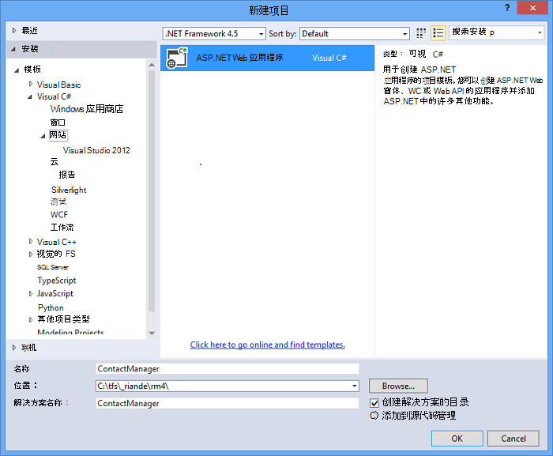
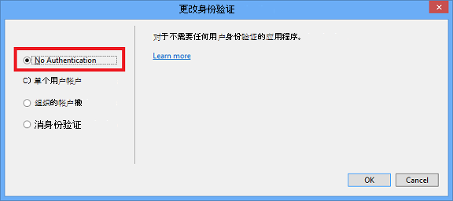
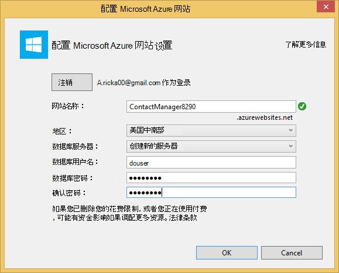
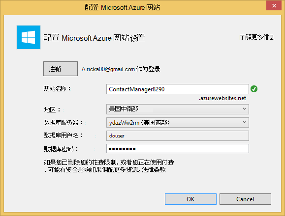
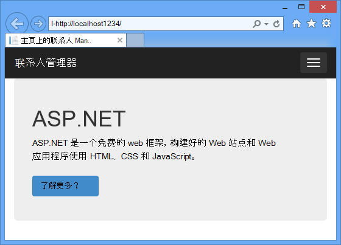
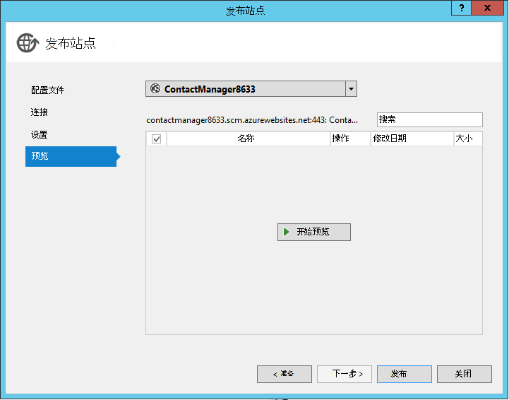
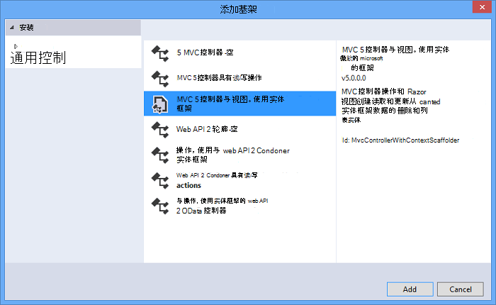
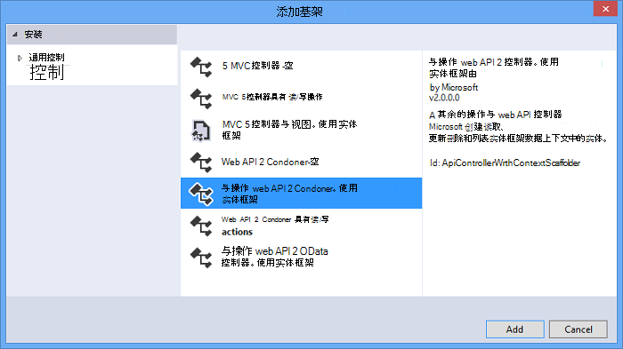
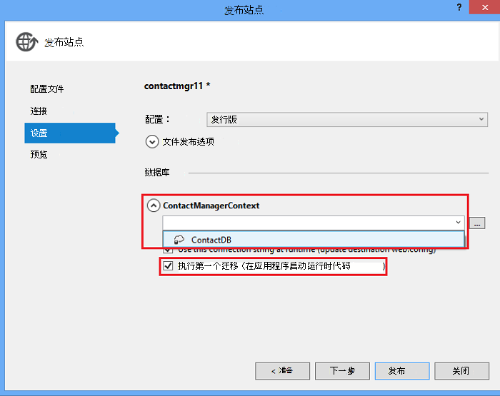

<properties 
    pageTitle="创建使用中 Azure 应用程序服务的 ASP.NET Web API 和 SQL 数据库的其余部分服务" 
    description="教您如何部署一个应用程序，通过使用 Visual Studio 中使用 ASP.NET Web API 对 Azure 的 web 应用程序的教程。" 
    services="app-service\web" 
    documentationCenter=".net" 
    authors="Rick-Anderson" 
    writer="Rick-Anderson" 
    manager="wpickett" 
    editor=""/>

<tags 
    ms.service="app-service-web" 
    ms.workload="web" 
    ms.tgt_pltfrm="na" 
    ms.devlang="dotnet" 
    ms.topic="article" 
    ms.date="02/29/2016" 
    ms.author="riande"/>

# 创建使用中 Azure 应用程序服务的 ASP.NET Web API 和 SQL 数据库的其余部分服务

本教程展示如何使用 Visual Studio 2013年或 Visual Studio 2013年版中的 Web 发布向导部署到[Azure 应用程序服务](http://go.microsoft.com/fwlink/?LinkId=529714)的 ASP.NET web 应用程序。 

您可以免费，打开 Azure 帐户并且 SDK 如果没有 Visual Studio 2013年，Web 快速的自动安装 Visual Studio 2013年。 因此可以开始免费为完全的 Azure 开发。

本教程假定您已经使用 Azure 没有经验。 在学完本教程，您将有了一个简单的 web 应用程序并在云中运行。
 
您将学习︰

* 通过安装 Azure SDK 启用 Azure 开发计算机的方式。
* 如何创建一个 Visual Studio ASP.NET MVC 5 项目并将其发布到 Azure 应用程序。
* 如何使用 ASP.NET Web API 以便 rest 风格的 API 调用。
* 若要使用 SQL 数据库在 Azure 存储数据的方式。
* 如何将应用程序更新发布到 Azure。

您将构建的简单的联系人列表 web 应用程序基于 ASP.NET MVC 5 和 ADO.NET 实体框架用于数据库访问。 下图显示了完整的应用程序︰

![网站的屏幕截图][intro001]

<!-- the next line produces the "Set up the development environment" section as see at http://azure.microsoft.com/documentation/articles/web-sites-dotnet-get-started/ -->
[AZURE.INCLUDE [create-account-and-websites-note](../../includes/create-account-and-websites-note.md)]

### 创建项目

1. 启动 Visual Studio 2013年。
1. 从**文件**菜单上单击**新建项目**。
3. 在**新建项目**对话框中，展开**C#**并选择**Web** ，然后选择**ASP.NET Web 应用程序**。 **ContactManager**的应用程序，然后单击**确定**。

    

1. 在**新的 ASP.NET 项目**对话框中，选择**MVC**模板，检查**Web API** ，然后单击**更改身份验证**。

1. 在**更改身份验证**对话框中，单击**无身份验证**，，然后单击**确定**。

    

    您正在创建示例应用程序不会有需要用户登录的功能。 有关如何实现身份验证和授权功能，本教程的结尾处看到的[后续步骤](#nextsteps)部分。 

1. 在**新的 ASP.NET 项目**对话框中，请确保选中了**在云环境中的主机**，单击**确定**。

如果您以前您尚未登录到 Azure，将提示您登录。

1. 配置向导会建议基于*ContactManager*的唯一名称 （请参见下图所示）。 选择离您最近的区域。 [Azurespeed.com](http://www.azurespeed.com/ "AzureSpeed.com")用于查找最低延迟数据中心。 
2. 如果还未创建之前数据库服务器，选择**创建新的服务器**中，输入数据库的用户名和密码。

    

如果您有数据库服务器，使用，以创建一个新数据库。 数据库服务器是一种宝贵资源，并且您通常希望在测试和开发，而不创建每个数据库数据库服务器的同一台服务器上创建多个数据库。 请确保您的网站和数据库位于同一个地区。

### 设置页眉和页脚

1. 在**解决方案资源管理器**中展开*Views\Shared*文件夹，并打开*_Layout.cshtml*文件。

    ![在解决方案资源管理器中的 _Layout.cshtml][newapp004]

1. *Views\Shared_Layout.cshtml*文件的内容替换为以下代码︰

        <!DOCTYPE html>
        <html lang="en">
        <head>
            <meta charset="utf-8" />
            <title>@ViewBag.Title - Contact Manager</title>
            <link href="~/favicon.ico" rel="shortcut icon" type="image/x-icon" />
            <meta name="viewport" content="width=device-width" />
            @Styles.Render("~/Content/css")
            @Scripts.Render("~/bundles/modernizr")
        </head>
        <body>
            <header>
                

                    

                        
@Html.ActionLink("Contact Manager", "Index", "Home")

                    

                

            </header>
            

                @RenderSection("featured", required: false)
                <section class="content-wrapper main-content clear-fix">
                    @RenderBody()
                </section>
            

            <footer>
                

                    

                        
&copy; @DateTime.Now.Year - Contact Manager

                    

                

            </footer>
            @Scripts.Render("~/bundles/jquery")
            @RenderSection("scripts", required: false)
        </body>
        </html>
            
上面的标记更改"联系人管理器"，从"我的 ASP.NET 应用程序"的应用程序名称，它将删除与**家庭**、**有关****联系人**的链接。

### 本地运行应用程序

1. 按 CTRL + F5 以运行应用程序。
在默认浏览器中将显示应用程序主页。
    

这是所有您需要做现在要创建的应用程序将部署到 Azure。 稍后您将添加数据库功能。

## 部署到 Azure 应用程序

1. 在 Visual Studio 中，用鼠标右键单击**解决方案资源管理器**中的项目并从上下文菜单中选择**发布**。

    ![发布在项目上下文菜单][PublishVSSolution]

    **Web 发布**向导将打开。

12. 单击**发布**。

Visual Studio 开始将文件复制到 Azure 服务器的过程。 **输出**窗口显示了何种部署操作，并报告成功完成部署。

14. 已部署的站点的 url 将自动打开默认浏览器。

    您创建的应用程序正在运行在云中。
    
    ![在 Azure 上运行的任务列表主页上][rxz2]

## 向应用程序中添加数据库

接下来，您将更新 MVC 应用程序中添加显示和更新联系人并在数据库中存储的数据的能力。 应用程序将使用实体框架创建数据库并以读取和更新数据库中的数据。

### 添加为联系人数据模型类

首先，您在代码中创建简单的数据模型。

1. 在**解决方案资源管理器**中用鼠标右键单击模型文件夹，请单击**添加**，然后**类**。

    ![在模型文件夹上下文菜单中添加类][adddb001]

2. 在**添加新项**对话框中，命名新的类文件*Contact.cs*，，然后单击**添加**。

    ![添加新项对话框][adddb002]

3. Contacts.cs 文件的内容替换为以下代码。

        using System.Globalization;
        namespace ContactManager.Models
        {
            public class Contact
            {
                public int ContactId { get; set; }
                public string Name { get; set; }
                public string Address { get; set; }
                public string City { get; set; }
                public string State { get; set; }
                public string Zip { get; set; }
                public string Email { get; set; }
                public string Twitter { get; set; }
                public string Self
                {
                    get { return string.Format(CultureInfo.CurrentCulture,
                         "api/contacts/{0}", this.ContactId); }
                    set { }
                }
            }
        }

**与**类定义将存储每个联系人，再加上一个主键，ContactID，所需的数据库的数据。 本教程的结尾处，可以在[接下来的步骤](#nextsteps)部分中获得有关数据模型的详细信息。

### 创建网页，使应用程序用户可以使用的联系人

ASP.NET MVC 基架功能可以自动生成代码来执行创建、 读取、 更新和删除 (CRUD) 操作。

## 添加的控制器和视图的数据

1. 在**解决方案资源管理器**中展开控制器文件夹。

3. 生成项目**(Ctrl + Shift + B)**。 （您必须生成项目，然后再使用基架机制。） 

4. 用鼠标右键单击控制器文件夹，并单击**添加**，然后单击**控制器**。

    ![在控制器文件夹上下文菜单添加控制器][addcode001]

1. 在**添加构架**对话框中，选择**使用视图，使用实体框架的 MVC 控制器**，单击**添加**。

 

6. 将该控制器的名称设置为**HomeController**。 作为您模型的类，请选择**联系人**。 单击**新的数据上下文**按钮，然后接受默认值"ContactManager.Models.ContactManagerContext"，**新的数据上下文类型**。 单击**添加**。

    一个对话框将提示您:"已存在具有该名称的文件 HomeController。 您想要替换它吗？"。 单击**是**。 我们，改写已创建新的项目与主控制器。 我们将使用新的主控制器进行我们的联系人名单。

    Visual Studio 创建控制器方法和**联系人**对象的 CRUD 数据库操作的视图。

## 启用迁移、 创建数据库、 添加示例数据和数据的初始值设定项 ##

下一步的任务是使[代码第一个迁移](http://curah.microsoft.com/55220)功能才能创建基于您创建的数据模型的数据库。

1. 在**工具**菜单中，选择**库程序包管理器**，然后**程序包管理器控制台**。

    ![在工具菜单中的程序包管理器控制台][addcode008]

2. 在**程序包管理器控制台**窗口中，输入以下命令︰

        enable-migrations 
  
    **启用迁移**命令创建*迁移*文件夹，而且它将放在该文件夹中的*Configuration.cs*文件，您可以编辑配置迁移。 

2. 在**程序包管理器控制台**窗口中，输入以下命令︰

        add-migration Initial

    **添加迁移初始**命令将生成一个类名为**&lt;date_stamp&gt;初始**用于创建数据库。 第一个参数 （*初始*） 是任意的并且用于创建该文件的名称。 您可以看到新的类文件，在**解决方案资源管理器**中。

    在**最初**的类中，**向上**方法创建联系人表中，并 （使用时您要返回到以前的状态）**下**方法除去它。

3. 打开*Migrations\Configuration.cs*文件。 

4. 添加以下命名空间。 

         using ContactManager.Models;

5. *种子*的方法替换为以下代码︰
        
        protected override void Seed(ContactManager.Models.ContactManagerContext context)
        {
            context.Contacts.AddOrUpdate(p => p.Name,
               new Contact
               {
                   Name = "Debra Garcia",
                   Address = "1234 Main St",
                   City = "Redmond",
                   State = "WA",
                   Zip = "10999",
                   Email = "debra@example.com",
                   Twitter = "debra_example"
               },
                new Contact
                {
                    Name = "Thorsten Weinrich",
                    Address = "5678 1st Ave W",
                    City = "Redmond",
                    State = "WA",
                    Zip = "10999",
                    Email = "thorsten@example.com",
                    Twitter = "thorsten_example"
                },
                new Contact
                {
                    Name = "Yuhong Li",
                    Address = "9012 State st",
                    City = "Redmond",
                    State = "WA",
                    Zip = "10999",
                    Email = "yuhong@example.com",
                    Twitter = "yuhong_example"
                },
                new Contact
                {
                    Name = "Jon Orton",
                    Address = "3456 Maple St",
                    City = "Redmond",
                    State = "WA",
                    Zip = "10999",
                    Email = "jon@example.com",
                    Twitter = "jon_example"
                },
                new Contact
                {
                    Name = "Diliana Alexieva-Bosseva",
                    Address = "7890 2nd Ave E",
                    City = "Redmond",
                    State = "WA",
                    Zip = "10999",
                    Email = "diliana@example.com",
                    Twitter = "diliana_example"
                }
                );
        }

    上面这段代码将初始化数据库提供联系信息。 种子设定数据库的详细信息，请参阅[调试实体框架 (EF) 数据库](http://blogs.msdn.com/b/rickandy/archive/2013/02/12/seeding-and-debugging-entity-framework-ef-dbs.aspx)。

1. 在**程序包管理器控制台**中输入命令︰

        update-database

    ![程序包管理器控制台命令][addcode009]

    **更新数据库**运行创建数据库的第一次迁移。 默认情况下，SQL Server Express LocalDB 数据库创建数据库。

1. 按 CTRL + F5 以运行应用程序。 

应用程序显示的种子数据，并提供编辑、 详细信息和删除链接。

![MVC 视图的数据][rxz3]

## 编辑视图

1. 打开*Views\Home\Index.cshtml*文件。 下一步，我们将与使用[jQuery](http://jquery.com/)和[Knockout.js](http://knockoutjs.com/)的代码替换生成的标记。 此新的代码从 web API 和 JSON 使用检索联系人列表中的，然后将联系人数据绑定到用户界面使用 knockout.js。 有关详细信息，请参见[后续步骤](#nextsteps)部分在本教程的结尾处 

2. 下面的代码替换该文件的内容。

        @model IEnumerable<ContactManager.Models.Contact>
        @{
            ViewBag.Title = "Home";
        }
        @section Scripts {
            @Scripts.Render("~/bundles/knockout")
            
        }
        <ul id="contacts" data-bind="foreach: contacts">
            <li class="ui-widget-content ui-corner-all">
                <h1 data-bind="text: Name" class="ui-widget-header"></h1>
                

                

                    ,
                    
                    
                

                

                
Email?

                

                
Twitter?

                
<a data-bind="attr: { href: Self }, click: $root.removeContact" class="removeContact ui-state-default ui-corner-all">Remove</a>

            </li>
        </ul>
        <form id="addContact" data-bind="submit: addContact">
            <fieldset>
                <legend>Add New Contact</legend>
                <ol>
                    <li>
                        <label for="Name">Name</label>
                        <input type="text" name="Name" />
                    </li>
                    <li>
                        <label for="Address">Address</label>
                        <input type="text" name="Address" >
                    </li>
                    <li>
                        <label for="City">City</label>
                        <input type="text" name="City" />
                    </li>
                    <li>
                        <label for="State">State</label>
                        <input type="text" name="State" />
                    </li>
                    <li>
                        <label for="Zip">Zip</label>
                        <input type="text" name="Zip" />
                    </li>
                    <li>
                        <label for="Email">E-mail</label>
                        <input type="text" name="Email" />
                    </li>
                    <li>
                        <label for="Twitter">Twitter</label>
                        <input type="text" name="Twitter" />
                    </li>
                </ol>
                <input type="submit" value="Add" />
            </fieldset>
        </form>

3. 用鼠标右键单击内容文件夹并单击**添加**，然后单击**新建项...**。

    ![内容文件夹上下文菜单中添加样式表][addcode005]

4. 在**添加新项**对话框中的右上右搜索框中输入**样式**，然后选择**样式表**。
    ![添加新项对话框][rxStyle]

5. 命名文件*Contacts.css* ，然后单击**添加**。 下面的代码替换该文件的内容。
    
        .column {
            float: left;
            width: 50%;
            padding: 0;
            margin: 5px 0;
        }
        form ol {
            list-style-type: none;
            padding: 0;
            margin: 0;
        }
        form li {
            padding: 1px;
            margin: 3px;
        }
        form input[type="text"] {
            width: 100%;
        }
        #addContact {
            width: 300px;
            float: left;
            width:30%;
        }
        #contacts {
            list-style-type: none;
            margin: 0;
            padding: 0;
            float:left;
            width: 70%;
        }
        #contacts li {
            margin: 3px 3px 3px 0;
            padding: 1px;
            float: left;
            width: 300px;
            text-align: center;
            background-image: none;
            background-color: #F5F5F5;
        }
        #contacts li h1
        {
            padding: 0;
            margin: 0;
            background-image: none;
            background-color: Orange;
            color: White;
            font-family: Trebuchet MS, Tahoma, Verdana, Arial, sans-serif;
        }
        .removeContact, .viewImage
        {
            padding: 3px;
            text-decoration: none;
        }

    我们将使用此样式表的版式、 颜色和联系人管理器应用程序中使用的样式。

6. 打开*App_Start\BundleConfig.cs*文件。

7. 添加以下代码以注册[挖空](http://knockoutjs.com/index.html "KO")插件。

        bundles.Add(new ScriptBundle("~/bundles/knockout").Include(
                    "~/Scripts/knockout-{version}.js"));
    本例使用挖空简化动态处理屏幕模板中的 JavaScript 代码。

8. 修改的内容/css 项注册*contacts.css*样式表。 更改以下行︰

                 bundles.Add(new StyleBundle("~/Content/css").Include(
                   "~/Content/bootstrap.css",
                   "~/Content/site.css"));
自：

        bundles.Add(new StyleBundle("~/Content/css").Include(
                   "~/Content/bootstrap.css",
                   "~/Content/contacts.css",
                   "~/Content/site.css"));

1. 在程序包管理器控制台上，运行以下命令以安装挖空。

        Install-Package knockoutjs

## 添加 Web API Restful 接口控制器

1. 在**解决方案资源管理器**中右键单击控制器，然后单击**添加**，然后选择**控制器...** 

1. 在**添加构架**对话框中，输入**Web API 2 控制器的操作，使用实体框架**，然后单击**添加**。

    

4. 在**添加控制器**对话框中，输入您的控制器名称"ContactsController"。 选择"联系人 (ContactManager.Models)"的**模型类**。  **数据上下文类**中保留默认值。 

6. 单击**添加**。

### 本地运行应用程序

1. 按 CTRL + F5 以运行应用程序。

    ![索引页][intro001]

2. 输入一个联系人，然后单击**添加**。 该应用程序返回到主页页面，并显示您输入的联系人。

    ![待办事项列表项的索引页][addwebapi004]

3. 在浏览器中，将追加到 URL 的**/api/contacts** 。

    所生成的 URL 将类似于 http://localhost:1234/api/联系人。 您添加的 rest 风格 web API 返回存储的联系人。 Firefox 和镶边将以 XML 格式显示数据。

    ![待办事项列表项的索引页][rxFFchrome]
    

    IE 将提示您打开或保存的联系人。

    ![Web API 保存对话框][addwebapi006]
    
    
    您可以在记事本或浏览器中打开返回的联系人。
    
    如移动网页或应用程序的另一个应用程序可使用此输出。

    ![Web API 保存对话框][addwebapi007]

    **安全警告**︰ 在此点上，您的应用程序是不安全和易受攻击︰ CSRF 攻击。 在本教程后面部分，我们将消除此漏洞。 详细信息请参阅[防止跨站点请求伪造 (: CSRF) 攻击][prevent-csrf-attacks]。
## 添加 XSRF 保护

跨站点请求伪造 （也称作 XSRF 或︰ CSRF） 是对恶意 web 站点，由此会影响客户端浏览器，该浏览器的受信任的网站之间的交互的 web 承载的应用程序的攻击。 因为 web 浏览器会自动随每个请求的身份验证令牌将发送到网站，这些攻击都成为可能。 规范的示例是一个身份验证 cookie，如 ASP。NET 的 Forms 身份验证票证。 但是，网站使用任何持久性身份验证机制 （如 Windows 身份验证，基本和等） 可以针对这些攻击。

XSRF 攻击是截然不同的网络钓鱼攻击。 网络钓鱼攻击需要干预的受害者。 在网络钓鱼攻击中，恶意的 web 站点将模仿目标网站，和受害者受骗向攻击者提供的敏感信息。 在 XSRF 的攻击，有通常是无交互从受害者的需要。 相反，攻击者要依赖浏览器会自动将所有相关的 cookie 发送到的目标网站。

有关详细信息，请参阅[打开的 Web 应用程序安全项目](https://www.owasp.org/index.php/Main_Page)(OWASP) [XSRF](https://www.owasp.org/index.php/Cross-Site_Request_Forgery_(CSRF))。

1. 在**解决方案资源管理器**中右**ContactManager**项目并单击**添加**，然后单击**类**。

2. 命名文件*ValidateHttpAntiForgeryTokenAttribute.cs* ，并添加以下代码︰

        using System;
        using System.Collections.Generic;
        using System.Linq;
        using System.Net;
        using System.Net.Http;
        using System.Web.Helpers;
        using System.Web.Http.Controllers;
        using System.Web.Http.Filters;
        using System.Web.Mvc;
        namespace ContactManager.Filters
        {
            public class ValidateHttpAntiForgeryTokenAttribute : AuthorizationFilterAttribute
            {
                public override void OnAuthorization(HttpActionContext actionContext)
                {
                    HttpRequestMessage request = actionContext.ControllerContext.Request;
                    try
                    {
                        if (IsAjaxRequest(request))
                        {
                            ValidateRequestHeader(request);
                        }
                        else
                        {
                            AntiForgery.Validate();
                        }
                    }
                    catch (HttpAntiForgeryException e)
                    {
                        actionContext.Response = request.CreateErrorResponse(HttpStatusCode.Forbidden, e);
                    }
                }
                private bool IsAjaxRequest(HttpRequestMessage request)
                {
                    IEnumerable<string> xRequestedWithHeaders;
                    if (request.Headers.TryGetValues("X-Requested-With", out xRequestedWithHeaders))
                    {
                        string headerValue = xRequestedWithHeaders.FirstOrDefault();
                        if (!String.IsNullOrEmpty(headerValue))
                        {
                            return String.Equals(headerValue, "XMLHttpRequest", StringComparison.OrdinalIgnoreCase);
                        }
                    }
                    return false;
                }
                private void ValidateRequestHeader(HttpRequestMessage request)
                {
                    string cookieToken = String.Empty;
                    string formToken = String.Empty;
                    IEnumerable<string> tokenHeaders;
                    if (request.Headers.TryGetValues("RequestVerificationToken", out tokenHeaders))
                    {
                        string tokenValue = tokenHeaders.FirstOrDefault();
                        if (!String.IsNullOrEmpty(tokenValue))
                        {
                            string[] tokens = tokenValue.Split(':');
                            if (tokens.Length == 2)
                            {
                                cookieToken = tokens[0].Trim();
                                formToken = tokens[1].Trim();
                            }
                        }
                    }
                    AntiForgery.Validate(cookieToken, formToken);
                }
            }
        }

1. 因此，您有权访问**[ValidateHttpAntiForgeryToken]**属性，下面的*using*语句添加到合同控制器。

        using ContactManager.Filters;

1. **[ValidateHttpAntiForgeryToken]**属性添加到**ContactsController**来防止 XSRF 威胁的 Post 方法。 将添加到"PutContact"、"PostContact"和**DeleteContact**操作方法。

        [ValidateHttpAntiForgeryToken]
            public IHttpActionResult PutContact(int id, Contact contact)
            {

1. 更新要包含代码来获取 XSRF 标记的*Views\Home\Index.cshtml*文件的*脚本*部分。

         @section Scripts {
            @Scripts.Render("~/bundles/knockout")
            
         }

## 将应用程序更新发布到 Azure 和 SQL 数据库

要发布的应用程序，请重复前面后面的过程。

1. 在**解决方案资源管理器**中右键单击项目并选择**发布**。

    ![发布][rxP]

5. 单击**设置**选项卡。
    

1. 在**ContactsManagerContext(ContactsManagerContext)**，请单击**v**图标可将*远程连接字符串*更改为联系人数据库的连接字符串。 单击**ContactDB**。

    

7. **执行代码第一个迁移 （在应用程序启动运行）**的复选框。

1. 单击**下一步**，然后单击**预览**。 Visual Studio 将显示将添加或更新的文件的列表。

8. 单击**发布**。
部署完成后，浏览器将打开的应用程序的主页上。

    ![没有联系人索引页][intro001]

    Visual Studio 将自动发布过程中部署的*Web.config*文件，以指向 SQL 数据库配置的连接字符串。 它还配置了代码的第一个迁移，自动将数据库升级到最新版本首次部署后的应用程序访问数据库。

    由于此配置，代码优先创建数据库之前创建的**初始**类中运行此代码。 这样做第一次应用程序尝试在部署后访问该数据库。

9. 就像当您运行该应用程序的本地检验数据库部署成功，请输入联系人。

当您看到您输入的项保存并显示在联系人管理器页上时，您就会知道，它已存储在数据库中。

![与联系人索引页][addwebapi004]

应用程序正在运行在云中，使用 SQL 数据库来存储其数据。 在 Azure 中测试该应用程序之后，请将其删除。 应用程序是公开的并没有一种机制来限制访问。

>[AZURE.NOTE] 如果您想要怎样的 Azure 帐户之前开始使用 Azure 应用程序服务，请转到[尝试应用程序服务](http://go.microsoft.com/fwlink/?LinkId=523751)，立即可以在此创建短期的初学者 web 应用程序在应用程序服务。 没有信用卡，所需;没有承诺。

## 下一步行动

实际的应用程序需要身份验证和授权，以及为此目的使用成员资格数据库。 本教程[将使用 OAuth、 成员资格和 SQL 数据库安全的 ASP.NET MVC 应用程序部署](web-sites-dotnet-deploy-aspnet-mvc-app-membership-oauth-sql-database.md)基于本教程和演示如何部署 web 应用程序的成员资格数据库。

在 Azure 应用程序中存储数据的另一种方法是使用 Azure 存储，它提供的非关系数据存储中的 blob 和表的形式。 下面的链接提供有关 Web API、 ASP.NET MVC 和窗口 Azure 详细信息。
 

* [使用 MVC 的实体框架入门][EFCodeFirstMVCTutorial]
* [ASP.NET MVC 5 简介](http://www.asp.net/mvc/tutorials/mvc-5/introduction/getting-started)
* [第一个 ASP.NET Web API](http://www.asp.net/web-api/overview/getting-started-with-aspnet-web-api/tutorial-your-first-web-api)
* [调试 WAWS](web-sites-dotnet-troubleshoot-visual-studio.md)

由[Rick Anderson](http://blogs.msdn.com/b/rickandy/)编写本教程和示例应用程序 (使用 Twitter， [@RickAndMSFT](https://twitter.com/RickAndMSFT)) 与 Tom Dykstra Barry Dorrans 的援助 (使用 Twitter， [@blowdart](https://twitter.com/blowdart))。 

请在您喜欢的内容或者您想要查看的离开反馈改进，不仅关于指南本身还包括有关的产品，它演示了。 您的反馈将帮助我们优先改进。 我们现在特别希望了解更多自动化进程的配置和部署成员资格数据库中没有多少兴趣。 

## 会发生什么变化
* 有关更改网站为应用程序服务的指南，请参阅︰ [Azure 应用程序服务，并对现有的 Azure 服务及其影响](http://go.microsoft.com/fwlink/?LinkId=529714)

<!-- bookmarks -->
[Add an OAuth Provider]: #addOauth
[Add Roles to the Membership Database]:#mbrDB
[Create a Data Deployment Script]:#ppd
[Update the Membership Database]:#ppd2
[setupdbenv]: #bkmk_setupdevenv
[setupwindowsazureenv]: #bkmk_setupwindowsazure
[createapplication]: #bkmk_createmvc4app
[deployapp1]: #bkmk_deploytowindowsazure1
[adddb]: #bkmk_addadatabase
[addcontroller]: #bkmk_addcontroller
[addwebapi]: #bkmk_addwebapi
[deploy2]: #bkmk_deploydatabaseupdate

<!-- links -->
[EFCodeFirstMVCTutorial]: http://www.asp.net/mvc/tutorials/getting-started-with-ef-using-mvc/creating-an-entity-framework-data-model-for-an-asp-net-mvc-application
[dbcontext-link]: http://msdn.microsoft.com/library/system.data.entity.dbcontext(v=VS.103).aspx

<!-- images-->
[rxE]: ./media/web-sites-dotnet-rest-service-aspnet-api-sql-database/rxE.png
[rxP]: ./media/web-sites-dotnet-rest-service-aspnet-api-sql-database/rxP.png
[rx22]: ./media/web-sites-dotnet-rest-service-aspnet-api-sql-database/
[rxb2]: ./media/web-sites-dotnet-rest-service-aspnet-api-sql-database/rxb2.png
[rxz]: ./media/web-sites-dotnet-rest-service-aspnet-api-sql-database/rxz.png
[rxzz]: ./media/web-sites-dotnet-rest-service-aspnet-api-sql-database/rxzz.png
[rxz2]: ./media/web-sites-dotnet-rest-service-aspnet-api-sql-database/rxz2.png
[rxz3]: ./media/web-sites-dotnet-rest-service-aspnet-api-sql-database/rxz3.png
[rxStyle]: ./media/web-sites-dotnet-rest-service-aspnet-api-sql-database/rxStyle.png
[rxz4]: ./media/web-sites-dotnet-rest-service-aspnet-api-sql-database/rxz4.png
[rxz44]: ./media/web-sites-dotnet-rest-service-aspnet-api-sql-database/rxz44.png
[rxNewCtx]: ./media/web-sites-dotnet-rest-service-aspnet-api-sql-database/rxNewCtx.png
[rxPrevDB]: ./media/web-sites-dotnet-rest-service-aspnet-api-sql-database/rxPrevDB.png
[rxOverwrite]: ./media/web-sites-dotnet-rest-service-aspnet-api-sql-database/rxOverwrite.png
[rxPWS]: ./media/web-sites-dotnet-rest-service-aspnet-api-sql-database/rxPWS.png
[rxNewCtx]: ./media/web-sites-dotnet-rest-service-aspnet-api-sql-database/rxNewCtx.png
[rxAddApiController]: ./media/web-sites-dotnet-rest-service-aspnet-api-sql-database/rxAddApiController.png
[rxFFchrome]: ./media/web-sites-dotnet-rest-service-aspnet-api-sql-database/rxFFchrome.png
[intro001]: ./media/web-sites-dotnet-rest-service-aspnet-api-sql-database/dntutmobil-intro-finished-web-app.png
[rxCreateWSwithDB]: ./media/web-sites-dotnet-rest-service-aspnet-api-sql-database/rxCreateWSwithDB.png
[setup007]: ./media/web-sites-dotnet-rest-service-aspnet-api-sql-database/dntutmobile-setup-azure-site-004.png
[setup009]: ../Media/dntutmobile-setup-azure-site-006.png
[newapp002]: ./media/web-sites-dotnet-rest-service-aspnet-api-sql-database/dntutmobile-createapp-002.png
[newapp004]: ./media/web-sites-dotnet-rest-service-aspnet-api-sql-database/dntutmobile-createapp-004.png
[firsdeploy007]: ./media/web-sites-dotnet-rest-service-aspnet-api-sql-database/dntutmobile-deploy1-publish-005.png
[firsdeploy009]: ./media/web-sites-dotnet-rest-service-aspnet-api-sql-database/dntutmobile-deploy1-publish-007.png
[adddb001]: ./media/web-sites-dotnet-rest-service-aspnet-api-sql-database/dntutmobile-adddatabase-001.png
[adddb002]: ./media/web-sites-dotnet-rest-service-aspnet-api-sql-database/dntutmobile-adddatabase-002.png
[addcode001]: ./media/web-sites-dotnet-rest-service-aspnet-api-sql-database/dntutmobile-controller-add-context-menu.png
[addcode002]: ./media/web-sites-dotnet-rest-service-aspnet-api-sql-database/dntutmobile-controller-add-controller-dialog.png
[addcode004]: ./media/web-sites-dotnet-rest-service-aspnet-api-sql-database/dntutmobile-controller-modify-index-context.png
[addcode005]: ./media/web-sites-dotnet-rest-service-aspnet-api-sql-database/dntutmobile-controller-add-contents-context-menu.png
[addcode007]: ./media/web-sites-dotnet-rest-service-aspnet-api-sql-database/dntutmobile-controller-modify-bundleconfig-context.png
[addcode008]: ./media/web-sites-dotnet-rest-service-aspnet-api-sql-database/dntutmobile-migrations-package-manager-menu.png
[addcode009]: ./media/web-sites-dotnet-rest-service-aspnet-api-sql-database/dntutmobile-migrations-package-manager-console.png
[addwebapi004]: ./media/web-sites-dotnet-rest-service-aspnet-api-sql-database/dntutmobile-webapi-added-contact.png
[addwebapi006]: ./media/web-sites-dotnet-rest-service-aspnet-api-sql-database/dntutmobile-webapi-save-returned-contacts.png
[addwebapi007]: ./media/web-sites-dotnet-rest-service-aspnet-api-sql-database/dntutmobile-webapi-contacts-in-notepad.png
[Add XSRF Protection]: #xsrf
[WebPIAzureSdk20NetVS12]: ./media/web-sites-dotnet-rest-service-aspnet-api-sql-database/WebPIAzureSdk20NetVS12.png
[Add XSRF Protection]: #xsrf
[ImportPublishSettings]: ./media/web-sites-dotnet-rest-service-aspnet-api-sql-database/ImportPublishSettings.png
[ImportPublishProfile]: ./media/web-sites-dotnet-rest-service-aspnet-api-sql-database/ImportPublishProfile.png
[PublishVSSolution]: ./media/web-sites-dotnet-rest-service-aspnet-api-sql-database/PublishVSSolution.png
[ValidateConnection]: ./media/web-sites-dotnet-rest-service-aspnet-api-sql-database/ValidateConnection.png
[WebPIAzureSdk20NetVS12]: ./media/web-sites-dotnet-rest-service-aspnet-api-sql-database/WebPIAzureSdk20NetVS12.png
[prevent-csrf-attacks]: http://www.asp.net/web-api/overview/security/preventing-cross-site-request-forgery-(csrf)-attacks
 
