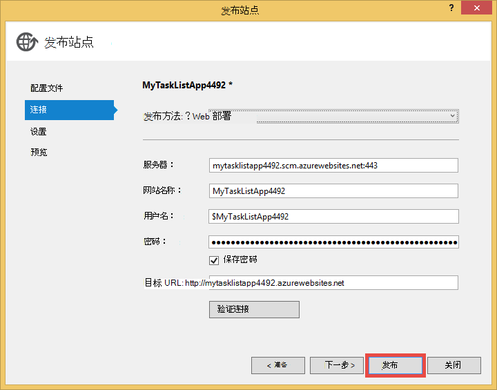

<properties 
    pageTitle="在连接到虚拟机上运行的 MongoDB 的 Azure 中创建 web 应用程序" 
    description="教程，教您如何使用 Git 将 ASP.NET 应用程序部署到 Azure 应用程序服务，连接到 MongoDB Azure 虚拟机上。"
    tags="azure-portal" 
    services="app-service\web, virtual-machines" 
    documentationCenter=".net" 
    authors="cephalin" 
    manager="wpickett" 
    editor=""/>

<tags 
    ms.service="app-service-web" 
    ms.workload="web" 
    ms.tgt_pltfrm="na" 
    ms.devlang="dotnet" 
    ms.topic="article" 
    ms.date="02/29/2016" 
    ms.author="cephalin"/>

# 在连接到虚拟机上运行的 MongoDB 的 Azure 中创建 web 应用程序

使用 Git，您可以部署到 Azure 应用程序服务 Web 应用程序的 ASP.NET 应用程序。 在本教程中，您将生成简单的前端 ASP.NET MVC 任务列表应用程序连接到 Azure 中的虚拟机上运行的 MongoDB 数据库。  [MongoDB] [MongoDB]是一种流行的开源、 高性能 NoSQL 数据库。 运行并测试 ASP.NET 应用程序在开发计算机上的后, 将上载应用程序到应用程序服务 Web 应用程序使用 Git。

>[AZURE.NOTE] 如果您想要怎样的 Azure 帐户之前开始使用 Azure 应用程序服务，请转到[尝试应用程序服务](http://go.microsoft.com/fwlink/?LinkId=523751)，立即可以在此创建短期的初学者 web 应用程序在应用程序服务。 没有信用卡，所需;没有承诺。

## 背景知识 ##

对于本教程，但是不需要下面的知识非常有用︰

* C# MongoDB 的驱动程序。 开发针对 MongoDB C# 应用程序的详细信息，请参阅 MongoDB [CSharp 语言中心][MongoC#LangCenter]。 
* ASP.NET web 应用程序框架。 您可以了解关于它在[ASP.net 网站][ASP.NET]。
* ASP.NET MVC web 应用程序框架。 您可以了解关于它在[ASP.NET MVC 网站][MVCWebSite]。
* Azure。 可以开始阅读[Azure]的[WindowsAzure]。

## 系统必备组件 ##

- [Visual Studio 直通 2013年网站] [VSEWeb]或[Visual Studio 2013年] [VSUlt]
- [使.NET 的 azure SDK](http://go.microsoft.com/fwlink/p/?linkid=323510&clcid=0x409)
- 有效的 Microsoft Azure 订阅

[AZURE.INCLUDE [create-account-and-websites-note](../../includes/create-account-and-websites-note.md)]

 
## 创建虚拟机并安装 MongoDB ##

本教程假设您已在 Azure 中创建虚拟机。 创建虚拟机后，您需要在虚拟机上安装 MongoDB:

* 若要创建 Windows 虚拟机并安装 MongoDB，请参阅[运行 Windows Azure 中的虚拟机上安装 MongoDB][InstallMongoOnWindowsVM]。

您在 Azure 中创建虚拟机并安装 MongoDB 后，一定要记住 MongoDB 中该终结点指定为虚拟机 ("testlinuxvm.cloudapp.net"，例如) 和外部端口的 DNS 名称。  您将需要此信息在本教程后面部分。

## 创建应用程序 ##

本部分中您将创建 ASP.NET 应用程序通过使用 Visual Studio 中称为"我的任务列表"并执行初始部署到 Azure 应用程序服务 Web 应用程序。 将本地运行应用程序，但它将连接到您的虚拟机在 Azure 上，那里使用 MongoDB 实例创建。

1. 在 Visual Studio 中，单击**新建项目**。

    ![开始页新项目][StartPageNewProject]

1. 在**新建项目**窗口中，在左窗格中，选择**C#**，然后选择**Web**。 在中间窗格中，选择**ASP.NET Web 应用程序**。 在底部，命名为"MyTaskListApp，"您的项目，然后单击**确定**。

    ![新建项目对话框][NewProjectMyTaskListApp]

1. **新的 ASP.NET 项目**的对话框中，在**MVC**中，选择，然后单击**确定**。

    ![选择 MVC 模板][VS2013SelectMVCTemplate]

1. 如果您不已经注册到 Microsoft Azure，将提示您登录。 按照提示登录到 Azure。
2. 一旦您登录，您可以开始配置您的应用程序服务 web 应用程序。 指定**Web 应用程序名称**、**应用程序服务计划**、**资源组**中，和**区域**，然后单击**创建**。

    

1. 在项目后创建完成，等待**Azure 服务活动应用程序**窗口中所示在 Azure 应用程序服务中创建 web 应用程序。 然后，单击**到现在这个 Web 应用程序发布 MyTaskListApp**。

1. 单击**发布**。

    

    一旦您默认的 ASP.NET 应用程序发布到 Azure 应用程序服务 Web 应用程序，它将在浏览器中启动。

## MongoDB C# 驱动程序安装

MongoDB 提供 C# 驱动程序，您需要在本地开发计算机上安装应用程序的客户端支持。 NuGet 出现 C# 驱动程序。

若要安装 MongoDB C# 驱动程序︰

1. 在**解决方案资源管理器**中右击**MyTaskListApp**项目，然后选择**管理 NuGetPackages**。

    ![管理 NuGet 程序包][VS2013ManageNuGetPackages]

2. 在**管理 NuGet 程序包**窗口的左窗格中单击**联机**。 在右侧的**联机搜索**框中，键入"mongodb.driver"。  请单击**安装**来安装驱动程序。

    ![搜索 MongoDB 的 C# 驱动程序][SearchforMongoDBCSharpDriver]

3. 单击**我接受**接受 10gen，inc.保留所有权利许可条款。

4. 已安装驱动程序后，请单击**关闭**。
    ![MongoDB C# 驱动程序安装][MongoDBCsharpDriverInstalled]

现在安装了 MongoDB C# 驱动程序。  对**MongoDB.Bson**、 **MongoDB.Driver**和**MongoDB.Driver.Core**库的引用已添加到该项目。

![MongoDB C# 驱动程序引用][MongoDBCSharpDriverReferences]

## 添加模型 ##
在**解决方案资源管理器**中用鼠标右键单击*模型*文件夹并**添加**一个新**类**并将其命名为*TaskModel.cs*。  在*TaskModel.cs*中，用下面的代码替换现有代码︰

    using System;
    using System.Collections.Generic;
    using System.Linq;
    using System.Web;
    using MongoDB.Bson.Serialization.Attributes;
    using MongoDB.Bson.Serialization.IdGenerators;
    using MongoDB.Bson;
    
    namespace MyTaskListApp.Models
    {
        public class MyTask
        {
            [BsonId(IdGenerator = typeof(CombGuidGenerator))]
            public Guid Id { get; set; }
    
            [BsonElement("Name")]
            public string Name { get; set; }
    
            [BsonElement("Category")]
            public string Category { get; set; }
    
            [BsonElement("Date")]
            public DateTime Date { get; set; }
    
            [BsonElement("CreatedDate")]
            public DateTime CreatedDate { get; set; }
    
        }
    }

## 添加数据访问层 ##
在**解决方案资源管理器**中右击*MyTaskListApp*项目并**添加**一个名为*DAL*的**新文件夹**。  用鼠标右键单击*DAL*文件夹并**添加**一个新**类**。 *Dal.cs*的类文件的名称。  在*Dal.cs*中，用下面的代码替换现有代码︰

    using System;
    using System.Collections.Generic;
    using System.Linq;
    using System.Web;
    using MyTaskListApp.Models;
    using MongoDB.Driver;
    using MongoDB.Bson;
    using System.Configuration;
    
    
    namespace MyTaskListApp
    {
        public class Dal : IDisposable
        {
            private MongoServer mongoServer = null;
            private bool disposed = false;
    
            // To do: update the connection string with the DNS name
            // or IP address of your server. 
            //For example, "mongodb://testlinux.cloudapp.net"
            private string connectionString = "mongodb://mongodbsrv20151211.cloudapp.net";
    
            // This sample uses a database named "Tasks" and a 
            //collection named "TasksList".  The database and collection 
            //will be automatically created if they don't already exist.
            private string dbName = "Tasks";
            private string collectionName = "TasksList";
    
            // Default constructor.        
            public Dal()
            {
            }
    
            // Gets all Task items from the MongoDB server.        
            public List<MyTask> GetAllTasks()
            {
                try
                {
                    var collection = GetTasksCollection();
                    return collection.Find(new BsonDocument()).ToList();
                }
                catch (MongoConnectionException)
                {
                    return new List<MyTask>();
                }
            }
    
            // Creates a Task and inserts it into the collection in MongoDB.
            public void CreateTask(MyTask task)
            {
                var collection = GetTasksCollectionForEdit();
                try
                {
                    collection.InsertOne(task);
                }
                catch (MongoCommandException ex)
                {
                    string msg = ex.Message;
                }
            }
    
            private IMongoCollection<MyTask> GetTasksCollection()
            {
                MongoClient client = new MongoClient(connectionString);
                var database = client.GetDatabase(dbName);
                var todoTaskCollection = database.GetCollection<MyTask>(collectionName);
                return todoTaskCollection;
            }
    
            private IMongoCollection<MyTask> GetTasksCollectionForEdit()
            {
                MongoClient client = new MongoClient(connectionString);
                var database = client.GetDatabase(dbName);
                var todoTaskCollection = database.GetCollection<MyTask>(collectionName);
                return todoTaskCollection;
            }
    
            # region IDisposable
    
            public void Dispose()
            {
                this.Dispose(true);
                GC.SuppressFinalize(this);
            }
    
            protected virtual void Dispose(bool disposing)
            {
                if (!this.disposed)
                {
                    if (disposing)
                    {
                        if (mongoServer != null)
                        {
                            this.mongoServer.Disconnect();
                        }
                    }
                }
    
                this.disposed = true;
            }
    
            # endregion
        }
    }

## 添加控制器 ##
在**解决方案资源管理器**中打开*Controllers\HomeController.cs*文件，用以下内容替换现有的代码︰

    using System;
    using System.Collections.Generic;
    using System.Linq;
    using System.Web;
    using System.Web.Mvc;
    using MyTaskListApp.Models;
    using System.Configuration;
    
    namespace MyTaskListApp.Controllers
    {
        public class HomeController : Controller, IDisposable
        {
            private Dal dal = new Dal();
            private bool disposed = false;
            //
            // GET: /MyTask/
    
            public ActionResult Index()
            {
                return View(dal.GetAllTasks());
            }
    
            //
            // GET: /MyTask/Create
    
            public ActionResult Create()
            {
                return View();
            }
    
            //
            // POST: /MyTask/Create
    
            [HttpPost]
            public ActionResult Create(MyTask task)
            {
                try
                {
                    dal.CreateTask(task);
                    return RedirectToAction("Index");
                }
                catch
                {
                    return View();
                }
            }
    
            public ActionResult About()
            {
                return View();
            }
    
            # region IDisposable
    
            new protected void Dispose()
            {
                this.Dispose(true);
                GC.SuppressFinalize(this);
            }
    
            new protected virtual void Dispose(bool disposing)
            {
                if (!this.disposed)
                {
                    if (disposing)
                    {
                        this.dal.Dispose();
                    }
                }
    
                this.disposed = true;
            }
    
            # endregion
    
        }
    }

## 设置样式 ##
若要更改页面顶部的标题，请打开*Views\Shared\\_Layout.cshtml*文件在**解决方案资源管理器**中，并替换为"应用程序名称"导航栏标题中"我任务列表应用程序"，因此，如下所示︰

    @Html.ActionLink("My Task List Application", "Index", "Home", null, new { @class = "navbar-brand" })

为了设置任务列表菜单，打开*\Views\Home\Index.cshtml*文件和现有的代码替换为以下代码︰
    
    @model IEnumerable<MyTaskListApp.Models.MyTask>
    
    @{
        ViewBag.Title = "My Task List";
    }
    
    <h2>My Task List</h2>
    
    <table border="1">
        <tr>
            <th>Task</th>
            <th>Category</th>
            <th>Date</th>
            
        </tr>
    
    @foreach (var item in Model) {
        <tr>
            <td>
                @Html.DisplayFor(modelItem => item.Name)
            </td>
            <td>
                @Html.DisplayFor(modelItem => item.Category)
            </td>
            <td>
                @Html.DisplayFor(modelItem => item.Date)
            </td>
            
        </tr>
    }
    
    </table>
    
  @Html.Partial("Create", new MyTaskListApp.Models.MyTask())

要添加的功能，以创建一个新任务，请右键单击*Views\Home\\*文件夹并**添加****视图**。  *创建*的视图的名称。 用以下内容替换代码︰

    @model MyTaskListApp.Models.MyTask
    
    
    
    
    
    @using (Html.BeginForm("Create", "Home")) {
        @Html.ValidationSummary(true)
        <fieldset>
            <legend>New Task</legend>
    
            

                @Html.LabelFor(model => model.Name)
            

            

                @Html.EditorFor(model => model.Name)
                @Html.ValidationMessageFor(model => model.Name)
            

    
            

                @Html.LabelFor(model => model.Category)
            

            

                @Html.EditorFor(model => model.Category)
                @Html.ValidationMessageFor(model => model.Category)
            

    
            

                @Html.LabelFor(model => model.Date)
            

            

                @Html.EditorFor(model => model.Date)
                @Html.ValidationMessageFor(model => model.Date)
            

    
            

                <input type="submit" value="Create" />
            

        </fieldset>
    }

**解决方案资源管理器**应如下所示︰

![解决方案资源管理器][SolutionExplorerMyTaskListApp]

## MongoDB 连接字符串设置 ##
在**解决方案资源管理器**，打开*DAL/Dal.cs*文件。 找到以下代码行︰

    private string connectionString = "mongodb://<vm-dns-name>";

更换`<vm-dns-name>`运行 MongoDB 的虚拟计算机的 DNS 名称与您在本教程中[创建虚拟机并安装 MongoDB][]步骤。  要查找您的虚拟机的 DNS 名称，请转到 Azure 门户网站，请选择**虚拟机**，查找**DNS 名称**。

如果 MongoDB 监听的缺省端口 27017 虚拟机的 DNS 名称是"testlinuxvm.cloudapp.net"，该连接字符串代码行类似于︰

    private string connectionString = "mongodb://testlinuxvm.cloudapp.net";

如果虚拟机端点 MongoDB 指定不同的外部端口，则可以指定连接字符串中的端口︰

    private string connectionString = "mongodb://testlinuxvm.cloudapp.net:12345";

MongoDB 连接字符串的详细信息，请参阅[连接][MongoConnectionStrings]。

## 测试本地部署 ##

若要在您的开发计算机上运行您的应用程序，请在**调试**菜单中选择**启动调试**或按**F5**。 启动 IIS Express，浏览器将打开并启动应用程序的主页。  您可以添加一个新任务，将被添加到您在 Azure 中的虚拟机上运行的 MongoDB 数据库。

![我的任务列表应用程序][TaskListAppBlank]

## 发布到 Azure 应用程序服务 Web 应用程序

在本节中将对 Azure 应用程序服务 Web 应用程序发布所做的更改。

1. 在解决方案资源管理器，请再次右键单击**MyTaskListApp** ，单击**发布**。
2. 单击**发布**。

    您会立即看到您的 web 应用程序运行在 Azure 应用程序服务并访问 MongoDB 数据库在 Azure 的虚拟机。

## 摘要 ##

现在，您已成功部署到 Azure 应用程序服务 Web 应用程序的 ASP.NET 应用程序。 若要查看 web 应用程序︰

1. 登录到 Azure 的门户。
2. 单击**Web 应用程序**。 
3. 在**Web 应用程序**列表中选择您的 web 应用程序。

开发针对 MongoDB C# 应用程序的详细信息，请参阅[CSharp 语言中心][MongoC#LangCenter]。 

[AZURE.INCLUDE [app-service-web-whats-changed](../../includes/app-service-web-whats-changed.md)]
 

<!-- HYPERLINKS -->

[AzurePortal]: http://manage.windowsazure.com
[WindowsAzure]: http://www.windowsazure.com
[MongoC#LangCenter]: http://docs.mongodb.org/ecosystem/drivers/csharp/
[MVCWebSite]: http://www.asp.net/mvc
[ASP.NET]: http://www.asp.net/
[MongoConnectionStrings]: http://www.mongodb.org/display/DOCS/Connections
[MongoDB]: http://www.mongodb.org
[InstallMongoOnWindowsVM]: ../virtual-machines/virtual-machines-windows-classic-install-mongodb.md
[VSEWeb]: http://www.microsoft.com/visualstudio/eng/2013-downloads#d-2013-express
[VSUlt]: http://www.microsoft.com/visualstudio/eng/2013-downloads

<!-- IMAGES -->

[StartPageNewProject]: ./media/web-sites-dotnet-store-data-mongodb-vm/NewProject.png
[NewProjectMyTaskListApp]: ./media/web-sites-dotnet-store-data-mongodb-vm/NewProjectMyTaskListApp.png
[VS2013SelectMVCTemplate]: ./media/web-sites-dotnet-store-data-mongodb-vm/VS2013SelectMVCTemplate.png
[VS2013DefaultMVCApplication]: ./media/web-sites-dotnet-store-data-mongodb-vm/VS2013DefaultMVCApplication.png
[VS2013ManageNuGetPackages]: ./media/web-sites-dotnet-store-data-mongodb-vm/VS2013ManageNuGetPackages.png
[SearchforMongoDBCSharpDriver]: ./media/web-sites-dotnet-store-data-mongodb-vm/SearchforMongoDBCSharpDriver.png
[MongoDBCsharpDriverInstalled]: ./media/web-sites-dotnet-store-data-mongodb-vm/MongoDBCsharpDriverInstalled.png
[MongoDBCSharpDriverReferences]: ./media/web-sites-dotnet-store-data-mongodb-vm/MongoDBCSharpDriverReferences.png
[SolutionExplorerMyTaskListApp]: ./media/web-sites-dotnet-store-data-mongodb-vm/SolutionExplorerMyTaskListApp.png
[TaskListAppBlank]: ./media/web-sites-dotnet-store-data-mongodb-vm/TaskListAppBlank.png
[WAWSCreateWebSite]: ./media/web-sites-dotnet-store-data-mongodb-vm/WAWSCreateWebSite.png
[WAWSDashboardMyTaskListApp]: ./media/web-sites-dotnet-store-data-mongodb-vm/WAWSDashboardMyTaskListApp.png
[Image9]: ./media/web-sites-dotnet-store-data-mongodb-vm/RepoReady.png
[Image10]: ./media/web-sites-dotnet-store-data-mongodb-vm/GitInstructions.png
[Image11]: ./media/web-sites-dotnet-store-data-mongodb-vm/GitDeploymentComplete.png

<!-- TOC BOOKMARKS -->
[创建虚拟机并安装 MongoDB]: #virtualmachine
[Create and run the My Task List ASP.NET application on your development computer]: #createapp
[Create an Azure web site]: #createwebsite
[Deploy the ASP.NET application to the web site using Git]: #deployapp
 