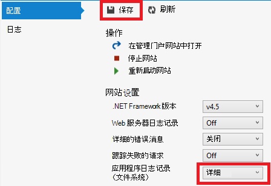

<properties 
    pageTitle="解决 web 应用程序中使用 Visual Studio 的 Azure 应用程序服务" 
    description="了解如何通过使用远程调试、 跟踪和日志记录工具，内置于 Visual Studio 2013年解决 Azure 的 web 应用程序。" 
    services="app-service" 
    documentationCenter=".net" 
    authors="tdykstra" 
    manager="wpickett" 
    editor=""/>

<tags 
    ms.service="app-service" 
    ms.workload="na" 
    ms.tgt_pltfrm="na" 
    ms.devlang="dotnet" 
    ms.topic="article" 
    ms.date="08/29/2016" 
    ms.author="rachelap"/>

# 解决 web 应用程序中使用 Visual Studio 的 Azure 应用程序服务

## 概述

本教程展示如何使用 Visual Studio 工具，可帮助调试 web 应用程序在[应用程序服务](http://go.microsoft.com/fwlink/?LinkId=529714)，通过远程[调试模式](http://www.visualstudio.com/get-started/debug-your-app-vs.aspx)中运行或查看应用程序日志和 web 服务器日志。

[AZURE.INCLUDE [app-service-web-to-api-and-mobile](../../includes/app-service-web-to-api-and-mobile.md)]

您将学习︰

* Visual Studio 提供了哪些 Azure 的 web 应用程序管理功能。
* 如何使用 Visual Studio 远程视图可以快速更改远程 web 应用程序中。
* 如何运行项目时远程调试模式下运行在 Azure，web 应用程序和 WebJob。
* 如何创建应用程序跟踪日志并查看该应用程序时创建它们。
* 如何查看 web 服务器日志，包括详细的错误消息和失败请求跟踪。
* 发送诊断日志到 Azure 存储帐户和那里查看它们的方式。

如果 Visual Studio 终极，您可以将[IntelliTrace](http://msdn.microsoft.com/library/vstudio/dd264915.aspx)用于调试。 在本教程中不涉及 IntelliTrace。

## 系统必备组件

本教程适用于开发环境、 web 项目和 Azure 的 web 应用程序中[开始使用 Azure 和 ASP.NET]设置了[GetStarted]。 为 WebJobs 部分中，您将需要您在[开始使用 Azure WebJobs SDK]中创建应用程序[GetStartedWJ]。

在本教程中所示的代码示例 C# MVC web 应用程序，但故障排除的过程都是相同的 Visual Basic 和 Web 窗体应用程序。

本教程假定您使用的 Visual Studio 2015年或 2013年。 如果您使用的 Visual Studio 2013年，WebJobs 功能要求[更新 4](http://go.microsoft.com/fwlink/?LinkID=510314)或更高版本。 

流式处理日志功能仅适用于面向.NET Framework 4 或更高版本的应用程序。

## Web 应用程序配置和管理

Visual Studio 提供了对 web 应用程序管理功能和[Azure 门户](http://go.microsoft.com/fwlink/?LinkId=529715)中可用的配置设置的子集的访问。 在本节中，您将看到什么是可使用**服务器资源管理器**。 若要查看最新的 Azure 的集成功能，还出**云资源管理器中**重试。 您可以从**视图**菜单上打开两个窗口。 

1. 如果已经没有登录到 Azure 在 Visual Studio 中，单击在**服务器资源管理器****连接到 Azure**按钮。

    一种替代方法是安装可以访问您的帐户管理证书。 如果您选择要安装证书， **Azure**节点在**服务器资源管理器**中的用鼠标右键单击，然后单击上下文菜单中的**管理和筛选订阅**。 在**管理 Azure 订阅**对话框中，单击**证书**选项卡，然后单击**导入**。 Azure 帐户按照说明来下载，然后导入订阅文件 （也称为*.publishsettings*文件）。

    > [AZURE.NOTE]
    > 如果您下载订阅文件，将其保存到文件夹外部源的代码目录 （例如，在下载文件夹中），并完成导入后删除它。 获得订阅文件访问权限的恶意用户可以编辑、 创建和删除您的 Azure 服务。

    有关连接到 Azure 的资源从 Visual Studio 的详细信息，请参阅[管理帐户、 预订和管理角色](http://go.microsoft.com/fwlink/?LinkId=324796#BKMK_AccountVCert)。

2. 在**服务器资源管理器**中展开**Azure** ，展开**应用程序服务**。

3. 展开包含您在[入门 Azure 和 ASP.NET]中创建 web 应用程序的资源组[GetStarted]，然后用鼠标右键单击 web 应用程序节点并单击**视图设置**。

    

    **Azure Web 应用程序**选项卡将显示，并且您可以看到在 Visual Studio 中可用的 web 应用程序管理和配置任务。

    

    您将在本教程中使用的日志记录和跟踪下拉列表。 您还将使用远程调试，但将使用另一种方法来启用它。
   
    有关此窗口中的应用程序设置和连接字符串框的信息，请参阅[Azure Web 应用程序︰ 如何应用字符串和连接字符串的工作](http://blogs.msdn.com/b/windowsazure/archive/2013/07/17/windows-azure-web-sites-how-application-strings-and-connection-strings-work.aspx)。

    如果您想要执行 web 应用程序管理任务能在此窗口中，单击**管理门户中打开**若要打开一个浏览器窗口到 Azure 的门户。

## 在服务器资源管理器中访问 web 应用程序文件

通常部署 web 项目中的使用`customErrors`标志在 Web.config 文件设置为`On`或`RemoteOnly`，这意味着未获得时是有用的错误消息中出现错误。 很多错误就是类似以下的页。

**/ 应用程序中的服务器错误︰**

**出现错误︰**

**网站无法显示的页面**

通常最简单的方法来找到错误的原因是启用前面屏幕快照中的第一个解释如何执行的详细的错误消息。 需要部署的 Web.config 文件中的更改。 无法编辑项目中的*Web.config*文件并重新部署项目，或创建[Web.config 转换](http://www.asp.net/mvc/tutorials/deployment/visual-studio-web-deployment/web-config-transformations)和部署调试版本中，但还有更快的方法︰ 在**解决方案资源管理器**中您可以直接查看和编辑远程 web 应用程序中的文件通过*远程视图*功能。

1. 在**服务器资源管理器**中展开**Azure**，**应用程序服务**、 中，位于您的 web 应用程序的资源组，然后展开您的 web 应用程序的节点。

    请授予您访问 web 应用程序的内容文件和日志文件的节点。

2. 展开**文件**节点，然后双击*Web.config*文件。

    

    Visual Studio 打开从远程 web 应用程序的 Web.config 文件，并显示在标题栏中的文件名称旁边的 [远程]。

3. 添加以下行`system.web`元素︰

    `<customErrors mode="Off"></customErrors>`

    

4. 刷新浏览器显示无用的错误消息，并且您现在获得详细的错误消息，如以下示例所示︰

    

    （显示该错误创建通过将添加到*Views\Home\Index.cshtml*以红色显示的行的）。

编辑 Web.config 文件就是只有一种方案能够读取和编辑 Azure 的 web 应用程序上的文件进行故障排除。

## 远程调试 web 应用程序

如果无法重新创建本地错误的详细的错误消息没有提供足够的信息，另一种解决方法是在调试模式下从远程运行。 可以设置断点、 直接操纵内存、 单步执行代码，和甚至更改的代码路径。 

远程调试不适的 Visual Studio 速成版中。

本节说明如何调试使用[入门 Azure 和 ASP.NET]中创建该项目远程[GetStarted]。

1. 打开[入门 Azure 和 ASP.NET]中创建 web 项目[GetStarted]。

1. 打开*Controllers\HomeController.cs*。

2. 删除`About()`方法并插入下面的代码在其原位置。

        public ActionResult About()
        {
            string currentTime = DateTime.Now.ToLongTimeString();
            ViewBag.Message = "The current time is " + currentTime;
            return View();
        }

2. 在[设置断点](http://www.visualstudio.com/get-started/debug-your-app-vs.aspx)`ViewBag.Message`线。

1. 在**解决方案资源管理器**中用鼠标右键单击该项目，然后单击**发布**。

2. 在**配置文件**下拉列表中，选择[入门 Azure 和 ASP.NET]中使用同一配置文件[GetStarted]。

3. 单击**设置**选项卡，并将**配置**更改为**调试**，然后单击**发布**。

    

4. 部署后操作完成且您的浏览器将打开到 Azure 的 web 应用程序的 URL，请关闭浏览器。

5. 在**服务器资源管理器**中用鼠标右键单击您的 web 应用程序，然后单击**连接调试器**。 

    

    在 Azure 中运行您主页上，浏览器将自动打开。 您可能需要等待 20 秒左右 Azure 将设置为调试服务器。 这种延迟只会发生在 web 应用程序在调试模式下运行的第一次。 当您再次启动调试有未来 48 小时内的连续将不会出现延迟。

    **注意︰**如果您遇到任何启动调试程序，请尝试去做而不是**服务器资源管理器**中使用**云资源管理器**。

6. 单击菜单中的**有关**。

    Visual Studio 停在断点处，并在 Azure，不在您的本地计算机上运行该代码。

7. 将鼠标悬停在`currentTime`变量，看的时间值。

    

    您看到的时间是 Azure 服务器的时间，可能比您的本地计算机的不同时区中。

8. 输入的新值`currentTime`变量，如"现在在 Azure 中正在运行"。

5. 按 f5 键以继续运行。

    在 Azure 中运行关于页显示您在 currentTime 变量中输入的新值。

    

## 远程调试 WebJobs

本节说明如何使用您在[开始使用 Azure WebJobs SDK](websites-dotnet-webjobs-sdk.md)中创建的项目和 web 应用程序进行远程调试。 

在此部分中显示的功能是仅在 Visual Studio 2013 更新 4 或更高版本中可用。 

远程调试仅适用于连续的 WebJobs。 计划和点播 WebJobs 不支持调试。

1. 打开您在[开始使用 Azure WebJobs SDK]中创建 web 项目[GetStartedWJ]。

1. 在 ContosoAdsWebJob 项目中，打开*Functions.cs*。

2. 在第一个语句中[设置一个断点](http://www.visualstudio.com/get-started/debug-your-app-vs.aspx)`GnerateThumbnail`方法。

    

1. 在**解决方案资源管理器**中右击该 web 项目 （非 WebJob 项目），并单击**发布**。

2. 在**配置文件**下拉列表中，选择您在[开始使用 Azure WebJobs SDK](websites-dotnet-webjobs-sdk.md)中使用同一配置文件。

3. 单击**设置**选项卡，并将**配置**更改为**调试**，然后单击**发布**。

    Visual Studio 部署 web 和 WebJob 项目，和您的浏览器将打开到 Azure 的 web 应用程序的 URL。

5. 在**服务器资源管理器**中，展开**Azure > 应用程序服务 > 资源组 > 您的 web 应用程序 > WebJobs > 连续**，然后右键单击**ContosoAdsWebJob**。

7. 单击**连接调试器**。 

    

    在 Azure 中运行您主页上，浏览器将自动打开。 您可能需要等待 20 秒左右 Azure 将设置为调试服务器。 这种延迟只会发生在 web 应用程序在调试模式下运行的第一次。 如果在 48 小时内执行该附加调试程序有下一次不会延迟。

6. 在 Contoso 广告主页上打开 web 浏览器，创建一个新的广告。 

    创建广告会导致队列消息来创建，这将由 WebJob 获取并处理。 当 WebJobs SDK 调用函数来处理该队列的消息时，该代码会命中断点。

7. 当在断点处中断调试器时，可以检查并更改变量的值在程序运行云。 在下图中，调试器显示传递给 GenerateThumbnail 方法 blobInfo 对象的内容。

    
 
5. 按 f5 键以继续运行。

    GenerateThumbnail 方法完成创建缩略图。

6. 在浏览器中刷新索引页，并看到缩略图。

6. 在 Visual Studio 中，按 SHIFT + F5 以停止调试。

7. 在**服务器资源管理器**中用鼠标右键单击 ContosoAdsWebJob 节点，并单击**查看仪表板**。

8. 使用您 Azure 的凭据登录，然后单击要转到的页面为您 WebJob 的 WebJob 名。 

    

    仪表板显示最近执行的 GenerateThumbnail 函数。

    （下次单击**仪表板视图**，您无需登录，并浏览器而直接转到页上为您 WebJob）

9. 单击函数名称可查看有关函数执行的详细信息。

    

如果[写入日志](websites-dotnet-webjobs-sdk-storage-queues-how-to.md#logs)您函数，您可以通过单击**ToggleOutput**才能看到它们。

## 有关远程调试的注意事项

* 不建议在生产环境中调试模式下运行。 如果生产 web 应用程序不向外扩展到多个服务器实例，调试将阻止对其他请求进行响应的 web 服务器。 如果附加到调试器时，您有多个 web 服务器实例，您将得到一个随机的实例，并且没有任何办法来确保以后的浏览器的请求将转到该实例。 此外，通常不部署到生产环境的调试版本和发布版本的编译器优化可能会使它不可能发生在源代码中逐行显示。 为解决生产问题，最佳资源是应用程序跟踪和 web 服务器日志。

* 避免长时间停在断点时远程调试。 Azure 将停止时间超过几分钟作为无响应的进程，并关闭它的过程。

* 调试时, 服务器会将数据发送到 Visual Studio，可能会影响带宽费用。 有关带宽速率的信息，请参阅[Azure 定价](/pricing/calculator/)。

* 请确保`debug`的特性`compilation`的*Web.config*文件中的元素设置为 true。 将其设置为默认情况下，当您发布的调试生成配置，则返回 true。

        <system.web>
          <compilation debug="true" targetFramework="4.5" />
          <httpRuntime targetFramework="4.5" />
        </system.web>

* 如果您发现调试器无法单步执行您想要调试的代码，您可能需要更改仅我的代码设置。  有关详细信息，请参阅[限制到仅我的代码单步执行](http://msdn.microsoft.com/library/vstudio/y740d9d3.aspx#BKMK_Restrict_stepping_to_Just_My_Code)。

* 计时器启动在服务器上启用远程调试功能，并在 48 小时之后自动关闭功能。 这 48 小时的限制是出于安全和性能方面的原因。 在任意多次后，可以很容易转变的特征。 我们建议您保持积极不进行调试时禁用它。

* 您可以手动将调试器附加到任何进程，而不仅限于 web 应用程序进程 (w3wp.exe)。 有关如何使用 Visual Studio 中调试模式的详细信息，请参阅[在 Visual Studio 中的调试](http://msdn.microsoft.com/library/vstudio/sc65sadd.aspx)。

## 诊断日志概述

在 Azure 的 web 应用程序中运行 ASP.NET 应用程序可以创建以下类型的日志︰

* **应用程序跟踪日志** 
  应用程序通过调用[System.Diagnostics.Trace](http://msdn.microsoft.com/library/system.diagnostics.trace.aspx)类的方法来创建这些日志。
* **Web 服务器日志** 
  Web 服务器将创建到 web 应用程序的每个 HTTP 请求的日志条目。
* **详细的错误消息日志** 
  Web 服务器与失败 （那些导致状态代码 400 或更高版本） 的 HTTP 请求的某些其他信息创建一个 HTML 页面。 
* **失败请求跟踪日志** 
  Web 服务器使用 HTTP 请求失败的详细的跟踪信息创建一个 XML 文件。 Web 服务器还提供 XSL 文件来设置在浏览器中的 XML 的格式。
  
日志记录会影响 web 应用程序的性能，所以 Azure 使您能够启用或禁用每种类型的日志，根据需要。 对于应用程序日志，您可以指定应编写只以上特定严重性级别的日志。 当您创建新的 web 应用程序中，默认情况下所有日志记录被禁用。

日志写入到*日志文件*的文件系统中的 web 应用程序文件夹中的文件，可通过 FTP 访问。 Web 服务器日志和应用程序日志也可以写入到 Azure 存储帐户。 您可以保留更大卷中不是有可能在文件系统中存储帐户日志。 你最多的 100 兆字节的日志时使用的文件系统。 （仅用于短期保留了文件系统日志。 Azure 删除旧的日志文件，以腾出空间为新后达到的限制）。  

## 创建和查看应用程序跟踪日志

这一节中您将执行以下任务︰

* 将跟踪语句添加到您在[开始使用 Azure 和 ASP.NET]中创建 web 项目[GetStarted]。
* 在本地运行该项目时，请查看日志。
* 因为它们都由在 Azure 上运行的应用程序，请查看日志。 

在 WebJobs 中记录有关如何创建应用程序的信息，请参阅[如何使用 Azure 队列存储使用如何写入日志的 WebJobs SDK-](websites-dotnet-webjobs-sdk-storage-queues-how-to.md#logs)。 用于查看日志和控制如何在 Azure 存储它们以下说明也适用于由 WebJobs 创建的应用程序日志。 

### 将跟踪语句添加到应用程序

1. 打开*Controllers\HomeController.cs*，和替换`Index`， `About`，和`Contact`方法以便添加下面的代码使用`Trace`语句和一个`using`语句`System.Diagnostics`:

        public ActionResult Index()
        {
            Trace.WriteLine("Entering Index method");
            ViewBag.Message = "Modify this template to jump-start your ASP.NET MVC application.";
            Trace.TraceInformation("Displaying the Index page at " + DateTime.Now.ToLongTimeString());
            Trace.WriteLine("Leaving Index method");
            return View();
        }
        
        public ActionResult About()
        {
            Trace.WriteLine("Entering About method");
            ViewBag.Message = "Your app description page.";
            Trace.TraceWarning("Transient error on the About page at " + DateTime.Now.ToShortTimeString());
            Trace.WriteLine("Leaving About method");
            return View();
        }
        
        public ActionResult Contact()
        {
            Trace.WriteLine("Entering Contact method");
            ViewBag.Message = "Your contact page.";
            Trace.TraceError("Fatal error on the Contact page at " + DateTime.Now.ToLongTimeString());
            Trace.WriteLine("Leaving Contact method");
            return View();
        }       

2. 添加`using System.Diagnostics;`语句到文件的顶部。
                
### 查看本地跟踪输出

3. 按 f5 键在调试模式下运行该应用程序。

    默认跟踪侦听器将所有跟踪输出都写入到**输出**窗口和其他调试输出。 下图显示了添加到跟踪语句的输出`Index`方法。

    

    下面的步骤演示如何在 web 页上，查看跟踪输出，而无需在调试模式下进行编译。

2. 打开应用程序的 Web.config 文件 （位于项目文件夹中的一个），并添加`<system.diagnostics>`之前关闭该文件的结尾元素`</configuration>`元素︰

        <system.diagnostics>
            <trace>
              <listeners>
                <add name="WebPageTraceListener"
                    type="System.Web.WebPageTraceListener, 
                    System.Web, 
                    Version=4.0.0.0, 
                    Culture=neutral,
                    PublicKeyToken=b03f5f7f11d50a3a" />
              </listeners>
            </trace>
          </system.diagnostics>

    `WebPageTraceListener`可让您查看跟踪输出通过浏览到`/trace.axd`。

3. 添加<a href="http://msdn.microsoft.com/library/vstudio/6915t83k(v=vs.100).aspx">跟踪元素</a>下`<system.web>`在 Web.config 文件中，如以下示例所示︰

        <trace enabled="true" writeToDiagnosticsTrace="true" mostRecent="true" pageOutput="false" />

3. 按 CTRL + F5 以运行应用程序。

4. 在浏览器窗口的地址栏中，将*trace.axd*添加到 URL 中，，然后按 enter 键 （URL 将是类似于 http://localhost:53370/trace.axd）。

5. 在**应用程序跟踪**页上的第一行 （而不是 BrowserLink 行） 中单击**查看详细信息**。

    

    **请求详细信息**页将显示，并在**跟踪信息**部分中，您看到添加到跟踪语句的输出`Index`方法。

    

    默认情况下，`trace.axd`本地才可用。 如果想要使其可从远程 web 应用程序，您可以添加`localOnly="false"`到`trace`在*Web.config*文件中，如下面的示例中所示的元素︰

        <trace enabled="true" writeToDiagnosticsTrace="true" localOnly="false" mostRecent="true" pageOutput="false" />

    但是，启用`trace.axd`的生产中 web 应用程序通常不推荐出于安全考虑，并在以下各节中，您将看到更简单的方法来读取 Azure 的 web 应用程序中的跟踪日志。

### 在 Azure 中查看跟踪输出

1. 在**解决方案资源管理器**中右击该 web 项目，然后单击**发布**。

2. 在**发布网站**对话框中，单击**发布**。

    Visual Studio 将发布您的更新后，它将打开到主页上 （假定您没有在**连接**选项卡上清除**目标 URL** ） 的浏览器窗口。

3. 在**服务器资源管理器**中用鼠标右键单击您的 web 应用程序并选择**查看流式传输日志**。 

    

    **输出**窗口显示您连接到日志流的服务，并添加一条通知没有日志显示转每分钟。

    

4. 在浏览器窗口中显示您应用程序的主页上，单击**联系人**。

    在几秒钟内从错误级别的输出跟踪您添加到`Contact`方法将出现在**输出**窗口。

    

    Visual Studio 只显示错误级别跟踪，因为这是默认设置，启用日志监视服务。 创建新的 Azure 的 web 应用程序时，所有记录默认被都禁用的正如您可以看到前面打开设置页时︰

    

    但是，当您选择**查看流式处理日志**，Visual Studio 自动更改**应用程序 Logging(File System)**为**错误**，这意味着错误级别日志被报告。 如果要查看所有跟踪日志，可以**详细**到中更改此设置。 当选择低于错误的严重级别时，还报告为更高严重性级别的所有日志。 因此时选择了详细，还会显示信息、 警告和错误日志。  

4. 在**服务器资源管理器**中用鼠标右键单击 web 应用程序，并像前面一样然后单击**视图设置**。

5. 为**详细**，更改**应用程序的日志记录 （文件系统）** ，然后单击**保存**。
 
    

6. 现在显示**联系人**页面的浏览器窗口中单击**主页**，然后**有关**，请单击，然后单击**联系人**。

    在几秒内，**输出**窗口将显示所有您跟踪输出。

    

    这一节中您可以启用并使用 Azure 的 web 应用程序设置中禁用日志记录。 您还可以启用和禁用跟踪侦听器通过修改 Web.config 文件。 但是，修改 Web.config 文件会导致应用程序域进行回收，同时启用通过 web 应用程序配置的日志不能做到这一点。 如果该问题需要很长的时间，要重现，或者是间歇性的回收应用程序域可能"修复"其并强制您等待，直到它再次发生。 启用在 Azure 中的诊断不执行此操作，以便您可以启动立即捕获错误的信息。

### 输出窗口功能

**输出**窗口的**Azure 日志**选项卡上有几个按钮和一个文本框︰

这些执行以下功能︰

* 清除**输出**窗口。
* 启用或禁用自动换行。
* 启动或停止监视日志。
* 指定要监视的日志。
* 下载日志。
* 筛选日志基于搜索字符串或正则表达式。
* 关闭**输出**窗口。

如果您输入的搜索字符串或正则表达式，则 Visual Studio 筛选在客户端的日志记录信息。 这意味着日志将显示在**输出**窗口中，您可以更改筛选条件，而无需重新生成日志后，您可以输入条件。

## 查看 web 服务器日志

Web 服务器日志记录所有 web 应用程序的 HTTP 活动。 请在**输出**窗口中，您需要启用它们的 web 应用程序，并告诉您想要监视它们的 Visual Studio。 

1. 从**服务器资源管理器**中打开的**Azure Web 应用程序配置**选项卡中更改为**上**的 Web 服务器日志记录，然后单击**保存**。

    

2. 在**输出**窗口中，单击**指定的 Azure 日志来监视**按钮。
    
    

3. 在**Azure 日志记录选项**对话框中，选择**Web 服务器日志**，然后单击**确定**。

    

4. 在浏览器窗口中显示 web 应用程序，单击**主页**，则**有关**，请单击，然后单击**联系人**。

    应用程序日志通常首先出现，跟 web 服务器日志。 您可能需要等待一段时间的日志显示。 

    

默认情况下，当您通过使用 Visual Studio，首次启用 web 服务器日志 Azure 写入日志的文件系统。 作为一种替代方法，可以使用 Azure 的门户来指定 web 服务器日志应写入 blob 容器中存储帐户。

如果使用门户 web 服务器日志信息记录到 Azure 存储帐户，启用然后又禁用时重新启用了在 Visual Studio 中日志记录日志记录在 Visual Studio 中，您的存储帐户设置还原。 

## 查看详细的错误消息日志

详细的错误日志提供有关导致错误响应代码 （400 或更高） 的 HTTP 请求的某些其他信息。 为了查看它们在**输出**窗口中，您必须为 web 应用程序启用它们，告诉您想要监视它们的 Visual Studio。

1. 从**服务器资源管理器**中打开的**Azure Web 应用程序配置**选项卡中更改为**上****详细的错误消息**，然后单击**保存**。

    

2. 在**输出**窗口中，单击**指定的 Azure 日志来监视**按钮。

3. **Azure 日志记录选项**对话框中，在**所有日志**，请单击，然后单击**确定**。

    

4. 在浏览器窗口的地址栏中，造成 404 错误的 url 添加额外的字符 (例如， `http://localhost:53370/Home/Contactx`)，然后按 enter 键。

    几秒钟后详细的错误日志将显示在 Visual Studio 的**输出**窗口中。

    

    控制键并单击该链接来查看浏览器中设置格式的日志输出︰

    

## 下载文件系统日志

您可以在**输出**窗口中监视任何日志还可以以*.zip*文件格式下载。 

1. 在**输出**窗口中，单击**下载流式传输日志**。

    

    文件资源管理器打开到*下载*文件夹中，并下载选定的文件。

    

2. 提取该*.zip*文件，并请参阅以下文件夹结构︰

    

    * 应用程序跟踪日志位于*LogFiles\Application*文件夹中的*.txt*文件。
    * Web 服务器日志位于*LogFiles\http\RawLogs*文件夹中的*.log*文件。 可以使用[Log Parser](http://www.microsoft.com/download/details.aspx?displaylang=en&id=24659)之类的工具来查看和操作这些文件。
    * 详细的错误消息日志位于*LogFiles\DetailedErrors*文件夹中的*.html*文件。

    (*部署*文件夹是文件创建的源代码发布; 它没有任何与 Visual Studio 发布相关。 *Git*文件夹相关的源代码管理跟踪的是发布和日志文件流式服务。)  

## 查看存储日志

应用程序跟踪日志还可以发送到 Azure 存储帐户，并且您可以在 Visual Studio 中查看它们。 为您将创建存储帐户，启用存储日志中经典的门户，并在**Azure Web 应用程序**窗口的**日志**选项卡中查看它们。

可以将日志发送到任一或所有三个目的地︰

* 文件系统中。
* 存储帐户表。
* 存储帐户 blob。

可以指定不同的严重性级别为每个目标。 

表轻松地查看详细信息的日志在线，以及它们支持流;可以查询表中的日志，并看到他们正在创建新的日志。 Blob 轻松下载日志文件中的，并分析它们使用 HDInsight，因为 HDInsight 知道如何使用 blob 存储。 有关详细信息，请参见**Hadoop 和 MapReduce**中[数据存储选项 （构建真实的云应用程序使用 Azure）](http://www.asp.net/aspnet/overview/developing-apps-with-windows-azure/building-real-world-cloud-apps-with-windows-azure/data-storage-options)。

您当前已拥有文件系统日志设置为详细级别;以下步骤将指导您完成设置信息级别记录转到存储帐户表。 信息级别意味着通过调用创建的所有日志`Trace.TraceInformation`， `Trace.TraceWarning`，和`Trace.TraceError`将显示，但不是通过调用创建的日志`Trace.WriteLine`。

存储客户提供了更多的存储和日志与文件系统进行比较的更持久保留。 发送到存储应用程序跟踪日志的另一个优点是，您将与不能获得文件系统日志中的每个日志的其他信息。

5. 用鼠标右键单击在 Azure 节点下的**存储**，然后单击**创建存储帐户**。

3. 在**创建存储帐户**对话框中，输入存储帐户的名称。 

    该名称必须必须是唯一的 （没有其他 Azure 存储帐户可以具有相同的名称）。 如果您输入的名称已在使用中将有机会对其进行更改。

    若要访问您的存储帐户的 URL 将*{name}*。 core.windows.net。 

5. 设置为区域的**区域或相关性组**下拉列表最接近您。

    此设置指定哪些 Azure 数据中心将承载您的存储帐户。 本教程为您选择不会使明显差异，但要生产 web 应用程序对您的 web 服务器和您的存储帐户，可在同一区域，尽量减少延迟和数据出口费用。 使 web 应用程序 （这将在以后创建） 应尽可能以尽量减少延迟访问您的 web 应用程序的浏览器接近的区域中运行。

6. 将**复制**下拉列表设置为**本地冗余**。 

    存储帐户启用地理复制时，存储的内容被复制到从属数据中心启用故障转移到该位置发生的主要地点，在大的灾难。 Geo 复制可以带来额外的成本。 对于测试和开发帐户，通常不希望支付地区复制。 有关详细信息，请参阅[创建、 管理或删除存储帐户](../storage-create-storage-account/#replication-options)。

5. 单击**创建**。 

      

1. 在 Visual Studio 的**Azure Web 应用程序**窗口中，单击**日志**选项卡，然后单击**管理门户中配置日志记录**。

    <!-- todo:screenshot of new portal if the VS page link goes to new portal -->
    

    这将在您的 web 应用程序的传统门户网站打开**配置**选项卡。

2. 在传统门户的**配置**选项卡上，向下滚动到应用程序的诊断部分，然后更改为**上**的**应用程序日志记录 （表存储）** 。

3. 更改**日志记录级别****的信息**。

4. 单击**管理表存储**。

    

    在**管理应用程序诊断表存储**框中，可以选择您的存储帐户，如果您有多个。 可以创建一个新表，也可以使用一个现有。

    

6. 在**表存储管理应用程序诊断程序**框中单击复选标记以关闭对话框。

6. 在传统门户的**配置**选项卡上，单击**保存**。

7. 在浏览器窗口中显示应用程序的 web 应用程序，单击**主页**，则**有关**，请单击，然后单击**联系人**。

    浏览这些网页所产生的日志记录信息将写入存储帐户。

8. 在**Azure Web 应用程序**窗口在 Visual Studio 中的**日志**选项卡上，在**诊断摘要**下，单击**刷新**。

    ![单击 [刷新]](./media/web-sites-dotnet-troubleshoot-visual-studio/tws-refreshstorage.png)

    **诊断的摘要**部分显示默认情况下前 15 分钟的日志。 您可以更改以查看更多的日志期间。 

    （如果收到"未找到表"的错误，请验证您浏览到您启用**应用程序记录 （存储）**之后，在您单击**保存**后不要跟踪页。）

    

    注意，在此视图中将看到**进程 ID**和**线程 ID**为每个日志，但不能获得文件系统日志中。 您可以通过查看 Azure 存储表直接看到附加字段。

8. 单击**查看所有的应用程序日志**。

    在 Azure 存储表查看器中将显示跟踪日志表。
   
    （如果收到"序列中不包含任何元素"的错误，打开**服务器资源管理器中**，展开**Azure**节点中，您的存储帐户的节点，右键单击**表**然后单击**刷新**。）

    

    此视图显示的附加字段，看不到任何其他视图中。 此视图还可以使用特殊的查询生成器用户界面用于构造查询筛选日志。 有关详细信息，请参阅表资源的筛选中[使用服务器资源管理器浏览存储资源](http://msdn.microsoft.com/library/ff683677.aspx)的实体使用。

7. 若要查看单个行的详细信息，请双击行之一。

    

## 查看失败的请求跟踪日志

失败的请求跟踪日志很有用，当您需要了解 IIS 怎样处理的 HTTP 请求，如 URL 重写或身份验证问题的方案中的详细信息。 

Azure 的 web 应用程序使用相同的失败的请求跟踪功能已随 IIS 7.0 及更高版本。 您没有配置哪些错误被记录，但是 IIS 设置的访问权限。 当启用跟踪失败的请求时，会捕获所有错误。 

您可以通过使用 Visual Studio，启用跟踪失败的请求，但无法在 Visual Studio 中查看它们。 这些日志是 XML 文件。 流式处理日志服务仅监视被认为是可读的纯文本模式中的文件︰ 文件*.txt*、 *.html*和*.log*文件。

您可以直接通过 FTP 或本地之后使用 FTP 工具将它们下载到您的本地计算机的浏览器中查看失败的请求跟踪日志。 在这一节中您将查看它们在浏览器中直接。

1. 在您从**服务器资源管理器**中打开**Azure Web 应用程序**窗口的**配置**选项卡中，将**失败请求跟踪**改为**上**，，然后单击**保存**。

    

4. 在浏览器窗口，其中显示 web 应用程序的地址栏中，多余的字符添加到 URL 并单击 Enter 键会导致一个 404 错误。

    这将导致失败的请求跟踪日志来创建，和下面的步骤演示如何查看或下载日志。

2. 在 Visual Studio， **Azure Web 应用程序**窗口中的**配置**选项卡中单击**管理门户中打开**。

3. 在您的 web 应用程序[Azure 门户](https://portal.azure.com)**设置**刀片式服务器，单击**部署凭据**，然后输入新的用户名和密码。

    

    * * 您登录时，您必须使用 web 应用程序名的前缀为其完整的用户名称。 例如，如果您输入一个用户名为"myid"和网站是"myexample"，则登录为"myexample\myid"。

5. 在新的浏览器窗口，请转到下**FTP 主机名**或**主机名 FTPS** **Web App**刀片式服务器为您的 web 应用程序中显示的 URL。 

6. 使用前面 （包括用户名称的 web 应用程序名称前缀） 创建 FTP 凭据登录。

    浏览器中显示 web 应用程序的根文件夹。

6. 打开*日志文件*文件夹。

    

7. 打开的文件夹名为 W3SVC 加上一个数字值。

    

    该文件夹包含后启用失败的请求跟踪记录了任何错误的 XML 文件和浏览器可用于格式化 XML 的 XSL 文件。

    

8. 单击您想要跟踪的信息，请参阅失败请求的 XML 文件。

    下面的插图显示示例错误的跟踪信息的一部分。

    

## 下一步行动

您已经看到如何 Visual Studio 可以轻松地查看 Azure 的 web 应用程序所创建的日志。 以下各节提供相关主题的更多的资源的链接︰

* Azure 的 web 应用程序进行故障排除
* 在 Visual Studio 中调试 
* 远程调试在 Azure 中
* 在 ASP.NET 应用程序跟踪
* 分析 web 服务器日志
* 分析失败请求跟踪日志
* 调试的云服务

### Azure 的 web 应用程序进行故障排除

有关故障排除在 Azure 应用程序服务 web 应用程序的详细信息，请参阅以下资源︰

* [如何监视 web 应用程序](/manage/services/web-sites/how-to-monitor-websites/)
* [调查与 Visual Studio 2013年的 Azure 的 Web 应用程序中的内存泄漏](http://blogs.msdn.com/b/visualstudioalm/archive/2013/12/20/investigating-memory-leaks-in-azure-web-sites-with-visual-studio-2013.aspx)。 有关 Visual Studio 功能分析托管的内存问题的 Microsoft ALM 博客文章。
* [您应了解有关的 azure 的 web 应用程序在线工具](/blog/2014/03/28/windows-azure-websites-online-tools-you-should-know-about-2/)。 Amit 苹果通过博客文章。

有关特定的故障诊断问题的帮助，以下论坛之一启动一个线程︰

* [在 ASP.NET 网站的 Azure 论坛](http://forums.asp.net/1247.aspx/1?Azure+and+ASP+NET)。
* [在 MSDN 上的 Azure 论坛](http://social.msdn.microsoft.com/Forums/windowsazure/)。
* [StackOverflow.com](http://www.stackoverflow.com)。

### 在 Visual Studio 中调试 

有关如何在 Visual Studio 中使用调试模式的详细信息，请参阅 MSDN 主题[在 Visual Studio 中的调试](http://msdn.microsoft.com/library/vstudio/sc65sadd.aspx)和[调试与 Visual Studio 2010 的技巧](http://weblogs.asp.net/scottgu/archive/2010/08/18/debugging-tips-with-visual-studio-2010.aspx)。

### 远程调试在 Azure 中

有关远程调试的 Azure 的 web 应用程序和 WebJobs 的详细信息，请参阅以下资源︰

* [远程调试的 Azure 应用程序服务 Web 应用程序的简介](/blog/2014/05/06/introduction-to-remote-debugging-on-azure-web-sites/)。
* [在远程调试的远程调试 Azure 应用程序服务 Web 应用程序部分 2-简介](/blog/2014/05/07/introduction-to-remote-debugging-azure-web-sites-part-2-inside-remote-debugging/)
* [在 Azure 应用程序服务 Web 应用程序第 3-多实例环境和 GIT 部分远程调试的简介](/blog/2014/05/08/introduction-to-remote-debugging-on-azure-web-sites-part-3-multi-instance-environment-and-git/)
* [WebJobs 调试 （视频）](https://www.youtube.com/watch?v=ncQm9q5ZFZs&list=UU_SjTh-ZltPmTYzAybypB-g&index=1)

如果您需要调试的 web 应用程序使用 Azure Web API 或移动服务的后端，请参阅[在 Visual Studio 中调试.NET 后端](http://blogs.msdn.com/b/azuremobile/archive/2014/03/14/debugging-net-backend-in-visual-studio.aspx)。

### 在 ASP.NET 应用程序跟踪

与 ASP.NET 跟踪没有全面和最新引入提供了 Internet 上。 最好的做法被入门旧介绍性的资料编写的 Web 窗体因为 MVC 不存在，并且补充与更新的博客，在具体问题上发的焦点。 一些良好开端是下列资源︰

* [监视和遥测 （构建真实的云应用程序使用 Azure）](http://www.asp.net/aspnet/overview/developing-apps-with-windows-azure/building-real-world-cloud-apps-with-windows-azure/monitoring-and-telemetry)。  电子书章 Azure 的云应用程序中的跟踪的建议。
* [ASP.NET 跟踪](http://msdn.microsoft.com/library/ms972204.aspx) 
  旧，但仍对主题进行了基本介绍的好资源。
* [跟踪侦听器](http://msdn.microsoft.com/library/4y5y10s7.aspx) 
  跟踪侦听器的信息，但没有提到[WebPageTraceListener](http://msdn.microsoft.com/library/system.web.webpagetracelistener.aspx)。
* [演练︰ 将 ASP.NET 跟踪集成如何跟踪](http://msdn.microsoft.com/library/b0ectfxd.aspx) 
  这太旧，但是包括一些介绍性的文章并不涵盖的其他信息。
* [在 ASP.NET MVC Razor 视图中跟踪](http://blogs.msdn.com/b/webdev/archive/2013/07/16/tracing-in-asp-net-mvc-razor-views.aspx) 
  除了在 Razor 视图跟踪，帖子还说明了如何创建 MVC 应用程序中记录所有未处理的异常错误筛选器。 有关如何在 Web 窗体应用程序中记录所有未处理的异常的信息，请参阅 MSDN 上的 Global.asax 示例中[的错误处理程序的完整示例](http://msdn.microsoft.com/library/bb397417.aspx)。 在 MVC 或 Web 窗体中，如果您想要记录特定的异常，但是让默认框架处理就会生效，您可以捕捉并再次引发如以下示例所示︰

        try
        {
           // Your code that might cause an exception to be thrown.
        }
        catch (Exception ex)
        {
            Trace.TraceError("Exception: " + ex.ToString());
            throw;
        } 

* [流的诊断跟踪日志记录从 Azure 的命令行 （加浏览一下 ！）](http://www.hanselman.com/blog/StreamingDiagnosticsTraceLoggingFromTheAzureCommandLinePlusGlimpse.aspx) 
  如何使用命令行来执行何种本教程演示如何在 Visual Studio 中执行操作。 [初步了解](http://www.hanselman.com/blog/IfYoureNotUsingGlimpseWithASPNETForDebuggingAndProfilingYoureMissingOut.aspx)是用于调试 ASP.NET 应用程序的工具。 
* [使用日志记录的 Web 应用程序和诊断程序-与 David Ebbo](/documentation/videos/azure-web-site-logging-and-diagnostics/)和[从 Web 应用程序-与 David Ebbo 流日志](/documentation/videos/log-streaming-with-azure-web-sites/) 
  Scott Hanselman 和 David Ebbo 的视频。

错误日志记录的写入跟踪代码的一种替代方法是使用如[ELMAH](http://nuget.org/packages/elmah/)开源的日志记录框架。 有关详细信息，请参阅[Scott Hanselman 的博客文章 ELMAH 有关](http://www.hanselman.com/blog/NuGetPackageOfTheWeek7ELMAHErrorLoggingModulesAndHandlersWithSQLServerCompact.aspx)。

另外，请注意，您不必使用 ASP.NET 或如何跟踪如果您想要获取流从 Azure 的日志。 Azure 的 web 应用程序流日志服务传输*日志文件*文件夹中找到任何*.txt*、 *.html*或*.log*文件。 因此，您可以创建您自己的日志记录系统写入文件系统 web 应用程序，并且您的文件将自动流入并下载。 您所要做的只是在*d:\home\logfiles*文件夹中创建文件的编写应用程序代码。 

### 分析 web 服务器日志

关于分析 web 服务器日志的详细信息，请参阅以下资源︰

* [LogParser](http://www.microsoft.com/download/details.aspx?id=24659) 
  用于查看 web 服务器日志 （*.log*文件） 中的数据的工具。
* [疑难解答 IIS 性能问题，或者使用 LogParser 应用程序错误](http://www.iis.net/learn/troubleshoot/performance-issues/troubleshooting-iis-performance-issues-or-application-errors-using-logparser) 
  您可以使用它来分析 web 服务器日志的日志分析器工具简介。
* [Robert McMurray 通过使用 LogParser 的博客文章](http://blogs.msdn.com/b/robert_mcmurray/archive/tags/logparser/) 
* [在 IIS 7.0、 IIS 7.5 和 IIS 8.0 HTTP 状态代码](http://support.microsoft.com/kb/943891)

### 分析失败请求跟踪日志

此 Microsoft TechNet 网站包括[使用失败请求跟踪](http://www.iis.net/learn/troubleshoot/using-failed-request-tracing)的部分，这可能有助于了解如何使用这些日志。 但是，本文档主要侧重在 IIS 中，它不能在 Azure Web 应用程序中配置跟踪失败的请求。

[GetStarted]: web-sites-dotnet-get-started.md
[GetStartedWJ]: websites-dotnet-webjobs-sdk.md
 
