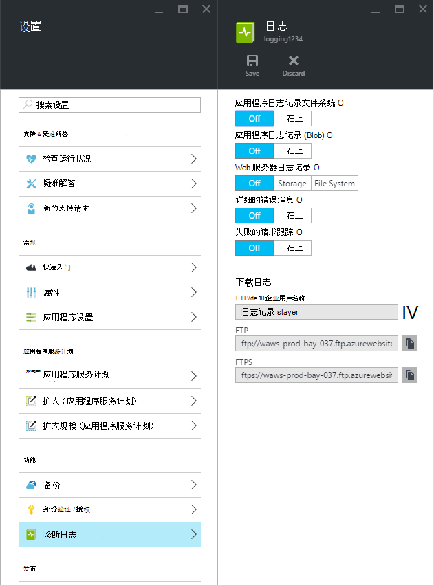
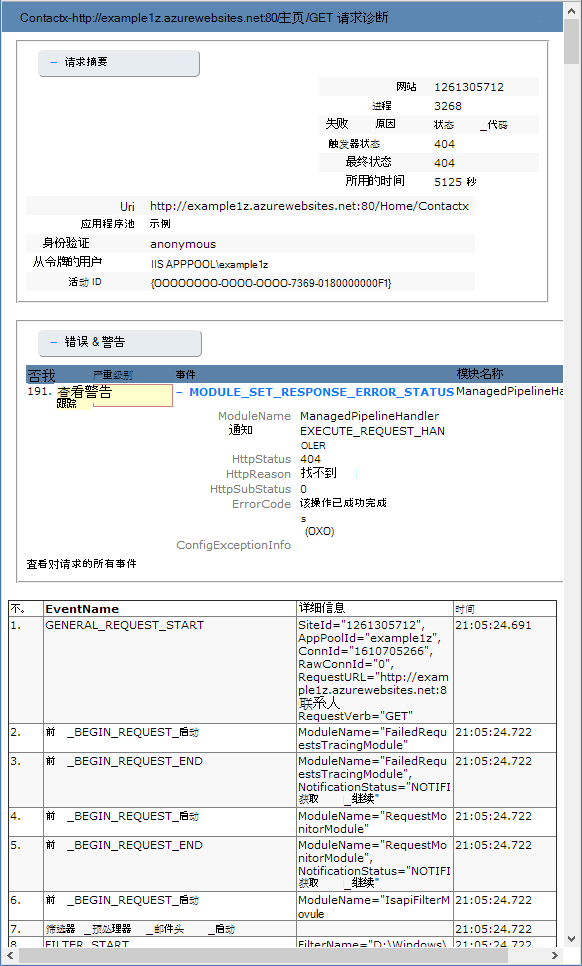

<properties
    pageTitle="启用诊断日志记录的 Azure 应用程序服务中的 web 应用程序"
    description="了解如何启用诊断日志记录并将工具添加到您的应用程序，以及如何访问通过 Azure 记录的信息。"
    services="app-service"
    documentationCenter=".net"
    authors="cephalin"
    manager="wpickett"
    editor="jimbe"/>

<tags
    ms.service="app-service"
    ms.workload="na"
    ms.tgt_pltfrm="na"
    ms.devlang="na"
    ms.topic="article"
    ms.date="06/06/2016"
    ms.author="cephalin"/>

# 启用诊断日志记录的 Azure 应用程序服务中的 web 应用程序

## 概述

Azure 提供内置诊断程序，以帮助进行调试[的应用程序服务 web 应用程序](http://go.microsoft.com/fwlink/?LinkId=529714)。 在本文中您将了解如何启用诊断日志记录并将工具添加到您的应用程序，以及如何访问通过 Azure 记录的信息。

本文使用[Azure 门户](https://portal.azure.com)、 Azure PowerShell 和 Azure 命令行界面 (Azure CLI) 来使用诊断日志。 处理使用 Visual Studio 的诊断日志的信息，请参阅[故障排除在 Visual Studio 中的 Azure](web-sites-dotnet-troubleshoot-visual-studio.md)。

[AZURE.INCLUDE [app-service-web-to-api-and-mobile](../../includes/app-service-web-to-api-and-mobile.md)]

## Web 服务器诊断程序和应用程序诊断

应用程序服务 web 应用程序提供 web 服务器和 web 应用程序的日志记录信息的诊断的功能。 这些逻辑上可分为**web 服务器诊断程序**和**应用程序诊断**。

### Web 服务器诊断

您可以启用或禁用以下类型的日志︰

- **详细错误日志记录**的详细的错误消息指示故障 （状态代码 400 或更高版本） 的 HTTP 状态代码。 这可能包含可帮助您确定服务器返回的错误代码的原因的信息。
- **失败请求跟踪**-失败的请求，其中包括用于处理请求和每个组件中所用的时间的 IIS 组件的跟踪的详细信息。 这很有用，如果您正试图提高站点性能，或者找出什么原因导致一个特定的 HTTP 错误，将返回。
- **Web 服务器记录**的有关 HTTP 事务使用[W3C 扩展的日志文件格式](http://msdn.microsoft.com/library/windows/desktop/aa814385.aspx)的信息。 在确定总体站点数处理的请求或多少请求是从一个特定的 IP 地址等的度量标准时，这非常有用。

### 应用程序诊断

应用程序诊断允许您捕获生成 web 应用程序的信息。 ASP.NET 应用程序可以使用[System.Diagnostics.Trace](http://msdn.microsoft.com/library/36hhw2t6.aspx)类在应用程序的诊断日志记录的信息。 例如︰

    System.Diagnostics.Trace.TraceError("If you're seeing this, something bad happened");

在运行时可以检索这些日志以帮助进行故障排除。 有关详细信息，请参阅[疑难解答 Azure 在 Visual Studio 中的 web 应用程序](web-sites-dotnet-troubleshoot-visual-studio.md)。

当您将内容发布到 web 应用程序时，应用程序服务 web 应用程序还记录部署信息。 这会自动发生，没有为部署日志记录配置设置。 部署日志让您能够确定部署失败的原因。 例如，如果您正在使用自定义部署脚本，可以使用部署日志记录以确定脚本失败的原因。

## 如何启用诊断

要启用[Azure 门户](https://portal.azure.com)中的诊断程序，请转到刀片式服务器为您的 web 应用程序，然后单击**设置 > 诊断日志**。

<!-- todo:cleanup dogfood addresses in screenshot -->

当您启用**应用程序诊断**也选择**级别**。 此设置允许您筛选信息捕获到**信息性**、**警告**或**错误**的信息。 将此值设置为**冗余**将记录生成的应用程序的所有信息。

> [AZURE.NOTE] 与更改 web.config 文件，启用应用程序诊断或更改诊断日志级别不会回收应用程序域中运行的应用程序。

在[经典门户](https://manage.windowsazure.com)Web 应用程序**配置**选项卡中，您可以选择**存储**或**文件系统** **web 服务器**进行日志记录。 选择**存储**，允许您选择存储帐户，然后将日志写入 blob 容器。 所有其他**站点诊断**日志被写入到的文件系统。

[经典的门户](https://manage.windowsazure.com)Web 应用程序**配置**选项卡还具有应用程序诊断的其他设置︰

* **文件系统**的存储为 web 应用程序文件系统应用程序的诊断信息。 这些文件可通过 FTP 访问或下载 Zip 存档使用 Azure PowerShell 或 Azure 命令行界面 (Azure CLI)。
* **表存储**-存储应用程序的诊断信息中指定的 Azure 存储帐户和表名称。
* **Blob 存储**-存储在指定的 Azure 存储帐户和 blob 容器应用程序的诊断信息。
* **保留期**— 默认情况下，日志不会自动删除从**blob 存储**。 选择**设置保留**并输入要保存日志，如果您想要自动删除日志的天数。

>[AZURE.NOTE] 如果您[重新生成您的存储帐户访问密钥](storage-create-storage-account.md#view-copy-and-regenerate-storage-access-keys)，您必须重置各自的日志配置，以使用更新的键。 若要此操作︰
>
> 1. 在**配置**选项卡中设相应的日志记录功能**关闭**。 保存您的设置。
> 2. 启用对存储帐户 blob 或表的记录再次。 保存您的设置。

文件系统、 表存储或 blob 存储的任何组合可以在同一时间，启用，且具有单独的日志级别配置。 例如，您可能希望记录错误和警告到 blob 存储作为长期记录解决方案，同时可以实现文件系统日志记录的详细级别。

虽然所有三个存储位置提供相同的记录的事件的基本信息，**表存储**和**blob 存储**登录实例 ID、 线程 ID 和更精细时间戳 （刻度线格式） 比记录等其他信息到**文件系统**。

> [AZURE.NOTE] 仅可以使用存储客户端或应用程序可以直接使用这些存储系统的访问**表存储**或**blob 存储**中存储的信息。 例如，Visual Studio 2013年包含可用来浏览表或 blob 存储，存储资源管理器和 HDInsight 可以访问 blob 存储中存储的数据。 您也可以编写通过[Azure Sdk](/downloads/#)访问 Azure 存储的应用程序。

> [AZURE.NOTE] 也可以使用**一组 AzureWebsite** cmdlet 的 Azure PowerShell 从启用诊断。 如果尚未安装 Azure PowerShell 或者没有配置它以使用 Azure 订阅，请参阅[如何使用 Azure PowerShell](/develop/nodejs/how-to-guides/powershell-cmdlets/)。

##如何︰ 下载日志

可以直接使用 FTP 访问存储在 web 应用程序文件系统的诊断信息。 它还可以下载 Zip 存档使用 Azure PowerShell 或 Azure 命令行界面。

日志被存储在目录结构如下所示︰

* **应用程序日志**-/LogFiles/应用程序 /。 此文件夹包含一个或多个包含生成的应用程序日志记录信息的文本文件。

* **失败请求跟踪**-/ 日志文件/W3SVC # # # /。 此文件夹包含一个 XSL 文件和一个或多个 XML 文件。 请确保您下载到同一目录的 XSL 文件为 XML 文件，因为 XSL 文件提供了用于格式化和筛选时在 Internet Explorer 中查看的 XML 文件的内容的功能。

* **详细的错误日志**-/LogFiles/DetailedErrors /。 此文件夹包含一个或多个提供大量信息，对已发生的任何 HTTP 错误的.htm 文件。

* **Web 服务器日志**-/LogFiles/http/RawLogs。 此文件夹包含一个或多个格式化使用[W3C 扩展的日志文件格式](http://msdn.microsoft.com/library/windows/desktop/aa814385.aspx)的文本文件。

* **部署日志**-/ 日志文件/Git。 此文件夹包含由 Azure 的 web 应用程序中，使用内部部署过程所生成日志以及 Git 部署日志。

### FTP

若要访问使用 FTP 的诊断信息，请访问[传统门户](https://manage.windowsazure.com)的 web 应用程序的**仪表板**。 在**快速浏览**部分，使用**FTP 诊断日志**的链接来访问使用 FTP 日志文件。 **部署/FTP 用户**条目，列出了用于访问 FTP 站点的用户名。

> [AZURE.NOTE] 如果未设置**部署/FTP 用户**条目，或者忘记了此用户的密码，可以通过使用**仪表板**的**快速浏览**部分**重新部署凭据设置**链接来创建新用户和密码。

### 使用 Azure PowerShell 下载

下载日志文件，启动 Azure PowerShell 的新实例，并使用下面的命令︰

    Save-AzureWebSiteLog -Name webappname

这将保存日志中所指定的 web 应用程序的**-名称**文件的参数命名为当前目录中的**logs.zip** 。

> [AZURE.NOTE] 如果尚未安装 Azure PowerShell 或者没有配置它以使用 Azure 订阅，请参阅[如何使用 Azure PowerShell](/develop/nodejs/how-to-guides/powershell-cmdlets/)。

### 下载使用 Azure 的命令行界面

若要下载日志文件使用 Azure 命令行界面，打开新的命令提示符，PowerShell、 大扫除或终端会话并输入以下命令︰

    azure site log download webappname

这将保存名为 webappname 到名为**diagnostics.zip**的当前目录中的文件的 web 应用程序的日志。

> [AZURE.NOTE] 如果尚未安装 Azure 命令行界面 (CLI 中 Azure)，或者没有配置它以使用 Azure 订阅，请参阅[如何使用 Azure CLI](../xplat-cli-install.md)。

## 如何︰ 查看记录在应用程序的见解

Visual Studio 应用程序见解提供了工具，为筛选和搜索日志，和相关要求和其他事件日志。

1. 在 Visual Studio 项目中添加应用程序深入 SDK。
 * 在解决方案资源管理器中右键单击项目并选择添加应用程序理解。 您将可指导您完成步骤，包括创建应用程序的见解资源。 [了解更多信息](../application-insights/app-insights-asp-net.md)
2. 向项目中添加跟踪侦听器包。
 * 右键单击项目，然后选择管理 NuGet 程序包。 选择`Microsoft.ApplicationInsights.TraceListener`[了解更多](../application-insights/app-insights-asp-net-trace-logs.md)
3. 上载您的项目并运行生成日志数据。
4. 在[Azure 门户](https://portal.azure.com/)中，浏览到新的应用程序理解资源，并打开**搜索**。 您将看到您的日志数据，以及请求、 用法和其他遥测。 一些遥测可能需要几分钟才能到达︰ 单击刷新。 [了解更多信息](../application-insights/app-insights-diagnostic-search.md)

[了解有关应用程序的见解与跟踪性能](../application-insights/app-insights-azure-web-apps.md)

##如何︰ 流式处理日志

在开发应用程序时，很有用，以接近实时的日志记录信息，请参阅。 这可以通过流式处理到您的开发环境使用 Azure PowerShell 或 Azure 命令行界面的日志记录信息。

> [AZURE.NOTE] 某些类型的日志记录的缓冲区写入日志文件，这可能会导致无序的事件流中。 例如，可能会出现在用户访问页面时的应用程序日志项显示在流中的页请求相应的 HTTP 日志项之前。

> [AZURE.NOTE] 日志流还流写入存储在任何文本文件信息**d:\\家庭\\日志文件\\**文件夹。

### 流与 Azure PowerShell

若要传输的日志记录信息，开始 Azure PowerShell 的一个新实例并使用下面的命令︰

    Get-AzureWebSiteLog -Name webappname -Tail

这将连接到指定的 web 应用程序**的名称**参数，并开始流到 PowerShell 窗口的信息，日志事件发生时，在 web 应用程序上。 写入文件.txt、.log，或.htm 结束 （日志文件 d: / 家庭） 的 /LogFiles 目录中存储的任何信息将流向本地控制台。

若要筛选特定的事件，如错误，使用**-消息**参数。 例如︰

    Get-AzureWebSiteLog -Name webappname -Tail -Message Error

若要筛选特定的日志类型，如 HTTP，使用**的路径**参数。 例如︰

    Get-AzureWebSiteLog -Name webappname -Tail -Path http

若要查看可用路径的列表，请使用-ListPath 参数。

> [AZURE.NOTE] 如果尚未安装 Azure PowerShell 或者没有配置它以使用 Azure 订阅，请参阅[如何使用 Azure PowerShell](/develop/nodejs/how-to-guides/powershell-cmdlets/)。

### 流与 Azure 的命令行界面

若要传输的日志记录信息、 打开新的命令提示符，PowerShell、 大扫除或终端会话并输入以下命令︰

    azure site log tail webappname

将连接到名为 webappname 的 web 应用程序并开始日志事件发生时在 web 应用程序流到窗口的信息。 写入文件.txt、.log，或.htm 结束 （日志文件 d: / 家庭） 的 /LogFiles 目录中存储的任何信息将流向本地控制台。

若要筛选特定的事件，如错误，使用**-筛选器**参数。 例如︰

    azure site log tail webappname --filter Error

若要筛选特定的日志类型，如 HTTP，使用**-路径**参数。 例如︰

    azure site log tail webappname --path http

> [AZURE.NOTE] 如果尚未安装 Azure 命令行界面，或者没有配置它以使用 Azure 订阅，请参阅[如何为使用 Azure 的命令行界面](../xplat-cli-install.md)。

##如何︰ 了解诊断日志

### 应用程序的诊断日志

应用程序诊断程序将信息存储在.NET 应用程序，具体取决于是否将存储到文件系统、 表存储或 blob 存储日志的特定格式。 基本的存储数据集跨所有三个存储类型的日期和时间的事件发生，产生该事件的事件类型 （信息、 警告、 错误），事件消息的进程 ID 是相同的。

__文件系统__

记录到文件系统或使用流式传输接收的每一行将以下面的格式︰

    {Date}  PID[{process id}] {event type/level} {message}

例如，显示类似于以下错误事件︰

    2014-01-30T16:36:59  PID[3096] Error       Fatal error on the page!

对文件系统的日志提供了三种可用的方法，提供时间、 进程 id、 事件级别和消息的最基本信息。

__表存储__

当记录到表存储时，使用其他属性以便进行搜索的表以及该事件的更精确信息中存储的数据。 对于每个实体 （行） 存储在表中使用下列属性 （列）。

属性名称|值/格式
---|---
PartitionKey|以 yyyyMMddHH 格式的事件的日期/时间
RowKey|唯一地标识此实体的 GUID 值
时间戳|日期和事件发生的时间
EventTickCount|日期和时间刻度的格式 （更高的精度） 事件发生
应用程序名称|Web 应用程序名称
级别|事件级别 （例如错误、 警告、 信息）
EventId|此事件的事件 ID

默认值为 0，如果没有指定
实例 Id|甚至出现了在 web 应用程序的实例
Pid|进程 ID
Tid|生成事件的线程的线程 ID
消息|事件详细信息消息

__Blob 存储__

当记录到 blob 存储时，会将数据存储在以逗号分隔值 (CSV) 格式。 类似于表存储附加字段记录提供事件的更详细信息。 以下属性用于 CSV 中的每一行︰

属性名称|值/格式
---|---
日期|日期和事件发生的时间
级别|事件级别 （例如错误、 警告、 信息）
应用程序名称|Web 应用程序名称
实例 Id|该事件发生在该 web 应用程序的实例
EventTickCount|日期和时间刻度的格式 （更高的精度） 事件发生
EventId|此事件的事件 ID

默认值为 0，如果没有指定
Pid|进程 ID
Tid|生成事件的线程的线程 ID
消息|事件详细信息消息

Blob 中存储的数据与以下类似︰

    date,level,applicationName,instanceId,eventTickCount,eventId,pid,tid,message
    2014-01-30T16:36:52,Error,mywebapp,6ee38a,635266966128818593,0,3096,9,An error occurred

> [AZURE.NOTE] 在此示例中表示，日志的第一行将包含列标题。

### 失败请求跟踪

失败的请求跟踪存储在 XML 文件中名为__fr ###.xml__。 为了更加轻松地查看记录的信息，为 XML 文件位于同一目录中提供了名为__freb.xsl__的 XSL 样式表。 在 Internet Explorer 中打开 XML 文件中的一个将使用的 XSL 样式表来提供跟踪信息的格式的显示。 这将类似于以下内容︰

### 详细的错误日志

详细的错误日志将被提供的 HTTP 错误的发生的更详细的信息的 HTML 文档。 因为它们是简单的 HTML 文档，他们可以使用 web 浏览器来查看。

### Web 服务器日志

使用[W3C 扩展的日志文件格式](http://msdn.microsoft.com/library/windows/desktop/aa814385.aspx)进行格式化的 web 服务器日志。 使用文本编辑器或分析[Log Parser](http://go.microsoft.com/fwlink/?LinkId=246619)等实用程序可以读取此信息。

> [AZURE.NOTE] 通过 Azure 的 web 应用程序生成的日志不支持__s 计算机名____的 ip__或__cs 版本__字段。

##下一步行动

- [如何监视 Web 应用程序](/manage/services/web-sites/how-to-monitor-websites/)
- [在 Visual Studio 中的故障排除 Azure 的 web 应用程序](web-sites-dotnet-troubleshoot-visual-studio.md)
- [分析 web 应用程序将记录在 HDInsight](http://gallery.technet.microsoft.com/scriptcenter/Analyses-Windows-Azure-web-0b27d413)

> [AZURE.NOTE] 如果您想要怎样的 Azure 帐户之前开始使用 Azure 应用程序服务，请转到[尝试应用程序服务](http://go.microsoft.com/fwlink/?LinkId=523751)，立即可以在此创建短期的初学者 web 应用程序在应用程序服务。 没有信用卡，所需;没有承诺。

## 会发生什么变化
* 有关更改网站为应用程序服务的指南，请参阅︰ [Azure 应用程序服务，并对现有的 Azure 服务及其影响](http://go.microsoft.com/fwlink/?LinkId=529714)
* 旧的门户与新门户的更改的指南，请参阅︰[用于导航的 Azure 门户的引用](http://go.microsoft.com/fwlink/?LinkId=529715)
 
