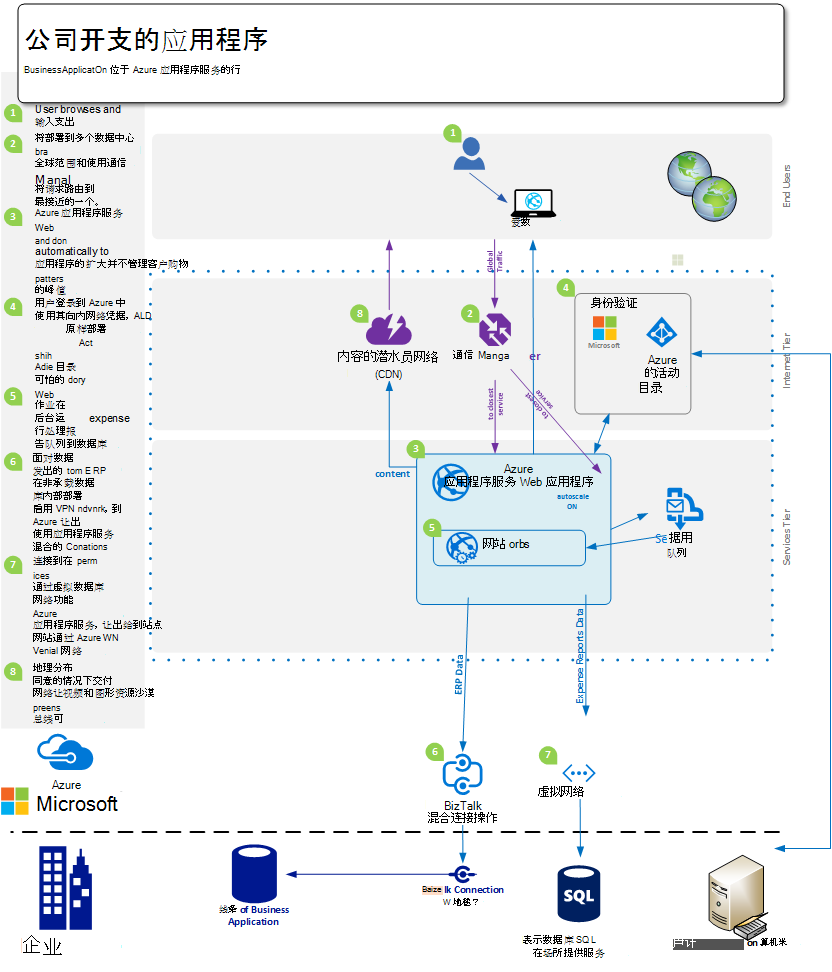
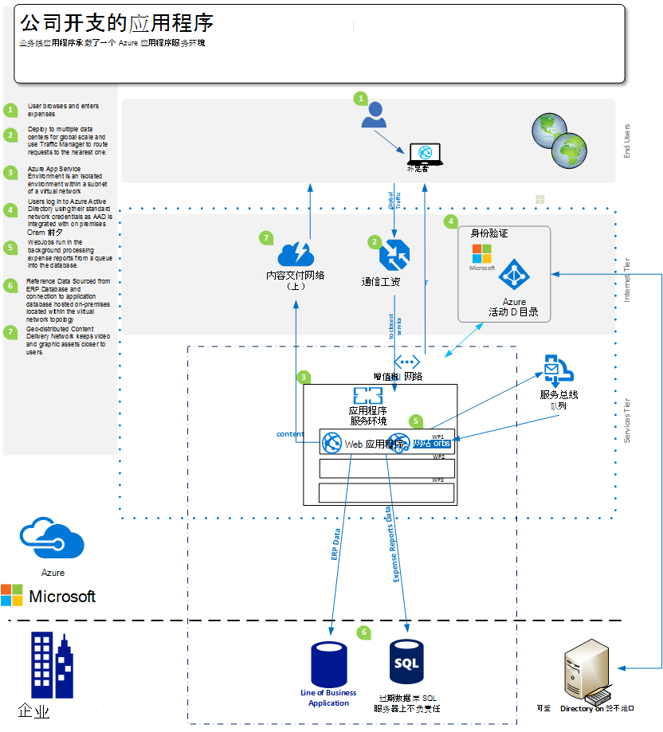
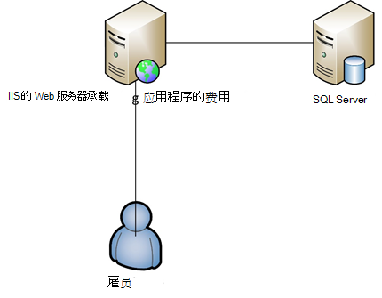

<properties 
    pageTitle="针对企业的 azure 应用程序服务 Web 应用程序产品" 
    description="演示如何使用 Azure 应用程序服务 Web 应用程序，创建企业网站解决方案为您的业务" 
    services="app-service\web" 
    documentationCenter="" 
    authors="apwestgarth" 
    manager="wpickett" 
    editor=""/>

<tags 
    ms.service="app-service-web" 
    ms.workload="web" 
    ms.tgt_pltfrm="na" 
    ms.devlang="na" 
    ms.topic="article" 
    ms.date="07/29/2016" 
    ms.author="anwestg"/>

# 针对企业白皮书的 azure 应用程序服务 Web 应用程序产品 #

需要降低成本，在瞬息万变的环境中提供更快的 IT 解决方案的开发人员、 IT 专业人员和管理人员带来新的挑战。 用户越来越多地寻求他们的业务线 (LOB) web 应用程序快速、 响应速度快，而且可从任何设备。 同时，公司正在尝试利用提高了生产效率和来自云和移动服务与集成的效率，可能是作为单一登录简单跨设备使用 Active Directory 中 Office365 的协作使用来自反过来拉入数据与销售队伍的公司实现的内部 LOB 应用程序的数据。 [Azure 应用程序服务 Web 应用程序](http://go.microsoft.com/fwlink/?LinkId=529714)是用于开发、 测试和运行 web 和移动应用程序、 Web Api 和一般网站企业级云服务。 它可以用于全球规模和可用性，以及支持持续集成优化的数据中心的网络上运行的公司网站、 intranet 站点、 业务应用程序和数字市场营销活动和现代 DevOps 做法。  

本白皮书重点介绍了专门针对 LOB 的 Web 应用程序，内容涵盖现有的 web 应用程序迁移和部署新 LOB web 应用程序平台上运行的[Web 应用程序](/services/app-service/web/)服务的能力。 

## 访问群体 ##

IT 专业人员、 架构师和管理人员都希望迁移到当前正在运行内部云 web 负载。 公司为员工或是合作伙伴 web 应用程序的业务可以跨 web 工作负载。

## 介绍 ##

应用程序服务 Web 应用程序是时间的一个理想的平台，对其承载外部和内部 web 应用程序和服务，它提供了经济高效、 高可扩展性、 管理解决方案使您能够将精力集中在提供业务价值的用户，而不是时间的花费大量和金钱维护和支持单独的环境。 Web 应用程序提供了一个灵活的平台，对其部署企业 web 应用程序提供这一能力继续对内部通过集成与 Microsoft Azure Active Directory 的 Active Directory 进行身份验证支持的制作变得简单而快速部署使用您内部持续集成和部署的做法，同时自动缩放比例增长的业务需求-在使您能够专注于您的应用程序和基础结构不受管理平台上。 

## 问题定义 ##

IT 领域正在迅速改变，从传统的服务器上承载其过高的资金成本与上长的前置时间为使用按需使用的自动缩放处理负载的服务。 IT 部门所面临的难题是降低成本和占地面积的基础设施和维护花费，重点降低资金开支，同时也在不断增加的灵活性。 旧的基础设施平台，如 Windows Server 2003 中，生命的结束领先的 IT 部门能够查看云迁移作为潜在的方法来避免新的长期资本成本。 在过去，首席信息官会使购买决策的其他部门;但是，越来越多地 CMOs 和其他业务单位负责人也会需要在如何花费他们的预算和他们的投资回报是什么更积极的作用。 越来越多公司都需要其劳动力要比以往更加移动与员工远程工作、 与客户需要访问系统有条不紊花费更多时间。

每月、 每周、 每日业务需求的变化。 公司正在寻找即时全球范围内，与正则由第三方或内部提供的新功能的完整的更新服务。  在某些情况下企业还在寻找能够找出他们的应用程序和对资源的访问，同时还要使公有云设施的使用。 用户有更高的期望，与许多使用中如 Office365 自己私人生活的服务。 他们希望他们的工作生活中有权访问类似，最新的功能丰富的服务。 应对这一需求，IT 必须外观来帮助企业可以通过选择以及与第三方集成启用此服务，小心选择的可适应业务需要，同时也被降低了总体拥有成本与可靠平台。

开发团队希望带来即时的商业利益，在经常的基础上提供的新功能。 他们正在寻找经济高效、 可靠的平台集成与他们现有的工具和做法 – 开发、 测试、 发布;并与 IT 部门的工作自动化部署、 管理和报警，都具有停机时间为零的目标。

<a href="highlevel" />
## 高级别的解决方案 ##

Web 平台和框架越来越多地被用于开发、 测试和承载业务线应用程序。  与典型业务线应用程序，例如内部员工支出系统，通常由单独的 web 应用程序与备份数据库来存储与应用程序相关联的数据。

应用程序服务 Web 应用程序是一个不错的选择，用于承载该应用程序，提供了可扩展性和可靠性的基础结构的管理和使用修补接近零的手动干预和停机时间。 Microsoft Azure 平台提供了很多数据存储选项，以支持从 Microsoft Azure SQL 数据库，托管扩展关系数据库作为-服务，从我们的合作伙伴 ClearDB MySQL 数据库和 MongoDB 等普遍服务的 Web 应用程序上承载的 web 应用程序。

另一种方法是使您的现有投资上的场所使用。 在示例方案中，雇员支出系统，您可能希望维护内部基础结构在数据存储区。 这可用于集成与内部系统 （报告、 工资、 计费等） 或能够满足 IT 治理要求。  Web 应用程序提供了多种方法使您能够连接到您的部署基础结构︰

- [应用程序服务环境](app-service-app-service-environment-intro.md)的应用程序服务环境 (ASE) 是一种新的高级功能是最近添加到 Microsoft Azure 应用程序服务。  ASEs 提供充分独立和专用程序安全地在高比例同时也提供隔离和安全网络访问运行 Azure 应用程序服务的应用程序环境   
- [混合连接](../biztalk-services/integration-hybrid-connection-overview.md)— 混合连接是微软 Azure BizTalk 服务功能并启用 Web 应用程序连接到在场所资源安全，例如 SQL Server，MySQL，Web Api 和自定义 web 服务。 
- [虚拟网络集成](https://azure.microsoft.com/blog/2014/09/15/azure-websites-virtual-network-integration/)— 与 Azure 虚拟网络的 Web 应用程序集成，可将您的 web 应用程序连接到 Azure 虚拟网络，又可以在内部部署基础结构通过站点到站点 VPN 连接。 

下面的图表描述了与连接的选项，用于内部部署的资源示例高级别的解决方案。  第一个示例演示如何做到这一点使用 Azure 应用程序服务的标准功能和第二部分演示如何可以实现使用特优服务，应用服务的环境。

使用标准的应用程序服务功能︰

使用服务的应用程序环境︰

## 业务方面的好处 ##

应用程序服务 Web 应用程序提供了大量的商业利益使函数能够更加经济高效、 灵活提供满足业务需求。 

### PaaS 模型 ###

应用程序服务 Web 应用程序会生成一个平台，作为一种服务模型，它提供了大量的成本和效率成本节约。  您不再需要花时间管理虚拟机、 修补操作系统和框架。 Web 应用程序是一个自动修补的环境，这使您可以集中精力管理您的 web 应用程序和不 Vm，离开团队可用来提供更多业务价值。

PaaS 模型基础 Web 应用程序启用 DevOps 方法的专业人员来完成他们的目标。 作为一项业务，这意味着全面管理和集成应用程序整个生命周期内，包括开发、 测试、 发布、 监控和管理和支持。 

为开发团队可以从 Visual Studio 的团队服务，GitHub、 TeamCity、 编写或 BitBucket，启用自动操作的构建、 测试和部署周期同时减少摩擦所涉及的释放在现有的基础结构使更快地发布配置连续集成和部署工作流。 Web 应用程序还支持创建多个测试环境和临时环境发布工作流，不再需要保留或分配用于这些目的的硬件，您可以创建多个环境并且定义您自己的升级发布工作流。 从源代码管理发布到测试插槽，则执行一系列的测试，并成功完成时可以决定公司提升为舞台插槽和最后换到生产环境，而不需要停机，不但承载 Web 应用程序的 web 应用程序预加载和热提供尽可能好的客户体验。  此外公司可以利用生产功能的应用程序服务 Web 应用程序中测试指引到另一个插槽的通信部分，验证所做的更改之前切换到新部署的所有通信，或恢复到以前的部署的所有通信。 

运营团队可以确信它们处于最可能位置响应任何问题与任何其承载 Web 应用程序上使用内置的 web 应用程序中的监视和警报功能。 应运营团队已经投资分析和监控解决方案这样从 Microsoft Visual Studio 应用的见解、 新的 Relic 和 AppDynamics。 这些还完全支持的 Web 应用程序启用连续性和监视 web 应用程序的熟悉环境。

最后，Web 应用程序提供了自动备份您的 app(s) 的功能，并承载的数据库直接到 Azure Blob 存储容器。 为您提供简便方式且非常经济有效的方法用来恢复的灾难，可减少在内部部署硬件和软件上的复杂。

### 方便迁移 ###

硬件维护和旋转是对硬件和操作系统的发布周期加快面向企业的一个关键问题。 也许有大量即将终止的支持在 2015年到 Windows Server 2003 R2 服务器，但它们仍然承载关键的 web 应用程序为您的业务？ 应用程序服务 Web 应用程序是非常适合的宿主的 web 应用程序和要合理化业务硬件房地产。 Web 应用程序可以访问各种硬件规格的管理和维护服务，因而不需要基础设施预算的一部分考虑更换和管理成本的一部分。  迁移可以是很简单的复制和粘贴现有部署到 Web 应用程序或更复杂的迁移操作，使用 Web 应用程序迁移助手会添加值。 迁移的 web 应用程序可享受 Azure 服务，集成到 web 应用程序的额外服务的全部。 例如，您可以考虑添加 Azure Active Directory 来控制对基于用户的安全组的关联应用程序的访问。 总体缓存服务，以提高性能并减少等待时间，提供更好的用户体验，可以添加另一个示例。 

### 企业类宿主 ###

应用程序服务 Web 应用程序提供稳定、 可靠的平台，这已被证明能够处理各种各样的业务需要从小型内部开发和测试工作负载，高比例的高流量网站。 通过使用 Web 应用程序，将使用相同的企业类宿主平台的公司为高值 web 工作负载使用 Microsoft。 Web 应用程序，以及在 Azure 平台上，所有的服务都内蕴安全性和法规遵从管理法规要求，如 ISO (ISO/IEC 27001:2005);SOC1 和 SOC2 SSAE 16/ISAE 3402 Attestations、 HIPAA BAA，PCI 和 Fedramp，最核心的每个元素和功能的详细信息，请参阅[http://aka.ms/azurecompliance](/support/trust-center/compliance/)。 

Microsoft Azure 平台让角色基于授权控件启用企业级控制对 Web 应用程序中的资源。 RBAC 为企业提供了通过将用户分配到组并反过来将所需的权限分配给这些组被如 web 应用程序资产在 Azure 环境中，实现自己访问管理策略的所有资产的能力。 RBAC 在 Azure 中的详细信息，请参阅[http://aka.ms/azurerbac](../active-directory/role-based-access-control-configure.md)。 通过使用 Web 应用程序，您可以确保安全稳妥的环境中部署 web 应用程序，您可以完全控制您的资产部署到哪个区域。 

Azure 应用程序服务环境[http://aka.ms/aseintro](http://aka.ms/aseintro)是新特优服务计划选项对于希望利用 Azure 应用程序服务的企业客户，这提供了一个完全独立、 专用的环境。  这将使企业客户能够部署的应用程序可以充分利用的非常高的比例，同时还具有完全入站和出站网络流量控制和 ASEs 使应用程序能够通过内部资源的虚拟网络具有高速安全连接。

应用程序服务 Web 应用程序也是能够通过提供能够连接回您的内部资源，如数据仓库或 SharePoint 环境中充分利用您在部署方面的投资。 如[高级别解决方案](#highlevel)中的讨论可以使混合连接和虚拟网络连接用于建立连接的部署基础结构和服务。

### 全球范围内 ###

应用程序服务 Web 应用程序是业务的一个全球性的和可扩展的平台，使您的 web 应用程序来扩展并适应日益增长需求的迅速和具有最小的长期规划和成本。 在典型的内部部署基础结构方案，扩展的需求增长同时本地及在地理位置上将需要大量的管理、 规划和资源调配的支出和管理附加的基础结构。 Web 应用程序提供了扩展 ebb 流的需求与 web 应用程序的能力。 例如使用费用应用程序为例，每月的大部分用户是轻用户的应用程序，但作为截止日期提交开支要输入每月使用率提高了对应用程序、 Web 应用程序能够自动配置您的应用程序基础架构，然后一旦减少使用再次它还可以扩展到您定义的基准基础结构。

Web 应用程序可在 24 数据中心分布在全球的和不断增长的全球范围。 有关的区域和位置的最新列表，请参阅[http://aka.ms/azlocations](http://aka.ms/azlocations)。 与 Web 应用程序，您的业务能够轻松地达到全球市场和规模。 随着公司的发展为新的地区，报告应用程序使用的仪表板和 Web 应用程序上的主机可以轻松地部署到其他数据中心，服务于本地用户通过 Web 应用程序和 Azure 流量管理器，提供额外的可扩展的基础架构下能够合同和根据区域办事处更改需要展开所有的组合得更快。
 
## 解决方案详细信息 ##

让我们看一下应用程序迁移方案的示例。 这概括介绍了如何应用程序服务 Web 应用程序功能一起提供好的解决方案和业务价值的详细信息。
 
本示例在整个业务应用程序，我们将讨论一行是报告应用程序，使员工能够提交其报销费用的支出。 在运行 IIS6 Windows Server 2003 R2 上承载的应用程序和数据库是 SQL Server 2005 数据库。 因此我们选择旧服务器在于未来最终的服务的 Windows Server 2003 R2 和 SQL Server 2005 中，和我们拥有[的工具](http://aka.ms/websitesmigration)和[指南](http://aka.ms/websitesmigrationresources)以自动迁移工作负载分配到 Azure。 这一点，在此示例中使用的模式适用于各种实际的迁移方案。 

### 现有应用程序迁移 ###

一个移动 Web 应用程序的业务线应用程序的总体解决方案的步骤是确定现有应用程序资产和体系结构。 本文中的示例是 ASP.NET web 应用程序托管单个 IIS 服务器上驻留在单独的 SQL Server 数据库，如下图中所示。 员工登录到系统中使用的用户名和密码组合，进入费用的详细信息并将扫描的份收据上, 传到数据库中，对于每一项的开支。 
 

#### 要考虑的事项 ####

当内部环境中的迁移应用程序，可能想要记住一点，几个 Web 应用程序的约束。 以下是需要注意的迁移到 Web 应用程序 ([http://aka.ms/websitesmigrationresources](http://aka.ms/websitesmigrationresources)) 的 web 应用程序时某些关键主题︰

-   端口绑定 — Web 应用程序仅支持端口 80 的 HTTP 和 HTTPS 通信的端口 443。 如果您的应用程序使用其他端口，则一次迁移应用程序将使用 HTTP 端口 80 和端口 443 HTTPS 通信。 这通常是因为它是常见于在内部部署进行无害的问题才能解决的域名，特别是在开发和测试环境中使用不同端口的使用
-   身份验证--Web 应用程序支持匿名身份验证默认下，窗体身份验证应用程序标识。 Web 应用程序可以提供 Windows 身份验证时仅与 Azure Active Directory 和 ADF 集成应用程序。 这是一种功能，更详细地讨论了[这里](http://aka.ms/azurebizapp) 
-   Gac 中基于程序集--Web 应用程序不允许部署到全局程序集缓存 (GAC) 中的程序集。 因此，如果要迁移应用程序利用此功能内部部署，请考虑将这些程序集移动到应用程序的 bin 文件夹。
-   IIS5 兼容性模式-Web 应用程序不支持 IIS5 兼容模式，并且每个 Web 应用程序实例，并在父 Web 应用程序实例的所有 web 应用程序在单个应用程序池中相同的工作进程的运行这种情况下。
-   使用 COM 库--Web 应用程序不允许在平台上注册的 COM 组件。 因此如果应用程序正在使用的任何 COM 组件，这些需要用托管代码重写，并且与应用程序一起部署。
-   可以在 Web 应用程序支持 ISAPI 筛选器 – ISAPI 筛选器。 他们将需要部署该应用程序的一部分，并在 web 应用程序的 web.config 文件中注册。 有关详细信息，请参阅[http://aka.ms/azurewebsitesxdt](web-sites-transform-extend.md)。 

一旦这些主题已考虑，web 应用程序应准备好云。 别担心，如果不能完全满足某些主题，迁移工具将迁移到给予最大的努力。 

在迁移过程中的下一个步骤是创建一个应用程序服务 web 应用程序和一个 Azure 的 SQL 数据库。 有多个大小不同的 CPU 内核的数量与 Web 应用程序实例和 RAM 量可供您选择基于 web 的应用程序要求。 有关详细信息和定价，请参阅[http://aka.ms/azurewebsitesskus](/pricing/details/websites/)。 同样，Microsoft Azure SQL 数据库解决了所有的业务需求与各种服务层和性能级别以满足需求。 在[http://aka.ms/azuresqldbskus](/pricing/details/sql-database/)可以找到详细信息。 创建后，应用程序上载到应用程序服务 Web 应用程序，通过 FTP 或 WebDeploy，然后移动到数据库。

在此迁移过程中的解决方案使用 SQL Azure 数据库，但就是不支持的 Azure 的唯一数据库。 公司还可以利用 MySQL，MongoDB，Azure DocumentDB 和更多通过加载项可以在[Azure 存储](/marketplace/partner-program/)购买。 

创建一个 Azure 的 SQL 数据库时大量选项都可以从内部服务器从生成到使用[数据层应用程序导出和导入](http://aka.ms/dacpac)现有数据库的脚本导入现有数据库。 

创建支出应用数据库通过创建一个新的 Azure SQL 数据库、 连接到数据库，使用 SQL Server 管理 Studio，然后运行脚本生成数据库架构和内部数据库中的数据填充它。

在迁移此第一阶段的最后一步需要更新到应用程序数据库的连接字符串。 这可以通过 Azure 的门户。 对于每个 web 应用程序中，您可以修改应用程序特定的设置，包括任何由应用程序用于连接到任何正在使用的数据库的连接字符串。

### 使用 SQL Azure 数据库的替代方法 ###

Azure 平台提供了多个 SQL Azure 数据库用作 web 应用程序的主数据库的备用方案，这是为了使不同的工作负载，即 使用 NoSQL 解决方案的或使该平台能够满足业务的数据需求。 例如，业务现场或在公共云环境中，可能会保存不会存储的数据，因此将希望使用其内部数据库的维护。

#### 对内部资源的连接 ####
应用程序服务 Web 应用程序提供了使重用现有的高价值基础结构上部署资源，例如数据库、 连接到多个选项。 选项包括如下所示︰

- 应用程序服务环境隔离，并且创建一个虚拟网络的子网中从而使环境与位于同一虚拟网络- [http://aka.ms/appserviceasenetworking](http://aka.ms/appserviceasenetworking)的专用端点进行通信
- Web 应用程序虚拟网络集成支持 Web 应用程序和 Azure 虚拟网络，使您可以访问运行在您虚拟的网络，这样，如果连接到有站点到站点 VPN，您在部署网络连接直接连接到您系统上的本地资源之间的集成。
- 混合连接是 Azure BizTalk 服务功能，并提供便于连接到单个内部资源如 SQL Server、 MySQL，HTTP Web Api 和大多数自定义的 Web 服务。

#### 比例和可恢复性 ####

随着业务的增长其职工，通过收购或自然的有机增长，因此必须过 web 应用程序进行扩展以满足这些新的要求。 实际上今天是常见的并存的团队和远程员工甚至更好地传播，例如设有办事处在美国、 欧洲和亚洲，与移动销售公司强制在很多更多的区域。 Web 应用程序具有舒适并自动处理弹性比例更改的功能。

应用程序服务 Web 应用程序，web 应用程序配置为通过 Azure 的门户，这取决于两个向量 – 安排时间或按 CPU 使用情况自动缩放。 Web 应用程序自动缩放提供成本效益和非常灵活的方式满足客户的所有业务应用程序，从 web 应用程序，如到市场营销的短暂时间内提升的体验高突发流量的网站我们报销系统的使用情况的更大变化。 有关详细信息以及指导缩放 web 应用程序使用 Web 应用程序，请参阅[如何扩展网站](web-sites-scale.md)。

除 Web 应用程序的缩放灵活性，整个平台跨多个数据中心和地理区域使业务连续性和可恢复性，通过 web 应用程序可能分布和其资产。

## 摘要 ##
应用程序服务 Web 应用程序提供灵活、 经济高效、 响应及时的解决方案业务在快速发展环境中的动态需求。 Web 应用程序可帮助企业提高生产效率，并具有现代 DevOps 功能和管理，减少了的手的托管平台的使用在规模、 复原、 安全和内部资产与集成的企业功能的同时使效率。

## 行动 ##
有关更多信息 Azure 应用程序服务 Web 应用程序服务，其中可以获得更多的信息，请访问[http://aka.ms/enterprisewebsites](/services/websites/enterprise/)和符号功能的试用版，今天在[http://aka.ms/azuretrial](/pricing/free-trial/)评估服务，并发现对您的业务好处。

[AZURE.INCLUDE [app-service-web-whats-changed](../../includes/app-service-web-whats-changed.md)]

[AZURE.INCLUDE [app-service-web-try-app-service](../../includes/app-service-web-try-app-service.md)]
 
 
