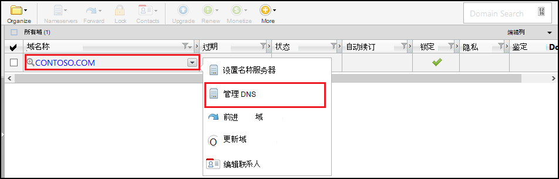
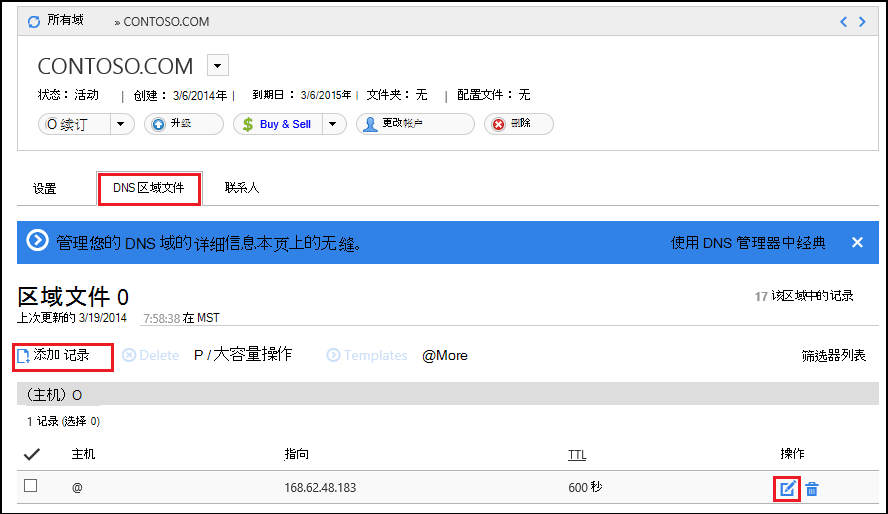
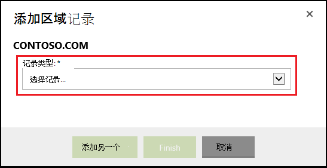
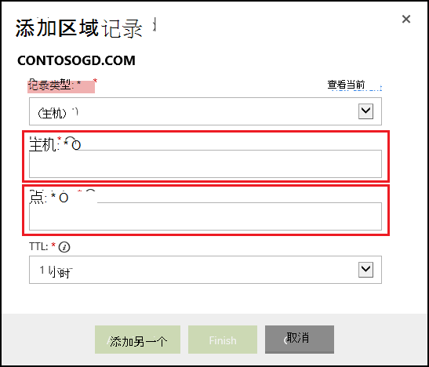

<properties
    pageTitle="在 Azure 应用程序服务 (GoDaddy) 配置自定义域名"
    description="了解如何从 GoDaddy 域名使用 Azure Web 应用程序"
    services="app-service"
    documentationCenter=""
    authors="erikre"
    manager="wpickett"
    editor="jimbe"/>

<tags
    ms.service="app-service"
    ms.workload="na"
    ms.tgt_pltfrm="na"
    ms.devlang="na"
    ms.topic="article"
    ms.date="01/12/2016"
    ms.author="cephalin"/>

# 在 Azure 应用程序服务 （直接从 GoDaddy 购买） 配置自定义域名

[AZURE.INCLUDE [web-selector](../../includes/websites-custom-domain-selector.md)]

[AZURE.INCLUDE [intro](../../includes/custom-dns-web-site-intro.md)]

如果您已购买到 Azure 应用程序服务 Web 应用程序的域然后参考[购买用于 Web 应用程序的域](custom-dns-web-site-buydomains-web-app.md)的最后一个步骤。

本文使用直接从[应用程序服务 Web 应用程序](http://go.microsoft.com/fwlink/?LinkId=529714)与[GoDaddy](https://godaddy.com)购自定义域名提供指导。

[AZURE.INCLUDE [introfooter](../../includes/custom-dns-web-site-intro-notes.md)]

##了解 DNS 记录

[AZURE.INCLUDE [understandingdns](../../includes/custom-dns-web-site-understanding-dns-raw.md)]

## 添加您自定义的域的 DNS 记录

要您自定义的域相关联的应用程序服务 web 应用程序，您必须添加一个新条目在 DNS 表中为您自定义的域通过由 GoDaddy 的工具。 使用以下步骤查找 DNS 工具为 GoDaddy.com

1. 登录到您的帐户 GoDaddy.com，然后选择**我的帐号**，然后**管理我的域**。 最后，选择您想要使用 Azure 的 web 应用程序，然后选择**管理 DNS**域名下拉菜单。

    

2. 从**域的详细信息**页上，滚动到**DNS 区域文件**选项卡。 这是用于添加和修改您的域名的 DNS 记录的部分。

    

    选择要添加的现有记录的**添加记录**。

    **编辑**现有记录，请选中记录旁边的笔和纸张图标。

    > [AZURE.NOTE] 在添加新记录前, 请注意 GoDaddy 已经创建的流行子域 （在编辑器中，称为**主机**） 如**电子邮件**、**文件**、**邮件**，和其他 DNS 记录。 如果您想要已经使用的名称存在，修改现有的记录，而不是创建一个新。

4. 在添加记录时，您必须首先选择记录类型。

    

    接下来，您必须提供**主机**（自定义的域或子域），它**指向**。

    

    * 添加**A （主机） 记录**-时必须将**主机**字段设置为**@**（这表示根域名称，如**contoso.com**，） *（通配符匹配的多个子域） 或要使用的子域 (例如， * *www**。)您必须设置**指向** 到 Azure 的 web 应用程序的 IP 地址字段。

    * 添加**CNAME （别名） 记录**-必须将**主机**字段设为您想要使用的子域。 例如，为**www**。 您必须将**指向**字段设置为**。 azurewebsites.net** Azure 的 web 应用程序的域名。 例如， **contoso.azurewebsites.net**。

5. 单击**添加另一个**。
6. 选择**TXT**作为记录类型，然后指定**主机**值**@**和一个**指向**值的**&lt;yourwebappname&gt;。 azurewebsites.net**。

    > [AZURE.NOTE] 此 TXT 记录使用 Azure 来验证自己所描述的 A 记录或第一个 TXT 记录的域。 一旦域已被映射到在 Azure 门户 web 应用程序，则可以删除此 TXT 记录条目。

5. 当您完成添加或修改记录，请单击**完成**以保存更改。

## 使您的 web 应用程序的域名称

[AZURE.INCLUDE [modes](../../includes/custom-dns-web-site-enable-on-web-site.md)]

>[AZURE.NOTE] 如果您想要怎样的 Azure 帐户之前开始使用 Azure 应用程序服务，请转到[尝试应用程序服务](http://go.microsoft.com/fwlink/?LinkId=523751)，立即可以在此创建短期的初学者 web 应用程序在应用程序服务。 没有信用卡，所需;没有承诺。

## 会发生什么变化
* 有关更改网站为应用程序服务的指南，请参阅︰ [Azure 应用程序服务，并对现有的 Azure 服务及其影响](http://go.microsoft.com/fwlink/?LinkId=529714)
