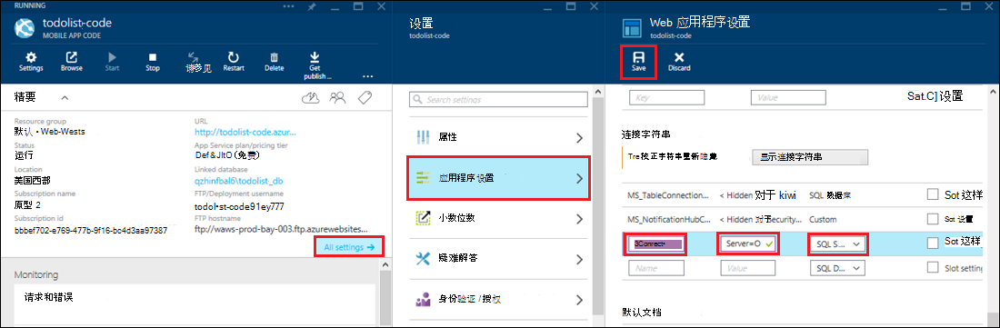

<properties 
    pageTitle="在 Azure 应用程序服务使用混合连接来访问本地资源" 
    description="创建一个 web 应用程序在 Azure 应用程序服务和内部资源，它使用一个静态的 TCP 端口之间的连接" 
    services="app-service" 
    documentationCenter="" 
    authors="cephalin" 
    manager="wpickett" 
    editor="mollybos"/>

<tags 
    ms.service="app-service" 
    ms.workload="na" 
    ms.tgt_pltfrm="na" 
    ms.devlang="na" 
    ms.topic="article" 
    ms.date="02/03/2016" 
    ms.author="cephalin"/>

#在 Azure 应用程序服务使用混合连接来访问本地资源

您可以连接到任何内部资源，它使用一个静态的 TCP 端口，如 SQL Server、 MySQL，HTTP Web Api 和大多数自定义的 Web 服务的 Azure 应用程序服务的应用程序。 这篇文章演示了如何创建混合应用程序服务和本地 SQL Server 数据库之间的连接。

> [AZURE.NOTE] 混合连接功能的 Web 应用程序部分是仅在[Azure 门户](https://portal.azure.com)中可用。 在 BizTalk 服务中创建的连接，请参阅[混合连接](http://go.microsoft.com/fwlink/p/?LinkID=397274)。 
> 
> 此内容也适用于在 Azure 应用程序服务的移动应用程序。 

## 系统必备组件
- Azure 的订阅。 免费订阅，请参阅[Azure 免费试用版](https://azure.microsoft.com/pricing/free-trial/)。 
 
    如果您想要怎样的 Azure 帐户之前开始使用 Azure 应用程序服务，请转到[尝试应用程序服务](http://go.microsoft.com/fwlink/?LinkId=523751)，立即可以在此创建短期的初学者 web 应用程序在应用程序服务。 没有信用卡，所需;没有承诺。

- 若要使用内部部署 SQL Server 数据库或 SQL Server Express 数据库混合连接，需要静态端口上启用 TCP/IP。 因为它使用静态端口 1433年，建议使用 SQL Server 默认实例。 有关安装和配置 SQL Server Express 与混合连接配合使用的信息，请参阅[连接到内部部署 SQL Server 从 Azure 的 web 站点使用混合连接](http://go.microsoft.com/fwlink/?LinkID=397979)。

- 在本文稍后部分安装所述内部混合连接管理器代理的计算机︰

    - 必须能够通过 5671 端口连接到 Azure
    - 必须能够到达*主机名称*︰*端口号*的内部资源。 

> [AZURE.NOTE] 这篇文章中的步骤假定您使用的浏览器从计算机将承载内部混合连接代理程序。

## 在 Azure 门户网站中创建 web 应用程序 ##

> [AZURE.NOTE] 如果您已经创建了 web 应用程序或移动应用程序的后端在 Azure 门户，您想要使用在本教程中，您可以跳到[创建混合连接和 BizTalk 服务](#CreateHC)，并从这里开始。

1. 在[Azure 门户](https://portal.azure.com)的左上角，单击**新建** > **Web + 移动** > **Web 应用程序**。
    
    ![新的 web 应用程序][NewWebsite]
    
2. 在**Web 应用程序**刀片式服务器，提供一个 URL，然后单击**创建**。 
    
    ![网站名称][WebsiteCreationBlade]
    
3. 过一会，创建 web 应用程序和其 web 应用程序刀片出现。 刀片式服务器是一个垂直方向滚动的仪表板，使您能够管理您的站点。
    
    ![运行的网站][WebSiteRunningBlade]
    
4. 若要验证该网站处于活动状态，可以单击**浏览**图标以显示的默认页。
    
    ![单击浏览以查看您的 web 应用程序][Browse]
    
    ![默认 web 应用程序页][DefaultWebSitePage]
    
接下来，您将创建一个混合连接和 BizTalk 服务 web 应用程序。

## 创建一个混合连接和 BizTalk 服务 ##

1. 在您的 web 应用程序刀片式服务器上**所有设置**单击 > **网络** > **配置混合连接终结点**。
    
    ![混合连接][CreateHCHCIcon]
    
2. 在混合连接刀片式服务器，单击**添加**。
    
    <!-- ![Add a hybrid connnection][CreateHCAddHC]
-->
    
3. 将打开**添加混合连接**刀片式服务器。  由于这是您第一次混合连接，预先选择的**新的混合连接**选项，并为您**创建混合连接**刀片式服务器打开。
    
    ![创建一个混合连接][TwinCreateHCBlades]
    
    在**创建混合连接刀片**具有︰
    - 对于**名称**提供连接的名称。
    - 对于**主机名**，请输入所需资源的内部计算机的名称。
    - 对于**端口**，请输入内部资源使用 (SQL Server 默认实例的 1433) 的端口号。
    - 单击**Biz 交谈服务**

4. 打开**创建的 BizTalk 服务**刀片式服务器。 为 BizTalk 服务，输入一个名称，然后单击**确定**。
    
    ![创建 BizTalk 服务][CreateHCCreateBTS]
    
    **创建的 BizTalk 服务**刀片式服务器关闭，您将返回到**创建混合连接**刀片式服务器。
    
5. 在创建混合连接刀片式服务器，请单击**确定**。 
    
    ![单击确定][CreateBTScomplete]
    
6. 当该过程完成后时，通知区域中的门户将通知您已成功创建该连接。
    < ！---托多

    在此步骤中，一切都将失败。 我无法试用门户中创建的 BizTalk 服务。 切换到经典的门户网站 （完整门户），并创建的 BizTalk 服务，但看起来没有使您可以连接它们完成创建混合连接步骤后，您将收到以下错误未能创建混合连接 RelecIoudHC。 名称空间 'Microsoft.BizTaIkServices 的 api 版本 2014年-06-01 中找不到的资源类型。
    
    该错误指示它找不到类型，而不是实例。
    ![成功通知][CreateHCSuccessNotification]
    -->
7. 在 web 应用程序的刀片，**混合连接**图标现在显示已创建了 1 个混合连接。
    
    ![创建一个混合连接][CreateHCOneConnectionCreated]
    
此时，您已完成云混合连接基础结构的重要组成部分。 接下来，您将创建相应的内部部分。

## 安装内部混合连接管理器才能完成连接 ##

1. 在 web 应用程序的刀片式服务器，单击**所有设置** > **网络** > **配置混合连接终结点**。 
    
    ![混合的连接图标][HCIcon]
    
2. 在**混合连接**刀片式服务器，最近添加终结点的**状态**列中显示**未连接**。 单击要配置的连接。
    
    ![未连接][NotConnected]
    
    打开混合连接刀片式服务器。
    
    ![NotConnectedBlade][NotConnectedBlade]
    
3. 在刀片式服务器，单击**侦听器设置**。
    
    ![单击侦听器设置][ClickListenerSetup]
    
4. 打开刀片式服务器**混合连接属性**。 在**内部部署混合连接管理器**中，选择**要安装，请单击此处**。
    
    ![若要安装，请单击此处][ClickToInstallHCM]
    
5. 在应用程序运行安全警告对话框中，选择**运行**以继续。
    
    ![选择运行以继续][ApplicationRunWarning]
    
6.  在**用户帐户控制**对话框中，选择**是**。
    
    ![选择是][UAC]
    
7. 下载并安装用于您混合连接管理器。 
    
    ![安装][HCMInstalling]
    
8. 当安装完成时，单击**关闭**。
    
    ![单击关闭][HCMInstallComplete]
    
    在**混合连接**刀片式服务器，**状态**列现在显示**已连接**。 
    
    ![连接的状态][HCStatusConnected]

现在，混合连接基础结构已完成，可以创建一个混合应用程序，使用它。 

>[AZURE.NOTE]以下各节说明了如何与后端移动应用程序的.NET 项目使用混合连接。

## 移动应用程序的.NET 后端将项目配置为连接到 SQL Server 数据库

在应用程序服务移动应用程序的.NET 后端项目是只是 ASP.NET web 应用程序与其他的移动应用程序 SDK 安装和初始化。 若要为移动应用程序的后端使用 web 应用程序，您必须[下载并初始化移动应用程序的.NET 后端 SDK](../app-service-mobile/app-service-mobile-dotnet-backend-how-to-use-server-sdk.md#install-sdk)。  

用于移动应用程序，您还需要定义内部数据库的连接字符串和修改的后端，以使用此连接。 

1. 在解决方案资源管理器在 Visual Studio 中，打开您的移动应用程序的.NET 后端的 Web.config 文件，找到**connectionStrings**部分，添加一个新的 SqlClient 条目，如下所示，指向本地 SQL Server 数据库︰

        <add name="OnPremisesDBConnection"
         connectionString="Data Source=OnPremisesServer,1433;
         Initial Catalog=OnPremisesDB;
         User ID=HybridConnectionLogin;
         Password=<**secure_password**>;
         MultipleActiveResultSets=True"
         providerName="System.Data.SqlClient" />

    请记住，替换`<**secure_password**>` *HybridConnectionLogin*为您创建的密码与此字符串中。

3. 单击**保存**保存 Web.config 文件的 Visual Studio 中。

    > [AZURE.NOTE]在本地计算机上运行时使用此连接的设置。 Azure 中运行时，此设置将覆盖在门户中定义的连接设置。

4. 展开**模型**文件夹，然后打开数据模型文件中，在*Context.cs*中结束。

6. 修改**DbContext**实例构造函数传递值`OnPremisesDBConnection`基**DbContext**构造函数类似于下面的代码段︰

        public class hybridService1Context : DbContext
        {
            public hybridService1Context()
                : base("OnPremisesDBConnection")
            {
            }
        }

    服务现在将使用 SQL Server 数据库的新连接。

## 更新移动应用程序后端要使用的内部连接字符串

接下来，您需要添加此新的连接字符串的应用程序设置，以便可以从 Azure 使用它。  

1. 回在[Azure 的门户网站](https://portal.azure.com)在您的移动应用程序的 web 应用程序后端代码，请单击**所有设置**，再选择**应用程序设置**。

3. 在**Web 应用程序设置**刀片式服务器，向下滚动到**连接字符串**并添加名为新的**SQL Server**连接字符串`OnPremisesDBConnection`类似的值与`Server=OnPremisesServer,1433;Database=OnPremisesDB;User ID=HybridConnectionsLogin;Password=<**secure_password**>`。

    更换`<**secure_password**>`与本地数据库的安全密码。

    

2. 按**保存**以保存的混合连接和您刚创建的连接字符串。

此时您可以重新发布服务器项目并测试与您现有的手机应用程序客户端的新连接。 将读取和写入使用混合连接的内部数据库数据。

## 下一步行动 ##

- 有关创建 ASP.NET web 应用程序使用混合连接的信息，请参阅[连接到内部部署 SQL Server 从 Azure 的 web 站点使用混合连接](http://go.microsoft.com/fwlink/?LinkID=397979)。 

### 其他资源

[混合连接概述](http://go.microsoft.com/fwlink/p/?LinkID=397274)

[乔什扭转引入了混合连接 （频道 9 视频）](http://channel9.msdn.com/Shows/Azure-Friday/Josh-Twist-introduces-hybrid-connections)

[混合连接 web 站点](https://azure.microsoft.com/services/biztalk-services/)

[BizTalk 服务︰ 仪表板、 显示器、 比例、 配置和混合连接选项卡](../biztalk-services/biztalk-dashboard-monitor-scale-tabs.md)

[构建无缝应用程序可移植性 (视频频道 9) 与真实的混合云](http://channel9.msdn.com/events/TechEd/NorthAmerica/2014/DCIM-B323#fbid=)

[从 Azure 移动服务使用混合连接 （频道 9 视频） 连接到内部部署 SQL Server](http://channel9.msdn.com/Series/Windows-Azure-Mobile-Services/Connect-to-an-on-premises-SQL-Server-from-Azure-Mobile-Services-using-Hybrid-Connections)

## 会发生什么变化
* 有关更改网站为应用程序服务的指南，请参阅︰ [Azure 应用程序服务，并对现有的 Azure 服务及其影响](http://go.microsoft.com/fwlink/?LinkId=529714)

<!-- IMAGES -->
[New]:./media/web-sites-hybrid-connection-get-started/B01New.png
[NewWebsite]:./media/web-sites-hybrid-connection-get-started/B02NewWebsite.png
[WebsiteCreationBlade]:./media/web-sites-hybrid-connection-get-started/B03WebsiteCreationBlade.png
[WebSiteRunningBlade]:./media/web-sites-hybrid-connection-get-started/B04WebSiteRunningBlade.png
[Browse]:./media/web-sites-hybrid-connection-get-started/B05Browse.png
[DefaultWebSitePage]:./media/web-sites-hybrid-connection-get-started/B06DefaultWebSitePage.png
[CreateHCHCIcon]:./media/web-sites-hybrid-connection-get-started/C01CreateHCHCIcon.png
[CreateHCAddHC]:./media/web-sites-hybrid-connection-get-started/C02CreateHCAddHC.png
[TwinCreateHCBlades]:./media/web-sites-hybrid-connection-get-started/C03TwinCreateHCBlades.png
[CreateHCCreateBTS]:./media/web-sites-hybrid-connection-get-started/C04CreateHCCreateBTS.png
[CreateBTScomplete]:./media/web-sites-hybrid-connection-get-started/C05CreateBTScomplete.png
[CreateHCSuccessNotification]:./media/web-sites-hybrid-connection-get-started/C06CreateHCSuccessNotification.png
[CreateHCOneConnectionCreated]:./media/web-sites-hybrid-connection-get-started/C07CreateHCOneConnectionCreated.png
[HCIcon]:./media/web-sites-hybrid-connection-get-started/D01HCIcon.png
[NotConnected]:./media/web-sites-hybrid-connection-get-started/D02NotConnected.png
[NotConnectedBlade]:./media/web-sites-hybrid-connection-get-started/D03NotConnectedBlade.png
[ClickListenerSetup]:./media/web-sites-hybrid-connection-get-started/D04ClickListenerSetup.png
[ClickToInstallHCM]:./media/web-sites-hybrid-connection-get-started/D05ClickToInstallHCM.png
[ApplicationRunWarning]:./media/web-sites-hybrid-connection-get-started/D06ApplicationRunWarning.png
[UAC]:./media/web-sites-hybrid-connection-get-started/D07UAC.png
[HCMInstalling]:./media/web-sites-hybrid-connection-get-started/D08HCMInstalling.png
[HCMInstallComplete]:./media/web-sites-hybrid-connection-get-started/D09HCMInstallComplete.png
[HCStatusConnected]:./media/web-sites-hybrid-connection-get-started/D10HCStatusConnected.png
 