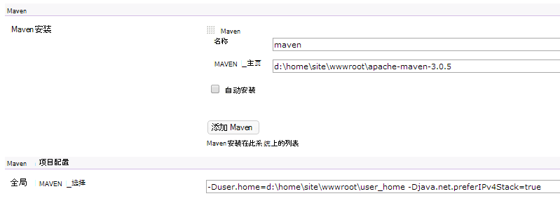

<properties 
    pageTitle="将自定义的 Java web 应用程序上传到 Azure" 
    description="本教程演示了如何将自定义的 Java web 应用程序上传到 Azure 应用程序服务 Web 应用程序。" 
    services="app-service\web" 
    documentationCenter="java" 
    authors="rmcmurray" 
    manager="wpickett" 
    editor=""/>

<tags 
    ms.service="app-service-web" 
    ms.workload="web" 
    ms.tgt_pltfrm="na" 
    ms.devlang="Java" 
    ms.topic="article" 
    ms.date="08/11/2016" 
    ms.author="robmcm"/>

# 将自定义的 Java web 应用程序上传到 Azure

本主题说明如何将自定义的 Java web 应用程序上传到[Azure 应用程序服务]Web 应用程序。 包括是适用于所有的 Java 网站或 web 应用程序，并且还为特定应用程序的一些示例的信息。

请注意 Azure 用于在[创建 Java web 应用程序在 Azure 应用程序服务中的](web-sites-java-get-started.md)所述创建 Java web 应用程序使用 Azure 门户的配置界面，界面和 Azure 的市场上，提供一种方式。 本教程是为情况不需要在其中使用 Azure 门户配置用户界面或 Azure 市场。  

## 配置指南

以下描述预期在 Azure 上的自定义 Java web 应用程序的设置。

- 动态分配的 Java 进程使用的 HTTP 端口。  该进程必须使用的端口从环境变量`HTTP_PLATFORM_PORT`。
- 应禁用单个 HTTP 侦听程序以外的所有侦听端口。  在 Tomcat，包括关机、 HTTPS 和 AJP 端口。
- 该容器需要配置只用于 IPv4 通讯。
- 适用于应用程序的**启动**命令需要在配置设置。
- 需要目录的应用程序编写的权限需要位于 Azure 的 web 应用程序的内容目录，这是**D:\home**。  环境变量`HOME`指的是 D:\home。  

在 web.config 文件中，可以根据需要设置环境变量。

## web.config httpPlatform 配置

以下信息描述 web.config 中的**httpPlatform**格式。
                                 
**参数**(默认值 ="")。 可执行文件或脚本**processPath**设置中指定的参数。

（显示与包括**processPath** ） 的示例︰

    processPath="%HOME%\site\wwwroot\bin\tomcat\bin\catalina.bat"
    arguments="start"
    
    processPath="%JAVA_HOME\bin\java.exe"
    arguments="-Djava.net.preferIPv4Stack=true -Djetty.port=%HTTP\_PLATFORM\_PORT% -Djetty.base=&quot;%HOME%\site\wwwroot\bin\jetty-distribution-9.1.0.v20131115&quot; -jar &quot;%HOME%\site\wwwroot\bin\jetty-distribution-9.1.0.v20131115\start.jar&quot;"

**processPath** -路径的可执行文件或脚本启动侦听 HTTP 请求的过程。

示例︰

    processPath="%JAVA_HOME%\bin\java.exe"

    processPath="%HOME%\site\wwwroot\bin\tomcat\bin\startup.bat"

    processPath="%HOME%\site\wwwroot\bin\tomcat\bin\catalina.bat"
                                                                                       
**rapidFailsPerMinute**(默认值 = 10。)在**processPath**中指定的进程允许每分钟崩溃次数。 如果超过此限制时， **HttpPlatformHandler**将无法启动一分钟的剩余时间内的过程。
                                    
**requestTimeout**(默认值 ="00: 02:00"。)持续时间为其**HttpPlatformHandler**将等待从进程侦听响应`%HTTP_PLATFORM_PORT%`。

**startupRetryCount**(默认值 = 10。)**HttpPlatformHandler**将尝试启动**processPath**中指定的进程次数。 **启动时间限制**的更多详细信息，请参阅。

**启动时间限制**(默认值 = 10 秒钟。)**HttpPlatformHandler**将等待开始侦听端口的进程的可执行文件/脚本的持续时间。  如果超过该时间限制时， **HttpPlatformHandler**将终止的进程，并尝试启动它再次的**startupRetryCount**倍。
                                                                                      
**stdoutLogEnabled**(默认值 ="true"。)如果为 true，则**标准输出**和**stderr** **processPath**设置中指定的进程将被重定向到**stdoutLogFile**中指定的文件 （参见**stdoutLogFile**节）。
                                    
**stdoutLogFile**(Default="d:\home\LogFiles\httpPlatformStdout.log"。)**标准输出**和**stderr**从**processPath**中指定的进程记录的绝对文件路径。
                                    
> [AZURE.NOTE] `%HTTP_PLATFORM_PORT%`是一个特殊的占位符，它们需要指定为**参数**的一部分或为**httpPlatform** **environmentVariables**列表的一部分。 这将替换由内部生成的**HttpPlatformHandler**端口，以便由**processPath**指定的进程可以在此端口上侦听。

## 部署

在大多数与 Internet Information Services (IIS) 使用的相同方式可以轻松地部署基于的 web 的应用程序的 Java 基于 web 的应用程序。  FTP、 Git 和 Kudu 所有支持作为部署机制是为 web 应用程序集成的 SCM 功能。 WebDeploy 的工作原理，作为协议，但是，如不是 Java 开发在 Visual Studio 中，WebDeploy 不适合与 Java web 应用程序部署用例。

## 应用程序配置示例

对于以下应用程序的 web.config 文件，应用程序作为示例，以演示如何启用应用程序服务 Web 应用程序上的 Java 应用程序提供了配置。

### Tomcat
虽然在 Tomcat 上提供与应用程序服务 Web 应用程序的两种形式，它仍然是很有可能要上载客户特定实例。 下面是安装 Tomcat 与其他 Java 虚拟机 (JVM) 的示例。

    <?xml version="1.0" encoding="UTF-8"?>
    <configuration>
      <system.webServer>
        <handlers>
          <add name="httpPlatformHandler" path="*" verb="*" modules="httpPlatformHandler" resourceType="Unspecified" />
        </handlers>
        <httpPlatform processPath="%HOME%\site\wwwroot\bin\tomcat\bin\startup.bat" 
            arguments="">
          <environmentVariables>
            <environmentVariable name="CATALINA_OPTS" value="-Dport.http=%HTTP_PLATFORM_PORT%" />
            <environmentVariable name="CATALINA_HOME" value="%HOME%\site\wwwroot\bin\tomcat" />
            <environmentVariable name="JRE_HOME" value="%HOME%\site\wwwroot\bin\java" /> <!-- optional, if not specified, this will default to %programfiles%\Java -->
            <environmentVariable name="JAVA_OPTS" value="-Djava.net.preferIPv4Stack=true" />
          </environmentVariables>
        </httpPlatform>
      </system.webServer>
    </configuration>

在 Tomcat 的一侧，有几个需要进行的配置更改。 Server.xml 需要编辑设置︰

-   关闭端口 =-1
-   连接器的 HTTP 端口 = ${port.http}
-   HTTP 连接器地址 ="127.0.0.1"
-   注释掉 HTTPS 和 AJP 连接器
-   此外可以设置可以在其中添加的 catalina.properties 文件中的 IPv4 设置`java.net.preferIPv4Stack=true`
    
应用程序服务 Web 应用程序不支持 Direct3d 调用。 若要禁用的那些，添加下面的 Java 选项应您的应用程序进行此类调用︰`-Dsun.java2d.d3d=false`

### Jetty

Tomcat 是这种情况，则客户可以为 Jetty 上载它们自己的实例。 如果运行的 Jetty 完整安装，配置如下所示︰

    <?xml version="1.0" encoding="UTF-8"?>
    <configuration>
      <system.webServer>
        <handlers>
          <add name="httppPlatformHandler" path="*" verb="*" modules="httpPlatformHandler" resourceType="Unspecified" />
        </handlers>
        <httpPlatform processPath="%JAVA_HOME%\bin\java.exe" 
             arguments="-Djava.net.preferIPv4Stack=true -Djetty.port=%HTTP_PLATFORM_PORT% -Djetty.base=&quot;%HOME%\site\wwwroot\bin\jetty-distribution-9.1.0.v20131115&quot; -jar &quot;%HOME%\site\wwwroot\bin\jetty-distribution-9.1.0.v20131115\start.jar&quot;"
            startupTimeLimit="20"
          startupRetryCount="10"
          stdoutLogEnabled="true">
        </httpPlatform>
      </system.webServer>
    </configuration>

Jetty 配置需要更改在设置 start.ini `java.net.preferIPv4Stack=true`。

### Springboot
为了获得 Springboot 运行您的应用程序需要上载您的 JAR 或 WAR 文件，并添加下面的 web.config 文件。 Web.config 文件转到 wwwroot 文件夹。 Web.config 中调整参数，以指向您的 JAR 文件，在下面的示例在 wwwroot 文件夹也位于 JAR 文件。  

    <?xml version="1.0" encoding="UTF-8"?>
    <configuration>
      <system.webServer>
        <handlers>
          <add name="httpPlatformHandler" path="*" verb="*" modules="httpPlatformHandler" resourceType="Unspecified" />
        </handlers>
        <httpPlatform processPath="%JAVA_HOME%\bin\java.exe"
            arguments="-Djava.net.preferIPv4Stack=true -Dserver.port=%HTTP_PLATFORM_PORT% -jar &quot;%HOME%\site\wwwroot\my-web-project.jar&quot;">
        </httpPlatform>
      </system.webServer>
    </configuration>

### 编写

我们的测试使用编写 3.1.2 战争和默认的 Tomcat 7.0.50 实例而不使用用户界面来设置操作。  由于编写软件构建工具，建议将其安装在专用位置**AlwaysOn**标志都可以设置使 web 应用程序的实例。

1. 在 web 应用程序的根目录下，即为**d:\home\site\wwwroot**，创建**webapps**目录 （如果尚不存在），并将 Hudson.war 放在**d:\home\site\wwwroot\webapps**。
2. 下载 apache maven 3.0.5 （与编写） 并将其放置在**d:\home\site\wwwroot**中。
3. 在**d:\home\site\wwwroot**中创建 web.config 并粘贴以下内容︰
    
        <?xml version="1.0" encoding="UTF-8"?>
        <configuration>
          <system.webServer>
            <handlers>
              <add name="httppPlatformHandler" path="*" verb="*" 
        modules="httpPlatformHandler" resourceType="Unspecified" />
            </handlers>
            <httpPlatform processPath="%AZURE_TOMCAT7_HOME%\bin\startup.bat"
        startupTimeLimit="20"
        startupRetryCount="10">
        <environmentVariables>
          <environmentVariable name="HUDSON_HOME" 
        value="%HOME%\site\wwwroot\hudson_home" />
          <environmentVariable name="JAVA_OPTS" 
        value="-Djava.net.preferIPv4Stack=true -Duser.home=%HOME%/site/wwwroot/user_home -Dhudson.DNSMultiCast.disabled=true" />
        </environmentVariables>            
            </httpPlatform>
          </system.webServer>
        </configuration>

    此时该 web 应用程序可以重新启动以使所做的更改。  连接到 http://yourwebapp/hudson 开始编写。

4. 编写配置本身后，您应看到下面的屏幕︰

    
    
5. 访问编写配置页︰**管理编写**，请单击，然后单击**配置系统**。
6. 配置 JDK，如下所示︰

    

7. 配置 Maven，如下所示︰

    

8. 保存设置。 现在，编写应配置完成并可供使用。

编写的其他信息，请参阅[http://hudson-ci.org](http://hudson-ci.org)。

### Liferay

在应用程序服务 Web 应用程序中支持 Liferay。 由于 Liferay 可能需要大量内存，使 web 应用程序需要在一个中型或大型专门工作人员，它可以提供足够的内存上运行。 Liferay 还需要几分钟才能启动。 由于这个原因，建议您将 web 应用程序设置为**始终打开**。  

使用 Tomcat Liferay 6.1.2 社区版 GA3 捆绑在一起，在下载 Liferay 后编辑以下文件︰

**Server.xml**

- 关闭端口更改为-1。
- 更改 HTTP 连接到连接器      `<Connector port="${port.http}" protocol="HTTP/1.1" connectionTimeout="600000" address="127.0.0.1" URIEncoding="UTF-8" />`
- 注释掉 AJP 连接器。

在**liferay\tomcat-7.0.40\webapps\ROOT\WEB-INF\classes**文件夹中，创建一个名为**门户 ext.properties**文件。 此文件应包含一个行，如下所示︰

    liferay.home=%HOME%/site/wwwroot/liferay

在相同目录级别的 tomcat 7.0.40 文件夹，创建一个名为使用以下内容**web.config**文件︰

    <?xml version="1.0" encoding="UTF-8"?>
    <configuration>
      <system.webServer>
        <handlers>
    <add name="httpPlatformHandler" path="*" verb="*"
         modules="httpPlatformHandler" resourceType="Unspecified" />
        </handlers>
        <httpPlatform processPath="%HOME%\site\wwwroot\tomcat-7.0.40\bin\catalina.bat" 
                      arguments="run" 
                      startupTimeLimit="10" 
                      requestTimeout="00:10:00" 
                      stdoutLogEnabled="true">
          <environmentVariables>
      <environmentVariable name="CATALINA_OPTS" value="-Dport.http=%HTTP_PLATFORM_PORT%" />
      <environmentVariable name="CATALINA_HOME" value="%HOME%\site\wwwroot\tomcat-7.0.40" />
            <environmentVariable name="JRE_HOME" value="D:\Program Files\Java\jdk1.7.0_51" /> 
            <environmentVariable name="JAVA_OPTS" value="-Djava.net.preferIPv4Stack=true" />
          </environmentVariables>
        </httpPlatform>
      </system.webServer>
    </configuration>

在**httpPlatform**块下， **requestTimeout**设置"00: 10:00"。  它可以降低但那么您很可能会看到某些超时错误，而引导 Liferay。  如果更改了此值，然后在 tomcat server.xml **connectionTimeout**也应进行修改。  

值得注意指向 64 位 JDK 上面 web.config 中指定了 JRE_HOME 环境 varariable。 默认值为 32 位，但因为 Liferay 可能需要大量的内存，建议使用 64 位 JDK。

一旦您进行这些更改，请重新启动您的 web 应用程序运行 Liferay，然后打开 http://yourwebapp。 Liferay 门户可从 web 应用程序根目录。 

## 下一步行动

Liferay 有关详细信息，请参阅[http://www.liferay.com](http://www.liferay.com)。

有关 Java 的详细信息，请参见[Java 开发人员中心](/develop/java/)。

[AZURE.INCLUDE [app-service-web-whats-changed](../../includes/app-service-web-whats-changed.md)]

[AZURE.INCLUDE [app-service-web-try-app-service](../../includes/app-service-web-try-app-service.md)]
 
 
<!-- External Links -->
[Azure 应用程序服务]: http://go.microsoft.com/fwlink/?LinkId=529714
