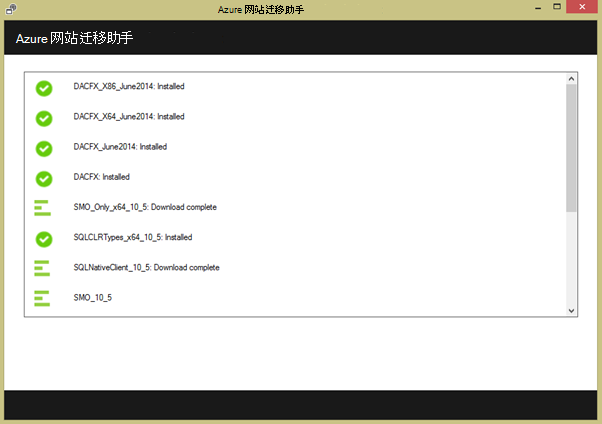
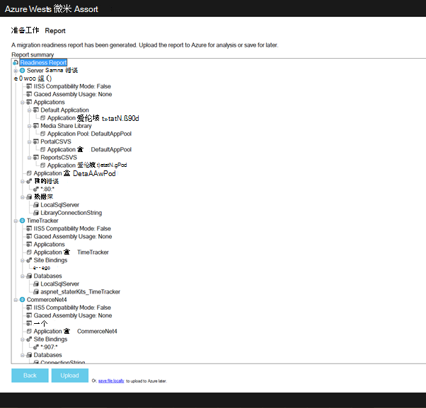
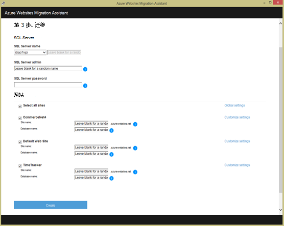

<properties 
    pageTitle="将企业 web 应用程序迁移到 Azure 应用程序服务" 
    description="演示如何使用 Web 应用程序迁移助手迅速将现有 IIS 网站迁移到 Azure 应用程序服务 Web 应用程序" 
    services="app-service" 
    documentationCenter="" 
    authors="cephalin" 
    writer="cephalin" 
    manager="wpickett" 
    editor=""/>

<tags 
    ms.service="app-service" 
    ms.workload="na" 
    ms.tgt_pltfrm="na" 
    ms.devlang="na" 
    ms.topic="article" 
    ms.date="07/01/2016" 
    ms.author="cephalin"/>

# 将企业 web 应用程序迁移到 Azure 应用程序服务

您可以轻松地迁移您现有的网站在 Internet 信息服务 (IIS) 6 或更高版本的[应用程序服务 Web 应用程序](http://go.microsoft.com/fwlink/?LinkId=529714)运行。 

>[AZURE.IMPORTANT] Windows Server 2003 到达末尾在 7 月 14 2015年的支持。 如果您当前正在主持您的 IIS 服务器上的网站是 Windows Server 2003，Web 应用程序是低风险、 低成本和低摩擦的办法保持在线，您的网站和 Web 应用程序迁移助手可以帮助您自动化迁移过程。 

[Web 应用程序迁移助手](https://www.movemetothecloud.net/)可以分析您的 IIS 服务器安装，确定哪些站点可以迁移到应用程序服务，突出显示不迁移或不受支持的平台上的任何元素然后再将您的网站和相关联的数据库迁移到 Azure。

[AZURE.INCLUDE [app-service-web-to-api-and-mobile](../../includes/app-service-web-to-api-and-mobile.md)]

## 在兼容性分析过程验证的元素 ##
迁移助手创建准备报表，以确定任何问题或阻塞的问题，可能导致从内部 IIS 成功迁移到 Azure 应用程序服务 Web 应用程序的潜在原因。 一些需要注意的要点是︰

-   端口绑定 — Web 应用程序仅支持端口 80 的 HTTP，端口 443 HTTPS 通信。 不同的端口配置将被忽略，通信将被路由至 80 或 443。 
-   身份验证--Web 应用程序支持匿名身份验证默认下，窗体身份验证由应用程序指定的位置。 可以通过仅将与 Azure Active Directory 和 ADF 集成使用 Windows 身份验证。 当前不支持的身份验证-例如，基本身份验证-所有其他窗体。 
-   全局程序集缓存 (GAC) – gac 中不支持 Web 应用程序中。 如果您的应用程序引用通常部署到 gac 中的程序集，您将需要部署到 Web 应用程序中的应用程序 bin 文件夹。 
-   IIS5 兼容模式 – 这不支持 Web 应用程序。 
-   应用程序池 – 在 Web 应用程序、 每个站点和它的子应用程序运行在相同的应用程序池。 如果您的站点有多个的子应用程序使用多个应用程序池，将它们合并到通用设置单个应用程序池或每个应用程序迁移到一个单独的 web 应用程序。
-   COM 组件-Web 应用程序不允许在平台上注册的 COM 组件。 如果您的网站或应用程序进行的任何 COM 组件使用，必须在托管代码中重新编写这些并将它们部署的网站或应用程序。
-   ISAPI 筛选器 – Web 应用程序可以支持使用 ISAPI 筛选器。 您需要执行下列操作︰
    -   部署与您的 web 应用程序 Dll 
    -   注册使用[Web.config](http://www.iis.net/configreference/system.webserver/isapifilters)的 Dll
    -   将 applicationHost.xdt 文件放置在站点根目录与下面的内容︰

            <?xml version="1.0"?>
            <configuration xmlns:xdt="http://schemas.microsoft.com/XML-Document-Transform">
            <configSections>
                <sectionGroup name="system.webServer">
                  <section name="isapiFilters" xdt:Transform="SetAttributes(overrideModeDefault)" overrideModeDefault="Allow" />
                </sectionGroup>
              </configSections>
            </configuration>

        有关如何与您的网站使用 XML 文档转换的更多示例，请参阅[转换 Microsoft Azure 网站](http://blogs.msdn.com/b/waws/archive/2014/06/17/transform-your-microsoft-azure-web-site.aspx)。

-   其他组件如 SharePoint，首页服务器扩展 (FPSE) FTP，SSL 证书将不会迁移。

## 如何使用 Web 应用程序迁移助手 ##
通过一个示例来迁移几个网站，使用 SQL Server 数据库和内部部署 Windows Server 2003 R2 (IIS 6.0) 的计算机上运行此部分步骤︰

1.  在 IIS 服务器或客户端计算机上定位到[https://www.movemetothecloud.net/](https://www.movemetothecloud.net/) 

    

2.  **专用 IIS 服务器**的按钮上单击安装 Web 应用程序迁移助手。 在不久的将来，更多的选项将作为选项。 
4.  单击**安装工具**按钮，在您的计算机上安装 Web 应用程序迁移助手。

    

    >[AZURE.NOTE] 您还可以单击**下载脱机安装**下载 ZIP 文件在未连接到 internet 的服务器上安装。 或者，您可以单击**上载现有迁移准备工作报告**，这是一个高级的选项，以使用现有迁移准备情况报告以前生成的 （稍后解释）。

5.  在**应用程序安装**屏幕上，单击**安装**以在您的计算机上安装。 如果需要它还将安装相应的依赖项，如 Web 部署、 DacFX 和 IIS。 

    

    安装完成后，Web 应用程序迁移助手将自动启动。
  
6.  选择**迁移站点和远程服务器到 Azure 数据库**。 输入远程服务器的管理凭据，并单击**继续**。 

    

    您当然可以选择从本地服务器迁移。 远程选项非常有用，当您想迁移从 IIS 生产服务器的网站。
 
    此时，迁移工具将检查您的 IIS 服务器的配置，例如网站、 应用程序、 应用程序池和依赖项来确定用于迁移的候选网站。 

8.  下面的屏幕快照显示了三个网站 –**默认 Web 站点**、 **TimeTracker**和**CommerceNet4**。 所有这些都要迁移关联的数据库。 选择所有想要评估，然后单击**下一步**的站点。

    
 
9.  请单击**上载**上载准备情况报告。 如果单击**保存本地文件**，可以稍后再次运行迁移工具并如前所述上载保存准备情况报告。

    
 
    一旦上载准备情况报告后，Azure 执行准备工作分析，并显示结果。 阅读评估每个网站的详细信息，请确保您了解或在继续操作之前已经解决了所有问题。 
 
    

12. 单击**开始迁移**开始迁移。您现在将定向到 Azure 以登录到您的帐户。 请务必您有有效的 Azure 订阅的帐户进行登录。 如果您没有一个 Azure 帐户然后您可以注册免费试用版在[这里](https://azure.microsoft.com/pricing/free-trial/?WT.srch=1&WT.mc_ID=SEM_)。 

13. 选择租户帐户，Azure 订阅用于迁移 Azure 的 web 应用程序和数据库的区域，然后单击**开始迁移**。 您可以选择以后将迁移的网站。

    

14. 在下一个屏幕上您可以进行更改的默认迁移设置，如︰

    - 使用现有的 Azure SQL 数据库或创建一个新的 Azure SQL 数据库，并配置其凭据
    - 选择要迁移的网站
    - 定义 Azure 的 web 应用程序和其链接的 SQL 数据库的名称
    - 自定义全局设置和站点级别设置

    下面的屏幕快照显示了迁移过程中的默认设置为选定的所有网站。

    

    >[AZURE.NOTE] 自定义设置中的**启用 Azure Active Directory**复选框将 Azure 的 web 应用程序集成[Azure Active Directory](active-directory-whatis.md) （**默认目录**）。 进行同步的 Azure Active Directory 与后端活动目录的详细信息，请参阅[目录集成](http://msdn.microsoft.com/library/jj573653)。

16.  进行所需的所有更改，请单击**创建**以启动迁移过程。 迁移工具将创建的 SQL Azure 数据库和 Azure 的 web 应用程序，然后发布网站内容和数据库。 迁移进度清晰地显示在迁移工具，您将看到一个摘要屏幕，在结束时，站点迁移，无论它们是成功的哪些详细信息链接到新创建的 Azure web 应用程序。 

    如果在迁移过程中发生任何错误，迁移工具将清楚地标明失败并回滚所做的更改。 您还将能够直接与工程团队发送错误报告，通过单击**发送错误报告**按钮与捕获的失败调用堆栈并生成邮件正文。 

    

    如果迁移成功不会出错，也可以单击**提供反馈**按钮以直接提供任何反馈。 
 
20. 单击该链接到 Azure 的 web 应用程序并验证迁移已成功完成。

21. 现在，您可以管理 Azure 应用程序服务中已迁移的 web 应用程序。 若要执行此操作，请登录到[Azure 门户](https://portal.azure.com)。

22. 在 Azure 门户中，打开 Web 应用程序刀片式服务器以查看迁移的网站 （显示为 web 应用程序），然后单击要开始管理 web 应用程序中，如配置创建备份、 自动缩放，并监视使用或性能的连续发布任何其中一个。

    

>[AZURE.NOTE] 如果您想要怎样的 Azure 帐户之前开始使用 Azure 应用程序服务，请转到[尝试应用程序服务](http://go.microsoft.com/fwlink/?LinkId=523751)，立即可以在此创建短期的初学者 web 应用程序在应用程序服务。 没有信用卡，所需;没有承诺。

## 会发生什么变化
* 有关更改网站为应用程序服务的指南，请参阅︰ [Azure 应用程序服务，并对现有的 Azure 服务及其影响](http://go.microsoft.com/fwlink/?LinkId=529714)
 
