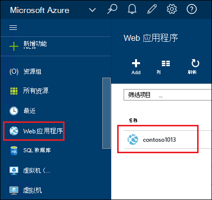
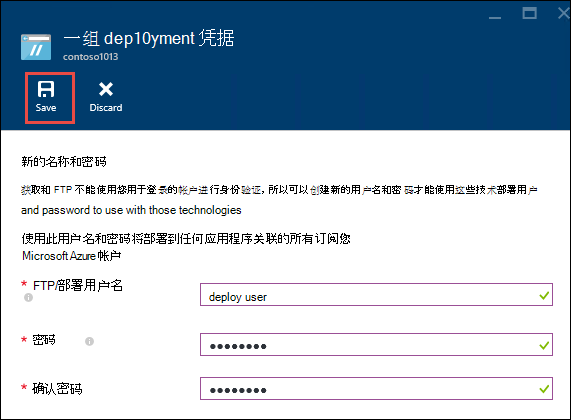
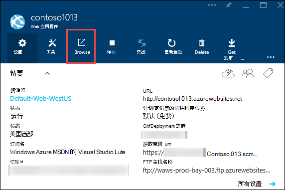
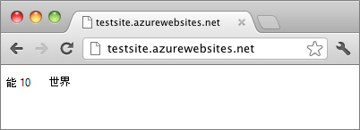

<properties
    pageTitle="在 Azure 应用程序服务创建 Node.js web 应用程序 |Microsoft Azure"
    description="了解如何部署 Node.js 到 Azure 应用程序服务 web 应用程序的应用程序。"
    services="app-service\web"
    documentationCenter="nodejs"
    authors="rmcmurray"
    manager="wpickett"
    editor=""/>

<tags
    ms.service="app-service-web"
    ms.workload="web"
    ms.tgt_pltfrm="na"
    ms.devlang="nodejs"
    ms.topic="hero-article"
    ms.date="08/11/2016"
    ms.author="robmcm"/>

# 在 Azure 应用程序服务创建 Node.js web 应用程序

> [AZURE.SELECTOR]
- [.Net](web-sites-dotnet-get-started.md)
- [Node.js](web-sites-nodejs-develop-deploy-mac.md)
- [Java](web-sites-java-get-started.md)
- [PHP 的 Git](web-sites-php-mysql-deploy-use-git.md)
- [PHP 的 FTP](web-sites-php-mysql-deploy-use-ftp.md)
- [Python](web-sites-python-ptvs-django-mysql.md)

本教程展示如何创建一个简单的[Node.js](http://nodejs.org)应用程序并将其部署到[Azure 应用程序服务](../app-service/app-service-value-prop-what-is.md) [web 应用程序](app-service-web-overview.md)中，通过使用[Git](http://git-scm.com)。 在本教程中的说明进行操作的后面可以是能够 Node.js 运行任何操作系统上。

您将学习︰

* 如何通过使用 Azure 门户在 Azure 应用程序服务创建一个 web 应用程序。
* 如何 Node.js 应用程序部署到 web 应用程序按到 web 应用程序的 Git 存储库。

完整的应用程序将短"你好世界"字符串写入浏览器。

![浏览器显示 Hello World 消息。][helloworld-completed]

教程和示例代码更复杂的 Node.js 应用，或者如何使用 Azure Node.js 有关的其他主题，请参见[Node.js 开发中心](/develop/nodejs/)。

> [AZURE.NOTE]
> 若要完成本教程，您需要一个 Microsoft Azure 帐户。 如果您没有帐户，则可以[激活您的 Visual Studio 订户权益](/en-us/pricing/member-offers/msdn-benefits-details/?WT.mc_id=A261C142F)或[注册免费试用版](/en-us/pricing/free-trial/?WT.mc_id=A261C142F)。
>
> 如果您想要开始使用 Azure 应用程序服务注册 Azure 帐户之前，请转到[尝试应用程序服务](http://go.microsoft.com/fwlink/?LinkId=523751)。 那里，您立即可以应用程序服务中创建短期初学者 web 应用程序 — 需要，没有信用卡，没有承诺。

## 创建 web 应用程序并启用 Git 发布

请按照以下步骤在 Azure 应用程序服务中创建 web 应用程序并启用 Git 发布。 

[Git](http://git-scm.com/)是分布式的版本控制系统，可用于部署 Azure 网站。 将存储您的 web 应用程序在本地 Git 存储库，为您编写的代码，并将在通过推送到远程资源库中将代码部署到 Azure。 这种部署方法是应用程序服务 web 应用程序的功能。  

1. 登录到[Azure 的门户](https://portal.azure.com)。

2. 单击顶部的**+ 新**图标左侧的 Azure 门户。

3. 单击**Web + 移动**，然后单击**Web 应用程序**。

    ![][portal-quick-create]

4. 在**Web 应用程序**框中输入的 web 应用程序的名称。

    此名称必须是唯一的 azurewebsites.net 域中，因为 web 应用程序的 URL 将 {name}。 azurewebsites.net。 如果您输入的名称不唯一，文本框中将显示一个红色感叹号。

5. 选择**订阅**。

6. 选择一个**资源组**，或创建一个新。

    有关资源组的详细信息，请参阅[Azure 资源管理器概述](../azure-resource-manager/resource-group-overview.md)。

7. 选择某个**应用程序服务计划/位置**或新建一个。

    有关应用程序服务计划的详细信息，请参阅[Azure 应用程序服务计划概述](../azure-web-sites-web-hosting-plans-in-depth-overview.md)

8. 单击**创建**。
   
    ![][portal-quick-create2]

    短时间内，通常小于一分钟，Azure 完成创建新的 web 应用程序。

9. 单击**Web 应用程序 > {新 web 应用程序}**。

    

10. 在**Web 应用程序**刀片式服务器，请单击**部署**部分。

    ![][deployment-part]

11. 在**连续部署**刀片式服务器，请单击**选择源**

12. **本地 Git 存储库**，请单击，然后单击**确定**。

    ![][setup-git-publishing]

13. 设置部署的凭据，如果还没有这么做。

    一。 在 Web 应用程序刀片式服务器，请单击**设置 > 部署凭据**。

    ![][deployment-credentials]
 
    b。 创建一个用户名和密码。 
    
    

14. 在 Web 应用程序刀片式服务器，单击**设置**，然后单击**属性**。
 
    若要发布，将推送到远程的 Git 存储库。 在**git 中获取 URL**列出存储库的 URL。 在本教程后面部分，您将使用此 URL。

    ![][git-url]

## 生成和测试您的应用程序本地

在本节中，您将创建一个包含 [nodejs.org] 的 Hello World 示例稍加修改的版本的**server.js**文件。 该代码添加 process.env.PORT 作为 Azure 的 web 应用程序在运行时侦听的端口。

1. 创建一个名为*helloworld*目录。

2. 使用文本编辑器创建名为**server.js**的*helloworld*目录中的新文件。

2. 到**server.js**文件中，复制以下代码，然后保存该文件︰

        var http = require('http')
        var port = process.env.PORT || 1337;
        http.createServer(function(req, res) {
          res.writeHead(200, { 'Content-Type': 'text/plain' });
          res.end('Hello World\n');
        }).listen(port);

3. 打开命令行，然后使用下面的命令以启动本地 web 应用程序。

        node server.js

4. 打开 web 浏览器，然后定位到 http://localhost:1337。 

    将出现显示"Hello World"的网页，如下面的屏幕快照中所示。

    ![浏览器显示 Hello World 消息。][helloworld-localhost]

## 发布您的应用程序

1. 安装 Git，如果还没有这么做。

    有关用于您的平台的安装说明，请参阅[Git 下载页面](http://git-scm.com/download)。

1. 从命令行中，将目录更改到**helloworld**目录并输入以下命令可初始化本地 Git 存储库。

        git init

2. 使用以下命令来将文件添加到存储库︰

        git add .
        git commit -m "initial commit"

3. 添加 Git 远程将更新推送到以前，通过使用下面的命令创建的 web 应用程序︰

        git remote add azure [URL for remote repository]

4. 将更改推送到 Azure，通过使用下面的命令︰

        git push azure master

    提示您输入密码之前创建。 输出结果应类似于下面的示例。

        Counting objects: 3, done.
        Delta compression using up to 8 threads.
        Compressing objects: 100% (2/2), done.
        Writing objects: 100% (3/3), 374 bytes, done.
        Total 3 (delta 0), reused 0 (delta 0)
        remote: New deployment received.
        remote: Updating branch 'master'.
        remote: Preparing deployment for commit id '5ebbe250c9'.
        remote: Preparing files for deployment.
        remote: Deploying Web.config to enable Node.js activation.
        remote: Deployment successful.
        To https://user@testsite.scm.azurewebsites.net/testsite.git
         * [new branch]      master -> master

5. 若要查看您的应用程序，单击**浏览**按钮在 Azure 门户的**Web 应用程序**部分。

    

    

## 将更改发布到您的应用程序

1. 在文本编辑器中打开**server.js**文件，并将 Hello World\n' 改为 ' Hello Azure\n。 

2. 保存该文件。

2. 从命令行中，将目录更改到**helloworld**目录并运行下面的命令︰

        git add .
        git commit -m "changing to hello azure"
        git push azure master

    会再次提示输入密码。

3. 刷新浏览器窗口，您导航到 web 应用程序的 URL。

    ![Web 页显示 Hello Azure][helloworld-completed]

## 回滚部署

您可以单击**Web 应用程序**刀片式服务器从**设置 > 连续部署**查看**部署**刀片式服务器中的部署历史记录。 如果需要回滚到较早的部署，您可以选择它，然后单击刀片式服务器**部署的详细信息**中的**重新部署**。

## 下一步行动

您已经部署到 web 应用程序在 Azure 应用程序服务的 Node.js 应用。 若要了解有关应用程序服务 web 应用程序如何运行 Node.js 应用程序的详细信息，请参阅[Azure 应用程序服务 Web 应用程序︰ Node.js](http://blogs.msdn.com/b/silverlining/archive/2012/06/14/windows-azure-websites-node-js.aspx)和[指定 Node.js 版本 Azure 应用程序中的](../nodejs-specify-node-version-azure-apps.md)。

Node.js 提供了一个丰富的生态系统，可供您的应用程序的模块。 Web 应用程序与模块的工作方式，请参阅[使用 Node.js Azure 应用程序的模块](../nodejs-use-node-modules-azure-apps.md)。

如果您遇到问题的应用程序部署到 Azure 后，请参阅[如何调试 Azure 应用程序服务中的 Node.js 应用](web-sites-nodejs-debug.md)诊断问题的信息。

本文使用 Azure 门户网站来创建一个 web 应用程序。 您还可以使用[Azure 命令行界面](../xplat-cli-install.md)或[Azure PowerShell](../powershell-install-configure.md)执行相同的操作。

有关如何开发 Node.js Azure 上的应用程序的详细信息，请参阅[Node.js 开发中心](/develop/nodejs/)。

[helloworld-completed]: ./media/web-sites-nodejs-develop-deploy-mac/helloazure.png
[helloworld-localhost]: ./media/web-sites-nodejs-develop-deploy-mac/helloworldlocal.png
[portal-quick-create]: ./media/web-sites-nodejs-develop-deploy-mac/create-quick-website.png
[portal-quick-create2]: ./media/web-sites-nodejs-develop-deploy-mac/create-quick-website2.png
[setup-git-publishing]: ./media/web-sites-nodejs-develop-deploy-mac/setup_git_publishing.png
[go-to-dashboard]: ./media/web-sites-nodejs-develop-deploy-mac/go_to_dashboard.png
[deployment-part]: ./media/web-sites-nodejs-develop-deploy-mac/deployment-part.png
[deployment-credentials]: ./media/web-sites-nodejs-develop-deploy-mac/deployment-credentials.png
[git-url]: ./media/web-sites-nodejs-develop-deploy-mac/git-url.png
