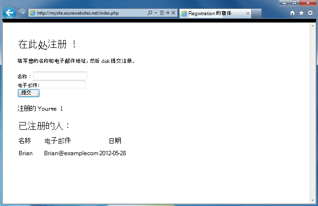
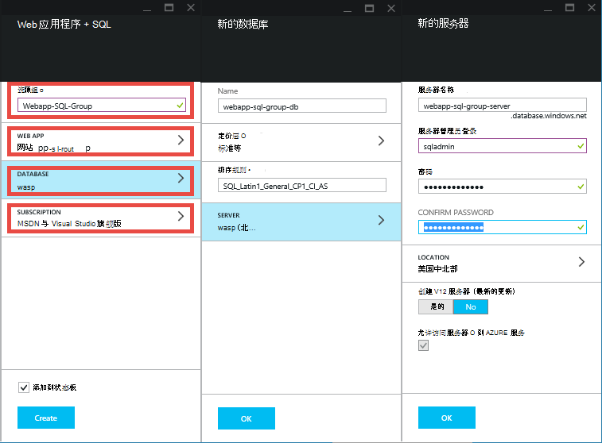
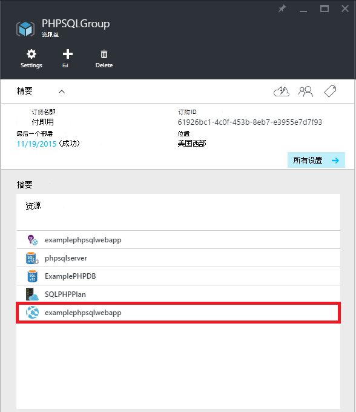
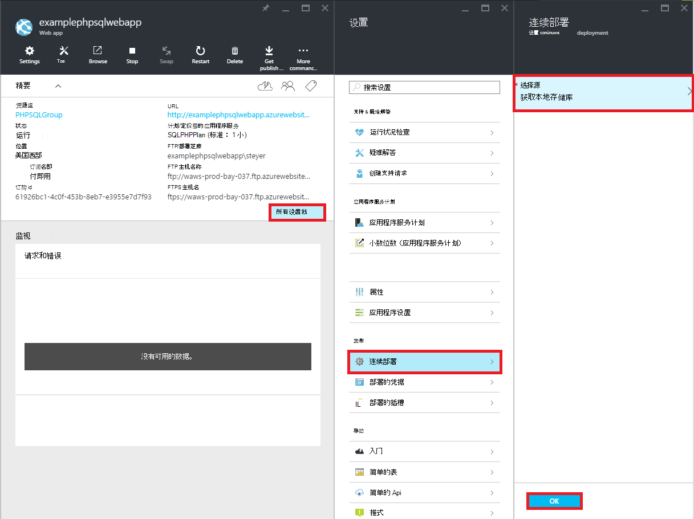
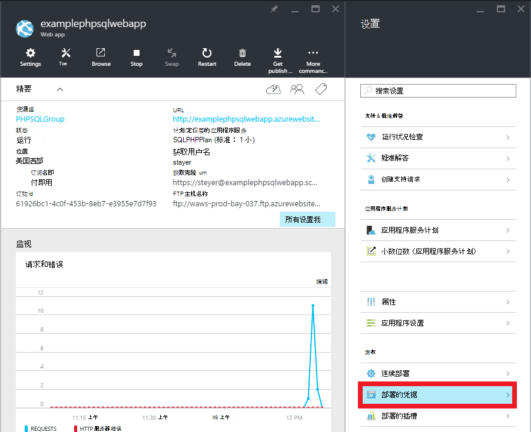
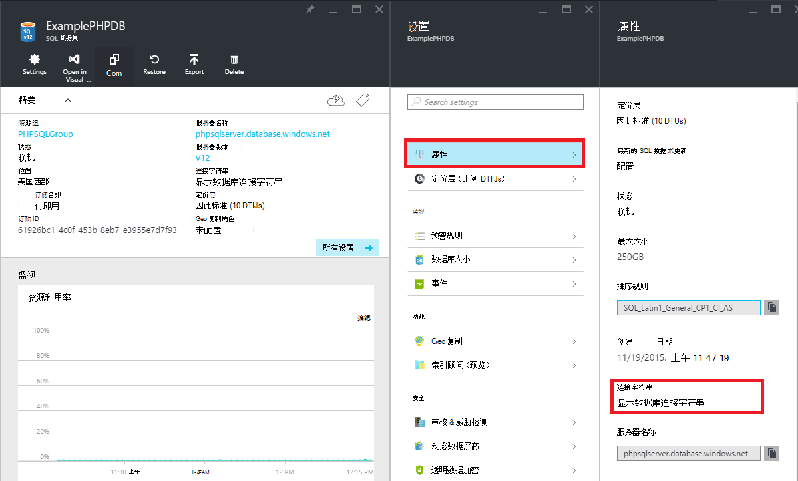

<properties 
    pageTitle="创建一个 PHP SQL web 应用程序并将其部署到使用 Git 的 Azure 应用程序服务" 
    description="演示如何创建一个 PHP web 应用程序将数据存储在 SQL Azure 数据库并使用 Git 部署到 Azure 应用程序服务的教程。" 
    services="app-service\web, sql-database" 
    documentationCenter="php" 
    authors="rmcmurray" 
    manager="wpickett" 
    editor=""/>

<tags 
    ms.service="app-service-web" 
    ms.workload="web" 
    ms.tgt_pltfrm="na" 
    ms.devlang="PHP" 
    ms.topic="article" 
    ms.date="08/11/2016" 
    ms.author="robmcm"/>

# 创建一个 PHP SQL web 应用程序并将其部署到使用 Git 的 Azure 应用程序服务

本教程展示了如何在[Azure 应用程序服务](http://go.microsoft.com/fwlink/?LinkId=529714)将连接到 SQL Azure 数据库中创建一个 PHP web 应用程序以及如何将其使用 Git 部署。 本教程假设您拥有[PHP][install-php]， [SQL Server Express][install-SQLExpress]，则[Microsoft SQL Server php 驱动程序](http://www.microsoft.com/download/en/details.aspx?id=20098)，以及[Git] [install-git]安装在您的计算机上。 在完成本指南，您必须在 Azure 上运行 PHP SQL web 应用程序。

> [AZURE.NOTE]
> 您可以为安装和配置 PHP、 SQL Server Express，以及 Microsoft 驱动程序的 SQL Server PHP 使用[Microsoft Web 平台安装程序](http://www.microsoft.com/web/downloads/platform.aspx)。

您将了解︰

* 如何创建 Azure 的 web 应用程序和 SQL 数据库使用[Azure 门户](http://go.microsoft.com/fwlink/?LinkId=529715)。 由于默认情况下应用程序服务 Web 应用程序中启用了 PHP，什么特别的事情需要运行您的 PHP 代码。
* 如何发布和重新发布您的应用程序使用 Git 的 Azure。
 
通过遵循本教程中，您将生成 PHP 中一个简单的注册 web 应用程序。 在 Azure 网站将承载的应用程序。 下面是完整的应用程序的屏幕快照︰

[AZURE.INCLUDE [create-account-and-websites-note](../../includes/create-account-and-websites-note.md)]

>[AZURE.NOTE] 如果您想要怎样的 Azure 帐户之前开始使用 Azure 应用程序服务，请转到[尝试应用程序服务](http://go.microsoft.com/fwlink/?LinkId=523751)，立即可以在此创建短期的初学者 web 应用程序在应用程序服务。 没有信用卡，所需;没有承诺。

##创建一个 Azure 的 web 应用程序和设置 Git 发布

请按照以下步骤创建一个 Azure 的 web 应用程序和 SQL 数据库︰

1. 登录到[Azure 的门户](https://portal.azure.com/)。

2. 打开 Azure 市场通过单击顶部的**新建**图标左侧的面板中，单击**选择所有**市场和选择**Web + 移动**旁边。
    
3. 在市场中，选择**Web + 移动**。

4. 请单击**Web 应用程序 + SQL**图标。

5. 阅读后的 Web 应用程序 + SQL 的应用程序的说明，选择**创建**。

6. 单击每个部分 （**资源组**、 **Web 应用程序**、**数据库**和**订阅**） 和输入或选择所需字段的值︰
    
    - 输入您选择的 URL 名称   
    - 配置数据库服务器凭据
    - 选择最接近您的区域

    

7. 完成定义 web 应用程序，请单击**创建**。

    如果已经创建了 web 应用程序，**通知**按钮将闪烁绿色**成功**和资源组刀片式服务器打开的组中显示的 web 应用程序和 SQL 数据库。

4. 单击打开刀片式服务器的 web 应用程序的资源组刀片式服务器中的 web 应用程序的图标。

    

5. 单击**设置**中的**连续部署** > **配置所需的设置**。 选择**本地 Git 存储库**并单击**确定**。

    

    如果没有设置一个 Git 存储库之前，您必须提供用户名和密码。 若要执行此操作，请单击**设置** > **部署凭据**的 web 应用程序的刀片式服务器。

    

6. 在**设置****属性**以查看您需要使用部署您的 PHP 应用程序稍后的 Git 远程 URL，请单击。

##获取 SQL 数据库的连接信息

若要连接到 SQL 数据库实例链接到您的 web 应用程序，您将需要创建数据库时所指定的连接信息。 若要获取 SQL 数据库连接信息，请执行以下步骤︰

1. 在刀片式服务器的资源组，请单击 SQL 数据库的图标。

2. 单击**设置**中的 SQL 数据库的刀片 > **属性**，然后单击**显示数据库连接字符串**。 

    
    
3. 从出现的对话框中的**PHP**部分，请记下的值`Server`， `SQL Database`，和`User Name`。 以后到 Azure 应用程序服务发布您的 PHP web 应用程序时，您将使用这些值。

##生成和测试您的应用程序本地

注册应用程序是一个简单的 PHP 应用程序，允许您注册为事件提供您的姓名和电子邮件地址。 以前登记的信息将显示在表中。 注册信息存储在 SQL 数据库实例。 该应用程序包含两个文件 （使用下面的复制/粘贴代码）︰

* **index.php**︰ 显示注册和包含注册人信息表的窗体。
* **createtable.php**︰ 创建应用程序的 SQL 数据库表。 此文件将只使用一次。

本地运行该应用程序，请按照下面的步骤。 请注意，这些步骤都假定了 PHP 和 SQL Server Express 在您的本地计算机上设置，并启用了[SQL Server 的 PDO 扩展][pdo-sqlsrv]。

1. 创建一个 SQL Server 数据库，名为`registration`。 你可以从`sqlcmd`命令提示符处使用以下命令︰

        >sqlcmd -S localhost\sqlexpress -U <local user name> -P <local password>
        1> create database registration
        2> GO   

2. 在应用程序根目录中创建两个文件中的一个名为`createtable.php`，一个名为`index.php`。

3. 打开`createtable.php`文件中的文本编辑器或 IDE 并添加下面的代码。 此代码用于创建`registration_tbl`表中`registration`数据库。

        <?php
        // DB connection info
        $host = "localhost\sqlexpress";
        $user = "user name";
        $pwd = "password";
        $db = "registration";
        try{
            $conn = new PDO( "sqlsrv:Server= $host ; Database = $db ", $user, $pwd);
            $conn->setAttribute( PDO::ATTR_ERRMODE, PDO::ERRMODE_EXCEPTION );
            $sql = "CREATE TABLE registration_tbl(
            id INT NOT NULL IDENTITY(1,1) 
            PRIMARY KEY(id),
            name VARCHAR(30),
            email VARCHAR(30),
            date DATE)";
            $conn->query($sql);
        }
        catch(Exception $e){
            die(print_r($e));
        }
        echo "<h3>Table created.</h3>";
        ?>

    请注意，您将需要更新的值<code>$user</code>，<code>$pwd</code>与本地 SQL Server 用户名和密码。

4. 在终端在应用程序的根目录中，键入以下命令︰

        php -S localhost:8000

4. 打开 web 浏览器并定位到**http://localhost:8000/createtable.php**。 这将创建`registration_tbl`数据库中的表。

5. 在文本编辑器或 IDE 打开**index.php**文件并添加 （将在后续步骤中添加 PHP 代码） 页面的基本 HTML 和 CSS 代码。

        <html>
        <head>
        <Title>Registration Form</Title>
        
        </head>
        <body>
        <h1>Register here!</h1>
        
Fill in your name and email address, then click <strong>Submit</strong> to register.

        <form method="post" action="index.php" enctype="multipart/form-data" >
              Name  <input type="text" name="name" id="name"/> 
              Email <input type="text" name="email" id="email"/> 
              <input type="submit" name="submit" value="Submit" />
        </form>
        <?php

        ?>
        </body>
        </html>

6. 在 PHP 标记，将添加用于连接到数据库的 PHP 代码。

        // DB connection info
        $host = "localhost\sqlexpress";
        $user = "user name";
        $pwd = "password";
        $db = "registration";
        // Connect to database.
        try {
            $conn = new PDO( "sqlsrv:Server= $host ; Database = $db ", $user, $pwd);
            $conn->setAttribute( PDO::ATTR_ERRMODE, PDO::ERRMODE_EXCEPTION );
        }
        catch(Exception $e){
            die(var_dump($e));
        }

    再次，需要更新的值<code>$user</code>，<code>$pwd</code>与您本地 MySQL 用户名称和密码。

7. 数据库连接的代码中，添加代码，以向数据库插入注册信息。

        if(!empty($_POST)) {
        try {
            $name = $_POST['name'];
            $email = $_POST['email'];
            $date = date("Y-m-d");
            // Insert data
            $sql_insert = "INSERT INTO registration_tbl (name, email, date) 
                           VALUES (?,?,?)";
            $stmt = $conn->prepare($sql_insert);
            $stmt->bindValue(1, $name);
            $stmt->bindValue(2, $email);
            $stmt->bindValue(3, $date);
            $stmt->execute();
        }
        catch(Exception $e) {
            die(var_dump($e));
        }
        echo "<h3>Your're registered!</h3>";
        }

8. 最后，上面的代码中，添加代码，用于从数据库中检索数据。

        $sql_select = "SELECT * FROM registration_tbl";
        $stmt = $conn->query($sql_select);
        $registrants = $stmt->fetchAll(); 
        if(count($registrants) > 0) {
            echo "<h2>People who are registered:</h2>";
            echo "<table>";
            echo "<tr><th>Name</th>";
            echo "<th>Email</th>";
            echo "<th>Date</th></tr>";
            foreach($registrants as $registrant) {
                echo "<tr><td>".$registrant['name']."</td>";
                echo "<td>".$registrant['email']."</td>";
                echo "<td>".$registrant['date']."</td></tr>";
            }
            echo "</table>";
        } else {
            echo "<h3>No one is currently registered.</h3>";
        }

现在可以浏览到**http://localhost:8000/index.php**测试应用程序。

##发布您的应用程序

本地应用程序进行测试之后，可以将其发布到应用程序服务 Web 应用程序使用 Git 中。 但是，您首先需要更新应用程序中的数据库连接信息。 （在**获取 SQL 数据库的连接信息**节中），使用数据库连接信息获取更新的以下信息**同时**在`createdatabase.php`和`index.php`文件用适当的值︰

    // DB connection info
    $host = "tcp:<value of Server>";
    $user = "<value of User Name>";
    $pwd = "<your password>";
    $db = "<value of SQL Database>";

> [AZURE.NOTE]
> 在<code>$host</code>，服务器的值必须预先与<code>tcp:</code>。

现在，您就可以设置 Git 发布和发布应用程序了。

> [AZURE.NOTE]
> 这些是相同的步骤**创建一个 Azure 的 web 应用程序和设置 Git 发布**上一节的末尾注明。

1. 打开 GitBash (或终端，Git 是否在您`PATH`)，将目录更改到根目录下的应用程序 （**注册**目录），并运行以下命令︰

        git init
        git add .
        git commit -m "initial commit"
        git remote add azure [URL for remote repository]
        git push azure master

    您将被提示输入您在前面创建的密码。

2. 浏览到要创建的应用程序的 SQL 数据库表的**http://[web 应用程序 name].azurewebsites.net/createtable.php** 。
3. 浏览到要开始使用该应用程序的**http://[web 应用程序 name].azurewebsites.net/index.php** 。

发布您的应用程序后，可以开始对其进行更改，并使用 Git 发布它们。 

##将更改发布到您的应用程序

若要将更改发布到应用程序，请执行以下步骤︰

1. 到本地应用程序中进行更改。
2. 打开 GitBash (或终端，it Git 是您`PATH`)，将目录更改到根目录下的应用程序，并运行下面的命令︰

        git add .
        git commit -m "comment describing changes"
        git push azure master

    您将被提示输入您在前面创建的密码。

3. 浏览到**http://[web 应用程序 name].azurewebsites.net/index.php**来查看所做的更改。

## 会发生什么变化
* 有关更改网站为应用程序服务的指南，请参阅︰ [Azure 应用程序服务，并对现有的 Azure 服务及其影响](http://go.microsoft.com/fwlink/?LinkId=529714)

[install-php]: http://www.php.net/manual/en/install.php
[install-SQLExpress]: http://www.microsoft.com/download/details.aspx?id=29062
[install-Drivers]: http://www.microsoft.com/download/details.aspx?id=20098
[install-git]: http://git-scm.com/
[pdo-sqlsrv]: http://php.net/pdo_sqlsrv
 
