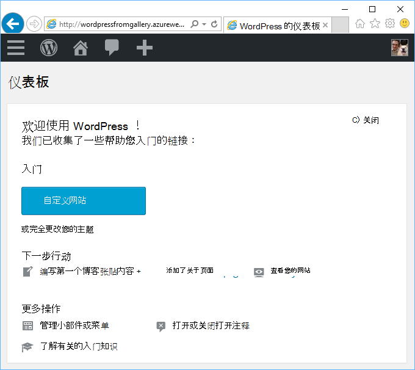
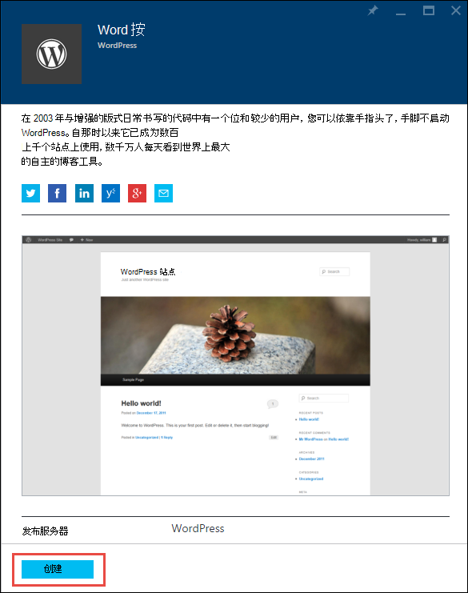
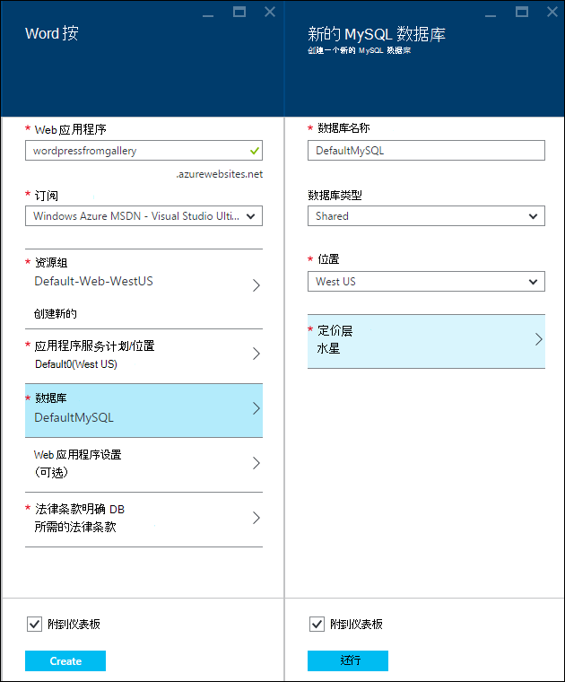
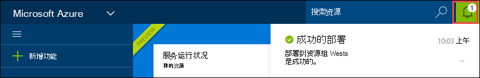
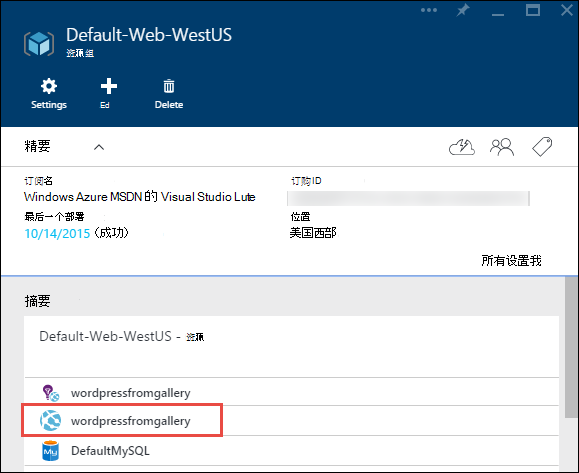
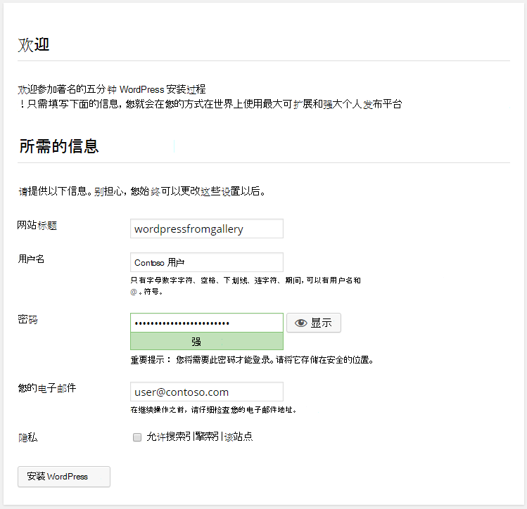

<properties
    pageTitle="在 Azure 应用程序服务创建 WordPress web 应用程序 |Microsoft Azure"
    description="了解如何创建新 WordPress 博客使用 Azure 门户的 Azure 的 web 应用程序。"
    services="app-service\web"
    documentationCenter="php"
    authors="rmcmurray"
    manager="wpickett"
    editor=""/>

<tags
    ms.service="app-service-web"
    ms.workload="na"
    ms.tgt_pltfrm="na"
    ms.devlang="PHP"
    ms.topic="hero-article"
    ms.date="08/11/2016"
    ms.author="robmcm"/>

# 在 Azure 应用程序服务创建 WordPress web 应用程序

[AZURE.INCLUDE [tabs](../../includes/app-service-web-get-started-nav-tabs.md)]

本教程展示如何部署从 Azure 市场 WordPress 博客网站。

在完成本教程时您必须自己 WordPress 博客网站上的，并在云中运行。

您将学习︰

* 在 Azure 的市场中找到应用程序模板的方式。
* 如何在基于该模板的 Azure 应用程序服务中创建 web 应用程序。
* 如何配置新的 web 应用程序和数据库的 Azure 应用程序服务设置。

Azure 市场提供范围广泛的流行的 web 应用程序由 Microsoft、 第三方公司和开放源码软件计划开发。 Web 应用程序是基于广泛的流行的框架，例如[PHP](/develop/nodejs/)在此的 WordPress 例如， [.NET](/develop/net/)， [Node.js](/develop/nodejs/)， [Java](/develop/java/)和[Python](/develop/python/)，仅举几例。 从 Azure 市场独一无二的软件，您需要创建一个 web 应用程序是为[Azure 门户](https://portal.azure.com/)使用的浏览器。 

在本教程中部署的 WordPress 站点使用 MySQL 数据库。 如果您想要改为对数据库中使用 SQL 数据库，请参见[项目 Nami](http://projectnami.org/)。 **项目 Nami**也是通过市场获得的。

> [AZURE.NOTE]
> 若要完成本教程，您需要一个 Microsoft Azure 帐户。 如果您没有帐户，则可以[激活您的 Visual Studio 订户权益](/pricing/member-offers/msdn-benefits-details/?WT.mc_id=A261C142F)或[注册免费试用版](/en-us/pricing/free-trial/?WT.mc_id=A261C142F)。
>
> 如果您想要开始使用 Azure 应用程序服务注册 Azure 帐户之前，请转到[尝试应用程序服务](http://go.microsoft.com/fwlink/?LinkId=523751)。 那里，您立即可以应用程序服务中创建短期初学者 web 应用程序 — 需要，没有信用卡，没有承诺。

## 选择 WordPress，Azure 应用程序服务的配置

1. 登录到[Azure 的门户](https://portal.azure.com/)。

2. 单击**新建**。
    
    ![创建新的][5]
    
3. **WordPress**，搜索，然后单击**WordPress**。 如果您想要使用 SQL 数据库，而不是 MySQL，搜索**项目 Nami**。

    ![从列表的 WordPress][7]
    
5. 阅读后 WordPress 的应用程序的说明，请单击**创建**。

    

4. 在**Web 应用程序**框中输入的 web 应用程序的名称。

    此名称必须是唯一的 azurewebsites.net 域中，因为 web 应用程序的 URL 将 {name}。 azurewebsites.net。 如果您输入的名称不唯一，文本框中将显示一个红色感叹号。

8. 如果您有多个订阅，则选择要使用的一个。 

5. 选择一个**资源组**，或创建一个新。

    有关资源组的详细信息，请参阅[Azure 资源管理器概述](../azure-resource-manager/resource-group-overview.md)。

5. 选择某个**应用程序服务计划/位置**或新建一个。

    有关应用程序服务计划的详细信息，请参阅[Azure 应用程序服务计划概述](../azure-web-sites-web-hosting-plans-in-depth-overview.md) 

7. 单击**数据库**，然后**新的 MySQL 数据库**刀片式服务器中配置 MySQL 数据库提供所需的值。

    一。 输入一个新名称或保留默认名称。

    b。 保留**数据库类型**设置为**共享**。

    c。 选择与您选定的 web 应用程序相同的位置。

    d。 选择定价层。 出于本教程水星 （免费使用最小允许的连接和磁盘空间） 是可以的。

8. 在**新的 MySQL 数据库**刀片式服务器，请单击**确定**。 

8. 在**WordPress**刀片式服务器，接受的法律条款，然后单击**创建**。 

    

    Azure 应用程序服务创建 web 应用程序中，通常在 1 分钟之内。 您可以通过单击门户页顶部的铃图标监视进度。

    

## 启动和管理您的 WordPress web 应用程序
    
7. Web 应用程序创建完成后，导航到您在其中创建应用程序时，该资源组的 Azure 门户，您可以看到该 web 应用程序和数据库。

    具有发光灯泡图标的额外资源是[应用程序的见解](/services/application-insights/)，它提供了对您的 web 应用程序的监视服务。

1. 在**资源组**刀片式服务器，请单击 web 应用程序行。

    

2. 在 Web 应用程序刀片式服务器，单击**浏览**。

    ![站点的 URL][browse]

3. 在 WordPress**欢迎**页上，输入所需的 WordPress，配置信息，然后单击**安装 WordPress**。

    

4. 使用您在**欢迎**页创建的凭据登录。  

5. 您网站的仪表板页面。    

    

## 下一步行动

您已经看到如何创建和部署 PHP web 应用程序从库。 在 Azure 使用 PHP 的更多信息，请参见[PHP 开发人员中心](/develop/php/)。

有关如何使用应用程序服务 Web 应用程序的详细信息，请参阅链接 （适用于广泛的浏览器窗口） 页面的左侧或顶部的页面 （窄的浏览器窗口）。 

## 会发生什么变化
* 从对应用程序服务的网站更改的指南，请参阅[Azure 应用程序服务，并对现有的 Azure 服务的影响](http://go.microsoft.com/fwlink/?LinkId=529714)。

[5]: ./media/web-sites-php-web-site-gallery/startmarketplace.png
[7]: ./media/web-sites-php-web-site-gallery/search-web-app.png
[browse]: ./media/web-sites-php-web-site-gallery/browse-web.png
