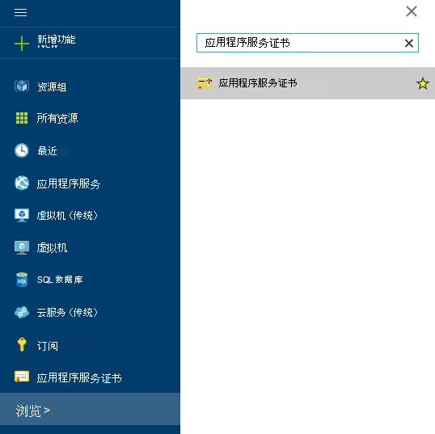
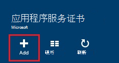
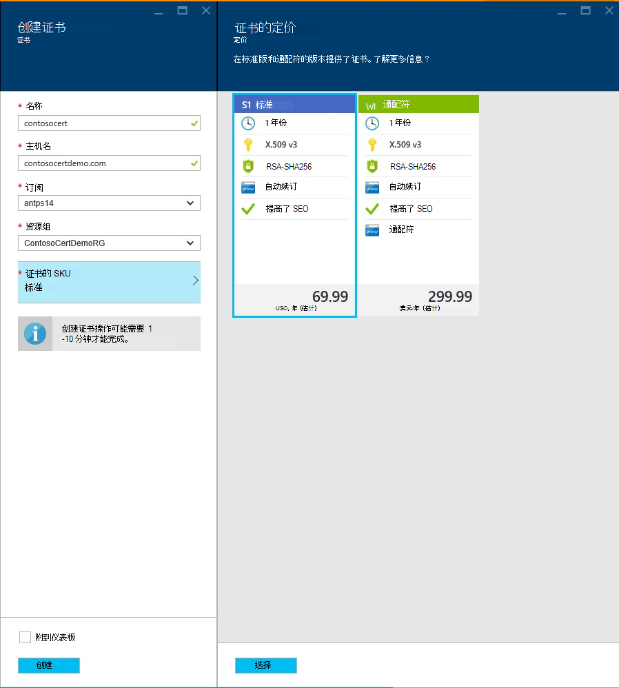
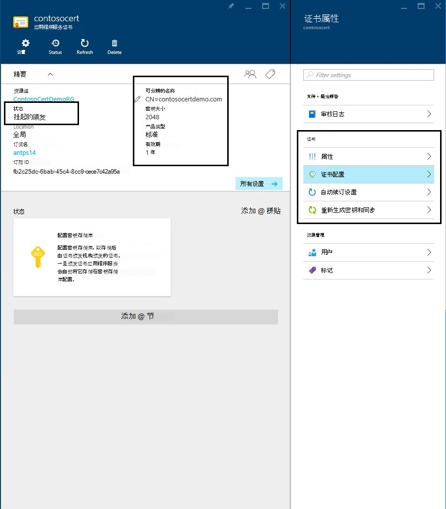
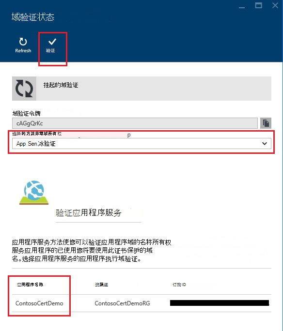
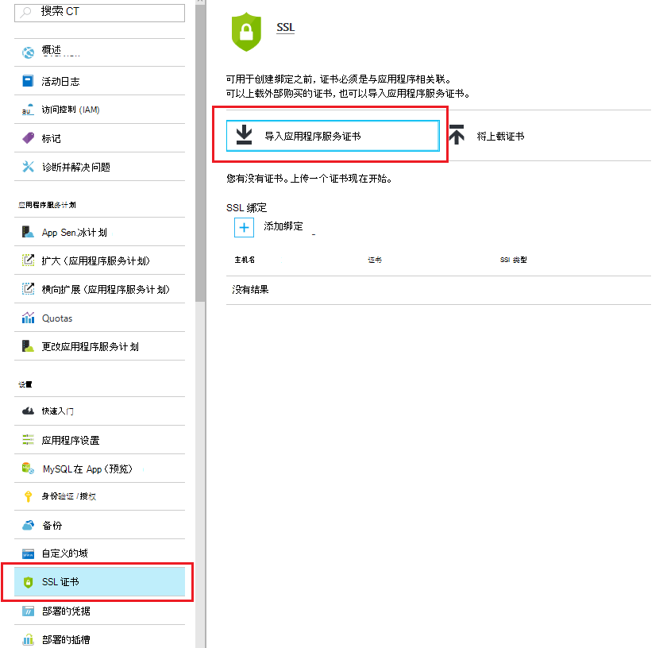
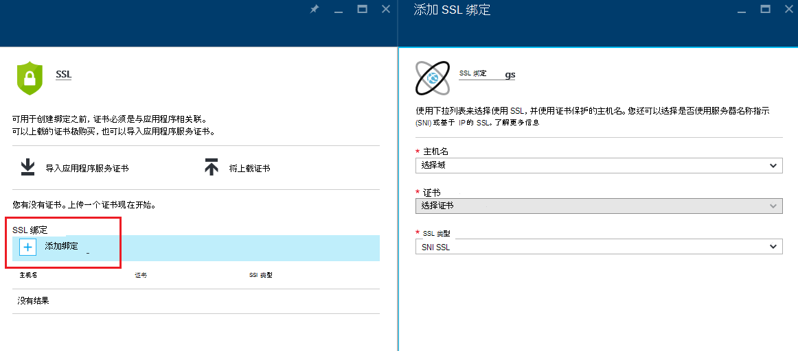
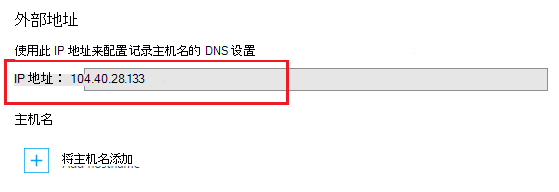
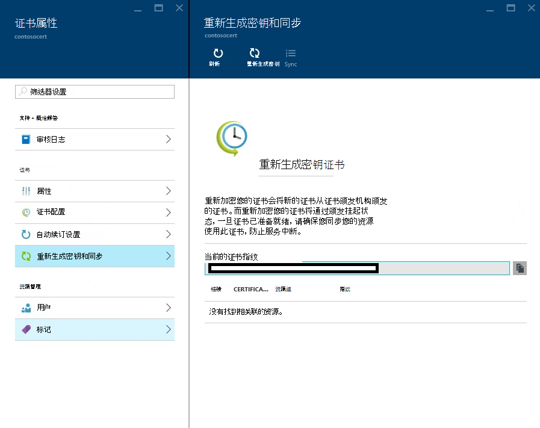

<properties
    pageTitle="购买和 Azure 应用程序服务的配置 SSL 证书"
    description="了解如何购买和 Azure 应用程序服务的配置 SSL 证书。"
    services="app-service"
    documentationCenter=".net"
    authors="apurvajo"
    manager="stefsch"
    editor="cephalin"
    tags="buy-ssl-certificates"/>

<tags
    ms.service="app-service"
    ms.workload="na"
    ms.tgt_pltfrm="na"
    ms.devlang="na"
    ms.topic="article"
    ms.date="09/19/2016"
    ms.author="apurvajo"/>

#购买和 Azure 应用程序服务的配置 SSL 证书

> [AZURE.SELECTOR]
- [买 Azure 中的 SSL 证书](web-sites-purchase-ssl-web-site.md)
- [从其他地方使用 SSL 证书](web-sites-configure-ssl-certificate.md)

默认情况下， **[Azure 应用程序服务](http://go.microsoft.com/fwlink/?LinkId=529714)**已启用 HTTPS 为您的 web 应用程序与*的通配符证书。 azurewebsites.net 域。如果您不计划配置自定义的域，然后您可以受益于默认 HTTPS 证书。但是，像所有*[通配符域](https://casecurity.org/2014/02/26/pros-and-cons-of-single-domain-multi-domain-and-wildcard-certificates)，不可用您自己的证书使用自定义域尽可能安全。 Azure 应用程序服务现在提供真正简化的方法要购买并管理从 Azure 门户不离开门户网站的 SSL 证书。  
本文解释如何购买和 3 个简单步骤**[Azure 应用程序服务](http://go.microsoft.com/fwlink/?LinkId=529714)**的配置 SSL 证书。 

> [AZURE.NOTE]
> 自定义域名的 SSL 证书不能使用免费和共享的 web 应用程序。 您必须配置您的 web 应用程序对于基本、 标准或高级模式，可能会改变您的订阅付费多少。 有关更多信息，请参见**[Web 应用程序定价详细信息](https://azure.microsoft.com/pricing/details/web-sites/)**。

##概述
> [AZURE.NOTE]
> 请不要尝试购买使用不具有与之关联的活动信用卡订阅一个 SSL 证书。 这可能导致您的订阅被禁用。 

##<a>采购、 存储和分配一个 SSL 证书为您自定义的域</a>
对于自定义的域，如 contoso.com，启用 HTTPS，首先必须**[在 Azure 应用程序服务中配置自定义域名。](web-sites-custom-domain-name.md)**

请求一个 SSL 证书之前, 必须先确定哪些域名将受该证书。 这将确定您必须获得哪种类型的证书。 如果您仅需要力保如 contoso.com 或 www.contoso.com 一个域名 （基本） 的标准证书就足够了。 如果您需要安全的多个域名，如 contoso.com、 www.contoso.com 和 mail.contoso.com，然后可获得**[通配符证书](http://en.wikipedia.org/wiki/Wildcard_certificate)**

##第 0 步︰ 订购 SSL 证书

在此步骤中，您将学习如何订购您所选的 SSL 证书。

1.  在**[Azure 门户](https://portal.azure.com/)**中，单击浏览在搜索栏中键入"应用程序服务证书"并选择"应用程序服务证书"的结果，请单击添加。 

    

    

2.  输入您的 SSL 证书的**友好名称**。

3.  请输入**主机名**
> [AZURE.NOTE]
    这是采购过程的最关键部分之一。 请确保输入了正确的主机名 （自定义的域），您想要用此证书保护。 **不**追加带 WWW 的主机名。 例如，如果您自定义的域的名称是 www.contoso.com，则只需在主机名字段中输入 contoso.com，疑问证书将保护 www 和根域。 
    
4.  选择您的**订阅**。 

    如果您有多个订阅，然后确保在您已经使用您的自定义的域或 Web 应用程序的同一订阅问题创建 SSL 证书。
       
5.  选择或创建**资源组**。

    资源组使您能够管理 Azure 的相关的资源作为一个整体，建立您的应用程序的基于角色的访问控制 (RBAC) 规则时十分有用。 有关详细信息，请参阅管理 Azure 的资源。
     
6.  选择**证书的 SKU** 

    最后，选择满足您需要的 SKU 的证书，单击创建。 如今，Azure 应用程序服务允许您购买两个不同的 Sku • S1 – 标准与 1 年期有效性和自动续订证书  
           • W1-通配符证书有效性和自动续订 1 年      
    有关更多信息，请参见**[Web 应用程序定价详细信息](https://azure.microsoft.com/pricing/details/web-sites/)**。

> [AZURE.NOTE]
> 创建 SSL 证书将持续 1 到 10 分钟。 此过程在其他方面非常繁琐，若要手动执行的背景中执行多个步骤。  

##步骤 1︰ 将证书存储在 Azure 密钥存储库

在此步骤中，您将学习如何将您购买到 Azure 密钥存储库，您所选的 SSL 证书的存储区。

1.  SSL 证书采购完成后，您需要手动打开刀片式服务器**的应用程序服务证书**资源，通过浏览来再次 (请参阅步骤 1)   

    

    您将注意到证书状态为**"挂起颁发"** ，有几个步骤，您需要完成之前您可以开始使用此证书。
 
2. 内部证书属性刀片式服务器，然后单击在**"步骤 1:: 存储"**以将该证书存储在 Azure 密钥存储库中，单击**"证书配置"**上。

3.  从**"密钥存储库状态"**刀片**"密钥存储库存储库"** ，以选择现有密钥存储库来存储此证书**或者"创建新密钥存储库"**来创建新的密钥存储库相同的订阅和资源组内单击。
 
    
 
    > [AZURE.NOTE]
    Azure 的密钥存储库有很少的费用，用于存储此证书。 有关更多信息，请参见**[Azure 密钥存储库的定价详细信息](https://azure.microsoft.com/pricing/details/key-vault/)**。

4. 一旦选择了密钥存储库存储库以将该证书保存在继续操作并将其存储通过单击顶部的**"密钥存储库状态"**刀片式服务器的**"存储"**按钮上。  

    这应完成存储您购买使用 Azure 密钥存储库，您选择的证书的步骤。 刷新刀片式服务器以后，您应该看到绿色选中标记这一步也对。
    
##第 2 步︰ 验证域所有权

在此步骤中，您将学习如何执行域所有权验证的 SSL 证书，只是下订单了。 

1.  单击**"步骤 2︰ 检查"** **"证书配置"**刀片式服务器中的步骤。 有 4 种类型的域验证支持的应用程序服务证书。

    * **验证应用程序服务** 
    
        * 这是最方便的过程，如果您已经有**您分配给应用程序服务应用程序的自定义域。** 此方法将列出所有的应用程序服务应用程序符合此标准。 
           在这种情况下，例如， **contosocertdemo.com**是一个自定义的域分配给应用程序调用**"ContosoCertDemo"**的服务应用程序，因此这就是唯一的应用程序服务应用程序在此处列出。 如果有多个区域部署，然后它会列出这些所有各地区。
        
           验证方法才可用于购买标准 （基本） 的证书。 通配符证书，请跳过并移动到选项 B、 C 或 D 下面。
        * 单击**"验证"**按钮以完成此步骤。
        * 单击**"刷新"**来更新证书状态验证完毕后。 它可能需要几分钟才能完成的验证。
        
             

    * **域验证** 

        * 这是最方便的过程**，才**有**[Azure 应用程序服务从购买您的自定义域。](custom-dns-web-site-buydomains-web-app.md)**
        
        * 单击**"验证"**按钮以完成此步骤。
        
        * 单击**"刷新"**来更新证书状态验证完毕后。 它可能需要几分钟才能完成的验证。

    * **邮件验证**
        
        * 验证电子邮件已发送给电子邮件收件人与此自定义的域相关联。
         
        * 打开电子邮件并单击验证链接，才能完成电子邮件验证步骤。 
        
        * 如果您需要重新发送验证电子邮件，请单击**"重新发送电子邮件"**按钮。
         
    * **手动验证**    
                 
        1. **HTML 网页验证**
        
            * 创建一个 HTML 文件，名为**{域验证令牌}**.html （您可以从他域验证状态刀片式服务器复制标记）
            
            * 内容该文件应**验证令牌的域**的完全相同的名称。
            
            * 上载此文件在 web 服务器所在域的根。
            
            * 单击**"刷新"**来更新证书状态验证完毕后。 它可能需要几分钟才能完成的验证。
            
            例如，如果您购买了 contosocertdemo.com 与域验证令牌**cAGgQrKc**的标准证书然后 web 请求对**http://contosocertdemo.com/cAGgQrKc.html**应返回**cAGgQrKc。**
        2. **DNS TXT 记录验证**

            * 使用 DNS 管理器中，创建一个 TXT 记录值**DZC**子域上等于**域验证令牌。**
            
            * 单击**"刷新"**来更新证书状态验证完毕后。 它可能需要几分钟才能完成的验证。
                              
            例如，若要执行通配符证书与主机名验证**\*。 contosocertdemo.com**或**\*。 subdomain.contosocertdemo.com**和需要在 dzc.contosocertdemo.com 值与创建 TXT 记录域验证令牌**cAGgQrKc**， **cAGgQrKc。**     

##步骤 3︰ 将证书分配给应用程序服务的应用程序

在此步骤中，您将学习如何分配这新购买的证书为您的应用程序服务的应用程序。 

> [AZURE.NOTE]
> 之前执行本节中的步骤，您必须有关联的自定义的域名与您的应用程序。 有关详细信息，请参阅[配置 web 应用程序自定义域名](web-sites-custom-domain-name.md) ****

1.  在浏览器中，打开**[Azure 门户。](https://portal.azure.com/)**
2.  单击在左侧页面的**应用程序服务**选项。
3.  单击您要向其分配此证书的应用程序的名称。 
4.  在**设置**，单击**SSL 证书**
5.  单击**导入应用程序服务证书**，然后选择您刚购买了该证书

    

6. 在**ssl 绑定**部分单击**添加绑定**
7. 在**添加 SSL 绑定**刀片式服务器中使用下拉列表选择要使用 SSL，并使用证书保护的域名。 您还可以选择是否使用**[服务器名称指示 (SNI)](http://en.wikipedia.org/wiki/Server_Name_Indication)**或基于 IP 的 SSL。

    

       •    IP based SSL associates a certificate with a domain name by mapping the dedicated public IP address of the server to the domain name. This requires each domain name (contoso.com, fabricam.com, etc.) associated with your service to have a dedicated IP address. This is the traditional          method of associating SSL certificates with a web server.
       •    SNI based SSL is an extension to SSL and **[Transport Layer Security](http://en.wikipedia.org/wiki/Transport_Layer_Security)** (TLS) that allows multiple domains to share the same IP address, with separate security certificates for each domain. Most modern browsers (including Internet Explorer, Chrome, Firefox and Opera) support SNI, however older browsers may not support SNI. For more information on SNI, see the **[Server Name Indication](http://en.wikipedia.org/wiki/Server_Name_Indication)** article on Wikipedia.
       
7. 单击**添加绑定**以保存所做的更改并启用 SSL。

如果您选择**基于 IP 的 SSL** ，您自定义的域被配置使用 A 记录，您必须执行以下附加步骤︰

* 在配置之后基于 IP 的 SSL 绑定，一个专用的 IP 地址分配给您的应用程序。 在您的应用程序的**主机名**部分上方的设置下，**自定义的域**页面上可以找到此 IP 地址。 它将列为**外部 IP 地址**
    
    

    请注意，此 IP 地址将不同于以前用于配置为您的域 A 记录的虚拟 IP 地址。 如果被配置为使用 SNI 基于 SSL，或者没有配置为使用 SSL，将此项列没有地址。
    
2. 使用您的域名称注册所提供的工具，修改自定义域名指向上一步的 IP 地址的 A 记录。
此时，您应该能够访问您的应用程序使用 HTTPS:// 而非 HTTP:// 验证证书已正确配置。

##重新生成密钥，然后同步证书

1. 出于安全原因，如果您以往任何时候都需要重新生成密钥证书然后只需则选择从**"证书属性"**刀片**"重新生成密钥和同步"**选项。 

2. 单击**"重新生成密钥"**按钮以启动该进程。 此过程可能需要 1-10 分钟才能完成。 

    

3. 重新加密您的证书会将新的证书从证书颁发机构颁发的证书。
4. 您不收取重新生成密钥的证书的有效期。 
5. 重新加密您的证书将经过颁发挂起状态。 
6. 一旦证书已准备就绪，请确保您同步您的资源使用此证书，以防止对该服务的中断。
7. 同步选项不适用于尚未未分配给该 Web 应用程序的证书。 

## 更多的资源 ##
- [在 Azure 应用程序服务的应用程序启用 HTTPS](web-sites-configure-ssl-certificate.md)
- [购买并在 Azure 应用程序服务中配置自定义域名](custom-dns-web-site-buydomains-web-app.md)
- [微软 Azure 信任中心](/support/trust-center/security/)
- [解除锁定在 Azure 网站配置选项](http://azure.microsoft.com/blog/2014/01/28/more-to-explore-configuration-options-unlocked-in-windows-azure-web-sites/)
- [Azure 的管理门户](https://manage.windowsazure.com)

>[AZURE.NOTE] 如果您想要怎样的 Azure 帐户之前开始使用 Azure 应用程序服务，请转到[尝试应用程序服务](http://go.microsoft.com/fwlink/?LinkId=523751)，立即可以在此创建短期的初学者 web 应用程序在应用程序服务。 没有信用卡，所需;没有承诺。

