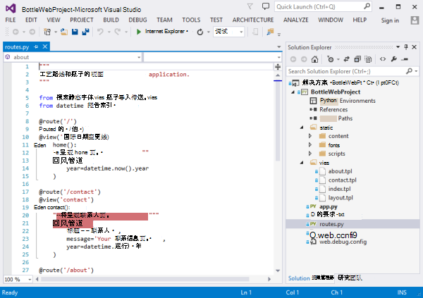
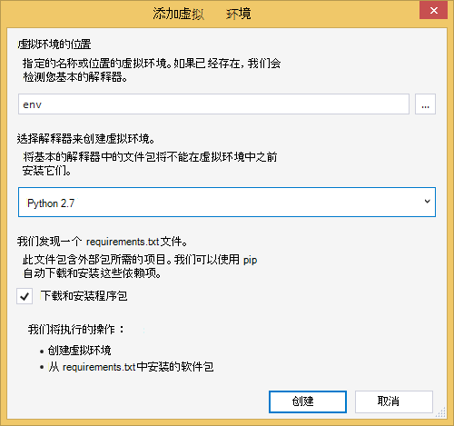
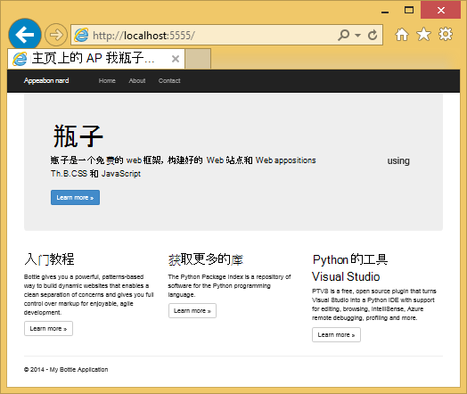
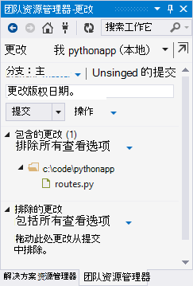
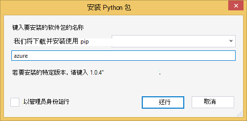
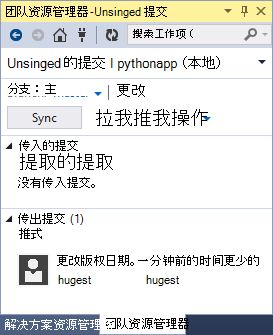
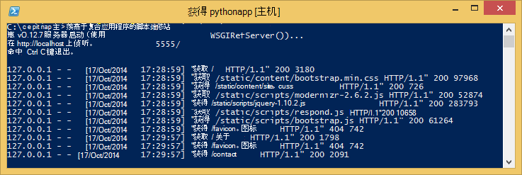
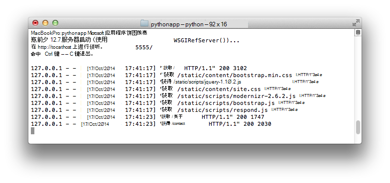
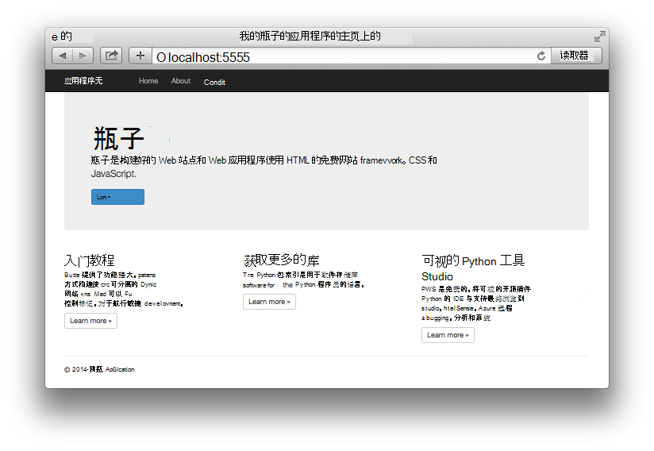

<properties 
    pageTitle="Python 的 web 应用程序使用 Azure 中的瓶子" 
    description="向您介绍在 Azure 应用程序服务 Web 应用程序中运行一个 Python web 应用程序的教程。" 
    services="app-service\web" 
    documentationCenter="python" 
    tags="python"
    authors="huguesv" 
    manager="wpickett" 
    editor=""/>

<tags 
    ms.service="app-service-web" 
    ms.workload="web" 
    ms.tgt_pltfrm="na" 
    ms.devlang="python" 
    ms.topic="article" 
    ms.date="02/19/2016"
    ms.author="huvalo"/>

# 用瓶子 Azure 中创建 web 应用程序

本教程描述如何开始运行 Python 在 Azure 应用程序服务 Web 应用程序中。 Web 应用程序提供了有限的免费托管，以及快速部署，并且您可以使用 Python ！ 随着您的应用程序时，您可以切换到付费的宿主，并还可与所有其他 Azure 服务集成。

您将创建 web 应用程序使用的瓶子 web 框架 （请参阅本教程的备用版本[Django](web-sites-python-create-deploy-django-app.md)和[Flask](web-sites-python-create-deploy-flask-app.md)）。 将从 Azure 市场创建 web 应用程序、 设置 Git 部署和复制本地资源库。 然后将本地运行 web 应用程序、 更改、 提交并将它们推送到[Azure 应用程序服务 Web 应用程序](http://go.microsoft.com/fwlink/?LinkId=529714)。 本教程演示如何从 Windows 或者 Mac/Linux 执行此操作。

[AZURE.INCLUDE [create-account-and-websites-note](../../includes/create-account-and-websites-note.md)]

>[AZURE.NOTE] 如果您想要怎样的 Azure 帐户之前开始使用 Azure 应用程序服务，请转到[尝试应用程序服务](http://go.microsoft.com/fwlink/?LinkId=523751)，立即可以在此创建短期的初学者 web 应用程序在应用程序服务。 没有信用卡，所需;没有承诺。

## 系统必备组件

- Windows、 Mac 或 Linux
- Python 2.7 或 3.4
- setuptools，骰，virtualenv (仅适用于 Python 2.7)
- Git
- [Python 工具 Visual Studio 的 2.2]-请注意︰ 这是可选的

**注意**︰ 对于 Python 项目当前不支持 TFS 发布。

### 窗口

如果您尚没有 Python 2.7 或 3.4 安装 （32 位），我们建议您安装[对于 Python 2.7 Azure SDK]或[Python 3.4 的 Azure SDK]使用 Web 平台安装程序。 这将安装 32 位版本的 Python、 setuptools、 pip、 virtualenv 等 （32-位的 Python 是 Azure 主机计算机上安装的内容）。 或者，您可以从[python.org]获得 Python。

对于 Git，建议[Git 的窗口]或[GitHub 的窗口]。 如果使用 Visual Studio 时，您可以使用集成的 Git 支持。

我们还建议您安装[的 Visual Studio 的 Python 工具 2.2]。 这是可选的但如果有[Visual Studio]，包括免费的 Visual Studio 社区 2013年或 Visual Studio 速成 2013 网站，然后这将为您提供出色的 Python IDE。

### Mac/Linux

您应具有 Python 和 Git 已经安装，但确保您具有 Python 2.7 或 3.4。

## 在 Azure 门户网站上的 web 应用程序创建

创建您的应用程序的第一步是创建通过[Azure 门户](https://portal.azure.com)的 web 应用程序。  

1. 登录到 Azure 门户，单击左下角的**新建**按钮。 
3. 在搜索框中，键入"python"。
4. 在搜索结果中，选择**的瓶子**，然后单击**创建**。
5. 配置新的瓶子应用程序，如为其创建一个新的应用程序服务计划和新的资源组。 然后，单击**创建**。
6. 通过在[本地 Git 部署到 Azure 应用程序服务](app-service-deploy-local-git.md)的说明配置新创建的 web 应用程序的 Git 发布。
 
## 应用程序概述

### Git 存储库内容

这是初始的 Git 存储库，我们将克隆的下一节中可以找到的文件的概览。

    \routes.py
    \static\content\
    \static\fonts\
    \static\scripts\
    \views\about.tpl
    \views\contact.tpl
    \views\index.tpl
    \views\layout.tpl

应用程序的主要来源。 使用母版版式的 3 页 （有关，联系人索引） 组成。  静态内容和脚本包括引导，jquery，modernizr 及响应。

    \app.py

本地开发服务器支持。 使用此选项以在本地运行应用程序。

    \BottleWebProject.pyproj
    \BottleWebProject.sln

与[Visual Studio 的 Python 工具]一起使用的项目文件。

    \ptvs_virtualenv_proxy.py

虚拟环境和远程调试支持 PTVS 的 IIS 代理。

    \requirements.txt

此应用程序所需的外部包。 Pip 部署脚本将安装在此文件中列出的包。
 
    \web.2.7.config
    \web.3.4.config

IIS 配置文件。 部署脚本将使用适当的 web.x.y.config 并将它作为 web.config 中复制。

### 可选文件的自定义部署

[AZURE.INCLUDE [web-sites-python-customizing-deployment](../../includes/web-sites-python-customizing-deployment.md)]

### 可选文件-Python 运行时

[AZURE.INCLUDE [web-sites-python-customizing-runtime](../../includes/web-sites-python-customizing-runtime.md)]

### 在服务器上的其他文件

某些文件在服务器上存在，但不是会添加到 git 存储库。 这些被创建的部署脚本。

    \web.config

IIS 配置文件。 从 web.x.y.config 每个部署上创建。

    \env\

Python 的虚拟环境。 如果兼容的虚拟环境尚不存在的 web 应用程序在部署过程中创建。  在 requirements.txt 中列出的包安装，pip 但 pip 将跳过安装程序包已安装。

接下来 3 几节描述如何使用 web 应用程序开发，在 3 个不同的环境下继续执行︰

- 使用 Visual Studio 的 Python 工具窗口
- 带有命令行窗口，
- Mac/Linux，命令行

## Visual Studio 的 web 应用程序开发 Windows 的 Python 工具

### 克隆存储库

首先，克隆存储库使用 Azure 门户上提供的 url。 有关详细信息，请参阅[本地 Git 部署到 Azure 应用程序服务](app-service-deploy-local-git.md)。

打开存储库的根目录中包含的解决方案文件 (.sln)。

### 创建虚拟环境

现在我们将创建本地开发的虚拟环境。 右键单击**Python 环境**选择**添加虚拟环境...**。

- 确保环境的名称是`env`。

- 选择基本的解释器。 请确保为您的 web 应用程序 （runtime.txt 或在 Azure 门户 web 应用程序的**应用程序设置**刀片式服务器） 中使用 Python 所选的相同版本。

- 请确保选中此选项，下载和安装程序包。

单击**创建**。 这会创建虚拟环境，并安装在 requirements.txt 中列出的依赖项。

### 使用开发服务器运行

按 F5 启动调试和您的 web 浏览器将自动打开到本地运行的页面。

您可以设置断点在源代码中，使用监视窗口，等等。有关的各种功能，请参阅[Python 工具 Visual Studio 文档]的详细信息。

### 进行更改

现在您可以通过更改应用程序源和/或模板进行试验。

您已测试所做的更改后，提交到 Git 存储库︰

### 安装多个程序包

您的应用程序可能不再局限于 Python 和瓶子的依赖项。

您可以安装其他程序包使用骰。 安装软件包，请在虚拟环境上右击并选择**安装 Python 包**。

例如，要安装 Azure SDK 的 Python，Azure 存储、 服务总线和其他 Azure 服务使您可以访问，输入`azure`:

在虚拟环境上右击并选择**生成 requirements.txt**更新 requirements.txt。

然后，将更改提交到 requirements.txt 到 Git 存储库。

### 将部署到 Azure

要触发部署，请单击**同步**或**推**上。 同步会推和拉。

在首次部署将需要一些时间，因为它会产生一个虚拟环境，安装程序包，等等。

Visual Studio 不会显示部署的进度。 如果您想要查看输出，请参见[疑难解答的部署](#troubleshooting-deployment)。

浏览到 Azure 的 URL 来查看所做的更改。

## Web 应用程序开发的 Windows 命令行

### 克隆存储库

首先，克隆存储库使用在 Azure 门户，提供的 URL 并将 Azure 存储库添加为远程。 有关详细信息，请参阅[本地 Git 部署到 Azure 应用程序服务](app-service-deploy-local-git.md)。

    git clone <repo-url>
    cd <repo-folder>
    git remote add azure <repo-url> 

### 创建虚拟环境

我们将创建新的虚拟环境 （不添加它到存储库中） 的动向。 使每个开发人员使用该应用程序将创建其自己本地，是不可重定位，在 Python 中的虚拟环境。

请务必使用相同版本的 Python 所选的 web 应用程序 （在 runtime.txt 或在 Azure 门户 web 应用程序的应用程序设置刀片式服务器）

对于 Python 2.7:

    c:\python27\python.exe -m virtualenv env

对于 Python 3.4:

    c:\python34\python.exe -m venv env

安装您的应用程序所需的任何外部包。 可以使用存储库的根在 requirements.txt 文件来为虚拟环境中安装的程序包︰

    env\scripts\pip install -r requirements.txt

### 使用开发服务器运行

您可以启动应用程序开发服务器，使用以下命令︰

    env\scripts\python app.py

控制台将显示 URL 和端口服务器侦听︰

然后，打开 web 浏览器访问该 URL。

### 进行更改

现在您可以通过更改应用程序源和/或模板进行试验。

您已测试所做的更改后，提交到 Git 存储库︰

    git add <modified-file>
    git commit -m "<commit-comment>"

### 安装多个程序包

您的应用程序可能不再局限于 Python 和瓶子的依赖项。

您可以安装其他程序包使用骰。 例如，Azure SDK 安装 Python，Azure 存储、 服务总线和其他 Azure 服务使您可以访问，请键入︰

    env\scripts\pip install azure

请确保更新 requirements.txt:

    env\scripts\pip freeze > requirements.txt

提交所做的更改︰

    git add requirements.txt
    git commit -m "Added azure package"

### 将部署到 Azure

要触发部署，请将更改推送到 Azure 中︰

    git push azure master

您将看到包括虚拟环境创建，创建 web.config 文件包，安装到部署脚本的输出。

浏览到 Azure 的 URL 来查看所做的更改。

## Web 应用程序开发的 Mac/Linux-命令行

### 克隆存储库

首先，克隆存储库使用在 Azure 门户，提供的 URL 并将 Azure 存储库添加为远程。 有关详细信息，请参阅[本地 Git 部署到 Azure 应用程序服务](app-service-deploy-local-git.md)。

    git clone <repo-url>
    cd <repo-folder>
    git remote add azure <repo-url> 

### 创建虚拟环境

我们将创建新的虚拟环境 （不添加它到存储库中） 的动向。 使每个开发人员使用该应用程序将创建其自己本地，是不可重定位，在 Python 中的虚拟环境。

请确保为您的 web 应用程序 （runtime.txt 或在 Azure 门户 web 应用程序的应用程序设置刀片式服务器） 中使用 Python 所选的相同版本。

对于 Python 2.7:

    python -m virtualenv env

对于 Python 3.4:

    python -m venv env
或 pyvenv env

安装您的应用程序所需的任何外部包。 可以使用存储库的根在 requirements.txt 文件来为虚拟环境中安装的程序包︰

    env/bin/pip install -r requirements.txt

### 使用开发服务器运行

您可以启动应用程序开发服务器，使用以下命令︰

    env/bin/python app.py

控制台将显示 URL 和端口服务器侦听︰

然后，打开 web 浏览器访问该 URL。

### 进行更改

现在您可以通过更改应用程序源和/或模板进行试验。

您已测试所做的更改后，提交到 Git 存储库︰

    git add <modified-file>
    git commit -m "<commit-comment>"

### 安装多个程序包

您的应用程序可能不再局限于 Python 和瓶子的依赖项。

您可以安装其他程序包使用骰。 例如，Azure SDK 安装 Python，Azure 存储、 服务总线和其他 Azure 服务使您可以访问，请键入︰

    env/bin/pip install azure

请确保更新 requirements.txt:

    env/bin/pip freeze > requirements.txt

提交所做的更改︰

    git add requirements.txt
    git commit -m "Added azure package"

### 将部署到 Azure

要触发部署，请将更改推送到 Azure 中︰

    git push azure master

您将看到包括虚拟环境创建，创建 web.config 文件包，安装到部署脚本的输出。

浏览到 Azure 的 URL 来查看所做的更改。

## 故障排除的包的安装

[AZURE.INCLUDE [web-sites-python-troubleshooting-package-installation](../../includes/web-sites-python-troubleshooting-package-installation.md)]

## 故障诊断-虚拟环境

[AZURE.INCLUDE [web-sites-python-troubleshooting-virtual-environment](../../includes/web-sites-python-troubleshooting-virtual-environment.md)]

## 下一步行动

按照这些链接以了解有关的瓶子和 Python 工具 Visual Studio 为︰ 
 
- [瓶子的文档]
- [Python 工具 Visual Studio 文档]

有关使用 Azure 表存储和 MongoDB 的信息︰

- [瓶子和 MongoDB 在 Azure 使用 Visual Studio 的 Python 工具上]
- [瓶子和 Azure 表存储在使用 Visual Studio 的 Python 工具 Azure 上]

## 会发生什么变化
* 有关更改网站为应用程序服务的指南，请参阅︰ [Azure 应用程序服务，并对现有的 Azure 服务及其影响](http://go.microsoft.com/fwlink/?LinkId=529714)

<!--Link references-->
[瓶子和 MongoDB 在 Azure 使用 Visual Studio 的 Python 工具上]: web-sites-python-ptvs-bottle-table-storage.md
[瓶子和 Azure 表存储在使用 Visual Studio 的 Python 工具 Azure 上]: web-sites-python-ptvs-bottle-table-storage.md

<!--External Link references-->
[Azure SDK 的 Python 2.7]: http://go.microsoft.com/fwlink/?linkid=254281
[Azure SDK 的 Python 3.4]: http://go.microsoft.com/fwlink/?linkid=516990
[python.org]: http://www.python.org/
[Git 的窗口]: http://msysgit.github.io/
[GitHub 的窗口]: https://windows.github.com/
[Visual Studio 的 Python 工具]: http://aka.ms/ptvs
[Python 的 Visual Studio 工具 2.2]: http://go.microsoft.com/fwlink/?LinkID=624025
[Visual Studio]: http://www.visualstudio.com/
[Python 工具 Visual Studio 文档]: http://aka.ms/ptvsdocs 
[瓶子的文档]: http://bottlepy.org/docs/dev/index.html
 
