<properties 
    pageTitle="瓶子和 Azure 表存储在使用 Visual Studio 的 Python 工具 2.2 Azure 上" 
    description="了解如何使用 Visual Studio 的 Python 工具创建的瓶子应用程序将数据存储在 Azure 表存储并将 web 应用程序部署到 Azure 应用程序服务 Web 应用程序。" 
    services="app-service\web" 
    documentationCenter="python" 
    authors="huguesv" 
    manager="wpickett" 
    editor=""/>

<tags 
    ms.service="app-service-web" 
    ms.workload="web" 
    ms.tgt_pltfrm="na" 
    ms.devlang="python" 
    ms.topic="article" 
    ms.date="07/07/2016"
    ms.author="huvalo"/>

# 瓶子和 Azure 表存储在使用 Visual Studio 的 Python 工具 2.2 Azure 上 

在本教程中，我们将使用[Visual Studio 的 Python 工具]创建简单轮询 web 应用程序使用 PTVS 示例模板之一。 本教程还会为[视频](https://www.youtube.com/watch?v=GJXDGaEPy94)提供。

轮询 web 应用程序定义的抽象其存储库中，因此可以轻松地在不同类型的资料库 (内存中，Azure 表存储，MongoDB) 之间切换。

我们将学习如何创建一个 Azure 存储帐户、 如何配置 web 应用程序使用 Azure 表存储和如何将 web 应用程序发布到[Azure 应用程序服务 Web 应用程序](http://go.microsoft.com/fwlink/?LinkId=529714)。

请参阅[Python 开发者中心]的更多文章，涵盖了与 PTVS 的瓶子和 Flask Django 的 web 框架，使用 MongoDB，Azure 表存储，MySQL 和 SQL 数据库服务的 Azure 应用程序服务 Web 应用程序的开发。 本文主要讨论应用程序服务，而步骤开发[Azure 云服务]时很相似。

## 系统必备组件

 - Visual Studio 2015 年
 - [Python 的 Visual Studio 工具 2.2]
 - [Python 工具 Visual Studio 样本 VSIX 2.2]
 - [VS 2015 的 azure SDK 工具]
 - [Python 2.7 32 位]或者[Python 3.4 32 位]

[AZURE.INCLUDE [create-account-and-websites-note](../../includes/create-account-and-websites-note.md)]

>[AZURE.NOTE] 如果您想要怎样的 Azure 帐户之前开始使用 Azure 应用程序服务，请转到[尝试应用程序服务](http://go.microsoft.com/fwlink/?LinkId=523751)，立即可以在此创建短期的初学者 web 应用程序在应用程序服务。 没有信用卡，所需;没有承诺。

## 创建项目

在本节中，我们将创建 Visual Studio 项目时使用的示例模板。 我们将创建一个虚拟环境，并安装所需的程序包。 然后，我们将运行本地使用默认内存中存储库的应用程序。

1.  在 Visual Studio 中，选择**文件**，**新的项目**。

1.  [Python 工具 2.2 个 Visual Studio 样本 VSIX]项目模板是**Python**，**样本**。 选择**轮询瓶 Web 项目**，然后单击确定以创建项目。

    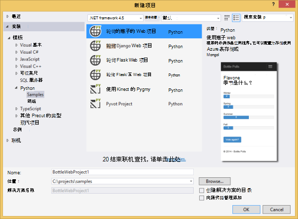

1.  系统将提示您安装外部包。 选择**安装到虚拟环境**。

    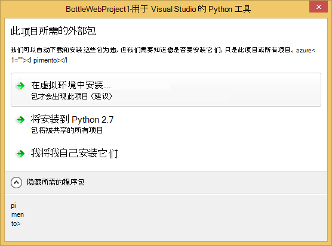

1.  作为基本的解释器中选择**Python 2.7**或**Python 3.4** 。

    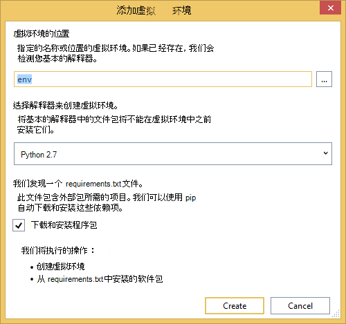

1.  确认应用程序可以通过按下`F5`。 默认情况下，应用程序使用内存中存储库中不需要任何配置。 当 web 服务器已停止，则所有数据都都会丢失。

1.  **创建示例轮询**，请单击，然后单击轮询和投票。

    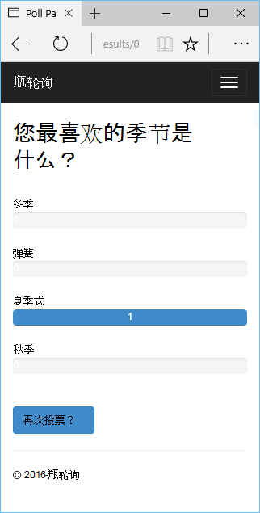

## 创建一个 Azure 存储帐户

要使用存储操作，您需要 Azure 存储帐户。 您可以按照下面的步骤创建存储帐户。

1.  登录到[Azure 的门户](https://portal.azure.com/)。

1. 单击顶部的**新建**图标左侧的门户，再单击**数据 + 存储** > **存储帐户**。  单击**创建**按钮，然后提供一个唯一名称的存储帐户，并为其创建新的[资源组](../azure-resource-manager/resource-group-overview.md)。

    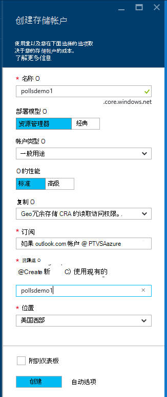

    已创建存储帐户，**通知**按钮会闪烁绿色的**成功**和存储帐户的刀片式服务器已打开以显示它属于您创建新的资源组。

1. 单击存储帐户的刀片式服务器中的**访问键**部分。 请记的帐户名和 key1。

    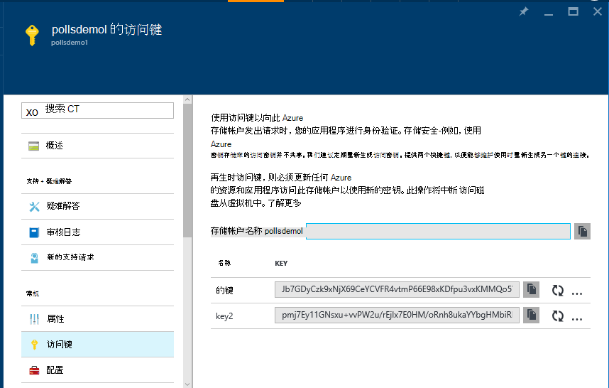

    我们将需要此信息来配置在下一节中的项目。

## 配置项目

在本节中，我们将配置使应用程序能够使用我们刚刚创建的存储帐户。 然后我们将本地运行应用程序。

1.  在 Visual Studio 中，用鼠标右键单击您在解决方案资源管理器中的项目节点并选择**属性**。 在**调试**选项卡上单击。

    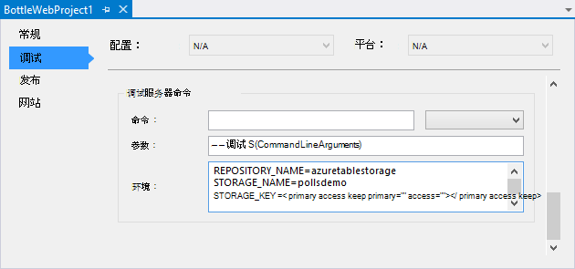

1.  设置所需的应用程序在**调试服务器命令**中，**环境**的环境变量的值。

        REPOSITORY_NAME=azuretablestorage
        STORAGE_NAME=<storage account name>
        STORAGE_KEY=<primary access key>

    这会将环境变量设置当您**开始调试**。 如果您希望设置下**运行服务器命令**的相同值以及时**开始而不调试**，能够设置变量。

    或者，您可以定义环境变量，使用 Windows 控制面板。 如果您想要避免将凭据存储在源代码中 / 项目文件，这是更好的选择。 请注意，您需要重新启动 Visual Studio 为新的环境值，可供该应用程序。

1.  实现是 Azure 表存储库的代码是**models/azuretablestorage.py**。 如何使用 Python 从表服务，请参阅[文档]以了解更多信息。

1.  运行该应用程序与`F5`。 **创建示例轮询**和提交投票的数据创建的轮询在 Azure 表存储将被序列化。

    > [AZURE.NOTE] 在 Visual Studio 中，Python 2.7 虚拟环境可能会导致异常中断。  按`F5`继续加载 web 项目。 

1.  浏览至**有关**页，以验证应用程序使用**Azure 表存储**库。

    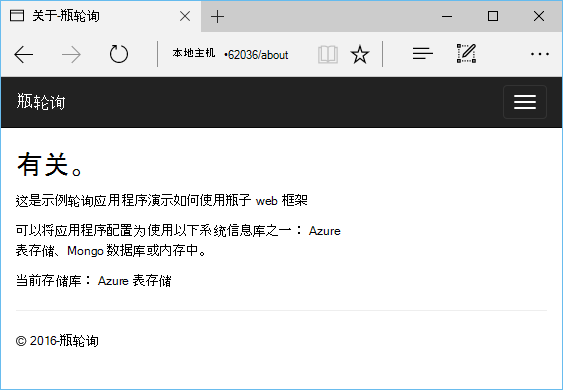

## 探索的 Azure 表存储

很容易地查看和编辑存储在 Visual Studio 中使用云资源管理器中的表。 在本节中我们将使用服务器资源管理器来查看轮询应用程序表中的内容。

> [AZURE.NOTE] 这就需要 Microsoft Azure 工具安装，可作为[.NET 的 Azure SDK]的一部分。

1.  打开**云资源管理器**。 展开**存储帐户**，您的存储帐户，然后**表**。

    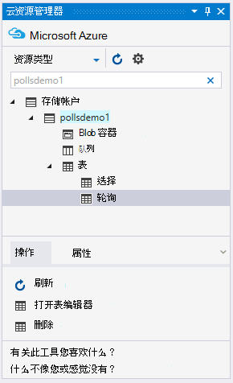

1.  双击要查看表的内容在文档窗口中，添加/删除/编辑实体的**轮询**或**选项**表。

    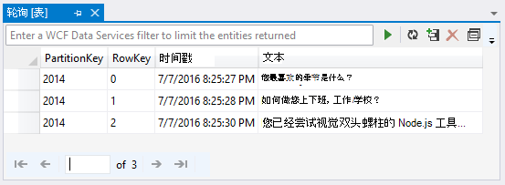

## 将 web 应用程序发布到 Azure 应用程序服务

Azure.NET SDK 提供可以轻松地将您的 web 应用程序部署到 Azure 应用程序服务。

1.  在**解决方案资源管理器**中右键单击项目节点并选择**发布**。

    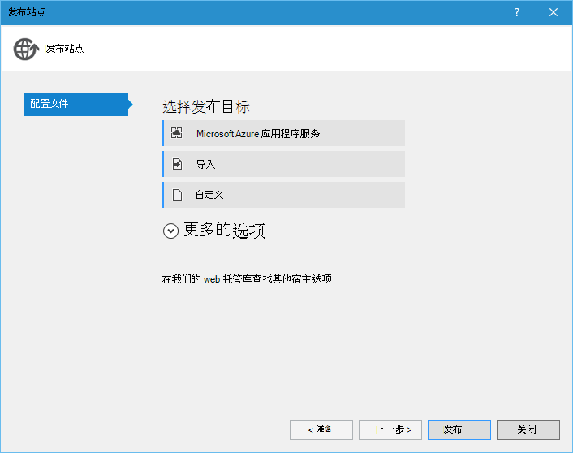

1.  在**Microsoft Azure Web 应用程序**上单击。

1.  单击**新建**创建新的 web 应用程序。

1.  填写以下字段，然后单击**创建**。
    -   **Web 应用程序名称**
    -   **应用程序服务计划**
    -   **资源组**
    -   **地区**
    -   使**数据库服务器**设置为**任何数据库**

1.  接受其他所有默认设置并单击**发布**。

1.  Web 浏览器会自动打开已发布的 web 应用程序。 如果您浏览有关网页，您将看到它使用**内存中**存储库，而不是**Azure 表存储**库。

    这是因为环境变量未设置在 Azure 应用程序服务中，对 Web 应用程序实例，以便它使用在**settings.py**中指定的默认值。

## 配置 Web 应用程序实例

在本节中，我们将配置 Web 应用程序实例的环境变量。

1.  在[Azure 门户]，通过单击**浏览**打开 web 应用程序的刀片式服务器 > **应用程序服务**> 您 web 应用程序的名称。

1.  在 web 应用程序的刀片，单击**所有设置**，然后单击**应用程序设置**。

1.  向下滚动到**应用程序设置**部分，设置的值**资料库\_名称**，**存储\_名称**和**存储\_键**上面的**项目配置**一节中所述。

    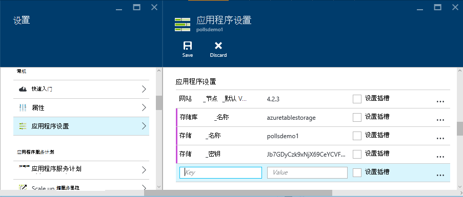

1.  单击**保存**。 已收到所应用的更改的通知后，请单击**浏览**从 Web 应用程序的主刀片。

1.  您应该会看到 web 应用程序正常运行，使用**Azure 表存储**库。

    祝贺您 ！

    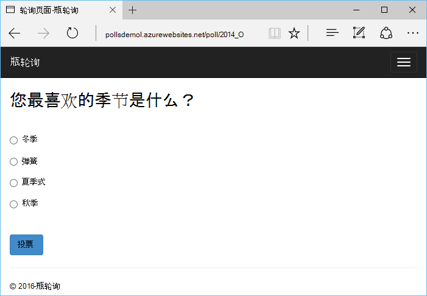

## 下一步行动

按照这些链接以了解更多关于 Python 工具 Visual Studio、 瓶子和 Azure 表存储。

- [Python 工具 Visual Studio 文档]
  - [Web 项目]
  - [云服务项目]
  - [在 Microsoft Azure 上的远程调试]
- [瓶子的文档]
- [Azure 存储]
- [Python 的 azure SDK]
- [如何使用 Python 中的表存储服务]

## 会发生什么变化
* 有关更改网站为应用程序服务的指南，请参阅︰ [Azure 应用程序服务，并对现有的 Azure 服务及其影响](http://go.microsoft.com/fwlink/?LinkId=529714)

<!--Link references-->
[Python 开发人员中心]: /develop/python/
[Azure 的云服务]: ../cloud-services-python-ptvs.md
[文档]: ../storage-python-how-to-use-table-storage.md
[如何使用 Python 中的表存储服务]: ../storage-python-how-to-use-table-storage.md

<!--External Link references-->
[Azure 门户]: https://portal.azure.com
[使.NET 的 azure SDK]: http://azure.microsoft.com/downloads/
[Visual Studio 的 Python 工具]: http://aka.ms/ptvs
[Python 的 Visual Studio 工具 2.2]: http://go.microsoft.com/fwlink/?LinkId=624025
[Python 工具 Visual Studio 样本 VSIX 2.2]: http://go.microsoft.com/fwlink/?LinkId=624025
[VS 2015 的 azure SDK 工具]: http://go.microsoft.com/fwlink/?LinkId=518003
[Python 2.7 32 位]: http://go.microsoft.com/fwlink/?LinkId=517190 
[Python 3.4 32 位]: http://go.microsoft.com/fwlink/?LinkId=517191
[Python 工具 Visual Studio 文档]: http://aka.ms/ptvsdocs
[瓶子的文档]: http://bottlepy.org/docs/dev/index.html
[在 Microsoft Azure 上的远程调试]: http://go.microsoft.com/fwlink/?LinkId=624026
[Web 项目]: http://go.microsoft.com/fwlink/?LinkId=624027
[云服务项目]: http://go.microsoft.com/fwlink/?LinkId=624028
[Azure 存储]: http://azure.microsoft.com/documentation/services/storage/
[Python 的 azure SDK]: https://github.com/Azure/azure-sdk-for-python
 
