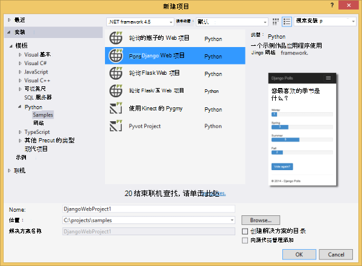
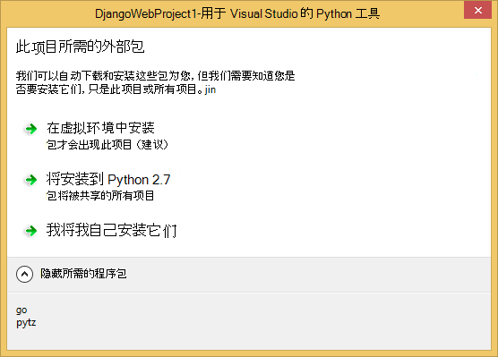
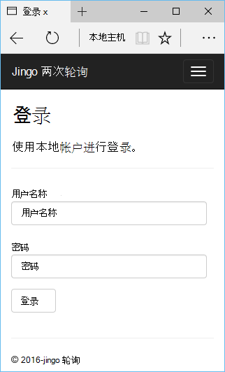
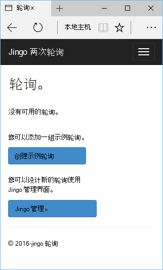
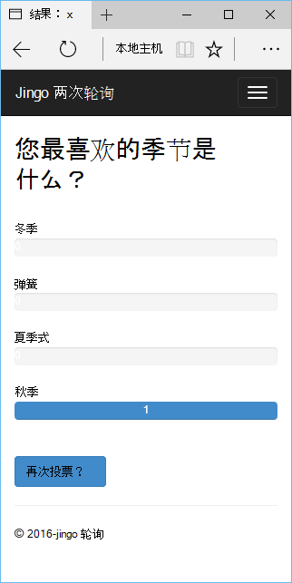
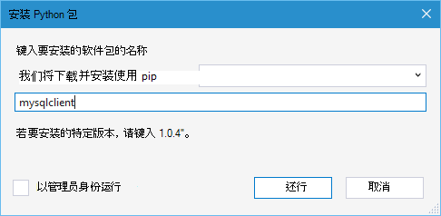
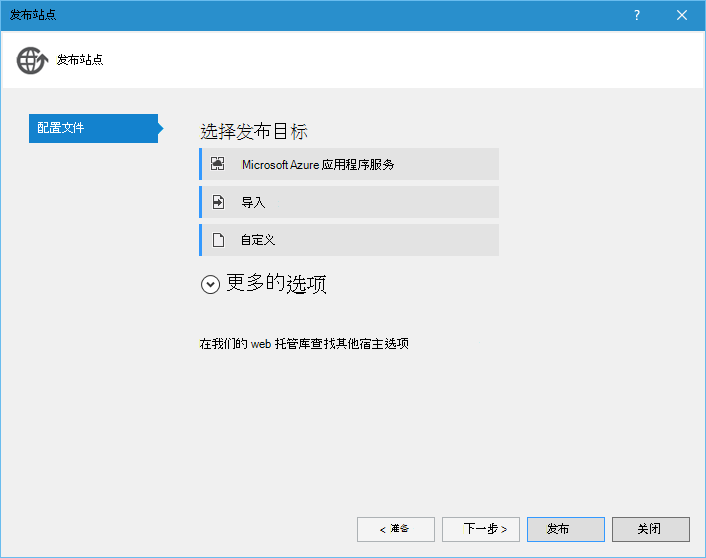
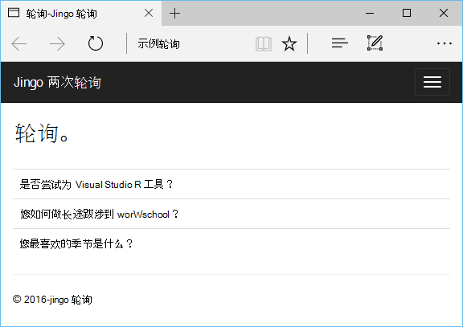

<properties 
    pageTitle="Django 和 MySQL 在使用 Visual Studio 的 Python 工具 2.2 Azure 上" 
    description="了解如何使用 Visual Studio 的 Python 工具创建 Django 的 web 应用程序，将数据存储在一个 MySQL 数据库实例并将其部署到 Azure 应用程序服务 Web 应用程序。" 
    services="app-service\web" 
    documentationCenter="python" 
    authors="huguesv" 
    manager="wpickett" 
    editor=""/>

<tags 
    ms.service="app-service-web" 
    ms.workload="web" 
    ms.tgt_pltfrm="na" 
    ms.devlang="python"
    ms.topic="get-started-article" 
    ms.date="07/07/2016"
    ms.author="huvalo"/>

# Django 和 MySQL 在使用 Visual Studio 的 Python 工具 2.2 Azure 上 

[AZURE.INCLUDE [tabs](../../includes/app-service-web-get-started-nav-tabs.md)]

在本教程中，您将使用[Visual Studio 的 Python 工具](PTVS) 来创建简单的轮询 web 应用程序使用 PTVS 示例模板之一。 您将学习如何使用 Azure 上承载的 MySQL 服务、 如何配置 web 应用程序使用 MySQL 和如何将 web 应用程序发布到[Azure 应用程序服务 Web 应用程序](http://go.microsoft.com/fwlink/?LinkId=529714)。

> [AZURE.NOTE] 在本教程中包含的信息也是用下面的视频︰
> 
> [MySQL PTVS 2.1: Django 应用程序][video]

请参阅[Python 开发者中心]的更多文章，涵盖了与 PTVS 的瓶子和 Flask Django 的 web 框架，使用 Azure 表存储、 MySQL 和 SQL 数据库服务的 Azure 应用程序服务 Web 应用程序的开发。 本文主要讨论应用程序服务，而步骤开发[Azure 云服务]时很相似。

## 系统必备组件

 - Visual Studio 2015 年
 - [Python 2.7 32 位]或者[Python 3.4 32 位]
 - [Python 的 Visual Studio 工具 2.2]
 - [Python 工具 Visual Studio 样本 VSIX 2.2]
 - [VS 2015 的 azure SDK 工具]
 - Django 1.9 版或更高版本

[AZURE.INCLUDE [create-account-and-websites-note](../../includes/create-account-and-websites-note.md)]

<!-- This note should not render as part of the the previous include. -->

> [AZURE.NOTE] 如果您想要怎样的 Azure 帐户之前开始使用 Azure 应用程序服务，请转到[尝试应用程序服务](http://go.microsoft.com/fwlink/?LinkId=523751)，立即可以在此创建短期的初学者 web 应用程序在应用程序服务。 没有信用卡是必需的并没有承诺是必要的。

## 创建项目

在本节中，您将创建 Visual Studio 项目时使用的示例模板。 您将创建一个虚拟环境并安装所需的程序包。 您将创建一个使用 sqlite 的本地数据库。 然后将本地运行应用程序。

1. 在 Visual Studio 中，选择**文件**，**新的项目**。

1. [Python 工具 2.2 个 Visual Studio 样本 VSIX]项目模板是**Python**，**样本**。 选择**轮询 Django Web 项目**，然后单击确定以创建项目。

    

1. 系统将提示您安装外部包。 选择**安装到虚拟环境**。

    

1. 作为基本的解释器中选择**Python 2.7**或**Python 3.4** 。

    

1. 在**解决方案资源管理器**中右键单击项目节点并选择**Python**，然后选择**Django 迁移**。  然后，选择**创建 Django 的超级用户**。

1. 这将打开 Django 管理控制台，并在项目文件夹中创建一个 sqlite 数据库。 按照提示创建一个用户。

1. 确认应用程序可以通过按下`F5`。

1. 单击顶部导航栏中的**登录**。

    

1. 同步数据库时创建的用户输入的凭据。

    

1. 单击**创建示例轮询**。

    

1. 在民意测验上单击并进行投票。

    

## 创建一个 MySQL 数据库

对于数据库，您将创建在 Azure 上承载的 ClearDB MySQL 数据库。

作为一种替代方法，可以创建您自己的虚拟机运行在 Azure，然后安装和管理 MySQL 自己。

您可以按照下面的步骤提供免费计划，创建数据库。

1. 登录到[Azure 的门户]。

1. 在导航窗格的顶部，单击**新建**，然后单击**数据 + 存储**，然后单击**MySQL 数据库**。 

1. 通过创建新的资源组配置新的 MySQL 数据库并选择它的适当位置。

1. MySQL 数据库创建之后，单击刀片式服务器数据库中的**属性**。

1. 使用复制按钮可以将**连接字符串**的值放在剪贴板上。

## 配置项目

在本节中，您将配置我们的 web 应用程序以使用刚创建的 MySQL 数据库。 您也将安装与 Django 使用 MySQL 数据库所需的其他 Python 包。 然后将本地运行 web 应用程序。

1. 在 Visual Studio 中，从*项目名称*的文件夹中打开**settings.py**，。 暂时在编辑器中粘贴该连接字符串。 连接字符串是以这种格式︰

        Database=<NAME>;Data Source=<HOST>;User Id=<USER>;Password=<PASSWORD>

    更改默认的数据库**引擎**使用 MySQL，并从**连接字符串**的**名称**、**用户名**、**密码**和**主机**设置的值。

        DATABASES = {
            'default': {
                'ENGINE': 'django.db.backends.mysql',
                'NAME': '<Database>',
                'USER': '<User Id>',
                'PASSWORD': '<Password>',
                'HOST': '<Data Source>',
                'PORT': '',
            }
        }

1. 在解决方案资源管理器中，在**Python 的环境**中，用鼠标右键单击虚拟环境并选择**安装 Python 包**。

1. 安装程序包`mysqlclient`使用**骰**。

    

1. 在**解决方案资源管理器**中右键单击项目节点并选择**Python**，然后选择**Django 迁移**。  然后，选择**创建 Django 的超级用户**。

    这将创建为 MySQL 数据库在上一节中创建的表。 按照提示创建一个用户，并不一定要匹配在这篇文章的第一节中创建的 sqlite 数据库中的用户。

1. 运行该应用程序与`F5`。 在 MySQL 数据库中，将序列化**创建示例轮询**和提交投票的数据创建的轮询。

## 将 web 应用程序发布到 Azure 应用程序服务

Azure.NET SDK 提供可以轻松地将您的 web 应用程序部署到 Azure 应用程序服务。

1. 在**解决方案资源管理器**中右键单击项目节点并选择**发布**。

    

1. 单击**Microsoft Azure 应用程序服务**。

1. 单击**新建**创建新的 web 应用程序。

1. 填写以下字段，然后单击**创建**︰
    - **Web 应用程序名称**
    - **应用程序服务计划**
    - **资源组**
    - **地区**
    - 使**数据库服务器**设置为**任何数据库**

1. 接受其他所有默认设置并单击**发布**。

1. Web 浏览器会自动打开已发布的 web 应用程序。 您应该看到正常运行，使用**MySQL**数据库在 Azure 上承载的 web 应用程序。

    

    祝贺您 ！ 您已成功发布到 Azure 的基于 MySQL 的 web 应用程序。

## 下一步行动

按照这些链接以了解更多关于 Python 工具 Visual Studio，Django 和 MySQL。

- [Python 工具 Visual Studio 文档]
  - [Web 项目]
  - [云服务项目]
  - [在 Microsoft Azure 上的远程调试]
- [Django 文档]
- [MySQL]

有关详细信息，请参阅[Python 开发中心](/develop/python/)。

<!--Link references-->

[Python 开发人员中心]: /develop/python/
[Azure 的云服务]: ../cloud-services-python-ptvs.md

<!--External Link references-->

[Azure 门户]: https://portal.azure.com
[Visual Studio 的 Python 工具]: http://aka.ms/ptvs
[Python 的 Visual Studio 工具 2.2]: http://go.microsoft.com/fwlink/?LinkID=624025
[Python 工具 Visual Studio 样本 VSIX 2.2]: http://go.microsoft.com/fwlink/?LinkID=624025
[VS 2015 的 azure SDK 工具]: http://go.microsoft.com/fwlink/?LinkId=518003
[Python 2.7 32 位]: http://go.microsoft.com/fwlink/?LinkId=517190 
[Python 3.4 32 位]: http://go.microsoft.com/fwlink/?LinkId=517191
[Python 工具 Visual Studio 文档]: http://aka.ms/ptvsdocs
[在 Microsoft Azure 上的远程调试]: http://go.microsoft.com/fwlink/?LinkId=624026
[Web 项目]: http://go.microsoft.com/fwlink/?LinkId=624027
[云服务项目]: http://go.microsoft.com/fwlink/?LinkId=624028
[Django 文档]: https://www.djangoproject.com/
[MySQL]: http://www.mysql.com/
[video]: http://youtu.be/oKCApIrS0Lo
