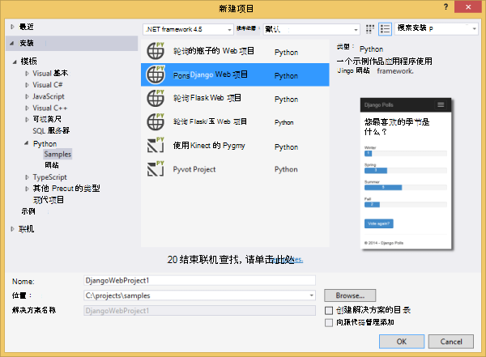
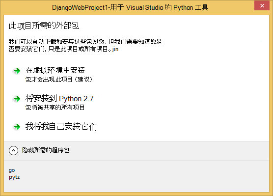
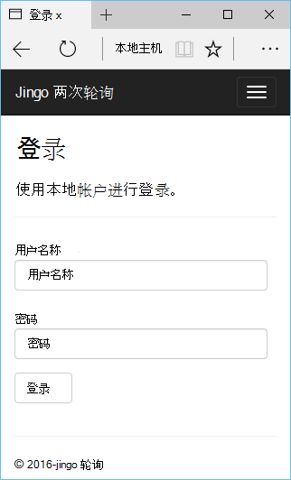
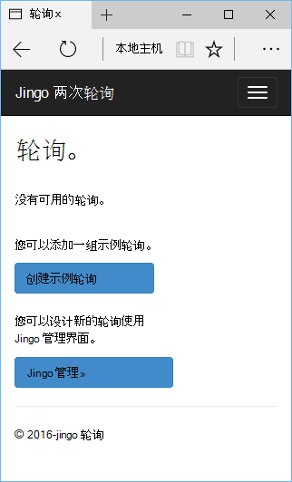
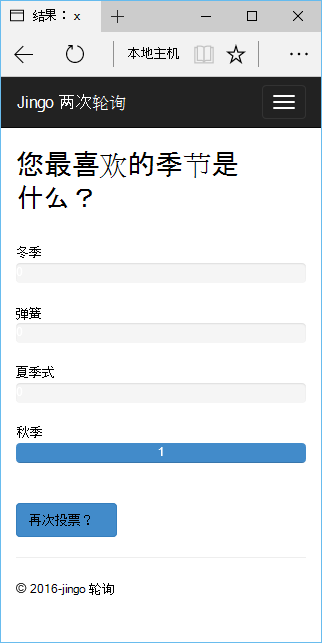
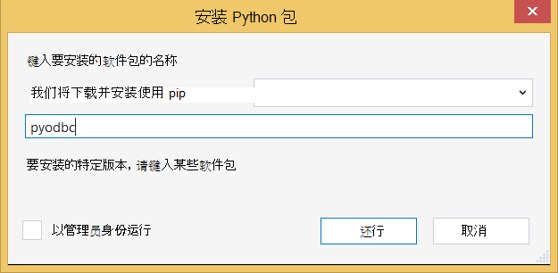
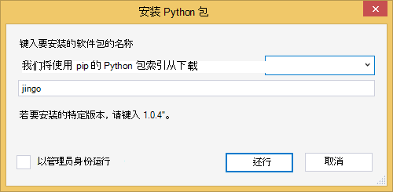
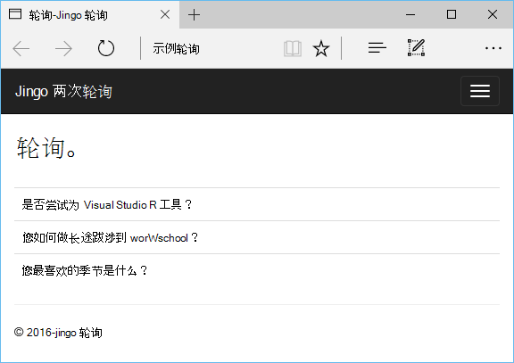

<properties 
    pageTitle="Django 并使用 Visual Studio 的 Python 工具 2.2 Azure 上的 SQL 数据库" 
    description="了解如何使用 Visual Studio 的 Python 工具创建 Django 的 web 应用程序，将数据存储在一个 SQL 数据库实例并将其部署到 Azure 应用程序服务 Web 应用程序。" 
    services="app-service\web" 
    tags="python"
    documentationCenter="python" 
    authors="huguesv" 
    manager="wpickett" 
    editor=""/>

<tags 
    ms.service="app-service-web" 
    ms.workload="web" 
    ms.tgt_pltfrm="na" 
    ms.devlang="python" 
    ms.topic="article" 
    ms.date="07/07/2016"
    ms.author="huguesv"/>

# Django 并使用 Visual Studio 的 Python 工具 2.2 Azure 上的 SQL 数据库 

在本教程中，我们将使用[Visual Studio 的 Python 工具]创建简单轮询 web 应用程序使用 PTVS 示例模板之一。 本教程还会为[视频](https://www.youtube.com/watch?v=ZwcoGcIeHF4)提供。

我们将学习如何使用 Azure 上的 SQL 数据库，如何配置 web 应用程序以使用 SQL 数据库，以及如何将 web 应用程序发布到[Azure 应用程序服务 Web 应用程序](http://go.microsoft.com/fwlink/?LinkId=529714)。

请参阅[Python 开发者中心]的更多文章，涵盖了与 PTVS 的瓶子和 Flask Django 的 web 框架，使用 Azure 表存储，MySQL 和 SQL 数据库服务的 Azure 应用程序服务 Web 应用程序的开发。 本文主要讨论应用程序服务，而步骤开发[Azure 云服务]时很相似。

## 系统必备组件

 - Visual Studio 2015 年
 - [Python 2.7 32 位]
 - [Python 的 Visual Studio 工具 2.2]
 - [Python 工具 Visual Studio 样本 VSIX 2.2]
 - [VS 2015 的 azure SDK 工具]
 - Django 1.9 版或更高版本

[AZURE.INCLUDE [create-account-and-websites-note](../../includes/create-account-and-websites-note.md)]

>[AZURE.NOTE] 如果您想要怎样的 Azure 帐户之前开始使用 Azure 应用程序服务，请转到[尝试应用程序服务](http://go.microsoft.com/fwlink/?LinkId=523751)，立即可以在此创建短期的初学者 web 应用程序在应用程序服务。 没有信用卡，所需;没有承诺。

## 创建项目

在本节中，我们将创建 Visual Studio 项目时使用的示例模板。 我们将创建一个虚拟环境，并安装所需的程序包。 我们将创建一个使用 sqlite 的本地数据库。 然后我们将本地运行 web 应用程序。

1.  在 Visual Studio 中，选择**文件**，**新的项目**。

1.  [Python 工具 2.2 个 Visual Studio 样本 VSIX]项目模板是**Python**，**样本**。 选择**轮询 Django Web 项目**，然后单击确定以创建项目。

    

1.  系统将提示您安装外部包。 选择**安装到虚拟环境**。

    

1.  作为基本的解释器选择**Python 2.7** 。

    

1.  在**解决方案资源管理器**中右键单击项目节点并选择**Python**，然后选择**Django 迁移**。  然后，选择**创建 Django 的超级用户**。

1.  这将打开 Django 管理控制台，并在项目文件夹中创建一个 sqlite 数据库。 按照提示创建一个用户。

1.  确认应用程序可以通过按<kbd>f5 键</kbd>。

1.  单击顶部导航栏中的**登录**。

    

1.  同步数据库时创建的用户输入的凭据。

    

1.  单击**创建示例轮询**。

    

1.  在民意测验上单击并进行投票。

    

## 创建 SQL 数据库

对于数据库，我们将创建一个 SQL Azure 数据库。

您可以通过执行下列步骤来创建数据库。

1.  登录到[Azure 的门户]。

1.  在导航窗格的底部，单击**新建**。 请单击**数据 + 存储** > **SQL 数据库**。

1.  通过创建新的资源组配置新的 SQL 数据库并选择它的适当位置。

1.  一旦创建 SQL 数据库，则单击**在 Visual Studio 中打开**刀片式服务器数据库中。
2.  单击**配置您的防火墙**。
3.  在**设置防火墙**刀片式服务器，添加与**起始 IP**和**结束 IP**防火墙规则设置为您的开发计算机的公共 IP 地址。 单击**保存**。

    这样，连接到数据库服务器从开发机器。

4.  返回在数据库刀片式服务器，单击**属性**，然后单击**显示数据库连接字符串**。 

2.  使用复制按钮将**ADO.NET**的值放在剪贴板上。

## 配置项目

在本节中，我们将配置我们的 web 应用程序能够使用我们刚刚创建的 SQL 数据库。 我们还将安装与 Django 使用 SQL 数据库所需的其他 Python 包。 然后我们将本地运行 web 应用程序。

1.  在 Visual Studio 中，从*项目名称*的文件夹中打开**settings.py**，。 暂时在编辑器中粘贴该连接字符串。 连接字符串是以这种格式︰

        Server=<ServerName>,<ServerPort>;Database=<DatabaseName>;User ID=<UserName>;Password={your_password_here};Encrypt=True;TrustServerCertificate=False;Connection Timeout=30;

编辑定义`DATABASES`使用上面的值。

        DATABASES = {
            'default': {
                'ENGINE': 'sql_server.pyodbc',
                'NAME': '<DatabaseName>',
                'USER': '<UserName>',
                'PASSWORD': '{your_password_here}',
                'HOST': '<ServerName>',
                'PORT': '<ServerPort>',
                'OPTIONS': {
                    'driver': 'SQL Server Native Client 11.0',
                    'MARS_Connection': 'True',
                }
            }
        }

1.  在解决方案资源管理器中，在**Python 的环境**中，用鼠标右键单击虚拟环境并选择**安装 Python 包**。

1.  安装程序包`pyodbc`使用**骰**。

    

1.  安装程序包`django-pyodbc-azure`使用**骰**。

    

1.  在**解决方案资源管理器**中右键单击项目节点并选择**Python**，然后选择**Django 迁移**。  然后，选择**创建 Django 的超级用户**。

    这将创建为我们上一节中创建的 SQL 数据库的表。 按照提示创建一个用户，并不一定要匹配用户在第一节中创建的 sqlite 数据库。

1.  运行该应用程序与`F5`。 在 SQL 数据库中，将序列化**创建的示例轮询**和提交投票的数据创建的轮询。

## 将 web 应用程序发布到 Azure 应用程序服务

Azure.NET SDK 提供可以轻松地将您网站的 web 应用程序部署到 Azure 应用程序服务 Web 应用程序。

1.  在**解决方案资源管理器**中右键单击项目节点并选择**发布**。

    

1.  在**Microsoft Azure Web 应用程序**上单击。

1.  单击**新建**创建新的 web 应用程序。

1.  填写以下字段，然后单击**创建**。
    -   **Web 应用程序名称**
    -   **应用程序服务计划**
    -   **资源组**
    -   **地区**
    -   使**数据库服务器**设置为**任何数据库**

1.  接受其他所有默认设置并单击**发布**。

1.  Web 浏览器会自动打开已发布的 web 应用程序。 使用**SQL**数据库驻留在 Azure 上，您会看到 web 应用程序按预期工作。

    祝贺您 ！

    

## 下一步行动

按照这些链接以了解更多关于 Python 工具 Visual Studio，Django 和 SQL 数据库。

- [Python 工具 Visual Studio 文档]
  - [Web 项目]
  - [云服务项目]
  - [在 Microsoft Azure 上的远程调试]
- [Django 文档]
- [SQL 数据库]

## 会发生什么变化
* 有关更改网站为应用程序服务的指南，请参阅︰ [Azure 应用程序服务，并对现有的 Azure 服务及其影响](http://go.microsoft.com/fwlink/?LinkId=529714)

<!--Link references-->
[Python 开发人员中心]: /develop/python/
[Azure 的云服务]: ../cloud-services-python-ptvs.md

<!--External Link references-->
[Azure 门户]: https://portal.azure.com
[Visual Studio 的 Python 工具]: http://aka.ms/ptvs
[Python 的 Visual Studio 工具 2.2]: http://go.microsoft.com/fwlink/?LinkID=624025
[Python 工具 Visual Studio 样本 VSIX 2.2]: http://go.microsoft.com/fwlink/?LinkID=624025
[VS 2015 的 azure SDK 工具]: http://go.microsoft.com/fwlink/?LinkId=518003
[Python 2.7 32 位]: http://go.microsoft.com/fwlink/?LinkId=517190 
[Python 工具 Visual Studio 文档]: http://aka.ms/ptvsdocs
[在 Microsoft Azure 上的远程调试]: http://go.microsoft.com/fwlink/?LinkId=624026
[Web 项目]: http://go.microsoft.com/fwlink/?LinkId=624027
[云服务项目]: http://go.microsoft.com/fwlink/?LinkId=624028
[Django 文档]: https://www.djangoproject.com/
[SQL 数据库]: /documentation/services/sql-database/
