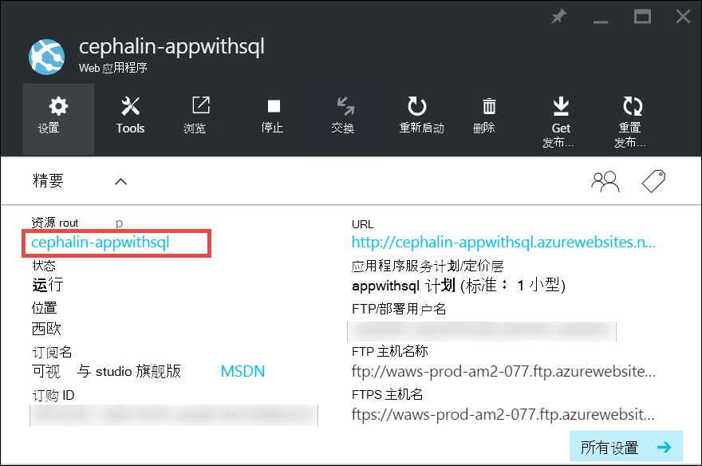
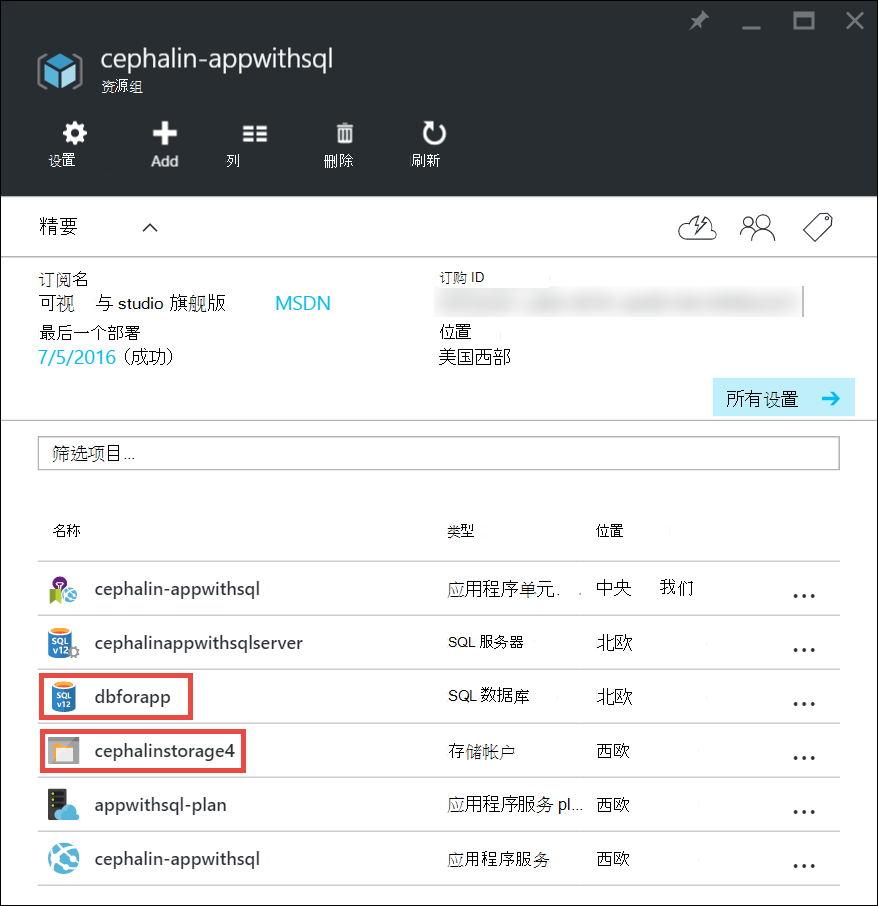
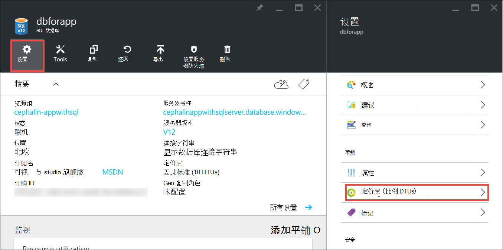
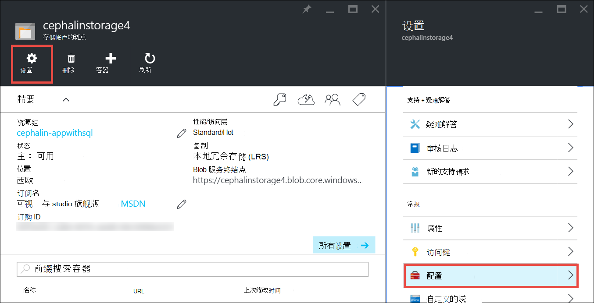

<properties
    pageTitle="扩大在 Azure 应用程序 |Microsoft Azure"
    description="了解如何扩大在 Azure 应用程序服务来添加容量和功能的应用程序。"
    services="app-service"
    documentationCenter=""
    authors="cephalin"
    manager="wpickett"
    editor="mollybos"/>

<tags
    ms.service="app-service"
    ms.workload="na"
    ms.tgt_pltfrm="na"
    ms.devlang="na"
    ms.topic="article"
    ms.date="07/05/2016"
    ms.author="cephalin"/>

# 在 Azure 应用程序扩展 #

本文演示如何扩展您的应用程序在 Azure 应用程序服务。 有两个工作流比例，比例上，扩大规模和这篇文章介绍了工作流的比例。

- [向上扩展](https://en.wikipedia.org/wiki/Scalability#Horizontal_and_vertical_scaling)︰ 获取更多的 CPU、 内存、 磁盘空间和额外功能，如专用的虚拟机 (Vm)、 自定义的域和暂存槽、 自动缩放，和更多的证书。 通过更改您的应用程序所属的应用程序服务计划定价层来扩大规模。
- [向外的扩展](https://en.wikipedia.org/wiki/Scalability#Horizontal_and_vertical_scaling)︰ 增加运行您的应用程序的虚拟机实例的数量。
您可以扩展到多达 20 个实例，具体取决于您的定价层。 **特优**层中的[应用程序服务的环境](../app-service/app-service-app-service-environments-readme.md)将进一步增加到 50 的实例向外扩展统计。 横向扩展的详细信息，请参阅[手动或自动缩放实例计数](../monitoring-and-diagnostics/insights-how-to-scale.md)。 那里，您将了解如何使用自动缩放，即扩展实例计数自动基于预定义的规则和计划。

缩放设置只需要几秒钟来应用和影响您[的应用程序服务计划](../app-service/azure-web-sites-web-hosting-plans-in-depth-overview.md)中的所有应用程序。
它们不需要您更改代码或重新部署应用程序。

有关定价和单个应用程序服务计划功能的信息，请参阅[应用程序服务定价详细信息](/pricing/details/web-sites/)。  

> [AZURE.NOTE] 切换应用程序服务计划从**自由**层之前，您必须首先删除[支出限制](/pricing/spending-limits/)就地 Azure 订阅。 若要查看或更改您的 Microsoft Azure 应用程序服务订阅的选项，请参阅[Microsoft Azure 订阅][azuresubscriptions]。

## 扩大您的定价层

1. 在浏览器中，打开[Azure 的门户网站][portal]。

2. 您的应用程序的刀片中**的所有设置**，请单击，再单击**向上扩展**。

    ![扩大您的 Azure 应用程序导航。][ChooseWHP]

4. 选择您层，然后单击**选择**。

    操作完成后，**通知**选项卡会闪烁绿色的**成功**。

## 调节相关的资源
如果您的应用程序依赖于其他服务，例如 SQL Azure 数据库或 Azure 存储，还可以扩大根据您需要的资源。 这些资源与应用程序服务计划不作缩放和必须独立进行扩展。

1. 在**精要**单击**资源组**链接。

    

2. 在**资源组**刀片式服务器的**摘要**部分中，单击您想要扩展的资源。 下面的屏幕快照显示了 SQL 数据库资源和 Azure 存储资源。

    

3. 对于 SQL 数据库资源，单击**设置** > 分层**定价层**来调整价格。

    

    您还可以打开[地理复制](../sql-database/sql-database-geo-replication-overview.md)SQL 数据库实例。

    Azure 存储资源，请单击**设置** > **配置**扩展存储选项。

    

## 了解开发人员功能
根据定价层中，以下的面向开发人员的功能有︰

### 位元 ###

- **基本**、**标准**和**高级**层支持 64 位和 32 位应用程序。
- 在**免费**和**共享**计划级支持 32 位应用程序。

### 调试器支持 ###

- 调试器支持可为每个应用程序服务计划一个连接处的**自由**、**共享**和**基本**模式。
- 调试器支持是可用于在每个应用程序服务计划的五个并发连接的**标准**和**特优**模式。

## 了解其他功能

- 有关所有其余的功能在应用程序服务计划中，包括定价和感兴趣的所有用户 （包括开发人员） 的功能的详细信息，请参阅[应用程序服务定价详细信息](/pricing/details/web-sites/)。

>[AZURE.NOTE] 如果您想要开始使用 Azure 应用程序服务注册 Azure 帐户之前，请转到立即可以在此创建短期的初学者 web 应用程序的应用程序服务中[尝试应用程序服务](http://go.microsoft.com/fwlink/?LinkId=523751)。 需要没有信用卡也没有任何承诺。

## 下一步行动

- 若要开始使用 Azure，请参阅[Microsoft Azure 免费试用版](/pricing/free-trial/)。
- 有关定价、 支持和 SLA 的信息，请访问下面的链接。

    [数据传输定价详细信息](/pricing/details/data-transfers/)

    [Microsoft Azure 支持计划](/support/plans/)

    [服务级别协议要求](/support/legal/sla/)

    [SQL 数据库定价详细信息](/pricing/details/sql-database/)

    [虚拟机和 Microsoft Azure 的云服务大小][vmsizes]

    [应用程序服务定价详细信息](/pricing/details/app-service/)

    [定价详细信息-SSL 连接的应用程序服务](/pricing/details/web-sites/#ssl-connections)

- Azure 应用程序服务有关的信息的最佳做法，包括构建可伸缩和有弹性的体系结构，请参阅[的最佳做法︰ Azure 应用程序服务 Web 应用程序](http://blogs.msdn.com/b/windowsazure/archive/2014/02/10/best-practices-windows-azure-websites-waws.aspx)。

- 视频缩放应用程序服务的应用程序，请参阅以下资源︰

    - [当缩放 Azure 网站-与 Stefan Schackow](/documentation/videos/azure-web-sites-free-vs-standard-scaling/)
    - [自动缩放 Azure 网站、 CPU 或按预定的时间-与 Stefan Schackow](/documentation/videos/auto-scaling-azure-web-sites/)
    - [如何 Azure 网站规模，Stefan Schackow](/documentation/videos/how-azure-web-sites-scale/)

<!-- LINKS -->
[vmsizes]:/pricing/details/app-service/
[SQLaccountsbilling]:http://go.microsoft.com/fwlink/?LinkId=234930
[azuresubscriptions]:http://go.microsoft.com/fwlink/?LinkID=235288
[portal]: https://portal.azure.com/

<!-- IMAGES -->
[ChooseWHP]: ./media/web-sites-scale/scale1ChooseWHP.png
[ChooseBasicInstances]: ./media/web-sites-scale/scale2InstancesBasic.png
[SaveButton]: ./media/web-sites-scale/05SaveButton.png
[BasicComplete]: ./media/web-sites-scale/06BasicComplete.png
[ScaleStandard]: ./media/web-sites-scale/scale3InstancesStandard.png
[Autoscale]: ./media/web-sites-scale/scale4AutoScale.png
[SetTargetMetrics]: ./media/web-sites-scale/scale5AutoScaleTargetMetrics.png
[SetFirstRule]: ./media/web-sites-scale/scale6AutoScaleFirstRule.png
[SetSecondRule]: ./media/web-sites-scale/scale7AutoScaleSecondRule.png
[SetThirdRule]: ./media/web-sites-scale/scale8AutoScaleThirdRule.png
[SetRulesFinal]: ./media/web-sites-scale/scale9AutoScaleFinal.png
[ResourceGroup]: ./media/web-sites-scale/scale10ResourceGroup.png
[ScaleDatabase]: ./media/web-sites-scale/scale11SQLScale.png
[GeoReplication]: ./media/web-sites-scale/scale12SQLGeoReplication.png
