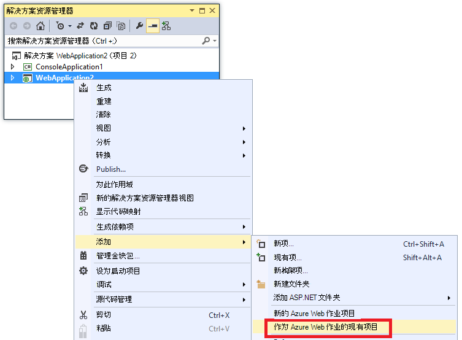
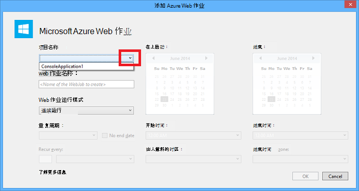
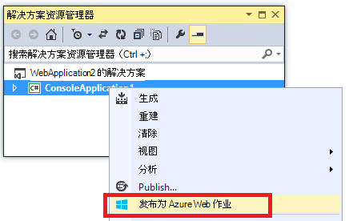
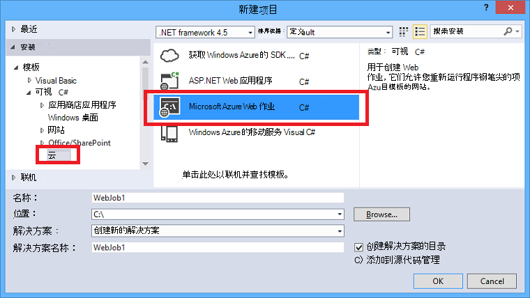
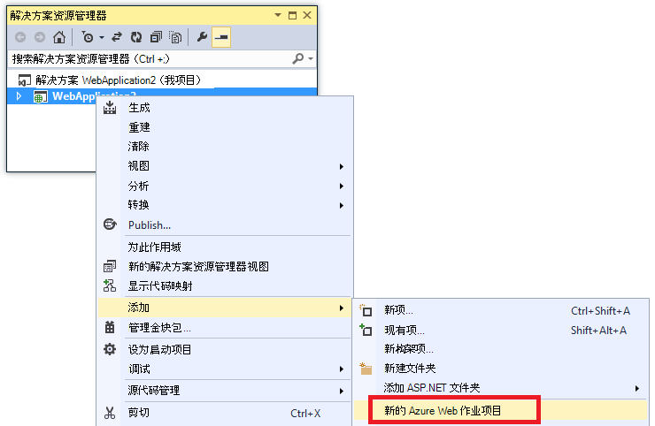
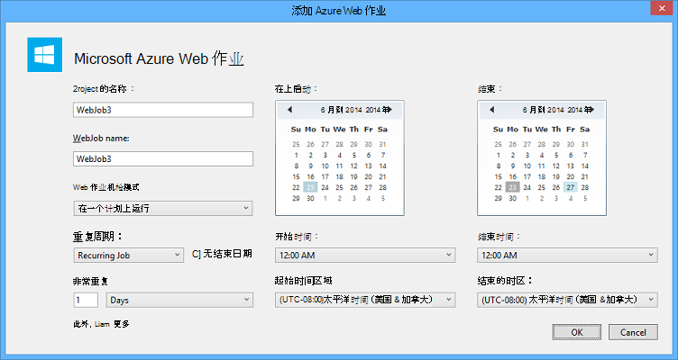

<properties 
    pageTitle="部署使用 Visual Studio 的 WebJobs" 
    description="了解如何部署到 Azure 应用程序服务 Web 应用程序使用 Visual Studio 的 Azure WebJobs。" 
    services="app-service" 
    documentationCenter="" 
    authors="tdykstra" 
    manager="wpickett" 
    editor="jimbe"/>

<tags 
    ms.service="app-service" 
    ms.devlang="dotnet" 
    ms.topic="article" 
    ms.tgt_pltfrm="na" 
    ms.workload="na" 
    ms.date="04/27/2016" 
    ms.author="tdykstra"/>

# 部署使用 Visual Studio 的 WebJobs

## 概述

本主题说明如何使用 Visual Studio 将一个控制台应用程序项目部署到 web 应用程序在[Azure WebJob](http://go.microsoft.com/fwlink/?LinkId=390226)作为[应用程序服务](http://go.microsoft.com/fwlink/?LinkId=529714)。 有关如何部署使用[Azure 门户网站](https://portal.azure.com)WebJobs 的信息，请参阅[使用 WebJobs 运行后台任务](web-sites-create-web-jobs.md)。

Visual Studio 部署启用 WebJobs 的控制台应用程序项目时，它会执行两个任务︰

* 将运行时文件复制到 web 应用程序*App_Data/作业/连续*的连续 WebJobs （ *App_Data/作业/触发*定时和点播 WebJobs） 中适当的文件夹。
* 对于计划在特定时间运行的 WebJobs 设置[Azure 调度程序作业](#scheduler)。 （这不是需要连续的 WebJobs。）

已启用 WebJobs 的项目包含以下菜单项添加到它︰

* [Microsoft.Web.WebJobs.Publish](http://www.nuget.org/packages/Microsoft.Web.WebJobs.Publish/) NuGet 程序包。
* [Webjob 发布 settings.json](#publishsettings)文件包含部署和计划程序设置。 

您可以将这些项目添加到现有的控制台应用程序项目或使用模板来创建一个新的 WebJobs 启用控制台应用程序项目。 

可以通过本身，作为 WebJob 部署项目或将其链接到 web 项目中，以便自动部署部署 web 项目时。 要链接的项目时，Visual Studio 在 web 项目中的[webjobs list.json](#webjobslist)文件中包括启用 WebJobs 的项目的名称。

## 系统必备组件

当您安装适用于.NET Azure SDK，WebJobs 部署功能均可在 Visual Studio 2015年:

* [Azure SDK.net (Visual Studio 2015)](http://go.microsoft.com/fwlink/?linkid=518003)。

## 启用 WebJobs 现有的控制台应用程序项目的部署

有两种选择︰

* [启用自动部署 web 项目](#convertlink)。

    配置一个现有的控制台应用程序项目，以便它自动将作为部署 WebJob 部署 web 项目时。 当您希望在同一 web 应用程序在其中运行相关的 web 应用程序中运行您的 WebJob 时，请使用此选项。

* [启用没有 web 项目部署](#convertnolink)。

    配置现有的控制台应用程序项目部署 WebJob 本身没有链接到 web 项目。 当您想要运行 WebJob web 应用程序中，并没有在 web 应用程序中运行的 web 应用程序时，请使用此选项。 您可能希望这样做是为了能够扩展您的 WebJob 资源独立于您的 web 应用程序资源。

### 启用自动 WebJobs 部署 web 项目
  
1. 用鼠标右键单击在**解决方案资源管理器**中的 web 项目，然后单击**添加** > **Azure WebJob 作为现有项目**。

    
    
    出现[添加 Azure WebJob](#configure)对话框。

1. 在**项目名称**下拉列表中选择要添加为 WebJob 的控制台应用程序项目。

    

2. 完成[添加 Azure WebJob](#configure)对话框，然后单击**确定**。 

### 启用 WebJobs 没有 web 项目的部署
  
1. 用鼠标右键单击在**解决方案资源管理器**中的控制台应用程序项目，然后单击**发布为 Azure WebJob**。 

    
    
    将出现[添加 Azure WebJob](#configure)对话框中，在**项目名称**框中选择该项目。

2.  完成[添加 Azure WebJob](#configure)对话框，然后单击**确定**。

    此时将显示**Web 发布**向导。  如果您不想立即发布，关闭该向导。 当您希望[将项目部署](#deploy)到用于保存您输入的设置。

## 创建一个新的 WebJobs 启用项目

若要创建新的已启用 WebJobs 的项目，可以使用控制台应用程序项目模板并启用 WebJobs 部署，如[前一节](#convert)中所述。 作为一种替代方法，您可以使用 WebJobs 新项目模板︰

* [使用独立的 WebJob WebJobs 新项目模板](#createnolink)

    创建一个项目并将其配置为部署本身为 WebJob，与没有链接到 web 项目。 当您想要运行 WebJob web 应用程序中，并没有在 web 应用程序中运行的 web 应用程序时，请使用此选项。 您可能希望这样做是为了能够扩展您的 WebJob 资源独立于您的 web 应用程序资源。

* [用于链接到 web 项目 WebJob 的 WebJobs 新项目模板](#createlink)

    创建项目配置为部署在同一个解决方案中的 web 项目时自动作为 WebJob 部署。 当您希望在同一 web 应用程序在其中运行相关的 web 应用程序中运行您的 WebJob 时，请使用此选项。

> [AZURE.NOTE] WebJobs 新项目模板会自动安装 NuGet 程序包，并为[WebJobs SDK](http://www.asp.net/aspnet/overview/developing-apps-with-windows-azure/getting-started-with-windows-azure-webjobs) *Program.cs*中包含的代码。 如果您不想使用 WebJobs SDK，或者想要使用计划，而不是连续的 WebJob，删除或更改`host.RunAndBlock` *Program.cs*中的语句。

### 使用独立的 WebJob WebJobs 新项目模板
  
1. 单击**文件** > **新建项目**，然后在**新建项目**对话框中单击**云** > **Microsoft Azure WebJob**。

    
    
2. 按照上文所示，为[使项目独立的 WebJobs 项目的控制台应用程序](#convertnolink)的说明。

### 用于链接到 web 项目 WebJob 的 WebJobs 新项目模板

1. 用鼠标右键单击在**解决方案资源管理器**中的 web 项目，然后单击**添加** > **新 Azure WebJob 项目**。

    

    出现[添加 Azure WebJob](#configure)对话框。

2. 完成[添加 Azure WebJob](#configure)对话框，然后单击**确定**。

## 添加 Azure WebJob 对话框

**添加 Azure WebJob**对话框，您可以输入 WebJob 的名称和计划设置为您的 WebJob。 

在此对话框中的字段对应于在 Azure 门户**新作业**对话框中的字段。 有关详细信息，请参阅[使用 WebJobs 运行后台任务](web-sites-create-web-jobs.md)。

对于 （不适用于连续 WebJobs) 计划 WebJob，Visual Studio 将创建[Azure 调度程序](/services/scheduler/)作业集合如果一个尚不存在，并且该集合中创建一项作业︰

* 计划程序作业集合被命名为*WebJobs-{regionname}* ， *{regionname}*是指区域网站中承载的应用程序。 例如︰ WebJobs WestUS。
* 调度作业被命名为*{webappname} 的 {webjobname}*。 例如︰ MyWebApp MyWebJob。 
 
>[AZURE.NOTE]
> 
>* 有关命令行部署信息，请参阅[命令行启用或 Azure WebJobs 连续传递](/blog/2014/08/18/enabling-command-line-or-continuous-delivery-of-azure-webjobs/)。
>* 如果您配置**定期作业**，并将重复执行频率设置为分钟数，Azure 计划程序服务不是免费的。 其他频率 （小时、 天、 等） 是免费的。
>* 如果部署 WebJob，然后决定您想要更改的类型 WebJob 和重新布置，您需要删除该发布 webjobs-settings.json 文件。 这将使 Visual Studio 再次显示发布选项使您可以更改 WebJob 的类型。
>* 如果在部署 WebJob 和以后更改从连续运行的模式，为间断，反之亦然，Visual Studio 重新部署时创建新的 WebJob 在 Azure。 如果您更改日程安排设置，但离开运行模式相同或切换计划和点播，Visual Studio 更新现有的作业而不是创建一个新中。

## 将发布 webjob-settings.json

在配置为 WebJobs 部署控制台应用程序时，Visual Studio 安装[Microsoft.Web.WebJobs.Publish](http://www.nuget.org/packages/Microsoft.Web.WebJobs.Publish/) NuGet 程序包，并*发布 webjob-settings.json*文件中的 WebJobs 项目的项目*属性*文件夹中存储的日程安排信息。 以下是该文件的一个示例︰

        {
          "$schema": "http://schemastore.org/schemas/json/webjob-publish-settings.json",
          "webJobName": "WebJob1",
          "startTime": "2014-06-23T00:00:00-08:00",
          "endTime": "2014-06-27T00:00:00-08:00",
          "jobRecurrenceFrequency": "Minute",
          "interval": 5,
          "runMode": "Scheduled"
        }

您可以直接编辑此文件，Visual Studio 提供 IntelliSense。 文件架构存储在[http://schemastore.org](http://schemastore.org/schemas/json/webjob-publish-settings.json)中，并且可以那里查看。  

>[AZURE.NOTE]
>
>* 如果您配置**定期作业**，并将重复执行频率设置为分钟数，Azure 计划程序服务不是免费的。 其他频率 （小时、 天、 等） 是免费的。

## webjobs list.json

启用 WebJobs 的项目链接到的 web 项目时，Visual Studio 将 WebJobs 项目的名称存储在 web 项目的*属性*文件夹中的*webjobs list.json*文件中。 列表中可能包含多个 WebJobs 项目，如下面的示例所示︰

        {
          "$schema": "http://schemastore.org/schemas/json/webjobs-list.json",
          "WebJobs": [
            {
              "filePath": "../ConsoleApplication1/ConsoleApplication1.csproj"
            },
            {
              "filePath": "../WebJob1/WebJob1.csproj"
            }
          ]
        }

您可以直接编辑此文件，Visual Studio 提供 IntelliSense。 文件架构存储在[http://schemastore.org](http://schemastore.org/schemas/json/webjobs-list.json)中，并且可以那里查看。
  
## 部署的 WebJobs 项目

已链接到 web 项目中的 WebJobs 项目自动部署 web 项目。 有关 web 项目部署的信息，请参阅[如何向 Web 应用程序部署](web-sites-deploy.md)。

若要部署的 WebJobs 项目，该项目在**解决方案资源管理器**中的用鼠标右键单击，单击**发布 Azure WebJob 为**。 

    
独立的 WebJob，用于 web 项目相同**Web 发布**向导出现，但具有较少的设置可供更改。

## 下一步行动

这篇文章讲述了如何使用 Visual Studio 部署 WebJobs。 有关如何部署 Azure WebJobs 的详细信息，请参阅[Azure WebJobs-建议资源的部署](http://www.asp.net/aspnet/overview/developing-apps-with-windows-azure/azure-webjobs-recommended-resources#deploying)。
