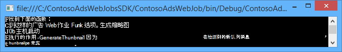
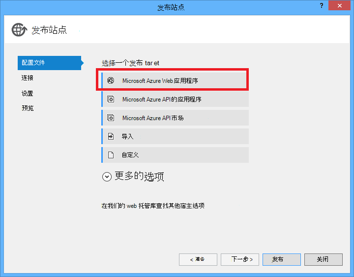

<properties
    pageTitle="在 Azure 应用程序服务创建.NET WebJob |Microsoft Azure"
    description="创建一个使用 ASP.NET MVC 和 Azure 的多层应用程序。 作为 WebJob 运行在 Azure 应用程序服务中，web 应用程序和后端前结束运行。 该应用程序将使用实体框架、 SQL 数据库和 Azure 存储队列和 blob。"
    services="app-service"
    documentationCenter=".net"
    authors="tdykstra"
    manager="wpickett"
    editor="mollybos"/>

<tags
    ms.service="app-service"
    ms.workload="na"
    ms.tgt_pltfrm="na"
    ms.devlang="na"
    ms.topic="article"
    ms.date="10/28/2016"
    ms.author="tdykstra"/>

# 在 Azure 应用程序服务创建.NET WebJob

本教程展示如何为一个简单的多层 ASP.NET MVC 5 应用程序使用[WebJobs SDK](websites-dotnet-webjobs-sdk.md)编写代码。

[WebJobs SDK](websites-webjobs-resources.md)的目的是简化 WebJob 可以执行，如图像处理、 队列处理常见任务而编写的代码、 RSS 聚合、 文件维护，并发送电子邮件。 WebJobs SDK 中的内置功能使用 Azure 存储和服务总线、 调度任务和处理错误，以及其他许多常见的方案。 此外，其设计是可扩展的并且没有[打开源存储库的扩展](https://github.com/Azure/azure-webjobs-sdk-extensions/wiki/Binding-Extensions-Overview)。

示例应用程序是广告公告板。 用户可以上传图像广告，和一个后端进程将图像转换为缩略图。 广告列表页显示缩略图，并详细信息页面，广告显示完整大小的图像。 这里是一个屏幕快照︰

此示例应用程序适用于[Azure 队列](http://www.asp.net/aspnet/overview/developing-apps-with-windows-azure/building-real-world-cloud-apps-with-windows-azure/queue-centric-work-pattern)和[Azure 的 blob](http://www.asp.net/aspnet/overview/developing-apps-with-windows-azure/building-real-world-cloud-apps-with-windows-azure/unstructured-blob-storage)。 本教程演示如何部署到[Azure 应用程序服务](http://go.microsoft.com/fwlink/?LinkId=529714)和[SQL Azure 数据库](http://msdn.microsoft.com/library/azure/ee336279)应用程序。

## 系统必备组件

本教程假设您知道如何使用 Visual Studio 中的[ASP.NET MVC 5](http://www.asp.net/mvc/tutorials/mvc-5/introduction/getting-started)项目。

本教程是为 Visual Studio 2013年编写的。 如果没有 Visual Studio，它将为您自动安装.NET 安装 Azure SDK 时。

本教程可以使用 Visual Studio 2015，但是在运行应用程序之前本地需要更改`Data Source`中的 Web.config 文件和 App.config 文件中的 SQL Server LocalDB 连接字符串的一部分`Data Source=(localdb)\v11.0`到`Data Source=(LocalDb)\MSSQLLocalDB`。 

> [AZURE.NOTE] Azure 帐户来完成本教程，您需要︰
  >
  > + 您可以[免费开设 Azure 帐户](https://azure.microsoft.com/pricing/free-trial/?WT.mc_id=A261C142F)︰ 获取积分可用于试验 Azure 服务付费，并且即使他们习惯之后最多可以保留该帐户并使用释放 Azure 服务，例如网站。 永远不会将收取您的信用卡，除非您明确更改您的设置并问计。
  >
  > + 您可以[激活 MSDN 订户权益](https://azure.microsoft.com/pricing/member-offers/msdn-benefits-details/?WT.mc_id=A261C142F)︰ 您 MSDN 订阅提供了积分可用于付费的 Azure 服务每月。
  >
  >如果您想要怎样的 Azure 帐户之前开始使用 Azure 应用程序服务，请转到[尝试应用程序服务](http://go.microsoft.com/fwlink/?LinkId=523751)，立即可以在此创建短期的初学者 web 应用程序在应用程序服务。 没有信用卡，所需;没有承诺。

## 您将学习

本教程演示如何执行以下任务︰

* 通过安装 Azure SDK 启用 Azure 开发计算机。
* 创建部署关联的 web 项目时自动部署 Azure WebJob 作为一个控制台应用程序项目。
* 测试在开发计算机上的本地 WebJobs SDK 后端。
* 将与 WebJobs 后端应用程序发布到 web 应用程序在应用程序服务。
* 上载的文件并将它们存储在 Azure Blob 服务。
* 使用 Azure WebJobs SDK 来使用 Azure 存储队列和 blob。

## 应用程序体系结构

示例应用程序使用的[队列以中心工作模式](http://www.asp.net/aspnet/overview/developing-apps-with-windows-azure/building-real-world-cloud-apps-with-windows-azure/queue-centric-work-pattern)减轻了 CPU 密集型操作，创建到后端进程的缩略图。

应用程序存储在 SQL 数据库中，使用实体框架代码第一个创建的表和访问数据的广告。 为每个广告中，该数据库存储两个 Url︰ 分别表示完全尺寸的图像和缩略图。

当用户上载图像时，使 web 应用程序将图像存储在[Azure 斑点](http://www.asp.net/aspnet/overview/developing-apps-with-windows-azure/building-real-world-cloud-apps-with-windows-azure/unstructured-blob-storage)，并且它将广告信息存储在数据库中以一个 URL 指向 blob。 在同一时间，它将消息写入到 Azure 的队列。 在后端流程中运行为 Azure WebJob，WebJobs SDK 轮询队列的新消息。 显示新消息时，WebJob 将创建该图像的缩略图并更新该广告缩略图 URL 数据库字段。 这里有一个示意图，显示应用程序的部件之间的交互方式︰

[AZURE.INCLUDE [install-sdk](../../includes/install-sdk-2015-2013.md)]

教程说明适用于 Azure SDK 的.NET 2.7.1 或更高版本。

## 创建一个 Azure 存储帐户

Azure 存储帐户提供资源，用于在云中存储队列和 blob 数据。 它还可通过 WebJobs SDK 来存储记录数据的仪表板。

在实际应用中，通常需要创建单独的帐户为应用程序数据和日志记录数据，并单独占测试数据与生产数据。 在本教程中，您将使用一个帐户。

1. 在 Visual Studio 中打开**服务器资源管理器**窗口。

2. **Azure**节点，右键单击，然后单击**连接到 Microsoft Azure**。

3. 使用 Azure 的凭据登录。

5. 用鼠标右键单击在 Azure 节点下的**存储**，然后单击**创建存储帐户**。

3. 在**创建存储帐户**对话框中，输入存储帐户的名称。

    该名称必须必须是唯一的 （没有其他 Azure 存储帐户可以具有相同的名称）。 如果您输入的名称已在使用中将有机会对其进行更改。

    若要访问您的存储帐户的 URL 将*{name}*。 core.windows.net。

5. 设置为区域的**区域或相关性组**下拉列表最接近您。

    此设置指定哪些 Azure 数据中心将承载您的存储帐户。 对于本教程，您的选择不会带来明显差异。 但是，生产 web 应用程序中，您希望您的 web 服务器和您的存储帐户，可在同一区域，尽量减少延迟和数据出口费用。 使 web 应用程序 （这将在以后创建） 数据中心应尽可能接近到浏览器访问 web 应用程序，以尽量减少延迟。

6. 将**复制**下拉列表设置为**本地冗余**。

    存储帐户启用地理复制时，存储的内容被复制到从属数据中心启用故障转移到该位置发生的主要地点，在大的灾难。 Geo 复制可以带来额外的成本。 对于测试和开发帐户，通常不希望支付地区复制。 有关详细信息，请参阅[创建、 管理或删除存储帐户](../storage-create-storage-account/#replication-options)。

5. 单击**创建**。

    

## 将应用程序下载

1. 下载并解压缩[完成解决方案](http://code.msdn.microsoft.com/Simple-Azure-Website-with-b4391eeb)。

2. 启动 Visual Studio。

3. 从**文件**菜单中选择**打开 > 项目/解决方案**，导航到您下载该解决方案，然后打开解决方案文件。

4. 按 CTRL + SHIFT + B 来构建解决方案。

    默认情况下，Visual Studio 将自动还原 NuGet 程序包内容，未包括在*.zip*文件中。 如果不还原软件包，手动安装通过转到**解决方案管理 NuGet 程序包**对话框并单击位于右上角的**还原**按钮。

5. 在**解决方案资源管理器**中确保选择**ContosoAdsWeb**作为启动项目。

## 配置应用程序以使用您的存储帐户

1. 在 ContosoAdsWeb 项目中打开应用程序的*Web.config*文件。

    该文件包含 SQL 连接字符串和用于处理 blob 和队列 Azure 存储连接字符串。

    SQL 连接字符串指向[SQL Server Express LocalDB](http://msdn.microsoft.com/library/hh510202.aspx)数据库。

    存储连接字符串是一个示例具有存储帐户名称和访问密钥的占位符。 将与具有名称和密钥的存储帐户连接字符串替换。  

    <pre class="prettyprint">&lt;connectionStrings&gt;
   &lt;将名称添加连接字符串"ContosoAdsContext"= ="数据源 = (localdb) \v11.0;初始目录 = ContosoAds;集成安全性 = True;MultipleActiveResultSets = True;"providerName="System.Data.SqlClient"/&gt;
   &lt;将名称添加连接字符串"AzureWebJobsStorage"= ="DefaultEndpointsProtocol = https;帐户名 =<mark>[帐户名]</mark>;AccountKey =<mark>[accesskey]</mark>"/&gt; 
    &lt;/connectionStrings      &gt;</pre>

    存储连接字符串被命名为 AzureWebJobsStorage，因为它是 WebJobs SDK 中使用的名称，默认情况。 因此必须设置 Azure 的环境中只能有一个连接字符串值在此处使用相同的名称。

2. 在**服务器资源管理器**中用鼠标右键单击**存储**节点中，您的存储帐户，然后单击**属性**。

    

3. 在**属性**窗口中，单击**存储帐户密钥**，然后单击省略号。

    

4. 复制**连接字符串**。

    

5. 替换您刚才复制的连接字符串的*Web.config*文件中存储连接字符串。 请确保您选择的所有内容在引号内，但不是包括在粘贴前引号。

6. 打开 ContosoAdsWebJob 项目中的*App.config*文件。

    此文件包含两个存储连接字符串，另一个应用程序数据的日志记录。 应用程序数据和日志记录，可以使用单独的存储帐户，您可以使用[的数据的多个存储帐户](https://github.com/Azure/azure-webjobs-sdk/blob/master/test/Microsoft.Azure.WebJobs.Host.EndToEndTests/MultipleStorageAccountsEndToEndTests.cs)。 在本教程中，您将使用一个单一的存储帐户。 连接字符串必须存储帐户关键字的占位符。 
    <pre class="prettyprint">&lt;配置&gt;
    &lt;connectionStrings&gt;
   &lt;将名称添加连接字符串"AzureWebJobsDashboard"= ="DefaultEndpointsProtocol = https。帐户名 =<mark>[帐户名]</mark>;AccountKey =<mark>[accesskey]</mark>"/&gt;
   &lt;将名称添加连接字符串"AzureWebJobsStorage"= ="DefaultEndpointsProtocol = https。帐户名 =<mark>[帐户名]</mark>;AccountKey =<mark>[accesskey]</mark>"/&gt;
   &lt;将名称添加连接字符串"ContosoAdsContext"= ="数据源 = (localdb) \v11.0;初始目录 = ContosoAds;集成安全性 = True;MultipleActiveResultSets = True;"/&gt; 
    &lt;/connectionStrings&gt;
   &lt;启动&gt;
   &lt;supportedRuntime 版本 ="v4.0"sku ="。NETFramework、 版本 = 4.5 版"/&gt; 
    &lt;/startup&gt;
&lt;/configuration                             &gt;</pre>

    默认情况下，WebJobs SDK 查找名为 AzureWebJobsStorage 和 AzureWebJobsDashboard 的连接字符串。 作为一种替代方法，您可以[存储区的连接字符串，但是您希望并显式地对传递给它在`JobHost`对象](websites-dotnet-webjobs-sdk-storage-queues-how-to.md#config)。

7. 这两个存储连接字符串替换为先前复制的连接字符串。

8. 保存您的更改。

## 本地运行应用程序

1. 若要启动 web 前端应用程序，请按 CTRL + F5。

    在主页上将打开默认浏览器。 （因为您已启动项目使之运行的 web 项目。）

    

2. 要启动 WebJob 后的端应用程序，右击 ContosoAdsWebJob 项目在**解决方案资源管理器**中的，然后单击**调试** > **启动新实例**。

    控制台应用程序窗口打开并显示日志记录消息，指示 WebJobs SDK JobHost 对象已开始运行。

    

3. 在浏览器中，单击**创建广告**。

4. 输入一些测试数据，并选择要上载的图像，然后单击**创建**。

    

    应用程序转到索引页上，但不会显示缩略图的新广告因为尚未处理尚未发生了变化。

    同时，在短的等待后在控制台应用程序窗口中的日志消息将显示队列消息的接收和处理完。

    

5. 请参阅控制台应用程序窗口中的日志消息之后，刷新索引页后，可以看到缩略图。

    

6. 单击**详细信息**为您的广告以查看完整大小的图像。

    

您已在本地计算机上已运行应用程序和它所使用的 SQL Server 数据库位于您的计算机，但它使用队列和 blob 中的云。 下一节中您将运行该应用程序在云中，使用云数据库以及云 blob 和队列。  

## 在云中运行应用程序

将执行以下步骤以在云中运行应用程序︰

* 将部署到 Web 应用程序。 应用程序服务和 SQL 数据库实例中，Visual Studio 自动创建新的 web 应用程序。
* 配置 web 应用程序使用 SQL Azure 数据库和存储帐户。

在云中运行的同时创建了一些广告后，就会看到 WebJobs SDK 仪表板，请参阅监视的功能，它所提供的丰富。

### 将部署到 Web 应用程序

1. 关闭浏览器和控制台应用程序窗口。

2. 在**解决方案资源管理器**中用鼠标右键单击 ContosoAdsWeb 项目，然后单击**发布**。

3. 在**Web 发布**向导的**配置文件**步骤中，单击**Microsoft Azure web 应用程序**。

    

4. 如果仍然没有登录，登录到 Azure。

5. 单击**新建**。

    对话框中的外观可能会稍有不同，具体取决于安装的.net 的 Azure sdk 版本。

    

6. 在**创建 Microsoft Azure 上的 web 应用程序**对话框中，输入一个唯一的名称，在**Web 应用程序名称**框中。

    在此处输入将包含完整的 URL 加。 azurewebsites.net （如上所示， **Web 应用程序名称**文本框旁边）。 例如，如果 web 应用程序名称为 ContosoAds，URL 将被 ContosoAds.azurewebsites.net。

7. 在[应用程序服务计划](../app-service/azure-web-sites-web-hosting-plans-in-depth-overview.md)下拉列表中选择**创建新的应用程序服务计划**。 输入的名称，例如 ContosoAdsPlan 的应用程序服务计划。

8. [资源组](../azure-resource-manager/resource-group-overview.md)下拉列表中选择**创建新的资源组**。

9. 输入资源组名称，如 ContosoAdsGroup。

10. 在**地区**下拉列表中，选择您在为您的存储帐户选择同一个地区。

    此设置指定您的 web 应用程序将运行在哪个 Azure 数据中心。 将 web 应用程序和存储帐户保存在同一个数据中心延迟和数据出口费用减到最小。

11. 在**数据库服务器**下拉列表中选择**创建新的服务器**。

12. 输入数据库服务器，如 contosoadsserver + 号或您的名称，以使该服务器名称是唯一的名称。 

    服务器名称必须是唯一的。 它可以包含小写字母、 数字和连字符。 它不能包含连字符结尾。 

    或者，如果您的订阅已经有服务器，您可以从下拉列表中选择该服务器。

12. 输入管理员**数据库用户名**和**数据库密码**。

    如果您选择现有的名称和密码不能输入**新的 SQL 数据库服务器**，您在输入新的名称和密码，您现在定义以后访问数据库时使用。 如果您选择以前创建的服务器时，系统将提示您到已经创建了您的管理用户帐户的密码。

13. 单击**创建**。

    

    Visual Studio 创建解决方案、 web 项目、 在 Azure，使 web 应用程序和 SQL Azure 数据库实例。

14. 在**Web 发布**向导的**连接**步骤中，单击**下一步**。

    

15. 在**设置**步骤中，清除**使用在运行时此连接字符串**复选框，然后单击**下一步**。

    

    您不需要使用发布对话框中设置 SQL 连接字符串，因为您将稍后在 Azure 的环境中设置该值。

    您可以忽略此页上的警告。

    * 通常存储帐户时，您使用 Azure 中运行会不同于您在本地运行时使用，但对于本教程，您正在使用这两种环境中的相同一个。 因此 AzureWebJobsStorage 连接字符串不需要进行转换。 即使您想要在云环境中使用不同的存储帐户，您不需要的连接字符串的转换，因为该应用程序运行在 Azure 时使用 Azure 的环境设置。 您将在本教程后面看到这。

    * 对于本教程，您就无法将更改使用的 ContosoAdsContext 数据库的数据模型，因此没有必要为使用实体框架代码第一个迁移进行部署。 首先，代码会自动创建新数据库第一次应用程序试图访问 SQL 数据。

    对于本教程下**文件发布选项**, 的选项的默认值是完好的。

16. 在**预览**步骤中，单击**开始预览**。

    

    您可以忽略该警告有关没有要发布的数据库。 实体框架代码优先创建该数据库。它不需要发布。

    预览窗口显示，二进制文件和 WebJob 项目中的配置文件会被复制到*app_data\jobs\continuous*文件夹中的 web 应用程序。

    

17. 单击**发布**。

    Visual Studio 将应用程序部署，并在浏览器中打开主页 URL。

    您将无法使用该 web 应用程序，直到您在下一节中的 Azure 环境中设置连接字符串。 您将看到错误页面或这取决于 web 应用程序和数据库创建选项前面选择主页。

### 配置 web 应用程序使用 SQL Azure 数据库和存储帐户。

它是安全的做法是为[避免将源代码库中存储的文件中的连接字符串等敏感信息](http://www.asp.net/aspnet/overview/developing-apps-with-windows-azure/building-real-world-cloud-apps-with-windows-azure/source-control#secrets)。 Azure 提供一种方法来执行此操作︰ 您可以在 Azure 的环境中，设置连接字符串和其他设置值，ASP.NET 配置 Api 自动拾取这些值在应用程序运行在 Azure 时。 通过使用**服务器资源管理器**、 Azure 门户、 Windows PowerShell 或跨平台命令行界面，可以在 Azure 中设置这些值。 有关详细信息，请参阅[如何应用程序字符串和连接字符串的工作](/blog/2013/07/17/windows-azure-web-sites-how-application-strings-and-connection-strings-work/)。

本部分中使用**服务器资源管理器**来设置 Azure 中的连接字符串值。

7. 在**服务器资源管理器**中用鼠标右键单击您的 web 应用程序在**Azure > 应用程序服务 > {资源组}**，然后单击**视图设置**。

    在**配置**选项卡上打开**Azure Web 应用程序**窗口。

9. 将 DefaultConnection 连接字符串的名称更改为 ContosoAdsContext。

    Azure 创建 web 应用程序相关联的数据库中，因此它已经有了正确的连接字符串值时，自动创建此连接字符串。 您要更改到您的代码正在寻找的不仅仅是名称。

9. 添加两个新的连接字符串，名为 AzureWebJobsStorage 和 AzureWebJobsDashboard。 将类型设置为自定义，并将连接字符串值设置为相同的*Web.config*和*App.config*文件先前使用的值。 （请确保包括整个连接字符串，而不仅仅是访问键，并不包括引号。

    这些连接字符串所使用的 WebJobs SDK 中，一个用于应用程序数据，另一个用于日志记录。 如您之前看到的那样，web 前端代码还使用为应用程序数据。

9. 单击**保存**。

    

10. 在**服务器资源管理器**中的 web 应用程序中，用鼠标右键单击，然后单击**停止**。

12. 使 web 应用程序停止后，再次右键单击该 web 应用程序，然后单击**开始**。

    当您发布，但其停止进行配置更改时，WebJob 将自动启动。 重新启动它可以重新启动 web 应用程序或重新启动 WebJob [Azure 门户](http://go.microsoft.com/fwlink/?LinkId=529715)。 通常建议在更改配置后重新启动 web 应用程序。

9. 刷新浏览器窗口的 web 应用程序 URL 地址栏中。

    在主页上显示。

10. 就像在本地运行应用程序时，可以创建广告。

    索引页没有最初的缩略图显示。

11. 几秒钟后，请刷新页面和缩略图显示。

    如果没有显示缩略图，您可能需要等待一分钟左右的 WebJob 重新启动。 如果之后的一段时间您仍然看不到缩略图刷新页面时，可能不会自动启动 WebJob。 在这种情况下，转到您的 web 应用程序的[传统门户](https://manage.windowsazure.com)页中 WebJobs 选项卡，然后单击**开始**。

### 查看 WebJobs SDK 的仪表板

1. 在[传统的门户网站](https://manage.windowsazure.com)中，请选择您的 web 应用程序。

2. 单击**WebJobs**选项卡。

3. 单击日志列中的 URL 为您 WebJob。

    

    WebJobs SDK 仪表板将打开新的浏览器选项卡。 仪表板可以显示 WebJob 正在运行，并且在 WebJobs SDK 触发代码中演示的函数的列表。

4. 单击其中一个有关其执行的详细信息，请参阅函数。

    

    

    在此页上的**重播功能**按钮使 WebJobs SDK 框架再次调用该函数，它使您有机会更改首先传递给函数的数据。

>[AZURE.NOTE] 当您完成后测试时，删除该 web 应用程序和 SQL 数据库实例。 使 web 应用程序是免费的但该 SQL 数据库实例并存储帐户应计费用 （由于小尺寸最小）。 此外，如果将 web 应用程序运行时，找到您的 URL 的任何人可以创建和查看广告。 在经典的门户中，转到您的 web 应用程序的**仪表板**选项卡，然后单击页面底部的**删除**按钮。 然后可以选择一个复选框，若要一次删除 SQL 数据库实例。 如果您只想暂时阻止其他用户访问该 web 应用程序，请单击**停止**。 在这种情况下，费用仍将计入的 SQL 数据库和存储帐户。 您可以按照类似的过程以删除 SQL 数据库和存储帐户，当您不再需要它们。

## 从头开始创建应用程序

这一节中您将执行以下任务︰

* 与 web 项目中创建一个 Visual Studio 解决方案。
* 添加一个前端和后端之间共享数据访问层的类库项目。
* 与 WebJobs 部署启用添加后端，控制台应用程序项目。
* 添加 NuGet 程序包。
* 设置项目引用。
* 复制与合作教程上一节中下载应用程序从应用程序代码和配置文件。
* 查看使用 Azure blob 和队列和 WebJobs SDK 的代码部分。

### 与 web 项目和类的类库项目创建一个 Visual Studio 解决方案

1. 在 Visual Studio 中，选择**新建** > **文件**菜单中的**项目**。

2. 在**新建项目**对话框中，选择**C#** > **网站** > **ASP.NET Web 应用程序**。

3. 命名项目 ContosoAdsWeb，ContosoAdsWebJobsSDK （更改解决方案名称，如果您要将它放在下载解决方案所在的文件夹），该解决方案的名称，然后单击**确定**。

    

5. 在**新的 ASP.NET 项目**对话框中，选择 MVC 模板中，并清除下**Microsoft Azure**的**云主机**复选框。

    选择**在云环境中的主机**启用 Visual Studio 自动创建新的 Azure 的 web 应用程序和 SQL 数据库。 因为您已经创建这些前面，不需要现在时创建项目。 如果您想要创建一个新，选中复选框。 您可以再配置新的 web 应用程序和 SQL 数据库那样早部署应用程序时的方式相同。

5. 单击**更改身份验证**。

    

7. 在**更改身份验证**对话框中，选择**无身份验证**，然后单击**确定**。

    

8. 在**新的 ASP.NET 项目**对话框中，单击**确定**。

    Visual Studio 创建解决方案和 web 项目。

9. 在**解决方案资源管理器**中右击解决方案 （非项目），并选择**添加** > **新的项目**。

11. 在**添加新项目**对话框中，选择**C#** > **Windows 桌面** > **类库**模板。  

10. 名称*ContosoAdsCommon*，该项目，然后单击**确定**。

    此项目将包含实体框架上下文和将使用的前端和后端的数据模型。 作为一种替代方法可以在 web 项目中定义的 EF 相关类，从 WebJob 项目引用该项目。 但然后 WebJob 项目必须对它并不需要的 web 程序集的引用。

### 添加了启用 WebJobs 部署控制台应用程序项目

1. 用鼠标右键单击该 web 项目 （不该解决方案或类库项目），然后单击**添加** > **新 Azure WebJob 项目**。

    

2. 在**添加 Azure WebJob**对话框中，输入 ContosoAdsWebJob**项目名称**和**WebJob 名**。 将**WebJob 运行模式**设置为**连续运行**。

3.  单击**确定**。

    Visual Studio 将创建的控制台应用程序被配置为每次部署 web 项目时部署为 WebJob。 要做到这一点，它执行创建此项目后以下任务︰

    * 在 WebJob 项目的属性文件夹中添加*webjob 发布的 settings.json*文件。
    * *Webjobs list.json*文件添加到 web 项目的属性文件夹中。
    * 在 WebJob 项目中安装 Microsoft.Web.WebJobs.Publish NuGet 程序包。

    有关这些更改的详细信息，请参阅[如何部署使用 Visual Studio 的 WebJobs](websites-dotnet-deploy-webjobs.md)。

### 添加 NuGet 程序包

WebJob 项目的新项目模板将自动安装 WebJobs SDK NuGet 程序包[Microsoft.Azure.WebJobs](http://www.nuget.org/packages/Microsoft.Azure.WebJobs)及其依赖项。

在 WebJob 项目中自动安装的 WebJobs SDK 依赖关系之一是 Azure 存储客户端库 (SCL)。 但是，您需要将其添加到 web 项目使用 blob 和队列。

1. 打开**管理 NuGet 程序包**对话框的解决方案。

2. 在左窗格中，选择**安装包**。

3. *Azure 存储*软件包，查找，然后单击**管理**。

4. 在**选择项目**框中，选择**ContosoAdsWeb**复选框，然后单击**确定**。

    所有三个项目使用实体框架使用的 SQL 数据库中的数据。

5. 在左窗格中，选择**联机**。

6. 查找*EntityFramework* NuGet 程序包，并将其安装在所有三个项目。

### 设置项目引用

Web 和 WebJob 项目工作与 SQL 数据库中，因此，两者都需要对 ContosoAdsCommon 项目的引用。

1. 在 ContosoAdsWeb 项目中，设置对 ContosoAdsCommon 项目的引用。 (ContosoAdsWeb 项目中，用鼠标右键单击，然后单击**添加** > **的引用**。 在**引用管理器**对话框中，选择**解决方案** > **项目** > **ContosoAdsCommon**，然后单击**确定**。)

1. 在 ContosoAdsWebJob 项目中，设置对 ContosAdsCommon 项目的引用。

    WebJob 项目需要引用处理图像以及用于访问的连接字符串。

3. 在 ContosoAdsWebJob 项目中，将引用设置为`System.Drawing`， `System.Configuration`。

### 添加代码和配置文件

本教程不显示如何[创建 MVC 控制器和视图使用基架](http://www.asp.net/mvc/tutorials/mvc-5/introduction/getting-started)，如何[编写这是 SQL Server 数据库使用实体框架代码](http://www.asp.net/mvc/tutorials/getting-started-with-ef-using-mvc)，或[在 ASP.NET 4.5 中编程的异步的基础知识](http://www.asp.net/aspnet/overview/developing-apps-with-windows-azure/building-real-world-cloud-apps-with-windows-azure/web-development-best-practices#async)。 剩下要做如此的是复制到新解决方案下载的解决方案中的代码和配置文件。 做到这一点之后，以下部分显示并解释代码的关键部分。

要将文件添加到项目或文件夹中，右键单击项目或文件夹，然后单击**添加** > **现有项**。 选择的文件并单击**添加**。 如果系统询问您是否要替换现有文件，请单击**是**。

1. 在 ContosoAdsCommon 项目中，删除*Class1.cs*文件并在其位置添加下列文件从下载的项目。

    - *Ad.cs*
    - *ContosoAdscontext.cs*
    - *BlobInformation.cs*  

2. 在 ContosoAdsWeb 项目中，从下载的项目中添加以下文件。

    - *Web.config*
    - *Global.asax.cs*  
    - 在*控制器*文件夹︰ *AdController.cs*
    - *Views\Shared*文件夹中︰ *_Layout.cshtml*文件
    - *Views\Home*文件夹中︰ *Index.cshtml*
    - *Views\Ad*文件夹中 （第一次创建文件夹）︰ 五个*.cshtml*文件  

3. 在 ContosoAdsWebJob 项目中，从下载的项目中添加以下文件。

    - *App.config* （更改的**所有文件**的文件类型筛选）
    - *Program.cs*
    - *Functions.cs*

您现在可以生成、 运行和部署应用程序，按照前面的教程。 做到这一点之前，然而，停止仍在运行的第一个 web 应用程序部署到 WebJob。 否则，WebJob 将处理队列消息创建本地或由应用程序运行在新的 web 应用程序中，因为所有正在使用相同的存储帐户。

## 检查应用程序代码

以下各节介绍与使用 WebJobs SDK 和 Azure 存储 blob 和队列相关的代码。

> [AZURE.NOTE] 有关特定于 WebJobs SDK 的代码中，转到的[Program.cs 和 Functions.cs](#programcs)部分。

### ContosoAdsCommon-Ad.cs

Ad.cs 文件定义枚举的广告类别和广告信息的 POCO 实体类。

        public enum Category
        {
            Cars,
            [Display(Name="Real Estate")]
            RealEstate,
            [Display(Name = "Free Stuff")]
            FreeStuff
        }

        public class Ad
        {
            public int AdId { get; set; }

            [StringLength(100)]
            public string Title { get; set; }

            public int Price { get; set; }

            [StringLength(1000)]
            [DataType(DataType.MultilineText)]
            public string Description { get; set; }

            [StringLength(1000)]
            [DisplayName("Full-size Image")]
            public string ImageURL { get; set; }

            [StringLength(1000)]
            [DisplayName("Thumbnail")]
            public string ThumbnailURL { get; set; }

            [DataType(DataType.Date)]
            [DisplayFormat(DataFormatString = "{0:yyyy-MM-dd}", ApplyFormatInEditMode = true)]
            public DateTime PostedDate { get; set; }

            public Category? Category { get; set; }
            [StringLength(12)]
            public string Phone { get; set; }
        }

### ContosoAdsCommon-ContosoAdsContext.cs

ContosoAdsContext 类指定广告类使用 DbSet 集合实体框架将存储在 SQL 数据库中。

        public class ContosoAdsContext : DbContext
        {
            public ContosoAdsContext() : base("name=ContosoAdsContext")
            {
            }
            public ContosoAdsContext(string connString)
                : base(connString)
            {
            }
            public System.Data.Entity.DbSet<Ad> Ads { get; set; }
        }

类有两个构造函数。 第一个由 web 项目中，并指定连接字符串存储在 Web.config 文件或 Azure 的运行时环境中的名称。 第二个构造函数使您可以在实际的连接字符串中传递。 因为它不存在 Web.config 文件 WebJob 项目的需要。 您以前看到过此连接字符串存储位置，同时您会看到当它实例化的 DbContext 类，代码以后如何检索连接字符串。

### ContosoAdsCommon-BlobInformation.cs

`BlobInformation`类用于将图像斑点的信息存储在队列消息。

        public class BlobInformation
        {
            public Uri BlobUri { get; set; }

            public string BlobName
            {
                get
                {
                    return BlobUri.Segments[BlobUri.Segments.Length - 1];
                }
            }
            public string BlobNameWithoutExtension
            {
                get
                {
                    return Path.GetFileNameWithoutExtension(BlobName);
                }
            }
            public int AdId { get; set; }
        }

### ContosoAdsWeb-Global.asax.cs

从调用代码`Application_Start`方法创建一个 blob 容器，*图像*和*图像*队列，如果尚不存在。 这样可以确保，当您开始使用新的存储帐户，需要的 blob 容器和队列自动创建的。

此代码可获取对存储帐户的访问使用 Azure 的运行时环境的*Web.config*文件中存储连接字符串。

        var storageAccount = CloudStorageAccount.Parse
            (ConfigurationManager.ConnectionStrings["AzureWebJobsStorage"].ToString());

然后它获取*图像*的 blob 容器的引用，如果它不存在，并在新的容器上设置的访问权限创建容器。 默认情况下新容器允许仅客户端使用存储帐户凭据访问 blob。 使 web 应用程序需要为 public 的这样它可以显示图像使用 Url 指向图像 blob 的 blob。

        var blobClient = storageAccount.CreateCloudBlobClient();
        var imagesBlobContainer = blobClient.GetContainerReference("images");
        if (imagesBlobContainer.CreateIfNotExists())
        {
            imagesBlobContainer.SetPermissions(
                new BlobContainerPermissions
                {
                    PublicAccess = BlobContainerPublicAccessType.Blob
                });
        }

类似的代码获取*thumbnailrequest*队列的引用并创建新的队列。 在这种情况下需要没有权限更改。 

        CloudQueueClient queueClient = storageAccount.CreateCloudQueueClient();
        var imagesQueue = queueClient.GetQueueReference("thumbnailrequest");
        imagesQueue.CreateIfNotExists();

### ContosoAdsWeb-_Layout.cshtml

*_Layout.cshtml*文件中的页眉和页脚，设置应用程序名称，并创建的"广告"菜单项。

### ContosoAdsWeb-Views\Home\Index.cshtml

*Views\Home\Index.cshtml*文件显示在主页上的类别链接。 链接传递的整数值`Category`广告索引页面的查询字符串变量中的枚举。

        <li>@Html.ActionLink("Cars", "Index", "Ad", new { category = (int)Category.Cars }, null)</li>
        <li>@Html.ActionLink("Real estate", "Index", "Ad", new { category = (int)Category.RealEstate }, null)</li>
        <li>@Html.ActionLink("Free stuff", "Index", "Ad", new { category = (int)Category.FreeStuff }, null)</li>
        <li>@Html.ActionLink("All", "Index", "Ad", null, null)</li>

### ContosoAdsWeb-AdController.cs

在*AdController.cs*文件中的构造函数调用`InitializeStorage`方法来创建用于处理 blob 和队列提供 API 的 Azure 存储客户端库对象。

然后代码获取您看到了前面的*Global.asax.cs**图像*blob 容器的引用。 同时执行的它将设置[重试策略](http://www.asp.net/aspnet/overview/developing-apps-with-windows-azure/building-real-world-cloud-apps-with-windows-azure/transient-fault-handling)默认适用于 web 应用程序。 默认指数退避算法重试策略可能挂起超过瞬时性故障反复重试上几分钟使 web 应用程序。 此处指定的重试策略等待 3 秒钟之后为最多 3 次尝试每个尝试。

        var blobClient = storageAccount.CreateCloudBlobClient();
        blobClient.DefaultRequestOptions.RetryPolicy = new LinearRetry(TimeSpan.FromSeconds(3), 3);
        imagesBlobContainer = blobClient.GetContainerReference("images");

类似的代码获取*图像*队列的引用。

        CloudQueueClient queueClient = storageAccount.CreateCloudQueueClient();
        queueClient.DefaultRequestOptions.RetryPolicy = new LinearRetry(TimeSpan.FromSeconds(3), 3);
        imagesQueue = queueClient.GetQueueReference("blobnamerequest");

大部分的控制器代码是使用实体框架数据模型，使用 DbContext 类的典型。 一个例外是 HttpPost`Create`方法，该上载的文件并将其保存在 blob 存储方法。 模型联编程序提供给该方法的[HttpPostedFileBase](http://msdn.microsoft.com/library/system.web.httppostedfilebase.aspx)对象。

        [HttpPost]
        [ValidateAntiForgeryToken]
        public async Task<ActionResult> Create(
            [Bind(Include = "Title,Price,Description,Category,Phone")] Ad ad,
            HttpPostedFileBase imageFile)

如果用户选择要上载的文件，代码上载文件、 将其保存在一个 blob，和提供一个指向 blob 的 URL 更新 Ad 数据库记录。

        if (imageFile != null && imageFile.ContentLength != 0)
        {
            blob = await UploadAndSaveBlobAsync(imageFile);
            ad.ImageURL = blob.Uri.ToString();
        }

上载代码是`UploadAndSaveBlobAsync`方法。 它创建 blob 的 GUID 名称、 上载和保存该文件，并返回到已保存的 blob 的引用。

        private async Task<CloudBlockBlob> UploadAndSaveBlobAsync(HttpPostedFileBase imageFile)
        {
            string blobName = Guid.NewGuid().ToString() + Path.GetExtension(imageFile.FileName);
            CloudBlockBlob imageBlob = imagesBlobContainer.GetBlockBlobReference(blobName);
            using (var fileStream = imageFile.InputStream)
            {
                await imageBlob.UploadFromStreamAsync(fileStream);
            }
            return imageBlob;
        }

在 HttpPost 后`Create`方法将 blob 上载和更新数据库、 创建队列消息以通知后端进程图像已准备好于缩略图的转换。

        BlobInformation blobInfo = new BlobInformation() { AdId = ad.AdId, BlobUri = new Uri(ad.ImageURL) };
        var queueMessage = new CloudQueueMessage(JsonConvert.SerializeObject(blobInfo));
        await thumbnailRequestQueue.AddMessageAsync(queueMessage);

对于 HttpPost 代码`Edit`方法很类似，不同之处在于，如果用户选择一个新的图像文件，必须先删除任何已存在用于此广告 blob。

        if (imageFile != null && imageFile.ContentLength != 0)
        {
            await DeleteAdBlobsAsync(ad);
            imageBlob = await UploadAndSaveBlobAsync(imageFile);
            ad.ImageURL = imageBlob.Uri.ToString();
        }

下面是删除时删除 ad，blob 的代码︰

        private async Task DeleteAdBlobsAsync(Ad ad)
        {
            if (!string.IsNullOrWhiteSpace(ad.ImageURL))
            {
                Uri blobUri = new Uri(ad.ImageURL);
                await DeleteAdBlobAsync(blobUri);
            }
            if (!string.IsNullOrWhiteSpace(ad.ThumbnailURL))
            {
                Uri blobUri = new Uri(ad.ThumbnailURL);
                await DeleteAdBlobAsync(blobUri);
            }
        }
        private static async Task DeleteAdBlobAsync(Uri blobUri)
        {
            string blobName = blobUri.Segments[blobUri.Segments.Length - 1];
            CloudBlockBlob blobToDelete = imagesBlobContainer.GetBlockBlobReference(blobName);
            await blobToDelete.DeleteAsync();
        }

### ContosoAdsWeb-Views\Ad\Index.cshtml，Details.cshtml

*Index.cshtml*文件会显示缩略图与其他广告数据︰

        

*Details.cshtml*文件显示完全尺寸的图像︰

        

### ContosoAdsWeb-Views\Ad\Create.cshtml，Edit.cshtml

*Create.cshtml*和*Edit.cshtml*文件指定窗体的编码，使控制器能够`HttpPostedFileBase`对象。

        @using (Html.BeginForm("Create", "Ad", FormMethod.Post, new { enctype = "multipart/form-data" }))

`<input>`元素将告诉浏览器提供一个文件选择对话框。

        <input type="file" name="imageFile" accept="image/*" class="form-control fileupload" />

### ContosoAdsWebJob-Program.cs

当启动 WebJob、`Main`方法调用 WebJobs SDK`JobHost.RunAndBlock`方法开始执行触发当前线程上的功能。

        static void Main(string[] args)
        {
            JobHost host = new JobHost();
            host.RunAndBlock();
        }

### ContosoAdsWebJob-Functions.cs-GenerateThumbnail 方法

接收队列邮件时，WebJobs SDK 调用此方法。 方法创建缩略图，缩略图会将数据库中的 URL。

        public static void GenerateThumbnail(
        [QueueTrigger("thumbnailrequest")] BlobInformation blobInfo,
        [Blob("images/{BlobName}", FileAccess.Read)] Stream input,
        [Blob("images/{BlobNameWithoutExtension}_thumbnail.jpg")] CloudBlockBlob outputBlob)
        {
            using (Stream output = outputBlob.OpenWrite())
            {
                ConvertImageToThumbnailJPG(input, output);
                outputBlob.Properties.ContentType = "image/jpeg";
            }

            // Entity Framework context class is not thread-safe, so it must
            // be instantiated and disposed within the function.
            using (ContosoAdsContext db = new ContosoAdsContext())
            {
                var id = blobInfo.AdId;
                Ad ad = db.Ads.Find(id);
                if (ad == null)
                {
                    throw new Exception(String.Format("AdId {0} not found, can't create thumbnail", id.ToString()));
                }
                ad.ThumbnailURL = outputBlob.Uri.ToString();
                db.SaveChanges();
            }
        }

* `QueueTrigger`属性指示 WebJobs SDK thumbnailrequest 队列接收到一封新邮件时调用此方法。

        [QueueTrigger("thumbnailrequest")] BlobInformation blobInfo,

    `BlobInformation`队列消息中的对象是到自动反序列化`blobInfo`参数。 当在方法完成时，将删除队列消息。 如果此方法在完成之前失败，则不会删除队列消息;10 分钟租约到期后，发行再次挑选和处理消息。 如果一条消息时，都会导致异常，此序列将不会无限期地重复。 5 成功尝试处理的消息后，该消息被移到队列名为 {queuename}-有害。 最大尝试次数是可配置的。

* 这两个`Blob`属性提供对象绑定到 blob︰ 一到现有图像斑点和一个引用该方法将创建一个新缩略图 blob。

        [Blob("images/{BlobName}", FileAccess.Read)] Stream input,
        [Blob("images/{BlobNameWithoutExtension}_thumbnail.jpg")] CloudBlockBlob outputBlob)

    Blob 名称来自属性的`BlobInformation`队列消息中收到的对象 (`BlobName` ， `BlobNameWithoutExtension`)。 若要获取存储客户端库可以使用的全部功能`CloudBlockBlob`类来使用 blob。 如果您想要重用代码编写为使用`Stream`对象时，您可以使用`Stream`类。

有关如何编写使用 WebJobs SDK 特性的函数的详细信息，请参阅以下资源︰

* [如何使用 WebJobs SDK Azure 队列存储](websites-dotnet-webjobs-sdk-storage-queues-how-to.md)
* [如何使用 WebJobs SDK Azure blob 存储](websites-dotnet-webjobs-sdk-storage-blobs-how-to.md)
* [如何使用 WebJobs SDK Azure 表存储](websites-dotnet-webjobs-sdk-storage-tables-how-to.md)
* [如何使用 WebJobs SDK Azure 服务总线](websites-dotnet-webjobs-sdk-service-bus.md)

> [AZURE.NOTE]
>
> * 如果在多个虚拟机上运行您的 web 应用程序，将同时运行多个 WebJobs，并在某些情况下这可能会导致多次获得处理相同的数据。 如果使用内置的队列、 斑点和服务总线触发器，这不是一个问题。 SDK 可确保您的函数为每个消息或 blob 只能一次处理。
>
> * 有关如何实现正常关机的信息，请参阅[正常关机](websites-dotnet-webjobs-sdk-storage-queues-how-to.md#graceful)。
>
> * 中的代码`ConvertImageToThumbnailJPG`（未显示） 的方法使用类在`System.Drawing`简洁性的命名空间。 但是，此命名空间中的类被设计为使用 Windows 窗体。 不支持在 Windows 或 ASP.NET 服务中使用。 关于图像处理选项的详细信息，请参阅[动态图像生成](http://www.hanselman.com/blog/BackToBasicsDynamicImageGenerationASPNETControllersRoutingIHttpHandlersAndRunAllManagedModulesForAllRequests.aspx)和[深层内图像大小调整功能](http://www.hanselminutes.com/313/deep-inside-image-resizing-and-scaling-with-aspnet-and-iis-with-imageresizingnet-author-na)。

## 下一步行动

在本教程中，您已经看到简单的多层应用程序的后端处理使用 WebJobs SDK。 本节提供了用于了解有关 ASP.NET 多层应用程序和 WebJobs 的一些建议。

### 缺少的功能

应用程序有很简单的快速入门教程。 在真实的应用程序中将实现[依赖关系注入](http://www.asp.net/mvc/tutorials/hands-on-labs/aspnet-mvc-4-dependency-injection)和[存储库和单位工作模式](http://www.asp.net/mvc/tutorials/getting-started-with-ef-using-mvc/advanced-entity-framework-scenarios-for-an-mvc-web-application#repo)、 使用[一个接口，使日志记录](http://www.asp.net/aspnet/overview/developing-apps-with-windows-azure/building-real-world-cloud-apps-with-windows-azure/monitoring-and-telemetry#log)、 使用[EF 代码第一个迁移](http://www.asp.net/mvc/tutorials/getting-started-with-ef-using-mvc/migrations-and-deployment-with-the-entity-framework-in-an-asp-net-mvc-application)管理数据模型发生更改，并使用[EF 连接可恢复性](http://www.asp.net/mvc/tutorials/getting-started-with-ef-using-mvc/connection-resiliency-and-command-interception-with-the-entity-framework-in-an-asp-net-mvc-application)管理暂时的网络错误。

### 缩放比例 WebJobs

WebJobs 的 web 应用程序的上下文中运行且不可扩展分开。 例如，如果您有一个标准的 web 应用程序实例，您只能有一个实例的后台进程运行，而它所使用的服务器资源 （CPU、 内存等），否则将可提供 web 内容的一些。

如果通信因时间或一周中的某一天，您需要执行可以等待后端处理，您可以安排您的 WebJobs 在低流量的时间运行。 如果仍然太高，该解决方案的负载，可以为此目的专用的单独的 web 应用程序中的 WebJob 作为运行后端。 然后可以从前端 web 应用程序独立地扩展您的后端 web 应用程序。

有关详细信息，请参阅[扩展 WebJobs](websites-webjobs-resources.md#scale)。

### 避免了 web 应用程序超时关机列表

若要确保始终运行您的 WebJobs，并在您的 web 应用程序的所有实例上运行，您必须启用[AlwaysOn](http://weblogs.asp.net/scottgu/archive/2014/01/16/windows-azure-staging-publishing-support-for-web-sites-monitoring-improvements-hyper-v-recovery-manager-ga-and-pci-compliance.aspx)功能。

### 使用外部 WebJobs WebJobs SDK

使用 WebJobs SDK 的程序没有在 WebJob 在 Azure 中运行。 它可以在本地运行，也可以运行在其他环境中如云服务工作者角色或 Windows 服务。 但是，可以通过 Azure 的 web 应用程序只能访问 WebJobs SDK 的仪表板。 使用仪表板，您需要将 web 应用程序连接到您正在使用经典的门户的**配置**选项卡上设置 AzureWebJobsDashboard 连接字符串的存储帐户。 然后您可以到仪表板使用以下 URL:

https://{webappname}.scm.azurewebsites.net/azurejobs/#/functions

有关详细信息，请参阅[获取本地开发 WebJobs sdk 的仪表板](http://blogs.msdn.com/b/jmstall/archive/2014/01/27/getting-a-dashboard-for-local-development-with-the-webjobs-sdk.aspx)，但请注意，它显示旧的连接字符串的名称。

### 更多的 WebJobs 文档

有关详细信息，请参阅[Azure WebJobs 文档资源](http://go.microsoft.com/fwlink/?LinkId=390226)。
