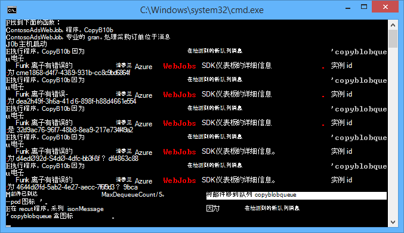
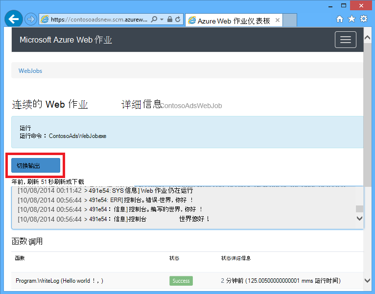
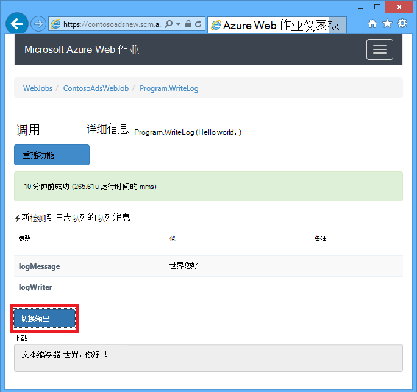
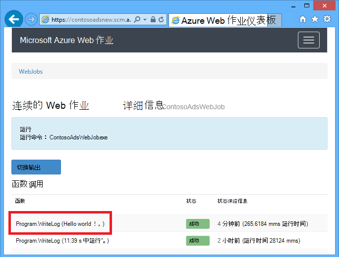
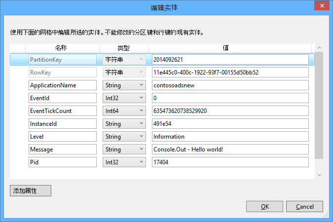
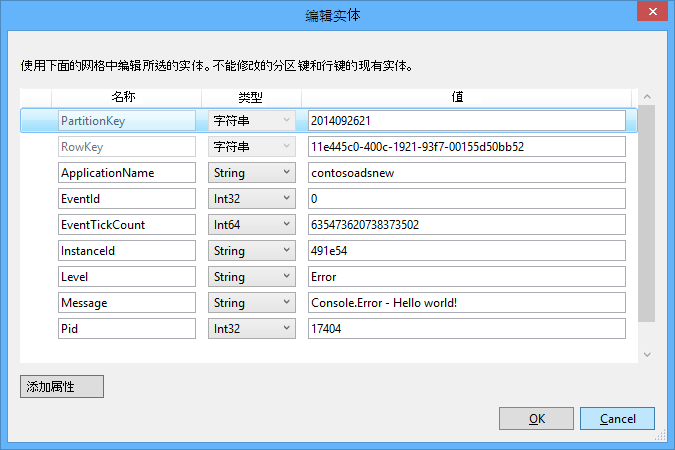

<properties 
    pageTitle="如何使用 WebJobs SDK Azure 队列存储" 
    description="了解如何使用 WebJobs SDK Azure 队列存储。 创建和删除队列;插入、 窥视、 获取，和删除队列的邮件等。" 
    services="app-service\web, storage" 
    documentationCenter=".net" 
    authors="tdykstra" 
    manager="wpickett" 
    editor="jimbe"/>

<tags 
    ms.service="app-service-web" 
    ms.workload="web" 
    ms.tgt_pltfrm="na" 
    ms.devlang="dotnet" 
    ms.topic="article" 
    ms.date="06/01/2016" 
    ms.author="tdykstra"/>

# <a name="how-to-use-azure-queue-storage-with-the-webjobs-sdk"></a>如何使用 WebJobs SDK Azure 队列存储

## <a name="overview"></a>概述

本指南提供了 C# 的代码示例演示如何使用 Azure WebJobs SDK 版本 1.x Azure 队列存储服务。

该指南假定您知道[如何创建一个在 Visual Studio 中指向您的存储帐户连接字符串的 WebJob 项目](websites-dotnet-webjobs-sdk-get-started.md#configure-storage)或[多个存储帐户](https://github.com/Azure/azure-webjobs-sdk/blob/master/test/Microsoft.Azure.WebJobs.Host.EndToEndTests/MultipleStorageAccountsEndToEndTests.cs)。

大部分代码段仅显示未创建的代码的函数`JobHost`对象如本示例所示︰

        static void Main(string[] args)
        {
            JobHost host = new JobHost();
            host.RunAndBlock();
        }
        
本指南包括以下主题︰

-   [如何接收队列邮件时触发一个函数](#trigger)
    - 队列消息的字符串
    - POCO 队列消息
    - 异步函数
    - QueueTrigger 特性配合的类型
    - 轮询算法
    - 多个实例
    - 并行执行
    - 获取队列或队列消息的元数据
    - 正常关机
-   [如何处理队列消息时创建的队列消息](#createqueue)
    - 队列消息的字符串
    - POCO 队列消息
    - 创建多个邮件或异步函数
    - 使用工作队列属性的类型
    - 使用 WebJobs SDK 的函数体中的属性
-   [如何读取和写入 blob 处理队列消息时](#blobs)
    - 队列消息的字符串
    - POCO 队列消息
    - Blob 特性配合的类型
-   [如何处理有害消息](#poison)
    - 自动病毒消息处理
    - 手动病毒消息处理
-   [如何设置配置选项](#config)
    - 在代码中设置 SDK 连接字符串
    - 配置 QueueTrigger 设置
    - 值为 WebJobs SDK 构造函数参数在代码中设置
-   [如何手动触发函数](#manual)
-   [如何编写日志](#logs) 
-   [如何处理错误和配置超时](#errors)
-   [下一步行动](#nextsteps)

## <a id="trigger"></a>如何接收队列邮件时触发一个函数

若要编写一个函数，WebJobs SDK 调用接收队列邮件时，使用`QueueTrigger`属性。 属性构造函数采用一个字符串参数，指定轮询队列的名称。 您还可以[动态地设置队列名称](#config)。

### <a name="string-queue-messages"></a>队列消息的字符串

在以下示例中，该队列包含字符串消息，因此`QueueTrigger`应用于一个名为的字符串参数`logMessage`包含队列消息的内容。 函数中[写入一条日志消息到仪表板](#logs)。
 

        public static void ProcessQueueMessage([QueueTrigger("logqueue")] string logMessage, TextWriter logger)
        {
            logger.WriteLine(logMessage);
        }

除了`string`，该参数可能为一个字节数组、`CloudQueueMessage`对象或您定义的 POCO。

### <a name="poco-plain-old-clr-objecthttpenwikipediaorgwikiplainoldclrobject-queue-messages"></a>POCO [(普通旧 CLR 对象](http://en.wikipedia.org/wiki/Plain_Old_CLR_Object)) 排队邮件

在以下示例中，队列消息包含 JSON 的`BlobInformation`对象包括`BlobName`属性。 SDK 自动反序列化该对象。

        public static void WriteLogPOCO([QueueTrigger("logqueue")] BlobInformation blobInfo, TextWriter logger)
        {
            logger.WriteLine("Queue message refers to blob: " + blobInfo.BlobName);
        }

SDK 时使用[Newtonsoft.Json NuGet 程序包](http://www.nuget.org/packages/Newtonsoft.Json)进行序列化和反序列化消息。 如果您的程序中不能使用 WebJobs SDK 创建队列消息，您可以编写代码类似于下面的示例创建 SDK 可分析 POCO 队列消息。 

        BlobInformation blobInfo = new BlobInformation() { BlobName = "log.txt" };
        var queueMessage = new CloudQueueMessage(JsonConvert.SerializeObject(blobInfo));
        logQueue.AddMessage(queueMessage);

### <a name="async-functions"></a>异步函数

以下异步函数中[写入一个日志到仪表板](#logs)。

        public async static Task ProcessQueueMessageAsync([QueueTrigger("logqueue")] string logMessage, TextWriter logger)
        {
            await logger.WriteLineAsync(logMessage);
        }

异步函数可能需要一个[取消标记](http://www.asp.net/mvc/overview/performance/using-asynchronous-methods-in-aspnet-mvc-4#CancelToken)，如下面的示例复制一个 blob 中所示。 (有关说明`queueTrigger`占位符，请参见[Blob](#blobs)部分。)

        public async static Task ProcessQueueMessageAsyncCancellationToken(
            [QueueTrigger("blobcopyqueue")] string blobName, 
            [Blob("textblobs/{queueTrigger}",FileAccess.Read)] Stream blobInput,
            [Blob("textblobs/{queueTrigger}-new",FileAccess.Write)] Stream blobOutput,
            CancellationToken token)
        {
            await blobInput.CopyToAsync(blobOutput, 4096, token);
        }

### <a id="qtattributetypes"></a>QueueTrigger 特性配合的类型

您可以使用`QueueTrigger`具有下列类型︰

* `string`
* 序列化为 JSON POCO 类型
* `byte[]`
* `CloudQueueMessage`

### <a id="polling"></a>轮询算法

SDK 实现随机指数后关闭算法以减少空闲队列轮询存储交易记录成本的效果。  SDK 时找到了一条消息，等待两秒钟，然后再检查的另一条消息;未找到它会等到大约四秒钟再重试。 之后的后续失败尝试获取队列消息，等待时间将继续增加，直到达到最大等待时间，默认值为一分钟。 [最长等待时间进行配置](#config)。

### <a id="instances"></a>多个实例

如果您的 web 应用程序运行多个实例，连续 WebJob 运行在每台计算机，并且每台机器将等待触发器并试图运行的函数。 WebJobs SDK 队列触发器自动防止函数处理队列消息多次;不必编写成幂函数。 但是，如果您想要确保只有一个实例的函数，即使有多个实例的宿主 web 应用程序运行，您可以使用`Singleton`属性。 

### <a id="parallel"></a>并行执行

如果您有多个函数在不同的队列上侦听，SDK 将他们的电话在并行时同时收到消息。 

这同样适用用于单个队列接收多个消息。 默认情况下，SDK 一次获取一批 16 队列消息和执行并行处理这些函数。 [批处理大小进行配置](#config)。 当正在处理数到批处理大小的一半，SDK 获取另一批，并开始处理这些消息。 因此每个函数正在处理的并行消息数是一倍半的批处理大小。 此限制适用于具有每个函数的单独`QueueTrigger`属性。 

如果您不希望收到在一个队列上的消息的并行执行，您可以将批处理大小设置为 1。 请参阅在[Azure WebJobs SDK 1.1.0 RTM](/blog/azure-webjobs-sdk-1-1-0-rtm/)的**队列处理更多的控制**。

### <a id="queuemetadata"></a>获取队列或队列消息的元数据

您可以通过将参数添加到方法签名获取下列消息属性︰

* `DateTimeOffset`expirationTime
* `DateTimeOffset`insertionTime
* `DateTimeOffset`nextVisibleTime
* `string`queueTrigger （包含消息文本）
* `string`标识
* `string`popReceipt
* `int`dequeueCount

如果要直接使用 Azure 存储 API，您还可以添加`CloudStorageAccount`参数。

下面的示例将此元数据的所有写入信息的应用程序日志。 在示例中，日志消息和 queueTrigger 包含队列消息的内容。

        public static void WriteLog([QueueTrigger("logqueue")] string logMessage,
            DateTimeOffset expirationTime,
            DateTimeOffset insertionTime,
            DateTimeOffset nextVisibleTime,
            string id,
            string popReceipt,
            int dequeueCount,
            string queueTrigger,
            CloudStorageAccount cloudStorageAccount,
            TextWriter logger)
        {
            logger.WriteLine(
                "logMessage={0}\n" +
            "expirationTime={1}\ninsertionTime={2}\n" +
                "nextVisibleTime={3}\n" +
                "id={4}\npopReceipt={5}\ndequeueCount={6}\n" +
                "queue endpoint={7} queueTrigger={8}",
                logMessage, expirationTime,
                insertionTime,
                nextVisibleTime, id,
                popReceipt, dequeueCount,
                cloudStorageAccount.QueueEndpoint,
                queueTrigger);
        }

以下是日志编写示例代码的示例︰

        logMessage=Hello world!
        expirationTime=10/14/2014 10:31:04 PM +00:00
        insertionTime=10/7/2014 10:31:04 PM +00:00
        nextVisibleTime=10/7/2014 10:41:23 PM +00:00
        id=262e49cd-26d3-4303-ae88-33baf8796d91
        popReceipt=AgAAAAMAAAAAAAAAfc9H0n/izwE=
        dequeueCount=1
        queue endpoint=https://contosoads.queue.core.windows.net/
        queueTrigger=Hello world!

### <a id="graceful"></a>正常关机

在连续的 WebJob 运行一个函数可以接受`CancellationToken`参数，从而使操作系统时 WebJob 即将终止通知函数。 可以使用此通知，以确保该函数不意外终止的方式将使数据处于不一致的状态。

下面的示例演示如何检查函数中即将发生的 WebJob 被解雇。

    public static void GracefulShutdownDemo(
                [QueueTrigger("inputqueue")] string inputText,
                TextWriter logger,
                CancellationToken token)
    {
        for (int i = 0; i < 100; i++)
        {
            if (token.IsCancellationRequested)
            {
                logger.WriteLine("Function was cancelled at iteration {0}", i);
                break;
            }
            Thread.Sleep(1000);
            logger.WriteLine("Normal processing for queue message={0}", inputText);
        }
    }

**注意︰**状态和已关闭的函数的输出，可能不正确显示仪表板。
 
有关详细信息，请参阅[WebJobs 正常关机](http://blog.amitapple.com/post/2014/05/webjobs-graceful-shutdown/#.VCt1GXl0wpR)。   

## <a id="createqueue"></a>如何处理队列消息时创建的队列消息

若要编写一个函数来创建新的队列消息，使用`Queue`属性。 像`QueueTrigger`、 队列名称作为字符串传递，或您可以[动态地设置队列名称](#config)。

### <a name="string-queue-messages"></a>队列消息的字符串

以下非异步代码示例在名为"outputqueue"和名为"inputqueue"的队列中接收到的队列消息相同的内容与队列中创建新队列消息。 (对于异步函数使用`IAsyncCollector<T>`在此部分后面所示。)


        public static void CreateQueueMessage(
            [QueueTrigger("inputqueue")] string queueMessage,
            [Queue("outputqueue")] out string outputQueueMessage )
        {
            outputQueueMessage = queueMessage;
        }
  
### <a name="poco-plain-old-clr-objecthttpenwikipediaorgwikiplainoldclrobject-queue-messages"></a>POCO [(普通旧 CLR 对象](http://en.wikipedia.org/wiki/Plain_Old_CLR_Object)) 排队邮件

若要创建的队列邮件包含 POCO，而不是字符串，作为输出参数传递 POCO 类型`Queue`特性构造函数。
 
        public static void CreateQueueMessage(
            [QueueTrigger("inputqueue")] BlobInformation blobInfoInput,
            [Queue("outputqueue")] out BlobInformation blobInfoOutput )
        {
            blobInfoOutput = blobInfoInput;
        }

SDK 自动序列化 JSON 对象。 始终创建队列消息，即使对象为空。

### <a name="create-multiple-messages-or-in-async-functions"></a>创建多个邮件或异步函数

若要创建多个邮件，使输出队列的参数类型`ICollector<T>`或`IAsyncCollector<T>`，如下面的示例中所示。

        public static void CreateQueueMessages(
            [QueueTrigger("inputqueue")] string queueMessage,
            [Queue("outputqueue")] ICollector<string> outputQueueMessage,
            TextWriter logger)
        {
            logger.WriteLine("Creating 2 messages in outputqueue");
            outputQueueMessage.Add(queueMessage + "1");
            outputQueueMessage.Add(queueMessage + "2");
        }

立即创建每个队列消息时`Add`调用方法。

### <a name="types-that-the-queue-attribute-works-with"></a>使用工作队列属性的类型

您可以使用`Queue`在以下参数类型的属性︰

* `out string`（如果参数值在函数结束时非 null，则创建队列消息）
* `out byte[]`(作用类似`string`) 
* `out CloudQueueMessage`(作用类似`string`) 
* `out POCO`（可序列化类型，创建一条消息，null 对象如果参数为 null，在函数结束后）
* `ICollector`
* `IAsyncCollector`
* `CloudQueue`（用于创建手动使用 Azure 存储 API 直接消息）

### <a id="ibinder"></a>使用 WebJobs SDK 的函数体中的属性

如果您需要执行某项工作在函数前使用 WebJobs SDK 特性如`Queue`， `Blob`，或`Table`，您可以使用`IBinder`接口。

下面的示例将输入的队列消息和输出队列中的相同内容创建一封新邮件。 由函数体中的代码设置输出的队列名称。

        public static void CreateQueueMessage(
            [QueueTrigger("inputqueue")] string queueMessage,
            IBinder binder)
        {
            string outputQueueName = "outputqueue" + DateTime.Now.Month.ToString();
            QueueAttribute queueAttribute = new QueueAttribute(outputQueueName);
            CloudQueue outputQueue = binder.Bind<CloudQueue>(queueAttribute);
            outputQueue.AddMessage(new CloudQueueMessage(queueMessage));
        }

`IBinder`接口还可以使用`Table`和`Blob`属性。

## <a id="blobs"></a>如何读取和写入 blob 处理队列消息时表

`Blob` ，`Table`特性使您可以读取和写入 blob 和表。 本节中的示例将应用于 blob。 有关代码示例，演示如何创建或更新 blob 时触发流程，请参阅[如何使用 WebJobs sdk 的 Azure blob 存储](websites-dotnet-webjobs-sdk-storage-blobs-how-to.md)，以及读取和写入表的代码示例，请参阅[如何使用 WebJobs sdk 的 Azure 表存储](websites-dotnet-webjobs-sdk-storage-tables-how-to.md)。

### <a name="string-queue-messages-triggering-blob-operations"></a>触发操作 blob 的字符串队列消息

队列消息包含一个字符串，`queueTrigger`是一个占位符，您可以在中使用`Blob`特性的`blobPath`参数，它包含消息的内容。 

下面的示例使用`Stream`对象进行读取和写入 blob。 队列消息是位于 textblobs 容器中的 blob 名称。 一份带有 blob"-新"附加到同一个容器中创建的名称。 

        public static void ProcessQueueMessage(
            [QueueTrigger("blobcopyqueue")] string blobName, 
            [Blob("textblobs/{queueTrigger}",FileAccess.Read)] Stream blobInput,
            [Blob("textblobs/{queueTrigger}-new",FileAccess.Write)] Stream blobOutput)
        {
            blobInput.CopyTo(blobOutput, 4096);
        }

`Blob`特性构造函数采用`blobPath`参数所指定的容器和斑点。 有关此占位符的详细信息，请参阅[如何使用 WebJobs sdk 的 Azure blob 存储](websites-dotnet-webjobs-sdk-storage-blobs-how-to.md)， 

当该特性修饰`Stream`对象，另一个构造函数参数指定`FileAccess`与读、 写或读/写模式。 

下面的示例使用`CloudBlockBlob`对象来删除一个 blob。 队列消息为 blob 的名称。

        public static void DeleteBlob(
            [QueueTrigger("deleteblobqueue")] string blobName,
            [Blob("textblobs/{queueTrigger}")] CloudBlockBlob blobToDelete)
        {
            blobToDelete.Delete();
        }

### <a id="pocoblobs"></a>POCO [(普通旧 CLR 对象](http://en.wikipedia.org/wiki/Plain_Old_CLR_Object)) 排队邮件

对于 POCO，json 格式存储在队列中的邮件，可以使用属性中的对象的名称的占位符`Queue`特性的`blobPath`参数。 作为占位符，您还可以使用[队列元数据属性名称](#queuemetadata)。 

下面的示例将一个 blob 复制到使用不同的扩展名的新 blob。 队列消息是`BlobInformation`对象，包括`BlobName`，`BlobNameWithoutExtension`属性。 属性名称用作占位符中的 blob 路径`Blob`属性。 
 
        public static void CopyBlobPOCO(
            [QueueTrigger("copyblobqueue")] BlobInformation blobInfo,
            [Blob("textblobs/{BlobName}", FileAccess.Read)] Stream blobInput,
            [Blob("textblobs/{BlobNameWithoutExtension}.txt", FileAccess.Write)] Stream blobOutput)
        {
            blobInput.CopyTo(blobOutput, 4096);
        }

SDK 时使用[Newtonsoft.Json NuGet 程序包](http://www.nuget.org/packages/Newtonsoft.Json)进行序列化和反序列化消息。 如果您的程序中不能使用 WebJobs SDK 创建队列消息，您可以编写代码类似于下面的示例创建 SDK 可分析 POCO 队列消息。

        BlobInformation blobInfo = new BlobInformation() { BlobName = "boot.log", BlobNameWithoutExtension = "boot" };
        var queueMessage = new CloudQueueMessage(JsonConvert.SerializeObject(blobInfo));
        logQueue.AddMessage(queueMessage);

如果您需要执行一些在函数中 blob 绑定到对象之前的工作，您可以使用[前面的队列属性所示](#ibinder)的函数体中的属性。

### <a id="blobattributetypes"></a>您可以使用具有 Blob 属性类型
 
`Blob`属性可以使用以下类型︰

* `Stream`（读取或写入操作，使用文件访问构造函数参数指定）
* `TextReader`
* `TextWriter`
* `string`（读取）
* `out string`（编写; 当函数返回时，该字符串参数为非空时才创建 blob）
* POCO （读取）
* 出 POCO 编写; 始终创建 blob (如果 POCO 参数为 null 时，此函数返回 null 对象创建）
* `CloudBlobStream`（写）
* `ICloudBlob`（读取或写入）
* `CloudBlockBlob`（读取或写入） 
* `CloudPageBlob`（读取或写入） 

## <a id="poison"></a>如何处理有害消息

其内容会导致一个函数失败的消息称为*有害消息*。 当函数失败时，队列消息不会被删除并最终拾取，从而导致重复的周期。 您可以手动执行或 SDK 可以有限数目的迭代后, 自动中断周期。

### <a name="automatic-poison-message-handling"></a>自动病毒消息处理

SDK 将调用函数达 5 倍来处理队列消息。 如果第五重试失败，邮件将被移动到毒信队列。 [可配置的最大重试次数](#config)。 

毒信队列名为*{originalqueuename}*-有害。 您可以编写需要从毒信队列日志记录它们或发送通知该手动注意函数来处理消息。 

下面的示例在`CopyBlob`函数将会失败，队列消息包含 blob 不存在的名称。 在这种情况下，邮件是从 copyblobqueue 队列移动到 copyblobqueue 毒性队列中。 `ProcessPoisonMessage`然后登录有害消息。

        public static void CopyBlob(
            [QueueTrigger("copyblobqueue")] string blobName,
            [Blob("textblobs/{queueTrigger}", FileAccess.Read)] Stream blobInput,
            [Blob("textblobs/{queueTrigger}-new", FileAccess.Write)] Stream blobOutput)
        {
            blobInput.CopyTo(blobOutput, 4096);
        }
        
        public static void ProcessPoisonMessage(
            [QueueTrigger("copyblobqueue-poison")] string blobName, TextWriter logger)
        {
            logger.WriteLine("Failed to copy blob, name=" + blobName);
        }

下面的插图显示从这些函数的控制台输出有害消息处理时。



### <a name="manual-poison-message-handling"></a>手动病毒消息处理

通过添加会次数，拾取消息处理`int`名为参数`dequeueCount`到函数。 然后可以检查函数代码中的出列计数并执行自己有害消息处理数量超过了阈值，如下面的示例中所示。

        public static void CopyBlob(
            [QueueTrigger("copyblobqueue")] string blobName, int dequeueCount,
            [Blob("textblobs/{queueTrigger}", FileAccess.Read)] Stream blobInput,
            [Blob("textblobs/{queueTrigger}-new", FileAccess.Write)] Stream blobOutput,
            TextWriter logger)
        {
            if (dequeueCount > 3)
            {
                logger.WriteLine("Failed to copy blob, name=" + blobName);
            }
            else
            {
            blobInput.CopyTo(blobOutput, 4096);
            }
        }

## <a id="config"></a>如何设置配置选项

您可以使用`JobHostConfiguration`类型设置下列配置选项︰

* 在代码中设置 SDK 连接字符串。
* 配置`QueueTrigger`的设置，例如最大排队次数。
* 从配置中获取队列名称。

### <a id="setconnstr"></a>在代码中设置 SDK 连接字符串

在代码中设置 SDK 连接字符串，可使用自己在环境变量或配置文件中的连接字符串名称，如下面的示例中所示。

        static void Main(string[] args)
        {
            var _storageConn = ConfigurationManager
                .ConnectionStrings["MyStorageConnection"].ConnectionString;
        
            var _dashboardConn = ConfigurationManager
                .ConnectionStrings["MyDashboardConnection"].ConnectionString;
        
            var _serviceBusConn = ConfigurationManager
                .ConnectionStrings["MyServiceBusConnection"].ConnectionString;
        
            JobHostConfiguration config = new JobHostConfiguration();
            config.StorageConnectionString = _storageConn;
            config.DashboardConnectionString = _dashboardConn;
            config.ServiceBusConnectionString = _serviceBusConn;
            JobHost host = new JobHost(config);
            host.RunAndBlock();
        }

### <a id="configqueue"></a>配置 QueueTrigger 设置

您可以配置对队列消息处理应用以下设置︰

- 队列消息所选取的同时要并行执行的最大数量 （默认值为 16）。
- 队列消息发送到毒信队列之前重试的最大数量 （默认值为 5）。
- 最长等待时间之前再次轮询队列为空时 （默认值为 1 分钟）。

下面的示例演示如何配置这些设置︰

        static void Main(string[] args)
        {
            JobHostConfiguration config = new JobHostConfiguration();
            config.Queues.BatchSize = 8;
            config.Queues.MaxDequeueCount = 4;
            config.Queues.MaxPollingInterval = TimeSpan.FromSeconds(15);
            JobHost host = new JobHost(config);
            host.RunAndBlock();
        }

### <a id="setnamesincode"></a>值为 WebJobs SDK 构造函数参数在代码中设置

有时您想要指定队列名称、 一个 blob 名称或容器中，或在代码，而不是硬编码的表命名它。 例如，您可能希望指定的队列名称`QueueTrigger`配置文件或环境变量中。 

您可以实现通过传入`NameResolver`对象`JobHostConfiguration`类型。 包括特殊包围 WebJobs SDK 属性构造函数参数中的百分比 （%） 迹象的占位符和`NameResolver`代码指定实际值来替代这些占位符。

例如，假设您想要使用名为 logqueuetest 的测试环境中和在生产中的一个命名的 logqueueprod 队列。 要指定条目中的名称而不是硬编码的队列名称、`appSettings`将具有实际的队列的名称的集合。 如果`appSettings`密钥是 logqueue，您的函数看上去类似下面的示例。

        public static void WriteLog([QueueTrigger("%logqueue%")] string logMessage)
        {
            Console.WriteLine(logMessage);
        }

您`NameResolver`类可以再得到从队列名称`appSettings`在下面的示例所示︰

        public class QueueNameResolver : INameResolver
        {
            public string Resolve(string name)
            {
                return ConfigurationManager.AppSettings[name].ToString();
            }
        }

您传递`NameResolver`类中以`JobHost`对象，如下面的示例中所示。

        static void Main(string[] args)
        {
            JobHostConfiguration config = new JobHostConfiguration();
            config.NameResolver = new QueueNameResolver();
            JobHost host = new JobHost(config);
            host.RunAndBlock();
        }
 
**注意︰**每次调用函数时，但只有在应用程序启动时解析 blob 容器名称解析队列、 表和 blob 名称。 作业正在运行时，无法更改 blob 容器名称。 

## <a id="manual"></a>如何手动触发函数

若要手动触发一个函数，请使用`Call`或`CallAsync`方法在`JobHost`对象和`NoAutomaticTrigger`特性函数，如下面的示例中所示。 

        public class Program
        {
            static void Main(string[] args)
            {
                JobHost host = new JobHost();
                host.Call(typeof(Program).GetMethod("CreateQueueMessage"), new { value = "Hello world!" });
            }
        
            [NoAutomaticTrigger]
            public static void CreateQueueMessage(
                TextWriter logger, 
                string value, 
                [Queue("outputqueue")] out string message)
            {
                message = value;
                logger.WriteLine("Creating queue message: ", message);
            }
        }

## <a id="logs"></a>如何编写日志

仪表板可以显示在两个位置的日志︰ WebJob 的页和某一特定的 WebJob 调用的页。 





从控制台方法调用的函数中或在输出`Main()`WebJob 的仪表板页中，不在某个特定方法调用的页中显示的方法。 可以从参数在方法签名中的 TextWriter 对象的输出出现在仪表板页中为一个方法调用。

控制台输出不能链接到特定方法调用，因为控制台是单线程的虽然可能同时运行多个作业功能。 这就是为什么该 SDK 提供了每个函数调用与自己唯一的日志编写器对象。

若要编写[应用程序跟踪日志](web-sites-dotnet-troubleshoot-visual-studio.md#logsoverview)，请使用`Console.Out`（创建日志标记为信息） 和`Console.Error`（创建日志标记为错误）。 另一种方法是使用[跟踪或 TraceSource](http://blogs.msdn.com/b/mcsuksoldev/archive/2014/09/04/adding-trace-to-azure-web-sites-and-web-jobs.aspx)，它提供了信息和错误的详细、 警告和严重级别。 应用程序跟踪日志将显示在 web 应用程序的日志文件 Azure 表，或根据您如何配置您的 Azure 的 web 应用程序的 Azure blob。 与所有控制台输出一样，最新的 100 的应用程序日志也显示在仪表板页面为 WebJob，而不是页面的函数调用。 

控制台输出将显示在仪表板中仅当该程序运行在 Azure WebJob，如果在本地运行程序或某些其他环境中。

仪表板为禁用日志记录高吞吐量的方案。 默认情况下，SDK 将日志写入到存储，并正在处理大量邮件时，此活动可能会降低性能。 若要禁用日志记录，请设置仪表板连接字符串为 null，如下面的示例中所示。

        JobHostConfiguration config = new JobHostConfiguration();       
        config.DashboardConnectionString = "";        
        JobHost host = new JobHost(config);
        host.RunAndBlock();

下面的示例演示几种写入日志的方法︰

        public static void WriteLog(
            [QueueTrigger("logqueue")] string logMessage,
            TextWriter logger)
        {
            Console.WriteLine("Console.Write - " + logMessage);
            Console.Out.WriteLine("Console.Out - " + logMessage);
            Console.Error.WriteLine("Console.Error - " + logMessage);
            logger.WriteLine("TextWriter - " + logMessage);
        }

在 WebJobs SDK 仪表板的输出`TextWriter`函数调用对象显示在您转到特定的页，然后单击**切换输出**︰




在 WebJobs SDK 的仪表板，控制台的最近 100 行输出显示向上时 （不适用于该函数的调用） WebJob 转到页上，单击**切换输出**。
 


在连续的 WebJob，应用程序日志显示/数据/工作/连续 /*{webjobname}*/job_log.txt 在 web 应用程序文件系统中。

        [09/26/2014 21:01:13 > 491e54: INFO] Console.Write - Hello world!
        [09/26/2014 21:01:13 > 491e54: ERR ] Console.Error - Hello world!
        [09/26/2014 21:01:13 > 491e54: INFO] Console.Out - Hello world!

Azure 中的 blob 应用程序日志如下所示︰ 2014年-09-26T21:01:13,Information,contosoadsnew,491e54,635473620738373502,0,17404,17,Console.Write-世界，你好 ！，2014年-09-26T21:01:13,Error,contosoadsnew,491e54,635473620738373502,0,17404,19,Console.Error-世界，你好 ！，2014年-09-26T21:01:13,Information,contosoadsnew,491e54,635473620738529920,0,17404,17,Console.Out-世界，你好 ！，

在 Azure 表`Console.Out`和`Console.Error`日志如下所示︰





如果您想要插入自己的记录器，请参阅[本示例](http://github.com/Azure/azure-webjobs-sdk-samples/blob/master/BasicSamples/MiscOperations/Program.cs)。

## <a id="errors"></a>如何处理错误和配置超时

WebJobs SDK 还包含[超时](http://github.com/Azure/azure-webjobs-sdk-samples/blob/master/BasicSamples/MiscOperations/Functions.cs)导致取消函数可以使用的属性未在指定的时间内完成。 如果您想要生成警报，在指定的时间段内发生太多的错误时，您可以使用`ErrorTrigger`属性。 下面是一个[ErrorTrigger 的示例](https://github.com/Azure/azure-webjobs-sdk-extensions/wiki/Error-Monitoring)。

```
public static void ErrorMonitor(
[ErrorTrigger("00:01:00", 1)] TraceFilter filter, TextWriter log,
[SendGrid(
    To = "admin@emailaddress.com",
    Subject = "Error!")]
 SendGridMessage message)
{
    // log last 5 detailed errors to the Dashboard
   log.WriteLine(filter.GetDetailedMessage(5));
   message.Text = filter.GetDetailedMessage(1);
}
```

您还可以动态地可以禁用和启用函数对控制，是否他们可以触发，通过使用应用程序设置的环境变量名可以配置交换机。 有关代码示例，请参见`Disable` [WebJobs SDK 示例存储库](https://github.com/Azure/azure-webjobs-sdk-samples/blob/master/BasicSamples/MiscOperations/Functions.cs)中的特性。

## <a id="nextsteps"></a>下一步行动

本指南提供了代码示例来演示如何处理使用 Azure 队列的常见方案。 有关如何使用 Azure WebJobs 和 WebJobs SDK 的详细信息，请参阅[Azure WebJobs 推荐资源](http://go.microsoft.com/fwlink/?linkid=390226)。
 
