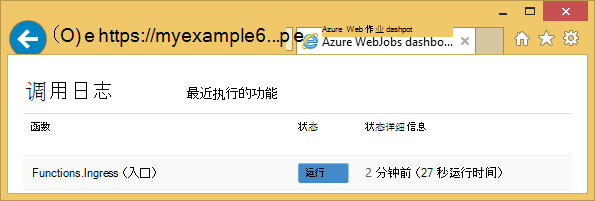
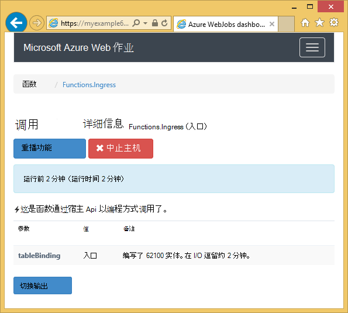
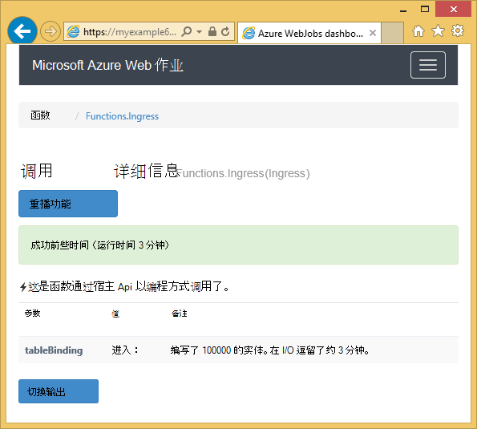

<properties 
    pageTitle="如何使用 WebJobs SDK Azure 表存储" 
    description="了解如何使用 WebJobs SDK Azure 表存储。 创建表，将实体添加到表中，并读取现有的表。" 
    services="app-service\web, storage" 
    documentationCenter=".net" 
    authors="tdykstra" 
    manager="wpickett" 
    editor="jimbe"/>

<tags 
    ms.service="app-service-web" 
    ms.workload="web" 
    ms.tgt_pltfrm="na" 
    ms.devlang="dotnet" 
    ms.topic="article" 
    ms.date="06/01/2016" 
    ms.author="tdykstra"/>

# 如何使用 WebJobs SDK Azure 表存储

## 概述

本指南提供了 C# 的代码示例演示如何读取和写入[WebJobs SDK](websites-dotnet-webjobs-sdk.md)版本使用 Azure 存储表 1.x。

该指南假定您知道[如何创建一个在 Visual Studio 中指向您的存储帐户连接字符串的 WebJob 项目](websites-dotnet-webjobs-sdk-get-started.md)或[多个存储帐户](https://github.com/Azure/azure-webjobs-sdk/blob/master/test/Microsoft.Azure.WebJobs.Host.EndToEndTests/MultipleStorageAccountsEndToEndTests.cs)。
        
某些代码段显示`Table`[手动调用](websites-dotnet-webjobs-sdk-storage-queues-how-to.md#manual)，即不是通过使用一个触发器属性的函数中使用的属性。 

## 如何向表中添加实体

将实体添加到表中，使用`Table`特性与`ICollector<T>`或`IAsyncCollector<T>`参数的`T`指定您想要添加的实体的架构。 属性构造函数采用一个字符串参数，指定的表的名称。 

下面的代码示例添加`Person`到一个名为*入口*表的实体。

        [NoAutomaticTrigger]
        public static void IngressDemo(
            [Table("Ingress")] ICollector<Person> tableBinding)
        {
            for (int i = 0; i < 100000; i++)
            {
                tableBinding.Add(
                    new Person() { 
                        PartitionKey = "Test", 
                        RowKey = i.ToString(), 
                        Name = "Name" }
                    );
            }
        }

通常的类型使用与`ICollector`从`TableEntity`或实现`ITableEntity`，但不是必须。 下列任一`Person`类与前面所示的代码的工作`Ingress`方法。

        public class Person : TableEntity
        {
            public string Name { get; set; }
        }

        public class Person
        {
            public string PartitionKey { get; set; }
            public string RowKey { get; set; }
            public string Name { get; set; }
        }

如果要直接使用 Azure 存储 API，您可以添加`CloudStorageAccount`的方法签名的参数。

## 实时监视

由于数据入口函数通常处理大量的数据，WebJobs SDK 仪表板提供了实时监控数据。 **调用日志**部分会告诉您该函数是否仍在运行。

**调用的详细信息**页报告函数的进度 （实体编写数） 时它正在运行，并使您有机会中止它。 

当函数完成后时，**调用详细信息**页面将报告写入的行数。

## 如何从表中读取多个实体

若要读取表，使用`Table`特性与`IQueryable<T>`参数可以在其中键入`T`派生`TableEntity`或实现的`ITableEntity`。

下面的代码示例读取和记录中的所有行`Ingress`表︰
 
        public static void ReadTable(
            [Table("Ingress")] IQueryable<Person> tableBinding,
            TextWriter logger)
        {
            var query = from p in tableBinding select p;
            foreach (Person person in query)
            {
                logger.WriteLine("PK:{0}, RK:{1}, Name:{2}", 
                    person.PartitionKey, person.RowKey, person.Name);
            }
        }

### 如何从表中读取单个实体

还有`Table`可让您指定的分区键和行键，当您希望绑定到单个表的实体的两个附加参数的属性构造函数。

下面的代码示例读取表行的`Person`实体基于分区键和行键值接收队列消息中︰  

        public static void ReadTableEntity(
            [QueueTrigger("inputqueue")] Person personInQueue,
            [Table("persontable","{PartitionKey}", "{RowKey}")] Person personInTable,
            TextWriter logger)
        {
            if (personInTable == null)
            {
                logger.WriteLine("Person not found: PK:{0}, RK:{1}",
                        personInQueue.PartitionKey, personInQueue.RowKey);
            }
            else
            {
                logger.WriteLine("Person found: PK:{0}, RK:{1}, Name:{2}",
                        personInTable.PartitionKey, personInTable.RowKey, personInTable.Name);
            }
        }

`Person`在此示例中的类没有实现`ITableEntity`。

## 如何直接使用.NET 存储 API 处理表格

您还可以使用`Table`特性与`CloudTable`更灵活地处理表的对象。

下面的代码示例使用`CloudTable`*入口*表中添加一个实体对象。 
 
        public static void UseStorageAPI(
            [Table("Ingress")] CloudTable tableBinding,
            TextWriter logger)
        {
            var person = new Person()
                {
                    PartitionKey = "Test",
                    RowKey = "100",
                    Name = "Name"
                };
            TableOperation insertOperation = TableOperation.Insert(person);
            tableBinding.Execute(insertOperation);
        }

有关如何使用`CloudTable`对象，请参阅[如何使用.NET 中的表存储](../storage/storage-dotnet-how-to-use-tables.md)。 

## 相关的主题涵盖的队列操作方法文章

有关如何处理表处理触发队列消息，或为 WebJobs SDK 方案不是特定表处理，请参阅[如何使用 WebJobs sdk 的 Azure 队列存储](websites-dotnet-webjobs-sdk-storage-queues-how-to.md)信息。 

在这篇文章中所涉及的主题包括︰

* 异步函数
* 多个实例
* 正常关机
* 使用 WebJobs SDK 的函数体中的属性
* 在代码中设置 SDK 连接字符串
* 值为 WebJobs SDK 构造函数参数在代码中设置
* 手动触发函数
* 写入日志

## 下一步行动

本指南提供了代码示例来演示如何处理使用 Azure 表的常见方案。 有关如何使用 Azure WebJobs 和 WebJobs SDK 的详细信息，请参阅[Azure WebJobs 推荐资源](http://go.microsoft.com/fwlink/?linkid=390226)。
 
