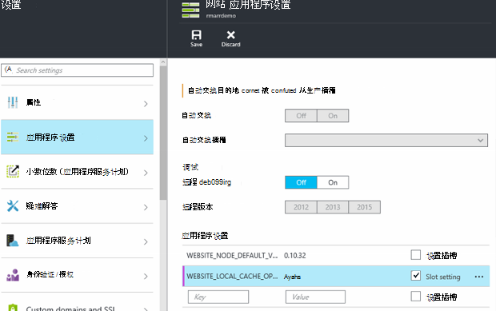

<properties
   pageTitle="Azure 应用程序服务本地缓存概述 |Microsoft Azure"
   description="本文介绍如何启用、 调整其大小，以及查询 Azure 应用程序服务本地缓存功能的状态"
   services="app-service"
   documentationCenter="app-service"
   authors="SyntaxC4"
   manager="yochayk"
   editor=""
   tags="optional"
   keywords=""/>

<tags
   ms.service="app-service"
   ms.devlang="multiple"
   ms.topic="article"
   ms.tgt_pltfrm="na"
   ms.workload="na"
   ms.date="03/04/2016"
   ms.author="cfowler"/>

# <a name="azure-app-service-local-cache-overview"></a>Azure 应用程序服务本地缓存概述

Azure 的 web 应用程序内容存储在 Azure 存储上，以持久的方式为内容共享表面化了。 这种设计旨在处理的各种应用程序和具有下列特性︰  

* 在 web 应用程序的多个虚拟机 (VM) 实例之间共享内容。
* 内容是耐用，并且可以通过运行 web 应用程序进行修改。
* 日志文件和诊断数据文件位于同一个共享的内容文件夹。
* 直接发布新内容更新的内容文件夹。 您可以立即查看 SCM 网站和正在运行的 web 应用程序相同的内容 （通常一些技术，如 ASP.NET 执行启动 web 应用程序重新启动计算机上某些文件更改，以获取最新内容）。

虽然许多 web 应用程序使用一个或所有这些功能，某些 web 应用程序只需要高性能、 只读内容可以从运行高可用性的存储。 这些应用程序可以受益于一个特定的本地高速缓存的虚拟机实例。

Azure 应用程序服务本地高速缓存功能提供了您的内容的 web 角色视图。 此内容是写的但放弃缓存存储内容在站点启动时以异步方式创建。 可以缓存时，该站点将切换要缓存的内容对其运行。 在本地缓存中运行的 web 应用程序具有以下优点︰

* 他们不会受到发生在访问在 Azure 存储内容时的延迟。
* 他们不会受到计划的升级或计划外停机时间和任何其他中断使用 Azure 存储为内容的共享服务的服务器上发生。
* 它们具有较少的应用程序重新启动由于存储共享更改。

## <a name="how-local-cache-changes-the-behavior-of-app-service"></a>本地缓存如何更改应用程序服务的行为

* 本地缓存是 /site 和 /siteextensions 的 web 应用程序文件夹的副本。 它被创建 web 应用程序启动时对本地虚拟机实例。 每个 web 应用程序的本地缓存的大小限制为 300 MB，默认情况下，但会增加到 1 GB。
* 本地缓存是可读写。 但是，当 web 应用程序移动虚拟机或获取重新启动的任何修改将被放弃。 不应使用本地缓存的内容存储中存储关键业务数据的应用程序。
* Web 应用程序可以继续与它们当前写入日志文件和诊断数据。 日志文件和数据，但是，存储在本地虚拟机。 然后将其复制到定期到共享的内容存储库。 复制到共享的内容存储区是最佳的努力 — 写入备份可能会丢失截止到 VM 实例的突然崩溃。
* 没有使用本地缓存的 web 应用程序的日志文件和数据文件夹的文件夹结构中的更改。 现在有子文件夹存储日志文件和数据文件夹中按照"唯一标识符"+ 时间戳的命名模式。 每个子文件夹对应于 web 应用程序在其中运行或已运行的 VM 实例。  
* 发布更改通过发布机制的任何 web 应用程序将发布到共享的内容存储区。 这是设计使然因为我们想要耐用的发布的内容。 若要刷新本地缓存的 web 应用程序，则需要重新启动。 这似乎像一个过度的步骤？ 从而使无缝的生命周期，请参阅本文中稍后介绍的信息。
* D:\Home 将指向本地缓存。 D:\local 将继续指向临时 VM 特定的存储。
* SCM 站点的默认内容视图将继续成为共享的内容存储区。

## <a name="enable-local-cache-in-app-service"></a>启用应用程序服务中的本地缓存

配置本地缓存时，保留应用程序设置结合使用。 您可以通过使用以下方法配置这些应用程序设置︰

* [Azure 门户](#Configure-Local-Cache-Portal)
* [Azure 的资源管理器](#Configure-Local-Cache-ARM)

### <a name="configure-local-cache-by-using-the-azure-portal"></a>通过使用 Azure 门户配置本地缓存
<a name="Configure-Local-Cache-Portal"></a>

通过使用此应用程序设置，可以在每个 web 应用的基础上启用本地缓存︰`WEBSITE_LOCAL_CACHE_OPTION` = `Always`  



### <a name="configure-local-cache-by-using-azure-resource-manager"></a>通过使用 Azure 资源管理器中配置本地缓存
<a name="Configure-Local-Cache-ARM"></a>

```
...

{
    "apiVersion": "2015-08-01",
    "type": "config",
    "name": "appsettings",
    "dependsOn": [
        "[resourceId('Microsoft.Web/sites/', variables('siteName'))]"
    ],
    "properties": {
        "WEBSITE_LOCAL_CACHE_OPTION": "Always",
        "WEBSITE_LOCAL_CACHE_SIZEINMB": "300"
    }
}

...
```

## <a name="change-the-size-setting-in-local-cache"></a>更改本地缓存的大小设置

默认情况下，本地高速缓存大小为**300 MB**。 这包括 /site 和 /siteextensions 文件夹从内容存储，复制，以及任何本地创建的日志和数据文件夹。 若要增加此限制，请使用应用程序设置`WEBSITE_LOCAL_CACHE_SIZEINMB`。 您可以增加多达**1 GB** (1000MB) 每个 web 应用程序的大小。

## <a name="best-practices-for-using-app-service-local-cache"></a>使用本地缓存的应用程序服务的最佳做法

我们建议您结合[暂存环境](../app-service-web/web-sites-staged-publishing.md)功能使用本地缓存。

* 添加应用程序设置_粘滞_`WEBSITE_LOCAL_CACHE_OPTION`的值`Always`**生产**插槽。 如果您使用的`WEBSITE_LOCAL_CACHE_SIZEINMB`，还将其添加到生产插槽的粘滞设置为。
* 创建一个**临时**插槽并发布到暂存槽。 通常不设置临时插槽使用本地缓存使无缝生成-部署-测试生命周期分阶段如果生产插槽得到本地缓存的好处。
*   测试站点遭受临时插槽。  
*   准备就绪后，发出临时和生产插槽之间[交换操作](../app-service-web/web-sites-staged-publishing.md#to-swap-deployment-slots)。  
*   粘滞设置，包括名称和粘滞插槽。 因此当暂存槽获取换用到生产中，它将继承本地缓存的应用程序设置。 新更换的生产插槽将针对本地缓存运行几分钟后，将可取暖的插槽预热的一部分在换用之后。 因此插槽交换完成后，将对本地缓存运行生产插槽。

## <a name="frequently-asked-questions-faq"></a>常见问题 (FAQ)

### <a name="how-can-i-tell-if-local-cache-applies-to-my-web-app"></a>如何知道是否本地缓存应用到我的 web 应用程序？

如果您的 web 应用程序需要高性能、 可靠的内容存储区，不会使用内容存储区来编写在运行时，关键数据的总大小为小于 1 GB，则答案是"yes"！ 若要获取 /site 和 /siteextensions 文件夹的总大小，可以使用网站扩展"Azure 应用程序磁盘使用率"。  

### <a name="how-can-i-tell-if-my-site-has-switched-to-using-local-cache"></a>如何判断我的网站是否已切换到使用本地缓存？

如果您使用暂存环境使用本地缓存功能，交换操作将无法完成直到本地高速缓存预热。 若要检查您的网站是否正在运行针对本地缓存，您可以检查工作流程环境变量`WEBSITE_LOCALCACHE_READY`。 使用[工作流程环境变量](https://github.com/projectkudu/kudu/wiki/Process-Threads-list-and-minidump-gcdump-diagsession#process-environment-variable)页面上的说明访问多个实例的工作流程环境变量。  

### <a name="i-just-published-new-changes-but-my-web-app-does-not-seem-to-have-them-why"></a>我刚发布新的更改，但尚未纳入我的 web 应用程序，让它们。 为什么？

如果您的 web 应用程序使用本地缓存，然后您需要重新启动您的网站以获取最新的更改。 不希望将更改发布到生产站点？ 请参阅前面的最佳实践部分中的插槽选项。

### <a name="where-are-my-logs"></a>在哪里我的日志？

使用本地缓存，您的日志和数据文件夹做看起来有点不同。 但是，子文件夹的结构保持不变，只不过这些子文件夹 nestled 格式"唯一虚拟机标识符"+ 时间戳子文件夹下。

### <a name="i-have-local-cache-enabled-but-my-web-app-still-gets-restarted-why-is-that-i-thought-local-cache-helped-with-frequent-app-restarts"></a>我有本地缓存被启用，但是我的 web 应用程序仍然获取重新启动。 为什么？ 我认为本地缓存帮助与频繁的应用程序重新启动。

本地缓存有助于防止与存储相关的 web 应用程序重新启动。 但是，您的 web 应用程序仍在 VM 的计划的基础架构升级过程中经历重新启动。 在总体应用程序重新启动本地高速缓存已启用与遇到的应更少。
