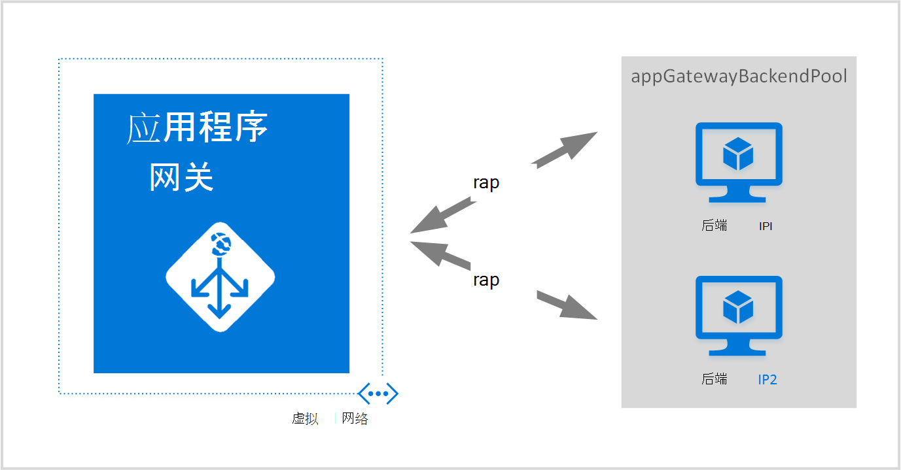
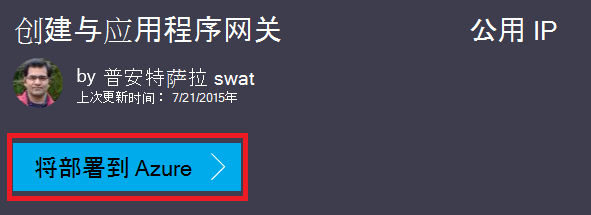
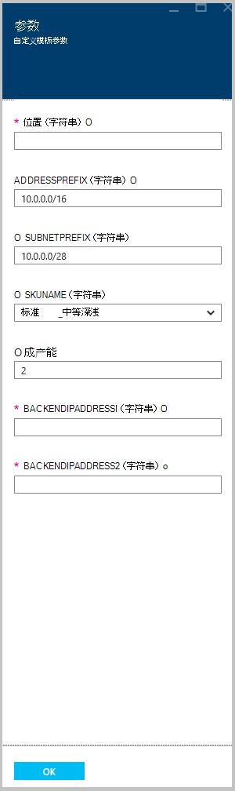

<properties
   pageTitle="通过使用 Azure 资源管理器模板创建应用程序网关 |Microsoft Azure"
   description="此页面介绍了如何使用 Azure 资源管理器模板创建的 Azure 应用程序网关"
   documentationCenter="na"
   services="application-gateway"
   authors="georgewallace"
   manager="carmonm"
   editor="tysonn"/>
<tags
   ms.service="application-gateway"
   ms.devlang="na"
   ms.topic="article"
   ms.tgt_pltfrm="na"
   ms.workload="infrastructure-services"
   ms.date="10/25/2016"
   ms.author="gwallace"/>

# 使用 Azure 资源管理器模板创建应用程序网关

> [AZURE.SELECTOR]
- [Azure 门户](application-gateway-create-gateway-portal.md)
- [资源管理器的 azure PowerShell](application-gateway-create-gateway-arm.md)
- [Azure 的经典 PowerShell](application-gateway-create-gateway.md)
- [Azure 的资源管理器模板](application-gateway-create-gateway-arm-template.md)
- [Azure CLI](application-gateway-create-gateway-cli.md)

Azure 应用程序网关是一个 7 层负载平衡器。 无论是对云的内部，它提供了故障切换时，不同的服务器之间的路由性能的 HTTP 请求。 应用程序网关提供了许多应用程序交付控制器 (ADC) 功能，其中包括 HTTP 负载平衡、 基于 cookie 的会话相关性，安全套接字层 (SSL) 卸载自定义运行状况探测器、 支持多站点，和许多其他人。 若要查找受支持的功能的完整列表，请访问[应用程序网关概述](application-gateway-introduction.md)

了解如何下载和修改现有从 GitHub Azure 资源管理器模板和部署从 GitHub，PowerShell 和 Azure CLI 的模板。

如果只要部署的 Azure 资源管理器模板直接从 GitHub 无需进行任何更改，请跳过部署从 GitHub 的模板。

## 方案

在此方案中，您将能够︰

- 创建具有两个实例的应用程序网关。
- 创建名为 VirtualNetwork1 与 10.0.0.0/16 保留 CIDR 块的虚拟网络。
- 创建名为 Appgatewaysubnet，使用 10.0.0.0/28 作为其 CIDR 块的子网。
- 设置两个以前配置所需进行负载平衡的 web 服务器的后端 Ip 通信。 在此模板的示例中后, 端 IPs 是 10.0.1.10 和 10.0.1.11。

>[AZURE.NOTE] 这些设置是为此模板的参数。 若要自定义的模板，您可以更改规则、 监听器，并打开 azuredeploy.json 的 SSL。

## 下载并了解 Azure 资源管理器模板

您可以下载现有 Azure 资源管理器模板从 GitHub 创建虚拟网络和两个子网，请进行任何更改，您可能希望，并重用它。 为此，请使用以下步骤︰

1. 导航到[创建应用程序网关](https://github.com/Azure/azure-quickstart-templates/tree/master/101-application-gateway-create)。
2. 单击**azuredeploy.json**，然后再单击**原始**。
3. 在您的计算机上的本地文件夹中保存文件。
4. 如果您熟悉使用 Azure 资源管理器模板，则跳到步骤 7。
5. 打开已保存的文件并查看其内容在第 5 行中的**参数**时。 Azure 的资源管理器模板参数提供的值可以在部署过程中填写占位符。

  	| 参数 | 说明 |
  	|---|---|
  	| **位置** | 在其中创建应用程序网关的 azure 区域 |
  	| **VirtualNetwork1** | 新的虚拟网络名称 |
  	| **addressPrefix** | 虚拟的网络，以 CIDR 格式的地址空间 |
  	| **ApplicationGatewaysubnet** | 应用程序网关子网的名称 |
  	| **subnetPrefix** | 应用程序网关网的 CIDR 块 |
  	| **skuname** | SKU 实例大小 |
  	| **容量** | 实例数 |
  	| **backendaddress1** | 第一个 web 服务器的 IP 地址 |
  	| **backendaddress2** | 第二个 web 服务器的 IP 地址 |

    >[AZURE.IMPORTANT] 在 GitHub 中维护的 azure 资源管理器模板可随时间变化。 请确保您在使用它之前签入模板。

6. 检查**资源**下的内容，并请注意以下︰

    - **类型**。 由模板创建的资源类型。 在这种情况下，类型为**Microsoft.Network/applicationGateways**，它代表应用程序网关。
    - **名称**。 资源的名称。 注意到**[parameters('applicationGatewayName')]**，这意味着该名称作为输入提供由您或参数文件在部署期间使用。
    - **属性**。 为该资源的属性的列表。 此模板使用应用程序网关创建过程的虚拟网络和公用 IP 地址。

7. 定位到[https://github.com/Azure/azure-quickstart-templates/blob/master/101-application-gateway-create/](https://github.com/Azure/azure-quickstart-templates/blob/master/101-application-gateway-create)。
8. **Azuredeploy-paremeters.json**，请单击，然后单击**原始**。
9. 在您的计算机上的本地文件夹中保存文件。
10. 打开已保存的文件并编辑参数的值。 使用下列值来部署我们的方案中所述应用程序网关。

        {
        "$schema": "http://schema.management.azure.com/schemas/2015-01-01/deploymentParameters.json#",
        {
        "location" : {
        "value" : "West US"
        },
        "addressPrefix": {
        "value": "10.0.0.0/16"
        },
        "subnetPrefix": {
        "value": "10.0.0.0/24"
        },
        "skuName": {
        "value": "Standard_Small"
        },
        "capacity": {
        "value": 2
        },
        "backendIpAddress1": {
        "value": "10.0.1.10"
        },
        "backendIpAddress2": {
        "value": "10.0.1.11"
        }
        }

11. 保存该文件。 您可以使用像[JSlint.com](http://www.jslint.com/)这样的在线 JSON 验证工具测试 JSON 模板和模板参数。

## 通过使用 PowerShell 部署 Azure 资源管理器模板

如果您以前从未使用 Azure PowerShell，请参阅[如何安装和配置 Azure PowerShell](../powershell-install-configure.md)并按照说明进行操作以登录到 Azure 并选择您的订购。

### 第 1 步

    Login-AzureRmAccount

### 第 2 步

请检查帐户订阅。

    Get-AzureRmSubscription

提示您使用您的凭据进行身份验证。

### 第 3 步

选择您要使用的 Azure 订阅。

    Select-AzureRmSubscription -Subscriptionid "GUID of subscription"

### 第 4 步

如果需要请使用**New AzureResourceGroup** cmdlet 创建资源组。 在以下示例中，您将创建东亚美国位置中名为 AppgatewayRG 的资源组。

    New-AzureRmResourceGroup -Name AppgatewayRG -Location "East US"

运行**新建 AzureRmResourceGroupDeployment** cmdlet 使用上面的模板和参数文件下载和修改部署新的虚拟网络。

    New-AzureRmResourceGroupDeployment -Name TestAppgatewayDeployment -ResourceGroupName AppgatewayRG `
        -TemplateFile C:\ARM\azuredeploy.json -TemplateParameterFile C:\ARM\azuredeploy-parameters.json

## 通过使用 Azure CLI 部署 Azure 资源管理器模板

要部署使用 Azure CLI 的 Azure 资源管理器模板，请按照下面的步骤操作︰

### 第 1 步

如果您以前从未使用 Azure CLI，请参阅[安装和配置 Azure CLI](../xplat-cli-install.md)并按照您选择您的 Azure 帐户和订阅为止。

### 第 2 步

运行**azure 配置模式**命令切换到资源管理器模式，如下所示。

    azure config mode arm

以下是上述命令的预期的输出︰

    info:   New mode is arm

### 第 3 步

如果有必要，请运行**azure 组创建**命令来创建新的资源组，如下所示。 请注意命令的输出。 显示后输出说明中使用的参数的列表。 有关资源组的详细信息，请访问[Azure 资源管理器的概述](../azure-resource-manager/resource-group-overview.md)。

    azure group create -n appgatewayRG -l eastus

**-n （或--名称）**。 新的资源组的名称。 对于我们的方案，它是*appgatewayRG*。

**-l （或--位置）**。 在其中创建新的资源组的 azure 地区。 对于我们的方案，它是*eastus*。

### 第 4 步

运行**azure 组部署创建**cmdlet 使用来部署新的虚拟网络下载和修改上面的模板和参数文件。 显示后输出说明中使用的参数的列表。

    azure group deployment create -g appgatewayRG -n TestAppgatewayDeployment -f C:\ARM\azuredeploy.json -e C:\ARM\azuredeploy-parameters.json

## 通过单击部署部署 Azure 资源管理器模板

单击部署是另一种方法使用 Azure 资源管理器模板。 它是使用 Azure 门户网站模板的简便方法。

### 第 1 步

转到[创建公用 IP 应用程序网关](https://azure.microsoft.com/documentation/templates/101-application-gateway-public-ip/)。

### 第 2 步

单击**将部署到 Azure**。

### 第 3 步

填写在门户上的部署模板的参数并单击**确定**。

### 第 4 步

选择**法律条款**，然后单击**购买**。

### 第 5 步

在自定义部署刀片式服务器，请单击**创建**。

## 下一步行动

如果您想要配置 SSL 卸载，请参阅[配置 SSL 的应用程序网关，减轻负担](application-gateway-ssl.md)。

如果您想要配置的应用程序网关内部负载平衡器中使用，请参阅[创建具有内部负载平衡器 (ILB) 的应用程序网关](application-gateway-ilb.md)。

如果您想详细了解一般情况下负载平衡选项，请访问︰

- [Azure 负载平衡器](https://azure.microsoft.com/documentation/services/load-balancer/)
- [Azure 的流量管理器](https://azure.microsoft.com/documentation/services/traffic-manager/)
