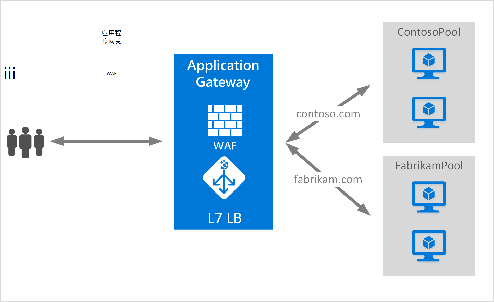

<properties
   pageTitle="创建装载多个站点的应用程序网关 |Microsoft Azure"
   description="此页提供如何创建、 配置的 Azure 应用程序网关的驻留多个 web 应用程序相同的网关。"
   documentationCenter="na"
   services="application-gateway"
   authors="amsriva"
   manager="rossort"
   editor="amsriva"/>
<tags
   ms.service="application-gateway"
   ms.devlang="na"
   ms.topic="article"
   ms.tgt_pltfrm="na"
   ms.workload="infrastructure-services"
   ms.date="10/25/2016"
   ms.author="amsriva"/>

# 创建托管多个 web 应用程序的应用程序网关

> [AZURE.SELECTOR]
- [Azure 门户](application-gateway-create-multisite-portal.md)
- [资源管理器的 azure PowerShell](application-gateway-create-multisite-azureresourcemanager-powershell.md)

多站点宿主，可以部署多个 web 应用程序在同一应用程序网关。 它依赖于主机标头中的传入的 HTTP 请求，以确定哪些侦听器将接收通信的存在。 监听器然后把通信定向到适当的后端池配置规则的定义中的网关。 在启用 SSL web 应用程序，要选择正确的 web 通信监听器的服务器名称指示 (SNI) 扩展依赖于应用程序网关。 多站点宿主的一个常见用途是请求进行负载平衡不同的 web 域不同的后端服务器池。 同样也无法上同一应用程序网关承载多个相同的根域的子域。

## 方案

在以下示例中，应用程序网关服务于 contoso.com 和 fabrikam.com 的流量与两个后端服务器池︰ contoso 服务器池和 fabrikam 服务器池。 类似的安装程序可能用于到主机 app.contoso.com 和 blog.contoso.com 等的子域。

## 在开始之前

1. 通过使用 Web 平台安装程序安装最新版本的 Azure PowerShell cmdlet。 您可以从下载并安装最新版本[下载网页](https://azure.microsoft.com/downloads/)的**Windows PowerShell**部分。
2. 添加到后端的池中使用应用程序网关服务器必须存在，否则它们的终结点创建了无论是在独立的子网或公用 IP/VIP 分配与虚拟的网络中。

## 要求

- **后端服务器池︰**后端服务器的 IP 地址的列表。 列出的 IP 地址既应属于虚拟子网或应当是公共 IP/VIP。 此外可以使用 FQDN。
- **后端服务器池设置︰**每个池都有设置，如端口、 协议和基于 cookie 的关系等。 这些设置到池密切相关，并且应用于池中的所有服务器。
- **前端端口︰**此端口是打开的应用程序网关在公共端口。 流量达到此端口，，然后获取重定向到一台后端服务器。
- **侦听器︰**侦听器具有前端端口、 协议 （Http 或 Https，这些值是区分大小写），和 SSL 证书名称 （如果配置 SSL 卸载）。 多站点启用应用程序网关，还添加主机名称和 SNI 指示器。
- **规则︰**该规则绑定侦听器，该后端服务器池，并定义当它达到特定侦听器通信应定向到哪个后端服务器池。

## 创建应用程序网关

创建应用程序网关所需的步骤如下︰

1. 创建资源组的资源管理器中。
2. 创建虚拟网络、 子网和公用 IP 应用程序网关。
3. 创建应用程序网关配置对象。
4. 创建一个应用程序网关资源。

## 创建资源组的资源管理器

请确保您使用的最新版本的 Azure PowerShell。 在[使用 Windows PowerShell 使用资源管理器中](../powershell-azure-resource-manager.md)可用的详细信息。

### 第 1 步

登录到 Azure 中

    Login-AzureRmAccount

提示您使用您的凭据进行身份验证。

### 第 2 步

请检查帐户订阅。

    Get-AzureRmSubscription

### 第 3 步

选择您要使用的 Azure 订阅。

    Select-AzureRmSubscription -SubscriptionName "Name of subscription"

### 第 4 步

创建资源组 （跳过此步骤如果您正在使用现有资源组）。

    New-AzureRmResourceGroup -Name appgw-RG -location "West US"

或者，您还可以创建资源组应用程序网关的标记︰

    $resourceGroup = New-AzureRmResourceGroup -Name appgw-RG -Location "West US" -Tags @{Name = "testtag"; Value = "Application Gateway multiple site"}

Azure 的资源管理器需要的所有资源组都指定一个位置。 此位置用作该资源组中的资源的默认位置。 请确保创建的应用程序网关的所有命令都使用相同的资源组。

在上面的示例中，我们创建了一个名为"appgw-RG"与"西美国"位置的资源组。

>[AZURE.NOTE] 如果您需要配置的自定义探测应用程序网关，请参阅[创建自定义通过使用 PowerShell 探测应用程序网关](application-gateway-create-probe-ps.md)。 [自定义的探测和运行状况监视](application-gateway-probe-overview.md)的详细信息，请访问。

## 创建虚拟网络和子网

下面的示例演示如何通过使用资源管理器创建虚拟网络。 在此步骤中创建两个子网。 应用程序网关本身是第一个子网。 应用程序网关需要各自的子网上，以保存其实例。 可以将其他应用程序网关部署该子网中。 第二个网用于保存应用程序的后端服务器。

### 第 1 步

分配给子网变量用于保存应用程序网关地址范围 10.0.0.0/24。

    $subnet = New-AzureRmVirtualNetworkSubnetConfig -Name appgatewaysubnet -AddressPrefix 10.0.0.0/24

### 第 2 步

分配给 subnet2 变量用于后端池的地址范围 10.0.1.0/24。

    $subnet2 = New-AzureRmVirtualNetworkSubnetConfig -Name backendsubnet -AddressPrefix 10.0.1.0/24

### 第 3 步

创建虚拟网络名资源组"appgw-rg"中的"appgwvnet"为前缀 10.0.0.0/16 使用的子网 10.0.0.0/24 的美国西部地区和 10.0.1.0/24。

    $vnet = New-AzureRmVirtualNetwork -Name appgwvnet -ResourceGroupName appgw-RG -Location "West US" -AddressPrefix 10.0.0.0/16 -Subnet $subnet,$subnet2

### 第 4 步

指定子网变量有关的下一步骤，这将创建的应用程序网关。

    $appgatewaysubnet = Get-AzureRmVirtualNetworkSubnetConfig -Name appgatewaysubnet -VirtualNetwork $vnet
    $backendsubnet = Get-AzureRmVirtualNetworkSubnetConfig -Name backendsubnet -VirtualNetwork $vnet

## 创建前端配置公用 IP 地址

创建公用 IP 资源在资源组"appgw-rg"美国西部地区的"publicIP01"。

    $publicip = New-AzureRmPublicIpAddress -ResourceGroupName appgw-RG -name publicIP01 -location "West US" -AllocationMethod Dynamic

在服务启动时，将向应用程序网关分配 IP 地址。

## 创建应用程序网关配置

在创建应用程序网关之前必须设置所有的配置项。 以下步骤将创建所需的应用程序网关资源的配置项。

### 第 1 步

创建一个名为"gatewayIP01"的应用程序网关 IP 配置。 当启动时应用程序网关时，它拾取从配置子网的 IP 地址，并将网络通信量传送到后端 IP 池中的 IP 地址。 请记住每个实例都需要一个 IP 地址。

    $gipconfig = New-AzureRmApplicationGatewayIPConfiguration -Name gatewayIP01 -Subnet $appgatewaysubnet

### 第 2 步

名为"pool01"和"pool2"使用 IP 地址的后端 IP 地址池配置"10.0.1.100，10.0.1.101,10.0.1.102"的"池 1"和"10.0.1.103、 10.0.1.104、 10.0.1.105""pool2"的。

    $pool1 = New-AzureRmApplicationGatewayBackendAddressPool -Name pool01 -BackendIPAddresses 10.0.1.100, 10.0.1.101, 10.0.1.102
    $pool2 = New-AzureRmApplicationGatewayBackendAddressPool -Name pool02 -BackendIPAddresses 10.0.1.103, 10.0.1.104, 10.0.1.105

在此示例中，有两个后端池路由基于请求的站点的网络通信量。 一个池接收通信从网站"contoso.com"并从"fabrikam.com"的网站，其他池接收通信。 您必须替换前面的 IP 地址，添加您自己应用程序的 IP 地址终结点。 代替的内部 IP 地址，您还可以使用公用 IP 地址，FQDN，或者虚拟机的 NIC 后端实例。 使用"-BackendFQDNs"继续指定 Fqdn 而不是 Ip 参数。

### 第 3 步

在后端池的负载平衡网络流量配置应用程序网关设置"poolsetting01"和"poolsetting02"。 在此示例中，您可以配置不同的后端池后端池设置。 每个后端池可以有它自己的池后端设置。

    $poolSetting01 = New-AzureRmApplicationGatewayBackendHttpSettings -Name "besetting01" -Port 80 -Protocol Http -CookieBasedAffinity Disabled -RequestTimeout 120
    $poolSetting02 = New-AzureRmApplicationGatewayBackendHttpSettings -Name "besetting02" -Port 80 -Protocol Http -CookieBasedAffinity Enabled -RequestTimeout 240

### 第 4 步

将前端 IP 配置公用 IP 终结点。

    $fipconfig01 = New-AzureRmApplicationGatewayFrontendIPConfig -Name "frontend1" -PublicIPAddress $publicip

### 第 5 步

配置应用程序网关的前端端口。

    $fp01 = New-AzureRmApplicationGatewayFrontendPort -Name "fep01" -Port 443

### 第 6 步

配置两个 SSL 证书的两个网站支持在此示例中，我们将。 一个证书用于 contoso.com 通信，另一个是 fabrikam.com 通信。 这些证书应为证书颁发机构颁发的证书为您的网站。 自签名的证书是支持，但不是建议在生产通讯。

    $cert01 = New-AzureRmApplicationGatewaySslCertificate -Name contosocert -CertificateFile <file path> -Password <password>
    $cert02 = New-AzureRmApplicationGatewaySslCertificate -Name fabrikamcert -CertificateFile <file path> -Password <password>

### 第 7 步

在此示例中配置两个侦听器的两个网站。 此步骤将配置公用 IP 地址、 端口和主机用来接收传入通信的侦听器。 主机名参数对于多个站点支持是必需的并应设置为相应的网站，为其接收通信。 应将 RequireServerNameIndication 参数设置为需要在多个主机方案支持 SSL 的网站，则返回 true。 如果需要 SSL 支持，则还需要指定用于确保该 web 应用程序的通信安全的 SSL 证书。 FrontendIPConfiguration、 FrontendPort 和主机名的组合必须是唯一的一个侦听器。 每个侦听器可以支持一个证书。

    $listener01 = New-AzureRmApplicationGatewayHttpListener -Name "listener01" -Protocol Https -FrontendIPConfiguration $fipconfig01 -FrontendPort $fp01 -HostName "contoso11.com" -RequireServerNameIndication true  -SslCertificate $cert01
    $listener02 = New-AzureRmApplicationGatewayHttpListener -Name "listener02" -Protocol Https -FrontendIPConfiguration $fipconfig01 -FrontendPort $fp01 -HostName "fabrikam11.com" -RequireServerNameIndication true -SslCertificate $cert02

### 第 8 步

在此示例中创建两个规则设置的两个 web 应用程序。 侦听器、 池后端和 http 设置规则将联系起来。 此步骤将配置应用程序网关使用基本的路由规则，另一个用于每个网站。 为每个网站的流量通过其配置的侦听器，接收，然后再被定向到其已配置的后端池，使用 BackendHttpSettings 中指定的属性。

    $rule01 = New-AzureRmApplicationGatewayRequestRoutingRule -Name "rule01" -RuleType Basic -HttpListener $listener01 -BackendHttpSettings $poolSetting01 -BackendAddressPool $pool1
    $rule02 = New-AzureRmApplicationGatewayRequestRoutingRule -Name "rule02" -RuleType Basic -HttpListener $listener02 -BackendHttpSettings $poolSetting02 -BackendAddressPool $pool2

### 第 9 步

配置实例和应用程序网关的大小的数量。

    $sku = New-AzureRmApplicationGatewaySku -Name "Standard_Medium" -Tier Standard -Capacity 2

## 创建应用程序网关

使用前面的步骤中的所有配置对象来创建应用程序网关。

    $appgw = New-AzureRmApplicationGateway -Name appgwtest -ResourceGroupName appgw-RG -Location "West US" -BackendAddressPools $pool1,$pool2 -BackendHttpSettingsCollection $poolSetting01, $poolSetting02 -FrontendIpConfigurations $fipconfig01 -GatewayIpConfigurations $gipconfig -FrontendPorts $fp01 -HttpListeners $listener01, $listener02 -RequestRoutingRules $rule01, $rule02 -Sku $sku -SslCertificates $cert01, $cert02

>[AZURE.IMPORTANT] 应用程序网关的供应是一个长时间运行的操作，可能需要一些时间才能完成。

## 获取应用程序网关 DNS 名称

创建网关后下, 一步是配置的前端通信。 当使用公用 IP，应用程序网关需要一个动态分配的 DNS 名称不友好。 为了确保最终用户可以按应用程序网关的 CNAME 记录可以用于指向应用程序网关的公共端点。 [配置在 Azure 中的自定义域名称](../cloud-services/cloud-services-custom-domain-name-portal.md)。 若要执行此操作，检索应用程序网关和使用 PublicIPAddress 元素连接到应用程序网关及其关联的 IP/DNS 名称的详细信息。 应用程序网关的 DNS 名称用于创建 CNAME 记录指向到此 DNS 名称的两个 web 应用程序。 VIP 可能会更改在重新启动应用程序网关不建议使用 A 记录。
    
    Get-AzureRmPublicIpAddress -ResourceGroupName appgw-RG -Name publicIP01
        
    Name                     : publicIP01
    ResourceGroupName        : appgw-RG
    Location                 : westus
    Id                       : /subscriptions/<subscription_id>/resourceGroups/appgw-RG/providers/Microsoft.Network/publicIPAddresses/publicIP01
    Etag                     : W/"00000d5b-54ed-4907-bae8-99bd5766d0e5"
    ResourceGuid             : 00000000-0000-0000-0000-000000000000
    ProvisioningState        : Succeeded
    Tags                     : 
    PublicIpAllocationMethod : Dynamic
    IpAddress                : xx.xx.xxx.xx
    PublicIpAddressVersion   : IPv4
    IdleTimeoutInMinutes     : 4
    IpConfiguration          : {
                                 "Id": "/subscriptions/<subscription_id>/resourceGroups/appgw-RG/providers/Microsoft.Network/applicationGateways/appgwtest/frontendIP
                               Configurations/frontend1"
                               }
    DnsSettings              : {
                                 "Fqdn": "00000000-0000-xxxx-xxxx-xxxxxxxxxxxx.cloudapp.net"
                               }

## 下一步行动

了解如何保护您的网站使用[应用程序网关的 Web 应用程序防火墙](application-gateway-webapplicationfirewall-overview.md)