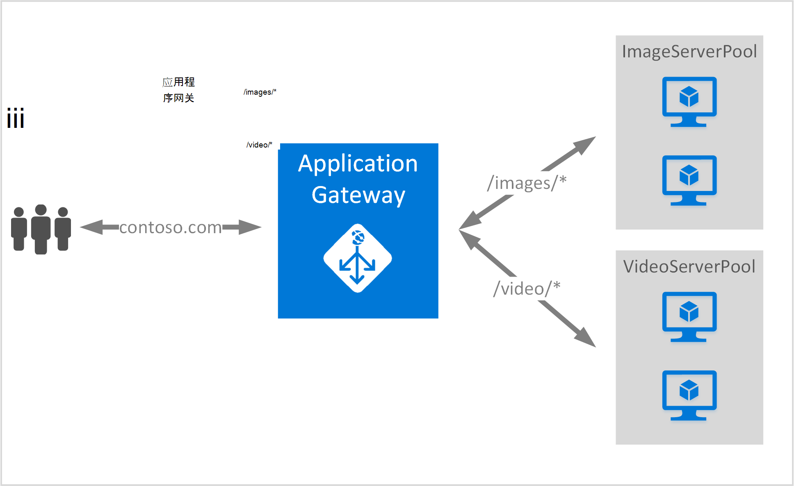

<properties
   pageTitle="创建使用 URL 路由规则的应用程序网关 |Microsoft Azure"
   description="此页提供如何创建、 配置使用 URL 路由规则的 Azure 应用程序网关"
   documentationCenter="na"
   services="application-gateway"
   authors="georgewallace"
   manager="jdial"
   editor="tysonn"/>
<tags
   ms.service="application-gateway"
   ms.devlang="na"
   ms.topic="article"
   ms.tgt_pltfrm="na"
   ms.workload="infrastructure-services"
   ms.date="10/25/2016"
   ms.author="gwallace"/>

# 创建使用基于路径的路由应用程序网关 

> [AZURE.SELECTOR]
- [Azure 门户](application-gateway-create-url-route-portal.md)
- [资源管理器的 azure PowerShell](application-gateway-create-url-route-arm-ps.md)

基于路径的路由的 URL 时，可以将路由基于 Http 请求的 URL 路径相关联。 它检查是否有到后端池配置的 URL 列表中应用程序网关的路由，并将网络通信发送到定义的后端池。 基于 URL 的路由的一个常见用途是请求进行负载平衡对于不同的内容类型，对不同的后端服务器池。

基于 URL 的路由到网关应用程序引入新的规则类型。 应用程序网关有两种规则类型︰ 基本和 PathBasedRouting。 基本规则类型提供循环服务的后端池 PathBasedRouting 时除了循环分布，还要考虑请求 URL 的路径模式选择后端库时。

>[AZURE.IMPORTANT] PathPattern︰ 路径模式相匹配的列表。 必须从每个开始 / 的唯一的地方和"\*"允许在末尾。 有效的示例包括 /xyz，/xyz*或 /xyz/*。 字符串提供给路径 matcher 后第一个不包含任何文字"？"或"#"，但不允许这些字符。 

## 方案
在下面的示例中，应用程序网关服务于通信 contoso.com 与两个后端服务器池︰ 视频服务器池和图像服务器池。

Http://contoso.com/image*被路由到图像服务器池 (池 1) 和 http://contoso.com/video*的请求都会被路由到视频服务器池 (pool2)。 如果没有一个路径模式匹配，则选中默认服务器池 (池 1)。

## 在开始之前

1. 通过使用 Web 平台安装程序安装最新版本的 Azure PowerShell cmdlet。 您可以从下载并安装最新版本[下载网页](https://azure.microsoft.com/downloads/)的**Windows PowerShell**部分。
2. 对于应用程序网关创建虚拟网络和子网。 请确保没有虚拟机或云部署使用子网。 应用程序网关必须自行在虚拟的网络子网中。
3. 添加到后端的池中使用应用程序网关服务器必须存在，否则它们的终结点创建了虚拟的网络中，也可以使用公用 IP/VIP 分配。

## 必须创建应用程序网关是什么？

- **后端服务器池︰**后端服务器的 IP 地址的列表。 列出的 IP 地址既应属于虚拟子网或应当是公共 IP/VIP。
- **后端服务器池设置︰**每个池都有设置，如端口、 协议和基于 cookie 的关系等。 这些设置到池密切相关，并且应用于池中的所有服务器。
- **前端端口︰**此端口是打开的应用程序网关在公共端口。 流量达到此端口，，然后获取重定向到一台后端服务器。
- **侦听器︰**侦听器具有前端端口、 协议 （Http 或 Https，这些都是区分大小写），和 SSL 证书名称 （如果配置 SSL 卸载）。
- **规则︰**该规则绑定侦听器后, 端服务器池，并定义时将触发特定侦听器通信应定向到哪个后端服务器池。

## 创建应用程序网关

使用 Azure 经典和 Azure 资源管理器之间的区别是在其中创建应用程序网关，并需要配置项的顺序。

使用资源管理器中，使应用程序网关的所有项目都单独配置，然后在一起以创建应用程序网关资源。

下面是创建应用程序网关所需的步骤︰

1. 创建资源组的资源管理器中。
2. 创建虚拟网络、 子网和公用 IP 应用程序网关。
3. 创建应用程序网关配置对象。
4. 创建一个应用程序网关资源。

## 创建资源组的资源管理器

请确保您使用的最新版本的 Azure PowerShell。 [使用 Windows PowerShell 与资源管理器](../powershell-azure-resource-manager.md)提供了更多的信息。

### 第 1 步

登录到 Azure 中

    Login-AzureRmAccount

提示您使用您的凭据进行身份验证。 

### 第 2 步

请检查帐户订阅。

    Get-AzureRmSubscription

### 第 3 步

选择您要使用的 Azure 订阅。  

    Select-AzureRmSubscription -Subscriptionid "GUID of subscription"

### 第 4 步

创建资源组 （跳过此步骤如果您正在使用现有资源组）。

    New-AzureRmResourceGroup -Name appgw-RG -Location "West US"

或者，您还可以创建资源组应用程序网关的标记︰
    
    $resourceGroup = New-AzureRmResourceGroup -Name appgw-RG -Location "West US" -Tags @{Name = "testtag"; Value = "Application Gateway URL routing"} 

Azure 的资源管理器需要的所有资源组都指定一个位置。 这是该资源组中的资源用作默认位置。 请确保创建的应用程序网关的所有命令都使用相同的资源组。

在上面的示例中，我们创建了一个名为"appgw RG"和"西美国"位置的资源组。

>[AZURE.NOTE] 如果您需要配置的自定义探测应用程序网关，请参阅[创建自定义通过使用 PowerShell 探测应用程序网关](application-gateway-create-probe-ps.md)。 查看[自定义的探测和运行状况监视](application-gateway-probe-overview.md)的详细信息。

## 创建虚拟网络和应用程序网关的子网

下面的示例演示如何通过使用资源管理器创建虚拟网络。

### 第 1 步

将地址范围 10.0.0.0/24 分配给子网变量可用于创建虚拟网络。

    $subnet = New-AzureRmVirtualNetworkSubnetConfig -Name subnet01 -AddressPrefix 10.0.0.0/24

### 第 2 步

创建虚拟网络名资源组"appgw-rg"中的"appgwvnet"为前缀 10.0.0.0/16 使用的子网 10.0.0.0/24 的美国西部地区。

    $vnet = New-AzureRmVirtualNetwork -Name appgwvnet -ResourceGroupName appgw-RG -Location "West US" -AddressPrefix 10.0.0.0/16 -Subnet $subnet

### 第 3 步

指定子网变量有关的下一步骤，这将创建的应用程序网关。

    $subnet=$vnet.Subnets[0]

## 创建前端配置公用 IP 地址

创建公用 IP 资源在资源组"appgw-rg"美国西部地区的"publicIP01"。

    $publicip = New-AzureRmPublicIpAddress -ResourceGroupName appgw-RG -name publicIP01 -location "West US" -AllocationMethod Dynamic

在服务启动时，将向应用程序网关分配 IP 地址。

## 创建应用程序网关配置

在创建应用程序网关之前必须设置所有的配置项。 以下步骤将创建所需的应用程序网关资源的配置项。

### 第 1 步

创建一个名为"gatewayIP01"的应用程序网关 IP 配置。 当启动时应用程序网关时，它拾取从配置子网的 IP 地址，并将网络通信量传送到后端 IP 池中的 IP 地址。 请记住每个实例都需要一个 IP 地址。

    $gipconfig = New-AzureRmApplicationGatewayIPConfiguration -Name gatewayIP01 -Subnet $subnet

### 第 2 步

名为"pool01"和"pool2"使用 IP 地址的后端 IP 地址池配置"134.170.185.46，134.170.188.221,134.170.185.50"为"池 1"和"134.170.186.46，134.170.189.221,134.170.186.50""pool2"的。

    $pool1 = New-AzureRmApplicationGatewayBackendAddressPool -Name pool01 -BackendIPAddresses 134.170.185.46, 134.170.188.221,134.170.185.50

    $pool2 = New-AzureRmApplicationGatewayBackendAddressPool -Name pool02 -BackendIPAddresses 134.170.186.46, 134.170.189.221,134.170.186.50

在此示例中，有两个后端池为网络通信安排路由基于 URL 路径。 一个池接收通信从 URL 路径"/ 视频"和其他池接收通信路径中的"/ 图像"。 替代上面的 IP 地址，添加您自己应用程序的 IP 地址终结点。 

### 第 3 步

在后端池的负载平衡网络流量配置应用程序网关设置"poolsetting01"和"poolsetting02"。 在此示例中，您可以配置不同的后端池后端池设置。 每个后端池可以有它自己的池后端设置。

    $poolSetting01 = New-AzureRmApplicationGatewayBackendHttpSettings -Name "besetting01" -Port 80 -Protocol Http -CookieBasedAffinity Disabled -RequestTimeout 120

    $poolSetting02 = New-AzureRmApplicationGatewayBackendHttpSettings -Name "besetting02" -Port 80 -Protocol Http -CookieBasedAffinity Enabled -RequestTimeout 240

### 第 4 步

将前端 IP 配置公用 IP 终结点。

    $fipconfig01 = New-AzureRmApplicationGatewayFrontendIPConfig -Name "frontend1" -PublicIPAddress $publicip

### 第 5 步 

配置应用程序网关的前端端口。

    $fp01 = New-AzureRmApplicationGatewayFrontendPort -Name "fep01" -Port 80
### 第 6 步

配置监听器。 此步骤将配置公用 IP 地址和端口，用于接收传入的网络通信的侦听器。 
 
    $listener = New-AzureRmApplicationGatewayHttpListener -Name "listener01" -Protocol Http -FrontendIPConfiguration $fipconfig01 -FrontendPort $fp01

### 第 7 步 

配置 URL 规则路径用于后端池。 此步骤将配置应用程序网关用于定义 URL 路径和哪个后端池被分配来处理传入的通信之间的映射的相对路径。

下面的示例创建两个规则︰ 一个用于"/ 图像 /"路径路由通信到后端"池 1"和"/ 视频 /"路径路由通信到后端"pool2"的另一个。
    
    $imagePathRule = New-AzureRmApplicationGatewayPathRuleConfig -Name "pathrule1" -Paths "/image/*" -BackendAddressPool $pool1 -BackendHttpSettings $poolSetting01

    $videoPathRule = New-AzureRmApplicationGatewayPathRuleConfig -Name "pathrule2" -Paths "/video/*" -BackendAddressPool $pool2 -BackendHttpSettings $poolSetting02

如果路径不匹配的任何预定义的路径规则，规则路径映射配置还会配置默认后端地址池。 

    $urlPathMap = New-AzureRmApplicationGatewayUrlPathMapConfig -Name "urlpathmap" -PathRules $videoPathRule, $imagePathRule -DefaultBackendAddressPool $pool1 -DefaultBackendHttpSettings $poolSetting02

### 第 8 步

创建一个规则设置。 此步骤将配置为使用基于路径的路由 URL 的应用程序网关。

    $rule01 = New-AzureRmApplicationGatewayRequestRoutingRule -Name "rule1" -RuleType PathBasedRouting -HttpListener $listener -UrlPathMap $urlPathMap

### 第 9 步

配置实例和应用程序网关的大小的数量。

    $sku = New-AzureRmApplicationGatewaySku -Name "Standard_Small" -Tier Standard -Capacity 2

## 创建应用程序网关

使用前面的步骤中的所有配置对象来创建应用程序网关。

    $appgw = New-AzureRmApplicationGateway -Name appgwtest -ResourceGroupName appgw-RG -Location "West US" -BackendAddressPools $pool1,$pool2 -BackendHttpSettingsCollection $poolSetting01, $poolSetting02 -FrontendIpConfigurations $fipconfig01 -GatewayIpConfigurations $gipconfig -FrontendPorts $fp01 -HttpListeners $listener -UrlPathMaps $urlPathMap -RequestRoutingRules $rule01 -Sku $sku

## 获取应用程序网关 DNS 名称

创建网关后下, 一步是配置的前端通信。 当使用公用 IP，应用程序网关需要一个动态分配的 DNS 名称不友好。 为了确保最终用户可以按应用程序网关的 CNAME 记录可以用于指向应用程序网关的公共端点。 [配置在 Azure 中的自定义域名称](../cloud-services/cloud-services-custom-domain-name-portal.md)。 若要执行此操作，检索应用程序网关和使用 PublicIPAddress 元素连接到应用程序网关及其关联的 IP/DNS 名称的详细信息。 应用程序网关的 DNS 名称用于创建 CNAME 记录指向到此 DNS 名称的两个 web 应用程序。 VIP 可能会更改在重新启动应用程序网关不建议使用 A 记录。
    
    Get-AzureRmPublicIpAddress -ResourceGroupName appgw-RG -Name publicIP01
        
    Name                     : publicIP01
    ResourceGroupName        : appgw-RG
    Location                 : westus
    Id                       : /subscriptions/<subscription_id>/resourceGroups/appgw-RG/providers/Microsoft.Network/publicIPAddresses/publicIP01
    Etag                     : W/"00000d5b-54ed-4907-bae8-99bd5766d0e5"
    ResourceGuid             : 00000000-0000-0000-0000-000000000000
    ProvisioningState        : Succeeded
    Tags                     : 
    PublicIpAllocationMethod : Dynamic
    IpAddress                : xx.xx.xxx.xx
    PublicIpAddressVersion   : IPv4
    IdleTimeoutInMinutes     : 4
    IpConfiguration          : {
                                 "Id": "/subscriptions/<subscription_id>/resourceGroups/appgw-RG/providers/Microsoft.Network/applicationGateways/appgwtest/frontendIP
                               Configurations/frontend1"
                               }
    DnsSettings              : {
                                 "Fqdn": "00000000-0000-xxxx-xxxx-xxxxxxxxxxxx.cloudapp.net"
                               }

## 下一步行动

如果您想要了解安全套接字层 (SSL) 卸载，请参阅[配置 SSL 的应用程序网关，减轻负担](application-gateway-ssl-arm.md)。