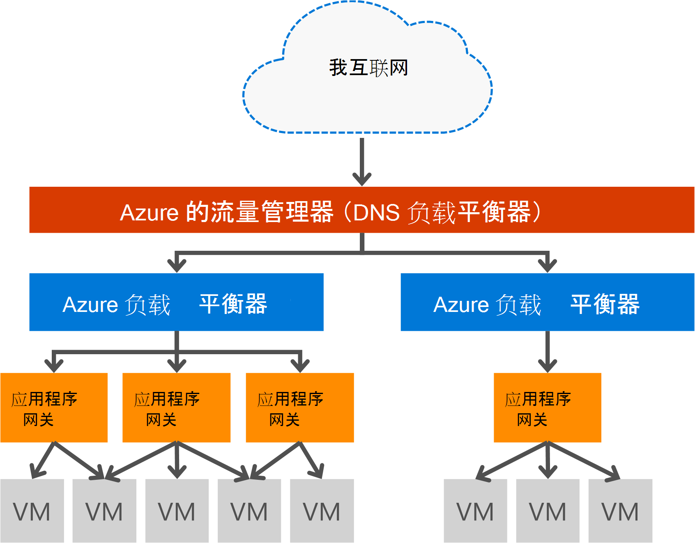

<properties
   pageTitle="应用程序网关简介 |Microsoft Azure"
   description="此页提供的第 7 层负载平衡的应用程序网关服务概述包括网关大小、 HTTP 负载平衡、 基于 cookie 的会话相似性和 SSL 卸载。"
   documentationCenter="na"
   services="application-gateway"
   authors="georgewallace"
   manager="carmonm"
   editor="tysonn"/>
<tags
   ms.service="application-gateway"
   ms.devlang="na"
   ms.topic="hero-article"
   ms.tgt_pltfrm="na"
   ms.workload="infrastructure-services"
   ms.date="10/25/2016"
   ms.author="gwallace"/>

# 应用程序网关概述

## 什么是应用程序网关

Microsoft Azure 应用程序网关提供应用程序交付控制器 (ADC) 作为一种服务，提供各种第 7 层负载平衡应用程序的功能。 它使客户能够通过卸载应用程序网关到 CPU 密集型 SSL 端接优化 web 场的生产效率。 它还提供了其他 7 层路由功能，包括循环分布传入的通信量，基于 cookie 的会话相似性、 URL 路径基于路由和承载多个网站，在单个应用程序网关后面的能力。 应用程序网关还提供保护免受大部分 OWASP 顶部 10 常见 web 漏洞的应用程序的 web 应用程序防火墙 (WAF)。 作为互联网面向网关、 内部唯一的网关或两者的组合，可以配置应用程序网关。 应用程序网关是完全 Azure 托管，可伸缩而且可用性要高。 它更好的易管理性提供了丰富的诊断和记录功能。 应用程序网关使用虚拟机、 云服务和内部或外部面向 web 应用程序工作正常。

应用程序网关是一个专用的虚拟设备，为您的应用程序，并组成多个辅助实例可伸缩性和高可用性。 当您创建应用程序网关时，终结点 （VIP 公用或内部 ILB IP） 是关联，用于入站网络通信。 在传输层 (TCP/UDP) 工作，并且让所有传入的网络通信进行负载平衡应用程序网关工作实例，通过 Azure 负载平衡器提供该 VIP 或 ILB IP。 然后，此应用程序网关路由的 HTTP/HTTPS 通信取决于其配置是否是虚拟机，云服务，内部或外部 IP 地址。 对于 SLA 和定价，请参阅的[SLA](https://azure.microsoft.com/support/legal/sla/)和[定价](https://azure.microsoft.com/pricing/details/application-gateway/)页。

## 功能

应用程序网关目前支持层 7 应用程序提供以下功能︰

- **[Web 应用程序防火墙 （预览）](application-gateway-webapplicationfirewall-overview.md)**的 web 应用程序防火墙 (WAF) 在 Azure 应用程序网关保护 web 应用程序中常见的基于 web 的攻击如 SQL 注入、 跨站点脚本攻击和会话劫持。
- **HTTP 的负载平衡**的应用程序网关提供循环法负载平衡。 负载平衡第 7 层以完成并使用 HTTP (S) 仅对通信量。
- **基于 cookie 的会话关联**-此功能很有用，当您想要保留同一个后端上的用户会话。 通过使用网关管理 cookie，应用程序网关都可以直接从用户会话到同一后端处理的后续通信。 此功能是很重要的情况下，会话状态保存本地的后端服务器的用户会话。
- **[安全套接字层 (SSL) 卸载](application-gateway-ssl-arm.md)**-此功能需要昂贵的解密您的 web 服务器关闭的 HTTPS 通信任务。 通过终止 SSL 连接在应用程序网关，并将请求转发给未加密的服务器，web 服务器被 unburdened 通过解密。  应用程序网关将响应发送回客户端之前重新加密。 此功能是非常有用的后端在 Azure 应用程序网关与相同的安全虚拟网络中的位置。
- **[端到端 SSL](application-gateway-backend-ssl.md)**的应用程序网关支持端到端加密的通信。 应用程序网关通过终止 SSL 连接在应用程序网关实现此目的。 网关的通信应用的路由规则、 重新加密数据包，然后将数据包转发到适当的后端，基于定义的路由规则。 来自 web 服务器的任何响应返回到最终用户经历相同的过程。
- **[基于 URL 的内容路由](application-gateway-url-route-overview.md)**-此功能让您能够使用不同的通信不同的后端服务器。 为 web 服务器上的文件夹或 CDN 的通信被路由到不同的后端，这减少了不必要的负担不提供特定内容的 backends。
- **[多站点路由](application-gateway-multi-site-overview.md)**的网关使您能够整合到单个应用程序网关 20 网站的应用程序。
- **[Websocket 支持](application-gateway-websocket.md)**-应用程序网关的另一大功能是 Websocket 的本机支持。
- **[运行状况监视](application-gateway-probe-overview.md)**的应用程序网关提供了默认运行状况监视的后端资源和自定义探测监视对于更具体的方案。

## 优点

应用程序网关可用于︰

- 需要从同一个用户/客户端会话的请求，以达到同一后端虚拟机的应用程序。 这些应用程序的示例就购物车应用程序和 web 邮件服务器。
- 想要自由终止 SSL 的开销从 web 服务器群的应用程序。
- 需要多个 HTTP 请求的相同的长时间运行 TCP 连接路由或负载平衡到不同的后端服务器应用程序，例如内容交付网络。
- 支持 websocket 通信应用程序
- 保护 web 应用程序中常见的基于 web 的攻击如 SQL 注入、 跨站点脚本攻击和会话劫持。

应用程序网关负载平衡 Azure 托管服务允许资源调配软件 Azure 负载平衡器后面的第 7 层负载平衡器。 通信管理器可用于完成方案，如下面的图像所示。 通信管理器提供重定向和可用性，地区可伸缩性和可用性，以提供负载平衡器和应用程序网关提供了跨区域第 7 层负载平衡。

[AZURE.INCLUDE [load-balancer-compare-tm-ag-lb-include.md](../../includes/load-balancer-compare-tm-ag-lb-include.md)]

## 网关大小和实例

应用程序网关将目前提供三种大小︰ 小、 中、 大。 小实例大小适用于开发和测试方案。

目前有两个应用程序网关的 sku: WAF 和标准。

您可以创建最多 50 应用程序网关，每个订阅，并且每个应用程序网关可以有最多 10 个实例。 每个应用程序网关可以包含 20 http 侦听器。 应用程序网关限制的完整列表，请访问[服务限制](../azure-subscription-service-limits.md#application-gateway)页面。

下表显示为每个应用程序网关实例的平均性能吞吐量︰

| 后端页面响应 | 小 | 中等深浅 | 大|
|---|---|---|---|
| 6 K | 7.5 Mbps | 13 Mbps | 50 Mbps |
|10 万美元 | 35 Mbps | 100 Mbps| 200 Mbps |

>[AZURE.NOTE] 这些值是近似应用程序网关的吞吐量值。 实际的吞吐量取决于各种环境详细信息，如平均页面大小、 位置的后端实例，并提供网页的处理时间。 确切的性能数据，您应该运行您自己的测试，这些值仅用于容量规划的指导。

## 运行状况监视

Azure 应用程序网关自动监视通过基本的后端实例的运行状况或自定义运行状况检测。 通过使用运行状况探测器，这将确保只正常主机响应通信。 有关详细信息，请参阅[应用程序网关运行状况监视概述](application-gateway-probe-overview.md)。

## 配置和管理

对于其终结点，应用程序网关可以有公用 IP 和专用 IP，当它被配置。 应用程序网关配置虚拟网络中它自己的子网内。 子网创建或使用应用程序网关不能包含任何其他类型的资源，允许子网中的唯一资源是其它应用程序网关。 来保护后端资源后端服务器可以包含在同一个虚拟网络应用程序网关在不同的子网。 此其他子网中它不需要的后端应用程序，只要应用程序网关可以到达的 ip 地址，就可以为后端服务器提供 ADC 功能应用程序网关。

您可以通过创建和管理应用程序网关使用 REST Api，PowerShell cmdlet，Azure CLI 或[Azure 的门户](https://portal.azure.com/)。

## 下一步行动

了解应用程序网关，您可以[创建一个应用程序网关](application-gateway-create-gateway-portal.md)或负载平衡 HTTPS 连接[创建 SSL 卸载应用程序网关](application-gateway-ssl-arm.md)，您可以。

若要了解如何创建使用基于 URL 的内容传送应用程序网关，请转到[创建使用基于 URL 的路由应用程序网关](application-gateway-create-url-route-arm-ps.md)的详细信息。

