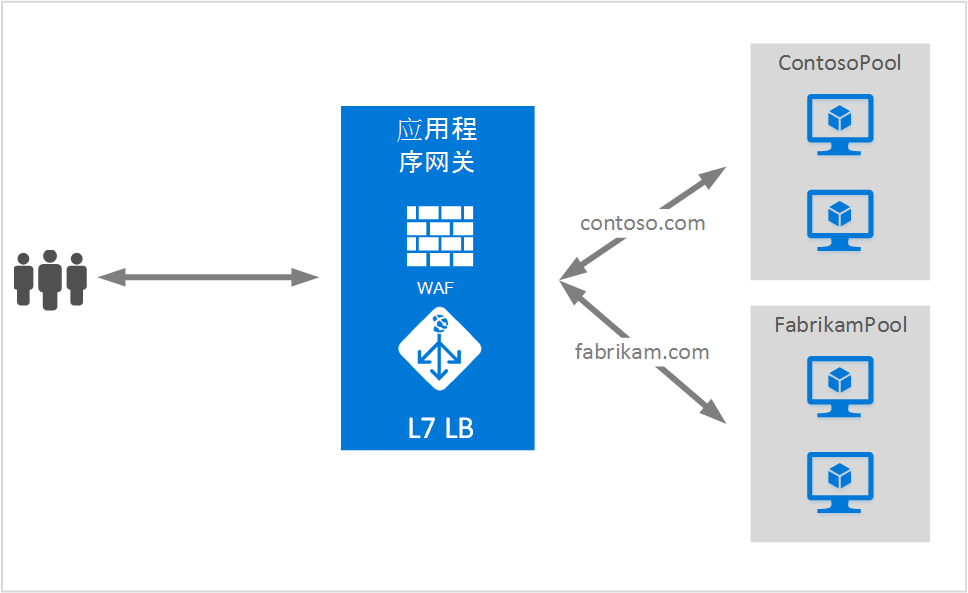

<properties
   pageTitle="装载多个站点上应用程序网关 |Microsoft Azure"
   description="此页提供的应用程序网关多站点支持的概述。"
   documentationCenter="na"
   services="application-gateway"
   authors="amsriva"
   manager="rossort"
   editor="amsriva"/>
<tags
   ms.service="application-gateway"
   ms.devlang="na"
   ms.topic="hero-article"
   ms.tgt_pltfrm="na"
   ms.workload="infrastructure-services"
   ms.date="10/25/2016"
   ms.author="amsriva"/>

# 应用程序网关承载多个网站

多站点宿主，可以在同一个应用程序网关实例上配置多个 web 应用程序。 此功能允许您通过添加到一个应用程序网关最多 20 个网站配置更有效地为您的部署拓扑。 每个网站可被引向自己的后端池。 在以下示例中，应用程序网关致力于通信 contoso.com 和 fabrikam.com 从名为 ContosoServerPool 和 FabrikamServerPool 两个后端服务器池。

对于 http://contoso.com 的请求都会被路由到 ContosoServerPool，和 http://fabrikam.com 被路由到 FabrikamServerPool。

同样两个相同的父域的子域可以驻留在同一个应用程序网关部署。 使用子域的示例可能包括 http://blog.contoso.com 和 http://app.contoso.com 驻留在单个应用程序网关部署上。

## 主机标头和服务器名称指示 (SNI)

有三种常用机制启用在同样的基础结构支持多个站点。

1. 驻留多个 web 应用程序每个唯一的 IP 地址上。
2. 使用主机名来承载相同的 IP 地址上的多个 web 应用程序。
3. 使用不同的端口上的相同的 IP 地址的多个 web 应用程序的宿主。

当前应用程序网关获取单个公用 IP 地址侦听通讯。 因此支持多个应用程序，每一个都有其自己的 IP 地址，目前不支持。 应用程序网关支持承载多个应用程序每个侦听不同的端口，但这种情况下将需要接受非标准端口上的通信应用程序，通常不是所需的配置。 应用程序网关依赖于 HTTP 1.1 主机标头来承载多个网站上的同一个公用 IP 地址和端口。 站点位于应用程序网关还可以支持 SSL 卸载服务器指示 (SNI) TLS 扩展名。 这种情况下意味着客户端浏览器和后端 web 服务器场必须支持 HTTP/1.1 和 TLS 扩展，在 RFC 6066 中定义。

## 侦听器配置元素

现有 HTTPListener 配置元素增强支持主机名称和服务器名称指示元素，后者由应用程序网关通信路由到适当的后端池。 下面的代码示例是模板文件中的 HttpListeners 元素的代码段。

    "httpListeners": [
                {
                    "name": "appGatewayHttpsListener1",
                    "properties": {
                        "FrontendIPConfiguration": {
                            "Id": "/subscriptions/<subid>/resourceGroups/<rgName>/providers/Microsoft.Network/applicationGateways/applicationGateway1/frontendIPConfigurations/DefaultFrontendPublicIP"
                        },
                        "FrontendPort": {
                            "Id": "/subscriptions/<subid>/resourceGroups/<rgName>/providers/Microsoft.Network/applicationGateways/applicationGateway1/frontendPorts/appGatewayFrontendPort443'"
                        },
                        "Protocol": "Https",
                        "SslCertificate": {
                            "Id": "/subscriptions/<subid>/resourceGroups/<rgName>/providers/Microsoft.Network/applicationGateways/applicationGateway1/sslCertificates/appGatewaySslCert1'"
                        },
                        "HostName": "contoso.com",
                        "RequireServerNameIndication": "true"
                    }
                },
                {
                    "name": "appGatewayHttpListener2",
                    "properties": {
                        "FrontendIPConfiguration": {
                            "Id": "/subscriptions/<subid>/resourceGroups/<rgName>/providers/Microsoft.Network/applicationGateways/applicationGateway1/frontendIPConfigurations/appGatewayFrontendIP'"
                        },
                        "FrontendPort": {
                            "Id": "/subscriptions/<subid>/resourceGroups/<rgName>/providers/Microsoft.Network/applicationGateways/applicationGateway1/frontendPorts/appGatewayFrontendPort80'"
                        },
                        "Protocol": "Http",
                        "HostName": "fabrikam.com",
                        "RequireServerNameIndication": "false"
                    }
                }
            ],

您可以访问[使用多个站点宿主的资源管理器模板](https://github.com/Azure/azure-quickstart-templates/blob/master/201-application-gateway-multihosting)为基于模板的端到端部署。

## 路由规则

不没有路由规则中所需的任何更改。 路由规则初级，应该要选择绑定到相应的后端地址池的相应站点侦听器。

    "requestRoutingRules": [
    {
        "name": "<ruleName1>",
        "properties": {
            "RuleType": "Basic",
            "httpListener": {
                "id": "/subscriptions/<subid>/resourceGroups/<rgName>/providers/Microsoft.Network/applicationGateways/applicationGateway1/httpListeners/appGatewayHttpsListener1')]"
            },
            "backendAddressPool": {
                "id": "/subscriptions/<subid>/resourceGroups/<rgName>/providers/Microsoft.Network/applicationGateways/applicationGateway1/backendAddressPools/ContosoServerPool')]"
            },
            "backendHttpSettings": {
                "id": "/subscriptions/<subid>/resourceGroups/<rgName>/providers/Microsoft.Network/applicationGateways/applicationGateway1/backendHttpSettingsCollection/appGatewayBackendHttpSettings')]"
            }
        }

    },
    {
        "name": "<ruleName2>",
        "properties": {
            "RuleType": "Basic",
            "httpListener": {
                "id": "/subscriptions/<subid>/resourceGroups/<rgName>/providers/Microsoft.Network/applicationGateways/applicationGateway1/httpListeners/appGatewayHttpListener2')]"
            },
            "backendAddressPool": {
                "id": "/subscriptions/<subid>/resourceGroups/<rgName>/providers/Microsoft.Network/applicationGateways/applicationGateway1/backendAddressPools/FabrikamServerPool')]"
            },
            "backendHttpSettings": {
                "id": "/subscriptions/<subid>/resourceGroups/<rgName>/providers/Microsoft.Network/applicationGateways/applicationGateway1/backendHttpSettingsCollection/appGatewayBackendHttpSettings')]"
            }
        }

    }
    ]

## 下一步行动

之后学习承载多个网站，请转到[创建使用多个站点宿主应用程序网关](application-gateway-create-multisite-azureresourcemanager-powershell.md)功能，支持多个 web 应用程序创建应用程序网关。
