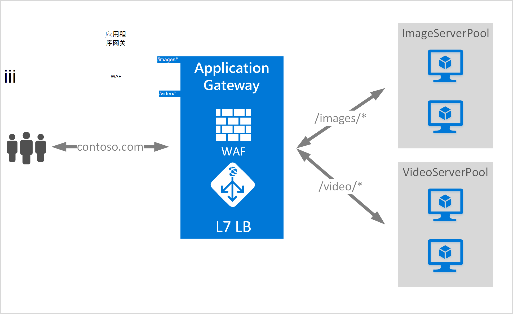

<properties
   pageTitle="基于 URL 的内容路由概述 |Microsoft Azure"
   description="本页提供基于应用程序网关 URL 的内容路由、 UrlPathMap 配置和 PathBasedRouting 规则的概述。"
   documentationCenter="na"
   services="application-gateway"
   authors="georgewallace"
   manager="carmonm"
   editor="tysonn"/>
<tags
   ms.service="application-gateway"
   ms.devlang="na"
   ms.topic="hero-article"
   ms.tgt_pltfrm="na"
   ms.workload="infrastructure-services"
   ms.date="10/25/2016"
   ms.author="gwallace"/>

# URL 路径基于路由概述

URL 路径基于路由允许通信路由到后端服务器池基于请求的 URL 路径。 方案之一是将请求路由到不同的后端服务器池的不同内容类型。
在以下示例中，应用程序网关服务 contoso.com 从三个后端服务器池的通信，例如︰ VideoServerPool、 ImageServerPool 和 DefaultServerPool。

对 http://contoso.com/video*到 VideoServerPool 和 http://contoso.com/images 路由*请求将被路由到 ImageServerPool。 如果没有一个路径模式匹配，则选择 DefaultServerPool。

## UrlPathMap 配置元素

UrlPathMap 元素用于指定到后端服务器池映射路径模式。 下面的代码示例是模板文件中的 urlPathMap 元素的代码段。

    "urlPathMaps": [
    {
    "name": "<urlPathMapName>",
    "id": "/subscriptions/<subscriptionId>/../microsoft.network/applicationGateways/<gatewayName>/ urlPathMaps/<urlPathMapName>",
    "properties": {
        "defaultBackendAddressPool": {
            "id": "/subscriptions/<subscriptionId>/../microsoft.network/applicationGateways/<gatewayName>/backendAddressPools/<poolName>"
        },
        "defaultBackendHttpSettings": {
            "id": "/subscriptions/<subscriptionId>/../microsoft.network/applicationGateways/<gatewayName>/backendHttpSettingsList/<settingsName>"
        },
        "pathRules": [
            {
                "paths": [
                    <pathPattern>
                ],
                "backendAddressPool": {
                    "id": "/subscriptions/<subscriptionId>/../microsoft.network/applicationGateways/<gatewayName>/backendAddressPools/<poolName2>"
                },
                "backendHttpsettings": {
                    "id": "/subscriptions/<subscriptionId>/../microsoft.network/applicationGateways/<gatewayName>/backendHttpsettingsList/<settingsName2>"
                },

            },

        ],

    }
    }
    

>[AZURE.NOTE] PathPattern︰ 此设置是路径模式相匹配的列表。 必须从每个开始 / 的唯一的地方和"*"允许在结束以下"/"。 之后第一个，送入路径 matcher 字符串不包含任何文本？或 #、 和这些字符此处不允许使用。 

您可以签出[资源管理器使用基于 URL 的路由的模板](https://azure.microsoft.com/documentation/templates/201-application-gateway-url-path-based-routing)的详细信息。

## PathBasedRouting 规则

RequestRoutingRule PathBasedRouting 类型的用于绑定到 urlPathMap 的侦听器。 为此侦听器接收所有请求都会被都路由基于在 urlPathMap 中指定的策略。
PathBasedRouting 规则的代码段︰

    "requestRoutingRules": [
    {

    "name": "<ruleName>",
    "id": "/subscriptions/<subscriptionId>/../microsoft.network/applicationGateways/<gatewayName>/requestRoutingRules/<ruleName>",
    "properties": {
        "ruleType": "PathBasedRouting",
        "httpListener": {
            "id": "/subscriptions/<subscriptionId>/../microsoft.network/applicationGateways/<gatewayName>/httpListeners/<listenerName>"
        },
        "urlPathMap": {
            "id": "/subscriptions/<subscriptionId>/../microsoft.network/applicationGateways/<gatewayName>/ urlPathMaps/<urlPathMapName>"
        },

    }
    
## 下一步行动

之后学习基于 URL 的内容路由，请转到[创建的应用程序网关使用基于 URL 的路由](application-gateway-create-url-route-portal.md)创建 URL 路由规则的应用程序网关。
