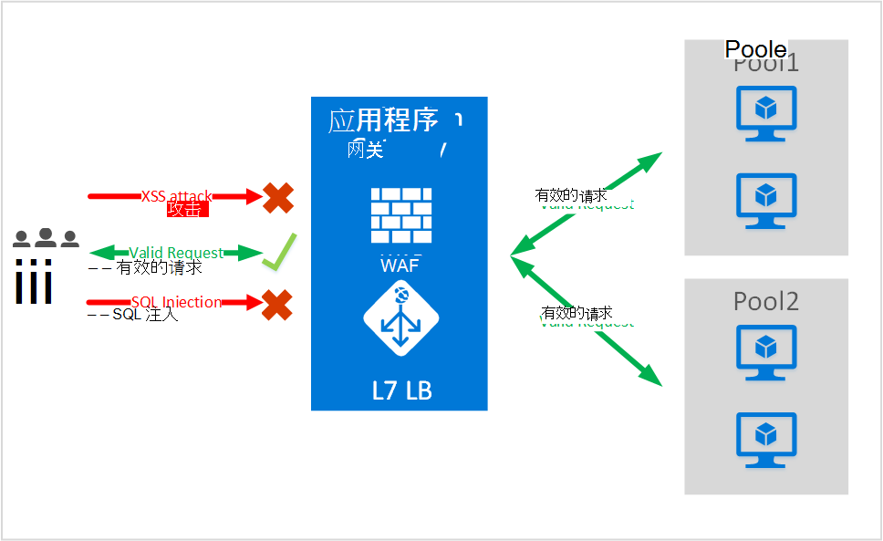
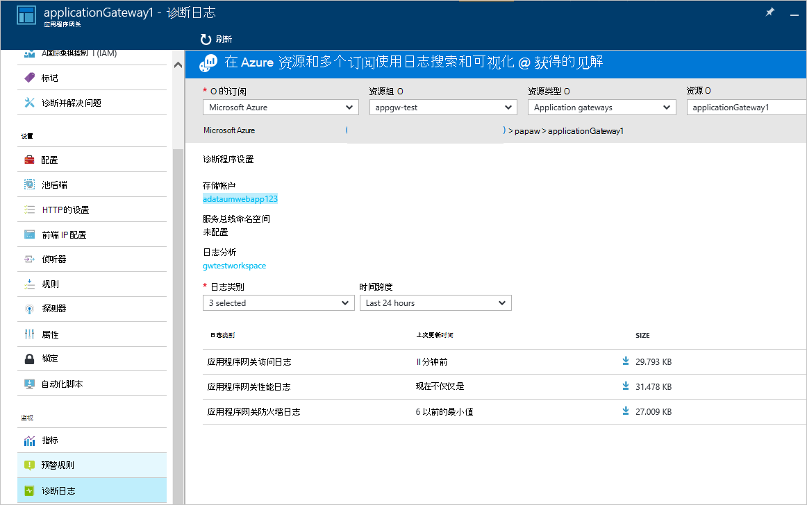

<properties
   pageTitle="应用程序网关的 Web 应用程序防火墙 (WAF) 简介 |Microsoft Azure"
   description="此页概要的 Web 应用程序防火墙 (WAF) 应用程序网关 "
   documentationCenter="na"
   services="application-gateway"
   authors="amsriva"
   manager="rossort"
   editor="amsriva"/>
<tags
   ms.service="application-gateway"
   ms.devlang="na"
   ms.topic="hero-article"
   ms.tgt_pltfrm="na"
   ms.workload="infrastructure-services"
   ms.date="10/25/2016"
   ms.author="amsriva"/>

# 应用程序网关 Web 应用程序防火墙 （预览）

Web 应用程序防火墙 (WAF) 是 azure 应用程序网关，提供保护与利用的标准应用程序传递控制 (ADC) 功能的应用程序网关的 web 应用程序的功能。 Web 应用程序防火墙保护它们免受大部分 OWASP 顶部 10 常见 web 漏洞执行此操作。 Web 应用程序越来越多地是利用常见的已知的漏洞的恶意攻击的目标。 一般这些攻击都是 SQL 注入式攻击、 跨站点脚本攻击，仅举几例。 如何防止此类攻击应用程序代码中的颇具挑战性，并且可能需要严格维护、 修补和监视应用程序拓扑结构的多个图层。 集中式的 web 应用程序防火墙来保护 web 攻击使安全管理变得更加简单并举为抵御入侵的威胁该应用程序的更好保证。 WAF 解决方案还可以修补一个已知的漏洞在中心位置而不是保护每个单独的 web 应用程序安全威胁更快反应。 现有应用程序网关可以很容易地转换为 web 应用程序防火墙应用程序网关。

应用程序网关作为应用程序交付控制器操作，并提供 SSL 端接、 基于 cookie 的会话相似性、 循环负载分发内容基于路由，能够承载多个网站和安全增强功能。 由应用程序网关提供增强的安全功能包括 SSL 策略管理、 端到端 SSL 支持。 我们通过引入 WAF （web 应用程序防火墙） 直接集成到 ADC 提供增强服务的应用程序的安全功能。 这提供了易于配置集中位置用来管理和保护 web 应用程序针对常见的 web 安全漏洞。

在应用程序网关配置 WAF 为您提供了以下好处︰

- 保护您的 web 应用程序从 web 漏洞和攻击无需到后端代码的修改。
- 在使用应用程序网关后面的同时保护多个 web 应用程序。 应用程序网关支持承载背后可能全部受到保护，防止 web 攻击一个网关最多 20 个网站。
- 监视 web 应用程序免受攻击类型，使用由应用程序网关 WAF 日志生成的实时报告。
- 某些法规遵从性控制要求所有 internet 朝终点 WAF 解决方案加以保护。 与 WAF 启用使用应用程序网关，可以满足这些法规遵从性要求。

## 概述

应用程序网关 WAF 将提供一种新的 SKU (WAF SKU) 和预配置了 ModSecurity 并 OWASP 核心规则集提供基线防范大部分 OWASP 顶部 10 常见 web 漏洞。

- SQL 注入式保护
- 跨站点脚本编写保护
- 公共 Web 攻击的保护如命令注入、 smuggling，拆分，HTTP 响应的 HTTP 请求和远程文件包含攻击
- 针对 HTTP 协议违反保护
- 针对 HTTP 协议异常，如缺少防护承载用户代理并接受邮件头
- HTTP DoS 保护包括 HTTP 泛滥和慢 HTTP DoS 防护
- 针对机器人、 爬网程序和扫描仪的预防
- 检测到的常见应用程序的配置错误 （如 Apache、 IIS 等）

## WAF 模式

应用程序网关 WAF 可以将配置为在以下两种模式下运行︰

- **检测模式**– 配置在检测模式下，应用程序网关 WAF 运行时监视和登录到日志文件的所有威胁警报。 您需要确保打开诊断日志记录应用程序网关，使用诊断程序部分。 您还需要确保 WAF 日志已选定并已打开。
- **保护模式**-当配置为运行在保护模式下，应用程序网关主动阻止入侵和攻击检测到它的规则。 攻击者接收 403 未经授权的访问异常，并将终止连接。 保护模式继续 WAF 日志中记录此类攻击。

## 应用程序网关 WAF 报告

应用程序网关 WAF 提供详细报告每个检测到的威胁。 集成在 Azure 诊断日志记录和警报记录以 json 格式。

    {
        "resourceId": "/SUBSCRIPTIONS/<subscriptionId>/RESOURCEGROUPS/<resourceGroupName>/PROVIDERS/MICROSOFT.NETWORK/APPLICATIONGATEWAYS/<applicationGatewayName>",
        "operationName": "ApplicationGatewayFirewall",
        "time": "2016-09-20T00:40:04.9138513Z",
        "category": "ApplicationGatewayFirewallLog",
        "properties":     {
            "instanceId":"ApplicationGatewayRole_IN_0",
            "clientIp":"108.41.16.164",
            "clientPort":1815,
            "requestUri":"/wavsep/active/RXSS-Detection-Evaluation-POST/",
            "ruleId":"OWASP_973336",
            "message":"XSS Filter - Category 1: Script Tag Vector",
            "action":"Logged",
            "site":"Global",
            "message":"XSS Filter - Category 1: Script Tag Vector",
            "details":{"message":" Warning. Pattern match "(?i)(<script","file":"/owasp_crs/base_rules/modsecurity_crs_41_xss_attacks.conf","line":"14"}}
    }

## 应用程序网关 WAF SKU 定价

在预览时，没有额外的费用，对于应用程序网关 WAF 用法。 继续按现有基本 SKU 费用支付薪酬。 在正式上市时，我们会将 WAF SKU 费用。 计入定价仅在正式发布后的 WAF SKU 开始部署应用程序网关 WAF SKU 中已选择的客户。

## 下一步行动

之后学习有关的 WAF 功能的详细信息，请访问[如何配置 Web 应用程序防火墙应用程序网关](application-gateway-web-application-firewall-portal.md)。
