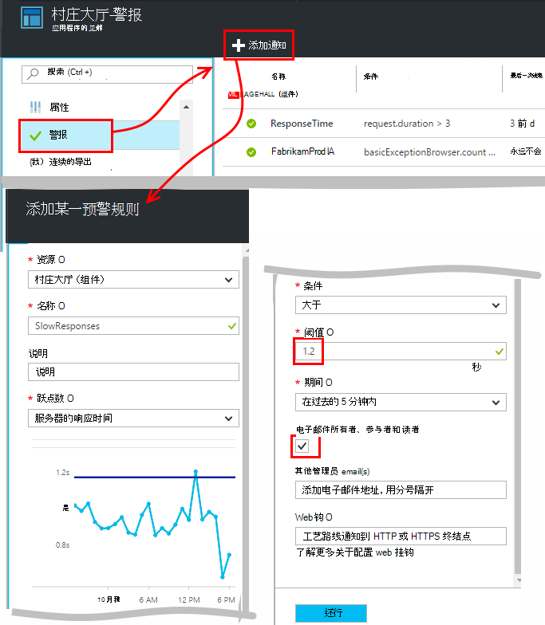
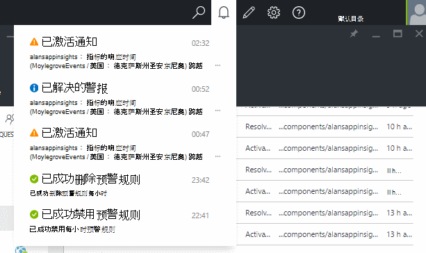
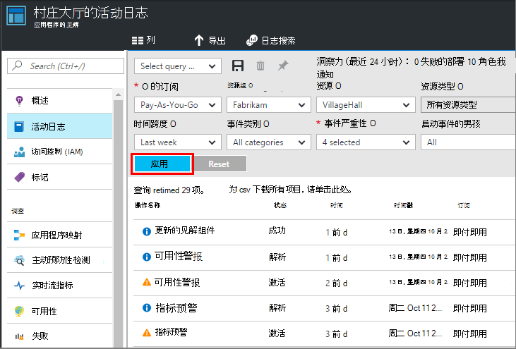

<properties 
    pageTitle="在应用程序的见解中设置警报 |Microsoft Azure" 
    description="获取有关响应较慢问题，例外情况之外，其他性能或使用 web 应用程序中的更改通知。" 
    services="application-insights" 
    documentationCenter=""
    authors="alancameronwills" 
    manager="douge"/>

<tags 
    ms.service="application-insights" 
    ms.workload="tbd" 
    ms.tgt_pltfrm="ibiza" 
    ms.devlang="na" 
    ms.topic="article" 
    ms.date="10/14/2016" 
    ms.author="awills"/>
 
# 在应用程序的见解中设置警报

[Visual Studio 应用程序理解][start]可以提醒您在您的 web 应用程序的性能和使用情况指标的变化。 

应用程序的见解监视实时应用程序在[多种平台]上的[platforms]可帮助您诊断性能问题，并了解使用模式。

有三种类型的警报︰

* **公制的警报**会告诉您当任何指标跨越段-例如响应时间、 异常计数、 CPU 使用率或页面视图阈值。 
* [**Web 测试**][availability]告诉您时您的站点是在 internet 上，不可用或响应很慢。 [了解更多][availability]。
* [**主动预防性诊断**](app-insights-proactive-diagnostics.md)自动配置通知您有关不寻常的性能模式。

我们专注于公制警报在这篇文章。

## 设置指标警报

打开警报规则刀片式服务器，然后再使用添加按钮。 

* 设置其他属性之前的资源。 **选择"（组件）"资源**如果想要性能和使用情况指标设置警报。
* 赋予该警报的名称必须是唯一的资源组 （不只是应用程序） 中。
* 请注意，您需要输入的临界值的单位。
* 如果选中复选框"...电子邮件所有者"，将有权访问此资源组的每个人都通过电子邮件发送警报。 若要展开这一组人，将它们添加到[资源组或订阅](app-insights-resources-roles-access-control.md)（而不是资源）。
* 如果您指定"其他电子邮件"，通知将发送给这些个人或组 （无论选中"电子邮件所有者..."框）。 
* 如果您已经设置了一个 web 应用程序响应警报，设置[webhook 地址](../monitoring-and-diagnostics/insights-webhooks-alerts.md)。 当报警被激活 （即触发） 和时候调用它。 （但请注意，目前，查询参数不为 webhook 属性传递到。）
* 您可以禁用或启用报警︰ 刀片式服务器顶部的按钮，请参阅。

*我看不到添加通知按钮。* 

- 您使用的是组织的帐户吗？ 如果您具有所有者或参与者对此应用程序资源的访问，您可以设置警报。 看看访问控制刀片。 [了解有关访问控制][roles]。

> [AZURE.NOTE] 在警报刀片式服务器，您将看到尚警报设置︰[预防性诊断](app-insights-proactive-failure-diagnostics.md)。 这是监视一个特定度量、 请求失败率自动警报。 除非您决定禁用主动预防性警报，您不必设置您自己的通知请求失败率。 

## 请参阅您的通知

您收到一封电子邮件时通知更改状态处于非活动状态和活动之间。 

预警规则刀片式服务器显示了每个警报的当前状态。

还有在通知的最新活动的摘要下拉列表︰

历史记录状态更改是在活动日志中︰

## 通知的工作方式

* 警报有三种状态:"永远不会激活"、"已启用"，并"已解决"。 上一次评估时为 true，则激活的方式所指定的条件。

* 状态更改通知时生成通知。 （如果创建警报时，警报条件已经满足，您可能无法获得通知直到条件转 false。）

* 每个通知生成一封电子邮件，如果您选中电子邮件框中，或者提供的电子邮件地址。 您还可以查看通知下拉列表。

* 警报被计算每次到达一个指标，但不是以其他方式。

* 计算上述段聚合度量，然后将它与阈值来确定新的状态进行比较。

* 您选择在其指定的时间间隔期间聚合的度量标准。 但并不影响频率计算警报︰ 这取决于到达时的度量标准的频率。

* 如果没有数据到达特定指标的一些时间，差距就会有不同的效果，预警评估和度量资源管理器中的图表上。 在公制资源管理器中，如果没有数据出现超过图表的采样间隔，图表显示的值为 0。 但基于同一度量警报不会重新评估，并警觉的状态将保持不变。 

    当数据最终到达时，图表将跳回一个非零值。 警报的计算结果可用于您所指定的时间段的数据。 如果新的数据点是唯一可用的一段时期内，聚合将数据点只依据。

* 警报可以闪烁频率警报和健康状态之间即使设置长时间。 如果跃点数上围绕阈值，可发生此错误。 阈值没有无滞后︰ 过渡到警报发生在过渡到正常运行值相同。

## 好的警报设置有哪些？

这取决于您的应用程序。 启动时，则最好不要设置太多的度量标准。 花些时间来观察指标图表，在您的应用程序运行时，它如何可以正常工作的体会。 这有助于您找到的方法来提高其性能。 然后设置警报通知您当指标超出正常的区域。 

常见的警报包括︰

* [浏览器标准][client]，特别是浏览器的**页面加载时间**，非常适用于 web 应用程序。 如果您的页面具有大量脚本，您需要**浏览器异常**关注。 为了获得这些指标和警报，您必须设置[web 页监视][client]。
* 服务器端的 web 应用程序**服务器的响应时间**。 设置警报，以及留意该度量看到是否它因不按比例高的请求速率︰ 指示您的应用程序已不足的资源。 
* **服务器异常**-查看它们，您需要做一些[额外的设置](app-insights-asp-net-exceptions.md)。

不要忘记，[主动预防性故障率诊断](app-insights-proactive-failure-diagnostics.md)自动监控您的应用程序响应具有故障代码请求的速率。 

## 自动化

* [使用 PowerShell 自动设置警报](app-insights-powershell-alerts.md)
* [使用 webhooks 自动响应警报](../monitoring-and-diagnostics/insights-webhooks-alerts.md)

## 请参见

* [可用性 web 测试](app-insights-monitor-web-app-availability.md)
* [自动设置警报](app-insights-powershell-alerts.md)
* [主动预防性诊断程序](app-insights-proactive-diagnostics.md) 

<!--Link references-->

[availability]: app-insights-monitor-web-app-availability.md
[client]: app-insights-javascript.md
[platforms]: app-insights-platforms.md
[roles]: app-insights-resources-roles-access-control.md
[start]: app-insights-overview.md

 