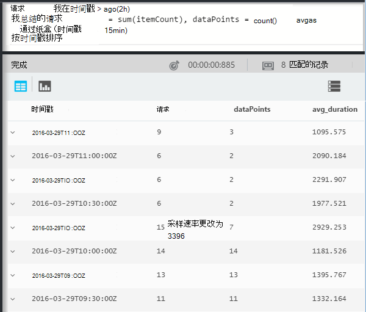
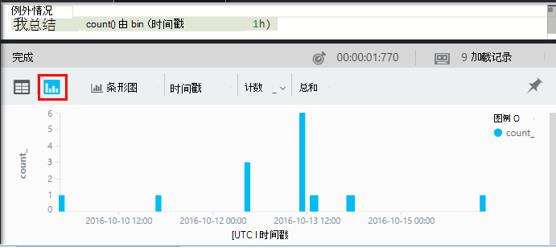

<properties 
    pageTitle="通过分析漫游中应用程序的见解 |Microsoft Azure" 
    description="短的分析，理解应用程序的功能强大的搜索工具中的所有主查询的示例。" 
    services="application-insights" 
    documentationCenter=""
    authors="alancameronwills" 
    manager="douge"/>

<tags 
    ms.service="application-insights" 
    ms.workload="tbd" 
    ms.tgt_pltfrm="ibiza" 
    ms.devlang="na" 
    ms.topic="article" 
    ms.date="10/15/2016" 
    ms.author="awills"/>


 
# <a name="a-tour-of-analytics-in-application-insights"></a>漫游中应用程序建议的分析


[分析](app-insights-analytics.md)是一种功能强大的搜索功能的[应用程序的见解](app-insights-overview.md)。 这些页面描述分析查询 lanquage。


* **[观看介绍性视频](https://applicationanalytics-media.azureedge.net/home_page_video.mp4)**。
* **[测试驱动器在模拟数据的分析](https://analytics.applicationinsights.io/demo)**如果您的应用程序不会将数据发送到应用程序的见解尚。


让我们通过一些基本的查询来帮助您入门的审核。

## <a name="connect-to-your-application-insights-data"></a>连接到您的应用程序理解数据

从您的应用程序[概述刀片式服务器](app-insights-dashboards.md)应用程序的见解中打开分析︰


    
## <a name="takeapp-insights-analytics-referencemdtake-operator-show-me-n-rows"></a>[花](app-insights-analytics-reference.md#take-operator)︰ 显示 n 行

记录用户操作 （通常通过 web 应用程序接收到的 HTTP 请求） 的数据点都存储在一个称为表`requests`。 每一行都是从应用程序的见解 SDK 应用程序中接收到的遥测数据点。

让我们首先看表的几个示例行︰


> [AZURE.NOTE] 将光标放在某处语句中之前单击转到。 您可以拆分为多条线路，一条语句，但不要在语句中放置空行。 空行是方便地保留几个单独的查询窗口中。


选择列、 拖曳，分组依据列和筛选器︰ 


展开以查看详细信息的任何项︰
 


> [AZURE.NOTE] 单击要重新可用 web 浏览器中对结果进行排序的列的标题。 但请注意，对于大结果集，下载到浏览器的行数是有限。 排序通过这种方式并不始终会显示您的实际最高或最低的项目。 若要可靠地对项目进行排序，请使用`top`或`sort`运算符。 

## <a name="topapp-insights-analytics-referencemdtop-operator-and-sortapp-insights-analytics-referencemdsort-operator"></a>[顶部](app-insights-analytics-reference.md#top-operator)和[排序](app-insights-analytics-reference.md#sort-operator)

`take`可用于获取快速样本的结果，但它没有特定的顺序显示表中的行。 若要获取一个已排序的视图，请使用`top`（有关示例） 或`sort`（通过对整个表）。

显示前 n 行，按特定列进行排序︰

```AIQL

    requests | top 10 by timestamp desc 
```

* *的语法︰*大多数运算符具有关键字参数如`by`。
* `desc`降序排序，= `asc` = 升序。


`top...`是说的多个性能方法`sort ... | take...`。 我们会写︰

```AIQL

    requests | sort by timestamp desc | take 10
```

结果将是相同的但它将运行更缓慢。 (您也可以编写`order`，这是的别名`sort`。)

在表视图中的列标题也用于在屏幕上的结果进行排序。 但当然，如果您使用过`take`或`top`检索只是一部分的表中，您将只重新排序已检索到的记录。


## <a name="projectapp-insights-analytics-referencemdproject-operator-select-rename-and-compute-columns"></a>[项目](app-insights-analytics-reference.md#project-operator)︰ 选择、 重命名和计算列

使用[`project`](app-insights-analytics-reference.md#project-operator)挑选出所需的列︰

```AIQL

    requests | top 10 by timestamp desc
             | project timestamp, name, resultCode
```


此外可以重命名列，然后定义新的︰

```AIQL

    requests 
  	| top 10 by timestamp desc 
  	| project  
            name, 
            response = resultCode,
            timestamp, 
            ['time of day'] = floor(timestamp % 1d, 1s)
```


* [列的名称](app-insights-analytics-reference.md#names)可以包含空格或符号如果它们括起来像这样︰`['...']`或`["..."]`
* `%`是常用的取模运算符。 
* `1d`(这就是一个数字，则有) 原义 timespan 意味着一天。 这里是一些更多的时间跨度文本︰ `12h`， `30m`， `10s`， `0.01s`。
* `floor`(别名`bin`) 将舍入到最接近的所提供的基本值倍数的值。 因此`floor(aTime, 1s)`将舍入到最接近的第二次。

[表达式](app-insights-analytics-reference.md#scalars)可以包含所有常用的运算符 (`+`， `-`，...)，并且有各种有用的功能。

    

## <a name="extendapp-insights-analytics-referencemdextend-operator-compute-columns"></a>[扩展](app-insights-analytics-reference.md#extend-operator)︰ 计算列

如果您只是想要将列添加到现有的使用[`extend`](app-insights-analytics-reference.md#extend-operator):

```AIQL

    requests 
  	| top 10 by timestamp desc
  	| extend timeOfDay = floor(timestamp % 1d, 1s)
```

使用[`extend`](app-insights-analytics-reference.md#extend-operator)是比不那么繁琐[`project`](app-insights-analytics-reference.md#project-operator)如果您希望保留现有的所有列。


## <a name="summarizeapp-insights-analytics-referencemdsummarize-operator-aggregate-groups-of-rows"></a>[汇总](app-insights-analytics-reference.md#summarize-operator)︰ 聚合组的行

`Summarize`在行组上应用指定的*聚合函数*。 

例如，将您的 web 应用程序响应请求所花的时间报告字段中`duration`。 让我们看的到的所有请求的平均响应时间︰


或者，我们可以将结果分成不同名称的请求︰


`Summarize`将流中的数据点收集到组，为其`by`子句的计算结果相同。 每个值在`by`的在上面的示例中每个操作名称的表达式的结果结果表中的行。 

或者，我们可以用一天时间进行分组结果︰


请注意我们如何使用`bin`函数 (亦即`floor`)。 如果我们只需使用`by timestamp`，输入的每一行最后导致自己小的组。 对于任何像时间的连续标量或数字，我们必须要连续范围分成可管理大量的离散值，和`bin`-这是其实只是熟悉的舍入下`floor`正常-是最简单的方法来做到这一点。

我们可以使用相同的技术来缩小范围的字符串︰


请注意，您可以使用`name=`设置聚合表达式或 by 子句中的结果列的名称。

## <a name="counting-sampled-data"></a>计数抽样数据

`sum(itemCount)`是推荐的聚合进行计数的事件。 在许多情况下，itemCount = = 1，，因此该函数只需计算组中的行数。 只有一小部分的原始事件[采样](app-insights-sampling.md)操作时，将为数据点在应用程序的见解，以便为每个数据点，您将看到，有一些保留，但是`itemCount`事件。 

例如，如果采样将丢弃原始事件，然后 itemCount 75%= = 4 中保留的记录中-即，对于每个保留的记录，没有四个原始记录。 

自适应采样导致 itemcount 下面要当您的应用程序频繁使用期间会更高。

累加 itemCount 因此给出的原始事件数很好地评估。




另外，还有`count()`聚合 （和计数操作） 的情况下，确实想要的组中的行进行计数。


没有[聚合函数](app-insights-analytics-reference.md#aggregations)的范围。


## <a name="charting-the-results"></a>绘制图表结果


```AIQL

    exceptions 
       | summarize count()  
         by bin(timestamp, 1d)
```

默认情况下，表中显示结果︰


我们可以做的更好的表视图比。 看一下在图表视图中的结果与垂直条形图选项︰



请注意，虽然我们不能按时间排序结果，（正如您可以看到显示表中），图表显示始终以正确的顺序显示 datetimes。


## <a name="whereapp-insights-analytics-referencemdwhere-operator-filtering-on-a-condition"></a>[其中](app-insights-analytics-reference.md#where-operator)︰ 筛选条件

如果您设置了您的应用程序在[客户端](app-insights-javascript.md)和服务器边监视应用程序的见解，有些数据库中遥测来自浏览器。

看一下报告从浏览器只是例外情况︰

```AIQL

    exceptions 
  	| where client_Type == "Browser" 
  	|  summarize count() 
       by client_Browser, outerMessage 
```


`where`运算符采用布尔表达式。 下面是关于他们的一些要点︰

 * `and``or`︰ 布尔运算符
 * `==``<>` ︰ 等于和不等于
 * `=~``!=` ︰ 等于和不等于不区分大小写的字符串。 有很多更多的字符串比较运算符。

阅读所有关于[标量表达式](app-insights-analytics-reference.md#scalars)。

### <a name="filtering-events"></a>筛选事件

查找失败的请求︰

```AIQL

    requests 
  	| where isnotempty(resultCode) and toint(resultCode) >= 400
```

`responseCode`具有字符串类型，因此我们必须[将其强制转换](app-insights-analytics-reference.md#casts)数值的比较。

总结了不同的响应︰

```AIQL

    requests
  	| where isnotempty(resultCode) and toint(resultCode) >= 400
  	| summarize count() 
      by resultCode
```

## <a name="timecharts"></a>Timecharts

显示每一天有多少事件︰

```AIQL

    requests
      | summarize event_count=count()
        by bin(timestamp, 1d)
```

选择图表显示选项︰


## <a name="multiple-series"></a>多个系列 

在中的多个表达式`summarize`创建多个列。

在中的多个表达式`by`子句创建多行，另一个用于每个值的组合。


```AIQL

    requests
  	| summarize count(), avg(duration) 
      by bin(timestamp, 1d), client_StateOrProvince, client_City 
  	| order by timestamp asc, client_StateOrProvince, client_City
```


### <a name="segment-a-chart-by-dimensions"></a>按维度划分图表

如果图表包含字符串和数值列的表，可以使用字符串拆分成单独序列的点的数值数据。 如果有多个字符串列，您可以选择要用作鉴别器的列。 


### <a name="display-multiple-metrics"></a>显示多个度量标准

如果图表一个表的多个数字列，除了时间戳，您可以显示它们的任意组合。


同时显示多个数字列，可以选择多个数字列，则无法拆分字符串列之前，您必须选择不拆分。 


## <a name="daily-average-cycle"></a>每日的平均周期

如何 does 使用量随平均一天？

计数的请求按模一天，时间 binned 成小时︰

```AIQL

    requests
  	| extend hour = floor(timestamp % 1d , 1h) 
          + datetime("2016-01-01")
  	| summarize event_count=count() by hour
```


>[AZURE.NOTE] 请注意我们已经将持续时间为 datetimes 转换以便在显示图表。


## <a name="compare-multiple-daily-series"></a>比较多个每日系列

如何 does 使用量随一天的时间在不同的国家/地区？

```AIQL

 requests  | where tostring(operation_SyntheticSource)
     | extend hour= floor( timestamp % 1d , 1h)
           + datetime("2001-01-01")
     | summarize event_count=count() 
       by hour, client_CountryOrRegion 
     | render timechart
```


## <a name="plot-a-distribution"></a>绘制一个分布

多少个会话有不同长度的？

```AIQL

    requests 
  	| where isnotnull(session_Id) and isnotempty(session_Id) 
  	| summarize min(timestamp), max(timestamp) 
      by session_Id 
  	| extend sessionDuration = max_timestamp - min_timestamp 
  	| where sessionDuration > 1s and sessionDuration < 3m 
  	| summarize count() by floor(sessionDuration, 3s) 
  	| project d = sessionDuration + datetime("2016-01-01"), count_
```

最后一行需要转换为日期时间。 当前图表的 x 轴被显示为标量日期时间才。

`where`子句排除一次性会话 (sessionDuration = = 0)，并设置 x 轴的长度。


## <a name="percentilesapp-insights-analytics-referencemdpercentiles"></a>[百分点](app-insights-analytics-reference.md#percentiles)

持续时间的什么范围涵盖不同的会话的百分比？

使用上述查询，但最后一行替换︰

```AIQL

    requests 
  	| where isnotnull(session_Id) and isnotempty(session_Id) 
  	| summarize min(timestamp), max(timestamp) 
      by session_Id 
  	| extend sesh = max_timestamp - min_timestamp 
  	| where sesh > 1s
  	| summarize count() by floor(sesh, 3s) 
  	| summarize percentiles(sesh, 5, 20, 50, 80, 95)
```

我们删除 where 的上限子句，以便获得正确的数据包括所有会话的多个请求︰


从中我们可以看到的︰

* 5%的会话有一个持续时间为不超过 3 分钟 34s; 
* 50%的会话持续少于 36 minnutes;
* 5%的会话持续时间超过 7 天

要进行单独分析，对每个国家，我们只是必须让分别通过 client_CountryOrRegion 列汇总运算符︰

```AIQL

    requests 
  	| where isnotnull(session_Id) and isnotempty(session_Id) 
  	| summarize min(timestamp), max(timestamp) 
      by session_Id, client_CountryOrRegion
  	| extend sesh = max_timestamp - min_timestamp 
  	| where sesh > 1s
  	| summarize count() by floor(sesh, 3s), client_CountryOrRegion
  	| summarize percentiles(sesh, 5, 20, 50, 80, 95)
      by client_CountryOrRegion
```


## <a name="joinapp-insights-analytics-referencemdjoin"></a>[加入](app-insights-analytics-reference.md#join)

我们有权访问多个表，包括请求和异常。

若要查找与返回故障响应请求相关的例外情况，我们可以在联接表`session_Id`:

```AIQL

    requests 
  	| where toint(responseCode) >= 500 
  	| join (exceptions) on operation_Id 
  	| take 30
```


最好使用`project`选择只是在执行该连接之前，我们需要的列。
在相同的条款，我们重命名时间戳列。


## <a name="letapp-insights-analytics-referencemdlet-clause-assign-a-result-to-a-variable"></a>[让](app-insights-analytics-reference.md#let-clause)︰ 将结果赋给一个变量

使用[let](./app-insights-analytics-reference.md#let-statements)分离出上一个表达式的各个部分。 结果是不变的︰

```AIQL

    let bad_requests = 
      requests
        | where  toint(resultCode) >= 500  ;
    bad_requests
  	| join (exceptions) on session_Id 
  	| take 30
```

> 提示︰ 在分析客户端上，不要将此部件之间的空行。 请确保执行它的所有。


## <a name="accessing-nested-objects"></a>访问嵌套的对象

可以轻松地访问嵌套的对象。 例如，异常流中您会看到类似下面的结构化的对象︰


您可以通过选择您感兴趣的属性来拼合它︰

```AIQL

    exceptions | take 10
  	| extend method1 = tostring(details[0].parsedStack[1].method)
```

请注意，您需要使用[强制转换](app-insights-analytics-reference.md#casts)为适当的类型。

## <a name="custom-properties-and-measurements"></a>自定义属性和度量值

如果您的应用程序[（属性） 的自定义维度和度量值的自定义](app-insights-api-custom-events-metrics.md#properties)附加到事件，则您将会看到它们在`customDimensions`和`customMeasurements`的对象。


例如，如果您的应用程序包括︰

```C#

    var dimensions = new Dictionary<string, string> 
                     {{"p1", "v1"},{"p2", "v2"}};
    var measurements = new Dictionary<string, double>
                     {{"m1", 42.0}, {"m2", 43.2}};
    telemetryClient.TrackEvent("myEvent", dimensions, measurements);
```

若要提取分析中的这些值︰

```AIQL

    customEvents
  	| extend p1 = customDimensions.p1, 
      m1 = todouble(customMeasurements.m1) // cast to expected type

``` 

## <a name="tables"></a>表

从您的应用程序接收到流是遥测的通过多个表。 属性可用于每个表的架构在左侧的窗口是可见的。

### <a name="requests-table"></a>请求表

计数 HTTP 请求路由到您的 web 应用程序和页面名称由段︰


发现大多数失败的请求︰


### <a name="custom-events-table"></a>自定义事件表

如果使用[TrackEvent()](app-insights-api-custom-events-metrics.md#track-event)来发送您自己的事件，您可以在此表格中阅读。 

让我们看一个示例应用程序代码中包含这些行︰

```C#

    telemetry.TrackEvent("Query", 
       new Dictionary<string,string> {{"query", sqlCmd}},
       new Dictionary<string,double> {
           {"retry", retryCount},
           {"querytime", totalTime}})
```

显示这些事件的频率︰
 


从事件中提取度量值和维度︰


### <a name="custom-metrics-table"></a>自定义指标表

如果使用[TrackMetric()](app-insights-api-custom-events-metrics.md#track-metric)来发送自己的度量值，您可以在**customMetrics**流中找到其结果。 例如︰  


> [AZURE.NOTE] 在[测量数据资源管理器中](app-insights-metrics-explorer.md)，附加到任何类型的遥测的所有自定义度量一起出现在指标刀片式服务器以及发送使用的指标`TrackMetric()`。 但在分析自定义度量值仍附加到遥测它们执行的事件或请求，依次类推 — 而发送的 TrackMetric 指标显示在其自己的流中的任何一种类型。

### <a name="performance-counters-table"></a>性能计数器表

[性能计数器](app-insights-performance-counters.md)显示基本系统标准应用程序中，如 CPU、 内存和网络使用率。 您可以配置将发送其他计数器，包括您自己的自定义计数器的 SDK。

**改**架构公开`category`，`counter`的名称，和`instance`的每个性能计数器名称。 仅适用于某些性能计数器，计数器实例名称，它们通常表明计数与相关的过程的名称。 在每个应用程序的遥测数据，您将看到该应用程序的计数器。 例如，若要查看哪些计数器是可用的︰ 


若要在近期内获得的可用内存的图表︰ 


像其他遥测，**改**中也有一列`cloud_RoleInstance`，它指示主机计算机运行您的应用程序的标识。 例如，若要比较不同的计算机上应用程序的性能︰ 


### <a name="exceptions-table"></a>例外表

[异常报告由您的应用程序](app-insights-asp-net-exceptions.md)可在此表中。 

若要查找您的应用程序在引发异常时正在处理的 HTTP 请求，在 operation_Id 上联接︰


### <a name="browser-timings-table"></a>浏览器计时表

`browserTimings`显示收集到用户的浏览器中的页面加载数据。

要查看这些度量标准的[设置您的应用程序的客户端的遥测](app-insights-javascript.md)。 

架构包含[度量值，该值指示页加载过程的不同阶段的长度](app-insights-javascript.md#page-load-performance)。 （他们不指示您的用户只读取一页的时间长度）。  

显示不同的页 popularities 和加载每个网页的时间︰


### <a name="availbility-results-table"></a>可用性结果表

`availabilityResults`显示[web 测试](app-insights-monitor-web-app-availability.md)的结果。 每次运行每个测试位置测试单独报告。 


### <a name="dependencies-table"></a>依赖项表

包含对数据库和 REST Api，使您的应用程序，和其他到 TrackDependency() 调用的调用的结果。

### <a name="traces-table"></a>跟踪表

包含由应用程序使用 TrackTrace() 或[其他日志记录框架](app-insights-asp-net-trace-logs.md)发送的遥测数据。

## <a name="dashboards"></a>仪表板

为了所有最重要的图表和表格将组合在一起可以收回您对仪表板的结果。

* [Azure 共享仪表板](app-insights-dashboards.md#share-dashboards)︰ 单击图钉图标。 执行此操作之前，您必须共享仪表板。 在 Azure 的门户中，打开或创建的仪表板并单击共享。
* [双电源仪表板](app-insights-export-power-bi.md)︰ 单击导出，电源双向查询。 此替代方法的优点是，可旁边其他的结果来自一个很宽范围的源查询。


## <a name="next-steps"></a>下一步行动

* [分析语言参考](app-insights-analytics-reference.md)

[AZURE.INCLUDE [app-insights-analytics-footer](../../includes/app-insights-analytics-footer.md)]


