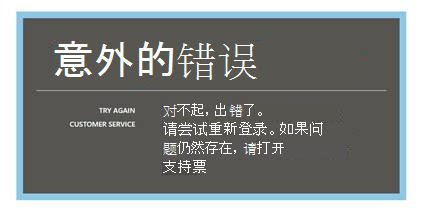
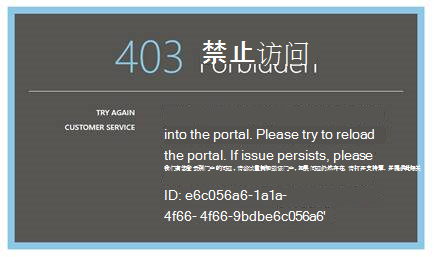
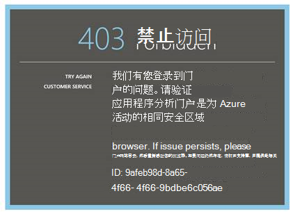
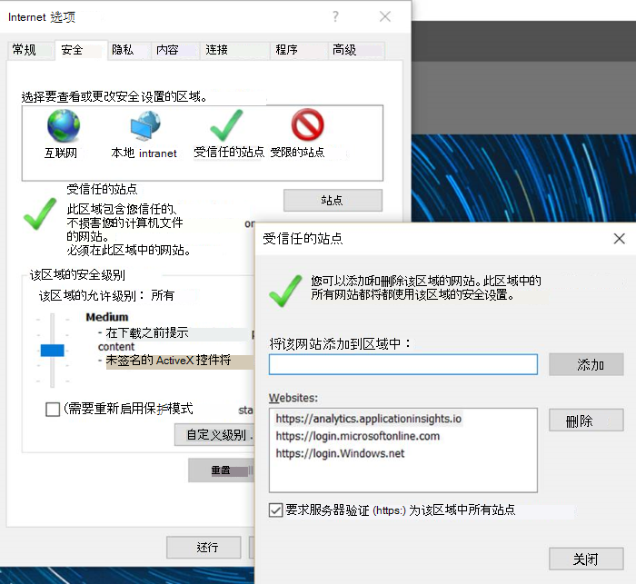
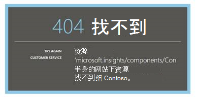
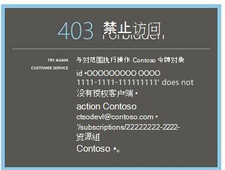
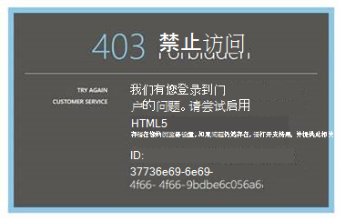
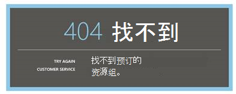
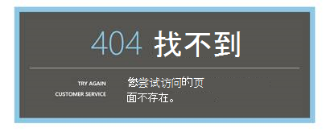

<properties 
    pageTitle="故障诊断分析的应用程序理解的功能强大的搜索工具 |Microsoft Azure" 
    description="与应用程序的见解分析有问题吗？ 从这里开始。 " 
    services="application-insights" 
    documentationCenter=""
    authors="alancameronwills" 
    manager="douge"/>

<tags 
    ms.service="application-insights" 
    ms.workload="tbd" 
    ms.tgt_pltfrm="ibiza" 
    ms.devlang="na" 
    ms.topic="article" 
    ms.date="07/11/2016" 
    ms.author="awills"/>

# 故障诊断中应用程序建议的分析

[深入分析应用程序](app-insights-analytics.md)的问题？ 从这里开始。 分析是一种功能强大的搜索工具 Visual Studio 应用程序理解。

## 限制

* 目前，查询结果被限制为只保留过去数据一周以上。
* 在我们测试的浏览器︰ 最新版本的 Chrome，边和 Internet Explorer。

## 已知的不兼容浏览器扩展

* Ghostery

禁用扩展或使用不同的浏览器。

##"意外的错误"

门户运行 – 未处理的异常时出现内部错误。

* 清除浏览器缓存。 

## 403...请尝试重新加载

身份验证相关的 （在身份验证期间或在访问令牌生成过程中） 时出错。 门户网站可能无法恢复而不更改浏览器设置。

* 验证在浏览器中[启用第三方 cookie](#cookies) 。 

## 403...验证安全区域

身份验证相关的 （在身份验证期间或在访问令牌生成过程中） 时出错。 门户网站可能无法恢复而不更改浏览器设置。

1. 验证在浏览器中[启用第三方 cookie](#cookies) 。 

2. 是否使用收藏夹、 书签或已保存的链接来打开分析门户网站？ 您是否在登录比您保存该链接时，使用不同的凭据？

2. 请尝试 （后关闭所有此类窗口） 使用专用/incognito 浏览器窗口。 您需要提供您的凭据。 

2. 打开另一个 （普通） 的浏览器窗口，然后转到[Azure](https://portal.azure.com)。 注销。 然后打开您的链接和使用正确的凭据登录。

2. 不支持受信任的区域设置时，边缘和 Internet Explorer 用户还可以收到此错误。

    验证[分析门户](https://analytics.applicationinsights.io)和[Azure Active Directory 门户](https://portal.azure.com)都处于相同的安全区域︰

 * 在 Internet Explorer 中打开**Internet 选项**、**安全**、**受信任的站点**、**网站**:

    

    在网站列表中，如果包含任何下列 Url，请确保，其他还有包括︰

    https://analytics.applicationinsights.io 
   https://login.microsoftonline.com 
   https://login.windows.net

## 404 中...未找到资源

应用程序资源从应用程序的见解已被删除并将不再可用。 如果在保存到分析网页的 URL 就可以看见。

## 403...未授权

您没有权限在分析中打开此应用程序。

* 您没有从别人获取链接？ 问他们，以确保在[读者或此资源组的参与者](app-insights-resources-roles-access-control.md)。
* 保存链接使用不同的凭据？ 打开[Azure 门户](https://portal.azure.com)，接着又退出，然后重试此链接，提供正确的凭据。

## 403...HTML5 存储

我们的门户网站使用 HTML5 localStorage 和 sessionStorage。

* 铬色︰ 设置，隐私，内容设置。
* Internet Explorer: Internet 选项，高级选项卡上，安全、 启用 DOM 存储

## 404 中...找不到预订

URL 无效。 

* 在[应用程序的见解门户](https://portal.azure.com)打开应用程序资源。 然后，使用分析按钮。

## 404...页面不再存在

URL 无效。

* 在[应用程序的见解门户](https://portal.azure.com)打开应用程序资源。 然后，使用分析按钮。

## 启用第三方 cookie

  了解[如何禁用第三方 cookie](http://www.digitalcitizen.life/how-disable-third-party-cookies-all-major-browsers)，但是请注意我们需要**启用**他们。

## 如果其他所有方法均失败    

[请与我们联系](app-insights-get-dev-support.md)。
 
[AZURE.INCLUDE [app-insights-analytics-footer](../../includes/app-insights-analytics-footer.md)]

