<properties 
    pageTitle="使用分析的应用程序理解的功能强大的搜索工具 |Microsoft Azure" 
    description="使用分析诊断功能强大的搜索工具的应用程序的见解。 " 
    services="application-insights" 
    documentationCenter=""
    authors="danhadari" 
    manager="douge"/>

<tags 
    ms.service="application-insights" 
    ms.workload="tbd" 
    ms.tgt_pltfrm="ibiza" 
    ms.devlang="na" 
    ms.topic="article" 
    ms.date="10/21/2016" 
    ms.author="awills"/>

# 在应用程序的见解中使用分析

[分析](app-insights-analytics.md)是一种功能强大的搜索功能的[应用程序的见解](app-insights-overview.md)。 这些页面描述分析查询语言。

* **[观看介绍性视频](https://applicationanalytics-media.azureedge.net/home_page_video.mp4)**。
* **[测试驱动器在模拟数据的分析](https://analytics.applicationinsights.io/demo)**如果您的应用程序不会将数据发送到应用程序的见解尚。

## 打开分析

从您的应用程序在应用程序的见解的家庭资源，请单击分析。

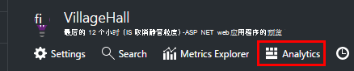

内联教程为您提供有关您可以执行一些建议。

还有[这里更广泛推介](app-insights-analytics-tour.md)。

## 查询您遥测

### 编写查询

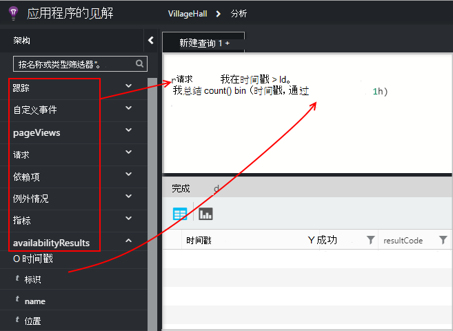

开头的任何左 （或[范围内](app-insights-analytics-reference.md#range-operator)或[联合](app-insights-analytics-reference.md#union-operator)运算符） 上列出的表的名称。 使用`|`创建管线的[运算符](app-insights-analytics-reference.md#queries-and-operators)。 IntelliSense 会提示您使用运算符和一些可以使用的表达式元素。

请参见[分析语言概述](app-insights-analytics-tour.md)和[语言参考](app-insights-analytics-reference.md)。

### 运行查询

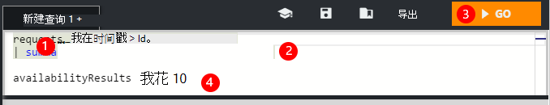

1. 您可以在查询中使用一个分行符。
2. 将光标内部或要运行的查询的末尾。
3. 单击以运行查询。
4. 不要放置在查询中的空行。 用空行分隔，可以将多个单独的查询保存在某个查询选项卡上。 只有使用光标一个运行。

### 保存查询

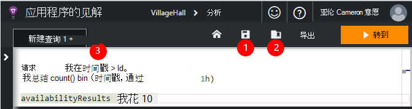

1. 保存当前查询文件。
2. 打开已保存的查询文件。
3. 创建新的查询文件。

## 详细信息，请参阅

展开结果的属性的完整列表，请参阅中的任意一行。 您可进一步展开的例如是一个结构化的值的任何属性、 自定义尺寸或列出异常的堆栈。

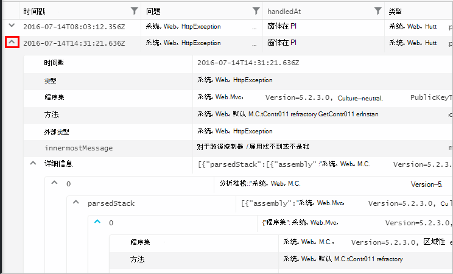

 

## 结果排列

可以排序、 筛选、 分页，和分组查询所返回的结果。

> [AZURE.NOTE] 排序、 分组和筛选在浏览器中不重新运行查询。 他们只有重新排列，您上一次查询所返回的结果。 
> 
> 若要在服务器中执行这些任务，将返回结果之前，请与[排序](app-insights-analytics-reference.md#sort-operator)[汇总](app-insights-analytics-reference.md#summarize-operator)，[其中](app-insights-analytics-reference.md#where-operator)运算符编写查询。

选择您想要看到、 拖动列标题来重新排列它们，然后通过拖动边框来调整列的大小的列。

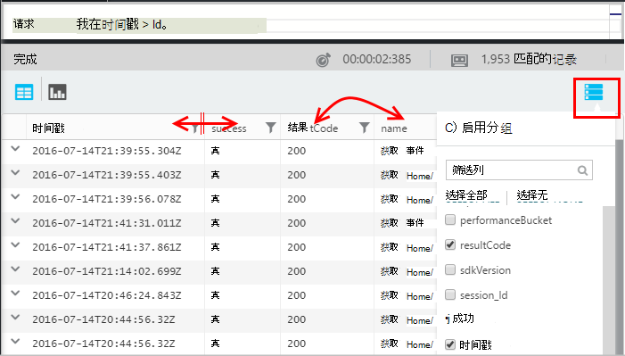

### 排序和筛选项目

通过单击列标题来排序您的结果。 再次单击可进行排序的方式，然后单击第三个恢复为原始排序查询所返回的时间。

使用的筛选器图标来缩小搜索范围。

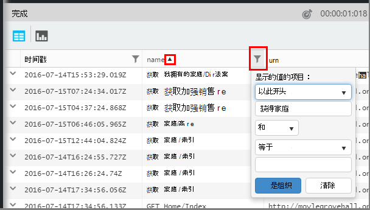

### 对项目进行分组

若要按多个列排序，请使用分组。 第一次启用它，，然后将列标题拖至表格上方的空间。

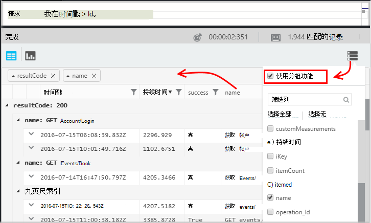

### 缺少某些结果？

没有了约 10 个 k 行上从门户所返回的结果的限制。 警告显示是否超出该限制。 如果发生这种情况，排序您表中的结果不会始终显示所有实际的第一个或最后一个结果。 

它是很好的做法，以避免达到限制。 如使用运算符︰

* [在时间戳 > ago(3d)](app-insights-analytics-reference.md#where-operator)
* [排名前 100 位的时间戳](app-insights-analytics-reference.md#top-operator) 
* [100](app-insights-analytics-reference.md#take-operator)
* [总结](app-insights-analytics-reference.md#summarize-operator) 

## 关系图

选择的图表类型︰

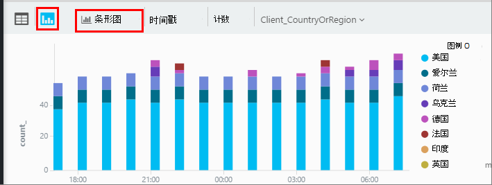

如果您有多个列的正确类型，您可以选择在 x 和 y 轴和列的尺寸要拆分的结果。

默认情况下，结果最初显示为一个表，并手动选择的关系图。 但您可以使用[呈现指令](app-insights-analytics-reference.md#render-directive)末尾的查询以选择一个图表。

## 附到仪表板

您可以锁定一个关系图或表添加到一个您[共享仪表板](app-insights-dashboards.md)-只需单击 pin。 （您可能需要[升级您的应用程序的定价包](app-insights-pricing.md)来启用此功能。） 

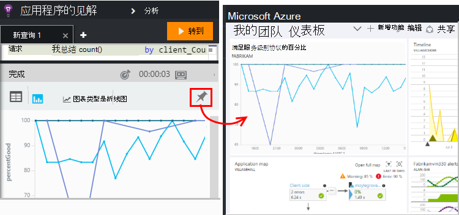

这意味着，放在一起后仪表板可帮助您监视的性能或 web 服务的使用情况，可以包括与其他指标一起相当复杂的分析。 

如果它有四个或更少的列，您可以锁定到仪表板，一个表。 前七行显示。

#### 仪表板刷新

通过重新运行查询大约每半小时自动刷新图表固定到仪表板。

#### 自动简化

在某些情况下，某些简化应用于图表时将其锁定到仪表板。

当针显示大量的离散区间 （通常条形图），降低填充纸盒的图表会自动分组到一个储料箱"其他人"。 例如，以下查询︰

    requests | summarize count_search = count() by client_CountryOrRegion

在分析中，如下所示︰

但是，当您将其锁定到仪表板，它如下所示︰

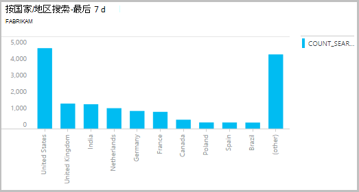

## 导出到 Excel 中

已运行查询后，您可以下载一个.csv 文件。 单击**导出到 Excel**。

## 将导出到电源 BI

将光标放在查询中，然后选择**导出到电源 BI**。

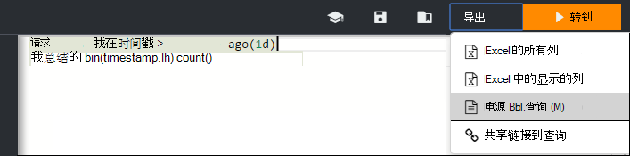

在电源 BI 运行查询。 您可以设置以刷新时间表。

与电源 BI，您可以创建将从各种来源的数据结合到一起的仪表板。

[了解更多有关导出到电源 BI](app-insights-export-power-bi.md)

[AZURE.INCLUDE [app-insights-analytics-footer](../../includes/app-insights-analytics-footer.md)]

